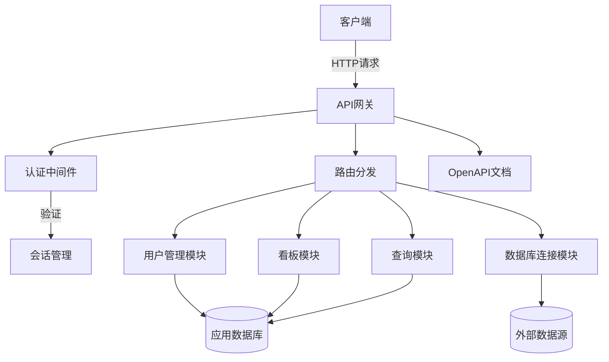
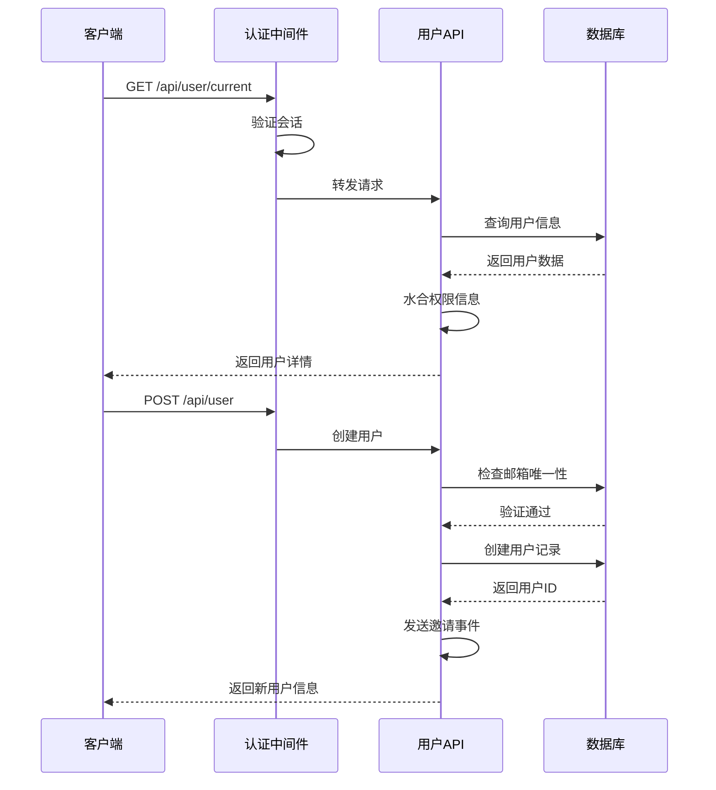
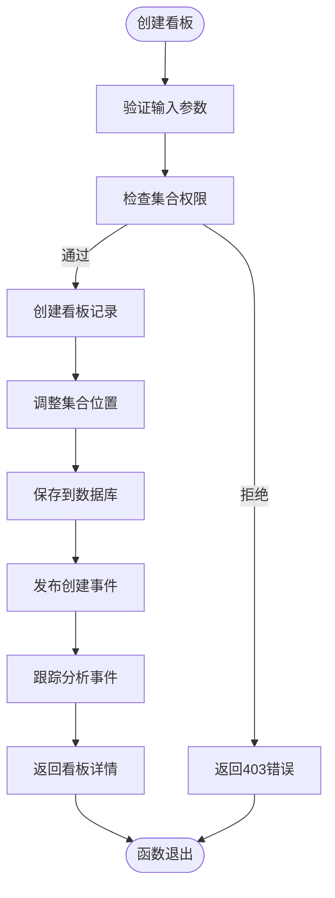
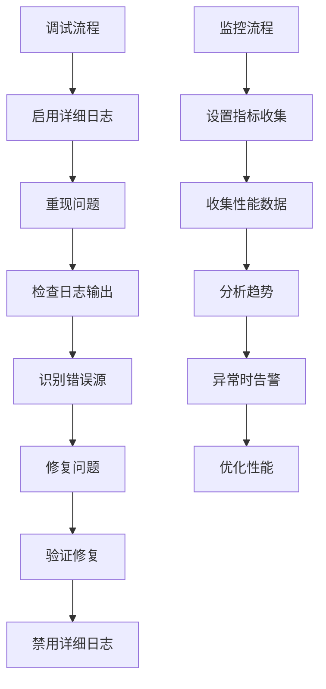

# API参考

<cite>
**本文档中引用的文件**  
- [common.clj](file://src/metabase/api/common.clj)
- [macros.clj](file://src/metabase/api/macros.clj)
- [users/api.clj](file://src/metabase/users/api.clj)
- [dashboards/api.clj](file://src/metabase/dashboards/api.clj)
- [api_routes/routes.clj](file://src/metabase/api_routes/routes.clj)
- [response.clj](file://src/metabase/api/response.clj)
- [open_api.clj](file://src/metabase/api/open_api.clj)
- [docs.clj](file://src/metabase/api/docs.clj)
</cite>

## 目录
1. [引言](#引言)
2. [API架构概述](#api架构概述)
3. [核心组件分析](#核心组件分析)
4. [详细组件分析](#详细组件分析)
5. [中间件管道](#中间件管道)
6. [客户端实现指南](#客户端实现指南)
7. [调试与监控](#调试与监控)
8. [结论](#结论)

## 引言
Metabase RESTful API为系统提供了全面的程序化访问接口，支持用户管理、数据库连接、查询执行、看板操作等核心功能。API设计遵循REST原则，使用标准的HTTP方法和状态码，通过JSON格式进行数据交换。系统采用Clojure语言实现，利用`defendpoint`宏定义所有API端点，确保了一致的错误处理和参数验证机制。API支持基于JWT的认证，并通过OpenAPI规范提供自动生成的文档。

## API架构概述

**图源**  
- [api_routes/routes.clj](file://src/metabase/api_routes/routes.clj#L1-L209)
- [users/api.clj](file://src/metabase/users/api.clj#L1-L593)
- [dashboards/api.clj](file://src/metabase/dashboards/api.clj#L1-L799)

## 核心组件分析

Metabase API的核心组件包括用户管理、看板操作、查询执行和数据库连接等模块。系统使用`defendpoint`宏统一定义所有API端点，该宏提供了自动的参数验证、错误处理和响应格式化功能。API通过中间件管道处理认证、权限检查和请求预处理。所有端点都遵循一致的响应格式，包含状态码、错误信息和数据负载。系统支持API版本控制，通过URL路径进行版本管理。

**节源**  
- [common.clj](file://src/metabase/api/common.clj#L1-L587)
- [macros.clj](file://src/metabase/api/macros.clj#L1-L799)

## 详细组件分析

### 用户管理模块分析

**图源**  
- [users/api.clj](file://src/metabase/users/api.clj#L1-L593)
- [common.clj](file://src/metabase/api/common.clj#L1-L587)

### 看板操作模块分析

**图源**  
- [dashboards/api.clj](file://src/metabase/dashboards/api.clj#L1-L799)
- [common.clj](file://src/metabase/api/common.clj#L1-L587)

## 中间件管道

Metabase API的中间件管道负责处理认证、权限检查、请求验证和响应格式化。管道从最外层的路由中间件开始，依次经过认证中间件、权限检查中间件，最后到达具体的API处理函数。每个中间件都遵循函数式编程原则，接收一个处理函数并返回一个新的处理函数。认证中间件验证JWT令牌或会话cookie，权限中间件检查用户是否有权访问特定资源，响应中间件确保所有响应都符合预期的JSON格式。

**图源**  
- [common.clj](file://src/metabase/api/common.clj#L1-L587)
- [macros.clj](file://src/metabase/api/macros.clj#L1-L799)

## 客户端实现指南

客户端可以通过多种编程语言与Metabase API交互。基本的交互模式包括：首先通过POST /api/session端点进行认证，获取会话ID；然后在后续请求的Header中包含X-Metabase-Session头；最后根据需要调用相应的API端点。对于错误处理，客户端应检查HTTP状态码并解析响应体中的错误信息。建议使用支持异步操作的HTTP客户端库，以提高性能。对于复杂操作，如批量创建看板卡片，应使用事务或分批处理。

**节源**  
- [users/api.clj](file://src/metabase/users/api.clj#L1-L593)
- [response.clj](file://src/metabase/api/response.clj#L1-L10)

## 调试与监控

调试Metabase API时，可以启用详细的日志记录来跟踪请求处理流程。系统提供了内置的监控端点，可用于检查API的健康状态和性能指标。对于生产环境，建议配置集中式日志收集和监控系统。API的错误响应包含详细的错误代码和消息，有助于快速定位问题。开发人员可以使用OpenAPI文档中的交互式测试功能来验证API行为。对于性能问题，可以分析查询执行时间和数据库访问模式。

**图源**  
- [common.clj](file://src/metabase/api/common.clj#L1-L587)
- [docs.clj](file://src/metabase/api/docs.clj#L1-L73)

## 结论

Metabase RESTful API提供了一套完整、一致且安全的接口，用于程序化访问和管理分析平台。通过`defendpoint`宏的统一设计，API确保了所有端点都遵循相同的错误处理、参数验证和响应格式规范。系统的模块化架构使得功能扩展和维护更加容易。OpenAPI集成提供了自动生成的文档和交互式测试界面，大大降低了API的使用门槛。对于开发者而言，理解中间件管道的工作原理和错误处理机制是有效使用API的关键。