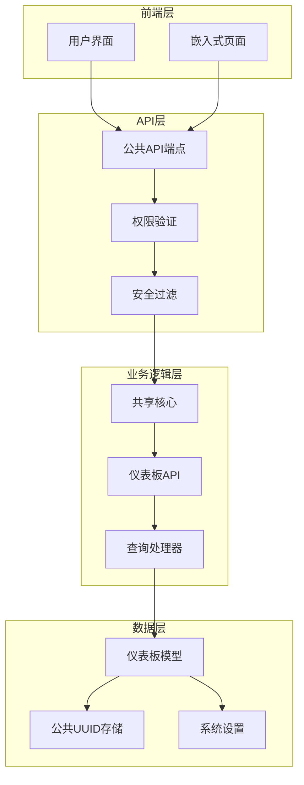
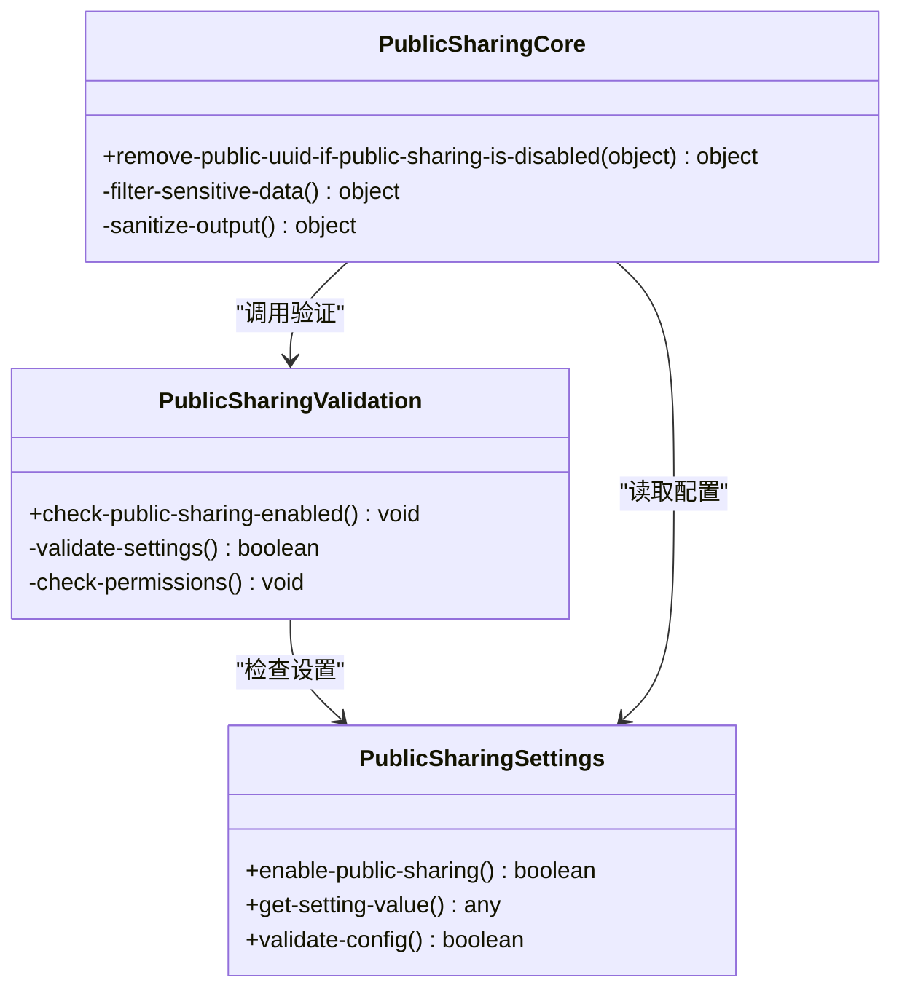
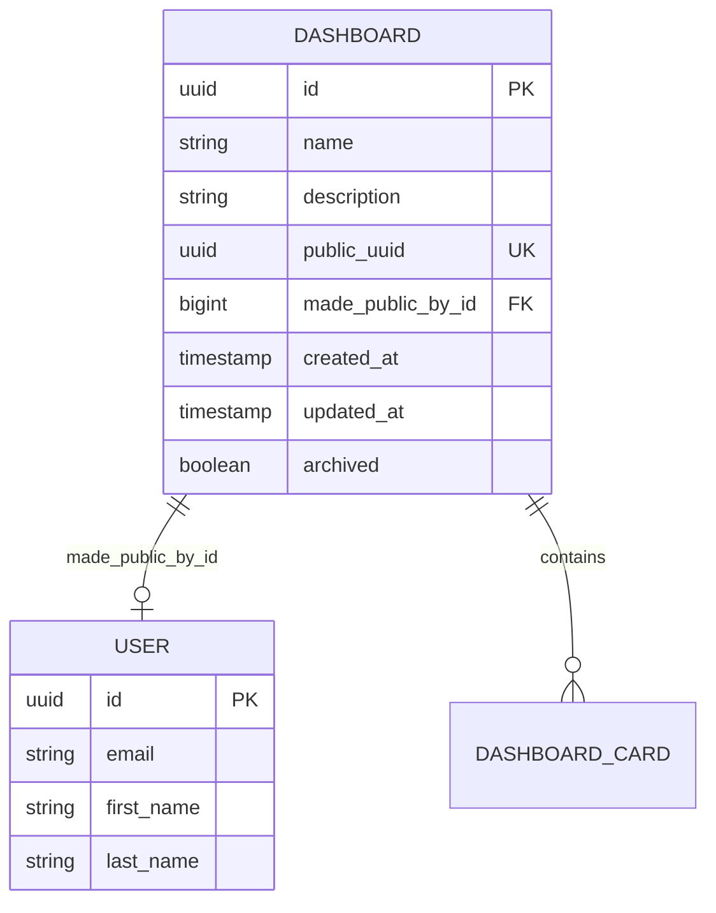
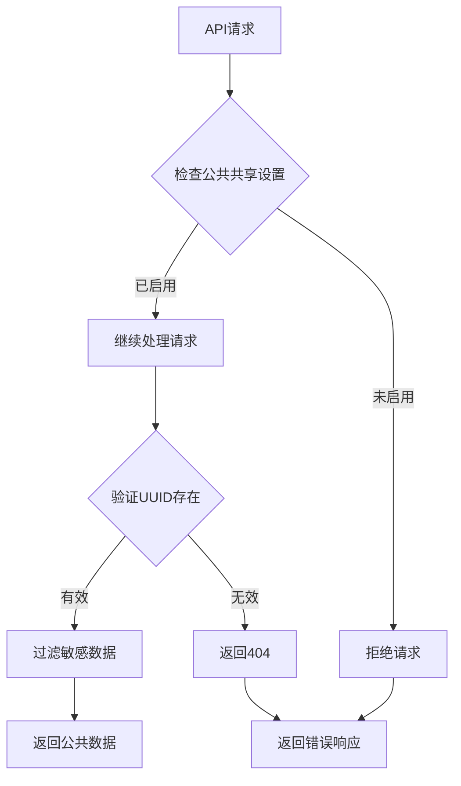
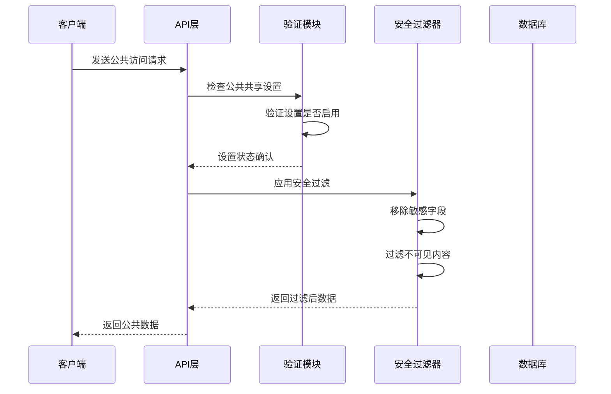
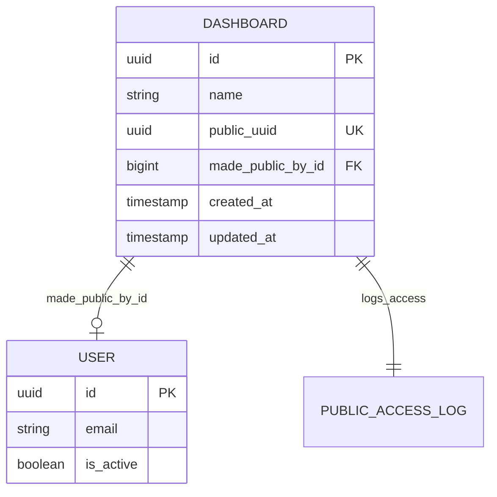

# 仪表板公共共享

<cite>
**本文档中引用的文件**
- [api.clj](file://src/metabase/public_sharing/api.clj)
- [core.clj](file://src/metabase/public_sharing/core.clj)
- [validation.clj](file://src/metabase/public_sharing/validation.clj)
- [settings.clj](file://src/metabase/public_sharing/settings.clj)
- [dashboard.clj](file://src/metabase/dashboards/models/dashboard.clj)
- [dashboard_api.clj](file://src/metabase/dashboards/api.clj)
- [dashboard_schema.clj](file://src/metabase/dashboards/schema.clj)
</cite>

## 目录
1. [简介](#简介)
2. [系统架构概览](#系统架构概览)
3. [核心组件分析](#核心组件分析)
4. [API端点详解](#api端点详解)
5. [权限验证机制](#权限验证机制)
6. [数据模型设计](#数据模型设计)
7. [安全风险与最佳实践](#安全风险与最佳实践)
8. [使用示例](#使用示例)
9. [故障排除指南](#故障排除指南)
10. [总结](#总结)

## 简介

仪表板公共共享功能是Metabase中的一个关键特性，允许管理员创建可公开访问的仪表板链接，使外部用户无需登录即可查看仪表板内容。该功能通过生成唯一的公共UUID来实现，支持多种访问模式，包括直接访问和嵌入式iframe。

### 主要特性
- **公共访问链接生成**：为仪表板生成唯一的公共UUID
- **权限控制**：基于设置的全局开关进行访问控制
- **安全过滤**：自动移除敏感字段和数据
- **多格式支持**：支持多种导出格式（CSV、JSON、XLSX）
- **嵌入式支持**：提供oEmbed协议支持

## 系统架构概览

仪表板公共共享功能采用分层架构设计，主要包含以下层次：



**图表来源**
- [api.clj](file://src/metabase/public_sharing/api.clj#L1-L50)
- [core.clj](file://src/metabase/public_sharing/core.clj#L1-L13)

## 核心组件分析

### 公共共享验证模块

验证模块负责确保公共共享功能的正确性和安全性：



**图表来源**
- [validation.clj](file://src/metabase/public_sharing/validation.clj#L1-L12)
- [settings.clj](file://src/metabase/public_sharing/settings.clj#L1-L12)
- [core.clj](file://src/metabase/public_sharing/core.clj#L1-L13)

### 仪表板模型扩展

仪表板模型通过添加公共UUID字段来支持公共共享功能：



**图表来源**
- [dashboard.clj](file://src/metabase/dashboards/models/dashboard.clj#L406-L431)

**章节来源**
- [validation.clj](file://src/metabase/public_sharing/validation.clj#L1-L12)
- [settings.clj](file://src/metabase/public_sharing/settings.clj#L1-L12)
- [core.clj](file://src/metabase/public_sharing/core.clj#L1-L13)
- [dashboard.clj](file://src/metabase/dashboards/models/dashboard.clj#L406-L431)

## API端点详解

### 仪表板公共访问端点

#### 获取公共仪表板
**端点**: `GET /api/dashboard/:uuid`
**功能**: 获取指定UUID的公共仪表板
**请求参数**:
- `uuid`: 仪表板的公共UUID（必需）

**响应结构**:
```json
{
  "id": 123,
  "name": "销售仪表板",
  "description": "月度销售数据概览",
  "public_uuid": "abc123-def456-ghi789",
  "dashcards": [
    {
      "id": 456,
      "card": {
        "id": 789,
        "name": "销售额趋势",
        "display": "line",
        "parameters": []
      },
      "size_x": 12,
      "size_y": 6
    }
  ]
}
```

#### 删除公共链接
**端点**: `DELETE /api/dashboard/:dashboard-id/public_link`
**功能**: 撤销仪表板的公共访问权限
**请求参数**:
- `dashboard-id`: 仪表板ID（必需）

**权限要求**: 需要应用设置权限

#### 查询仪表板卡片
**端点**: `GET /api/dashboard/:uuid/dashcard/:dashcard-id/card/:card-id/query`
**功能**: 获取仪表板中特定卡片的查询结果
**请求参数**:
- `uuid`: 仪表板公共UUID
- `dashcard-id`: 仪表板卡片ID
- `card-id`: 卡片ID
- `parameters`: 查询参数（可选）

### 卡片公共访问端点

#### 获取公共卡片
**端点**: `GET /api/card/:uuid`
**功能**: 获取指定UUID的公共卡片
**请求参数**:
- `uuid`: 卡片的公共UUID

#### 查询公共卡片
**端点**: `GET /api/card/:uuid/query`
**功能**: 获取公共卡片的查询结果
**请求参数**:
- `uuid`: 卡片公共UUID
- `parameters`: 查询参数（可选）

#### 导出公共卡片数据
**端点**: `GET /api/card/:uuid/query/:export-format`
**功能**: 以指定格式导出公共卡片数据
**请求参数**:
- `uuid`: 卡片公共UUID
- `export-format`: 导出格式（csv、json、xlsx）
- `parameters`: 查询参数（可选）

### 参数值获取端点

#### 获取参数值
**端点**: `GET /api/card/:uuid/params/:param-key/values`
**功能**: 获取公共卡片参数的可用值
**请求参数**:
- `uuid`: 卡片公共UUID
- `param-key`: 参数键名

#### 搜索参数值
**端点**: `GET /api/card/:uuid/params/:param-key/search/:query`
**功能**: 搜索公共卡片参数的值
**请求参数**:
- `uuid`: 卡片公共UUID
- `param-key`: 参数键名
- `query`: 搜索查询

**章节来源**
- [api.clj](file://src/metabase/public_sharing/api.clj#L100-L200)
- [dashboard_api.clj](file://src/metabase/dashboards/api.clj#L1079-L1104)

## 权限验证机制

### 全局设置验证

系统通过全局设置控制公共共享功能的启用状态：



**图表来源**
- [validation.clj](file://src/metabase/public_sharing/validation.clj#L8-L11)

### 数据过滤机制

公共共享功能实现了多层次的数据过滤：

1. **字段级过滤**: 移除敏感字段
2. **内容级过滤**: 过滤不可见的内容
3. **权限级过滤**: 基于用户权限进行过滤

### 安全检查流程



**图表来源**
- [api.clj](file://src/metabase/public_sharing/api.clj#L60-L90)
- [core.clj](file://src/metabase/public_sharing/core.clj#L6-L12)

**章节来源**
- [validation.clj](file://src/metabase/public_sharing/validation.clj#L1-L12)
- [core.clj](file://src/metabase/public_sharing/core.clj#L1-L13)

## 数据模型设计

### 仪表板模型扩展

仪表板模型通过添加以下字段来支持公共共享功能：

| 字段名 | 类型 | 描述 | 约束 |
|--------|------|------|------|
| `public_uuid` | UUID | 公共访问UUID | 唯一索引，可为空 |
| `made_public_by_id` | BigInt | 创建公共链接的用户ID | 外键，指向用户表 |

### 数据库迁移策略

系统采用渐进式迁移策略：
1. **字段添加**: 在仪表板表中添加`public_uuid`和`made_public_by_id`字段
2. **默认值**: 新记录默认为`null`
3. **向后兼容**: 已存在的记录保持不变
4. **清理机制**: 当公共共享禁用时自动清理UUID

### 数据完整性约束



**图表来源**
- [dashboard.clj](file://src/metabase/dashboards/models/dashboard.clj#L406-L431)

**章节来源**
- [dashboard.clj](file://src/metabase/dashboards/models/dashboard.clj#L406-L431)

## 安全风险与最佳实践

### 主要安全风险

1. **数据泄露风险**
   - 敏感数据暴露给未经授权的用户
   - 参数化查询可能导致SQL注入

2. **权限绕过风险**
   - 通过公共链接访问受限制的数据
   - 跨仪表板数据访问

3. **滥用风险**
   - 频率限制不足导致服务滥用
   - 嵌入式内容的安全问题

### 安全最佳实践

#### 访问控制
- **最小权限原则**: 只授予必要的访问权限
- **定期审计**: 监控公共链接的使用情况
- **时间限制**: 实施合理的链接有效期

#### 数据保护
- **字段过滤**: 自动移除敏感字段
- **内容脱敏**: 对敏感数据进行脱敏处理
- **查询限制**: 限制复杂查询的执行

#### 性能优化
- **缓存策略**: 实施适当的缓存机制
- **频率限制**: 对公共API实施速率限制
- **资源监控**: 监控系统资源使用情况

### 配置建议

#### 全局设置配置
```clojure
;; 启用公共共享功能
(defsetting enable-public-sharing
  "允许管理员为问题和仪表板创建公开可查看的链接（以及可嵌入的iframe）"
  :type :boolean
  :default true
  :visibility :authenticated)
```

#### 安全配置建议
- **启用审计日志**: 记录所有公共访问活动
- **实施频率限制**: 防止API滥用
- **定期清理**: 清理过期的公共链接

**章节来源**
- [settings.clj](file://src/metabase/public_sharing/settings.clj#L1-L12)
- [api.clj](file://src/metabase/public_sharing/api.clj#L580-L631)

## 使用示例

### 启用公共共享

#### 通过管理界面
1. 登录Metabase管理员账户
2. 导航到"设置" > "应用程序"
3. 找到"公共共享"设置
4. 启用"允许管理员为问题和仪表板创建公开可查看的链接"

#### 通过API
```bash
curl -X PUT \
  -H "Content-Type: application/json" \
  -H "Authorization: Bearer YOUR_API_TOKEN" \
  -d '{"enable-public-sharing": true}' \
  https://your-metabase-instance/api/setting/enable-public-sharing
```

### 生成公共链接

#### 通过仪表板编辑器
1. 编辑目标仪表板
2. 点击"分享"按钮
3. 选择"公开链接"
4. 系统自动生成公共UUID

#### 通过API
```bash
curl -X POST \
  -H "Content-Type: application/json" \
  -H "Authorization: Bearer YOUR_API_TOKEN" \
  https://your-metabase-instance/api/dashboard/123/public_link
```

### 访问公共仪表板

#### 直接访问
```
https://your-metabase-instance/dashboard/abc123-def456-ghi789
```

#### 嵌入式访问
```html
<iframe 
  src="https://your-metabase-instance/dashboard/abc123-def456-ghi789"
  width="800" 
  height="600" 
  frameborder="0">
</iframe>
```

### 导出数据

#### CSV格式导出
```bash
curl -X GET \
  https://your-metabase-instance/api/card/abc123-def456-ghi789/query/csv \
  -H "Authorization: Bearer YOUR_API_TOKEN" \
  --output data.csv
```

#### JSON格式导出
```bash
curl -X GET \
  https://your-metabase-instance/api/card/abc123-def456-ghi789/query/json \
  -H "Authorization: Bearer YOUR_API_TOKEN" \
  -o data.json
```

### 参数化查询

#### 带参数的查询
```bash
curl -X GET \
  -H "Content-Type: application/json" \
  -H "Authorization: Bearer YOUR_API_TOKEN" \
  https://your-metabase-instance/api/card/abc123-def456-ghi789/query?parameters={"date_range":"2024-01-01,2024-12-31"}
```

**章节来源**
- [dashboard_api.clj](file://src/metabase/dashboards/api.clj#L1079-L1104)
- [api.clj](file://src/metabase/public_sharing/api.clj#L100-L200)

## 故障排除指南

### 常见问题及解决方案

#### 问题1: 公共共享功能无法使用
**症状**: 尝试创建公共链接时收到"公共共享未启用"错误

**解决方案**:
1. 检查全局设置是否启用
2. 验证当前用户是否有足够的权限
3. 确认仪表板未被归档或删除

#### 问题2: 公共链接无法访问
**症状**: 使用公共链接时显示404错误

**解决方案**:
1. 验证公共UUID是否正确
2. 检查仪表板是否仍处于激活状态
3. 确认公共共享功能已重新启用

#### 问题3: 数据不完整或缺失
**症状**: 公共访问时某些数据未显示

**解决方案**:
1. 检查数据过滤规则
2. 验证用户权限设置
3. 确认查询结果无错误

### 性能优化建议

#### 缓存策略
- 实施适当的查询结果缓存
- 使用CDN加速静态资源加载
- 优化数据库查询性能

#### 监控指标
- 公共链接访问频率
- 查询响应时间
- 错误率统计

### 日志分析

#### 关键日志事件
- 公共链接创建事件
- 公共访问尝试事件
- 权限验证失败事件
- 查询执行异常事件

#### 日志配置
```clojure
;; 启用详细日志记录
(log/set-level! :debug)
```

**章节来源**
- [validation.clj](file://src/metabase/public_sharing/validation.clj#L8-L11)
- [api.clj](file://src/metabase/public_sharing/api.clj#L580-L631)

## 总结

仪表板公共共享功能为Metabase提供了强大的外部数据展示能力，通过精心设计的架构和严格的安全控制，确保了功能的可用性和安全性。该功能的主要优势包括：

### 核心优势
- **易于使用**: 简单直观的配置和管理界面
- **灵活访问**: 支持多种访问模式和导出格式
- **安全可靠**: 多层次的安全验证和数据过滤
- **性能优化**: 高效的查询处理和缓存机制

### 最佳实践总结
1. **谨慎启用**: 仅在必要时启用公共共享功能
2. **定期审计**: 监控公共链接的使用情况
3. **数据脱敏**: 确保敏感数据不会意外暴露
4. **性能监控**: 关注系统资源使用情况

### 未来发展方向
- 增强的权限控制机制
- 更灵活的嵌入选项
- 改进的性能优化策略
- 更完善的审计功能

通过遵循本文档提供的指导原则和最佳实践，可以充分发挥仪表板公共共享功能的价值，同时确保系统的安全性和稳定性。