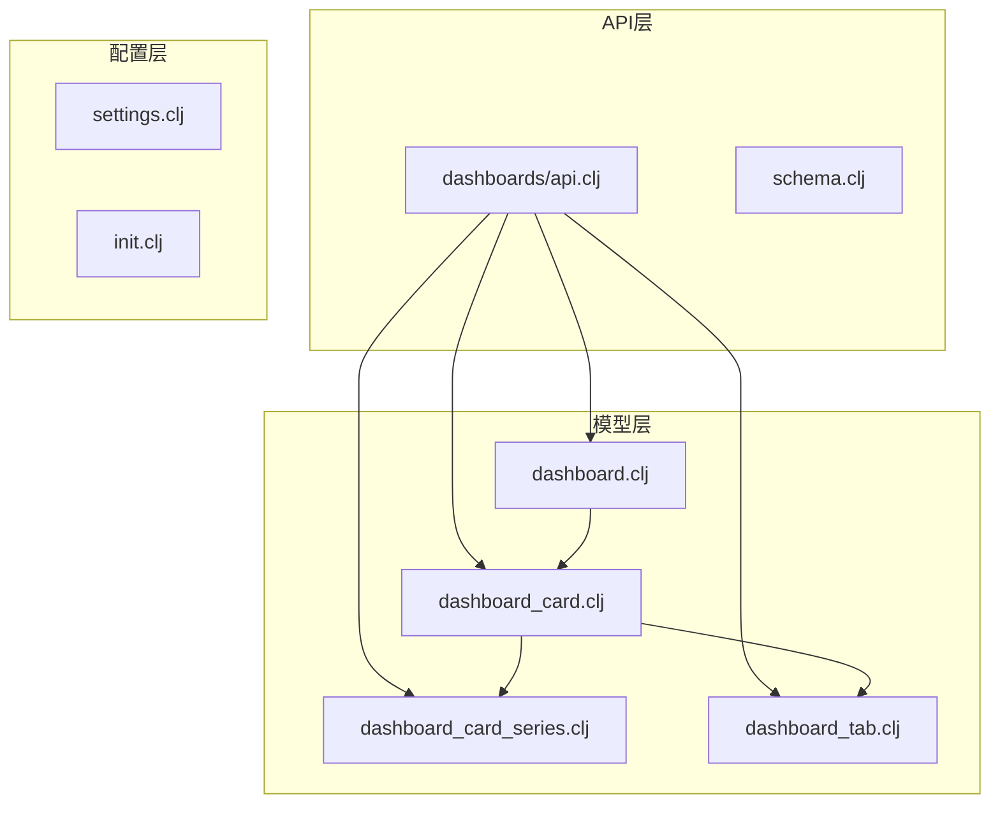
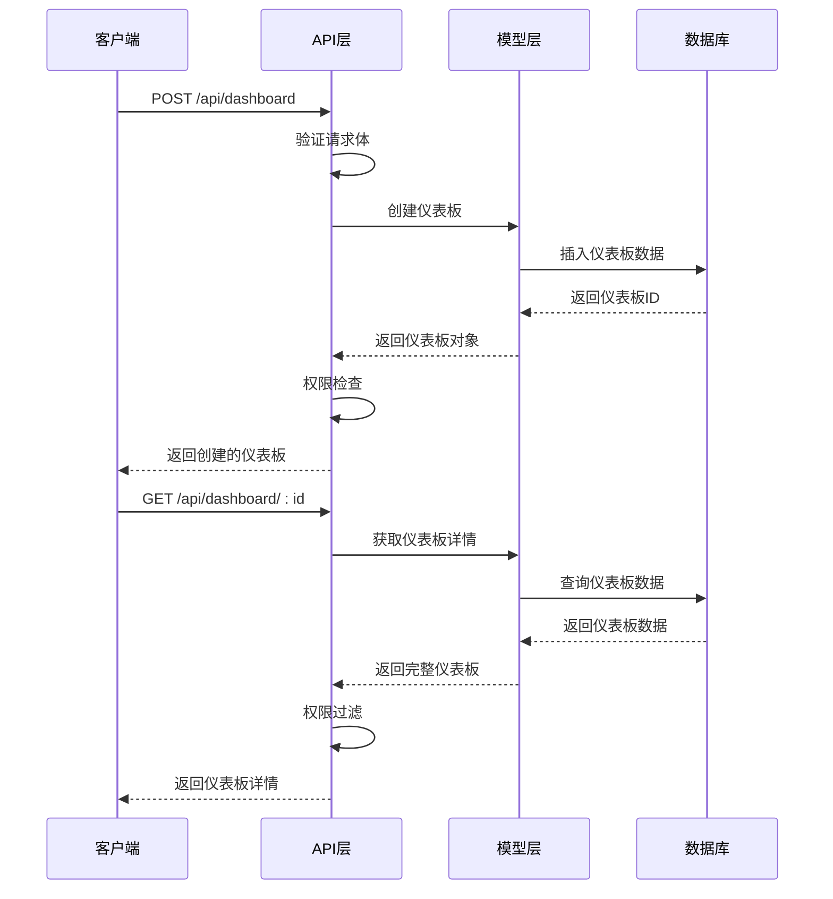
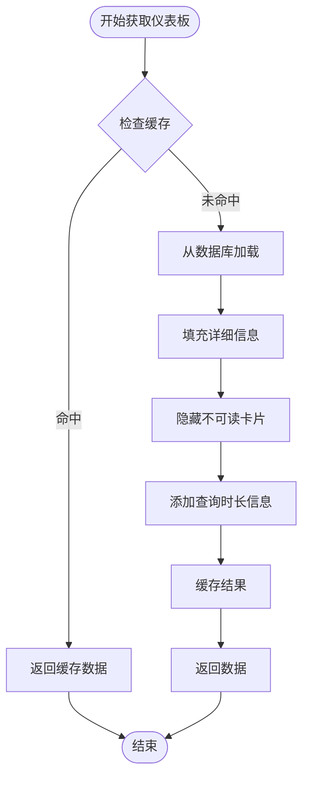
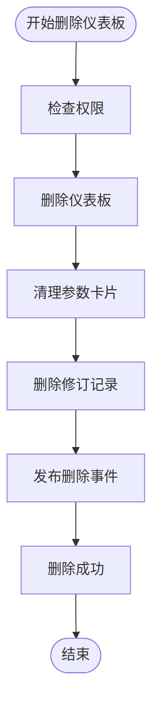
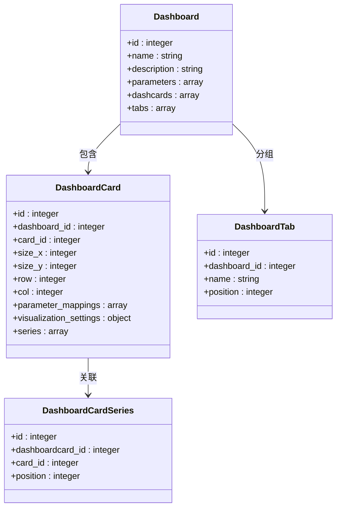
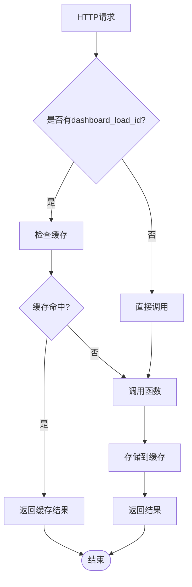
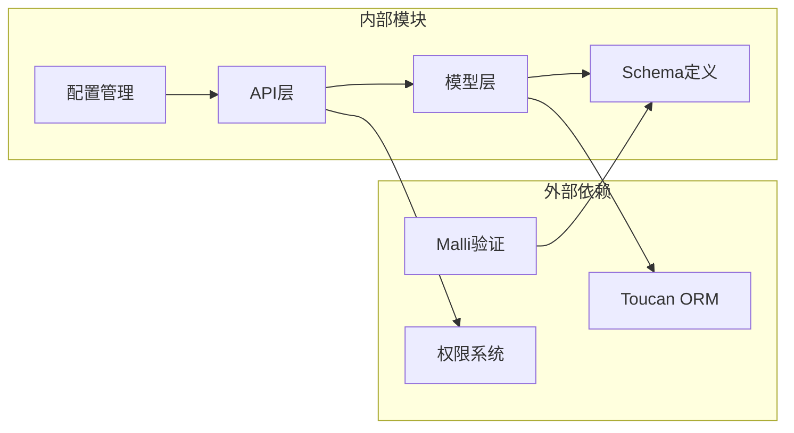

# 仪表板基本操作

<cite>
**本文档中引用的文件**
- [api.clj](file://src/metabase/dashboards/api.clj)
- [schema.clj](file://src/metabase/dashboards/schema.clj)
- [dashboard.clj](file://src/metabase/dashboards/models/dashboard.clj)
- [dashboard_card.clj](file://src/metabase/dashboards/models/dashboard_card.clj)
- [dashboard_card_series.clj](file://src/metabase/dashboards/models/dashboard_card_series.clj)
- [dashboard_tab.clj](file://src/metabase/dashboards/models/dashboard_tab.clj)
- [dashboard.settings.clj](file://src/metabase/dashboards/settings.clj)
- [dashboard.schema.clj](file://src/metabase/dashboards/schema.clj)
- [dashboard.init.clj](file://src/metabase/dashboards/init.clj)
- [dashboard.schema.clj](file://src/metabase/dashboards/schema.clj)
- [dashboard.settings.clj](file://src/metabase/dashboards/settings.clj)
</cite>

## 目录
1. [简介](#简介)
2. [项目结构](#项目结构)
3. [核心组件](#核心组件)
4. [架构概览](#架构概览)
5. [详细组件分析](#详细组件分析)
6. [依赖关系分析](#依赖关系分析)
7. [性能考虑](#性能考虑)
8. [故障排除指南](#故障排除指南)
9. [结论](#结论)

## 简介

Metabase仪表板系统是一个复杂的数据可视化平台，提供了完整的CRUD（创建、读取、更新、删除）操作API。该系统支持嵌套的卡片（dashboard_card）和系列（series）数据结构，具备强大的权限控制机制和标签管理功能。本文档详细记录了仪表板的核心API操作，包括请求体结构、字段验证规则和响应格式。

## 项目结构

仪表板模块采用分层架构设计，主要包含以下核心文件：



**图表来源**
- [api.clj](file://src/metabase/dashboards/api.clj#L1-L50)
- [dashboard.clj](file://src/metabase/dashboards/models/dashboard.clj#L1-L50)

**章节来源**
- [api.clj](file://src/metabase/dashboards/api.clj#L1-L100)
- [dashboard.clj](file://src/metabase/dashboards/models/dashboard.clj#L1-L100)

## 核心组件

### 仪表板模型（Dashboard）

仪表板是整个系统的核心实体，包含了仪表板的基本信息、参数设置和关联的卡片集合。

### 卡片模型（DashboardCard）

每个仪表板包含多个仪表板卡片，这些卡片可以显示不同的查询结果或文本内容。

### 系列模型（DashboardCardSeries）

仪表板卡片支持添加额外的系列卡片，用于在同一图表中显示多个相关的查询结果。

### 标签模型（DashboardTab）

仪表板支持多标签页功能，允许用户将相关的卡片组织到不同的标签页中。

**章节来源**
- [dashboard.clj](file://src/metabase/dashboards/models/dashboard.clj#L200-L300)
- [dashboard_card.clj](file://src/metabase/dashboards/models/dashboard_card.clj#L1-L100)

## 架构概览

仪表板系统采用RESTful API设计模式，提供了完整的CRUD操作接口：



**图表来源**
- [api.clj](file://src/metabase/dashboards/api.clj#L130-L200)
- [dashboard.clj](file://src/metabase/dashboards/models/dashboard.clj#L100-L200)

## 详细组件分析

### 创建仪表板（POST /api/dashboard）

创建新仪表板的API端点支持以下请求体结构：

| 字段名 | 类型 | 必填 | 描述 |
|--------|------|------|------|
| name | string | 是 | 仪表板名称，不能为空字符串 |
| description | string | 否 | 仪表板描述 |
| parameters | array | 否 | 参数列表，包含参数定义 |
| cache_ttl | integer | 否 | 缓存生存时间（秒） |
| collection_id | integer | 否 | 所属集合ID |
| collection_position | integer | 否 | 在集合中的位置 |

**请求示例：**
```json
{
  "name": "销售仪表板",
  "description": "销售数据统计仪表板",
  "parameters": [
    {
      "id": "date_range",
      "name": "日期范围",
      "type": "date/all-options"
    }
  ],
  "cache_ttl": 3600,
  "collection_id": 1,
  "collection_position": 1
}
```

**响应格式：**
```json
{
  "id": 123,
  "name": "销售仪表板",
  "description": "销售数据统计仪表板",
  "parameters": [...],
  "creator_id": 1,
  "created_at": "2024-01-01T00:00:00Z",
  "updated_at": "2024-01-01T00:00:00Z",
  "dashcards": [],
  "tabs": []
}
```

**章节来源**
- [api.clj](file://src/metabase/dashboards/api.clj#L130-L180)

### 读取仪表板（GET /api/dashboard/:id）

获取指定ID的仪表板详情，支持加载ID缓存机制：



**图表来源**
- [api.clj](file://src/metabase/dashboards/api.clj#L400-L500)

**章节来源**
- [api.clj](file://src/metabase/dashboards/api.clj#L576-L620)

### 更新仪表板（PUT /api/dashboard/:id）

更新仪表板及其关联的卡片和标签：

| 字段名 | 类型 | 描述 |
|--------|------|------|
| name | string | 仪表板名称 |
| description | string | 描述信息 |
| archived | boolean | 是否归档 |
| dashcards | array | 卡片列表 |
| tabs | array | 标签列表 |

**章节来源**
- [api.clj](file://src/metabase/dashboards/api.clj#L1010-L1034)

### 删除仪表板（DELETE /api/dashboard/:id）

硬删除仪表板，同时清理相关的卡片和参数：



**图表来源**
- [api.clj](file://src/metabase/dashboards/api.clj#L620-L644)

**章节来源**
- [api.clj](file://src/metabase/dashboards/api.clj#L620-L644)

### 嵌套卡片结构处理

仪表板卡片支持复杂的嵌套结构，包括主卡片和系列卡片：



**图表来源**
- [dashboard_card.clj](file://src/metabase/dashboards/models/dashboard_card.clj#L1-L50)
- [dashboard_card_series.clj](file://src/metabase/dashboards/models/dashboard_card_series.clj#L1-L25)
- [dashboard_tab.clj](file://src/metabase/dashboards/models/dashboard_tab.clj#L1-L50)

**章节来源**
- [dashboard_card.clj](file://src/metabase/dashboards/models/dashboard_card.clj#L100-L200)
- [dashboard_card_series.clj](file://src/metabase/dashboards/models/dashboard_card_series.clj#L1-L25)

### 权限控制系统

仪表板系统实现了细粒度的权限控制机制：

| 权限类型 | 描述 | 应用对象 |
|----------|------|----------|
| read | 读取权限 | 仪表板、卡片 |
| write | 写入权限 | 仪表板、卡片、标签 |
| delete | 删除权限 | 仪表板 |
| restore | 恢复权限 | 已归档仪表板 |

**章节来源**
- [dashboard.clj](file://src/metabase/dashboards/models/dashboard.clj#L40-L80)

### 加载ID解析机制

系统使用加载ID（dashboard_load_id）进行缓存优化：



**图表来源**
- [api.clj](file://src/metabase/dashboards/api.clj#L350-L400)

**章节来源**
- [api.clj](file://src/metabase/dashboards/api.clj#L350-L450)

## 依赖关系分析

仪表板系统的依赖关系图展示了各组件之间的相互依赖：



**图表来源**
- [api.clj](file://src/metabase/dashboards/api.clj#L1-L50)
- [dashboard.clj](file://src/metabase/dashboards/models/dashboard.clj#L1-L50)

**章节来源**
- [api.clj](file://src/metabase/dashboards/api.clj#L1-L100)
- [dashboard.clj](file://src/metabase/dashboards/models/dashboard.clj#L1-L100)

## 性能考虑

### 缓存策略

仪表板系统实现了多层次的缓存机制：

1. **加载ID缓存**：基于dashboard_load_id的10秒TTL缓存
2. **批量水合缓存**：减少数据库查询次数
3. **元数据提供者缓存**：优化查询执行性能

### 查询优化

- 使用批量水合技术减少N+1查询问题
- 实现查询哈希缓存机制
- 支持查询平均执行时间预计算

### 内存管理

- 使用惰性求值（doall）确保缓存一致性
- 实现内存友好的数据流处理
- 提供垃圾回收友好的对象生命周期管理

## 故障排除指南

### 常见错误及解决方案

| 错误类型 | 错误码 | 描述 | 解决方案 |
|----------|--------|------|----------|
| 参数验证失败 | 400 | 请求体不符合schema要求 | 检查字段类型和必填项 |
| 权限不足 | 403 | 用户无相应操作权限 | 检查用户权限设置 |
| 资源不存在 | 404 | 请求的资源不存在 | 验证资源ID有效性 |
| 事务冲突 | 500 | 数据库事务处理失败 | 检查并发访问情况 |

### 调试技巧

1. **启用详细日志**：设置日志级别为DEBUG查看详细执行信息
2. **使用仪表板加载ID**：通过dashboard_load_id参数优化调试体验
3. **检查权限配置**：验证用户在目标集合中的权限设置
4. **监控缓存状态**：观察缓存命中率和失效情况

**章节来源**
- [api.clj](file://src/metabase/dashboards/api.clj#L100-L200)

## 结论

Metabase仪表板系统提供了一个功能完整、性能优化的CRUD操作框架。通过分层架构设计、细粒度权限控制和智能缓存机制，系统能够高效处理复杂的仪表板操作需求。嵌套的卡片和系列数据结构支持丰富的可视化组合，而完善的schema验证确保了数据的一致性和安全性。

该系统的设计充分考虑了可扩展性和维护性，为构建企业级数据分析平台提供了坚实的基础。通过合理的API设计和错误处理机制，开发者可以轻松集成和扩展仪表板功能，满足不同业务场景的需求。