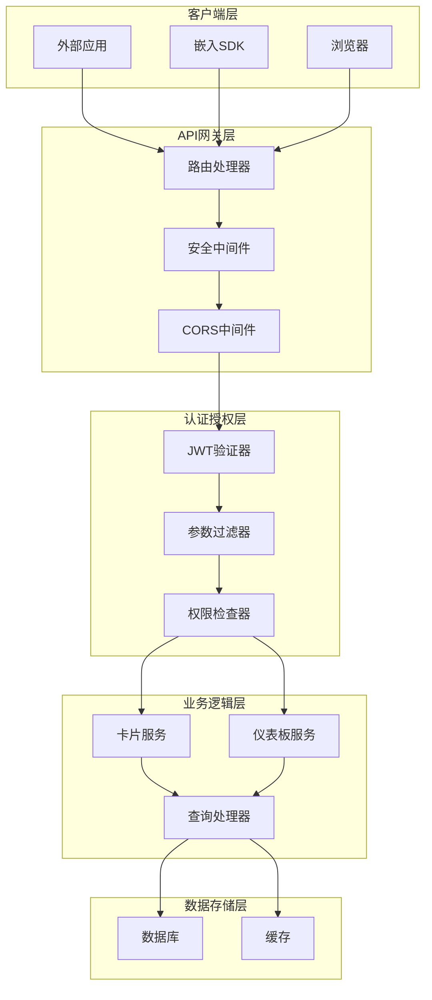
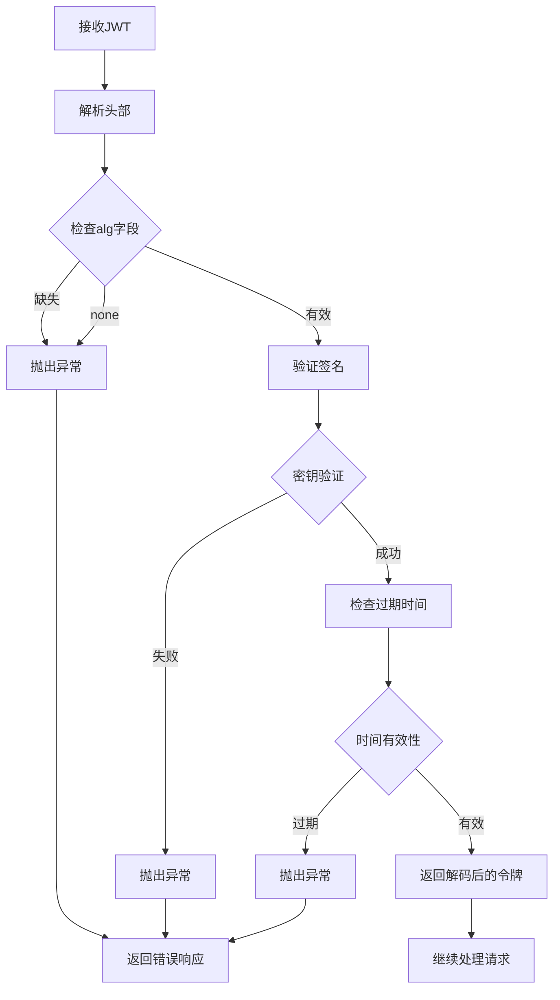
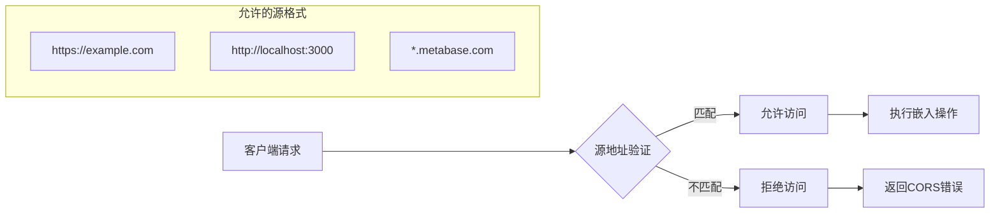
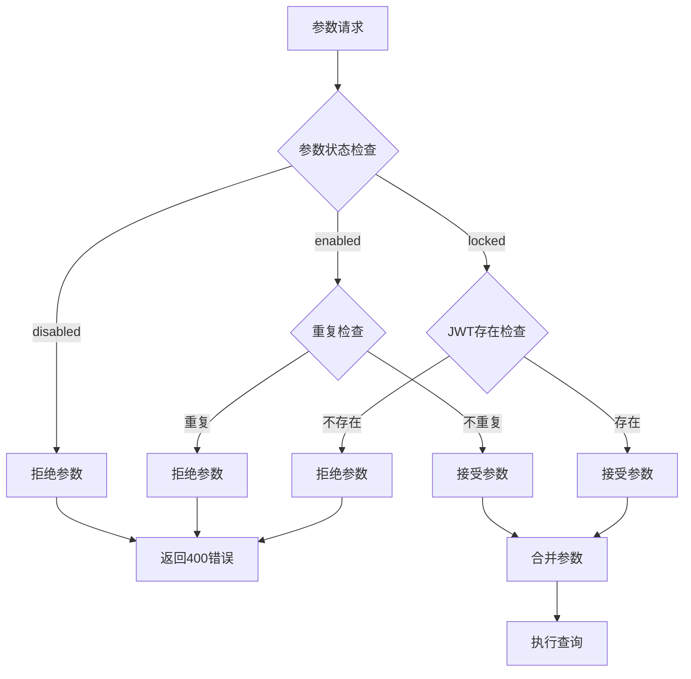
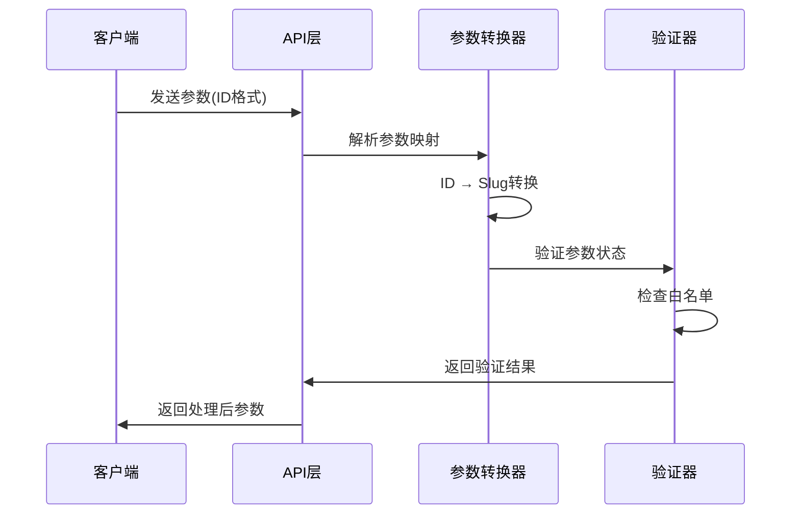
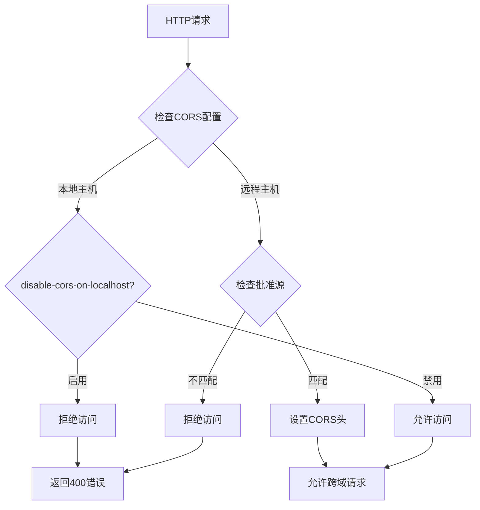
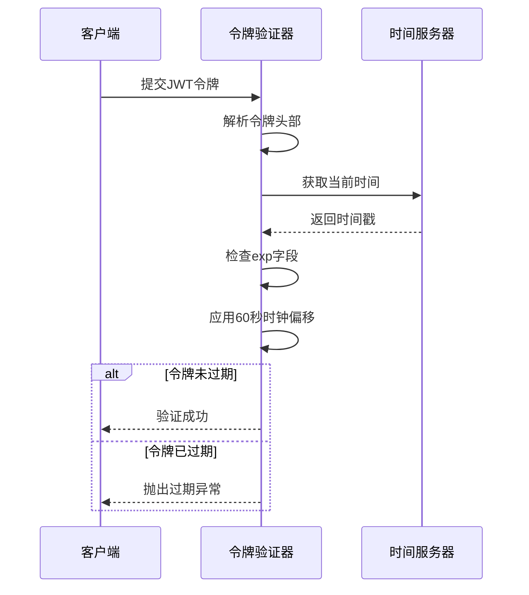
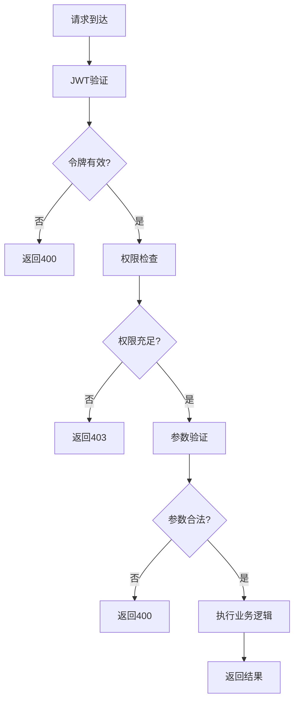

# 仪表板嵌入管理

<cite>
**本文档中引用的文件**
- [embedding/api.clj](file://src/metabase/embedding/api.clj)
- [embedding/jwt.clj](file://src/metabase/embedding/jwt.clj)
- [embedding/validation.clj](file://src/metabase/embedding/validation.clj)
- [embedding/settings.clj](file://src/metabase/embedding/settings.clj)
- [embedding/util.clj](file://src/metabase/embedding/util.clj)
- [embedding/api/embed.clj](file://src/metabase/embedding/api/embed.clj)
- [embedding/api/preview_embed.clj](file://src/metabase/embedding/api/preview_embed.clj)
- [embedding/api/common.clj](file://src/metabase/embedding/api/common.clj)
- [server/middleware/embedding_sdk_bundle.clj](file://src/metabase/server/middleware/embedding_sdk_bundle.clj)
- [server/middleware/security.clj](file://src/metabase/server/middleware/security.clj)
- [server/routes.clj](file://src/metabase/server/routes.clj)
</cite>

## 目录
1. [简介](#简介)
2. [系统架构概览](#系统架构概览)
3. [JWT身份验证机制](#jwt身份验证机制)
4. [嵌入配置选项](#嵌入配置选项)
5. [API端点详解](#api端点详解)
6. [参数过滤规则](#参数过滤规则)
7. [跨域安全策略](#跨域安全策略)
8. [令牌有效期管理](#令牌有效期管理)
9. [错误处理和安全验证](#错误处理和安全验证)
10. [最佳实践指南](#最佳实践指南)
11. [故障排除](#故障排除)

## 简介

Metabase的仪表板嵌入式共享功能允许开发者将仪表板和卡片安全地嵌入到外部应用程序中。该功能通过JWT（JSON Web Token）进行身份验证，支持多种嵌入方式，包括静态嵌入、交互式嵌入和SDK嵌入。系统提供了细粒度的权限控制和参数过滤机制，确保数据安全性和用户体验。

## 系统架构概览

仪表板嵌入管理系统采用分层架构设计，包含以下核心组件：



**图表来源**
- [embedding/api.clj](file://src/metabase/embedding/api.clj#L1-L17)
- [server/routes.clj](file://src/metabase/server/routes.clj#L1-L112)

**章节来源**
- [embedding/api.clj](file://src/metabase/embedding/api.clj#L1-L17)
- [server/routes.clj](file://src/metabase/server/routes.clj#L1-L112)

## JWT身份验证机制

### JWT结构和签名

系统使用标准的JWT格式进行身份验证，支持以下字段结构：

| 字段名 | 类型 | 描述 | 必需性 |
|--------|------|------|--------|
| `resource` | 对象 | 包含要访问的资源信息 | 必需 |
| `params` | 对象 | 查询参数映射 | 可选 |

**资源字段结构：**
```json
{
  "resource": {
    "question": <card-id>,
    "dashboard": <dashboard-id>
  },
  "params": {
    "<param-slug>": "<param-value>"
  }
}
```

### 签名算法验证

JWT验证过程包含多层安全检查：



**图表来源**
- [embedding/jwt.clj](file://src/metabase/embedding/jwt.clj#L15-L30)

### 密钥管理

嵌入密钥采用256位十六进制编码，支持动态轮换：

- **密钥长度**: 64个字符的十六进制字符串
- **加密要求**: 支持加密存储
- **轮换策略**: 建议定期更换密钥
- **验证规则**: 必须符合十六进制格式

**章节来源**
- [embedding/jwt.clj](file://src/metabase/embedding/jwt.clj#L1-L51)
- [embedding/settings.clj](file://src/metabase/embedding/settings.clj#L15-L30)

## 嵌入配置选项

### 嵌入类型配置

系统支持四种主要的嵌入类型：

| 配置项 | 功能描述 | 默认值 | 环境变量 |
|--------|----------|--------|----------|
| `enable-embedding-sdk` | SDK嵌入功能 | false | MB_ENABLE_EMBEDDING_SDK |
| `enable-embedding-simple` | 简单嵌入功能 | false | MB_ENABLE_EMBEDDING_SIMPLE |
| `enable-embedding-interactive` | 交互式嵌入 | false | MB_ENABLE_EMBEDDING_INTERACTIVE |
| `enable-embedding-static` | 静态嵌入功能 | false | MB_ENABLE_EMBEDDING_STATIC |

### 跨域源配置

跨域配置支持精确的源地址控制：



**图表来源**
- [embedding/settings.clj](file://src/metabase/embedding/settings.clj#L150-L180)

### 参数白名单配置

每个嵌入对象支持细粒度的参数控制：

| 参数状态 | 行为描述 | 安全级别 |
|----------|----------|----------|
| `disabled` | 禁止用户指定参数值 | 最高 |
| `enabled` | 用户可指定参数值 | 中等 |
| `locked` | 必须在JWT中指定参数值 | 较高 |

**章节来源**
- [embedding/settings.clj](file://src/metabase/embedding/settings.clj#L1-L315)
- [embedding/api/common.clj](file://src/metabase/embedding/api/common.clj#L31-L76)

## API端点详解

### 卡片嵌入端点

#### 获取卡片信息
```
GET /api/embed/card/:token
```

**请求参数：**
- `token`: JWT令牌

**响应格式：**
```json
{
  "id": 123,
  "name": "销售报表",
  "description": "月度销售数据统计",
  "result": {
    "data": [...],
    "metadata": {...}
  }
}
```

#### 执行卡片查询
```
GET /api/embed/card/:token/query
GET /api/embed/card/:token/query/:export-format
```

**查询参数：**
- `parameters`: JSON格式的参数映射
- `format_rows`: 是否格式化行数据
- `pivot_results`: 是否启用透视结果

### 仪表板嵌入端点

#### 获取仪表板
```
GET /api/embed/dashboard/:token
```

**响应包含：**
- 仪表板基本信息
- 已过滤的参数列表
- 权限调整后的卡片集合

#### 仪表板卡片查询
```
GET /api/embed/dashboard/:token/dashcard/:dashcard-id/card/:card-id
```

**特殊功能：**
- 支持参数优先级控制
- 自动参数映射处理
- 权限边界检查

### 预览嵌入端点

预览端点仅对管理员开放，提供无限制的嵌入预览功能：

```
GET /api/preview_embed/card/:token
GET /api/preview_embed/dashboard/:token
```

**特点：**
- 忽略嵌入启用状态
- 使用令牌中的`_embedding_params`
- 限制结果集大小（最大2000条）

**章节来源**
- [embedding/api/embed.clj](file://src/metabase/embedding/api/embed.clj#L1-L368)
- [embedding/api/preview_embed.clj](file://src/metabase/embedding/api/preview_embed.clj#L1-L194)

## 参数过滤规则

### 参数状态分类

系统根据安全需求将参数分为三种状态：



**图表来源**
- [embedding/api/common.clj](file://src/metabase/embedding/api/common.clj#L38-L55)

### 参数验证流程

参数验证遵循严格的规则链：

1. **存在性验证**: 检查参数是否在白名单中
2. **冲突检测**: 防止JWT和URL参数冲突
3. **必需性检查**: 验证锁定参数是否已提供
4. **格式验证**: 确保参数值的有效性

### 参数映射转换

系统自动处理参数ID与Slug之间的转换：



**图表来源**
- [embedding/api/common.clj](file://src/metabase/embedding/api/common.clj#L163-L186)

**章节来源**
- [embedding/api/common.clj](file://src/metabase/embedding/api/common.clj#L31-L186)

## 跨域安全策略

### CORS配置机制

系统实现了智能的CORS策略，支持多种配置场景：



**图表来源**
- [server/middleware/security.clj](file://src/metabase/server/middleware/security.clj#L234-L263)

### 内容安全策略

系统实施严格的内容安全策略（CSP）：

| 策略指令 | 值 | 用途 |
|----------|-----|------|
| `frame-ancestors` | `*` 或 允许的源 | 控制iframe嵌入 |
| `script-src` | `'self'` | 限制脚本来源 |
| `style-src` | `'self'` | 限制样式来源 |
| `img-src` | `'self'` | 限制图片来源 |

### 安全头设置

所有嵌入请求都附加安全头：

- **X-Frame-Options**: 控制点击劫持防护
- **X-XSS-Protection**: 启用XSS过滤
- **X-Content-Type-Options**: 防止MIME类型嗅探
- **Strict-Transport-Security**: 强制HTTPS连接

**章节来源**
- [server/middleware/security.clj](file://src/metabase/server/middleware/security.clj#L261-L323)
- [embedding/settings.clj](file://src/metabase/embedding/settings.clj#L148-L180)

## 令牌有效期管理

### 过期时间验证

JWT令牌包含内置的过期时间检查：



**图表来源**
- [embedding/jwt.clj](file://src/metabase/embedding/jwt.clj#L30-L49)

### 时钟偏移处理

系统容忍±60秒的时钟偏移，以应对网络延迟和服务器时间差异：

- **验证窗口**: ±60秒
- **应用场景**: 移动设备、分布式部署
- **安全考虑**: 平衡可用性和安全性

### 令牌刷新策略

虽然JWT本身不支持传统意义上的刷新，但系统建议：

1. **短期令牌**: 适用于高频访问场景
2. **长期令牌**: 适用于低频访问场景
3. **动态更新**: 根据访问模式调整过期时间

**章节来源**
- [embedding/jwt.clj](file://src/metabase/embedding/jwt.clj#L30-L49)

## 错误处理和安全验证

### 错误响应格式

系统统一使用结构化的错误响应：

```json
{
  "status": 400,
  "message": "错误描述信息",
  "details": {
    "error_type": "validation_error",
    "field": "token",
    "value": "invalid_token"
  }
}
```

### 常见错误类型

| 错误代码 | 错误类型 | 描述 | 解决方案 |
|----------|----------|------|----------|
| 400 | JWT无效 | JWT格式或签名错误 | 检查令牌格式和密钥 |
| 400 | 参数冲突 | JWT和URL参数冲突 | 清理重复参数 |
| 400 | 权限不足 | 嵌入功能未启用 | 启用相应嵌入类型 |
| 400 | 资源不存在 | 请求的卡片或仪表板不存在 | 验证资源ID |

### 安全验证层次



**图表来源**
- [embedding/validation.clj](file://src/metabase/embedding/validation.clj#L1-L12)

### 异常处理机制

系统实现了多层次的异常处理：

1. **输入验证**: 参数格式和类型检查
2. **业务逻辑验证**: 权限和约束检查
3. **运行时异常**: 数据库连接和查询异常
4. **安全异常**: 访问控制和审计

**章节来源**
- [embedding/validation.clj](file://src/metabase/embedding/validation.clj#L1-L12)
- [embedding/jwt.clj](file://src/metabase/embedding/jwt.clj#L30-L49)

## 最佳实践指南

### 密钥管理最佳实践

1. **密钥生成**: 使用`/api/util/random_token`生成强随机密钥
2. **密钥存储**: 启用加密存储，避免明文存储
3. **密钥轮换**: 定期更换密钥，建议每90天一次
4. **密钥备份**: 安全备份密钥，防止丢失

### 嵌入配置最佳实践

1. **最小权限原则**: 仅启用必要的嵌入类型
2. **精确源控制**: 使用具体域名而非通配符
3. **参数白名单**: 仔细审查和维护参数白名单
4. **监控告警**: 设置嵌入访问监控和异常告警

### 性能优化建议

1. **缓存策略**: 合理设置CDN和浏览器缓存
2. **压缩传输**: 启用GZIP压缩减少传输量
3. **连接池**: 优化数据库连接池配置
4. **异步处理**: 对于大数据集使用异步查询

### 安全加固措施

1. **HTTPS强制**: 确保所有嵌入都通过HTTPS访问
2. **CORS限制**: 严格控制跨域访问范围
3. **内容安全**: 实施严格的内容安全策略
4. **审计日志**: 记录所有嵌入访问行为

## 故障排除

### 常见问题诊断

#### JWT验证失败
**症状**: 接收到400错误，提示JWT无效
**排查步骤**:
1. 验证密钥配置是否正确
2. 检查令牌格式是否符合JWT规范
3. 确认时钟同步状态
4. 检查算法字段是否被篡改

#### 参数验证错误
**症状**: 参数被拒绝，提示冲突或不存在
**排查步骤**:
1. 检查参数白名单配置
2. 验证参数名称拼写
3. 确认参数状态设置
4. 检查JWT和URL参数冲突

#### CORS跨域问题
**症状**: 浏览器阻止跨域请求
**排查步骤**:
1. 验证源地址配置
2. 检查协议和端口匹配
3. 确认CORS中间件启用
4. 查看浏览器开发者工具

### 调试工具和技巧

1. **日志分析**: 启用详细日志记录
2. **令牌解码**: 使用在线JWT解码工具
3. **网络抓包**: 使用Wireshark或浏览器开发者工具
4. **单元测试**: 编写专门的嵌入测试用例

### 性能监控指标

| 指标 | 监控目标 | 告警阈值 |
|------|----------|----------|
| 响应时间 | < 2秒 | > 5秒 |
| 错误率 | < 1% | > 5% |
| 并发数 | < 1000 | > 500 |
| 缓存命中率 | > 90% | < 80% |

**章节来源**
- [embedding/api/common.clj](file://src/metabase/embedding/api/common.clj#L55-L76)
- [embedding/jwt.clj](file://src/metabase/embedding/jwt.clj#L30-L49)

## 结论

Metabase的仪表板嵌入式共享功能提供了强大而灵活的数据可视化解决方案。通过JWT身份验证、细粒度参数控制和完善的跨域安全策略，系统在保证数据安全的同时，为开发者提供了便捷的集成体验。合理配置和使用这些功能，可以显著提升应用程序的数据展示能力和用户体验。

建议在生产环境中遵循本文档提供的最佳实践，定期审查安全配置，并建立完善的监控和告警机制，以确保嵌入功能的稳定性和安全性。