# Metabase仪表板管理API完整文档

<cite>
**本文档中引用的文件**
- [src/metabase/dashboards/api.clj](file://src/metabase/dashboards/api.clj)
- [src/metabase/dashboards/schema.clj](file://src/metabase/dashboards/schema.clj)
- [src/metabase/dashboards/models/dashboard.clj](file://src/metabase/dashboards/models/dashboard.clj)
- [src/metabase/public_sharing/api.clj](file://src/metabase/public_sharing/api.clj)
- [src/metabase/embedding/api.clj](file://src/metabase/embedding/api.clj)
- [src/metabase/embedding/api/embed.clj](file://src/metabase/embedding/api/embed.clj)
- [src/metabase/embedding/api/common.clj](file://src/metabase/embedding/api/common.clj)
- [src/metabase/public_sharing/validation.clj](file://src/metabase/public_sharing/validation.clj)
- [src/metabase/embedding/validation.clj](file://src/metabase/embedding/validation.clj)
- [src/metabase/embedding/settings.clj](file://src/metabase/embedding/settings.clj)
</cite>

## 目录
1. [简介](#简介)
2. [项目结构概览](#项目结构概览)
3. [核心组件分析](#核心组件分析)
4. [架构概览](#架构概览)
5. [详细组件分析](#详细组件分析)
6. [依赖关系分析](#依赖关系分析)
7. [性能考虑](#性能考虑)
8. [故障排除指南](#故障排除指南)
9. [结论](#结论)

## 简介

Metabase仪表板管理API提供了全面的仪表板生命周期管理功能，包括创建、更新、删除、权限管理和共享机制。该API支持公共共享和嵌入式共享两种主要的共享模式，为不同场景下的数据可视化需求提供灵活的解决方案。

本文档系统性地记录了所有仪表板相关的API端点，详细说明了公共和可嵌入仪表板的列表获取、仪表板的CRUD操作、权限管理功能，以及公共共享和嵌入式共享的安全机制。

## 项目结构概览

仪表板管理API的核心文件组织结构如下：

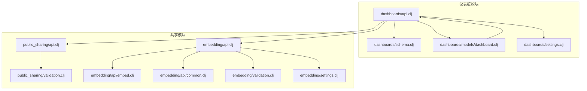

**图表来源**
- [src/metabase/dashboards/api.clj](file://src/metabase/dashboards/api.clj#L1-L50)
- [src/metabase/public_sharing/api.clj](file://src/metabase/public_sharing/api.clj#L1-L30)
- [src/metabase/embedding/api.clj](file://src/metabase/embedding/api.clj#L1-L17)

## 核心组件分析

### 仪表板模型层

仪表板模型定义了仪表板的基本结构和验证规则：

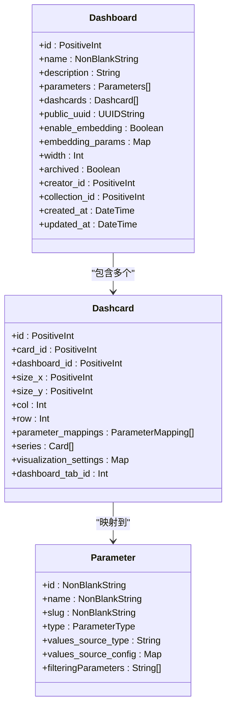

**图表来源**
- [src/metabase/dashboards/schema.clj](file://src/metabase/dashboards/schema.clj#L1-L27)
- [src/metabase/dashboards/models/dashboard.clj](file://src/metabase/dashboards/models/dashboard.clj#L1-L100)

**章节来源**
- [src/metabase/dashboards/schema.clj](file://src/metabase/dashboards/schema.clj#L1-L27)
- [src/metabase/dashboards/models/dashboard.clj](file://src/metabase/dashboards/models/dashboard.clj#L1-L200)

### 公共共享机制

公共共享API提供了公开访问仪表板的功能：

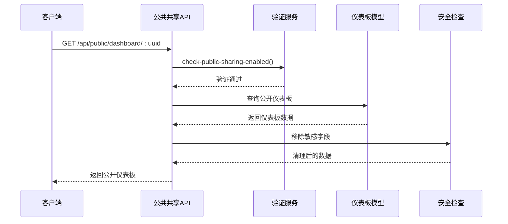

**图表来源**
- [src/metabase/public_sharing/api.clj](file://src/metabase/public_sharing/api.clj#L200-L250)

**章节来源**
- [src/metabase/public_sharing/api.clj](file://src/metabase/public_sharing/api.clj#L1-L300)
- [src/metabase/public_sharing/validation.clj](file://src/metabase/public_sharing/validation.clj#L1-L12)

### 嵌入式共享机制

嵌入式共享使用JWT令牌进行安全授权：

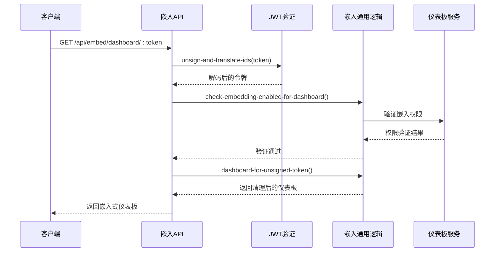

**图表来源**
- [src/metabase/embedding/api/embed.clj](file://src/metabase/embedding/api/embed.clj#L132-L161)
- [src/metabase/embedding/api/common.clj](file://src/metabase/embedding/api/common.clj#L100-L150)

**章节来源**
- [src/metabase/embedding/api/embed.clj](file://src/metabase/embedding/api/embed.clj#L1-L200)
- [src/metabase/embedding/api/common.clj](file://src/metabase/embedding/api/common.clj#L1-L300)
- [src/metabase/embedding/validation.clj](file://src/metabase/embedding/validation.clj#L1-L12)

## 架构概览

仪表板管理API采用分层架构设计，确保功能模块的清晰分离和良好的可维护性：

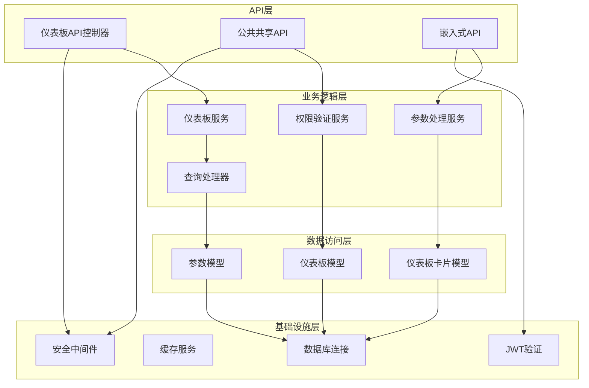

**图表来源**
- [src/metabase/dashboards/api.clj](file://src/metabase/dashboards/api.clj#L1-L50)
- [src/metabase/embedding/api.clj](file://src/metabase/embedding/api.clj#L1-L17)

## 详细组件分析

### 仪表板CRUD操作

仪表板API提供了完整的CRUD操作支持：

#### 创建仪表板

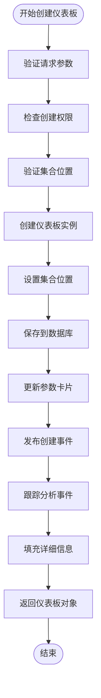

**图表来源**
- [src/metabase/dashboards/api.clj](file://src/metabase/dashboards/api.clj#L100-L150)

#### 更新仪表板

仪表板更新操作支持参数映射、卡片序列等复杂更新：

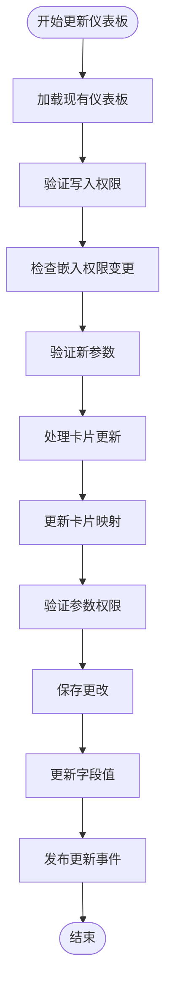

**图表来源**
- [src/metabase/dashboards/api.clj](file://src/metabase/dashboards/api.clj#L600-L700)

**章节来源**
- [src/metabase/dashboards/api.clj](file://src/metabase/dashboards/api.clj#L100-L300)
- [src/metabase/dashboards/api.clj](file://src/metabase/dashboards/api.clj#L600-L800)

### 参数管理系统

仪表板参数系统支持复杂的参数映射和权限控制：

#### 参数权限验证流程

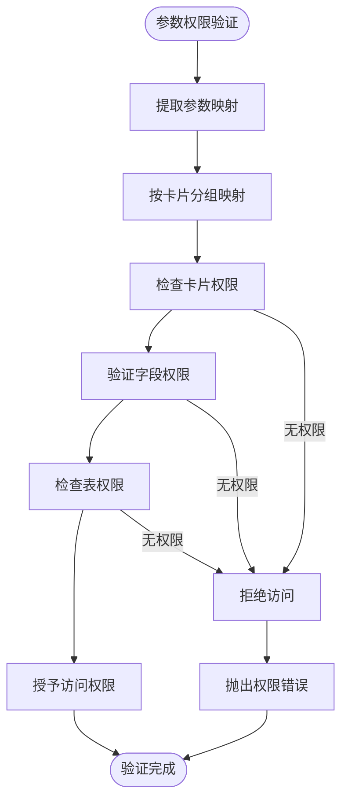

**图表来源**
- [src/metabase/dashboards/api.clj](file://src/metabase/dashboards/api.clj#L450-L550)

**章节来源**
- [src/metabase/dashboards/api.clj](file://src/metabase/dashboards/api.clj#L450-L600)

### 仪表板加载优化

系统实现了智能的仪表板加载缓存机制：

#### 缓存策略

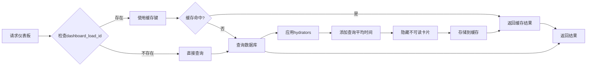

**图表来源**
- [src/metabase/dashboards/api.clj](file://src/metabase/dashboards/api.clj#L300-L400)

**章节来源**
- [src/metabase/dashboards/api.clj](file://src/metabase/dashboards/api.clj#L300-L450)

### 公共仪表板列表获取

系统提供了专门的端点用于获取可公开访问的仪表板列表：

#### 公共仪表板查询

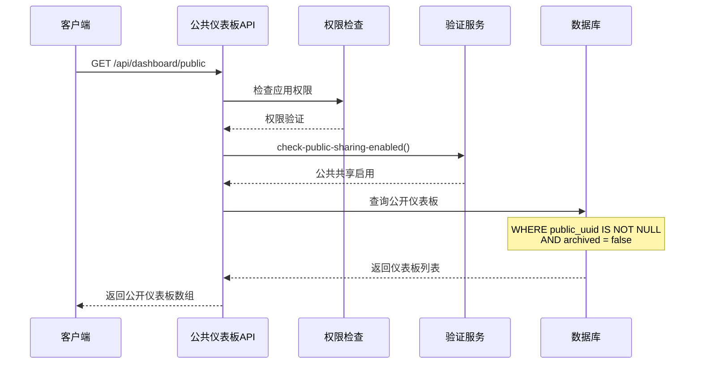

**图表来源**
- [src/metabase/dashboards/api.clj](file://src/metabase/dashboards/api.clj#L547-L576)

**章节来源**
- [src/metabase/dashboards/api.clj](file://src/metabase/dashboards/api.clj#L547-L580)

### 可嵌入仪表板列表获取

嵌入式仪表板列表专门针对嵌入场景优化：

#### 嵌入仪表板查询

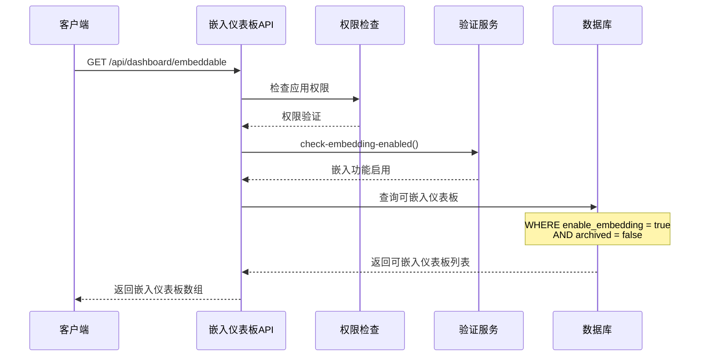

**图表来源**
- [src/metabase/dashboards/api.clj](file://src/metabase/dashboards/api.clj#L578-L590)

**章节来源**
- [src/metabase/dashboards/api.clj](file://src/metabase/dashboards/api.clj#L578-L590)

## 依赖关系分析

仪表板管理API的依赖关系体现了清晰的分层架构：

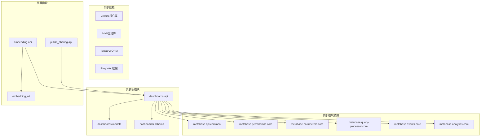

**图表来源**
- [src/metabase/dashboards/api.clj](file://src/metabase/dashboards/api.clj#L1-L50)
- [src/metabase/embedding/api.clj](file://src/metabase/embedding/api.clj#L1-L17)

**章节来源**
- [src/metabase/dashboards/api.clj](file://src/metabase/dashboards/api.clj#L1-L50)
- [src/metabase/embedding/api.clj](file://src/metabase/embedding/api.clj#L1-L17)

## 性能考虑

### 缓存机制

仪表板API实现了多层次的缓存策略：

1. **仪表板加载缓存**: 使用`dashboard_load_id`作为缓存键，实现10秒TTL的智能缓存
2. **元数据提供者缓存**: 在仪表板加载期间缓存元数据查询结果
3. **查询平均时间缓存**: 批量查询卡片的平均执行时间

### 批量操作优化

- **卡片批量水合**: 支持批量加载仪表板卡片及其关联数据
- **参数批量验证**: 批量检查参数权限，避免N+1查询问题
- **字段值批量更新**: 对于参数变化，批量更新相关字段值

### 查询优化

- **条件索引**: 利用数据库索引优化公开仪表板和嵌入仪表板查询
- **投影选择**: 只查询必要的字段，减少网络传输开销
- **分页支持**: 支持大数据集的分页查询

## 故障排除指南

### 常见问题及解决方案

#### 公共共享问题

**问题**: 无法访问公开仪表板
**原因**: 公共共享功能未启用或仪表板未设置公共UUID
**解决方案**: 
1. 检查`public-sharing-enabled`设置
2. 确认仪表板已启用公共分享
3. 验证公共UUID是否正确设置

#### 嵌入式共享问题

**问题**: JWT验证失败
**原因**: 
- 嵌入密钥未配置
- JWT格式不正确
- 令牌过期

**解决方案**:
1. 设置`embedding-secret-key`环境变量
2. 验证JWT签名和格式
3. 检查令牌有效期

#### 权限问题

**问题**: 参数权限验证失败
**原因**: 用户缺乏数据查询权限
**解决方案**:
1. 检查用户数据库访问权限
2. 验证参数引用的字段权限
3. 确认表级权限设置

**章节来源**
- [src/metabase/public_sharing/validation.clj](file://src/metabase/public_sharing/validation.clj#L1-L12)
- [src/metabase/embedding/validation.clj](file://src/metabase/embedding/validation.clj#L1-L12)

## 结论

Metabase仪表板管理API提供了功能完整、安全可靠的仪表板管理解决方案。通过分层架构设计，系统实现了良好的可维护性和扩展性。公共共享和嵌入式共享功能满足了不同场景下的数据可视化需求，而完善的权限控制系统确保了数据安全。

主要特性包括：
- 完整的仪表板CRUD操作支持
- 智能缓存机制提升性能
- 多层次的安全验证体系
- 灵活的参数映射和权限控制
- 优化的批量操作支持

该API为构建现代数据分析平台提供了坚实的基础，支持企业级的数据可视化和报告需求。