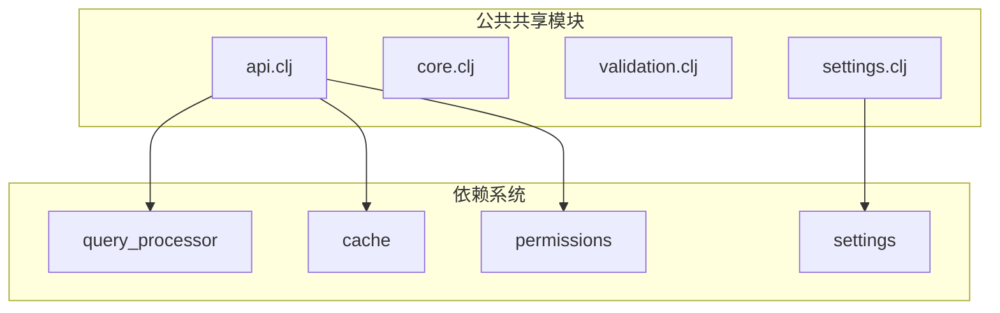
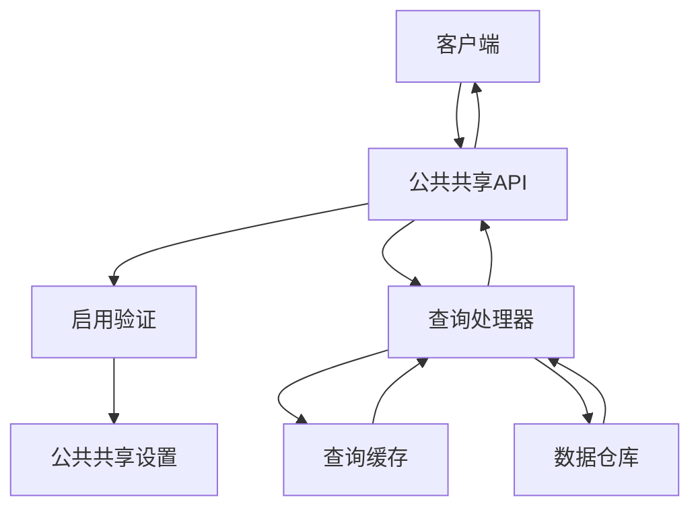
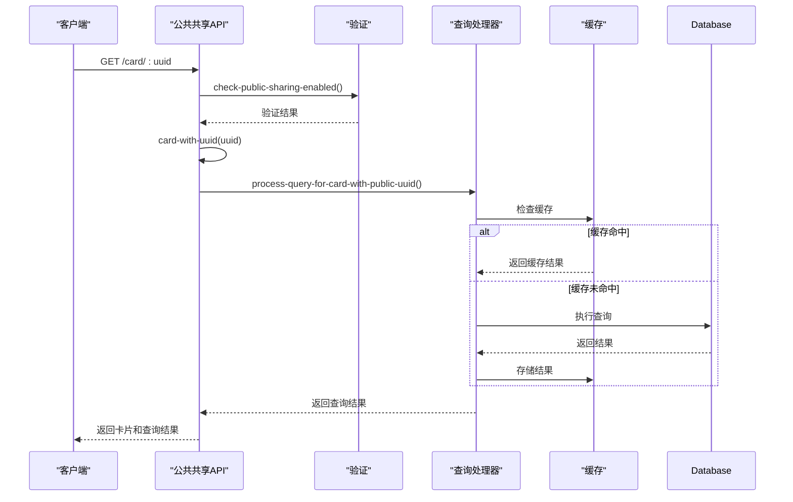
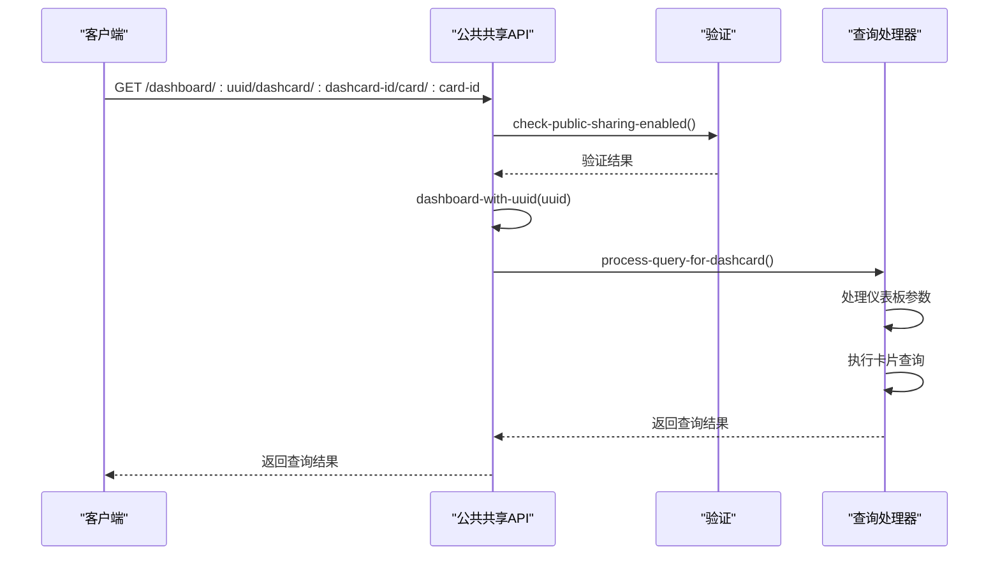
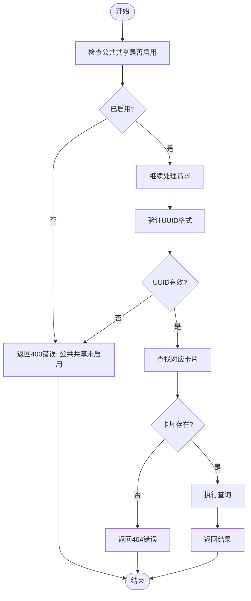
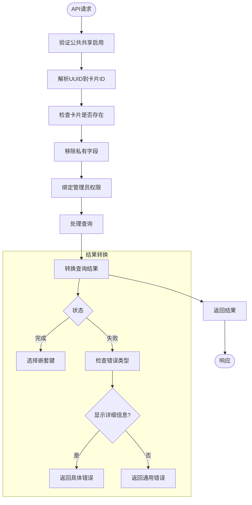
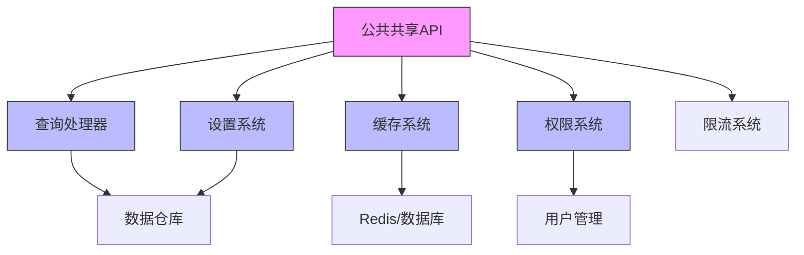
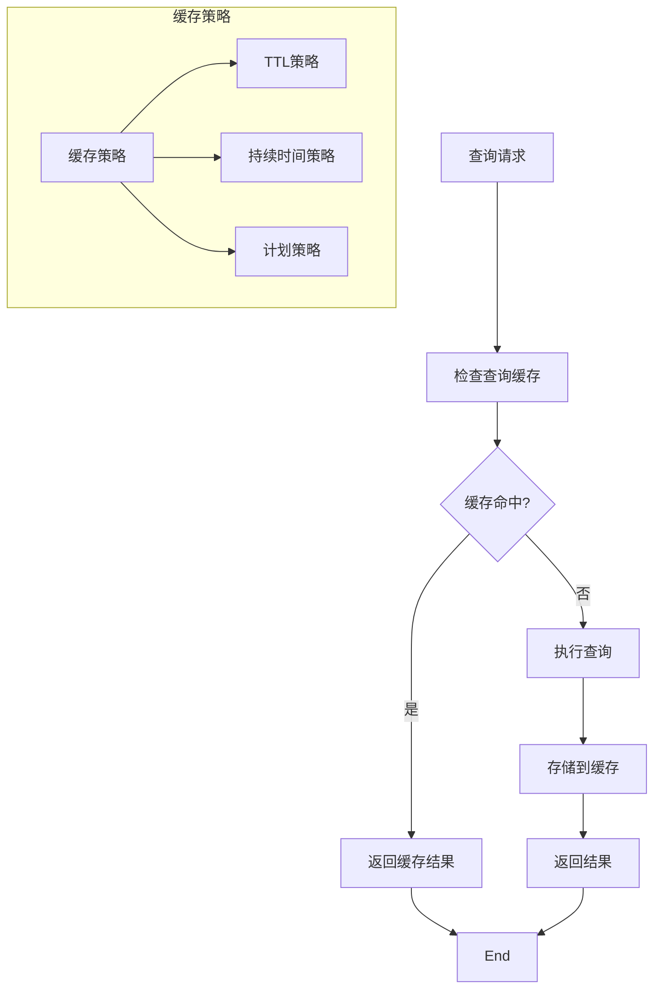
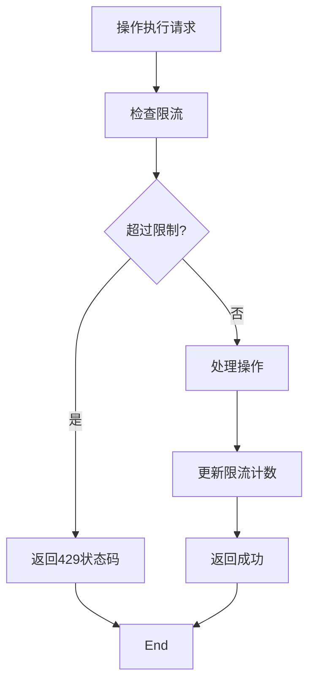

# 公共共享API

<cite>
**本文档中引用的文件**  
- [api.clj](file://src/metabase/public_sharing/api.clj)
- [core.clj](file://src/metabase/public_sharing/core.clj)
- [validation.clj](file://src/metabase/public_sharing/validation.clj)
- [settings.clj](file://src/metabase/public_sharing/settings.clj)
- [card.clj](file://src/metabase/query_processor/card.clj)
- [cache/api.clj](file://src/metabase/cache/api.clj)
- [middleware/permissions.clj](file://src/metabase/query_processor/middleware/permissions.clj)
- [schema.clj](file://src/metabase/query_processor/schema.clj)
- [error_type.clj](file://src/metabase/query_processor/error_type.clj)
</cite>

## 目录
1. [简介](#简介)
2. [项目结构](#项目结构)
3. [核心组件](#核心组件)
4. [架构概述](#架构概述)
5. [详细组件分析](#详细组件分析)
6. [依赖分析](#依赖分析)
7. [性能考虑](#性能考虑)
8. [故障排除指南](#故障排除指南)
9. [结论](#结论)

## 简介
本文档系统性地记录了Metabase公共共享API的所有端点，包括公开卡片和仪表板的查询执行。文档详细说明了公共共享的启用检查和安全验证机制，无认证访问的查询执行流程，以及结果返回格式。同时解释了UUID到卡片ID的解析过程，并提供了详细的性能考虑和缓存策略，确保公共端点的高效运行。

## 项目结构
Metabase的公共共享功能主要位于`src/metabase/public_sharing/`目录下，包含API定义、核心逻辑、验证和设置等组件。该功能与其他系统组件如查询处理器、缓存系统和权限系统紧密集成。



**Diagram sources**
- [api.clj](file://src/metabase/public_sharing/api.clj)
- [core.clj](file://src/metabase/public_sharing/core.clj)

**Section sources**
- [api.clj](file://src/metabase/public_sharing/api.clj)
- [core.clj](file://src/metabase/public_sharing/core.clj)

## 核心组件
公共共享API的核心组件包括API端点定义、验证机制、设置管理和核心处理逻辑。这些组件共同实现了无需认证的公共访问功能，同时确保了系统的安全性和性能。

**Section sources**
- [api.clj](file://src/metabase/public_sharing/api.clj)
- [validation.clj](file://src/metabase/public_sharing/validation.clj)
- [settings.clj](file://src/metabase/public_sharing/settings.clj)

## 架构概述
公共共享API的架构设计遵循分层原则，从API端点到核心处理逻辑，再到底层查询处理器和缓存系统，形成了一个完整的处理链。该架构确保了公共访问的安全性、性能和可维护性。



**Diagram sources**
- [api.clj](file://src/metabase/public_sharing/api.clj)
- [card.clj](file://src/metabase/query_processor/card.clj)
- [cache/api.clj](file://src/metabase/cache/api.clj)

## 详细组件分析

### 公共卡片分析
公共卡片功能允许用户通过UUID访问公开的查询结果。系统首先验证公共共享是否启用，然后通过UUID解析到卡片ID，执行查询并返回结果。



**Diagram sources**
- [api.clj](file://src/metabase/public_sharing/api.clj#L89-L173)
- [card.clj](file://src/metabase/query_processor/card.clj)

**Section sources**
- [api.clj](file://src/metabase/public_sharing/api.clj)
- [card.clj](file://src/metabase/query_processor/card.clj)

### 公共仪表板分析
公共仪表板功能与公共卡片类似，但需要处理多个卡片和参数映射。系统通过仪表板UUID解析到仪表板ID，然后执行指定卡片的查询。



**Diagram sources**
- [api.clj](file://src/metabase/public_sharing/api.clj#L250-L350)
- [card.clj](file://src/metabase/query_processor/card.clj)

**Section sources**
- [api.clj](file://src/metabase/public_sharing/api.clj)
- [card.clj](file://src/metabase/query_processor/card.clj)

### 启用检查和安全验证
公共共享的启用检查是所有公共端点的第一道安全防线。系统通过设置检查确保只有管理员启用此功能后，公共访问才被允许。



**Diagram sources**
- [validation.clj](file://src/metabase/public_sharing/validation.clj)
- [settings.clj](file://src/metabase/public_sharing/settings.clj)

**Section sources**
- [validation.clj](file://src/metabase/public_sharing/validation.clj)
- [settings.clj](file://src/metabase/public_sharing/settings.clj)

### 无认证查询执行流程
无认证查询执行流程是公共共享API的核心，它允许匿名用户执行查询，同时确保系统安全和性能。



**Diagram sources**
- [api.clj](file://src/metabase/public_sharing/api.clj#L120-L150)
- [error_type.clj](file://src/metabase/query_processor/error_type.clj)

**Section sources**
- [api.clj](file://src/metabase/public_sharing/api.clj)
- [error_type.clj](file://src/metabase/query_processor/error_type.clj)

### UUID到卡片ID解析
UUID到卡片ID的解析是公共共享功能的关键步骤，它将用户友好的UUID映射到系统内部的卡片ID。

```mermaid
classDiagram
class UUIDResolver {
+check-public-sharing-enabled()
+card-with-uuid(uuid)
+dashboard-with-uuid(uuid)
-resolve-uuid-to-id(uuid, model)
}
class DatabaseQuery {
+t2/select-one-pk()
+t2/select-one()
}
class PublicSharingSettings {
+enable-public-sharing
}
UUIDResolver --> DatabaseQuery : "使用"
UUIDResolver --> PublicSharingSettings : "依赖"
note right of UUIDResolver
负责将UUID解析为
卡片或仪表板ID
包含必要的验证检查
end
```

**Diagram sources**
- [api.clj](file://src/metabase/public_sharing/api.clj#L89-L90)
- [settings.clj](file://src/metabase/public_sharing/settings.clj)

**Section sources**
- [api.clj](file://src/metabase/public_sharing/api.clj)
- [settings.clj](file://src/metabase/public_sharing/settings.clj)

## 依赖分析
公共共享API依赖于多个核心系统组件，包括查询处理器、缓存系统、权限系统和设置系统。这些依赖关系确保了功能的完整性和安全性。



**Diagram sources**
- [api.clj](file://src/metabase/public_sharing/api.clj)
- [card.clj](file://src/metabase/query_processor/card.clj)
- [cache/api.clj](file://src/metabase/cache/api.clj)

**Section sources**
- [api.clj](file://src/metabase/public_sharing/api.clj)
- [card.clj](file://src/metabase/query_processor/card.clj)
- [cache/api.clj](file://src/metabase/cache/api.clj)

## 性能考虑
公共共享API的性能优化主要通过缓存策略、查询优化和限流机制来实现。这些策略确保了高并发场景下的系统稳定性和响应速度。

### 缓存策略


**Diagram sources**
- [card.clj](file://src/metabase/query_processor/card.clj)
- [cache/api.clj](file://src/metabase/cache/api.clj)

**Section sources**
- [card.clj](file://src/metabase/query_processor/card.clj)
- [cache/api.clj](file://src/metabase/cache/api.clj)

### 限流机制
公共共享API实现了限流机制，防止滥用和DDoS攻击。对于操作执行端点，系统使用基于操作UUID的限流器。



**Diagram sources**
- [api.clj](file://src/metabase/public_sharing/api.clj#L553-L576)
- [util/throttle.clj](file://src/metabase/util/throttle.clj)

## 故障排除指南
本节提供公共共享API常见问题的排查方法和解决方案。

### 常见错误代码
| 错误代码 | 原因 | 解决方案 |
|--------|------|---------|
| 400 | 公共共享未启用 | 管理员需在设置中启用公共共享 |
| 404 | 卡片或仪表板不存在 | 检查UUID是否正确，卡片是否已归档 |
| 429 | 请求过于频繁 | 等待指定时间后重试 |
| 500 | 查询执行失败 | 检查数据源连接和查询语法 |

### 问题排查步骤
1. 确认公共共享功能已启用
2. 验证UUID格式是否正确
3. 检查目标卡片或仪表板是否存在且未归档
4. 查看服务器日志获取详细错误信息
5. 检查网络连接和防火墙设置

**Section sources**
- [validation.clj](file://src/metabase/public_sharing/validation.clj)
- [api.clj](file://src/metabase/public_sharing/api.clj)

## 结论
Metabase公共共享API提供了一套完整的无认证访问解决方案，允许用户通过UUID公开分享卡片和仪表板。系统通过严格的启用检查、安全验证和权限控制确保了功能的安全性。查询执行流程优化了性能，通过缓存策略和限流机制保证了高并发场景下的稳定性。UUID到卡片ID的解析机制提供了用户友好的访问方式，同时保持了系统的内部一致性。整体架构设计合理，组件职责清晰，为公共数据共享提供了可靠的技术支持。