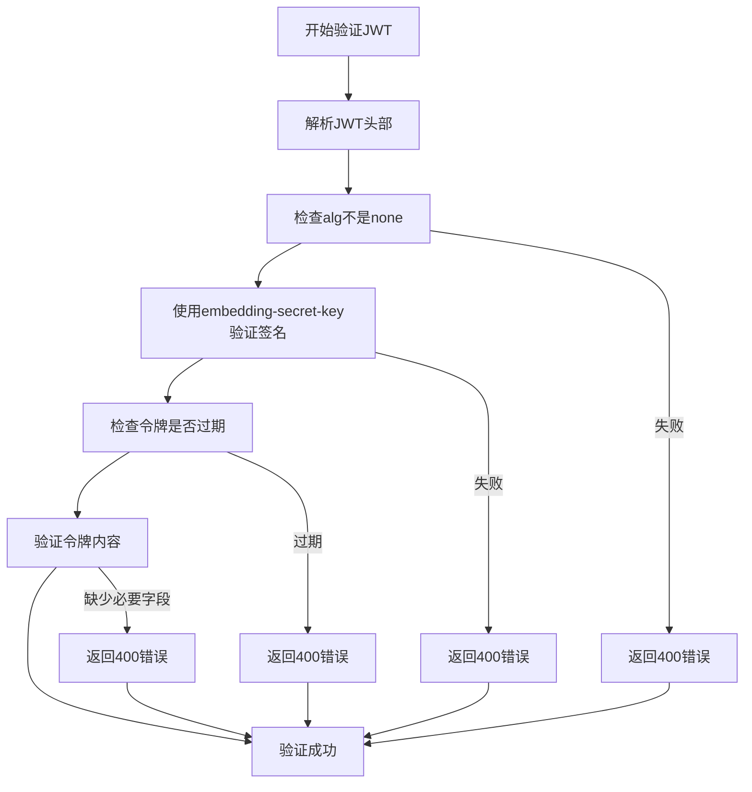
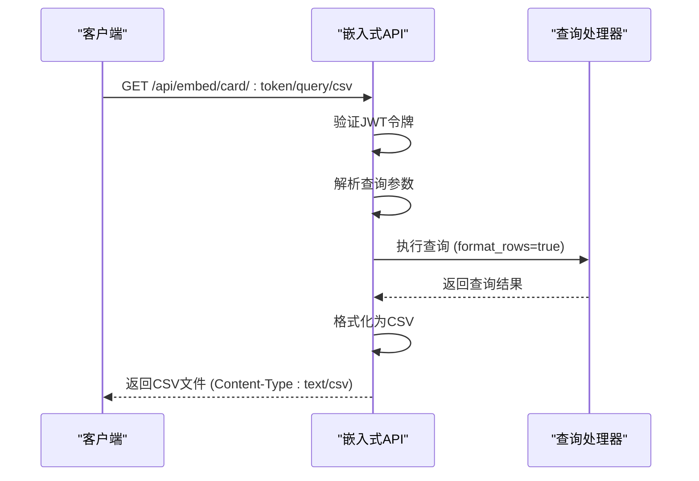
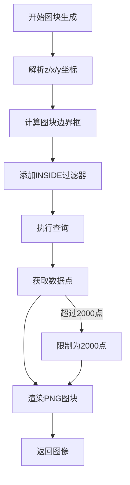
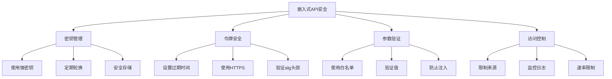
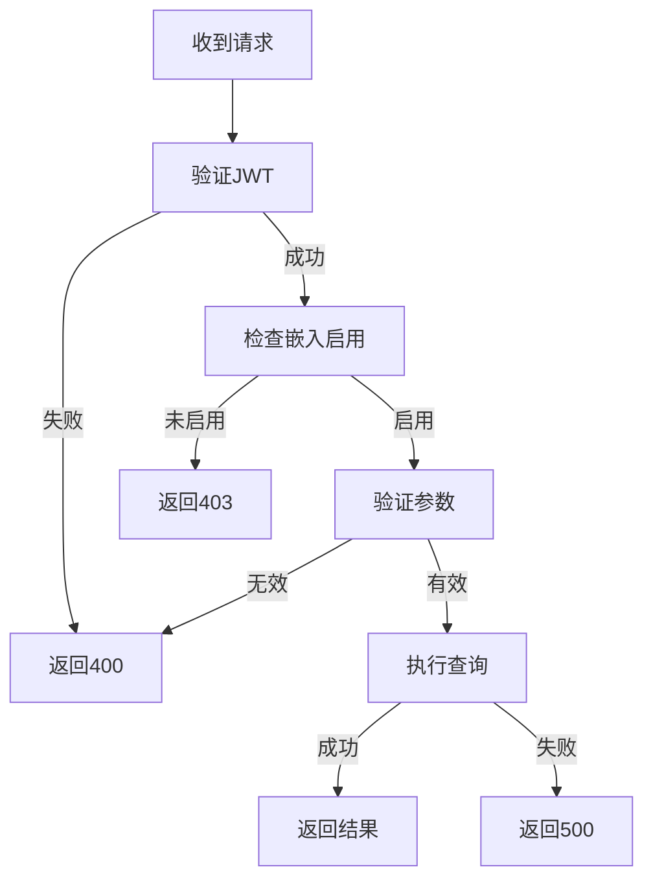

# 嵌入式分析API

<cite>
**本文档中引用的文件**  
- [embed.clj](file://src/metabase/embedding/api/embed.clj)
- [preview_embed.clj](file://src/metabase/embedding/api/preview_embed.clj)
- [jwt.clj](file://src/metabase/embedding/jwt.clj)
- [settings.clj](file://src/metabase/embedding/settings.clj)
- [common.clj](file://src/metabase/embedding/api/common.clj)
- [api.clj](file://src/metabase/tiles/api.clj)
</cite>

## 目录
1. [简介](#简介)
2. [嵌入式端点](#嵌入式端点)
3. [JWT令牌认证](#jwt令牌认证)
4. [文件导出功能](#文件导出功能)
5. [地图图块生成](#地图图块生成)
6. [嵌入实现指南](#嵌入实现指南)
7. [安全最佳实践](#安全最佳实践)
8. [错误处理策略](#错误处理策略)

## 简介

Metabase嵌入式分析API允许将Metabase的卡片和仪表板安全地嵌入到其他应用程序中。该API使用JSON Web Token（JWT）进行认证，确保只有经过授权的请求才能访问嵌入式内容。嵌入式功能需要在系统设置中启用，并配置一个密钥用于签名JWT令牌。

嵌入式API提供了与公共API类似的功能，但通过JWT令牌进行安全访问。API端点分为两类：用于生产环境的`/api/embed`端点和用于预览的`/api/preview_embed`端点。预览端点需要管理员权限，可以忽略嵌入启用状态和参数白名单限制。

**Section sources**
- [embed.clj](file://src/metabase/embedding/api/embed.clj#L1-L30)
- [preview_embed.clj](file://src/metabase/embedding/api/preview_embed.clj#L1-L30)

## 嵌入式端点

嵌入式API提供了访问卡片和仪表板的端点，这些端点使用JWT令牌进行认证。主要端点包括：

### 卡片端点

- `GET /api/embed/card/:token` - 通过JWT令牌获取卡片
- `GET /api/embed/card/:token/query` - 获取卡片查询结果
- `GET /api/embed/card/:token/query/:export-format` - 以指定格式获取查询结果文件

### 仪表板端点

- `GET /api/embed/dashboard/:token` - 通过JWT令牌获取仪表板
- `GET /api/embed/dashboard/:token/dashcard/:dashcard-id/card/:card-id` - 获取仪表板中卡片的查询结果

### 参数相关端点

- `GET /api/embed/dashboard/:token/params/:param-key/values` - 获取仪表板参数值
- `GET /api/embed/dashboard/:token/params/:param-key/search/:prefix` - 搜索仪表板参数值
- `GET /api/embed/dashboard/:token/params/:param-key/remapping` - 获取仪表板参数重映射值

- `GET /api/embed/card/:token/params/:param-key/values` - 获取卡片参数值
- `GET /api/embed/card/:token/params/:param-key/search/:prefix` - 搜索卡片参数值
- `GET /api/embed/card/:token/params/:param-key/remapping` - 获取卡片参数重映射值

### 特殊功能端点

- `GET /api/embed/pivot/card/:token/query` - 获取卡片的透视查询结果
- `GET /api/embed/pivot/dashboard/:token/dashcard/:dashcard-id/card/:card-id` - 获取仪表板中卡片的透视查询结果
- `GET /api/embed/tiles/card/:token/:zoom/:x/:y` - 生成卡片地图图块
- `GET /api/embed/tiles/dashboard/:token/dashcard/:dashcard-id/card/:card-id/:zoom/:x/:y` - 生成仪表板中卡片的地图图块

**Section sources**
- [embed.clj](file://src/metabase/embedding/api/embed.clj#L30-L368)

## JWT令牌认证

嵌入式API使用JSON Web Token（JWT）进行认证。JWT令牌必须使用配置的嵌入密钥进行签名，以确保请求的安全性。

### JWT结构

JWT令牌包含以下字段：

```json
{
  "resource": {
    "question": <card-id>,
    "dashboard": <dashboard-id>
  },
  "params": <parameters>
}
```

其中`resource`字段指定要访问的卡片或仪表板，`params`字段包含传递给查询的参数。

### 签名验证机制

JWT令牌的验证过程包括以下步骤：

1. 检查JWT的`alg`头部不是`none`，防止无签名攻击
2. 使用`embedding-secret-key`验证令牌签名
3. 检查令牌是否过期（允许60秒时钟偏差）
4. 解码并验证令牌内容

如果任何验证步骤失败，将返回400错误。令牌必须包含`resource`字段，其中必须指定`question`或`dashboard`ID。



**Diagram sources**
- [jwt.clj](file://src/metabase/embedding/jwt.clj#L10-L50)

**Section sources**
- [jwt.clj](file://src/metabase/embedding/jwt.clj#L1-L50)
- [embed.clj](file://src/metabase/embedding/api/embed.clj#L60-L85)

## 文件导出功能

嵌入式API支持将查询结果导出为多种文件格式。通过在URL中指定导出格式，可以获取相应格式的文件。

### 支持的导出格式

- CSV（逗号分隔值）
- XLSX（Excel电子表格）
- JSON（JavaScript对象表示法）

### 参数处理

文件导出端点支持以下查询参数：

- `format_rows`：是否格式化行值（布尔值，默认false）
- `pivot_results`：是否透视结果（布尔值，默认false）
- `parameters`：JSON编码的参数对象

当`format_rows`为true时，数值和日期将根据可视化设置进行格式化。当`pivot_results`为true时，结果将按透视表格式组织。

导出功能通过`run-query-for-unsigned-token-async`函数实现，该函数处理查询执行和结果流式传输。查询参数首先通过`parse-query-params`函数解析，然后与JWT中的参数合并。



**Diagram sources**
- [embed.clj](file://src/metabase/embedding/api/embed.clj#L85-L110)

**Section sources**
- [embed.clj](file://src/metabase/embedding/api/embed.clj#L85-L130)
- [common.clj](file://src/metabase/embedding/api/common.clj#L200-L250)

## 地图图块生成

嵌入式API提供了生成地图图块的特殊端点，用于在地图可视化中显示数据点。

### 坐标系统

地图图块使用Web墨卡托投影坐标系（EPSG:3857），这是在线地图服务的标准坐标系。坐标通过以下公式转换：

- 经度：`x = (lon + 180) * (256 / 360)`
- 纬度：`y = (1 - log(tan(lat * π/180) + 1/cos(lat * π/180)) / π) * 256 / 2`

### 图块生成流程

1. 接收z/x/y坐标和缩放级别
2. 计算图块的边界框（经度和纬度范围）
3. 向查询添加`INSIDE`过滤器以限制结果范围
4. 执行查询获取该区域的数据点
5. 渲染包含数据点的PNG图像

每个图块大小为256x256像素，使用蓝色圆点表示数据点。查询结果限制为最多2000个坐标点，以防止性能问题。



**Diagram sources**
- [api.clj](file://src/metabase/tiles/api.clj#L50-L150)

**Section sources**
- [embed.clj](file://src/metabase/embedding/api/embed.clj#L330-L368)
- [api.clj](file://src/metabase/tiles/api.clj#L1-L330)

## 嵌入实现指南

### 启用嵌入功能

1. 在系统设置中启用嵌入功能
2. 设置`embedding-secret-key`为64字符的十六进制字符串
3. 配置允许的来源域（CORS设置）

### 创建JWT令牌

1. 创建包含`resource`和`params`字段的JSON对象
2. 使用HS256算法和`embedding-secret-key`签名
3. 将签名的JWT作为URL路径参数传递

### 参数处理最佳实践

- 使用`enabled`、`disabled`和`locked`状态控制参数访问
- `enabled`参数可以由JWT或用户指定
- `locked`参数必须在JWT中指定，用户不能覆盖
- `disabled`参数不能由任何方式指定

### 预览嵌入

预览嵌入端点（`/api/preview_embed`）用于在发布前查看嵌入效果：
- 需要管理员权限
- 忽略`enable_embedding`设置
- 使用`_embedding_params`字段而不是`embedding_params`
- 限制结果为最多2000行以避免性能问题

**Section sources**
- [settings.clj](file://src/metabase/embedding/settings.clj#L1-L100)
- [common.clj](file://src/metabase/embedding/api/common.clj#L100-L200)
- [preview_embed.clj](file://src/metabase/embedding/api/preview_embed.clj#L1-L50)

## 安全最佳实践

### 密钥管理

- 使用强随机生成的64字符十六进制密钥
- 定期轮换密钥
- 安全存储密钥，避免硬编码
- 使用环境变量或密钥管理系统

### 令牌安全

- 设置合理的令牌过期时间
- 避免在URL中长期暴露令牌
- 使用HTTPS传输所有嵌入请求
- 验证令牌的`alg`头部不是`none`

### 参数验证

- 严格验证JWT中的参数
- 使用白名单控制可访问的参数
- 验证参数值的有效性
- 防止SQL注入和其他注入攻击

### 访问控制

- 仅在需要时启用嵌入功能
- 限制允许的来源域
- 监控嵌入访问日志
- 实施速率限制防止滥用



**Diagram sources**
- [settings.clj](file://src/metabase/embedding/settings.clj#L100-L200)
- [jwt.clj](file://src/metabase/embedding/jwt.clj#L30-L50)

**Section sources**
- [settings.clj](file://src/metabase/embedding/settings.clj#L1-L315)
- [jwt.clj](file://src/metabase/embedding/jwt.clj#L1-L50)
- [common.clj](file://src/metabase/embedding/api/common.clj#L50-L100)

## 错误处理策略

### 常见错误类型

- **400 Bad Request**：JWT无效、缺少必要字段、参数错误
- **404 Not Found**：卡片或仪表板不存在
- **403 Forbidden**：嵌入未启用或权限不足
- **500 Internal Server Error**：服务器内部错误

### 错误响应格式

所有错误响应都包含JSON格式的错误信息：

```json
{
  "status": "error",
  "message": "错误描述",
  "status-code": 400
}
```

### 具体错误场景

1. **JWT验证失败**：令牌签名无效、已过期或`alg`为`none`
2. **嵌入未启用**：全局嵌入功能或特定对象嵌入未启用
3. **参数验证失败**：参数不在白名单中或状态冲突
4. **资源不存在**：指定的卡片或仪表板ID不存在
5. **权限不足**：预览端点需要管理员权限

### 错误处理实现

错误处理通过以下方式实现：
- 使用`ex-info`创建带有状态码的异常
- 在API宏中捕获并格式化异常
- 记录详细的错误日志用于调试
- 返回用户友好的错误消息



**Diagram sources**
- [jwt.clj](file://src/metabase/embedding/jwt.clj#L30-L50)
- [common.clj](file://src/metabase/embedding/api/common.clj#L10-L50)

**Section sources**
- [jwt.clj](file://src/metabase/embedding/jwt.clj#L30-L50)
- [common.clj](file://src/metabase/embedding/api/common.clj#L10-L100)
- [embed.clj](file://src/metabase/embedding/api/embed.clj#L10-L50)