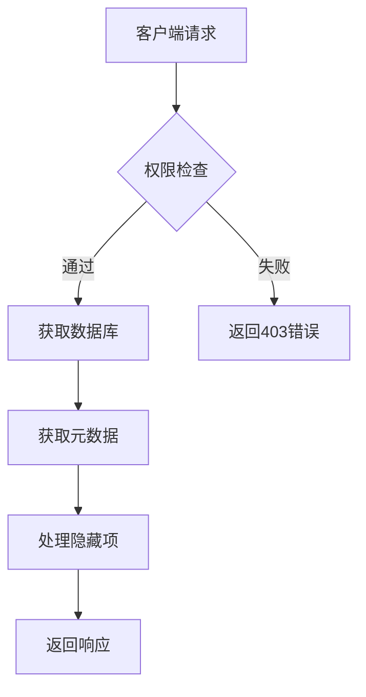
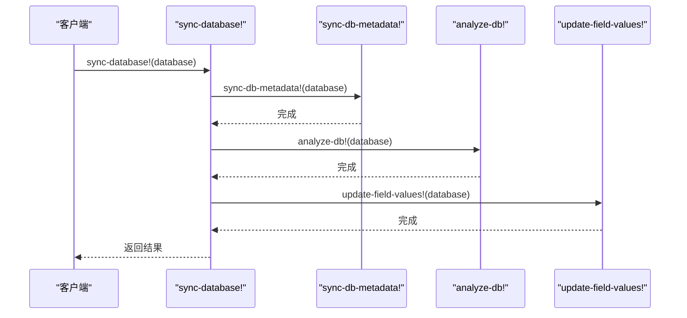
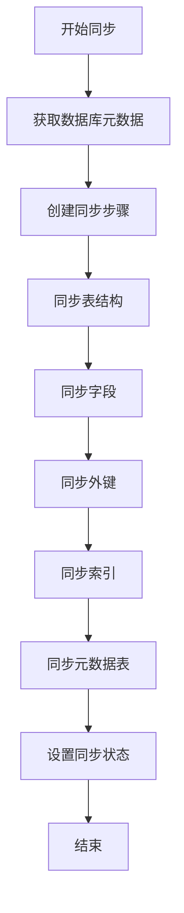
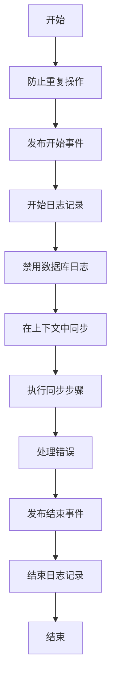
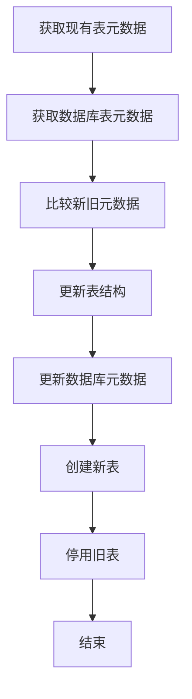
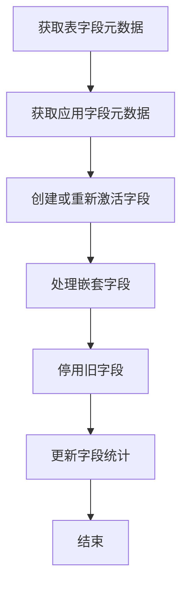
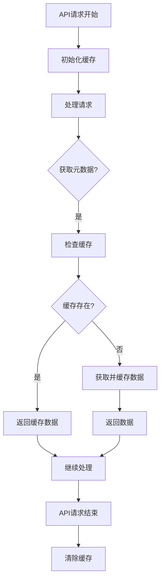
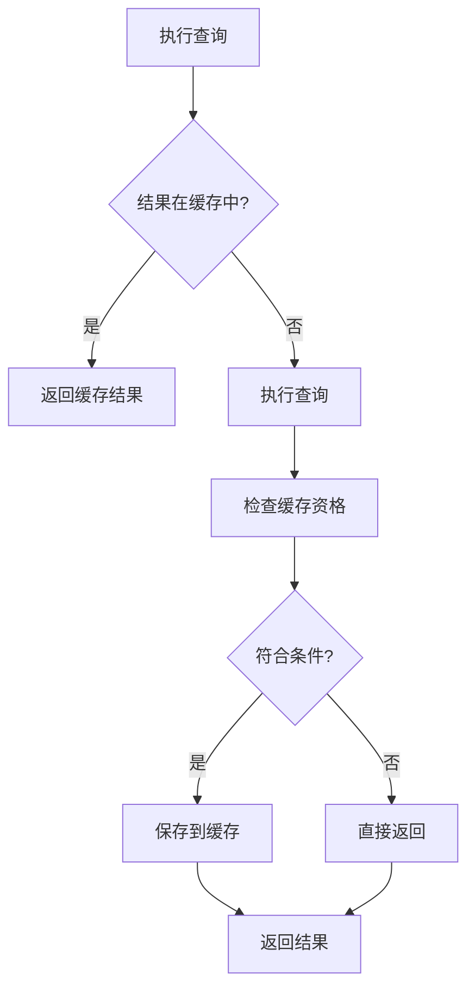
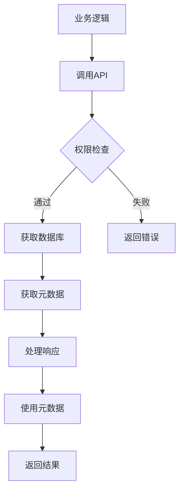
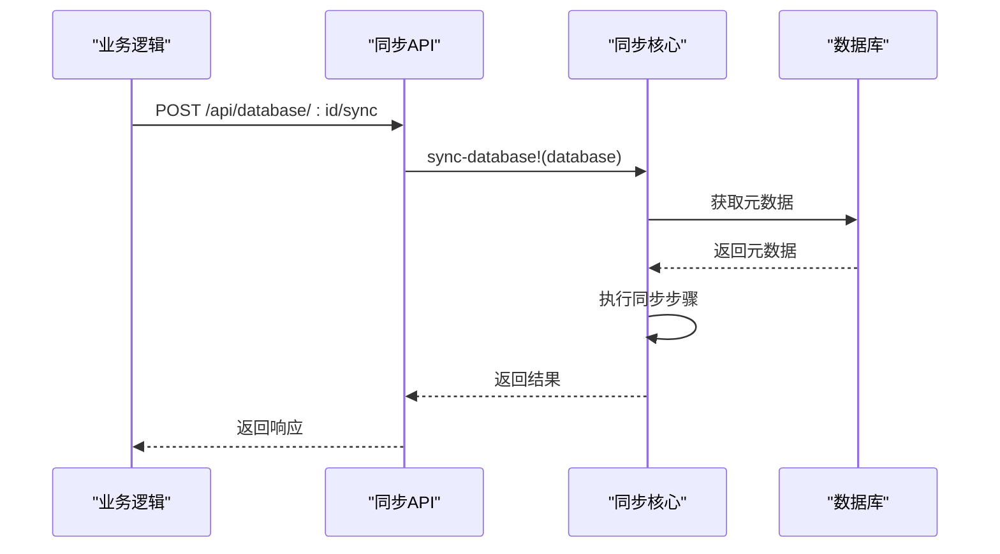

# 元数据获取

<cite>
**本文档中引用的文件**   
- [api.clj](file://src/metabase/warehouses/api.clj)
- [sync_metadata.clj](file://src/metabase/sync/sync_metadata.clj)
- [sync.clj](file://src/metabase/sync/sync.clj)
- [fetch_metadata.clj](file://src/metabase/sync/fetch_metadata.clj)
- [tables.clj](file://src/metabase/sync/sync_metadata/tables.clj)
- [sync_instances.clj](file://src/metabase/sync/sync_metadata/fields/sync_instances.clj)
- [util.clj](file://src/metabase/sync/util.clj)
- [jvm.clj](file://src/metabase/lib_be/metadata/jvm.clj)
- [metadata_provider_cache.clj](file://src/metabase/server/middleware/metadata_provider_cache.clj)
</cite>

## 目录
1. [引言](#引言)
2. [核心API端点](#核心api端点)
3. [元数据同步机制](#元数据同步机制)
4. [元数据持久化](#元数据持久化)
5. [缓存机制与性能优化](#缓存机制与性能优化)
6. [业务逻辑调用示例](#业务逻辑调用示例)
7. [结论](#结论)

## 引言

本文档详细记录了Metabase系统中数据库元数据获取的完整机制。系统通过API端点获取数据库、表、字段、指标和段的元数据，实现了从外部数据库到应用数据库的元数据同步与持久化。文档涵盖了核心API端点的请求参数、权限控制和响应结构，解释了sync-database!、sync-db-metadata!等关键函数的调用链和执行逻辑，说明了元数据在应用数据库中的存储与更新策略，并提供了缓存机制和性能优化策略。

## 核心API端点

Metabase提供了多个核心API端点来获取数据库元数据，这些端点构成了元数据获取的基础。

### GET /api/database

此端点用于获取所有数据库的列表。支持多种查询参数来控制返回的数据：

- `include=tables`：包含每个数据库的表信息
- `saved`：包含保存问题的虚拟数据库
- `include_editable_data_model`：仅包含当前用户具有数据模型编辑权限的数据库
- `exclude_uneditable_details`：仅包含当前用户可以编辑数据库详细信息的数据库
- `include_only_uploadable`：仅包含Metabase可以插入新数据的数据库

该端点的实现位于`warehouses/api.clj`文件中，通过`dbs-list`函数构建查询条件，根据用户权限过滤数据库列表。

**Section sources**
- [api.clj](file://src/metabase/warehouses/api.clj#L32-L363)

### GET /api/database/:id

此端点用于获取单个数据库的详细信息。支持以下查询参数：

- `include`：可选值为"tables"或"tables.fields"，用于包含表或表及字段信息
- `include_editable_data_model`：仅返回用户具有数据模型编辑权限的表
- `exclude_uneditable_details`：仅返回用户可以管理的数据库

该端点会根据用户权限返回不同的信息级别，如果用户没有写权限，则会排除敏感的详细信息。

**Section sources**
- [api.clj](file://src/metabase/warehouses/api.clj#L364-L426)

### GET /api/database/:id/metadata

这是获取数据库元数据的核心端点，返回数据库的完整元数据，包括所有表和字段信息。

**Diagram sources**
- [api.clj](file://src/metabase/warehouses/api.clj#L510-L574)

该端点支持以下查询参数：
- `include_hidden`：包含隐藏的表和字段（默认为false）
- `include_editable_data_model`：仅返回用户具有数据模型编辑权限的表
- `remove_inactive`：移除非活动表
- `skip_fields`：跳过字段信息

响应包含数据库、表、字段和字段值的完整信息，默认情况下只返回非隐藏的表和字段。

**Section sources**
- [api.clj](file://src/metabase/warehouses/api.clj#L510-L574)

## 元数据同步机制

元数据同步是Metabase的核心功能之一，确保应用数据库中的元数据与外部数据库保持同步。

### sync-database! 函数

`sync-database!`函数是元数据同步的主要入口点，负责执行数据库的完整同步过程。

**Diagram sources**
- [sync.clj](file://src/metabase/sync/sync.clj#L28-L62)

该函数执行以下三个主要阶段：
1. **元数据同步**：同步数据库、表和字段的结构信息
2. **分析**：分析数据以生成指纹和统计信息
3. **字段值缓存**：更新字段值的缓存

每个阶段都有对应的函数实现，通过`phase->fn`映射进行调用。

**Section sources**
- [sync.clj](file://src/metabase/sync/sync.clj#L28-L62)

### sync-db-metadata! 函数

`sync-db-metadata!`函数负责同步数据库的元数据，确保表和字段对象保持同步。

**Diagram sources**
- [sync_metadata.clj](file://src/metabase/sync/sync_metadata.clj#L52-L71)

该函数的执行流程如下：
1. 通过`fetch-metadata/db-metadata`从外部数据库获取元数据
2. 创建一系列同步步骤，包括：
   - 同步数据库版本
   - 同步时区
   - 同步表结构
   - 同步字段
   - 同步外键
   - 同步索引
   - 同步元数据表
3. 执行所有同步步骤
4. 根据执行结果设置数据库的初始同步状态

**Section sources**
- [sync_metadata.clj](file://src/metabase/sync/sync_metadata.clj#L52-L71)

### 同步步骤执行

同步操作通过`sync-operation`宏包装，提供了错误处理、日志记录、重复操作预防和事件发布等功能。

**Diagram sources**
- [util.clj](file://src/metabase/sync/util.clj#L239-L262)

`sync-operation`宏组合了多个中间件功能：
- `with-duplicate-ops-prevented`：防止同一数据库的重复同步操作
- `with-sync-events`：发布同步开始和结束事件
- `with-start-and-finish-logging`：记录开始和结束日志
- `with-db-logging-disabled`：禁用查询处理器和数据库日志
- `sync-in-context`：在数据库驱动的上下文中执行同步

**Section sources**
- [util.clj](file://src/metabase/sync/util.clj#L239-L262)

## 元数据持久化

元数据在应用数据库中的持久化涉及表结构和字段信息的存储与更新策略。

### 表元数据同步

表元数据的同步由`sync-tables-and-database!`函数处理，负责创建、更新或停用表。

**Diagram sources**
- [tables.clj](file://src/metabase/sync/sync_metadata/tables.clj#L373-L394)

同步过程包括：
1. 比较现有表元数据和数据库表元数据
2. 更新需要修改的表结构
3. 更新数据库元数据（如版本信息）
4. 创建新表或重新激活已停用的表
5. 将旧表标记为非活动状态

**Section sources**
- [tables.clj](file://src/metabase/sync/sync_metadata/tables.clj#L373-L394)

### 字段元数据同步

字段元数据的同步由`sync-fields!`和`sync-fields-for-table!`函数处理，确保字段信息的准确性。

**Diagram sources**
- [sync_instances.clj](file://src/metabase/sync/sync_metadata/fields/sync_instances.clj#L44-L60)

字段同步的主要步骤：
1. 查找与新字段元数据匹配的非活动字段
2. 重新激活这些字段
3. 为新字段插入数据库记录
4. 递归处理嵌套字段
5. 将不再存在的字段标记为非活动状态

**Section sources**
- [sync_instances.clj](file://src/metabase/sync/sync_metadata/fields/sync_instances.clj#L44-L60)

## 缓存机制与性能优化

Metabase实现了多层次的缓存机制来优化元数据获取的性能。

### 元数据提供者缓存

元数据提供者缓存通过`with-metadata-provider-cache`宏实现，为API请求的生命周期提供缓存。

**Diagram sources**
- [metadata_provider_cache.clj](file://src/metabase/server/middleware/metadata_provider_cache.clj#L0-L10)
- [jvm.clj](file://src/metabase/lib_be/metadata/jvm.clj#L534-L559)

该缓存机制的特点：
- 在API请求的整个生命周期内有效
- 自动初始化，无需手动创建
- 使用原子缓存工厂存储元数据提供者
- 支持动态作用域的缓存重用

**Section sources**
- [metadata_provider_cache.clj](file://src/metabase/server/middleware/metadata_provider_cache.clj#L0-L10)
- [jvm.clj](file://src/metabase/lib_be/metadata/jvm.clj#L534-L559)

### 查询结果缓存

查询结果缓存通过`cache-backend`协议实现，支持不同的缓存后端。

**Diagram sources**
- [db.clj](file://src/metabase/query_processor/middleware/cache_backend/db.clj#L40-L71)

缓存策略包括：
- TTL（生存时间）策略：基于平均执行时间和乘数计算最大年龄
- 最小持续时间：只有执行时间超过阈值的查询结果才会被缓存
- 定期清理：删除超过全局最大年龄的缓存条目

**Section sources**
- [db.clj](file://src/metabase/query_processor/middleware/cache_backend/db.clj#L40-L71)

## 业务逻辑调用示例

以下是业务逻辑中调用元数据服务的典型示例。

### 获取数据库元数据

**Diagram sources**
- [api.clj](file://src/metabase/warehouses/api.clj#L510-L574)

在业务逻辑中，可以通过以下方式调用元数据服务：

1. 使用`GET /api/database/:id/metadata`端点获取特定数据库的元数据
2. 根据`include_hidden`参数决定是否包含隐藏项
3. 根据`include_editable_data_model`参数控制数据模型权限
4. 处理返回的元数据结构，提取所需信息

**Section sources**
- [api.clj](file://src/metabase/warehouses/api.clj#L510-L574)

### 触发元数据同步

**Diagram sources**
- [sync.clj](file://src/metabase/sync/sync.clj#L28-L62)

触发元数据同步的流程：
1. 业务逻辑调用同步API端点
2. API验证权限并获取数据库对象
3. 调用`sync-database!`函数启动同步
4. 同步函数执行元数据、分析和字段值更新
5. 返回同步结果给业务逻辑

**Section sources**
- [sync.clj](file://src/metabase/sync/sync.clj#L28-L62)

## 结论

Metabase的元数据获取机制是一个复杂而完善的系统，涵盖了从API端点到内部同步逻辑的完整流程。通过`GET /api/database`系列端点，系统提供了灵活的元数据获取方式，支持多种查询参数来控制返回的数据。`sync-database!`和`sync-db-metadata!`等核心函数构成了元数据同步的调用链，确保外部数据库的变更能够及时反映到应用中。

元数据在应用数据库中的持久化采用了创建、更新和停用的策略，既保持了数据的准确性，又保留了历史信息。多层次的缓存机制显著提升了系统性能，特别是元数据提供者缓存和查询结果缓存的结合使用，有效减少了数据库访问次数。

该机制的设计充分考虑了权限控制、错误处理和性能优化，为用户提供了一个稳定可靠的元数据管理解决方案。通过理解这些核心组件和流程，开发者可以更好地利用Metabase的元数据功能，构建高效的数据分析应用。