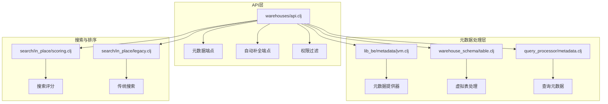
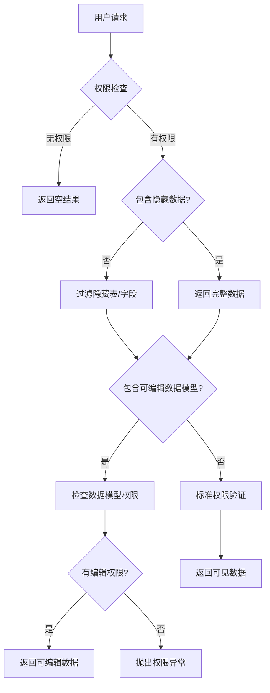
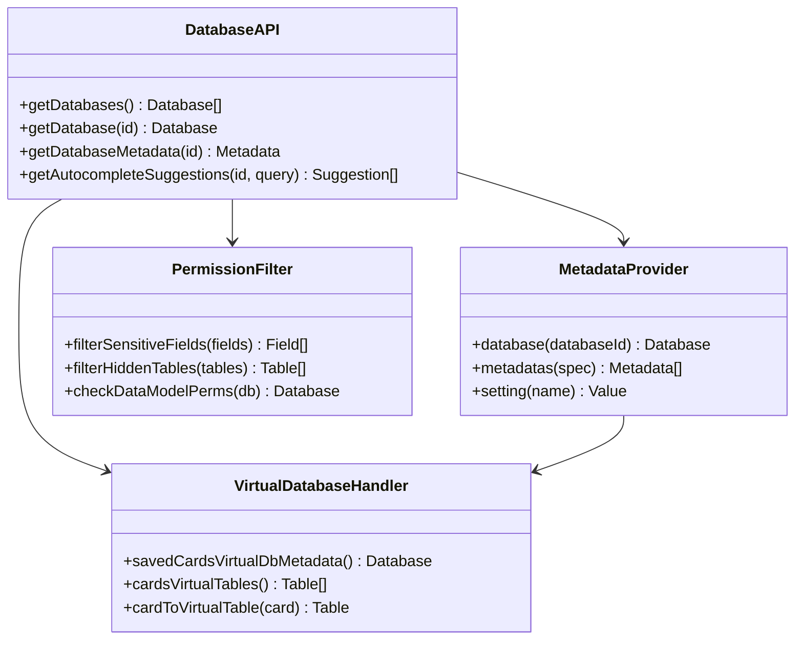
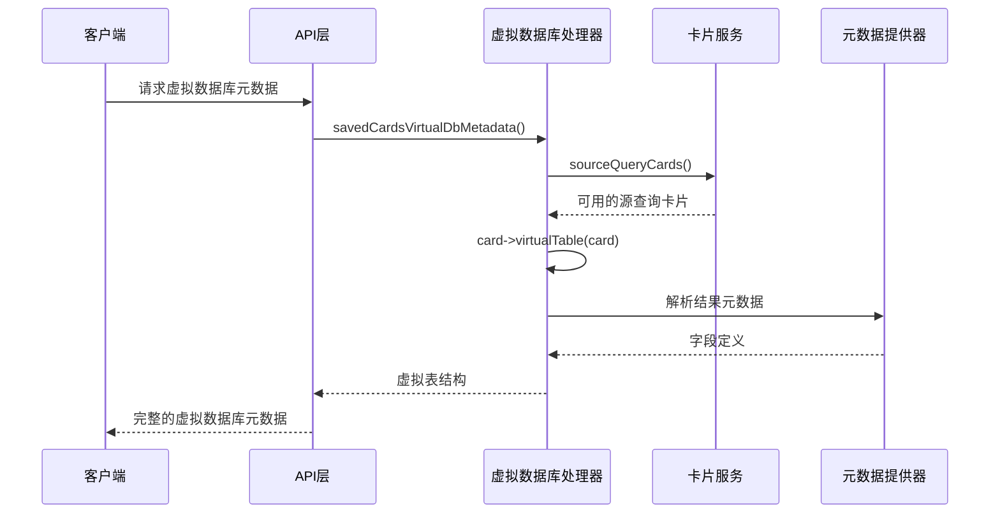
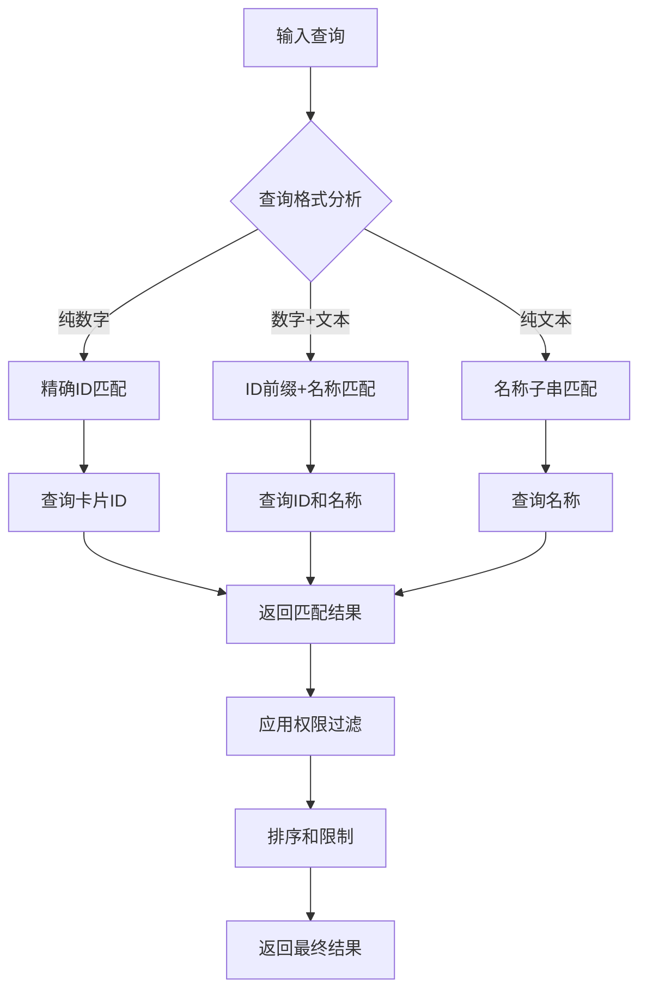
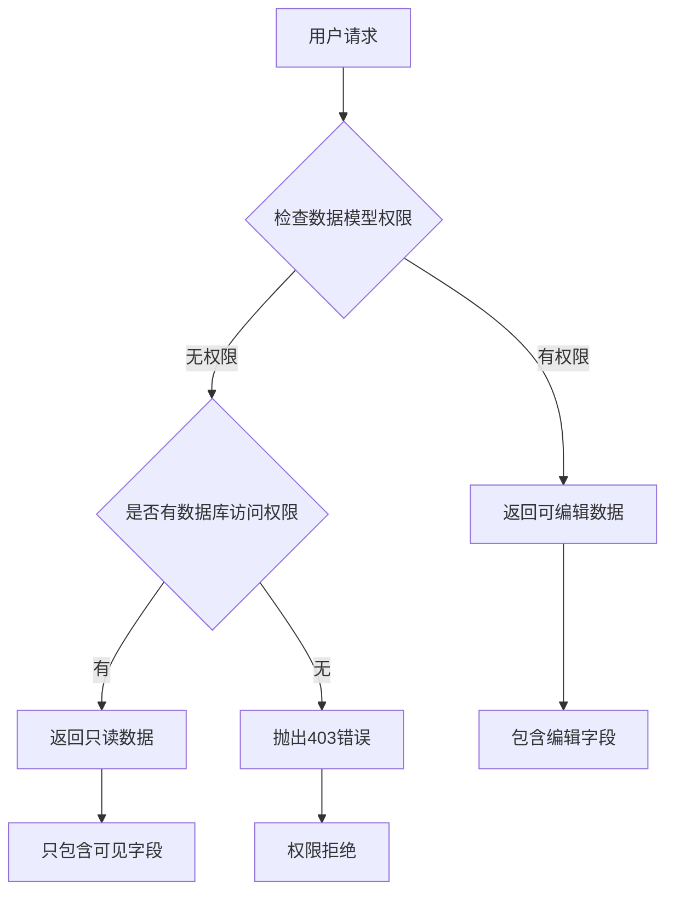
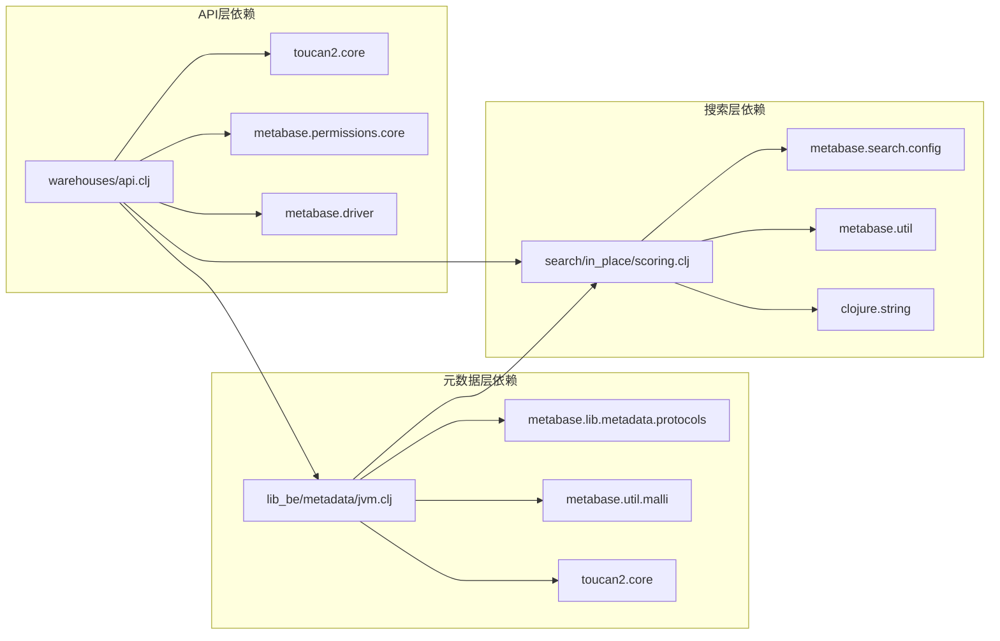

# 数据库元数据操作API详细文档

<cite>
**本文档中引用的文件**
- [warehouses/api.clj](file://src/metabase/warehouses/api.clj)
- [lib_be/metadata/jvm.clj](file://src/metabase/lib_be/metadata/jvm.clj)
- [warehouse_schema/table.clj](file://src/metabase/warehouse_schema/table.clj)
- [query_processor/metadata.clj](file://src/metabase/query_processor/metadata.clj)
- [search/in_place/scoring.clj](file://src/metabase/search/in_place/scoring.clj)
- [search/in_place/legacy.clj](file://src/metabase/search/in_place/legacy.clj)
</cite>

## 目录
1. [简介](#简介)
2. [项目结构概览](#项目结构概览)
3. [核心组件分析](#核心组件分析)
4. [架构概览](#架构概览)
5. [详细组件分析](#详细组件分析)
6. [依赖关系分析](#依赖关系分析)
7. [性能考虑](#性能考虑)
8. [故障排除指南](#故障排除指南)
9. [结论](#结论)

## 简介

Metabase的数据库元数据操作API提供了全面的数据库结构信息获取功能，包括表、字段、段和指标的元数据管理。该系统支持虚拟数据库（如"保存的问题"）的特殊处理，实现了复杂的权限过滤机制，并提供了智能的自动补全建议功能。

本文档详细介绍了元数据API的设计原理、实现细节和使用方法，涵盖了从基础的数据库连接到高级的权限控制和搜索优化等各个方面。

## 项目结构概览

Metabase的元数据操作API主要分布在以下关键模块中：



**图表来源**
- [warehouses/api.clj](file://src/metabase/warehouses/api.clj#L1-L50)
- [lib_be/metadata/jvm.clj](file://src/metabase/lib_be/metadata/jvm.clj#L1-L50)

## 核心组件分析

### 元数据端点设计

Metabase提供了多个专门的元数据获取端点，每个端点都有特定的功能和用途：

#### 基础数据库信息获取
- `/api/database` - 获取所有数据库列表
- `/api/database/:id` - 获取单个数据库详情
- `/api/database/:id/metadata` - 获取完整的数据库元数据

#### 虚拟数据库支持
- `/api/database/-1337/metadata` - 特殊处理保存的问题虚拟数据库
- `/api/database/-1337/schemas` - 虚拟数据库模式信息
- `/api/database/-1337/datasets` - 虚拟数据集信息

#### 高级元数据功能
- `/api/database/:id/autocomplete_suggestions` - 自动补全建议
- `/api/database/:id/card_autocomplete_suggestions` - 卡片自动补全
- `/api/database/:id/fields` - 字段列表获取

**章节来源**
- [warehouses/api.clj](file://src/metabase/warehouses/api.clj#L510-L529)
- [warehouses/api.clj](file://src/metabase/warehouses/api.clj#L574-L599)

### 权限过滤机制

系统实现了多层次的权限过滤，确保用户只能访问其有权限的数据：



**图表来源**
- [warehouses/api.clj](file://src/metabase/warehouses/api.clj#L529-L555)

**章节来源**
- [warehouses/api.clj](file://src/metabase/warehouses/api.clj#L359-L383)

## 架构概览

### 元数据API架构



**图表来源**
- [warehouses/api.clj](file://src/metabase/warehouses/api.clj#L510-L529)
- [lib_be/metadata/jvm.clj](file://src/metabase/lib_be/metadata/jvm.clj#L450-L500)

### 虚拟数据库生成逻辑

虚拟数据库（如保存的问题）的元数据生成遵循特殊的处理流程：



**图表来源**
- [warehouses/api.clj](file://src/metabase/warehouses/api.clj#L201-L225)
- [warehouse_schema/table.clj](file://src/metabase/warehouse_schema/table.clj#L84-L108)

**章节来源**
- [warehouses/api.clj](file://src/metabase/warehouses/api.clj#L201-L225)
- [warehouse_schema/table.clj](file://src/metabase/warehouse_schema/table.clj#L84-L108)

## 详细组件分析

### 元数据查询参数详解

#### include_hidden 参数
控制是否包含隐藏的表和字段：
- `false`（默认）：只返回非隐藏的表和字段
- `true`：返回所有表和字段，包括隐藏的

#### include_editable_data_model 参数
控制是否包含可编辑的数据模型：
- `false`（默认）：只返回当前用户有权限查看的表
- `true`：返回当前用户有数据模型编辑权限的表

#### remove_inactive 参数
移除不活跃的表：
- `false`（默认）：保留所有状态的表
- `true`：只返回活跃的表

#### skip_fields 参数
跳过字段查询以提高性能：
- `false`（默认）：查询完整的表结构
- `true`：只查询表的基本信息

**章节来源**
- [warehouses/api.clj](file://src/metabase/warehouses/api.clj#L574-L599)

### 自动补全建议功能

#### 表和字段搜索匹配算法

系统实现了智能的自动补全算法，支持多种匹配模式：



**图表来源**
- [warehouses/api.clj](file://src/metabase/warehouses/api.clj#L598-L619)

#### 搜索评分算法

系统使用复杂的评分算法来确定搜索结果的相关性：

| 评分器 | 权重 | 描述 |
|--------|------|------|
| exact-match | 4 | 精确匹配得分 |
| consecutivity | 2 | 连续匹配得分 |
| total-occurrences | 2 | 总出现次数得分 |
| fullness | 1 | 完整度得分 |
| prefix | 1 | 前缀匹配得分 |

**章节来源**
- [warehouses/api.clj](file://src/metabase/warehouses/api.clj#L598-L619)
- [search/in_place/scoring.clj](file://src/metabase/search/in_place/scoring.clj#L132-L137)

### 响应结构示例

#### 基础数据库元数据响应

```json
{
  "id": 1,
  "name": "Sample Database",
  "engine": "postgres",
  "tables": [
    {
      "id": 101,
      "name": "users",
      "schema": "public",
      "fields": [
        {
          "id": 1001,
          "name": "id",
          "base_type": "IntegerField",
          "semantic_type": "type/PK"
        },
        {
          "id": 1002,
          "name": "email",
          "base_type": "StringField",
          "semantic_type": "type/Email"
        }
      ]
    }
  ]
}
```

#### 虚拟数据库元数据响应

```json
{
  "id": -1337,
  "name": "Saved Questions",
  "is_saved_questions": true,
  "tables": [
    {
      "id": "card__123",
      "name": "Monthly Revenue Report",
      "schema": "Everything else",
      "fields": [
        {
          "id": ["field", "revenue", {"base-type": "type/Float"}],
          "name": "revenue",
          "base_type": "FloatField",
          "table_id": "card__123"
        }
      ]
    }
  ]
}
```

**章节来源**
- [warehouses/api.clj](file://src/metabase/warehouses/api.clj#L510-L529)
- [warehouse_schema/table.clj](file://src/metabase/warehouse_schema/table.clj#L84-L108)

### 权限过滤规则详解

#### 隐藏表和字段过滤

系统根据visibility_type字段过滤敏感信息：

| visibility_type | 过滤规则 |
|-----------------|----------|
| `hidden` | 完全隐藏，不在结果中显示 |
| `technical` | 技术性表，可能被隐藏 |
| `cruft` | 废弃表，通常被隐藏 |
| `sensitive` | 敏感字段，需要特殊权限 |
| `retired` | 已退役字段，通常被隐藏 |

#### 用户数据模型编辑权限

对于Enterprise Edition用户，系统提供细粒度的数据模型编辑权限控制：



**图表来源**
- [warehouses/api.clj](file://src/metabase/warehouses/api.clj#L201-L225)

**章节来源**
- [warehouses/api.clj](file://src/metabase/warehouses/api.clj#L201-L225)
- [lib_be/metadata/jvm.clj](file://src/metabase/lib_be/metadata/jvm.clj#L450-L500)

## 依赖关系分析

### 核心依赖图



**图表来源**
- [warehouses/api.clj](file://src/metabase/warehouses/api.clj#L1-L50)
- [lib_be/metadata/jvm.clj](file://src/metabase/lib_be/metadata/jvm.clj#L1-L50)

### 外部依赖

系统依赖以下外部组件：
- **Toucan2 ORM**：数据库查询和对象映射
- **Malli Schema**：类型验证和规范化
- **Driver API**：数据库驱动抽象层
- **权限系统**：细粒度权限控制

**章节来源**
- [warehouses/api.clj](file://src/metabase/warehouses/api.clj#L1-L50)
- [lib_be/metadata/jvm.clj](file://src/metabase/lib_be/metadata/jvm.clj#L1-L50)

## 性能考虑

### 查询优化策略

1. **延迟加载**：按需加载表结构和字段信息
2. **缓存机制**：元数据提供器内置缓存
3. **索引优化**：为常用查询字段添加数据库索引
4. **分页处理**：限制返回结果数量避免内存溢出

### 内存使用优化

- 使用`t2/reducible-query`进行流式查询
- 实现增量加载机制
- 合理设置查询限制参数

### 并发处理

- 支持多线程并发查询
- 实现连接池管理
- 提供异步操作支持

## 故障排除指南

### 常见问题及解决方案

#### 权限相关问题

**问题**：无法访问某些数据库或表
**原因**：用户权限不足或表被标记为隐藏
**解决方案**：
1. 检查用户权限配置
2. 验证表的visibility_type设置
3. 使用include_hidden参数查看隐藏内容

#### 性能问题

**问题**：元数据查询响应缓慢
**原因**：查询范围过大或缺少索引
**解决方案**：
1. 使用skip_fields参数减少查询负载
2. 添加适当的数据库索引
3. 调整查询限制参数

#### 虚拟数据库问题

**问题**：保存的问题虚拟数据库不显示
**原因**：没有可用的源查询卡片
**解决方案**：
1. 检查是否有有效的源查询卡片
2. 验证nested_queries功能是否启用
3. 确认用户有访问权限

**章节来源**
- [warehouses/api.clj](file://src/metabase/warehouses/api.clj#L529-L555)
- [warehouse_schema/table.clj](file://src/metabase/warehouse_schema/table.clj#L84-L108)

## 结论

Metabase的数据库元数据操作API提供了一个功能强大且灵活的框架，支持复杂的数据库结构管理和权限控制。通过虚拟数据库支持、智能权限过滤和高效的自动补全功能，该系统能够满足各种企业级数据分析需求。

主要优势包括：
- **完整性**：覆盖所有数据库元素的元数据管理
- **灵活性**：支持多种查询参数和过滤选项
- **安全性**：实现细粒度的权限控制
- **性能**：优化的查询策略和缓存机制
- **扩展性**：模块化设计便于功能扩展

未来的改进方向可能包括：
- 更智能的搜索算法
- 实时元数据更新
- 更丰富的可视化选项
- 增强的性能监控