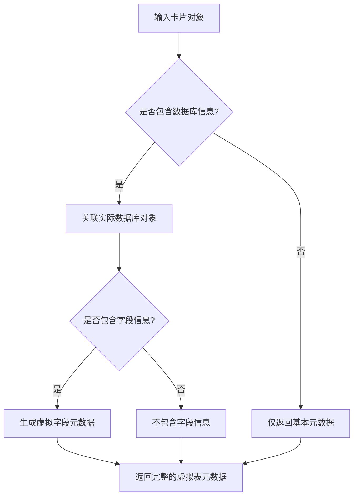
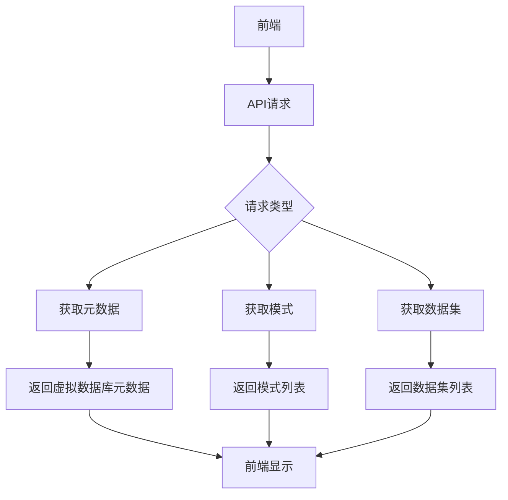
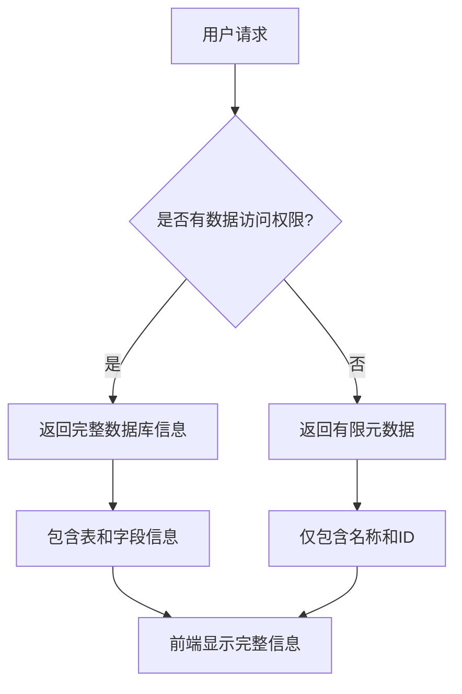
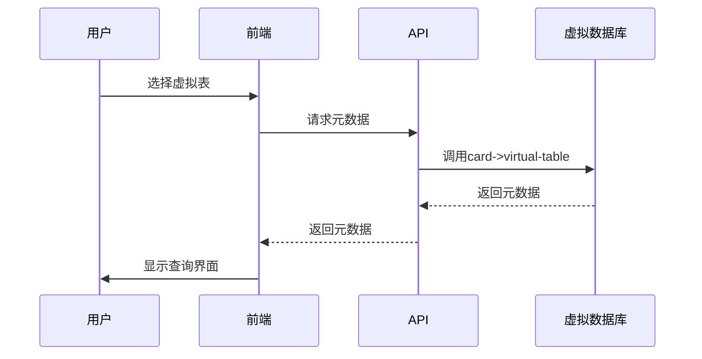

# 虚拟数据库支持

<cite>
**本文档中引用的文件**   
- [table.clj](file://src/metabase/warehouse_schema/table.clj)
- [api.clj](file://src/metabase/warehouses/api.clj)
- [bootstrap.clj](file://src/metabase/lib_be/metadata/bootstrap.clj)
- [setup.clj](file://src/metabase/query_processor/setup.clj)
</cite>

## 目录
1. [简介](#简介)
2. [核心组件](#核心组件)
3. [虚拟数据库元数据生成机制](#虚拟数据库元数据生成机制)
4. [前端集成方式](#前端集成方式)
5. [权限控制细节](#权限控制细节)
6. [实际使用场景和代码示例](#实际使用场景和代码示例)
7. [结论](#结论)

## 简介
Metabase系统通过虚拟数据库机制，将保存的查询卡片（Cards）作为虚拟表暴露给查询构建器。这种机制允许用户将已保存的查询结果视为普通数据库表进行操作，从而实现查询的嵌套和复用。虚拟数据库的核心功能由`saved-cards-virtual-db-metadata`和`card->virtual-table`等函数实现，这些函数负责生成虚拟数据库的元数据，包括表结构、字段信息和权限过滤规则。

## 核心组件

虚拟数据库支持的核心组件包括`card->virtual-table`和`saved-cards-virtual-db-metadata`函数。`card->virtual-table`函数负责将单个卡片转换为虚拟表的元数据，而`saved-cards-virtual-db-metadata`函数则负责生成整个虚拟数据库的元数据。这些函数通过查询处理器的设置和元数据提供者协同工作，确保虚拟数据库能够正确解析和执行查询。

**Section sources**
- [table.clj](file://src/metabase/warehouse_schema/table.clj#L106-L133)
- [api.clj](file://src/metabase/warehouses/api.clj#L194-L207)

## 虚拟数据库元数据生成机制

虚拟数据库的元数据生成机制通过`card->virtual-table`函数实现。该函数接收一个卡片对象，并返回一个包含虚拟表元数据的映射。元数据包括表的ID、显示名称、模式、描述、实体ID、指标和类型等信息。如果请求包含数据库和字段信息，函数还会关联实际的数据库对象和字段元数据。

**Diagram sources **
- [table.clj](file://src/metabase/warehouse_schema/table.clj#L106-L133)

**Section sources**
- [table.clj](file://src/metabase/warehouse_schema/table.clj#L106-L133)

## 前端集成方式

前端通过API端点与虚拟数据库进行集成。系统提供了多个端点来获取虚拟数据库的元数据，包括`/:virtual-db/metadata`、`/:virtual-db/schemas`和`/:virtual-db/datasets`等。这些端点允许前端将虚拟数据库视为普通数据库进行操作，获取其模式、数据集和表信息。

**Diagram sources **
- [api.clj](file://src/metabase/warehouses/api.clj#L510-L529)
- [api.clj](file://src/metabase/warehouses/api.clj#L1215-L1242)

**Section sources**
- [api.clj](file://src/metabase/warehouses/api.clj#L510-L529)
- [api.clj](file://src/metabase/warehouses/api.clj#L1215-L1242)

## 权限控制细节

权限控制通过`filter-databases-by-data-model-perms`函数实现。当用户没有数据访问权限时，系统会返回有限的元数据信息，仅包含数据库的名称和ID。对于有权限的用户，系统会返回完整的数据库信息，包括表和字段的详细信息。

**Diagram sources **
- [api.clj](file://src/metabase/warehouses/api.clj#L201-L225)

**Section sources**
- [api.clj](file://src/metabase/warehouses/api.clj#L201-L225)

## 实际使用场景和代码示例

在实际使用中，用户可以通过查询构建器选择虚拟数据库中的表进行查询。系统会自动解析虚拟表的元数据，并将其转换为实际的查询。例如，当用户选择一个虚拟表时，系统会调用`card->virtual-table`函数生成元数据，并使用该元数据构建查询。

**Diagram sources **
- [table.clj](file://src/metabase/warehouse_schema/table.clj#L106-L133)
- [api.clj](file://src/metabase/warehouses/api.clj#L510-L529)

**Section sources**
- [table.clj](file://src/metabase/warehouse_schema/table.clj#L106-L133)
- [api.clj](file://src/metabase/warehouses/api.clj#L510-L529)

## 结论
Metabase的虚拟数据库支持机制通过将保存的查询卡片作为虚拟表暴露给查询构建器，实现了查询的嵌套和复用。该机制通过`card->virtual-table`和`saved-cards-virtual-db-metadata`等核心函数生成虚拟数据库的元数据，并通过API端点与前端集成。权限控制确保了用户只能访问其有权限的数据，同时在无权限时返回有限的元数据信息。这种设计使得用户能够方便地将已保存的查询结果作为普通数据库表进行操作，提高了查询的灵活性和复用性。