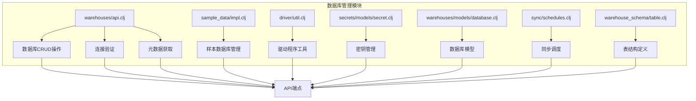
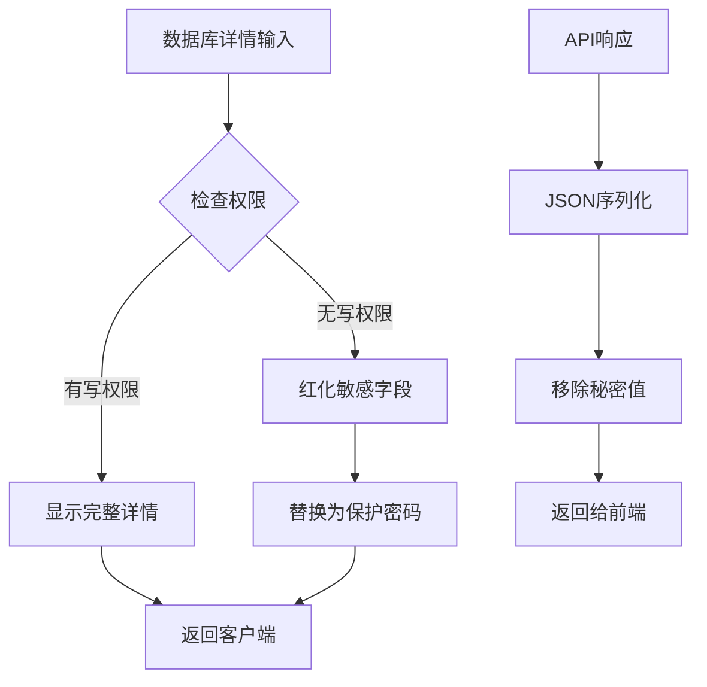
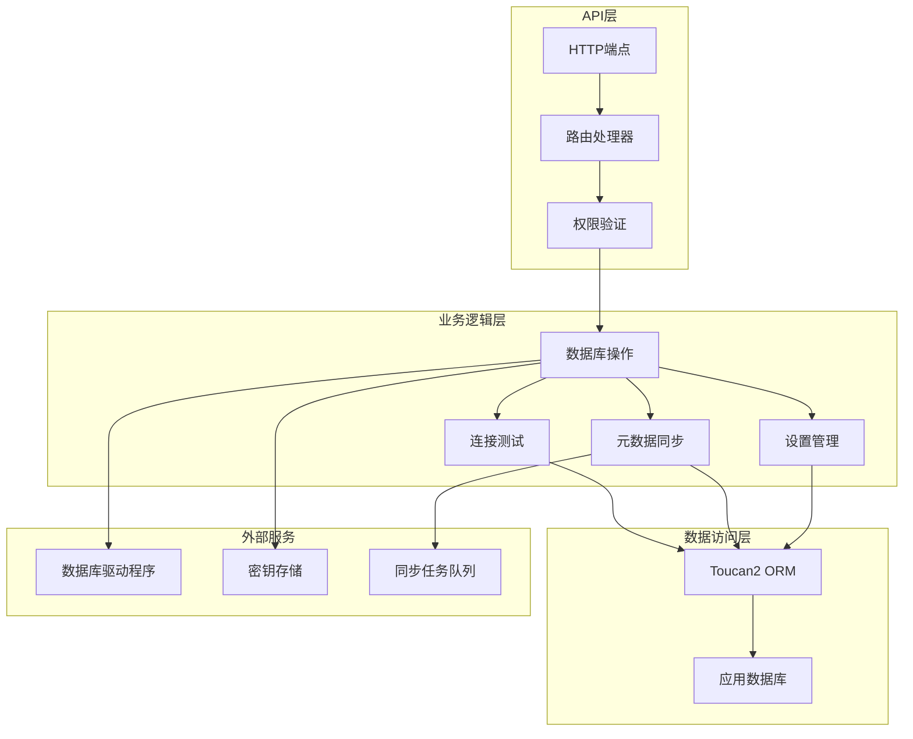
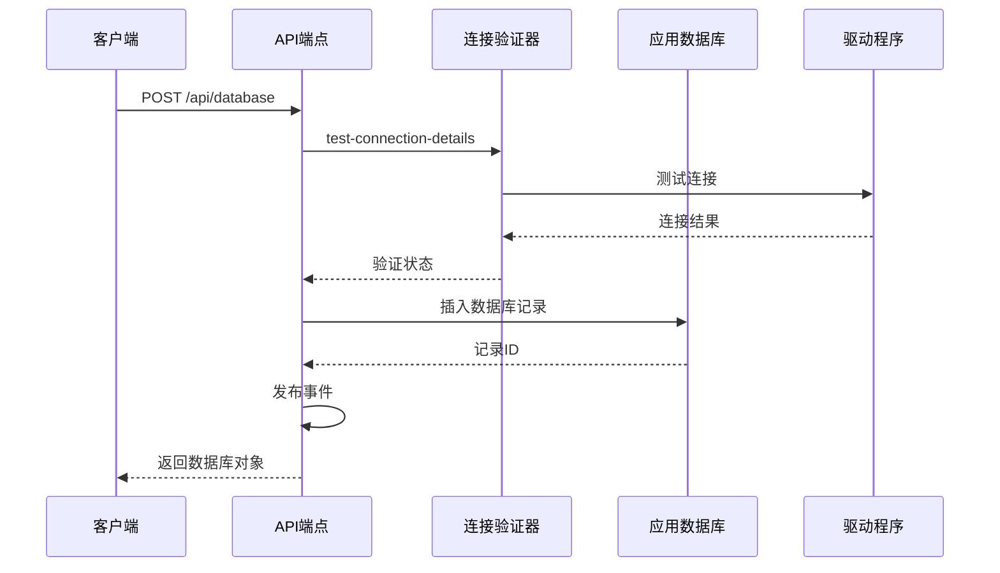
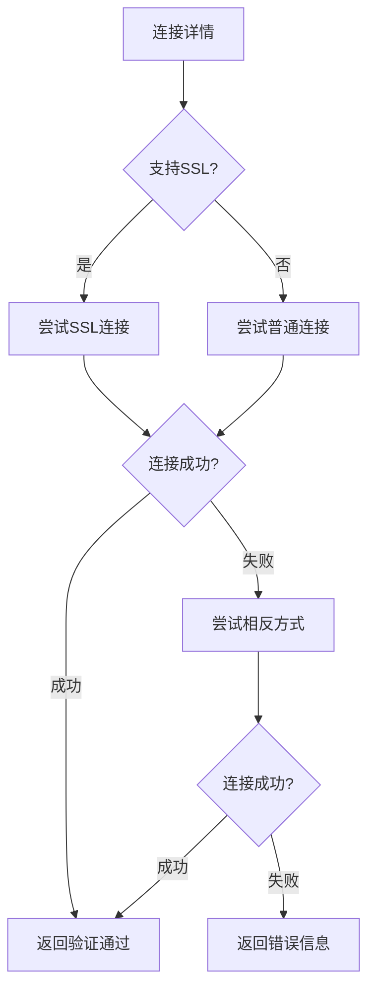
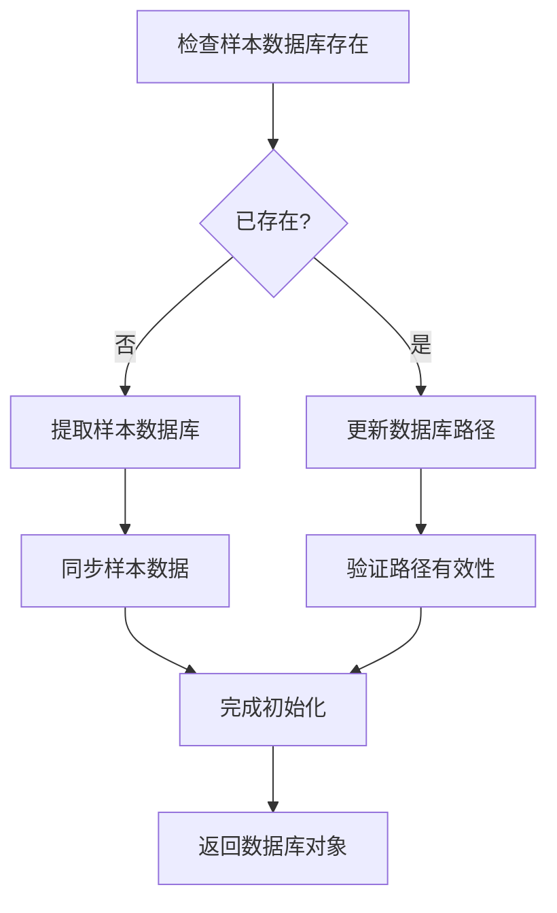
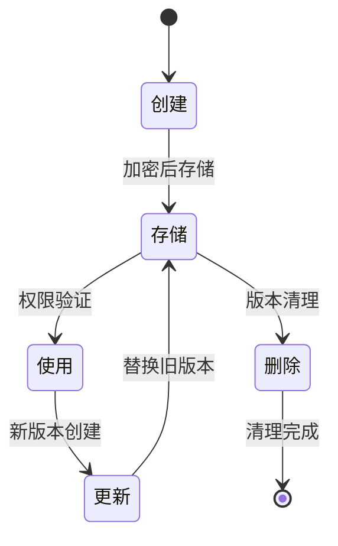
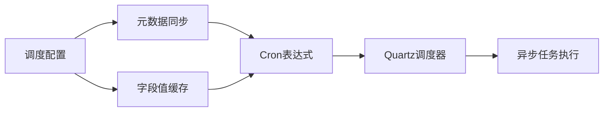
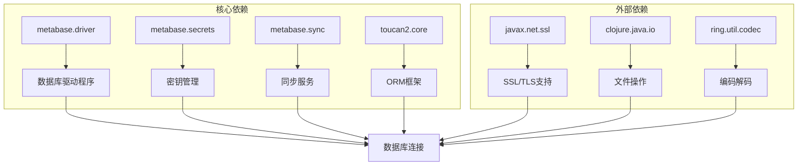

# 数据库管理API

<cite>
**本文档中引用的文件**
- [warehouses/api.clj](file://src/metabase/warehouses/api.clj)
- [sample_data/impl.clj](file://src/metabase/sample_data/impl.clj)
- [driver/util.clj](file://src/metabase/driver/util.clj)
- [secrets/models/secret.clj](file://src/metabase/secrets/models/secret.clj)
- [warehouses/models/database.clj](file://src/metabase/warehouses/models/database.clj)
- [sync/schedules.clj](file://src/metabase/sync/schedules.clj)
- [warehouse_schema/table.clj](file://src/metabase/warehouse_schema/table.clj)
</cite>

## 目录
1. [简介](#简介)
2. [项目结构](#项目结构)
3. [核心组件](#核心组件)
4. [架构概览](#架构概览)
5. [详细组件分析](#详细组件分析)
6. [依赖关系分析](#依赖关系分析)
7. [性能考虑](#性能考虑)
8. [故障排除指南](#故障排除指南)
9. [结论](#结论)

## 简介

Metabase数据库管理API是一个全面的RESTful接口，用于管理Metabase实例中的各种数据库连接。该API提供了从数据库连接验证到元数据获取的完整生命周期管理功能，包括安全的敏感字段处理、样本数据库管理以及虚拟数据库支持。

该API系统设计为高度可扩展，支持多种数据库驱动程序，并提供了强大的安全机制来保护敏感的数据库连接信息。通过统一的接口，用户可以轻松地添加、配置、监控和维护多个数据库连接。

## 项目结构

数据库管理API的核心文件组织在以下目录结构中：

**图表来源**
- [warehouses/api.clj](file://src/metabase/warehouses/api.clj#L1-L50)
- [sample_data/impl.clj](file://src/metabase/sample_data/impl.clj#L1-L30)
- [driver/util.clj](file://src/metabase/driver/util.clj#L1-L40)

## 核心组件

### 数据库连接管理

数据库连接管理是API的核心功能，负责处理数据库的创建、更新、删除和验证操作。主要特性包括：

- **多驱动程序支持**：支持PostgreSQL、MySQL、H2、Oracle等多种数据库引擎
- **连接参数验证**：自动验证连接字符串和认证凭据
- **SSL/TLS配置**：支持加密连接和证书管理
- **连接池管理**：优化数据库连接资源使用

### 敏感字段保护机制

为了确保数据库连接信息的安全性，API实现了多层次的保护机制：

**图表来源**
- [secrets/models/secret.clj](file://src/metabase/secrets/models/secret.clj#L325-L364)
- [warehouses/models/database.clj](file://src/metabase/warehouses/models/database.clj#L540-L580)

### 虚拟数据库支持

API提供了对虚拟数据库的完整支持，允许用户将保存的问题作为虚拟表进行查询：

- **Saved Questions虚拟数据库**：将收藏的问题转换为虚拟表结构
- **嵌套查询支持**：允许在查询中使用其他查询作为源
- **集合隔离**：基于集合名称组织虚拟表
- **权限控制**：继承基础问题的访问权限

**章节来源**
- [warehouses/api.clj](file://src/metabase/warehouses/api.clj#L510-L529)
- [warehouse_schema/table.clj](file://src/metabase/warehouse_schema/table.clj#L107-L133)

## 架构概览

数据库管理API采用分层架构设计，确保了良好的可维护性和扩展性：

**图表来源**
- [warehouses/api.clj](file://src/metabase/warehouses/api.clj#L1-L50)
- [warehouses/models/database.clj](file://src/metabase/warehouses/models/database.clj#L1-L50)

## 详细组件分析

### 数据库CRUD操作

#### 创建数据库连接

创建新数据库连接的过程包含严格的验证步骤：

**图表来源**
- [warehouses/api.clj](file://src/metabase/warehouses/api.clj#L824-L891)

#### 更新数据库配置

数据库更新操作需要验证新的连接配置：

| 参数类型 | 必需性 | 描述 | 验证规则 |
|---------|--------|------|----------|
| name | 可选 | 数据库显示名称 | 非空字符串 |
| engine | 可选 | 数据库引擎类型 | 支持的驱动程序 |
| details | 可选 | 连接详细信息 | 结构化映射 |
| is_full_sync | 可选 | 是否全量同步 | 布尔值 |
| schedules | 可选 | 同步调度配置 | 有效调度格式 |

**章节来源**
- [warehouses/api.clj](file://src/metabase/warehouses/api.clj#L916-L1056)

### 连接验证机制

连接验证是确保数据库可用性的关键组件：

**图表来源**
- [warehouses/api.clj](file://src/metabase/warehouses/api.clj#L824-L852)

### 元数据获取功能

元数据获取提供了数据库结构信息的完整视图：

#### 表级别元数据

| 字段名 | 类型 | 描述 | 权限要求 |
|--------|------|------|----------|
| id | Integer | 表唯一标识符 | 可读权限 |
| name | String | 表名称 | 可读权限 |
| display_name | String | 显示名称 | 可读权限 |
| schema | String | 模式名称 | 可读权限 |
| active | Boolean | 是否激活 | 可读权限 |
| visibility_type | String | 可见性类型 | 可读权限 |

#### 字段级别元数据

| 字段名 | 类型 | 描述 | 安全处理 |
|--------|------|------|----------|
| id | Integer | 字段唯一标识符 | 所有用户可见 |
| name | String | 字段名称 | 所有用户可见 |
| display_name | String | 显示名称 | 所有用户可见 |
| base_type | String | 基础类型 | 所有用户可见 |
| semantic_type | String | 语义类型 | 所有用户可见 |
| visibility_type | String | 可见性类型 | 敏感字段过滤 |

**章节来源**
- [warehouses/api.clj](file://src/metabase/warehouses/api.clj#L510-L529)

### 样本数据库管理

样本数据库提供了演示和测试功能：

**图表来源**
- [sample_data/impl.clj](file://src/metabase/sample_data/impl.clj#L85-L104)

**章节来源**
- [sample_data/impl.clj](file://src/metabase/sample_data/impl.clj#L1-L106)

### 密钥管理系统

密钥管理系统确保敏感信息的安全存储和传输：

#### 密钥类型支持

| 密钥类型 | 存储方式 | 加密算法 | 访问控制 |
|----------|----------|----------|----------|
| password | AES加密 | 对称加密 | 用户级权限 |
| keystore | 文件存储 | PKCS#12 | 系统级权限 |
| pem-cert | 文本存储 | Base64编码 | 用户级权限 |
| access-token | 内存存储 | 内存加密 | 会话级权限 |

#### 密钥生命周期

**图表来源**
- [secrets/models/secret.clj](file://src/metabase/secrets/models/secret.clj#L60-L100)

**章节来源**
- [secrets/models/secret.clj](file://src/metabase/secrets/models/secret.clj#L1-L404)

### 同步调度配置

数据库同步调度提供了灵活的自动化配置：

#### 默认调度策略

| 同步类型 | 默认频率 | 随机化 | 触发条件 |
|----------|----------|--------|----------|
| 元数据同步 | 每小时一次 | 是 | 数据库变更 |
| 字段值缓存 | 每天一次 | 是 | 字段值变更 |
| 样本数据库 | 每小时一次 | 是 | 首次加载 |
| 自定义调度 | 用户定义 | 是 | 用户配置 |

#### 调度配置选项

**图表来源**
- [sync/schedules.clj](file://src/metabase/sync/schedules.clj#L55-L73)

**章节来源**
- [sync/schedules.clj](file://src/metabase/sync/schedules.clj#L1-L29)

## 依赖关系分析

数据库管理API的依赖关系体现了模块化设计的优势：

**图表来源**
- [warehouses/api.clj](file://src/metabase/warehouses/api.clj#L1-L34)
- [driver/util.clj](file://src/metabase/driver/util.clj#L1-L30)

**章节来源**
- [warehouses/api.clj](file://src/metabase/warehouses/api.clj#L1-L34)

## 性能考虑

### 连接池优化

数据库连接池管理是性能优化的关键方面：

- **连接复用**：避免频繁的连接建立和销毁
- **超时控制**：设置合理的连接超时时间
- **健康检查**：定期验证连接的有效性
- **资源限制**：防止连接数无限增长

### 缓存策略

API实现了多层缓存机制：

- **驱动程序缓存**：缓存数据库驱动程序实例
- **特征检测缓存**：缓存数据库功能支持信息
- **权限缓存**：缓存用户权限检查结果
- **元数据缓存**：缓存数据库结构信息

### 异步处理

对于耗时操作，API采用异步处理模式：

- **同步任务**：元数据同步、字段值扫描
- **后台作业**：定期健康检查、统计收集
- **流式处理**：大数据集的分批处理

## 故障排除指南

### 常见连接问题

| 错误类型 | 可能原因 | 解决方案 | 预防措施 |
|----------|----------|----------|----------|
| 连接超时 | 网络延迟或服务器负载 | 增加超时时间，检查网络 | 监控网络质量 |
| 认证失败 | 凭据错误或权限不足 | 验证用户名密码 | 使用强密码策略 |
| SSL握手失败 | 证书问题或协议不匹配 | 检查证书有效性 | 更新SSL配置 |
| 驱动不兼容 | 版本不匹配或功能缺失 | 升级驱动程序 | 版本兼容性测试 |

### 调试工具

API提供了多种调试和诊断功能：

- **健康检查端点**：`GET /api/database/:id/healthcheck`
- **连接验证**：`POST /api/database/validate`
- **详细日志**：连接过程的详细日志记录
- **性能指标**：连接时间和成功率统计

### 监控指标

关键监控指标包括：

- **连接成功率**：成功连接与总尝试次数的比例
- **平均响应时间**：连接验证的平均耗时
- **错误分布**：不同类型错误的发生频率
- **资源使用率**：数据库连接池的使用情况

**章节来源**
- [warehouses/api.clj](file://src/metabase/warehouses/api.clj#L1309-L1332)
- [driver/util.clj](file://src/metabase/driver/util.clj#L100-L150)

## 结论

Metabase数据库管理API提供了一个功能完整、安全可靠的数据库连接管理解决方案。通过模块化的架构设计、强大的安全机制和灵活的配置选项，该API能够满足企业级应用的各种需求。

主要优势包括：

- **安全性**：多层次的敏感信息保护机制
- **可扩展性**：支持多种数据库驱动程序
- **可靠性**：完善的错误处理和恢复机制
- **易用性**：直观的RESTful API设计
- **性能**：优化的连接管理和缓存策略

未来的改进方向可能包括：

- 更细粒度的权限控制
- 增强的监控和告警功能
- 更智能的连接池管理
- 改进的错误诊断能力

该API为Metabase的数据集成能力奠定了坚实的基础，是构建现代数据分析平台的重要组成部分。