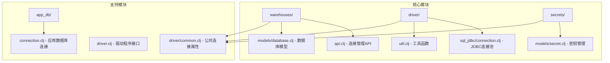
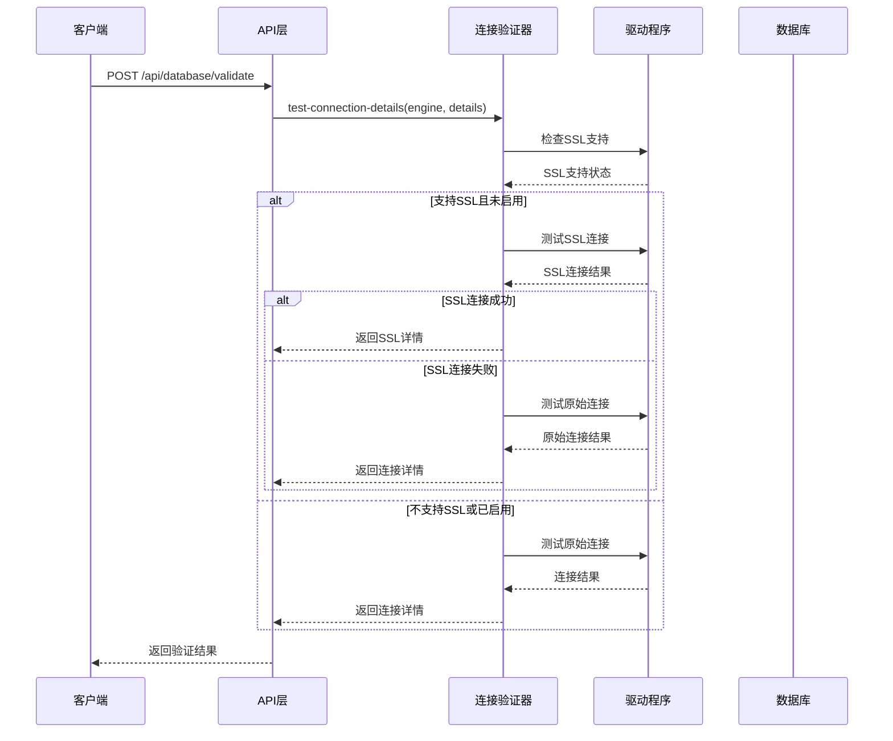
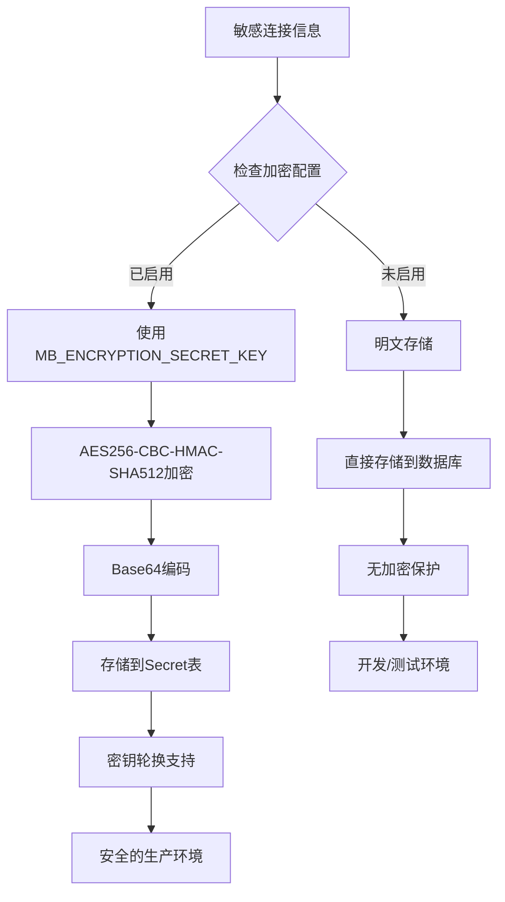
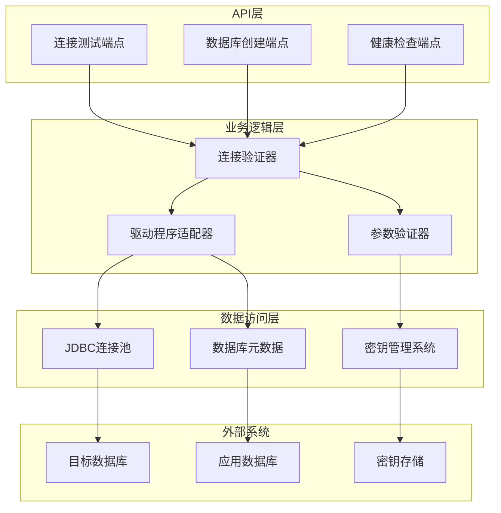
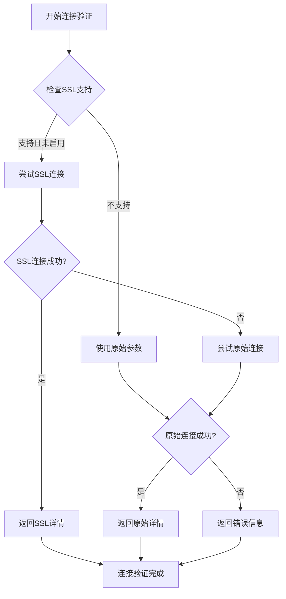
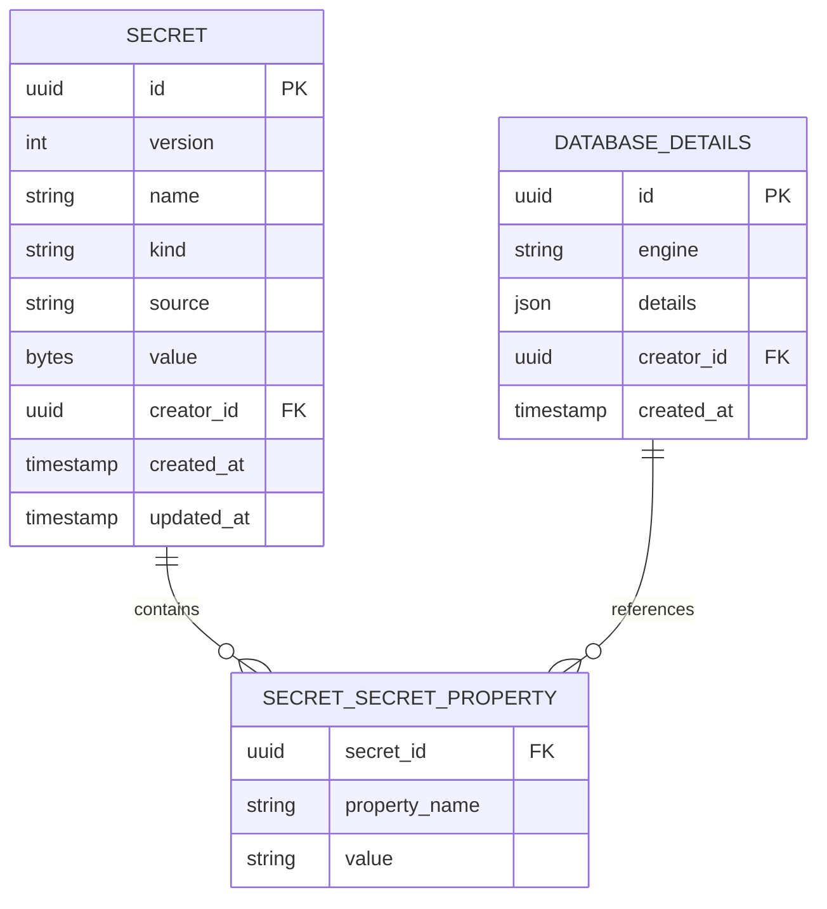
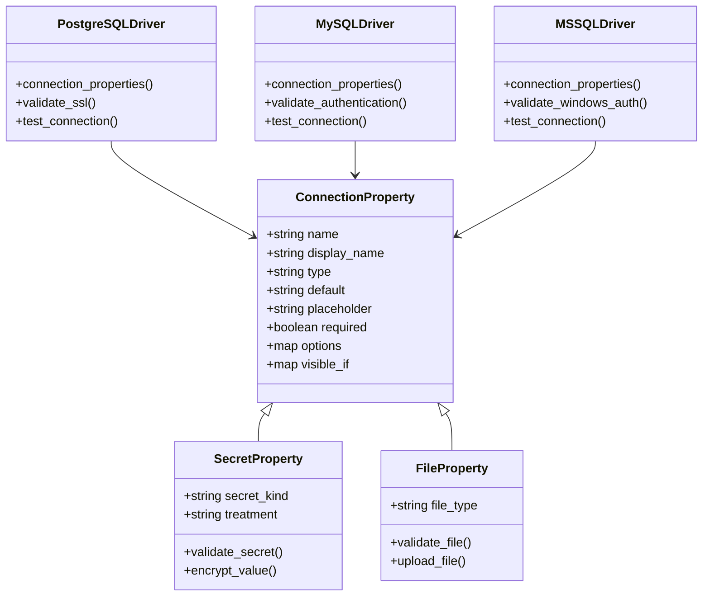
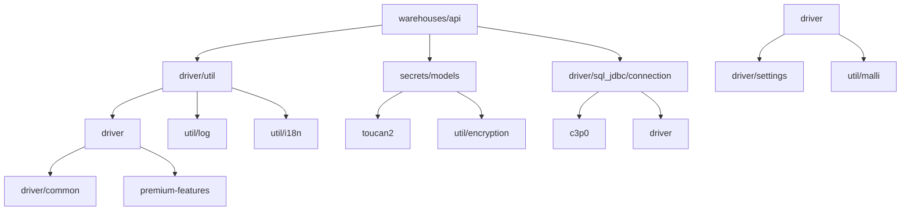
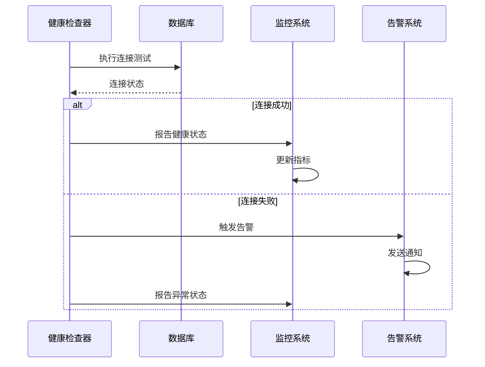

# Metabase数据库连接管理API完整文档

<cite>
**本文档中引用的文件**
- [warehouses/api.clj](file://src/metabase/warehouses/api.clj)
- [secrets/models/secret.clj](file://src/metabase/secrets/models/secret.clj)
- [driver/sql_jdbc/connection.clj](file://src/metabase/driver/sql_jdbc/connection.clj)
- [driver/util.clj](file://src/metabase/driver/util.clj)
- [driver.clj](file://src/metabase/driver.clj)
- [driver/common.clj](file://src/metabase/driver/common.clj)
- [warehouses/models/database.clj](file://src/metabase/warehouses/models/database.clj)
</cite>

## 目录
1. [简介](#简介)
2. [项目结构概览](#项目结构概览)
3. [核心组件分析](#核心组件分析)
4. [架构概览](#架构概览)
5. [详细组件分析](#详细组件分析)
6. [依赖关系分析](#依赖关系分析)
7. [性能考虑](#性能考虑)
8. [故障排除指南](#故障排除指南)
9. [结论](#结论)

## 简介

Metabase数据库连接管理API是一个复杂而强大的系统，负责管理与各种数据库的连接、验证和安全处理。该系统提供了完整的数据库连接生命周期管理，从连接测试到敏感信息加密存储，确保数据安全性和系统稳定性。

本文档详细阐述了Metabase数据库连接管理的核心机制，包括：
- 数据库连接测试端点的实现原理
- 连接验证流程和错误处理策略
- 网络可达性检测逻辑
- 敏感连接信息的安全处理方式
- 不同数据库引擎的连接参数要求
- 请求/响应示例和场景分析

## 项目结构概览

Metabase数据库连接管理系统采用模块化架构，主要分布在以下关键目录中：

**图表来源**
- [warehouses/api.clj](file://src/metabase/warehouses/api.clj#L1-L50)
- [driver/sql_jdbc/connection.clj](file://src/metabase/driver/sql_jdbc/connection.clj#L1-L50)
- [secrets/models/secret.clj](file://src/metabase/secrets/models/secret.clj#L1-L50)

## 核心组件分析

### 数据库连接测试端点

数据库连接测试是整个系统的核心功能，通过`/api/database/validate`端点提供服务。该端点实现了智能的连接验证流程：

**图表来源**
- [warehouses/api.clj](file://src/metabase/warehouses/api.clj#L824-L852)
- [driver/util.clj](file://src/metabase/driver/util.clj#L119-L168)

### 敏感信息加密保护机制

Metabase采用多层加密策略保护敏感数据库连接信息：

**图表来源**
- [secrets/models/secret.clj](file://src/metabase/secrets/models/secret.clj#L274-L328)
- [util/encryption.clj](file://src/metabase/util/encryption.clj#L64-L98)

**章节来源**
- [warehouses/api.clj](file://src/metabase/warehouses/api.clj#L824-L852)
- [secrets/models/secret.clj](file://src/metabase/secrets/models/secret.clj#L1-L100)

## 架构概览

Metabase数据库连接管理系统采用分层架构设计，确保各组件职责清晰、耦合度低：

**图表来源**
- [warehouses/api.clj](file://src/metabase/warehouses/api.clj#L890-L916)
- [driver/sql_jdbc/connection.clj](file://src/metabase/driver/sql_jdbc/connection.clj#L96-L113)

## 详细组件分析

### 连接验证流程

连接验证是数据库连接管理的核心环节，实现了多层次的验证策略：

#### SSL连接优先级策略

**图表来源**
- [warehouses/api.clj](file://src/metabase/warehouses/api.clj#L824-L852)

#### 错误处理策略

系统实现了详细的错误分类和处理机制：

| 错误类型 | 描述 | 处理方式 | 用户提示 |
|---------|------|---------|---------|
| 主机不可达 | 网络连接失败 | 检测网络连通性 | "检查您的主机设置" |
| 端口错误 | 端口无效或被拒绝 | 验证端口配置 | "检查您的端口设置" |
| 认证失败 | 用户名或密码错误 | 验证凭据有效性 | "检查您的用户名和密码" |
| SSL证书问题 | SSL连接失败 | 检查SSL配置 | "请启用SSL或检查证书" |
| 超时错误 | 连接超时 | 设置合理的超时时间 | "连接超时，请重试" |

**章节来源**
- [driver/util.clj](file://src/metabase/driver/util.clj#L89-L122)
- [driver/util.clj](file://src/metabase/driver/util.clj#L119-L143)

### 密钥管理系统

密钥管理系统负责保护数据库连接中的敏感信息，采用多层加密和访问控制：

#### 密钥存储结构

**图表来源**
- [secrets/models/secret.clj](file://src/metabase/secrets/models/secret.clj#L274-L295)

#### 敏感字段识别

系统自动识别并保护以下敏感字段：

| 字段类型 | 示例字段 | 加密方式 | 存储位置 |
|---------|---------|---------|---------|
| 密码 | password, pass | AES256加密 | Secret表 |
| 私钥 | tunnel-private-key | Base64编码 | Secret表 |
| 访问令牌 | access-token, refresh-token | AES256加密 | Secret表 |
| 证书 | ssl-cert | Base64编码 | Secret表 |
| 连接字符串 | connection-string | 部分脱敏 | 数据库 |

**章节来源**
- [secrets/models/secret.clj](file://src/metabase/secrets/models/secret.clj#L168-L197)
- [driver/util.clj](file://src/metabase/driver/util.clj#L640-L660)

### 数据库驱动程序接口

不同数据库引擎具有不同的连接参数要求，系统通过统一的接口管理这些差异：

#### 连接参数模板

**图表来源**
- [driver.clj](file://src/metabase/driver.clj#L391-L418)
- [driver/common.clj](file://src/metabase/driver/common.clj#L61-L94)

**章节来源**
- [driver.clj](file://src/metabase/driver.clj#L418-L450)
- [driver/common.clj](file://src/metabase/driver/common.clj#L0-L94)

### 连接池管理

JDBC连接池是系统性能的关键组件，实现了高效的连接复用和资源管理：

#### 连接池配置策略

| 参数 | 默认值 | 说明 | 性能影响 |
|------|--------|------|---------|
| maxPoolSize | 动态计算 | 最大连接数 | 影响并发能力 |
| minPoolSize | 0 | 最小空闲连接 | 减少连接建立开销 |
| maxIdleTime | 3小时 | 连接最大空闲时间 | 控制内存使用 |
| acquireIncrement | 1 | 获取连接增量 | 平衡延迟和资源 |
| testConnectionOnCheckout | true | 连接检查 | 确保连接有效性 |
| unreturnedConnectionTimeout | 查询超时 | 未返回连接超时 | 防止连接泄漏 |

**章节来源**
- [driver/sql_jdbc/connection.clj](file://src/metabase/driver/sql_jdbc/connection.clj#L96-L113)

## 依赖关系分析

系统的依赖关系体现了模块化设计的优势：

**图表来源**
- [warehouses/api.clj](file://src/metabase/warehouses/api.clj#L1-L50)
- [driver/util.clj](file://src/metabase/driver/util.clj#L1-L50)

**章节来源**
- [warehouses/api.clj](file://src/metabase/warehouses/api.clj#L1-L100)
- [driver/sql_jdbc/connection.clj](file://src/metabase/driver/sql_jdbc/connection.clj#L1-L100)

## 性能考虑

### 连接超时优化

系统设置了合理的连接超时策略，平衡性能和可靠性：

- **数据库连接超时**: 可配置，默认值为驱动特定的最佳实践
- **查询执行超时**: 基于查询复杂度动态调整
- **连接池初始化超时**: 防止长时间阻塞
- **健康检查超时**: 异步执行，不影响主流程

### 内存管理

- **连接池大小限制**: 防止内存溢出
- **密钥缓存策略**: 合理缓存减少I/O操作
- **元数据缓存**: 提高查询性能
- **垃圾回收优化**: 及时释放不再使用的连接

### 并发控制

- **线程安全的连接池**: 支持高并发访问
- **连接借用超时**: 防止死锁
- **异步健康检查**: 不阻塞主线程
- **批量操作支持**: 减少网络往返

## 故障排除指南

### 常见连接问题及解决方案

#### 主机不可达问题

**症状**: "Host 'hostname' is not reachable"

**诊断步骤**:
1. 检查网络连通性：`ping hostname`
2. 验证防火墙设置
3. 确认DNS解析正确
4. 检查代理服务器配置

**解决方案**:
- 使用IP地址代替主机名
- 配置正确的DNS服务器
- 调整防火墙规则
- 使用SSH隧道

#### SSL连接问题

**症状**: SSL握手失败或证书验证错误

**诊断步骤**:
1. 检查SSL证书有效性
2. 验证SSL版本兼容性
3. 确认加密套件支持
4. 检查客户端SSL配置

**解决方案**:
- 更新SSL证书
- 启用适当的SSL协议版本
- 配置正确的加密套件
- 检查CA证书链

#### 权限认证问题

**症状**: "Username or Password is incorrect"

**诊断步骤**:
1. 验证用户凭据
2. 检查用户权限
3. 确认数据库用户状态
4. 检查密码过期设置

**解决方案**:
- 更新过期密码
- 授予必要的数据库权限
- 创建新的数据库用户
- 检查LDAP/SAML集成配置

**章节来源**
- [driver/util.clj](file://src/metabase/driver/util.clj#L89-L122)
- [driver/util.clj](file://src/metabase/driver/util.clj#L142-L168)

### 健康检查机制

系统提供了全面的健康检查功能，确保数据库连接的持续可用性：

**图表来源**
- [warehouses/models/database.clj](file://src/metabase/warehouses/models/database.clj#L200-L244)

## 结论

Metabase数据库连接管理API展现了现代数据平台在安全性、可扩展性和用户体验方面的最佳实践。通过精心设计的架构和完善的错误处理机制，系统能够：

1. **安全可靠地管理数据库连接**：采用多层加密策略保护敏感信息，实现零信任架构
2. **提供灵活的连接配置**：支持多种数据库引擎和连接参数组合
3. **确保高性能的连接管理**：通过连接池和缓存机制优化性能
4. **提供优秀的用户体验**：详细的错误信息和智能的连接验证流程
5. **具备强大的监控能力**：实时健康检查和异常告警机制

该系统的设计理念和实现方式为其他数据平台的连接管理提供了宝贵的参考价值，特别是在安全性、性能和可维护性方面的平衡。