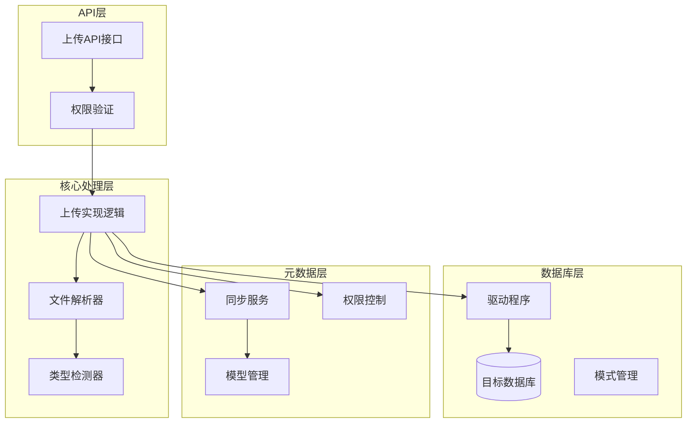
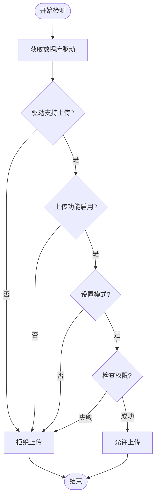
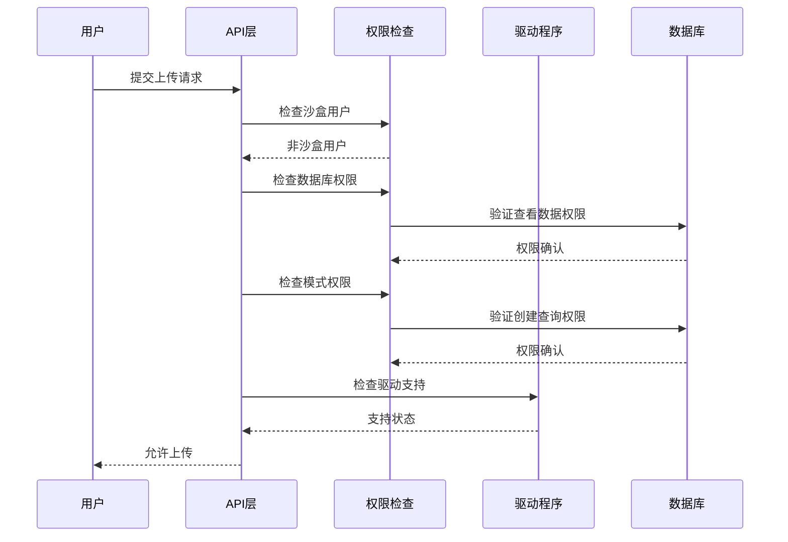
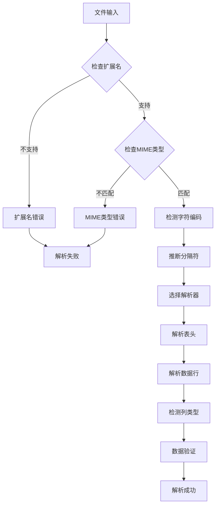
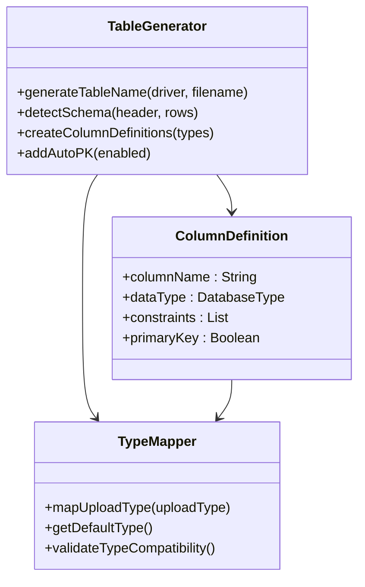
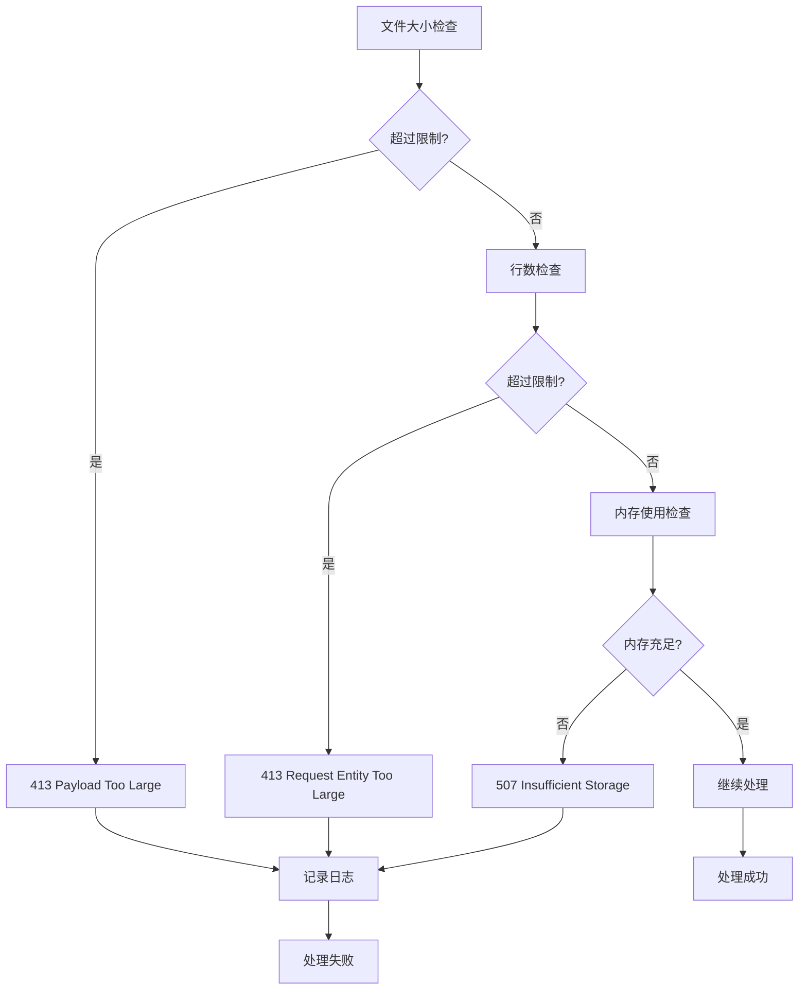
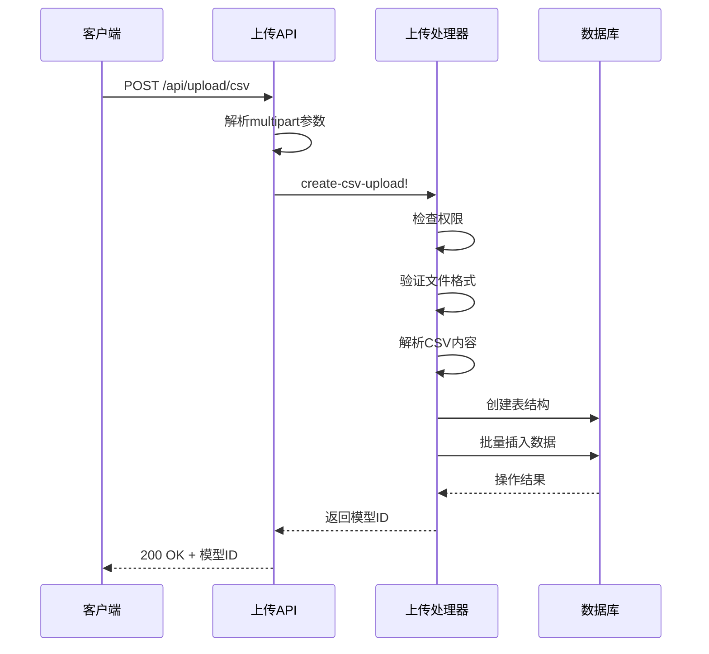

# 上传功能支持

<cite>
**本文档中引用的文件**
- [api.clj](file://src/metabase/upload/api.clj)
- [core.clj](file://src/metabase/upload/core.clj)
- [impl.clj](file://src/metabase/upload/impl.clj)
- [parsing.clj](file://src/metabase/upload/parsing.clj)
- [settings.clj](file://src/metabase/upload/settings.clj)
- [types.clj](file://src/metabase/upload/types.clj)
- [init.clj](file://src/metabase/upload/init.clj)
</cite>

## 目录
1. [简介](#简介)
2. [系统架构概览](#系统架构概览)
3. [数据库上传功能检测机制](#数据库上传功能检测机制)
4. [权限验证流程](#权限验证流程)
5. [文件解析与数据导入处理链路](#文件解析与数据导入处理链路)
6. [异常处理策略](#异常处理策略)
7. [驱动程序支持实现](#驱动程序支持实现)
8. [API接口设计](#api接口设计)
9. [扩展上传能力指南](#扩展上传能力指南)
10. [故障排除指南](#故障排除指南)

## 简介

Metabase的上传功能支持为用户提供了将CSV文件直接上传到数据库并自动创建可查询表的能力。该功能包含完整的数据库检测、权限验证、文件解析、数据导入和表结构生成等核心组件，确保用户能够安全、高效地进行数据上传操作。

## 系统架构概览

上传功能采用模块化架构设计，主要包含以下核心组件：



**图表来源**
- [api.clj](file://src/metabase/upload/api.clj#L1-L56)
- [impl.clj](file://src/metabase/upload/impl.clj#L1-L100)

**章节来源**
- [api.clj](file://src/metabase/upload/api.clj#L1-L56)
- [impl.clj](file://src/metabase/upload/impl.clj#L1-L100)

## 数据库上传功能检测机制

### 支持的数据库类型识别

系统通过驱动程序接口检测数据库是否支持上传功能：



**图表来源**
- [impl.clj](file://src/metabase/upload/impl.clj#L452-L509)

### 驱动程序支持检测

系统通过以下步骤检测数据库驱动的支持能力：

1. **上传功能支持检测**：检查驱动是否实现`:uploads`特性
2. **模式支持检测**：验证数据库是否支持模式(schema)概念
3. **自动主键支持**：检测是否支持自动生成主键列
4. **类型映射检测**：验证上传类型到数据库类型的映射关系

**章节来源**
- [impl.clj](file://src/metabase/upload/impl.clj#L452-L509)

## 权限验证流程

### 用户角色与权限检查顺序

权限验证遵循严格的检查顺序，确保安全性和一致性：



**图表来源**
- [impl.clj](file://src/metabase/upload/impl.clj#L452-L509)

### 权限验证逻辑判断

权限验证包含以下关键检查点：

| 检查项目 | 验证内容 | 错误码 | 描述 |
|---------|---------|--------|------|
| 沙盒用户检查 | `perms/sandboxed-user?` | 403 | 沙盒用户不允许上传 |
| 上传功能启用 | `uploads-enabled?` | 422 | 上传功能未启用 |
| 驱动支持检查 | `driver.u/supports?` | 422 | 数据库不支持上传 |
| 数据库权限 | `:perms/view-data` | 403 | 缺少查看数据权限 |
| 模式权限 | `:perms/create-queries` | 403 | 缺少创建查询权限 |
| 模式存在性 | `driver.s/include-schema?` | 422 | 模式不可同步 |

**章节来源**
- [impl.clj](file://src/metabase/upload/impl.clj#L452-L509)

## 文件解析与数据导入处理链路

### 文件格式检测与解析

系统支持多种文件格式的自动检测和解析：



**图表来源**
- [impl.clj](file://src/metabase/upload/impl.clj#L258-L356)
- [parsing.clj](file://src/metabase/upload/parsing.clj#L1-L254)

### 数据导入处理流程

数据导入过程包含以下关键步骤：

1. **文件预处理**：检测编码、字符集和文件格式
2. **分隔符推断**：自动识别CSV分隔符
3. **表头解析**：提取列名并进行标准化处理
4. **数据类型检测**：根据数据内容推断最佳数据类型
5. **数据验证**：执行格式和约束验证
6. **批量插入**：高效的数据写入操作

**章节来源**
- [impl.clj](file://src/metabase/upload/impl.clj#L381-L404)

### 表结构生成

系统自动生成符合数据库规范的表结构：



**图表来源**
- [impl.clj](file://src/metabase/upload/impl.clj#L164-L193)

**章节来源**
- [impl.clj](file://src/metabase/upload/impl.clj#L381-L404)

## 异常处理策略

### 格式错误处理

系统提供多层次的格式错误处理机制：

| 错误类型 | 处理策略 | 返回信息 | 示例场景 |
|---------|---------|---------|---------|
| 文件格式错误 | 抛出415错误 | 不支持的文件类型 | 非CSV/TXT文件 |
| 字符编码错误 | 使用默认编码 | 编码检测失败 | BOM标记问题 |
| 分隔符识别错误 | 抛出异常 | 无法确定分隔符 | 复杂格式文件 |
| 数据类型错误 | 跳过无效行 | 类型转换失败 | 数字格式错误 |
| 架构不匹配 | 抛出422错误 | 列不匹配 | 新增/删除列 |

### 容量超限处理

系统实施多级容量限制：



**图表来源**
- [impl.clj](file://src/metabase/upload/impl.clj#L222-L260)

**章节来源**
- [impl.clj](file://src/metabase/upload/impl.clj#L534-L554)

## 驱动程序支持实现

### 上传类型到数据库类型的映射

不同数据库驱动对上传类型的映射实现：

| 上传类型 | PostgreSQL | MySQL | H2数据库 |
|---------|-----------|-------|----------|
| `:varchar-255` | `[:varchar 255]` | `[:varchar 255]` | `[:varchar]` |
| `:text` | `[:text]` | `[:text]` | `[:varchar]` |
| `:int` | `[:bigint]` | `[:bigint]` | `[:int]` |
| `:float` | `[:float]` | `[:double]` | `[(keyword "DOUBLE PRECISION")]` |
| `:boolean` | `[:boolean]` | `[:boolean]` | `[:boolean]` |
| `:date` | `[:date]` | `[:date]` | `[:date]` |
| `:datetime` | `[:timestamp]` | `[:datetime]` | `[:timestamp]` |

### 驱动程序接口要求

实现上传功能的驱动程序需要满足以下接口要求：

1. **基础接口**：实现`driver/upload-type->database-type`方法
2. **高级特性**：支持自动主键、列添加、类型修改等
3. **性能优化**：提供批量插入和事务支持
4. **错误处理**：实现详细的错误信息返回

**章节来源**
- [impl.clj](file://src/metabase/upload/impl.clj#L164-L193)

## API接口设计

### 上传接口端点

系统提供RESTful API接口用于文件上传：



**图表来源**
- [api.clj](file://src/metabase/upload/api.clj#L25-L54)

### 请求参数规范

| 参数名称 | 类型 | 必需 | 描述 |
|---------|------|------|------|
| `collection_id` | Integer | 否 | 目标集合ID，null表示根目录 |
| `file` | File | 是 | 上传的CSV文件 |
| `filename` | String | 是 | 文件原始名称 |
| `db_id` | Integer | 是 | 目标数据库ID |
| `schema_name` | String | 否 | 目标模式名称 |
| `table_prefix` | String | 否 | 表名前缀 |

**章节来源**
- [api.clj](file://src/metabase/upload/api.clj#L25-L54)

## 扩展上传能力指南

### 添加新的数据库驱动支持

要为新数据库添加上传功能支持，需要实现以下步骤：

1. **定义类型映射**：在驱动程序中实现`upload-type->database-type`方法
2. **配置特性支持**：声明支持的上传特性（如自动主键、列修改等）
3. **测试验证**：编写单元测试验证功能正确性

### 自定义数据类型检测

扩展数据类型检测功能的方法：

```clojure
(defmethod upload-types/custom-type-detector :my-driver
  [settings header rows]
  ;; 实现自定义类型检测逻辑
  (mapv detect-custom-type rows))
```

### 性能优化建议

1. **批量操作**：使用数据库的批量插入功能
2. **内存管理**：控制单次处理的数据量
3. **并发处理**：利用异步任务处理大型文件
4. **缓存策略**：缓存频繁访问的元数据

**章节来源**
- [impl.clj](file://src/metabase/upload/impl.clj#L860-L894)

## 故障排除指南

### 常见问题诊断

| 问题症状 | 可能原因 | 解决方案 |
|---------|---------|---------|
| 上传被拒绝 | 权限不足 | 检查用户数据库权限设置 |
| 文件格式错误 | 不支持的扩展名 | 确认文件扩展名为CSV/TSV |
| 数据类型错误 | 格式不兼容 | 检查数据格式是否符合预期 |
| 内存不足 | 文件过大 | 减小文件大小或增加内存限制 |
| 连接超时 | 网络问题 | 检查数据库连接配置 |

### 调试工具和日志

系统提供详细的日志记录用于问题诊断：

1. **上传事件日志**：记录每次上传的详细信息
2. **权限检查日志**：跟踪权限验证过程
3. **错误堆栈日志**：提供完整的错误信息
4. **性能监控日志**：记录处理时间和资源使用

### 最佳实践建议

1. **文件准备**：确保CSV文件格式规范，避免特殊字符
2. **权限配置**：合理设置用户权限，避免过度授权
3. **监控告警**：建立上传功能的监控和告警机制
4. **定期维护**：清理临时文件和过期数据

**章节来源**
- [impl.clj](file://src/metabase/upload/impl.clj#L860-L894)