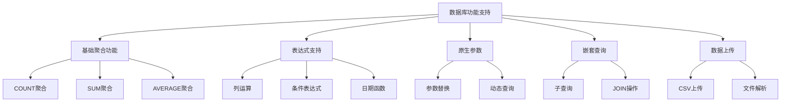
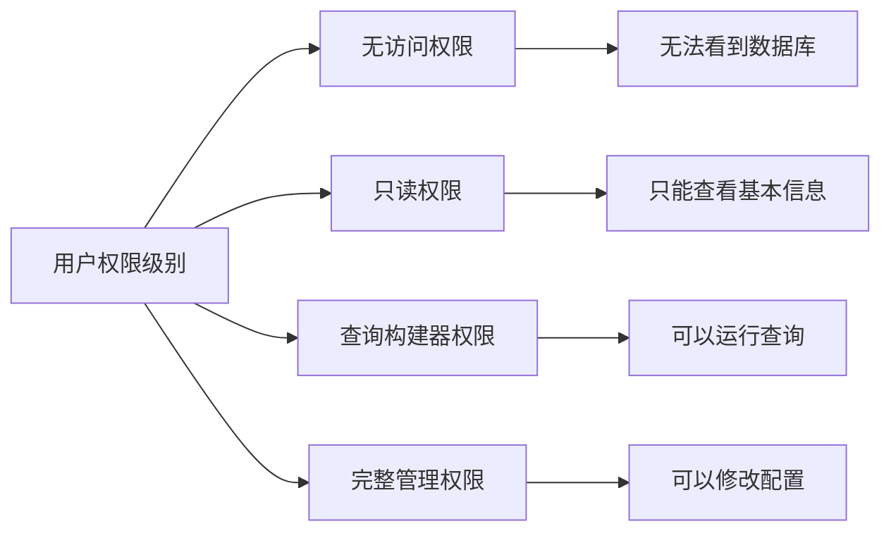
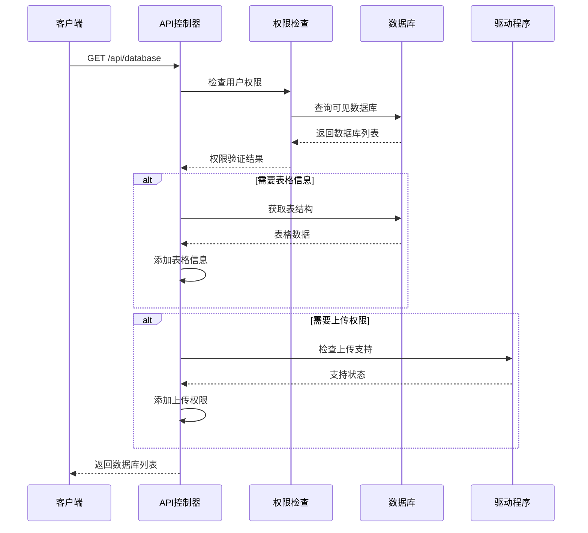
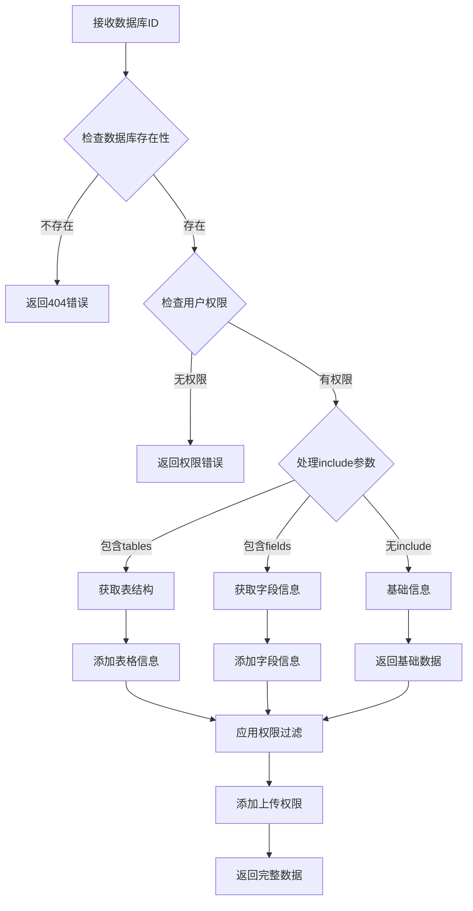

# 数据库配置查询API详细文档

<cite>
**本文档中引用的文件**
- [warehouses/api.clj](file://src/metabase/warehouses/api.clj)
- [warehouses/models/database.clj](file://src/metabase/warehouses/models/database.clj)
- [permissions/models/data_permissions.clj](file://src/metabase/permissions/models/data_permissions.clj)
- [driver/util.clj](file://src/metabase/driver/util.clj)
- [driver/sql_jdbc/sync/describe_database.clj](file://src/metabase/driver/sql_jdbc/sync/describe_database.clj)
</cite>

## 目录
1. [简介](#简介)
2. [API端点概览](#api端点概览)
3. [核心查询参数详解](#核心查询参数详解)
4. [数据库配置字段说明](#数据库配置字段说明)
5. [用户权限与访问控制](#用户权限与访问控制)
6. [详细API响应结构](#详细api响应结构)
7. [实际使用示例](#实际使用示例)
8. [后端处理流程](#后端处理流程)
9. [错误处理与最佳实践](#错误处理与最佳实践)

## 简介

Metabase数据库配置查询API提供了全面的数据库列表及其详细配置信息的获取功能。该API支持多种查询参数来定制返回的数据范围和详细程度，同时实现了基于用户角色的精细权限控制机制。

## API端点概览

### 获取所有数据库列表

```
GET /api/database
```

**功能描述：** 获取系统中所有可用数据库的列表，支持多种过滤和定制参数。

### 获取单个数据库详情

```
GET /api/database/:id
```

**功能描述：** 获取指定数据库的详细配置信息，支持包含表结构、字段信息等功能。

### 获取数据库元数据

```
GET /api/database/:id/metadata
```

**功能描述：** 获取数据库的完整元数据信息，包括所有表和字段的详细结构。

## 核心查询参数详解

### include-tables 参数

**作用机制：** 控制是否在响应中包含数据库的表结构信息。

**实现逻辑：**
- 当设置为 `include=tables` 时，API会执行额外的数据库查询来获取相关表信息
- 使用 `add-tables` 函数对数据库列表进行处理
- 只包含活跃状态且用户有读取权限的表

**代码路径：** [`warehouses/api.clj`](file://src/metabase/warehouses/api.clj#L31-L40)

### include-editable-modeling-info 参数

**作用机制：** 限制返回具有可编辑数据模型权限的数据库。

**实现逻辑：**
- 需要Enterprise Edition支持和advanced-permissions功能启用
- 使用 `filter-databases-by-data-model-perms` 函数进行权限过滤
- 对于没有数据访问权限的用户，只返回数据库名称、ID和表信息

**代码路径：** [`warehouses/api.clj`](file://src/metabase/warehouses/api.clj#L240-L250)

### exclude-undetailed 参数

**作用机制：** 过滤掉无法编辑数据库详情的数据库。

**实现逻辑：**
- 结合 `mi/can-write?` 权限检查
- 只返回用户具有写入权限的数据库
- 用于限制敏感配置信息的暴露

**代码路径：** [`warehouses/api.clj`](file://src/metabase/warehouses/api.clj#L255-L260)

### only-includes-upload-db 参数

**作用机制：** 仅返回支持数据上传功能的数据库。

**实现逻辑：**
- 使用 `uploadable-db?` 函数检查数据库驱动是否支持上传功能
- 通过 `driver.u/supports?` 检查特定功能支持情况
- 限制用户只能看到可操作的数据库

**代码路径：** [`warehouses/api.clj`](file://src/metabase/warehouses/api.clj#L235-L240)

## 数据库配置字段说明

### 基础配置字段

| 字段名 | 类型 | 描述 | 示例值 |
|--------|------|------|--------|
| `id` | Integer | 数据库唯一标识符 | `1` |
| `name` | String | 数据库显示名称 | `"Sample Database"` |
| `engine` | String | 数据库引擎类型 | `"postgres"` |
| `description` | String | 数据库描述信息 | `"Sample data for testing"` |
| `is_sample` | Boolean | 是否为示例数据库 | `true` |
| `is_audit` | Boolean | 是否为审计数据库 | `false` |

### 连接信息字段

| 字段名 | 类型 | 描述 | 示例值 |
|--------|------|------|--------|
| `details` | Object | 数据库连接详细配置 | `{host: "localhost", port: 5432}` |
| `settings` | Object | 数据库特殊设置 | `{timeout: 30}` |
| `features` | Array | 支持的功能特性集合 | `["basic-aggregations", "expressions"]` |
| `provider_name` | String | 云服务提供商名称 | `"AWS RDS"` |

### 功能支持标志



**图表来源：**
- [driver/util.clj](file://src/metabase/driver/util.clj#L241-L274)

### 元数据同步配置

| 字段名 | 类型 | 描述 | 默认值 |
|--------|------|------|--------|
| `metadata_sync_schedule` | String | 元数据同步调度时间 | `"0 1 * * *"` |
| `cache_field_values_schedule` | String | 字段值缓存调度时间 | `"0 2 * * *"` |
| `is_full_sync` | Boolean | 是否进行完全同步 | `true` |
| `is_on_demand` | Boolean | 是否按需同步 | `false` |

## 用户权限与访问控制

### 超级用户权限

**权限特征：**
- 完全访问所有数据库配置信息
- 可以查看和编辑所有数据库的详细配置
- 无视数据模型权限限制
- 可以访问审计数据库和示例数据库

**实现机制：**
- 通过 `api/*is-superuser?*` 动态变量判断
- 在多个API端点中进行超级用户检查
- 提供最高级别的访问权限

**代码路径：** [`permissions/models/data_permissions.clj`](file://src/metabase/permissions/models/data_permissions.clj#L240-L250)

### 普通用户权限

**权限特征：**
- 基于数据权限组的访问控制
- 只能访问分配给用户的数据库
- 根据权限级别限制可见信息
- 敏感字段会被自动过滤

**权限分级：**



**图表来源：**
- [permissions/models/data_permissions.clj](file://src/metabase/permissions/models/data_permissions.clj#L35-L50)

### 数据模型权限控制

**高级权限特征：**
- 仅Enterprise Edition可用
- 基于数据模型编辑权限的过滤
- 支持细粒度的表级权限控制
- 可以限制敏感数据的访问

**实现逻辑：**
- 使用 `filter-databases-by-data-model-perms` 函数
- 结合用户所属组的权限设置
- 动态计算最严格的权限级别

**代码路径：** [`warehouses/api.clj`](file://src/metabase/warehouses/api.clj#L240-L250)

## 详细API响应结构

### 基础数据库列表响应

```json
{
  "data": [
    {
      "id": 1,
      "name": "Sample Database",
      "engine": "postgres",
      "description": "Sample data for testing",
      "is_sample": true,
      "is_audit": false,
      "features": ["basic-aggregations", "expressions"],
      "native_permissions": "none"
    }
  ],
  "total": 1
}
```

### 包含表格信息的响应

```json
{
  "data": [
    {
      "id": 1,
      "name": "Sample Database",
      "engine": "postgres",
      "tables": [
        {
          "id": 101,
          "name": "products",
          "display_name": "Products",
          "schema": "public",
          "description": "Product inventory data",
          "active": true,
          "fields": [
            {
              "id": 201,
              "name": "id",
              "display_name": "ID",
              "base_type": "IntegerField",
              "semantic_type": "type/PK"
            }
          ]
        }
      ]
    }
  ],
  "total": 1
}
```

### 完整元数据响应

```json
{
  "id": 1,
  "name": "Production Database",
  "engine": "mysql",
  "tables": [
    {
      "id": 101,
      "name": "orders",
      "display_name": "Orders",
      "schema": "sales",
      "description": "Order management system",
      "active": true,
      "fields": [
        {
          "id": 201,
          "name": "order_id",
          "display_name": "Order ID",
          "base_type": "BigIntegerField",
          "semantic_type": "type/PK",
          "description": "Unique order identifier",
          "position": 1
        }
      ],
      "segments": [],
      "metrics": []
    }
  ],
  "schedules": {
    "metadata_sync": {
      "minute": "0",
      "hour": "1",
      "day-of-week": "*",
      "day-of-month": "*",
      "month": "*"
    },
    "cache_field_values": null
  },
  "can_upload": true,
  "can_manage": false
}
```

## 实际使用示例

### 基础数据库列表查询

**请求：**
```
GET /api/database
Authorization: Bearer <token>
```

**响应：**
包含所有用户有访问权限的基础数据库信息。

### 查询包含表格信息的数据库

**请求：**
```
GET /api/database?include=tables
Authorization: Bearer <token>
```

**响应：**
包含每个数据库的完整表结构信息。

### 高级权限查询

**请求：**
```
GET /api/database?include_editable_data_model=true
Authorization: Bearer <token>
```

**响应：**
仅包含当前用户具有数据模型编辑权限的数据库。

### 特定数据库详情查询

**请求：**
```
GET /api/database/1?include=tables.fields
Authorization: Bearer <token>
```

**响应：**
包含数据库详细配置、表结构和字段信息的完整数据。

## 后端处理流程

### 数据库列表获取流程



**图表来源：**
- [warehouses/api.clj](file://src/metabase/warehouses/api.clj#L279-L334)

### 单个数据库详情处理



**图表来源：**
- [warehouses/api.clj](file://src/metabase/warehouses/api.clj#L426-L447)

### 权限检查机制

**超级用户检查：**
- 直接验证 `api/*is-superuser?*` 标志
- 无需额外的数据库查询
- 提供完全的访问权限

**普通用户权限：**
- 基于 `perms/most-permissive-database-permission-for-user` 计算
- 考虑用户所属的所有权限组
- 应用权限合并规则

**数据模型权限：**
- 企业版专用功能
- 基于 `advanced-permissions` 特性
- 动态计算用户的数据模型编辑权限

**代码路径：** [`permissions/models/data_permissions.clj`](file://src/metabase/permissions/models/data_permissions.clj#L240-L250)

## 错误处理与最佳实践

### 常见错误类型

| 错误类型 | HTTP状态码 | 描述 | 解决方案 |
|----------|------------|------|----------|
| 数据库不存在 | 404 | 请求的数据库ID不存在 | 检查数据库ID的有效性 |
| 权限不足 | 403 | 用户没有访问权限 | 检查用户权限设置 |
| 参数无效 | 400 | 查询参数格式错误 | 验证参数格式和类型 |
| 超时错误 | 504 | 数据库连接超时 | 检查网络连接和数据库状态 |

### 性能优化建议

**批量查询优化：**
- 使用 `include=tables` 一次性获取所需信息
- 避免多次单独查询相同数据库
- 利用API的权限缓存机制

**权限检查优化：**
- 理解不同权限级别的影响
- 根据实际需求选择合适的参数组合
- 避免不必要的权限检查

**缓存策略：**
- API响应包含适当的缓存头
- 利用浏览器缓存减少重复请求
- 合理设置缓存过期时间

### 安全最佳实践

**敏感信息保护：**
- 自动过滤敏感字段（密码、密钥等）
- 基于权限级别调整可见信息
- 记录敏感操作的审计日志

**权限最小化原则：**
- 只授予必要的最低权限
- 定期审查用户权限设置
- 使用权限组简化管理

**监控和告警：**
- 监控API调用频率和成功率
- 设置异常访问的告警机制
- 定期审计数据库访问记录

**Section sources**
- [warehouses/api.clj](file://src/metabase/warehouses/api.clj#L279-L334)
- [warehouses/models/database.clj](file://src/metabase/warehouses/models/database.clj#L293-L322)
- [permissions/models/data_permissions.clj](file://src/metabase/permissions/models/data_permissions.clj#L240-L250)
- [driver/util.clj](file://src/metabase/driver/util.clj#L241-L274)