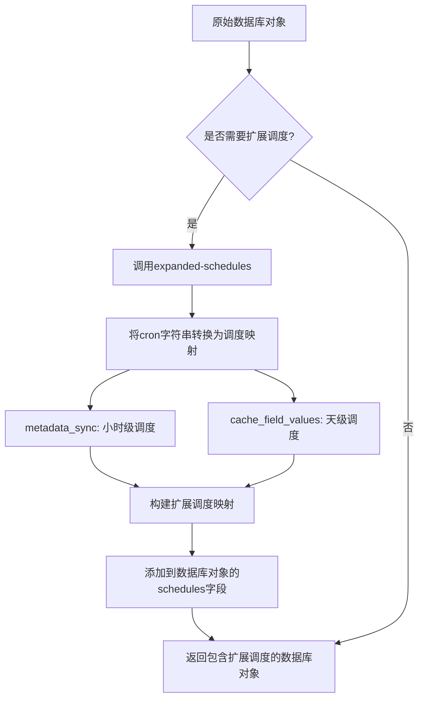
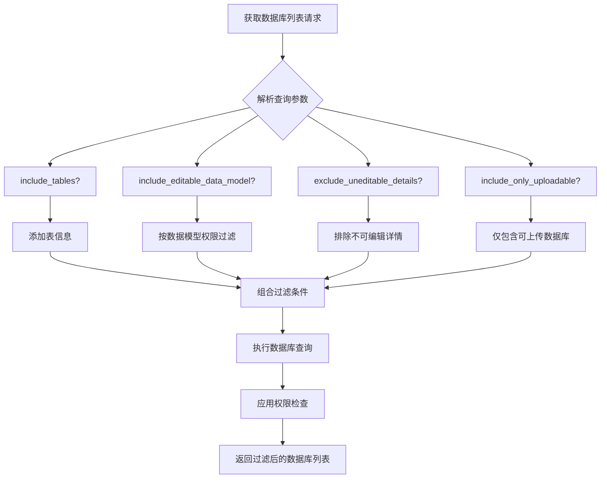

# 数据库配置管理

<cite>
**本文档引用的文件**  
- [api.clj](file://src/metabase/warehouses/api.clj)
- [database.clj](file://src/metabase/warehouses/models/database.clj)
- [impl.clj](file://src/metabase/upload/impl.clj)
- [settings.clj](file://src/metabase/upload/settings.clj)
- [schedules.clj](file://src/metabase/sync/schedules.clj)
</cite>

## 目录
1. [简介](#简介)
2. [数据库配置信息获取与展示](#数据库配置信息获取与展示)
3. [扩展调度配置格式化处理](#扩展调度配置格式化处理)
4. [数据库列表查询过滤选项](#数据库列表查询过滤选项)
5. [上传功能检测机制与权限检查](#上传功能检测机制与权限检查)
6. [API使用示例](#api使用示例)
7. [结论](#结论)

## 简介
本文档详细说明Metabase系统中数据库配置管理API的完整功能。重点介绍数据库配置信息的获取与展示机制，包括扩展调度配置（metadata_sync、cache_field_values）的格式化处理。文档详细解释数据库列表查询中的多种过滤选项，如包含表信息、包含可编辑数据模型、排除不可编辑详情和仅包含可上传数据库等参数的实现逻辑。同时，文档化上传功能支持的检测机制和权限检查，并提供配置管理API的使用示例，展示不同查询参数组合下的响应差异，以及超级用户与普通用户在数据访问权限上的区别。

## 数据库配置信息获取与展示
数据库配置管理API提供了多种端点来获取和展示数据库配置信息。核心功能通过`GET /api/database`和`GET /api/database/:id`端点实现，允许用户获取数据库列表或特定数据库的详细信息。

当获取单个数据库信息时，系统会根据用户的权限动态调整返回的内容。如果用户具有写权限（管理员或具有数据模型权限），则会包含数据库的详细信息（details字段）；否则，该字段将被排除以保护敏感信息。这种权限控制机制在`metabase.warehouses.models.database`命名空间中的`to-json`方法中实现。

数据库信息的获取还支持多种包含选项，如`include=tables`可以获取数据库中的表信息，`include=tables.fields`可以进一步获取字段信息。这些选项通过`get-database-hydrate-include`函数处理，根据查询参数动态地对数据库对象进行水合（hydrate）操作。

**Section sources**
- [api.clj](file://src/metabase/warehouses/api.clj#L334-L363)
- [api.clj](file://src/metabase/warehouses/api.clj#L407-L426)
- [database.clj](file://src/metabase/warehouses/models/database.clj#L542-L574)

## 扩展调度配置格式化处理
数据库的调度配置（如元数据同步和字段值缓存）以cron字符串格式存储在数据库中，但API需要将其转换为前端友好的格式。这一转换过程通过`expanded-schedules`和`add-expanded-schedules`函数实现。



**Diagram sources**
- [api.clj](file://src/metabase/warehouses/api.clj#L343-L351)
- [schedules.clj](file://src/metabase/sync/schedules.clj#L25-L33)

`expanded-schedules`函数接收数据库对象作为输入，提取`metadata_sync_schedule`和`cache_field_values_schedule`字段的cron字符串，并使用`u.cron/cron-string->schedule-map`函数将其转换为包含调度信息的映射。转换后的映射包含`schedule_type`（如"hourly"或"daily"）和具体的时间信息（如`schedule_hour`或`schedule_minute`）。

默认的调度配置由`default-randomized-schedule`函数定义，它为`cache_field_values`设置为每天随机时间执行，为`metadata_sync`设置为每小时随机分钟执行。这种随机化设计避免了多个数据库在同一时间执行同步任务造成的系统负载高峰。

**Section sources**
- [api.clj](file://src/metabase/warehouses/api.clj#L343-L351)
- [schedules.clj](file://src/metabase/sync/schedules.clj#L55-L73)

## 数据库列表查询过滤选项
数据库列表查询支持多种过滤选项，允许用户根据不同的条件筛选返回的数据库。这些过滤选项通过`dbs-list`函数实现，该函数根据查询参数组合不同的过滤逻辑。



**Diagram sources**
- [api.clj](file://src/metabase/warehouses/api.clj#L258-L288)
- [api.clj](file://src/metabase/warehouses/api.clj#L304-L307)

主要的过滤选项包括：
- `include_tables`：是否包含数据库中的表信息
- `include_editable_data_model`：仅包含用户具有数据模型编辑权限的数据库
- `exclude_uneditable_details`：仅包含用户可以编辑数据库详情的数据库
- `include_only_uploadable`：仅包含支持上传功能的数据库

这些过滤选项可以组合使用，系统会根据用户的权限和查询参数动态地构建查询条件。例如，当`include_editable_data_model`为真时，系统会调用`filter-databases-by-data-model-perms`函数来过滤数据库；当`exclude_uneditable_details`为真时，系统会检查用户是否具有写权限来决定是否包含数据库。

**Section sources**
- [api.clj](file://src/metabase/warehouses/api.clj#L258-L288)
- [api.clj](file://src/metabase/warehouses/api.clj#L304-L335)

## 上传功能检测机制与权限检查
上传功能的检测机制和权限检查是数据库配置管理的重要组成部分。系统通过`can-create-upload-error`和`can-create-upload?`函数实现上传权限的检查。

```mermaid
flowchart TD
A[上传权限检查请求] --> B{上传功能是否启用?}
B --> |否| C[返回"上传未启用"错误]
B --> |是| D{用户是否为沙盒用户?}
D --> |是| E[返回"沙盒用户不允许上传"错误]
D --> |否| F{数据库是否支持上传?}
F --> |否| G[返回"数据库不支持上传"错误]
F --> |是| H{数据库是否启用上传?}
H --> |否| I[返回"上传未启用"错误]
H --> |是| J{是否设置了模式?}
J --> |否| K[返回"未设置模式"错误]
J --> |是| L{用户是否有数据访问权限?}
L --> |否| M[返回"无权限"错误]
L --> |是| N{用户是否有查询构建权限?}
N --> |否| M
N --> |是| O{模式是否可同步?}
O --> |否| P[返回"模式不可同步"错误]
O --> |是| Q[返回无错误，允许上传]
```

**Diagram sources**
- [impl.clj](file://src/metabase/upload/impl.clj#L452-L509)
- [settings.clj](file://src/metabase/upload/settings.clj#L0-L34)

权限检查流程包括多个层次：
1. 系统级检查：确认上传功能是否已启用
2. 用户级检查：确认用户是否为沙盒用户
3. 数据库级检查：确认数据库是否支持上传功能
4. 详情级检查：确认数据库的上传设置（如模式名称）
5. 权限级检查：确认用户对数据库和模式的访问权限

这些检查确保只有具有适当权限的用户才能在支持上传的数据库上执行上传操作。检查结果通过`can-create-upload?`函数返回布尔值，或通过`can-create-upload-error`函数返回具体的错误信息。

**Section sources**
- [impl.clj](file://src/metabase/upload/impl.clj#L452-L509)
- [settings.clj](file://src/metabase/upload/settings.clj#L0-L34)

## API使用示例
本节提供数据库配置管理API的使用示例，展示不同查询参数组合下的响应差异，以及超级用户与普通用户在数据访问权限上的区别。

### 获取数据库列表示例
```http
GET /api/database?include=tables&include_editable_data_model=true&include_only_uploadable=true
```
此请求将返回包含表信息、用户具有数据模型编辑权限且支持上传的数据库列表。响应将包含每个数据库的基本信息、表列表以及上传权限标志。

### 获取特定数据库信息示例
```http
GET /api/database/1?include=tables.fields&include_editable_data_model=true
```
此请求将返回ID为1的数据库的详细信息，包括表和字段信息。如果用户具有数据模型编辑权限，响应将包含可编辑的数据模型信息。

### 权限差异示例
超级用户和普通用户在访问数据库配置信息时会有不同的响应：
- 超级用户：可以看到所有数据库的完整信息，包括敏感的连接详情
- 普通用户：只能看到其具有访问权限的数据库，且敏感信息被隐藏
- 具有数据模型权限的用户：可以看到数据库的基本信息和可编辑的数据模型

这些差异通过`mi/can-read?`和`mi/can-write?`权限检查函数实现，确保数据的安全性和访问控制的精确性。

**Section sources**
- [api.clj](file://src/metabase/warehouses/api.clj#L334-L363)
- [api.clj](file://src/metabase/warehouses/api.clj#L407-L426)
- [database.clj](file://src/metabase/warehouses/models/database.clj#L542-L574)

## 结论
本文档全面介绍了Metabase系统中数据库配置管理API的设计与实现。通过分析核心文件和功能模块，我们详细说明了数据库配置信息的获取与展示机制，包括扩展调度配置的格式化处理。文档解释了数据库列表查询中的多种过滤选项的实现逻辑，以及上传功能的检测机制和权限检查。

API的设计体现了分层权限控制的思想，通过`can-read?`和`can-write?`等权限检查函数确保数据的安全性。同时，系统提供了灵活的查询参数，允许用户根据不同的需求获取相应的数据库信息。

这些功能共同构成了一个强大而安全的数据库配置管理系统，为用户提供了一致且安全的数据库管理体验。未来可以进一步优化调度配置的管理界面，提供更直观的调度设置选项，以及增强上传功能的错误处理和用户体验。