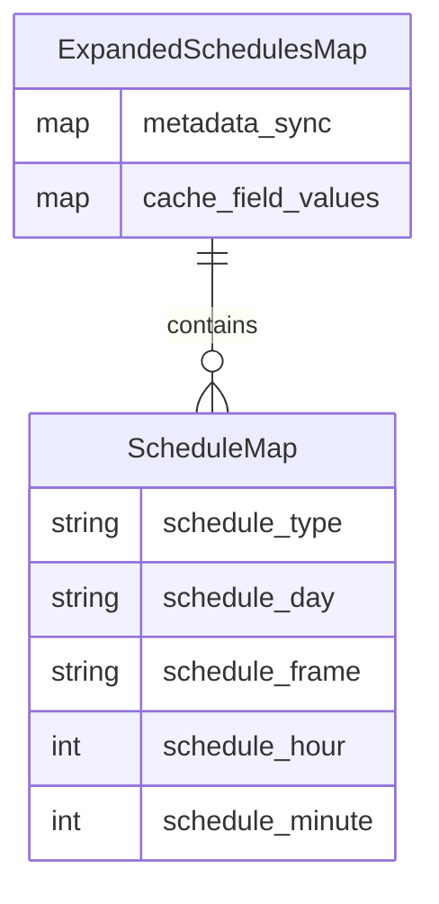
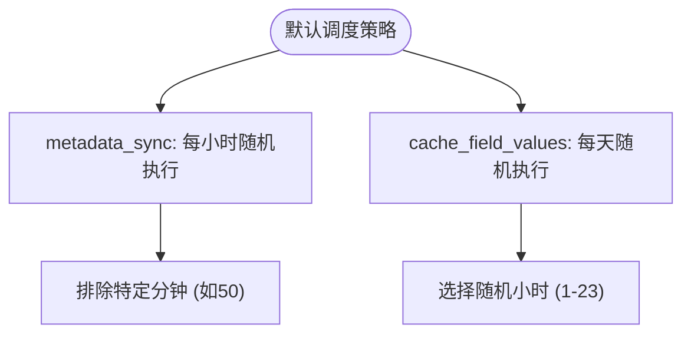
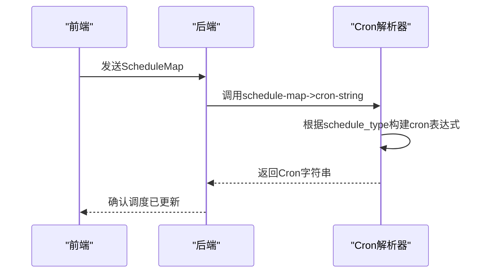
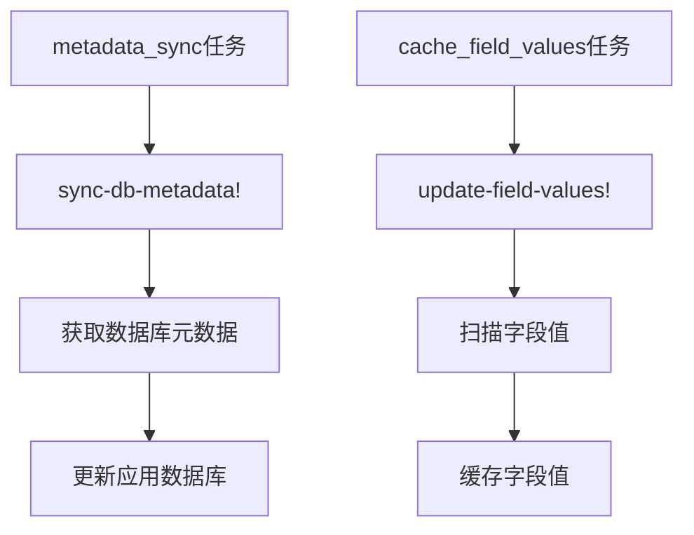
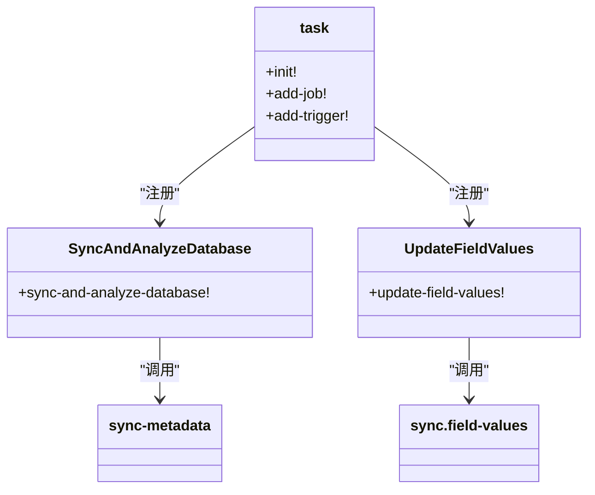
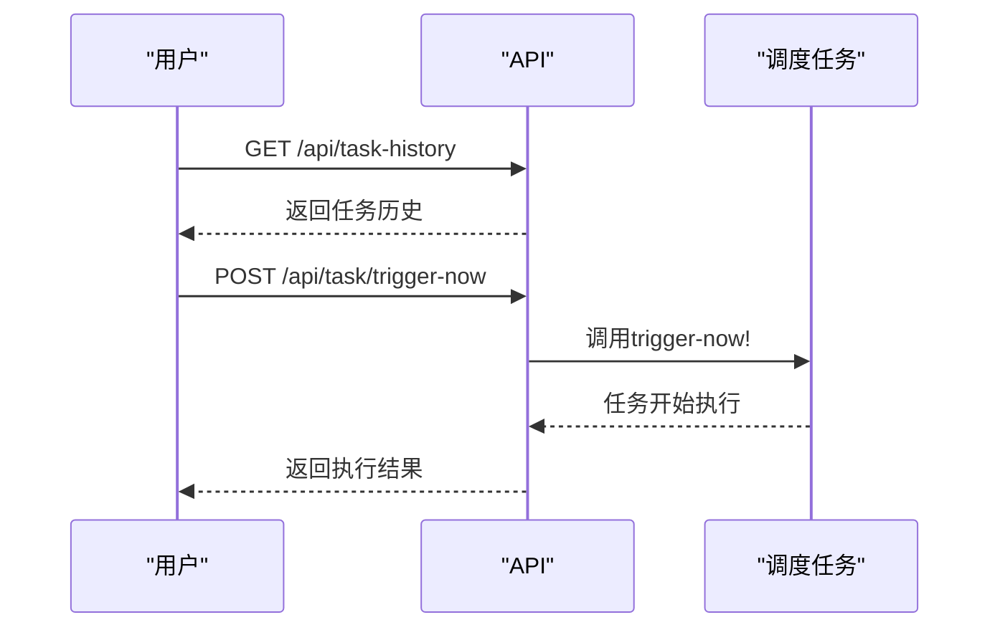

# 调度配置管理

<cite>
**本文档中引用的文件**  
- [schedules.clj](file://src/metabase/sync/schedules.clj)
- [sync_databases.clj](file://src/metabase/sync/task/sync_databases.clj)
- [cron.clj](file://src/metabase/util/cron.clj)
- [database.clj](file://src/metabase/warehouses/models/database.clj)
- [task_history.clj](file://src/metabase/task_history/models/task_history.clj)
</cite>

## 目录
1. [引言](#引言)
2. [调度任务配置结构](#调度任务配置结构)
3. [默认调度策略](#默认调度策略)
4. [调度表达式解析机制](#调度表达式解析机制)
5. [数据库元数据同步与字段值缓存](#数据库元数据同步与字段值缓存)
6. [后台调度系统集成](#后台调度系统集成)
7. [API动态调整与操作示例](#apidynamic调整与操作示例)
8. [状态查询与手动触发](#状态查询与手动触发)

## 引言
本文档深入探讨Metabase中的调度配置管理功能，重点分析metadata_sync和cache_field_values两项核心调度任务。文档详细阐述了调度配置的结构、默认策略、可定制化选项以及调度表达式的解析机制。同时，文档解释了这些调度任务在数据库元数据同步和字段值缓存更新中的关键作用，并说明了如何通过API进行动态调整。最后，文档结合sync_databases任务的实现，阐述了后台调度系统的集成方式，并提供了配置修改、状态查询和触发手动同步的操作示例。

## 调度任务配置结构
Metabase中的调度任务配置主要通过`ExpandedSchedulesMap`和`CronSchedulesMap`两种数据结构来定义。`ExpandedSchedulesMap`是前端传递的调度配置映射，包含`metadata_sync`和`cache_field_values`两个可选字段，每个字段的值都是一个`ScheduleMap`。`ScheduleMap`定义了调度的类型（hourly, daily, weekly, monthly）、具体时间（小时、分钟）、星期几以及周期框架（first, mid, last）。

**Diagram sources**
- [schedules.clj](file://src/metabase/sync/schedules.clj#L20-L28)

**Section sources**
- [schedules.clj](file://src/metabase/sync/schedules.clj#L20-L74)

## 默认调度策略
Metabase为metadata_sync和cache_field_values任务提供了默认的随机化调度策略。对于`metadata_sync`任务，默认策略为每小时随机执行一次，但会排除特定分钟（如50分钟），以避免与其他任务（如通知）发生冲突。对于`cache_field_values`任务，默认策略为每天随机执行一次，选择一个随机的小时进行执行。

**Diagram sources**
- [schedules.clj](file://src/metabase/sync/schedules.clj#L38-L55)

**Section sources**
- [schedules.clj](file://src/metabase/sync/schedules.clj#L38-L74)

## 调度表达式解析机制
调度表达式的解析由`metabase.util.cron`命名空间中的`schedule-map->cron-string`函数完成。该函数将前端传递的`ScheduleMap`转换为Quartz调度器可识别的cron字符串。解析过程根据`schedule_type`的不同，构建相应的cron表达式。例如，对于hourly类型，只设置分钟；对于daily类型，设置小时和分钟；对于weekly和monthly类型，则需要设置星期几和日期。

**Diagram sources**
- [cron.clj](file://src/metabase/util/cron.clj#L65-L102)

**Section sources**
- [cron.clj](file://src/metabase/util/cron.clj#L39-L160)

## 数据库元数据同步与字段值缓存
`metadata_sync`任务负责同步数据库的元数据，包括表、字段的结构信息以及字段的语义类型等。该任务通过`sync-metadata/sync-db-metadata!`函数实现，定期从数据库中获取最新的元数据并更新到Metabase的应用数据库中。`cache_field_values`任务负责缓存字段的值，主要用于支持过滤器的自动补全功能。该任务通过`sync.field-values/update-field-values!`函数实现，定期扫描数据库中的字段值并将其缓存起来。

**Diagram sources**
- [sync_databases.clj](file://src/metabase/sync/task/sync_databases.clj#L106-L132)

**Section sources**
- [sync_databases.clj](file://src/metabase/sync/task/sync_databases.clj#L106-L164)

## 后台调度系统集成
Metabase使用Quartz调度器来管理后台任务。`sync_databases`任务在系统初始化时通过`task/init!`方法注册。系统为`metadata_sync`和`cache_field_values`任务分别创建了持久化的Quartz Job（`SyncAndAnalyzeDatabase`和`UpdateFieldValues`）。当数据库的调度配置发生变化时，系统会调用`check-and-schedule-tasks-for-db!`函数，根据新的调度配置创建或更新相应的Quartz Trigger。

**Diagram sources**
- [sync_databases.clj](file://src/metabase/sync/task/sync_databases.clj#L106-L132)
- [sync_databases.clj](file://src/metabase/sync/task/sync_databases.clj#L214-L242)

**Section sources**
- [sync_databases.clj](file://src/metabase/sync/task/sync_databases.clj#L0-L367)

## API动态调整与操作示例
通过API可以动态调整调度任务的配置。当用户在前端修改数据库的同步设置时，系统会将新的`ExpandedSchedulesMap`通过API传递给后端。后端调用`schedule-map->cron-strings`函数将其转换为`CronSchedulesMap`，然后更新数据库中的相应字段。系统会自动检测到配置变化，并重新调度相应的任务。

**Diagram sources**
- [schedules.clj](file://src/metabase/sync/schedules.clj#L27-L56)
- [sync_databases.clj](file://src/metabase/sync/task/sync_databases.clj#L288-L312)

**Section sources**
- [schedules.clj](file://src/metabase/sync/schedules.clj#L27-L74)
- [sync_databases.clj](file://src/metabase/sync/task/sync_databases.clj#L288-L312)

## 状态查询与手动触发
系统提供了查询调度任务状态和手动触发任务的API。通过`/api/task-history`端点可以获取最近任务的执行历史，包括任务的开始时间、结束时间和执行状态。通过`task/trigger-now!`函数可以手动触发某个调度任务立即执行，这对于调试和紧急同步非常有用。

**Diagram sources**
- [task_history.clj](file://src/metabase/task_history/models/task_history.clj#L51-L95)
- [sync_databases.clj](file://src/metabase/sync/task/sync_databases.clj#L214-L242)

**Section sources**
- [task_history.clj](file://src/metabase/task_history/models/task_history.clj#L51-L95)
- [sync_databases.clj](file://src/metabase/sync/task/sync_databases.clj#L214-L242)