# Metabase智能分析API完整文档

<cite>
**本文档中引用的文件**
- [automagic_dashboards.clj](file://src/metabase/xrays/api/automagic_dashboards.clj)
- [core.clj](file://src/metabase/xrays/automagic_dashboards/core.clj)
- [schema.clj](file://src/metabase/xrays/automagic_dashboards/schema.clj)
- [dashboard_templates.clj](file://src/metabase/xrays/automagic_dashboards/dashboard_templates.clj)
- [interesting.clj](file://src/metabase/xrays/automagic_dashboards/interesting.clj)
- [populate.clj](file://src/metabase/xrays/automagic_dashboards/populate.clj)
- [comparison.clj](file://src/metabase/xrays/automagic_dashboards/comparison.clj)
- [routes.clj](file://src/metabase/api_routes/routes.clj)
- [open_api.clj](file://src/metabase/api/open_api.clj)
</cite>

## 目录
1. [简介](#简介)
2. [项目架构概览](#项目架构概览)
3. [核心组件分析](#核心组件分析)
4. [API端点详解](#api端点详解)
5. [智能分析算法](#智能分析算法)
6. [可视化模板系统](#可视化模板系统)
7. [显示选项与前缀配置](#显示选项与前缀配置)
8. [实体ID解析机制](#实体id解析机制)
9. [请求响应示例](#请求响应示例)
10. [性能优化考虑](#性能优化考虑)
11. [故障排除指南](#故障排除指南)
12. [总结](#总结)

## 简介

Metabase智能分析API是一个强大的自动化仪表板生成系统，能够根据数据表、字段、指标等实体自动生成具有洞察力的可视化仪表板。该系统通过预定义的启发式规则和机器学习算法，为用户提供智能化的数据分析体验。

智能分析API的核心功能包括：
- 自动仪表板生成
- 实体分析（表格、字段、指标）
- 单元格分析（钻取分析）
- 比较分析（对比不同实体）
- 可视化模板应用
- 前缀配置管理
- 查询参数解析

## 项目架构概览

智能分析API采用模块化架构设计，主要包含以下核心模块：

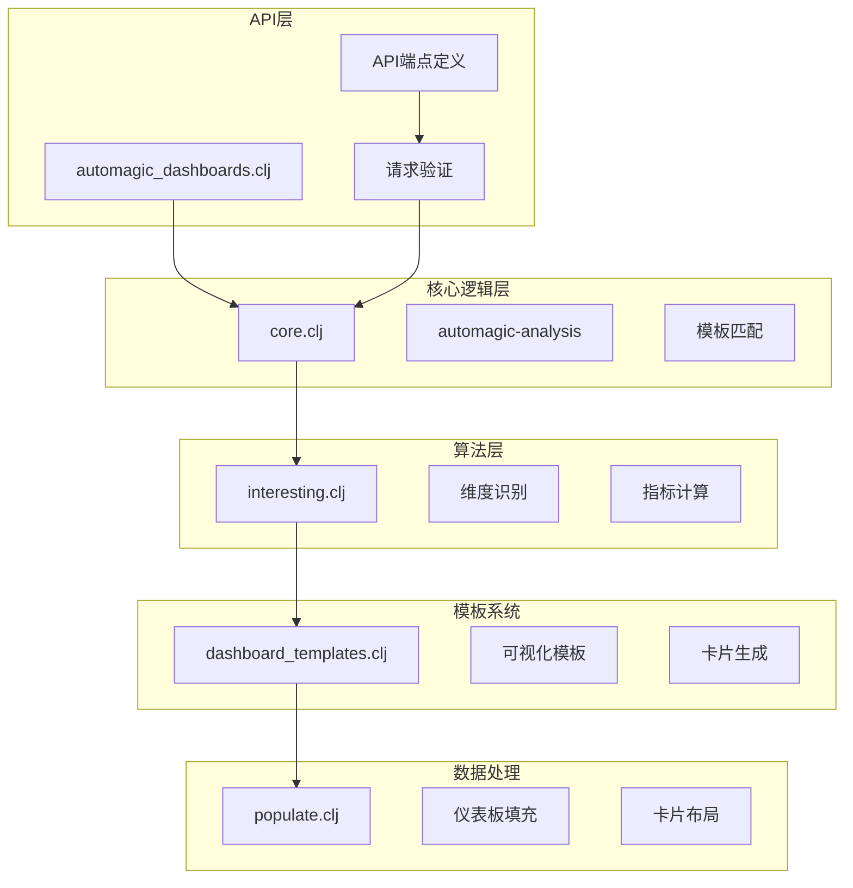

**图表来源**
- [automagic_dashboards.clj](file://src/metabase/xrays/api/automagic_dashboards.clj#L1-L50)
- [core.clj](file://src/metabase/xrays/automagic_dashboards/core.clj#L1-L50)

## 核心组件分析

### 自动仪表板生成器

自动仪表板生成器是智能分析API的核心组件，负责根据输入实体生成相应的仪表板。

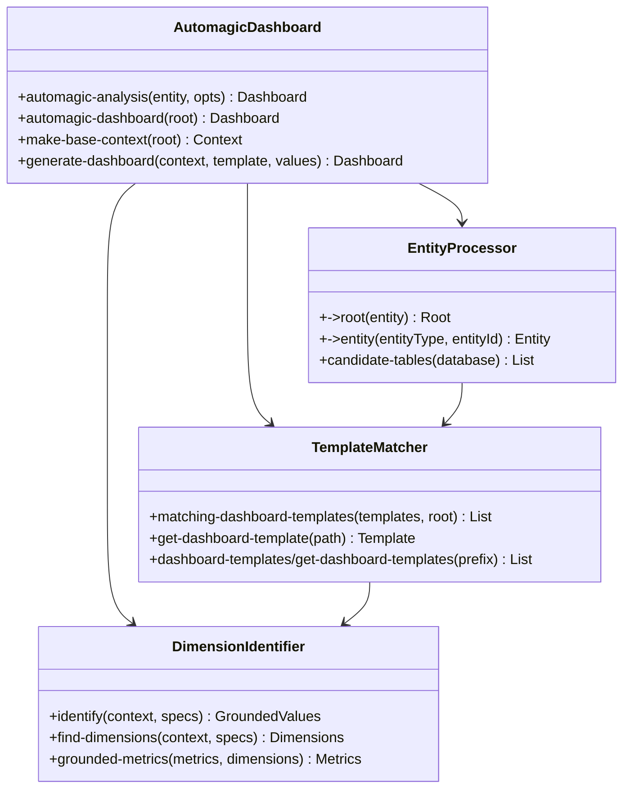

**图表来源**
- [core.clj](file://src/metabase/xrays/automagic_dashboards/core.clj#L739-L769)
- [interesting.clj](file://src/metabase/xrays/automagic_dashboards/interesting.clj#L400-L447)

**章节来源**
- [core.clj](file://src/metabase/xrays/automagic_dashboards/core.clj#L1-L100)
- [automagic_dashboards.clj](file://src/metabase/xrays/api/automagic_dashboards.clj#L1-L100)

### 实体类型支持

智能分析API支持多种实体类型的自动分析：

| 实体类型 | 描述 | 支持的操作 |
|---------|------|-----------|
| `:table` | 数据表 | 完整分析、钻取、比较 |
| `:segment` | 数据段 | 分析特定子集、对比分析 |
| `:model` | 查询模型 | 复杂查询分析、嵌套分析 |
| `:question` | 问题卡片 | 已有分析结果的再分析 |
| `:field` | 字段 | 字段级分析、类型分析 |
| `:adhoc` | 临时查询 | 动态查询分析 |
| `:transform` | 数据转换 | 转换后数据的分析 |

**章节来源**
- [automagic_dashboards.clj](file://src/metabase/xrays/api/automagic_dashboards.clj#L120-L180)

## API端点详解

### 基础仪表板端点

智能分析API提供了丰富的RESTful端点来访问自动仪表板功能：

#### 获取基础仪表板
```
GET /api/automagic-dashboards/{entity}/{entity-id}
GET /api/automagic-dashboards/{entity}/{entity-id}?show={count|all}
```

**参数说明：**
- `entity`: 实体类型（table、segment、model、question、field、adhoc、transform）
- `entity-id`: 实体标识符
- `show`: 显示卡片数量（默认显示前15个，可指定具体数量或'all'）

#### 单元格分析端点
```
GET /api/automagic-dashboards/{entity}/{entity-id}/cell/{cell-query}
GET /api/automagic-dashboards/{entity}/{entity-id}/cell/{cell-query}/rule/{prefix}/{dashboard-template}
```

**参数说明：**
- `cell-query`: Base64编码的JSON格式查询参数
- `prefix`: 可选的前缀配置
- `dashboard-template`: 指定的仪表板模板名称

#### 比较分析端点
```
GET /api/automagic-dashboards/{entity}/{entity-id}/compare/{comparison-entity}/{comparison-entity-id}
GET /api/automagic-dashboards/{entity}/{entity-id}/cell/{cell-query}/compare/{comparison-entity}/{comparison-entity-id}
```

**章节来源**
- [automagic_dashboards.clj](file://src/metabase/xrays/api/automagic_dashboards.clj#L320-L477)

### 端点架构图

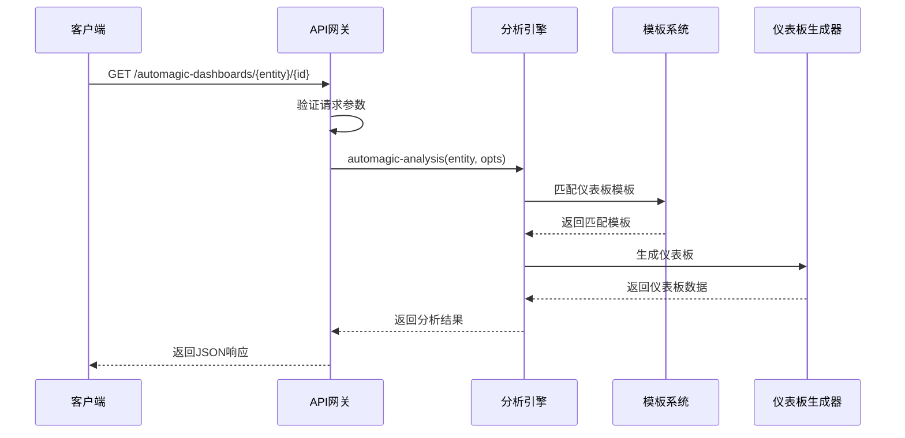

**图表来源**
- [automagic_dashboards.clj](file://src/metabase/xrays/api/automagic_dashboards.clj#L280-L320)

## 智能分析算法

### 核心算法流程

智能分析算法采用多阶段处理流程，确保生成的仪表板既智能又实用：

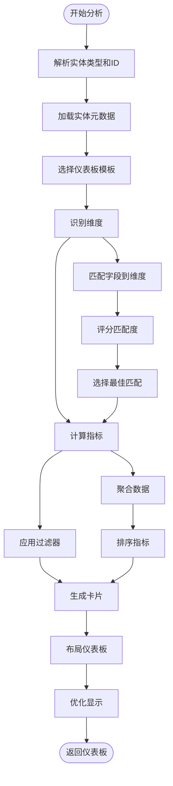

**图表来源**
- [core.clj](file://src/metabase/xrays/automagic_dashboards/core.clj#L691-L718)
- [interesting.clj](file://src/metabase/xrays/automagic_dashboards/interesting.clj#L400-L447)

### 维度识别算法

维度识别是智能分析的核心环节，算法会：

1. **字段匹配**：将数据库字段与预定义维度模板进行匹配
2. **语义分析**：基于字段的语义类型（如时间戳、数值、分类）进行分类
3. **关联分析**：识别字段间的关联关系
4. **评分排序**：为每个匹配项计算得分并排序

**章节来源**
- [interesting.clj](file://src/metabase/xrays/automagic_dashboards/interesting.clj#L300-L400)

### 指标计算引擎

指标计算引擎负责从原始数据中提取有意义的统计信息：

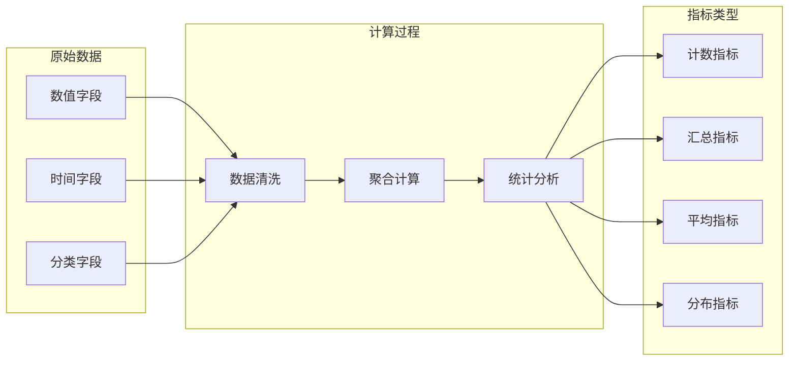

**图表来源**
- [interesting.clj](file://src/metabase/xrays/automagic_dashboards/interesting.clj#L150-L200)

**章节来源**
- [interesting.clj](file://src/metabase/xrays/automagic_dashboards/interesting.clj#L200-L300)

## 可视化模板系统

### 模板层次结构

仪表板模板系统采用分层设计，支持灵活的定制：

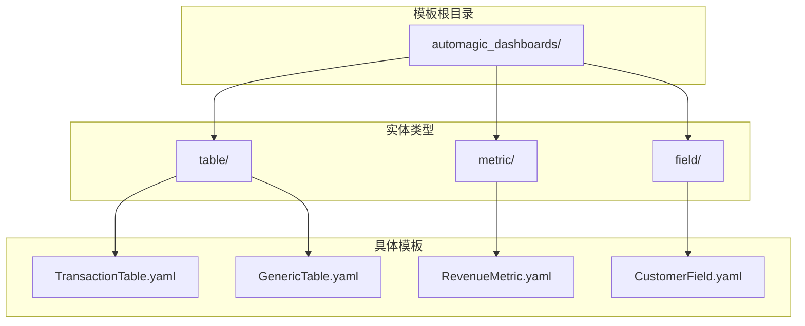

**图表来源**
- [dashboard_templates.clj](file://src/metabase/xrays/automagic_dashboards/dashboard_templates.clj#L363-L398)

### 模板配置语法

仪表板模板使用YAML格式定义，支持以下核心元素：

| 元素类型 | 描述 | 示例 |
|---------|------|------|
| `dimensions` | 数据维度定义 | 时间、地区、产品类别 |
| `metrics` | 统计指标定义 | 销量、收入、增长率 |
| `filters` | 过滤条件定义 | 时间范围、产品类型 |
| `cards` | 可视化卡片定义 | 图表类型、标题、布局 |
| `groups` | 卡片分组定义 | 销售分析、用户分析 |

**章节来源**
- [dashboard_templates.clj](file://src/metabase/xrays/automagic_dashboards/dashboard_templates.clj#L100-L200)

### 动态模板实例化

模板系统支持动态实例化，允许在运行时根据具体数据调整可视化：

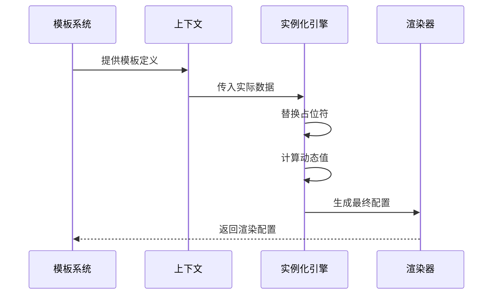

**图表来源**
- [core.clj](file://src/metabase/xrays/automagic_dashboards/core.clj#L331-L360)

**章节来源**
- [dashboard_templates.clj](file://src/metabase/xrays/automagic_dashboards/dashboard_templates.clj#L200-L300)

## 显示选项与前缀配置

### 显示选项控制

智能分析API提供了灵活的显示选项配置：

| 参数 | 类型 | 默认值 | 描述 |
|------|------|--------|------|
| `show` | int/string | 15 | 显示的卡片数量（数字或'all'） |
| `cell-query` | base64-json | null | 单元格钻取查询 |
| `dashboard-template` | string | null | 指定的仪表板模板 |
| `comparison?` | boolean | false | 是否启用比较模式 |
| `query-filter` | array | null | 查询过滤条件 |

### 前缀配置系统

前缀配置用于组织和分类仪表板模板：

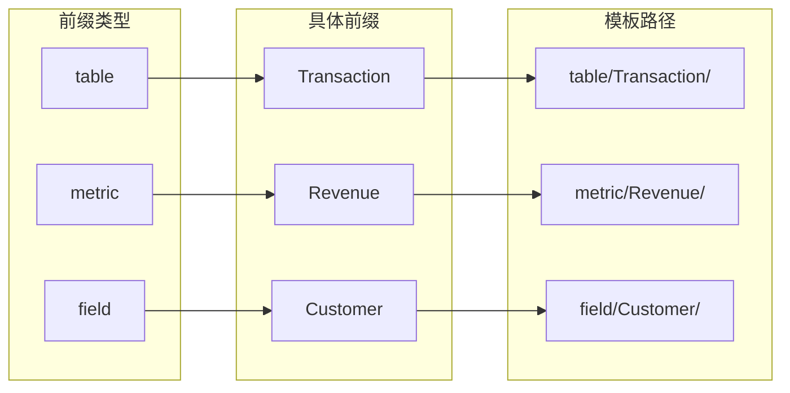

**图表来源**
- [automagic_dashboards.clj](file://src/metabase/xrays/api/automagic_dashboards.clj#L30-L62)

**章节来源**
- [automagic_dashboards.clj](file://src/metabase/xrays/api/automagic_dashboards.clj#L200-L280)

## 实体ID解析机制

### 解析策略

智能分析API支持多种实体ID格式的解析：

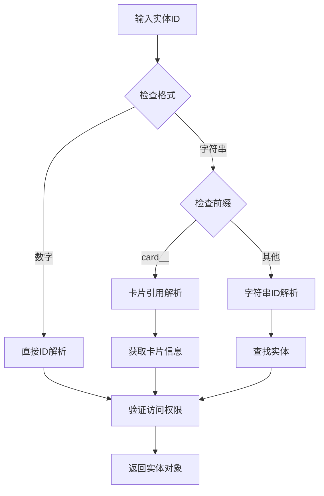

**图表来源**
- [automagic_dashboards.clj](file://src/metabase/xrays/api/automagic_dashboards.clj#L120-L180)

### 支持的实体ID格式

| 格式 | 示例 | 描述 |
|------|------|------|
| 数字ID | `123` | 直接的数据库ID |
| 卡片引用 | `card__456` | 来源卡片的引用 |
| 基础64编码 | `eyJxdWVyeSI6...` | 编码的查询参数 |
| 转换名称 | `sales_summary` | 数据转换的名称 |

**章节来源**
- [automagic_dashboards.clj](file://src/metabase/xrays/api/automagic_dashboards.clj#L100-L150)

## 请求响应示例

### 基础仪表板请求

**请求：**
```http
GET /api/automagic-dashboards/table/123?show=10
Authorization: Bearer <token>
Content-Type: application/json
```

**响应：**
```json
{
  "id": "auto_dashboard_123",
  "name": "销售数据仪表板",
  "description": "基于销售表的智能分析仪表板",
  "dashcards": [
    {
      "id": "card_1",
      "size_x": 6,
      "size_y": 4,
      "card": {
        "id": 12345,
        "name": "总销售额",
        "display": "number",
        "dataset_query": {
          "type": "query",
          "query": {
            "source-table": 123,
            "aggregation": ["sum", ["field-id", 456]]
          }
        }
      }
    },
    {
      "id": "card_2",
      "size_x": 12,
      "size_y": 6,
      "card": {
        "id": 12346,
        "name": "销售额趋势",
        "display": "line",
        "dataset_query": {
          "type": "query",
          "query": {
            "source-table": 123,
            "breakout": [["field-id", 789]],
            "aggregation": ["sum", ["field-id", 456]]
          }
        }
      }
    }
  ],
  "related": [
    {
      "url": "/api/automagic-dashboards/table/456",
      "title": "客户数据",
      "description": "相关客户数据分析"
    }
  ]
}
```

### 单元格分析请求

**请求：**
```http
GET /api/automagic-dashboards/table/123/cell/eyJhcmdzIjpbWyJiZXR3ZWVuIiw...?show=all
Authorization: Bearer <token>
Content-Type: application/json
```

**响应：**
```json
{
  "id": "cell_analysis_123",
  "name": "特定时间段销售分析",
  "dashcards": [
    {
      "id": "cell_card_1",
      "size_x": 12,
      "size_y": 4,
      "card": {
        "id": 12347,
        "name": "区域销售对比",
        "display": "bar",
        "dataset_query": {
          "type": "query",
          "query": {
            "source-table": 123,
            "filter": [["between", ["field-id", 789], "2024-01-01", "2024-01-31"]],
            "breakout": [["field-id", 101]],
            "aggregation": ["sum", ["field-id", 456]]
          }
        }
      }
    }
  ],
  "transient_filters": [
    ["between", ["field-id", 789], "2024-01-01", "2024-01-31"]
  ]
}
```

### 比较分析请求

**请求：**
```http
GET /api/automagic-dashboards/table/123/compare/table/456?show=5
Authorization: Bearer <token>
Content-Type: application/json
```

**响应：**
```json
{
  "id": "comparison_dashboard_123_456",
  "name": "销售数据对比分析",
  "dashcards": [
    {
      "id": "comp_card_1",
      "size_x": 12,
      "size_y": 4,
      "card": {
        "id": 12348,
        "name": "销售量对比",
        "display": "table",
        "dataset_query": {
          "type": "query",
          "query": {
            "source-table": 123,
            "breakout": [["field-id", 789]],
            "aggregation": ["sum", ["field-id", 456]]
          }
        }
      }
    }
  ],
  "comparison": {
    "left": {
      "name": "销售表1",
      "data": {...}
    },
    "right": {
      "name": "销售表2",
      "data": {...}
    }
  }
}
```

**章节来源**
- [automagic_dashboards.clj](file://src/metabase/xrays/api/automagic_dashboards.clj#L280-L320)

## 性能优化考虑

### 查询优化策略

智能分析API采用了多种性能优化技术：

1. **延迟加载**：仅在需要时加载模板和配置
2. **缓存机制**：缓存常用的模板和计算结果
3. **批量处理**：对多个实体同时进行分析
4. **索引优化**：利用数据库索引加速字段查找

### 内存管理

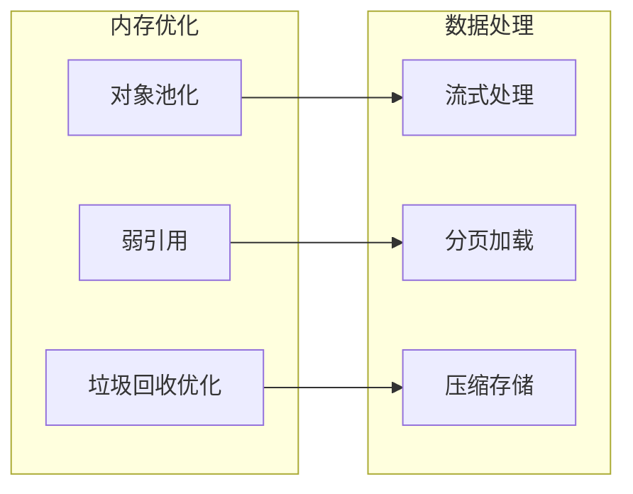

### 并发处理

智能分析API支持并发处理多个分析请求：

- **线程池管理**：合理分配线程资源
- **异步处理**：非阻塞的分析任务执行
- **负载均衡**：分布式环境下的请求分发

## 故障排除指南

### 常见问题及解决方案

| 问题类型 | 症状 | 可能原因 | 解决方案 |
|---------|------|---------|---------|
| 模板加载失败 | 404错误 | 模板文件不存在或路径错误 | 检查模板文件位置和命名 |
| 权限不足 | 403错误 | 用户无访问权限 | 检查用户权限设置 |
| 数据量过大 | 响应超时 | 查询数据量超过限制 | 使用分页或过滤条件 |
| 内存溢出 | OutOfMemoryError | 处理大量数据时内存不足 | 增加JVM堆内存或优化查询 |

### 调试工具

智能分析API提供了多种调试工具：

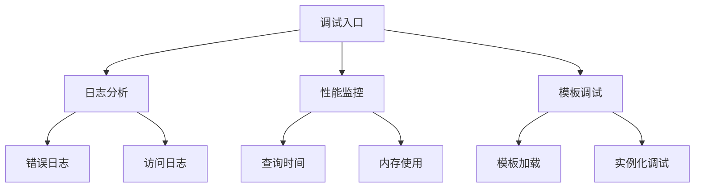

**章节来源**
- [core.clj](file://src/metabase/xrays/automagic_dashboards/core.clj#L700-L799)

## 总结

Metabase智能分析API是一个功能强大且设计精良的自动化仪表板生成系统。它通过以下关键特性为用户提供了卓越的数据分析体验：

### 核心优势

1. **智能化程度高**：基于机器学习和启发式规则的自动分析
2. **灵活性强**：支持多种实体类型和自定义模板
3. **扩展性好**：模块化架构便于功能扩展
4. **性能优异**：多层次优化确保高效处理

### 应用场景

- **业务分析**：快速生成销售、财务等业务仪表板
- **数据探索**：帮助用户发现数据中的潜在模式
- **报告生成**：自动生成标准化的分析报告
- **决策支持**：为管理层提供数据驱动的决策依据

### 发展方向

随着人工智能技术的发展，智能分析API将在以下方面持续改进：

- **更智能的推荐**：基于用户行为的学习算法
- **实时分析**：支持实时数据流的分析处理
- **多模态分析**：结合文本、图像等多种数据类型
- **个性化定制**：根据用户偏好自动调整分析策略

通过深入理解智能分析API的设计原理和实现细节，开发者可以更好地利用这一强大工具，为用户提供更加智能和高效的数据分析服务。