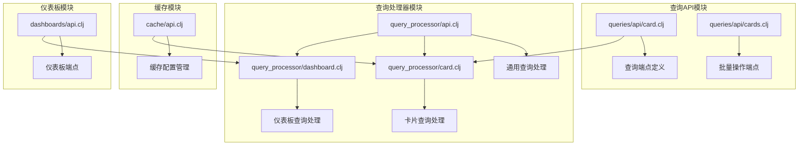
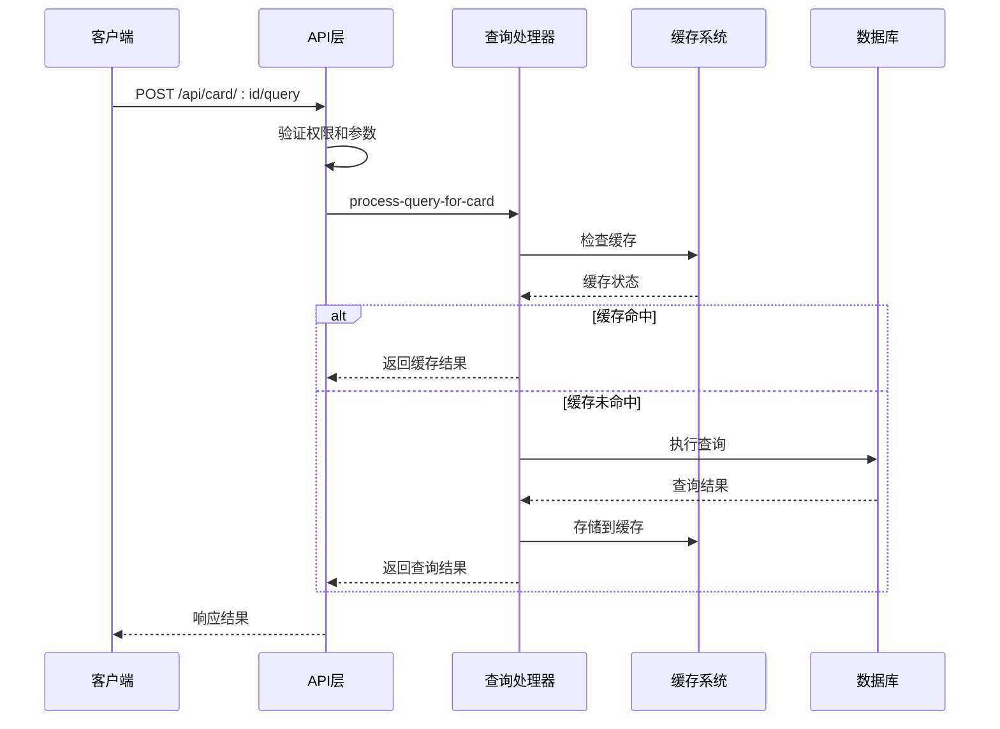
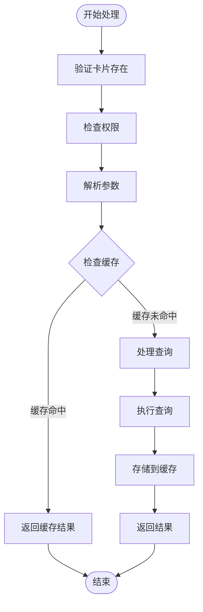
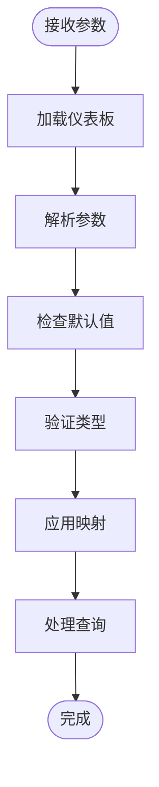
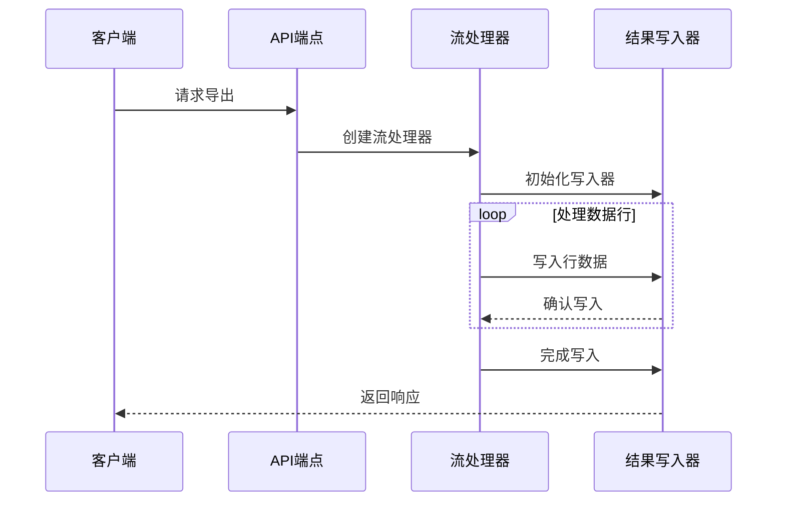
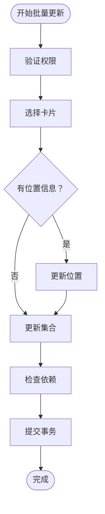
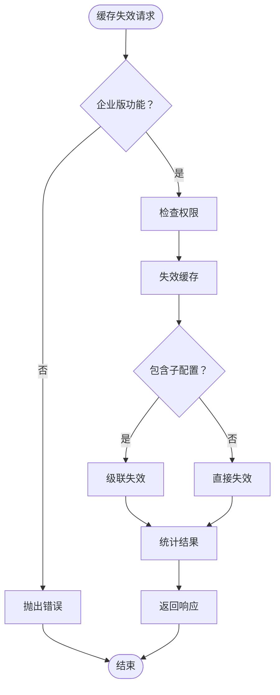
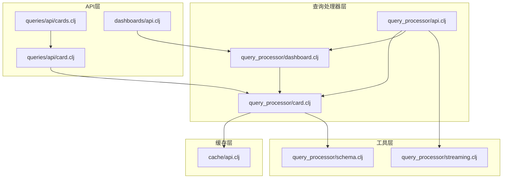

# 查询执行API

<cite>
**本文档中引用的文件**
- [card.clj](file://src/metabase/queries/api/card.clj)
- [dashboards/api.clj](file://src/metabase/dashboards/api.clj)
- [cache/api.clj](file://src/metabase/cache/api.clj)
- [query_processor/api.clj](file://src/metabase/query_processor/api.clj)
- [query_processor/card.clj](file://src/metabase/query_processor/card.clj)
- [query_processor/dashboard.clj](file://src/metabase/query_processor/dashboard.clj)
- [query_processor/schema.clj](file://src/metabase/query_processor/schema.clj)
- [query_processor/streaming.clj](file://src/metabase/query_processor/streaming.clj)
- [cards.clj](file://src/metabase/queries/api/cards.clj)
</cite>

## 目录
1. [简介](#简介)
2. [项目结构](#项目结构)
3. [核心组件](#核心组件)
4. [架构概览](#架构概览)
5. [详细组件分析](#详细组件分析)
6. [依赖关系分析](#依赖关系分析)
7. [性能考虑](#性能考虑)
8. [故障排除指南](#故障排除指南)
9. [结论](#结论)

## 简介

Metabase查询执行API是一个复杂而强大的系统，负责处理卡片查询的执行、参数处理、结果获取以及缓存管理。该API提供了多种端点来支持不同场景下的查询需求，包括单个卡片查询、仪表板上下文查询、批量操作和导出功能。

本文档详细记录了卡片查询相关的所有端点，包括查询运行、参数处理和结果获取的完整流程。同时深入解释了查询缓存机制和忽略缓存选项的使用方法，并文档化了批量更新卡片集合的功能。

## 项目结构

查询执行API的核心文件分布在以下目录结构中：



**图表来源**
- [card.clj](file://src/metabase/queries/api/card.clj#L1-L50)
- [query_processor/api.clj](file://src/metabase/query_processor/api.clj#L1-L50)
- [cache/api.clj](file://src/metabase/cache/api.clj#L1-L50)

**章节来源**
- [card.clj](file://src/metabase/queries/api/card.clj#L1-L100)
- [query_processor/api.clj](file://src/metabase/query_processor/api.clj#L1-L100)

## 核心组件

### 卡片查询端点

查询执行API的核心是围绕卡片（Card）的查询端点设计的。主要端点包括：

1. **单个卡片查询**：`POST /api/card/:card-id/query`
2. **仪表板卡片查询**：`POST /api/dashboard/:dashboard-id/card/:card-id/query`
3. **导出格式查询**：`POST /api/card/:card-id/query/:export-format`

### 参数处理系统

参数处理系统支持复杂的查询参数传递和验证：

- **模板标签参数**：支持MBQL查询中的模板标签
- **仪表板参数映射**：支持仪表板级别的参数映射
- **默认值处理**：自动处理参数默认值
- **类型验证**：严格的参数类型验证

### 缓存机制

查询缓存系统提供了多层次的缓存策略：

- **根级别缓存**：全局缓存配置
- **数据库级别缓存**：按数据库的缓存控制
- **卡片级别缓存**：单个卡片的缓存设置
- **粒度缓存控制**：企业版的精细化缓存管理

**章节来源**
- [card.clj](file://src/metabase/queries/api/card.clj#L801-L850)
- [query_processor/card.clj](file://src/metabase/query_processor/card.clj#L1-L100)

## 架构概览

查询执行API采用分层架构设计，确保了良好的可扩展性和维护性：



**图表来源**
- [query_processor/card.clj](file://src/metabase/query_processor/card.clj#L313-L367)
- [cache/api.clj](file://src/metabase/cache/api.clj#L154-L189)

## 详细组件分析

### 单个卡片查询端点

#### 端点定义
`POST /api/card/:card-id/query`

#### 请求参数
| 参数名 | 类型 | 必需 | 描述 |
|--------|------|------|------|
| card-id | PositiveInt/NanoIdString | 是 | 卡片ID |
| parameters | Array | 否 | 查询参数数组 |
| ignore_cache | Boolean | 否 | 是否忽略缓存，默认false |
| dashboard_id | PositiveInt | 否 | 仪表板ID（已弃用） |
| collection_preview | Boolean | 否 | 是否为集合预览 |

#### 处理流程



**图表来源**
- [card.clj](file://src/metabase/queries/api/card.clj#L801-L850)
- [query_processor/card.clj](file://src/metabase/query_processor/card.clj#L313-L367)

#### 示例请求/响应

**请求示例：**
```json
{
  "parameters": [
    {
      "type": "category",
      "target": ["dimension", ["field", 1, null]],
      "value": "Technology"
    }
  ],
  "ignore_cache": false,
  "dashboard_id": 123
}
```

**响应示例：**
```json
{
  "status": "ok",
  "data": {
    "rows": [["Product A", 100], ["Product B", 150]],
    "cols": [
      {"name": "Product", "display_name": "Product"},
      {"name": "Sales", "display_name": "Sales"}
    ],
    "execution_time": 123,
    "cache_hit": false
  }
}
```

**章节来源**
- [card.clj](file://src/metabase/queries/api/card.clj#L801-L850)

### 仪表板卡片查询端点

#### 端点定义
`POST /api/dashboard/:dashboard-id/card/:card-id/query`

#### 特殊特性

1. **仪表板上下文**：查询在仪表板上下文中执行
2. **参数映射**：支持仪表板级别的参数映射
3. **默认值处理**：自动应用仪表板参数默认值
4. **权限继承**：继承仪表板的访问权限

#### 参数解析流程



**图表来源**
- [query_processor/dashboard.clj](file://src/metabase/query_processor/dashboard.clj#L119-L194)

**章节来源**
- [query_processor/dashboard.clj](file://src/metabase/query_processor/dashboard.clj#L170-L194)

### 导出格式查询

#### 支持的导出格式
- `:api` - 正常JSON API结果（带额外元数据）
- `:csv` - CSV格式
- `:json` - JSON格式
- `:xlsx` - Excel格式

#### 流式响应处理

查询执行系统使用流式响应来处理大数据集：



**图表来源**
- [query_processor/streaming.clj](file://src/metabase/query_processor/streaming.clj#L226-L264)

**章节来源**
- [query_processor/api.clj](file://src/metabase/query_processor/api.clj#L100-L150)

### 批量更新卡片集合

#### 端点定义
`POST /api/card/collections`

#### 功能描述
批量更新卡片集合的功能允许用户将多个卡片移动到指定的集合中，或者从所有集合中移除它们。

#### 请求参数
| 参数名 | 类型 | 必需 | 描述 |
|--------|------|------|------|
| card_ids | Array[PositiveInt] | 是 | 要操作的卡片ID列表 |
| collection_id | PositiveInt | 否 | 目标集合ID（null表示移除） |

#### 实现逻辑



**图表来源**
- [card.clj](file://src/metabase/queries/api/card.clj#L780-L826)

**章节来源**
- [card.clj](file://src/metabase/queries/api/card.clj#L801-L826)

### 查询缓存机制

#### 缓存策略层次

查询缓存系统采用多层级的缓存策略：

1. **根级别缓存**：全局缓存配置
2. **数据库级别缓存**：按数据库的缓存控制
3. **仪表板级别缓存**：按仪表板的缓存设置
4. **卡片级别缓存**：单个卡片的缓存配置

#### 缓存失效机制



**图表来源**
- [cache/api.clj](file://src/metabase/cache/api.clj#L154-L189)

**章节来源**
- [cache/api.clj](file://src/metabase/cache/api.clj#L154-L189)

## 依赖关系分析

查询执行API的依赖关系体现了清晰的分层架构：



**图表来源**
- [card.clj](file://src/metabase/queries/api/card.clj#L1-L50)
- [query_processor/card.clj](file://src/metabase/query_processor/card.clj#L1-L50)

**章节来源**
- [card.clj](file://src/metabase/queries/api/card.clj#L1-L50)
- [query_processor/card.clj](file://src/metabase/query_processor/card.clj#L1-L50)

## 性能考虑

### 查询优化策略

1. **缓存优先**：优先使用缓存结果减少数据库负载
2. **流式处理**：大结果集采用流式处理避免内存溢出
3. **批量操作**：支持批量卡片操作减少HTTP请求
4. **权限检查**：延迟权限检查避免不必要的数据库查询

### 缓存性能优化

- **TTL策略**：智能的缓存过期时间管理
- **分层缓存**：多层级缓存减少查询压力
- **缓存预热**：重要查询的缓存预热机制

### 并发处理

查询执行系统支持并发查询处理，通过以下机制保证线程安全：
- 连接池管理
- 事务隔离
- 查询取消机制

## 故障排除指南

### 常见问题及解决方案

#### 查询超时
**症状**：查询长时间无响应
**原因**：复杂查询或数据库性能问题
**解决方案**：
- 检查查询复杂度
- 优化数据库索引
- 调整查询超时设置

#### 缓存不生效
**症状**：设置了缓存但查询仍然执行
**原因**：缓存配置错误或权限不足
**解决方案**：
- 检查缓存配置
- 验证用户权限
- 确认企业版功能启用

#### 参数验证失败
**症状**：参数传递导致查询失败
**原因**：参数类型不匹配或格式错误
**解决方案**：
- 验证参数类型
- 检查参数格式
- 使用正确的参数映射

**章节来源**
- [query_processor/card.clj](file://src/metabase/query_processor/card.clj#L200-L300)
- [query_processor/dashboard.clj](file://src/metabase/query_processor/dashboard.clj#L100-L150)

## 结论

Metabase查询执行API是一个设计精良、功能完备的系统，它成功地平衡了功能性、性能和可维护性。通过分层架构、清晰的职责分离和完善的缓存机制，该API能够高效地处理各种查询场景。

主要优势包括：
- **灵活的参数处理**：支持复杂的查询参数和模板标签
- **高效的缓存机制**：多层次缓存策略提升查询性能
- **强大的批量操作**：支持卡片集合的批量管理
- **流式响应处理**：大结果集的高效处理
- **完善的错误处理**：全面的异常处理和错误报告

该API为Metabase的数据查询功能提供了坚实的基础，支持从简单的单卡片查询到复杂的仪表板交互等各种使用场景。