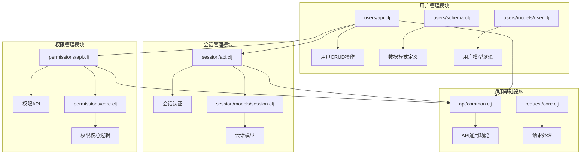
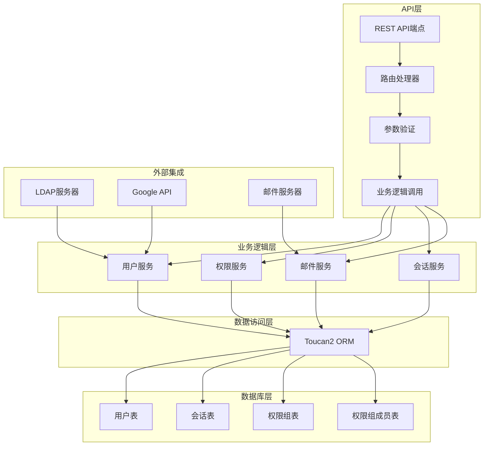
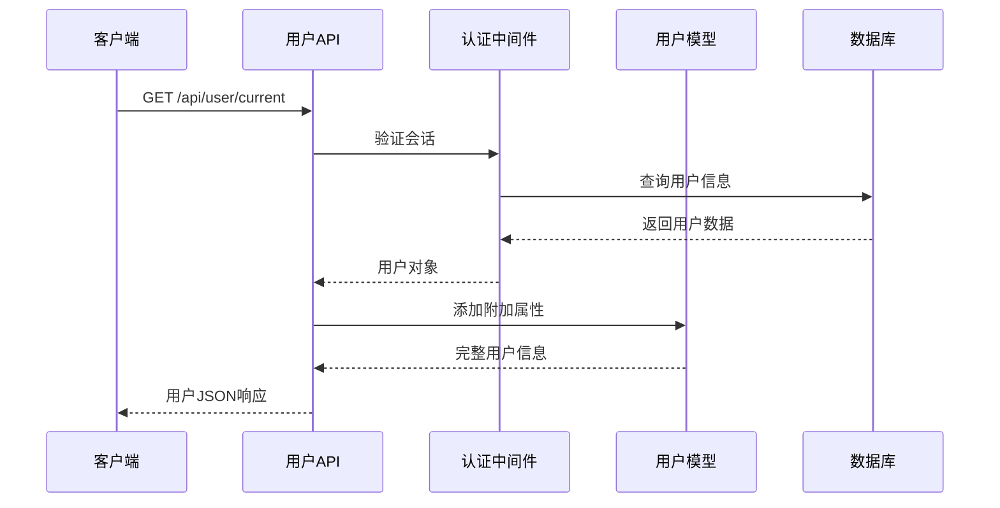
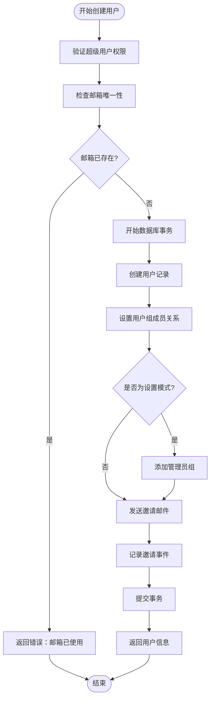
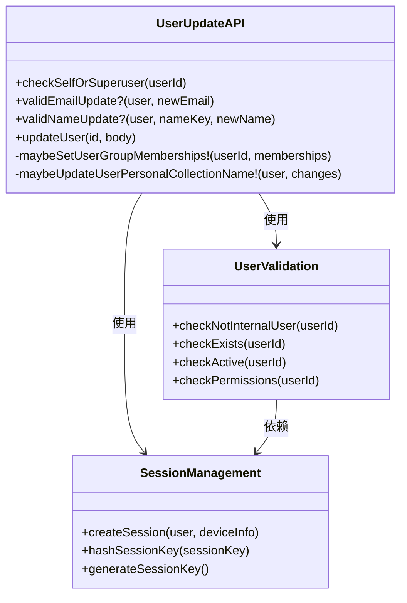
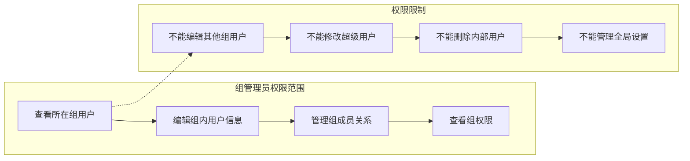
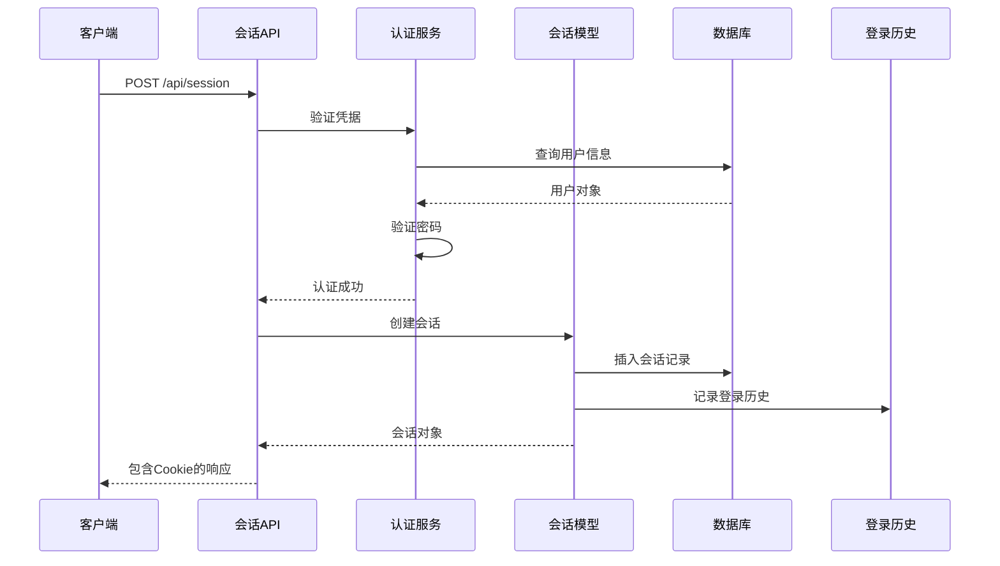
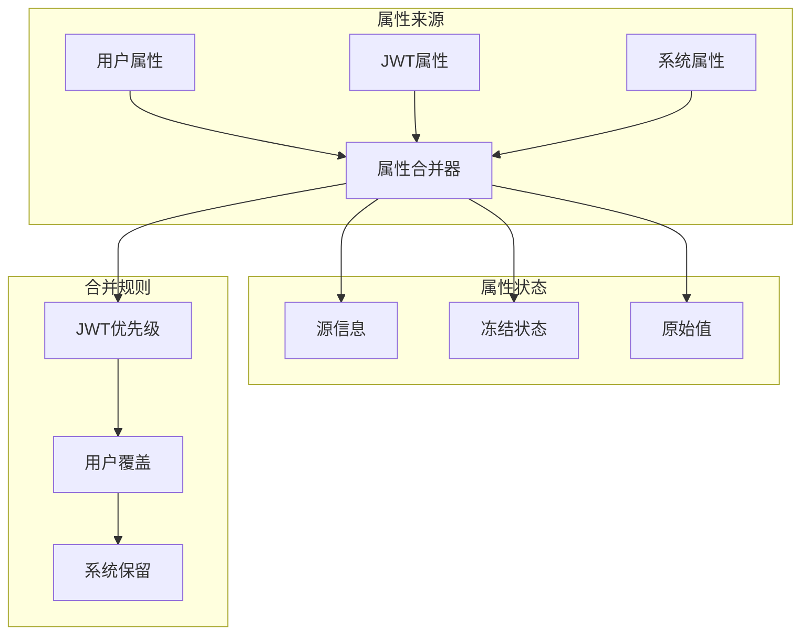
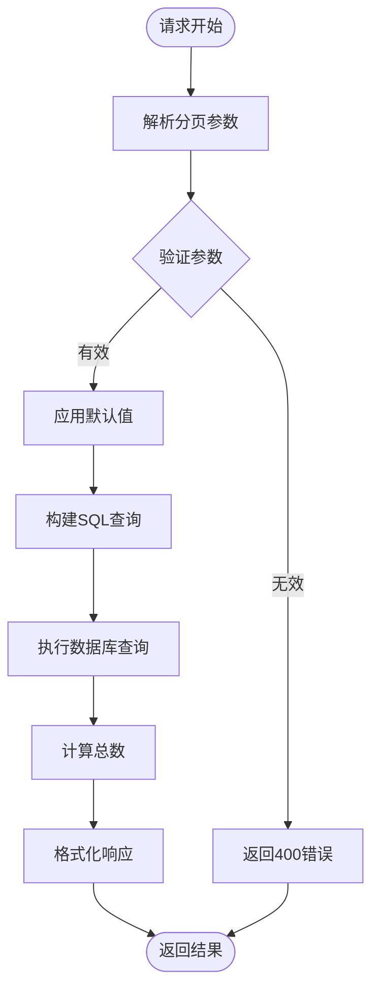
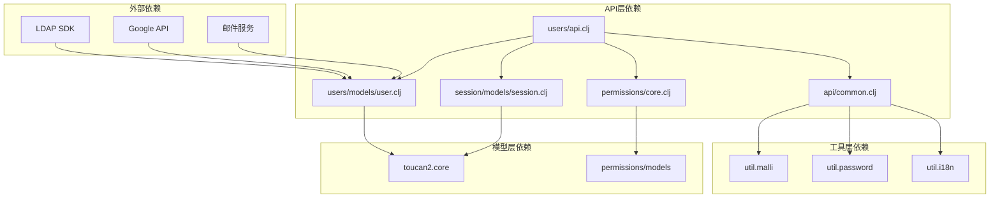

# 用户管理API

<cite>
**本文档中引用的文件**
- [src/metabase/users/api.clj](file://src/metabase/users/api.clj)
- [src/metabase/users/schema.clj](file://src/metabase/users/schema.clj)
- [src/metabase/users/models/user.clj](file://src/metabase/users/models/user.clj)
- [src/metabase/session/api.clj](file://src/metabase/session/api.clj)
- [src/metabase/session/models/session.clj](file://src/metabase/session/models/session.clj)
- [src/metabase/permissions/api.clj](file://src/metabase/permissions/api.clj)
- [src/metabase/permissions/core.clj](file://src/metabase/permissions/core.clj)
- [src/metabase/api/common.clj](file://src/metabase/api/common.clj)
- [src/metabase/request/core.clj](file://src/metabase/request/core.clj)
- [src/metabase/api_routes/routes.clj](file://src/metabase/api_routes/routes.clj)
</cite>

## 目录
1. [简介](#简介)
2. [项目结构](#项目结构)
3. [核心组件](#核心组件)
4. [架构概览](#架构概览)
5. [详细组件分析](#详细组件分析)
6. [依赖关系分析](#依赖关系分析)
7. [性能考虑](#性能考虑)
8. [故障排除指南](#故障排除指南)
9. [结论](#结论)

## 简介

Metabase用户管理API提供了全面的用户生命周期管理功能，包括用户创建、获取、更新、删除以及会话管理。该API系统支持多种身份验证机制，包括密码登录、SSO（单点登录）和LDAP集成，同时实现了精细的权限控制和角色管理。

本文档详细记录了所有与用户相关的端点，解释了身份验证机制和权限检查，特别是超级用户和组管理员的特殊权限。文档还涵盖了用户邀请流程、会话管理、分页、搜索和过滤功能，以及用户属性的结构化存储和检索机制。

## 项目结构

Metabase用户管理API的核心文件分布在以下目录结构中：

**图表来源**
- [src/metabase/users/api.clj](file://src/metabase/users/api.clj#L1-L39)
- [src/metabase/session/api.clj](file://src/metabase/session/api.clj#L1-L30)
- [src/metabase/permissions/api.clj](file://src/metabase/permissions/api.clj#L1-L30)

**章节来源**
- [src/metabase/users/api.clj](file://src/metabase/users/api.clj#L1-L50)
- [src/metabase/session/api.clj](file://src/metabase/session/api.clj#L1-L50)

## 核心组件

### 用户管理核心功能

Metabase用户管理API提供了以下核心功能：

1. **用户CRUD操作**：创建、读取、更新、删除用户账户
2. **身份验证**：支持多种登录方式（密码、SSO、LDAP）
3. **权限管理**：超级用户和组管理员权限控制
4. **会话管理**：用户会话的创建、维护和销毁
5. **用户邀请**：批量用户邀请和激活流程
6. **属性管理**：结构化用户属性存储和检索

### 身份验证机制

系统支持多种身份验证方式：

- **本地密码认证**：基于用户名和密码的传统认证
- **SSO认证**：支持Google、LDAP等外部身份提供商
- **JWT令牌认证**：用于API访问和嵌入式场景
- **会话管理**：基于Cookie的持久化会话

**章节来源**
- [src/metabase/users/api.clj](file://src/metabase/users/api.clj#L344-L375)
- [src/metabase/session/api.clj](file://src/metabase/session/api.clj#L50-L100)

## 架构概览

Metabase用户管理API采用分层架构设计，确保了良好的可维护性和扩展性：

**图表来源**
- [src/metabase/users/api.clj](file://src/metabase/users/api.clj#L1-L39)
- [src/metabase/session/api.clj](file://src/metabase/session/api.clj#L1-L30)
- [src/metabase/permissions/api.clj](file://src/metabase/permissions/api.clj#L1-L30)

## 详细组件分析

### 用户CRUD API端点

#### 获取当前用户信息

**图表来源**
- [src/metabase/users/api.clj](file://src/metabase/users/api.clj#L344-L375)

#### 创建新用户（邀请）

用户创建通过邀请机制实现，确保安全性和审计跟踪：

**图表来源**
- [src/metabase/users/api.clj](file://src/metabase/users/api.clj#L376-L400)

#### 更新用户信息

用户更新操作包含严格的权限检查和数据验证：

**图表来源**
- [src/metabase/users/api.clj](file://src/metabase/users/api.clj#L401-L500)

**章节来源**
- [src/metabase/users/api.clj](file://src/metabase/users/api.clj#L172-L202)
- [src/metabase/users/api.clj](file://src/metabase/users/api.clj#L376-L400)
- [src/metabase/users/api.clj](file://src/metabase/users/api.clj#L401-L500)

### 权限管理系统

#### 超级用户权限

超级用户拥有系统的完全控制权：

| 操作类型 | 超级用户权限 | 组管理员权限 | 普通用户权限 |
|---------|-------------|-------------|-------------|
| 查看用户列表 | ✓ 全部用户 | ✓ 所在组用户 | ✗ 仅自己 |
| 编辑用户信息 | ✓ 全部用户 | ✓ 所在组用户 | ✗ 仅自己 |
| 删除用户 | ✓ 全部用户 | ✗ 无权限 | ✗ 仅自己 |
| 管理权限组 | ✓ 全部组 | ✓ 管理的组 | ✗ 无权限 |
| 管理系统设置 | ✓ 完全控制 | ✗ 有限控制 | ✗ 无权限 |

#### 组管理员权限

组管理员具有受限的管理权限：

**图表来源**
- [src/metabase/permissions/api.clj](file://src/metabase/permissions/api.clj#L209-L237)

**章节来源**
- [src/metabase/permissions/api.clj](file://src/metabase/permissions/api.clj#L151-L183)
- [src/metabase/permissions/api.clj](file://src/metabase/permissions/api.clj#L236-L258)

### 会话管理

#### 会话创建流程

**图表来源**
- [src/metabase/session/api.clj](file://src/metabase/session/api.clj#L100-L150)

#### 会话验证机制

会话验证采用多层安全策略：

1. **会话键哈希**：存储经过SHA-512哈希的会话密钥
2. **CSRF保护**：嵌入式应用使用额外的CSRF令牌
3. **IP地址绑定**：可配置的IP地址验证
4. **超时管理**：自动过期机制

**章节来源**
- [src/metabase/session/api.clj](file://src/metabase/session/api.clj#L50-L100)
- [src/metabase/session/models/session.clj](file://src/metabase/session/models/session.clj#L70-L105)

### 用户属性系统

#### 结构化属性存储

Metabase实现了复杂的用户属性系统，支持多源属性合并：

**图表来源**
- [src/metabase/users/api.clj](file://src/metabase/users/api.clj#L109-L142)

#### 属性类型定义

| 属性类型 | 前缀 | 描述 | 示例 |
|---------|------|------|------|
| 用户属性 | 无前缀 | 用户手动设置的属性 | `"department": "engineering"` |
| JWT属性 | 无前缀 | SSO提供的属性 | `"company_email": "user@company.com"` |
| 系统属性 | `@`前缀 | 系统自动生成的属性 | `"@version": "1.0.0"` |

**章节来源**
- [src/metabase/users/api.clj](file://src/metabase/users/api.clj#L86-L142)
- [src/metabase/users/schema.clj](file://src/metabase/users/schema.clj#L1-L25)

### 分页、搜索和过滤

#### 分页机制

系统采用偏移量分页，支持灵活的查询参数：

**图表来源**
- [src/metabase/users/api.clj](file://src/metabase/users/api.clj#L172-L202)

#### 搜索和过滤功能

| 参数 | 类型 | 描述 | 示例 |
|------|------|------|------|
| `status` | 字符串 | 用户状态过滤 | `"active"`, `"deactivated"`, `"all"` |
| `query` | 字符串 | 模糊搜索 | `"john@example.com"` |
| `group_id` | 整数 | 按组过滤 | `123` |
| `include_deactivated` | 布尔值 | 包含已停用用户 | `true`/`false` |
| `limit` | 整数 | 结果数量限制 | `50` |
| `offset` | 整数 | 分页偏移量 | `0` |

**章节来源**
- [src/metabase/users/api.clj](file://src/metabase/users/api.clj#L172-L202)

## 依赖关系分析

### 核心依赖图

**图表来源**
- [src/metabase/users/api.clj](file://src/metabase/users/api.clj#L1-L39)
- [src/metabase/session/api.clj](file://src/metabase/session/api.clj#L1-L30)

### 循环依赖处理

系统通过以下策略避免循环依赖：

1. **接口分离**：定义清晰的接口边界
2. **延迟加载**：使用动态变量和延迟求值
3. **模块化设计**：按功能划分独立模块
4. **依赖注入**：通过函数参数传递依赖

**章节来源**
- [src/metabase/users/api.clj](file://src/metabase/users/api.clj#L1-L39)
- [src/metabase/permissions/core.clj](file://src/metabase/permissions/core.clj#L1-L30)

## 性能考虑

### 查询优化

1. **批量查询**：使用`t2/hydrate`进行批量关联查询
2. **索引利用**：在关键字段上建立适当索引
3. **缓存策略**：对频繁访问的数据实施缓存
4. **分页优化**：避免大结果集的全量查询

### 并发控制

1. **事务隔离**：使用数据库事务保证数据一致性
2. **锁机制**：对敏感操作实施适当的锁定
3. **重试策略**：网络异常时的自动重试机制
4. **超时控制**：防止长时间阻塞的操作

### 安全防护

1. **输入验证**：严格的参数验证和清理
2. **速率限制**：防止暴力破解攻击
3. **日志审计**：完整的操作日志记录
4. **加密存储**：密码和敏感信息的加密存储

## 故障排除指南

### 常见问题及解决方案

#### 用户创建失败

**问题症状**：创建用户时返回400错误

**可能原因**：
1. 邮箱地址已被占用
2. 权限不足（非超级用户尝试创建用户）
3. 输入数据格式不正确

**解决步骤**：
1. 检查邮箱地址是否唯一
2. 验证当前用户权限
3. 确认请求参数格式正确

#### 会话认证失败

**问题症状**：登录后立即被登出或无法访问受保护资源

**可能原因**：
1. 会话密钥被篡改
2. Cookie设置问题
3. CSRF令牌验证失败

**解决步骤**：
1. 检查浏览器Cookie设置
2. 验证CSRF令牌配置
3. 确认会话超时设置

#### 权限访问被拒绝

**问题症状**：普通用户尝试访问管理员功能

**可能原因**：
1. 用户权限级别不足
2. 组管理员权限配置错误
3. 权限缓存未刷新

**解决步骤**：
1. 验证用户角色设置
2. 检查组成员关系
3. 清除权限缓存

**章节来源**
- [src/metabase/api\common.clj](file://src/metabase/api\common.clj#L188-L218)
- [src/metabase/session/api.clj](file://src/metabase/session/api.clj#L100-L150)

## 结论

Metabase用户管理API提供了一个功能完整、安全可靠的用户管理系统。通过分层架构设计、严格的权限控制和灵活的扩展机制，该系统能够满足企业级应用的各种需求。

### 主要优势

1. **安全性**：多层次的身份验证和权限控制
2. **灵活性**：支持多种身份提供商和认证方式
3. **可扩展性**：模块化设计便于功能扩展
4. **可维护性**：清晰的代码结构和完善的文档
5. **性能**：优化的查询和缓存策略

### 最佳实践建议

1. **定期审计**：定期检查用户权限和活动日志
2. **监控告警**：设置关键操作的监控和告警
3. **备份恢复**：建立完善的数据备份和恢复机制
4. **安全更新**：及时应用安全补丁和版本更新
5. **培训教育**：对管理员进行安全意识培训

该API系统为Metabase平台提供了坚实的用户管理基础，支持从个人使用到企业级部署的各种应用场景。