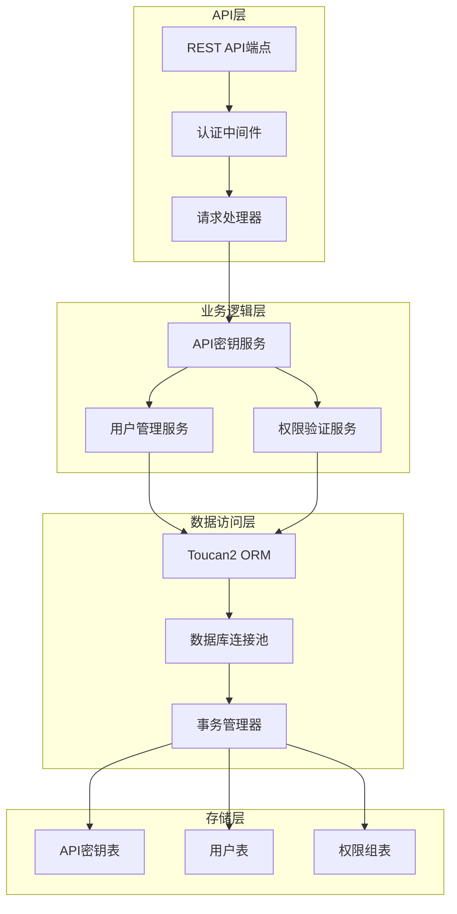
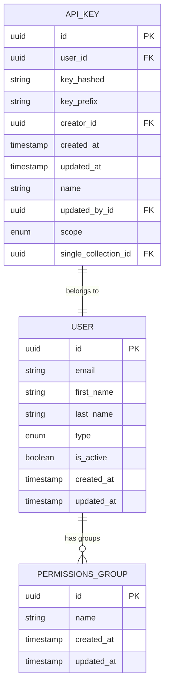
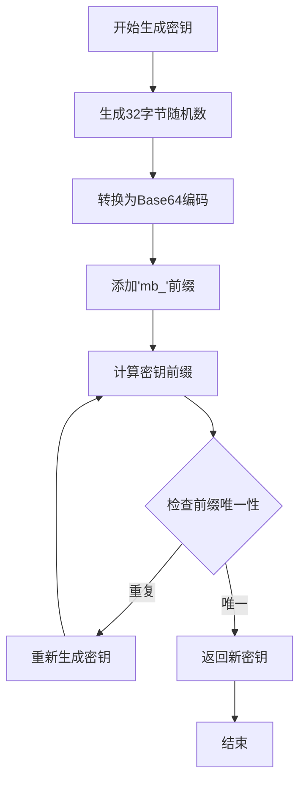
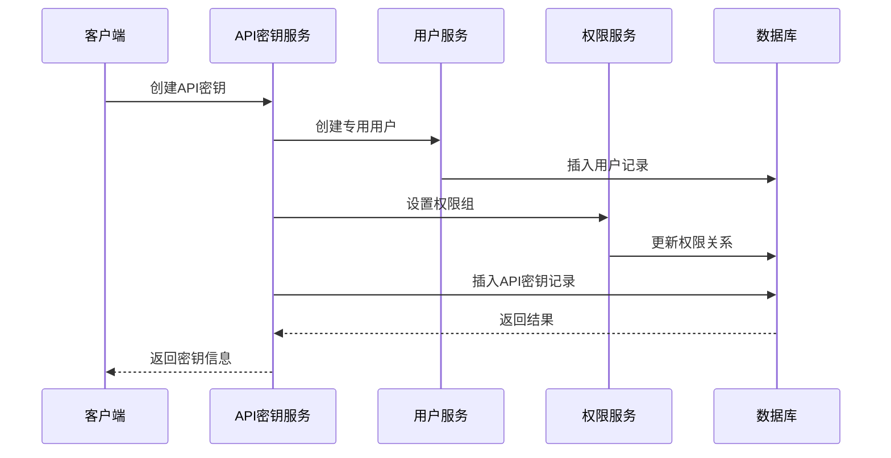
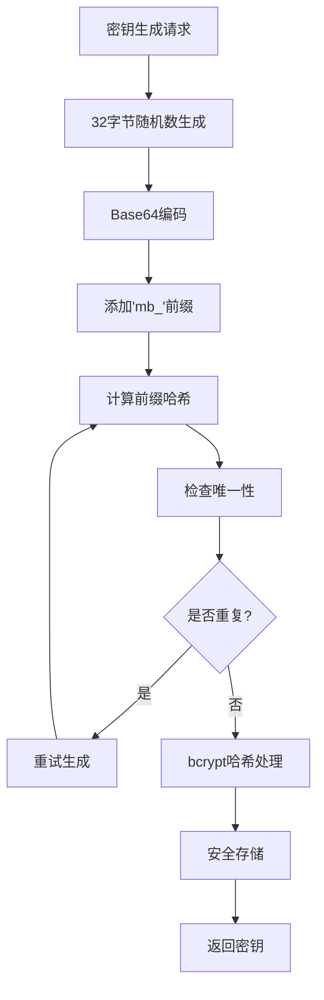
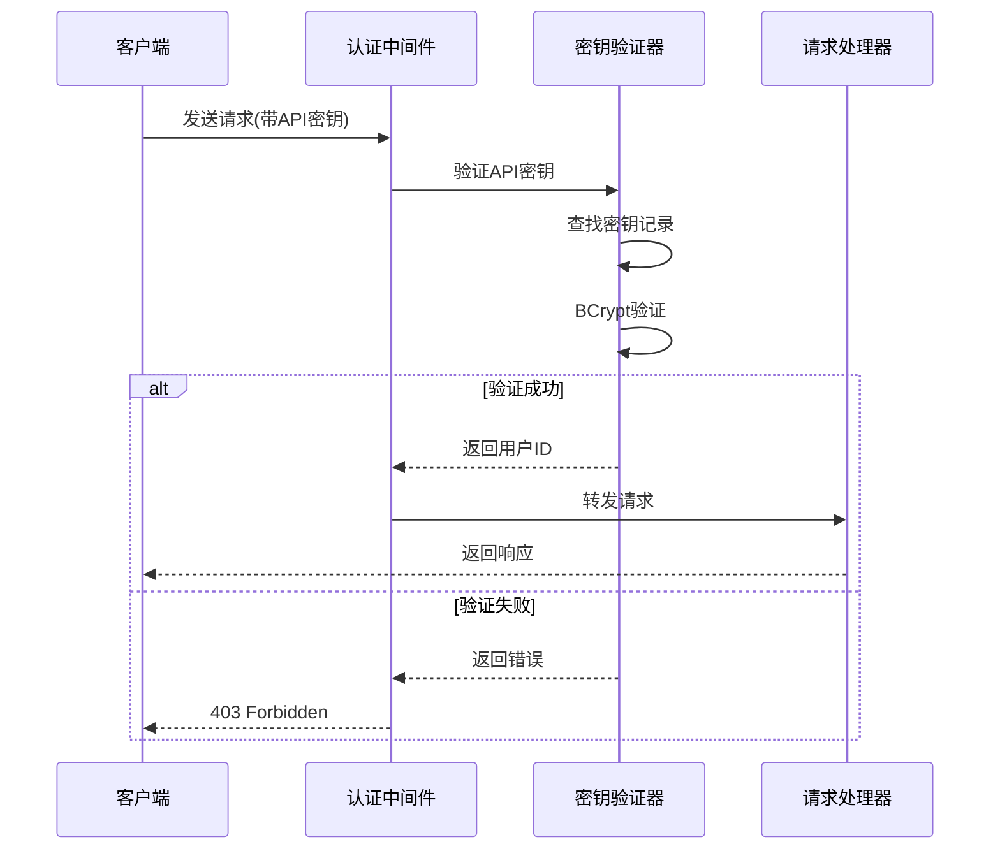

# API密钥管理API

<cite>
**本文档中引用的文件**
- [api.clj](file://src/metabase/api_keys/api.clj)
- [api_key.clj](file://src/metabase/api_keys/models/api_key.clj)
- [schema.clj](file://src/metabase/api_keys/schema.clj)
- [core.clj](file://src/metabase/api_keys/core.clj)
- [auth.clj](file://src/metabase/server/middleware/auth.clj)
- [common.clj](file://src/metabase/api/routes/common.clj)
- [settings.clj](file://src/metabase/api/settings.clj)
</cite>

## 目录
1. [简介](#简介)
2. [系统架构概述](#系统架构概述)
3. [核心数据模型](#核心数据模型)
4. [API端点详解](#api端点详解)
5. [权限范围和访问控制](#权限范围和访问控制)
6. [安全最佳实践](#安全最佳实践)
7. [API密钥认证机制](#api密钥认证机制)
8. [使用示例](#使用示例)
9. [故障排除指南](#故障排除指南)
10. [总结](#总结)

## 简介

Metabase的API密钥管理系统提供了完整的API密钥生命周期管理功能，包括创建、查看、更新、删除和重新生成API密钥。该系统采用强加密机制，支持细粒度的权限控制，并提供了多种认证方式以满足不同场景的需求。

API密钥系统的核心特性：
- 基于bcrypt的安全哈希存储
- 自动生成唯一前缀确保密钥唯一性
- 支持权限组级别的访问控制
- 提供掩码显示和明文暴露的安全机制
- 完整的操作审计日志记录

## 系统架构概述

API密钥管理系统采用分层架构设计，包含以下核心组件：



**图表来源**
- [api.clj](file://src/metabase/api_keys/api.clj#L1-L103)
- [api_key.clj](file://src/metabase/api_keys/models/api_key.clj#L1-L253)

**章节来源**
- [api.clj](file://src/metabase/api_keys/api.clj#L1-L103)
- [core.clj](file://src/metabase/api_keys/core.clj#L1-L13)

## 核心数据模型

### API密钥数据结构

API密钥系统的核心数据模型定义了完整的密钥存储和管理结构：



**图表来源**
- [schema.clj](file://src/metabase/api_keys/schema.clj#L80-L107)
- [api_key.clj](file://src/metabase/api_keys/models/api_key.clj#L25-L35)

### 密钥生成算法

系统采用安全的密钥生成算法：



**图表来源**
- [api_key.clj](file://src/metabase/api_keys/models/api_key.clj#L75-L85)
- [schema.clj](file://src/metabase/api_keys/schema.clj#L10-L25)

**章节来源**
- [schema.clj](file://src/metabase/api_keys/schema.clj#L1-L131)
- [api_key.clj](file://src/metabase/api_keys/models/api_key.clj#L1-L253)

## API端点详解

### 创建API密钥

**端点**: `POST /api/api-key`

**功能**: 创建新的API密钥并关联一个专用用户账户

**请求参数**:
| 参数名 | 类型 | 必填 | 描述 |
|--------|------|------|------|
| name | string | 是 | API密钥名称，必须唯一 |
| group_id | integer | 否 | 权限组ID，指定密钥的访问权限 |

**响应格式**:
```json
{
  "id": 123,
  "name": "my-api-key",
  "masked_key": "mb_abc123****",
  "unmasked_key": "mb_abc123def456...",
  "key_prefix": "mb_abc123",
  "created_at": "2024-01-01T00:00:00Z",
  "updated_at": "2024-01-01T00:00:00Z",
  "updated_by": {
    "id": 1,
    "common_name": "Admin User"
  },
  "group": {
    "id": 456,
    "name": "Data Analysts"
  }
}
```

**权限要求**: 超级用户权限

### 获取API密钥列表

**端点**: `GET /api/api-key`

**功能**: 获取所有API密钥的简要信息列表

**响应格式**:
```json
[
  {
    "id": 123,
    "name": "my-api-key",
    "masked_key": "mb_abc123****",
    "created_at": "2024-01-01T00:00:00Z",
    "updated_at": "2024-01-01T00:00:00Z",
    "updated_by": {
      "id": 1,
      "common_name": "Admin User"
    },
    "group": {
      "id": 456,
      "name": "Data Analysts"
    }
  }
]
```

**权限要求**: 超级用户权限

### 获取API密钥数量

**端点**: `GET /api/api-key/count`

**功能**: 获取系统中API密钥的总数

**响应格式**:
```json
{
  "count": 42
}
```

**权限要求**: 超级用户权限

### 更新API密钥

**端点**: `PUT /api/api-key/{id}`

**功能**: 更新现有API密钥的名称或权限组

**路径参数**:
| 参数名 | 类型 | 描述 |
|--------|------|------|
| id | integer | API密钥ID |

**请求参数**:
| 参数名 | 类型 | 可选 | 描述 |
|--------|------|------|------|
| name | string | 是 | 新的密钥名称 |
| group_id | integer | 是 | 新的权限组ID |

**响应格式**: 返回更新后的API密钥对象

**权限要求**: 超级用户权限

### 重新生成API密钥

**端点**: `PUT /api/api-key/{id}/regenerate`

**功能**: 生成新的API密钥并替换旧密钥

**路径参数**:
| 参数名 | 类型 | 描述 |
|--------|------|------|
| id | integer | API密钥ID |

**响应格式**:
```json
{
  "id": 123,
  "unmasked_key": "mb_newkey123...",
  "masked_key": "mb_newkey****",
  "prefix": "mb_newkey"
}
```

**权限要求**: 超级用户权限

### 删除API密钥

**端点**: `DELETE /api/api-key/{id}`

**功能**: 删除指定的API密钥及其关联的用户账户

**路径参数**:
| 参数名 | 类型 | 描述 |
|--------|------|------|
| id | integer | API密钥ID |

**响应格式**: HTTP 204 No Content

**权限要求**: 超级用户权限

**章节来源**
- [api.clj](file://src/metabase/api_keys/api.clj#L40-L103)

## 权限范围和访问控制

### 权限组集成

API密钥通过专用用户账户实现权限控制：



**图表来源**
- [api_key.clj](file://src/metabase/api_keys/models/api_key.clj#L200-L230)

### SCIM范围支持

系统支持SCIM（System for Cross-domain Identity Management）范围配置：

| 范围类型 | 描述 | 使用场景 |
|----------|------|----------|
| scim | SCIM协议支持 | 外部身份提供商集成 |
| null | 默认范围 | 标准API访问 |

**章节来源**
- [schema.clj](file://src/metabase/api_keys/schema.clj#L75-L77)
- [api_key.clj](file://src/metabase/api_keys/models/api_key.clj#L32-L50)

## 安全最佳实践

### 密钥生成安全

系统采用多层安全措施保护API密钥：



**图表来源**
- [api_key.clj](file://src/metabase/api_keys/models/api_key.clj#L75-L90)
- [api_key.clj](file://src/metabase/api_keys/models/api_key.clj#L88-L95)

### 密钥显示策略

系统提供两种密钥显示模式：

| 显示模式 | 格式 | 用途 |
|----------|------|------|
| 掩码显示 | `mb_abc123****` | 日常显示，隐藏敏感部分 |
| 明文显示 | `mb_abc123def456...` | 首次生成时显示完整密钥 |

### 访问控制机制

1. **超级用户限制**: 所有API密钥管理操作仅超级用户可执行
2. **权限组隔离**: 每个API密钥关联特定权限组
3. **审计日志**: 所有操作记录完整的审计轨迹
4. **自动失效**: 删除API密钥时自动禁用关联用户

**章节来源**
- [api_key.clj](file://src/metabase/api_keys/models/api_key.clj#L169-L175)
- [api.clj](file://src/metabase/api_keys/api.clj#L15-L35)

## API密钥认证机制

### HTTP头认证

客户端可以通过HTTP头传递API密钥：

```
X-Metabase-ApiKey: mb_your-api-key-here
```

### 认证流程



**图表来源**
- [auth.clj](file://src/metabase/server/middleware/auth.clj#L8-L17)
- [common.clj](file://src/metabase/api/routes/common.clj#L58-L88)

### 中间件配置

系统提供专门的中间件用于API密钥认证：

| 中间件类型 | 功能 | 适用场景 |
|------------|------|----------|
| +static-apikey | 静态API密钥认证 | 特定端点保护 |
| +auth | 标准认证 | 用户会话保护 |

**章节来源**
- [auth.clj](file://src/metabase/server/middleware/auth.clj#L1-L18)
- [common.clj](file://src/metabase/api/routes/common.clj#L87-L110)

## 使用示例

### 创建API密钥示例

```bash
# 创建API密钥
curl -X POST "https://your-metabase.com/api/api-key" \
  -H "Content-Type: application/json" \
  -H "Authorization: Bearer YOUR_ADMIN_TOKEN" \
  -d '{
    "name": "data-export-service",
    "group_id": 123
  }'

# 响应示例
{
  "id": 456,
  "name": "data-export-service",
  "masked_key": "mb_xyz789****",
  "unmasked_key": "mb_xyz789abcdef...",
  "key_prefix": "mb_xyz789",
  "created_at": "2024-01-01T00:00:00Z",
  "updated_at": "2024-01-01T00:00:00Z",
  "updated_by": {
    "id": 1,
    "common_name": "Admin User"
  },
  "group": {
    "id": 123,
    "name": "Data Export Service"
  }
}
```

### 使用API密钥进行认证

```bash
# 使用API密钥访问受保护的端点
curl -X GET "https://your-metabase.com/api/databases" \
  -H "X-Metabase-ApiKey: mb_xyz789abcdef..."
```

### 重新生成API密钥

```bash
# 重新生成API密钥
curl -X PUT "https://your-metabase.com/api/api-key/456/regenerate" \
  -H "Authorization: Bearer YOUR_ADMIN_TOKEN"

# 响应示例
{
  "id": 456,
  "unmasked_key": "mb_newkey123...",
  "masked_key": "mb_newkey****",
  "prefix": "mb_newkey"
}
```

### 删除API密钥

```bash
# 删除API密钥
curl -X DELETE "https://your-metabase.com/api/api-key/456" \
  -H "Authorization: Bearer YOUR_ADMIN_TOKEN"
```

## 故障排除指南

### 常见问题及解决方案

| 问题 | 可能原因 | 解决方案 |
|------|----------|----------|
| 403 Forbidden | 缺少超级用户权限 | 使用管理员账户认证 |
| 404 Not Found | API密钥不存在 | 检查密钥ID是否正确 |
| 密钥验证失败 | 密钥格式错误 | 确认密钥以'mb_'开头 |
| 权限不足 | 权限组配置错误 | 检查API密钥关联的权限组 |

### 错误响应格式

```json
{
  "status": 403,
  "message": "Access denied",
  "details": {
    "error_code": "INSUFFICIENT_PERMISSIONS",
    "required_role": "SUPERUSER"
  }
}
```

### 调试技巧

1. **启用调试日志**: 在开发环境中启用详细日志记录
2. **检查审计事件**: 查看API密钥相关的审计事件
3. **验证权限配置**: 确认API密钥关联的权限组设置正确
4. **测试密钥有效性**: 使用验证工具测试密钥格式和有效性

**章节来源**
- [api.clj](file://src/metabase/api_keys/api.clj#L40-L103)
- [common.clj](file://src/metabase/api/routes/common.clj#L58-L88)

## 总结

Metabase的API密钥管理系统提供了企业级的安全性和可扩展性。通过以下关键特性确保系统的可靠性和安全性：

### 核心优势

1. **强加密保护**: 使用bcrypt哈希算法保护API密钥
2. **唯一性保证**: 自动生成唯一前缀防止密钥冲突
3. **细粒度权限**: 基于权限组的访问控制机制
4. **完整审计**: 全面的操作日志记录
5. **灵活认证**: 支持多种认证方式和中间件配置

### 最佳实践建议

1. **定期轮换**: 定期重新生成API密钥以降低风险
2. **最小权限原则**: 为API密钥分配必要的最小权限
3. **安全存储**: 将API密钥安全地存储在环境变量或密钥管理器中
4. **监控告警**: 设置API密钥使用情况的监控和告警
5. **文档维护**: 保持API密钥使用文档的及时更新

该系统为Metabase的API访问提供了强大而安全的基础，支持各种自动化脚本、第三方集成和后台服务的认证需求。