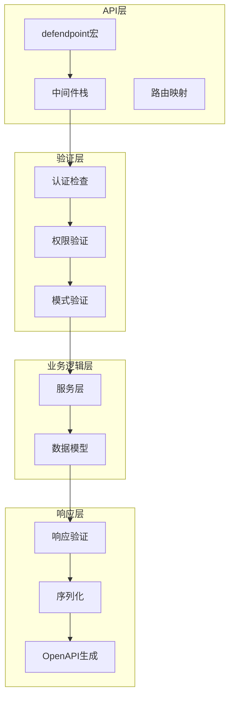
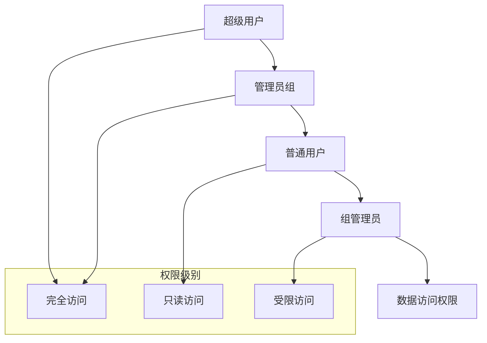
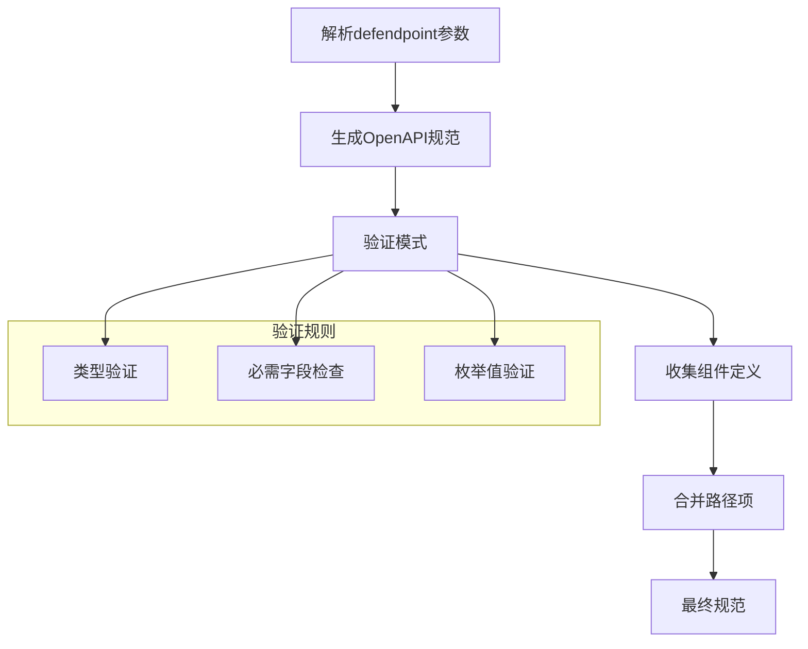
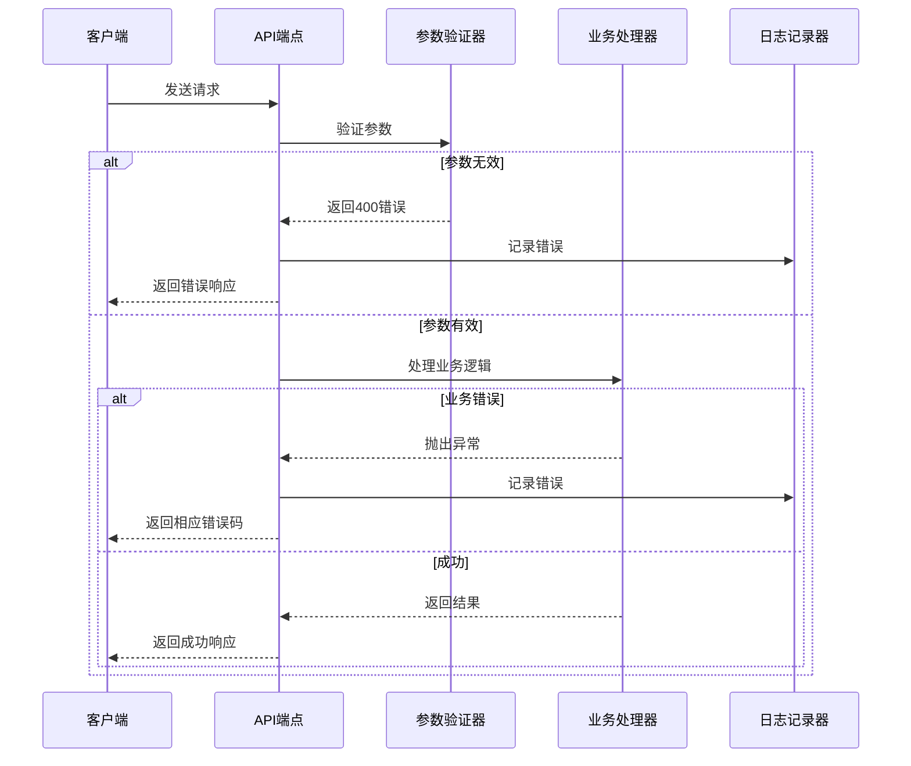

# API端点参考

<cite>
**本文档中引用的文件**
- [open_api.clj](file://src/metabase/api/open_api.clj)
- [macros.clj](file://src/metabase/api/macros.clj)
- [response.clj](file://src/metabase/api/response.clj)
- [common.clj](file://src/metabase/api/common.clj)
- [actions_rest/api.clj](file://src/metabase/actions_rest/api.clj)
- [collections_rest/api.clj](file://src/metabase/collections_rest/api.clj)
- [dashboards_rest/api.clj](file://src/metabase/dashboards_rest/api.clj)
- [users_rest/api.clj](file://src/metabase/users_rest/api.clj)
- [settings_rest/api.clj](file://src/metabase/settings_rest/api.clj)
- [permissions_rest/api.clj](file://src/metabase/permissions_rest/api.clj)
- [docs.clj](file://src/metabase/api/docs.clj)
- [handlers.clj](file://src/metabase/api/util/handlers.clj)
- [routes.clj](file://src/metabase/api_routes/routes.clj)
</cite>

## 目录
1. [简介](#简介)
2. [API架构概览](#api架构概览)
3. [defendpoint宏系统](#defendpoint宏系统)
4. [认证与授权机制](#认证与授权机制)
5. [核心API组](#核心api组)
6. [OpenAPI规范生成](#openapi规范生成)
7. [错误处理与响应格式](#错误处理与响应格式)
8. [API开发指南](#api开发指南)
9. [故障排除](#故障排除)
10. [总结](#总结)

## 简介

Metabase采用了一套统一的RESTful API架构，通过自定义的`defendpoint`宏系统来定义所有API端点。该系统提供了强大的类型验证、自动文档生成和标准化的错误处理机制。

本文档涵盖了项目中所有通过`api/`目录暴露的RESTful接口，包括：
- 动作管理（Actions）
- 集合管理（Collections）
- 仪表板管理（Dashboards）
- 用户管理（Users）
- 设置管理（Settings）
- 权限管理（Permissions）

## API架构概览

Metabase的API架构基于以下核心组件：



**图表来源**
- [macros.clj](file://src/metabase/api/macros.clj#L1-L50)
- [common.clj](file://src/metabase/api/common.clj#L1-L100)

**章节来源**
- [macros.clj](file://src/metabase/api/macros.clj#L1-L100)
- [common.clj](file://src/metabase/api/common.clj#L1-L200)

## defendpoint宏系统

### 宏定义语法

`defendpoint`是Metabase的核心API定义宏，提供了声明式的API端点定义方式：

```clojure
(api.macros/defendpoint :method "/route"
  "文档字符串描述"
  [route-params query-params body-params]
  {:response-schema schema}
  (实现逻辑))
```

### 核心特性

1. **自动参数解码**：基于Malli模式的参数验证和转换
2. **响应验证**：自动验证返回值是否符合指定模式
3. **OpenAPI生成**：自动生成API文档规范
4. **中间件支持**：可配置的请求处理管道
5. **错误处理**：统一的异常处理和HTTP状态码映射

### 参数类型系统

| 参数类型 | 描述 | 示例 |
|---------|------|------|
| `:route` | 路由参数（URL中的变量） | `{:keys [id]} :- [:map [:id ms/PositiveInt]]` |
| `:query` | 查询参数 | `{:keys [limit offset]} :- [:map [:limit [:maybe ms/PositiveInt]]]` |
| `:body` | 请求体参数 | `{:keys [name description]} :- [:map [:name ms/NonBlankString]]` |
| `:request` | 原始请求对象 | `request` |
| `:respond` | 异步响应函数 | `respond` |
| `:raise` | 异步错误处理函数 | `raise` |

**章节来源**
- [macros.clj](file://src/metabase/api/macros.clj#L200-L400)
- [open_api.clj](file://src/metabase/api/macros/defendpoint.open-api.clj#L1-L100)

## 认证与授权机制

### 认证方式

Metabase支持多种认证方式：

1. **会话认证**：基于Cookie的用户会话
2. **JWT认证**：用于嵌入式场景的JSON Web Token
3. **API密钥**：静态API密钥认证
4. **SSO认证**：单点登录集成（Google、LDAP等）

### 权限层次



### 中间件栈

API请求经过以下中间件处理：

1. **认证中间件**：验证请求身份
2. **权限中间件**：检查操作权限
3. **日志中间件**：记录请求详情
4. **错误处理中间件**：统一异常处理

**章节来源**
- [common.clj](file://src/metabase/api/common.clj#L100-L300)
- [routes.clj](file://src/metabase/api_routes/routes.clj#L100-L200)

## 核心API组

### Actions API（动作管理）

Actions API提供查询动作的创建、管理和执行功能。

#### 端点列表

| 方法 | 路径 | 描述 | 认证要求 |
|------|------|------|----------|
| `GET` | `/api/action/` | 获取可用的动作列表 | 已认证 |
| `GET` | `/api/action/:action-id` | 获取特定动作详情 | 已认证 |
| `POST` | `/api/action/` | 创建新动作 | 写入权限 |
| `PUT` | `/api/action/:id` | 更新动作 | 写入权限 |
| `DELETE` | `/api/action/:action-id` | 删除动作 | 写入权限 |
| `GET` | `/api/action/:action-id/execute` | 执行动作 | 已认证 |
| `POST` | `/api/action/:id/execute` | 执行动作 | 已认证 |

#### 关键特性

- 支持查询动作和隐式动作
- 公共链接生成功能
- 参数验证和类型转换
- 执行历史记录

**章节来源**
- [actions_rest/api.clj](file://src/metabase/actions_rest/api.clj#L1-L180)

### Collections API（集合管理）

Collections API管理仪表板、卡片和其他内容的组织结构。

#### 端点列表

| 方法 | 路径 | 描述 | 认证要求 |
|------|------|------|----------|
| `GET` | `/api/collection/` | 获取集合列表 | 已认证 |
| `GET` | `/api/collection/tree` | 获取集合树形结构 | 已认证 |
| `GET` | `/api/collection/:id` | 获取特定集合 | 已认证 |
| `POST` | `/api/collection/` | 创建新集合 | 写入权限 |
| `PUT` | `/api/collection/:id` | 更新集合 | 写入权限 |
| `DELETE` | `/api/collection/:id` | 删除集合 | 写入权限 |

#### 高级功能

- 层次化集合结构
- 个人集合支持
- 权限继承机制
- 拖拽排序功能

**章节来源**
- [collections_rest/api.clj](file://src/metabase/collections_rest/api.clj#L1-L800)

### Dashboards API（仪表板管理）

Dashboards API提供仪表板的完整生命周期管理。

#### 端点列表

| 方法 | 路径 | 描述 | 认证要求 |
|------|------|------|----------|
| `GET` | `/api/dashboard/` | 获取仪表板列表 | 已认证 |
| `POST` | `/api/dashboard/` | 创建新仪表板 | 写入权限 |
| `GET` | `/api/dashboard/:id` | 获取仪表板详情 | 已认证 |
| `PUT` | `/api/dashboard/:id` | 更新仪表板 | 写入权限 |
| `DELETE` | `/api/dashboard/:id` | 删除仪表板 | 写入权限 |
| `POST` | `/api/dashboard/:from-dashboard-id/copy` | 复制仪表板 | 写入权限 |

#### 核心功能

- 仪表板卡片管理
- 参数映射支持
- 嵌入式分享
- 公共访问控制

**章节来源**
- [dashboards_rest/api.clj](file://src/metabase/dashboards_rest/api.clj#L1-L800)

### Users API（用户管理）

Users API管理用户账户和权限设置。

#### 端点列表

| 方法 | 路径 | 描述 | 认证要求 |
|------|------|------|----------|
| `GET` | `/api/user/` | 获取用户列表 | 管理员 |
| `GET` | `/api/user/current` | 获取当前用户信息 | 已认证 |
| `GET` | `/api/user/:id` | 获取特定用户 | 同用户或管理员 |
| `POST` | `/api/user/` | 创建新用户 | 管理员 |
| `PUT` | `/api/user/:id` | 更新用户信息 | 同用户或管理员 |
| `DELETE` | `/api/user/:id` | 删除用户 | 管理员 |
| `PUT` | `/api/user/:id/password` | 修改密码 | 同用户或管理员 |

#### 用户可见性控制

- `:all`：显示所有用户
- `:group`：仅显示同组用户
- `:none`：仅显示自己

**章节来源**
- [users_rest/api.clj](file://src/metabase/users_rest/api.clj#L1-L591)

### Settings API（设置管理）

Settings API提供系统配置和用户设置的管理接口。

#### 端点列表

| 方法 | 路径 | 描述 | 认证要求 |
|------|------|------|----------|
| `GET` | `/api/setting/` | 获取所有设置 | 超级用户 |
| `GET` | `/api/setting/:key` | 获取特定设置 | 超级用户 |
| `PUT` | `/api/setting/` | 批量更新设置 | 超级用户 |
| `PUT` | `/api/setting/:key` | 更新设置 | 超级用户 |

#### 设置分类

- 系统级设置
- 用户级设置
- 功能开关
- 配置参数

**章节来源**
- [settings_rest/api.clj](file://src/metabase/settings_rest/api.clj#L1-L62)

### Permissions API（权限管理）

Permissions API管理数据权限和访问控制。

#### 端点列表

| 方法 | 路径 | 描述 | 认证要求 |
|------|------|------|----------|
| `GET` | `/api/permissions/graph` | 获取权限图 | 超级用户 |
| `GET` | `/api/permissions/graph/db/:db-id` | 获取数据库权限 | 超级用户 |
| `GET` | `/api/permissions/graph/group/:group-id` | 获取组权限 | 超级用户 |
| `PUT` | `/api/permissions/graph` | 更新权限图 | 超级用户 |

#### 权限类型

- 数据库访问权限
- 表级权限
- 字段级权限
- 查询限制

**章节来源**
- [permissions_rest/api.clj](file://src/metabase/permissions_rest/api.clj#L1-L300)

## OpenAPI规范生成

### 规范生成流程

Metabase使用自动化工具生成完整的OpenAPI 3.1.0规范：



**图表来源**
- [open_api.clj](file://src/metabase/api/macros/defendpoint.open-api.clj#L180-L231)

### 模式转换

系统自动将Malli模式转换为OpenAPI模式：

| Malli模式 | OpenAPI模式 | 描述 |
|-----------|-------------|------|
| `:string` | `string` | 文本字符串 |
| `:int` | `integer` | 整数类型 |
| `:boolean` | `boolean` | 布尔值 |
| `:map` | `object` | 对象结构 |
| `:sequential` | `array` | 数组类型 |
| `[:maybe schema]` | 可选属性 | 可选字段 |

### 文档生成

OpenAPI规范包含以下信息：

1. **路径定义**：所有API端点的详细描述
2. **参数规范**：请求参数的类型和约束
3. **响应模式**：成功和错误响应的结构
4. **安全定义**：认证方式和权限要求
5. **组件定义**：重用的数据类型定义

**章节来源**
- [open_api.clj](file://src/metabase/api/open_api.clj#L1-L334)
- [docs.clj](file://src/metabase/api/docs.clj#L1-L72)

## 错误处理与响应格式

### 标准响应格式

所有API响应都遵循统一的格式：

```clojure
{:status 200
 :body {:data response-data
        :metadata {:total 100
                   :limit 20
                   :offset 0}}}
```

### HTTP状态码映射

| 状态码 | 场景 | 错误类型 |
|--------|------|----------|
| `200` | 成功请求 | 无错误 |
| `204` | 无内容操作 | 删除成功 |
| `400` | 请求错误 | 参数验证失败 |
| `401` | 未认证 | 会话过期或无效 |
| `403` | 权限不足 | 无访问权限 |
| `404` | 资源不存在 | 对象未找到 |
| `409` | 冲突 | 并发修改冲突 |
| `500` | 服务器错误 | 内部处理错误 |

### 错误响应结构

```clojure
{:status 400
 :body {:message "Invalid request"
        :errors {:field-name "错误描述"
                 :another-field "另一个错误"}}
 :headers {"Content-Type" "application/json"}}
```

### 异常处理机制



**图表来源**
- [common.clj](file://src/metabase/api/common.clj#L200-L400)
- [response.clj](file://src/metabase/api/response.clj#L1-L10)

**章节来源**
- [common.clj](file://src/metabase/api/common.clj#L300-L586)
- [response.clj](file://src/metabase/api/response.clj#L1-L10)

## API开发指南

### 创建新的API端点

1. **选择命名空间**：在适当的模块下创建API文件
2. **导入宏**：使用`api.macros/defendpoint`
3. **定义端点**：按照标准格式编写
4. **添加文档**：提供详细的文档字符串
5. **测试验证**：确保模式正确性和功能正常

### 最佳实践

1. **参数验证**：始终使用Malli模式进行参数验证
2. **错误处理**：使用`check-400`、`check-403`等辅助函数
3. **权限检查**：在适当位置调用`read-check`、`write-check`
4. **响应格式**：保持一致的响应结构
5. **文档维护**：及时更新API文档

### 调试技巧

1. **使用REPL**：通过`find-route-fn`查找端点函数
2. **参数解码**：测试参数转换是否正确
3. **响应验证**：验证返回值是否符合模式
4. **日志查看**：检查中间件日志输出

**章节来源**
- [macros.clj](file://src/metabase/api/macros.clj#L700-L889)
- [common.clj](file://src/metabase/api/common.clj#L400-L586)

## 故障排除

### 常见问题

1. **参数验证失败**
   - 检查Malli模式定义
   - 验证请求数据格式
   - 查看具体错误信息

2. **权限拒绝**
   - 确认用户权限级别
   - 检查对象所有权
   - 验证组成员关系

3. **OpenAPI生成错误**
   - 验证模式复杂度
   - 检查循环引用
   - 确认模式有效性

4. **性能问题**
   - 优化数据库查询
   - 添加适当的索引
   - 实现分页机制

### 调试工具

1. **端点查找**：使用`find-route`定位特定端点
2. **模式验证**：通过`mc/validate`测试模式
3. **响应测试**：使用`call-core-fn`直接调用核心函数
4. **文档生成**：访问`/api/docs/`查看生成的文档

**章节来源**
- [macros.clj](file://src/metabase/api/macros.clj#L840-L889)

## 总结

Metabase的API系统提供了一个强大、灵活且可扩展的RESTful接口框架。通过`defendpoint`宏系统，开发者可以快速构建类型安全、文档完善的API端点。系统的自动化特性包括：

- **统一的开发体验**：一致的编码风格和最佳实践
- **强大的验证机制**：运行时参数验证和响应验证
- **完整的文档生成**：自动生成OpenAPI规范
- **灵活的权限控制**：细粒度的访问控制机制
- **健壮的错误处理**：标准化的错误响应格式

这个架构不仅提高了开发效率，还确保了API的一致性和可靠性，为Metabase的生态系统奠定了坚实的基础。