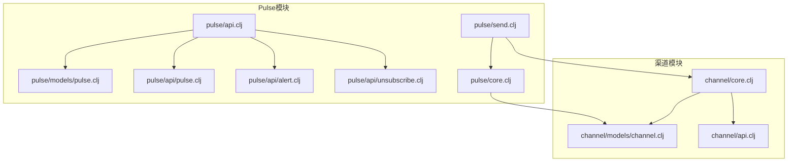
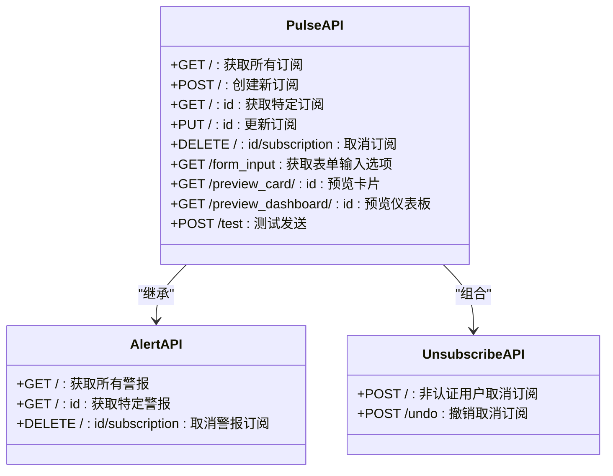
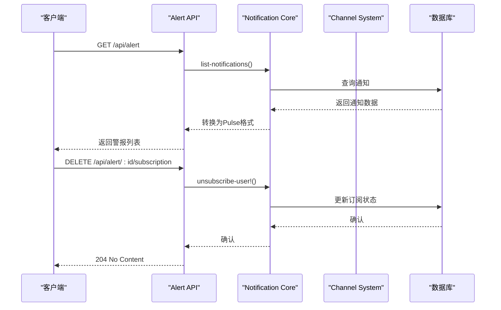
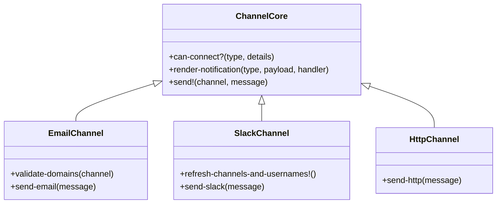
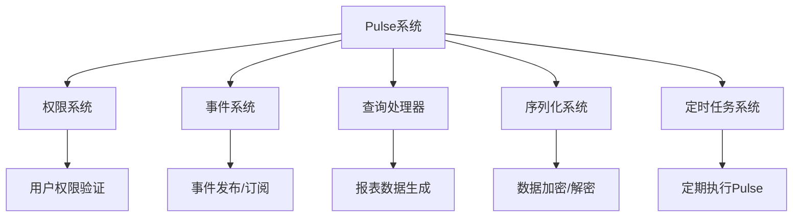

# Pulse报表API

<cite>
**本文档引用的文件**  
- [pulse/api.clj](file://src/metabase/pulse/api.clj)
- [pulse/models/pulse.clj](file://src/metabase/pulse/models/pulse.clj)
- [pulse/api/pulse.clj](file://src/metabase/pulse/api/pulse.clj)
- [pulse/api/alert.clj](file://src/metabase/pulse/api/alert.clj)
- [pulse/api/unsubscribe.clj](file://src/metabase/pulse/api/unsubscribe.clj)
- [pulse/send.clj](file://src/metabase/pulse/send.clj)
- [channel/core.clj](file://src/metabase/channel/core.clj)
- [channel/api.clj](file://src/metabase/channel/api.clj)
- [channel/models/channel.clj](file://src/metabase/channel/models/channel.clj)
- [pulse/core.clj](file://src/metabase/pulse/core.clj)
</cite>

## 目录
1. [简介](#简介)
2. [项目结构](#项目结构)
3. [核心组件](#核心组件)
4. [架构概述](#架构概述)
5. [详细组件分析](#详细组件分析)
6. [依赖分析](#依赖分析)
7. [性能考虑](#性能考虑)
8. [故障排除指南](#故障排除指南)
9. [结论](#结论)

## 简介
本文档全面介绍了Metabase中的Pulse自动化报表API，涵盖了警报和订阅的创建、调度、通知渠道配置和管理操作。文档详细说明了`pulse/api.clj`中定义的所有端点，并解释了与`channel/core.clj`的集成以及邮件/Slack通知的处理流程。此外，还提供了复杂调度配置的示例。

## 项目结构
Metabase的Pulse功能主要位于`src/metabase/pulse`目录下，包含API定义、模型、核心逻辑和任务调度等组件。通知渠道相关的功能则位于`src/metabase/channel`目录下。



**图表来源**  
- [pulse/api.clj](file://src/metabase/pulse/api.clj#L1-L27)
- [pulse/models/pulse.clj](file://src/metabase/pulse/models/pulse.clj#L1-L616)
- [channel/core.clj](file://src/metabase/channel/core.clj#L1-L42)

**章节来源**  
- [pulse/api.clj](file://src/metabase/pulse/api.clj#L1-L27)
- [channel/core.clj](file://src/metabase/channel/core.clj#L1-L42)

## 核心组件
Pulse系统的核心组件包括Pulse模型、API端点、通知渠道和发送机制。Pulse模型定义了警报和订阅的数据结构，API端点提供了创建、更新和管理这些实体的接口，通知渠道处理不同类型的发送目标（如邮件和Slack），而发送机制负责实际的报表生成和分发。

**章节来源**  
- [pulse/models/pulse.clj](file://src/metabase/pulse/models/pulse.clj#L1-L616)
- [pulse/send.clj](file://src/metabase/pulse/send.clj#L1-L130)

## 架构概述
Pulse系统的架构分为三层：API层、业务逻辑层和数据访问层。API层暴露REST端点，业务逻辑层处理核心功能如警报条件评估和报表生成，数据访问层通过Toucan2 ORM与数据库交互。

```mermaid
graph TD
A[客户端] --> B[/api/pulse]
A --> C[/api/alert]
B --> D[Pulse API]
C --> E[Alert API]
D --> F[Pulse核心逻辑]
E --> F
F --> G[Pulse模型]
F --> H[渠道系统]
G --> I[数据库]
H --> I
```

**图表来源**  
- [pulse/api.clj](file://src/metabase/pulse/api.clj#L1-L27)
- [pulse/core.clj](file://src/metabase/pulse/core.clj#L1-L21)

## 详细组件分析

### Pulse API分析
Pulse API提供了创建、读取、更新和删除Pulse（订阅）的功能。它还包含预览和测试端点，允许用户在保存前查看报表外观。

#### Pulse API类图


**图表来源**  
- [pulse/api/pulse.clj](file://src/metabase/pulse/api/pulse.clj#L1-L404)
- [pulse/api/alert.clj](file://src/metabase/pulse/api/alert.clj#L1-L111)
- [pulse/api/unsubscribe.clj](file://src/metabase/pulse/api/unsubscribe.clj#L1-L69)

### 警报系统分析
警报系统允许用户基于查询结果创建条件触发的通知。当查询返回结果或达到特定目标时，系统会发送通知。

#### 警报处理序列图


**图表来源**  
- [pulse/api/alert.clj](file://src/metabase/pulse/api/alert.clj#L1-L111)
- [notification/api.clj](file://src/metabase/notification/api.clj#L1-L50)

### 通知渠道分析
通知渠道系统提供了灵活的机制来配置和管理不同的通知目标，包括邮件、Slack和HTTP端点。

#### 渠道系统类图


**图表来源**  
- [channel/core.clj](file://src/metabase/channel/core.clj#L1-L42)
- [channel/models/channel.clj](file://src/metabase/channel/models/channel.clj#L1-L129)

## 依赖分析
Pulse系统依赖于多个核心组件，包括权限系统、事件系统和查询处理器。这些依赖关系确保了系统的安全性和功能性。



**图表来源**  
- [pulse/models/pulse.clj](file://src/metabase/pulse/models/pulse.clj#L1-L616)
- [pulse/send.clj](file://src/metabase/pulse/send.clj#L1-L130)

**章节来源**  
- [pulse/models/pulse.clj](file://src/metabase/pulse/models/pulse.clj#L1-L616)
- [pulse/send.clj](file://src/metabase/pulse/send.clj#L1-L130)

## 性能考虑
Pulse系统的性能主要受以下几个因素影响：报表生成时间、数据库查询效率、网络延迟和并发处理能力。建议定期监控这些指标并进行优化。

## 故障排除指南
当遇到Pulse相关问题时，可以按照以下步骤进行排查：
1. 检查API端点是否正常工作
2. 验证数据库连接和查询性能
3. 检查通知渠道配置是否正确
4. 查看日志文件中的错误信息
5. 确认用户权限设置

**章节来源**  
- [pulse/send.clj](file://src/metabase/pulse/send.clj#L1-L130)
- [channel/core.clj](file://src/metabase/channel/core.clj#L1-L42)

## 结论
Pulse自动化报表API为Metabase用户提供了一套强大的工具来创建和管理定期报表和警报。通过灵活的渠道配置和复杂的调度选项，用户可以根据需要定制通知系统。尽管部分API已被标记为过时，但它们仍在系统中发挥重要作用，并计划在未来迁移到新的通知API。