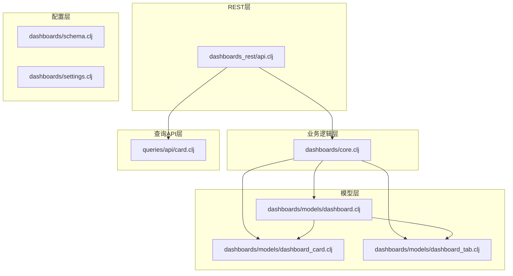
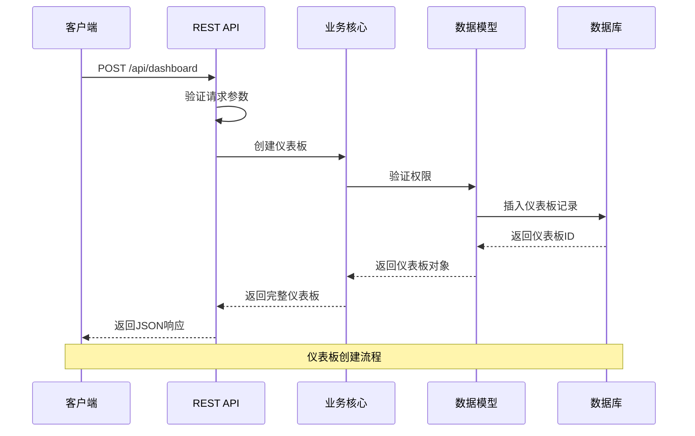
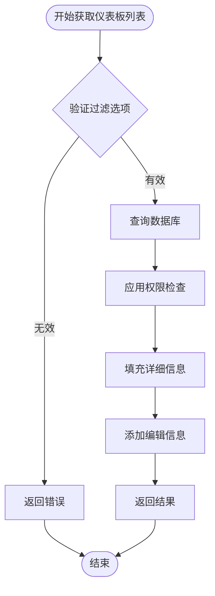
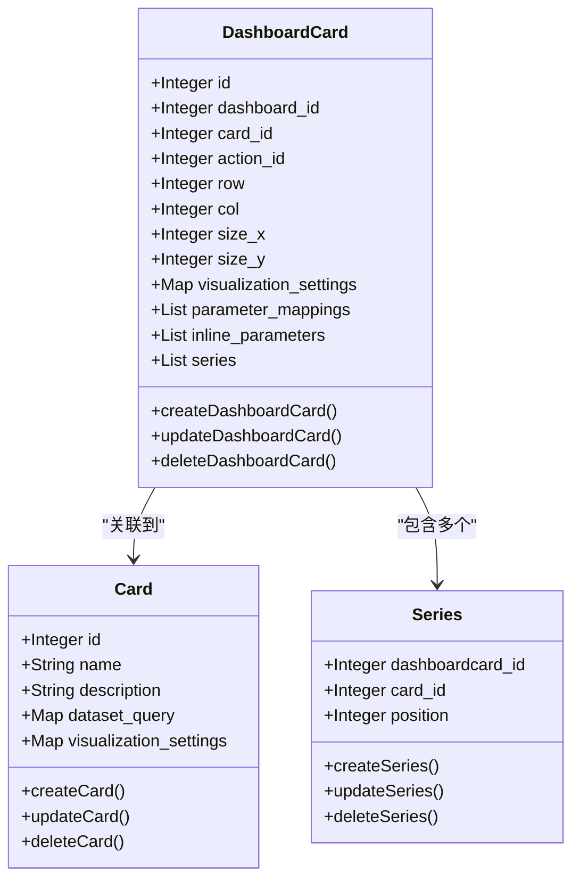
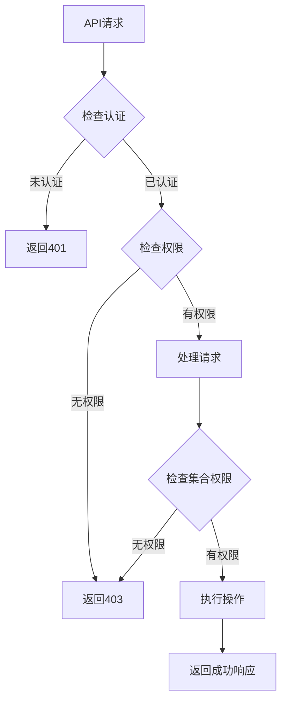
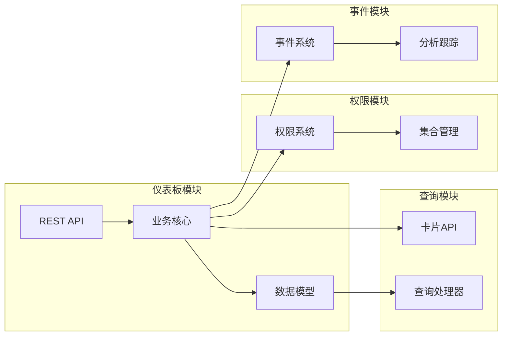

# 仪表板API

<cite>
**本文档中引用的文件**
- [dashboards_rest/api.clj](file://src/metabase/dashboards_rest/api.clj)
- [dashboards/core.clj](file://src/metabase/dashboards/core.clj)
- [queries/api/card.clj](file://src/metabase/queries/api/card.clj)
- [dashboards/models/dashboard.clj](file://src/metabase/dashboards/models/dashboard.clj)
- [dashboards/models/dashboard_card.clj](file://src/metabase/dashboards/models/dashboard_card.clj)
- [dashboards/models/dashboard_tab.clj](file://src/metabase/dashboards/models/dashboard_tab.clj)
- [dashboards/schema.clj](file://src/metabase/dashboards/schema.clj)
- [dashboards/settings.clj](file://src/metabase/dashboards/settings.clj)
</cite>

## 目录
1. [简介](#简介)
2. [项目结构](#项目结构)
3. [核心组件](#核心组件)
4. [架构概览](#架构概览)
5. [详细组件分析](#详细组件分析)
6. [依赖关系分析](#依赖关系分析)
7. [性能考虑](#性能考虑)
8. [故障排除指南](#故障排除指南)
9. [结论](#结论)

## 简介

仪表板API是Metabase系统中负责管理仪表板及其相关组件的核心模块。该API提供了完整的CRUD操作功能，支持仪表板的创建、更新、删除以及卡片和标签页的管理。通过RESTful接口，用户可以灵活地构建和定制数据可视化仪表板。

仪表板API的设计遵循现代Web服务的最佳实践，采用分层架构模式，确保了良好的可扩展性和维护性。系统支持复杂的参数映射、可视化设置配置以及权限控制机制。

## 项目结构

仪表板API的项目结构清晰地分离了不同层次的功能：

**图表来源**
- [dashboards_rest/api.clj](file://src/metabase/dashboards_rest/api.clj#L1-L50)
- [dashboards/core.clj](file://src/metabase/dashboards/core.clj#L1-L50)

**章节来源**
- [dashboards_rest/api.clj](file://src/metabase/dashboards_rest/api.clj#L1-L100)
- [dashboards/models/dashboard.clj](file://src/metabase/dashboards/models/dashboard.clj#L1-L50)

## 核心组件

仪表板API包含以下核心组件：

### 1. REST API控制器
负责处理HTTP请求，验证输入参数，并调用相应的业务逻辑。

### 2. 仪表板模型
管理仪表板的基本属性和行为，包括参数配置、缓存设置等。

### 3. 仪表板卡片模型
处理仪表板中卡片的创建、更新、删除以及系列卡片管理。

### 4. 仪表板标签页模型
管理仪表板内的标签页结构和布局。

### 5. 参数映射系统
提供强大的参数化查询功能，支持动态过滤和条件查询。

**章节来源**
- [dashboards_rest/api.clj](file://src/metabase/dashboards_rest/api.clj#L50-L150)
- [dashboards/models/dashboard.clj](file://src/metabase/dashboards/models/dashboard.clj#L50-L150)

## 架构概览

仪表板API采用分层架构设计，确保了关注点分离和模块化：

**图表来源**
- [dashboards_rest/api.clj](file://src/metabase/dashboards_rest/api.clj#L150-L200)
- [dashboards/core.clj](file://src/metabase/dashboards/core.clj#L100-L200)

## 详细组件分析

### REST API端点分析

仪表板API提供了丰富的REST端点，支持完整的CRUD操作：

#### 获取仪表板列表

**图表来源**
- [dashboards_rest/api.clj](file://src/metabase/dashboards_rest/api.clj#L50-L100)

#### 创建仪表板
仪表板创建过程涉及多个步骤，包括权限验证、参数处理和事务管理。

#### 更新仪表板
支持部分更新，只修改指定的字段，同时处理参数映射和订阅修复。

#### 删除仪表板
提供硬删除和软删除两种方式，确保数据完整性。

**章节来源**
- [dashboards_rest/api.clj](file://src/metabase/dashboards_rest/api.clj#L150-L300)

### 仪表板卡片管理

仪表板卡片是仪表板的核心组成部分，支持复杂的布局和交互：

**图表来源**
- [dashboards/models/dashboard_card.clj](file://src/metabase/dashboards/models/dashboard_card.clj#L1-L100)
- [queries/api/card.clj](file://src/metabase/queries/api/card.clj#L1-L100)

### 参数映射系统

参数映射系统提供了强大的动态查询功能：

| 参数类型 | 描述 | 示例 |
|---------|------|------|
| 字段参数 | 基于数据库字段的参数 | `[:field 123 nil]` |
| 虚拟参数 | 计算生成的参数 | `[:calculation "SUM(amount)"]` |
| 时间参数 | 时间范围参数 | `[:datetime "2024-01-01" "2024-12-31"]` |
| 自定义参数 | 用户定义的参数 | `[:text "custom_value"]` |

**章节来源**
- [dashboards_rest/api.clj](file://src/metabase/dashboards_rest/api.clj#L400-L500)

### 权限控制系统

仪表板API实现了细粒度的权限控制：

**图表来源**
- [dashboards_rest/api.clj](file://src/metabase/dashboards_rest/api.clj#L600-L700)

**章节来源**
- [dashboards_rest/api.clj](file://src/metabase/dashboards_rest/api.clj#L500-L650)

## 依赖关系分析

仪表板API与其他模块存在密切的依赖关系：

**图表来源**
- [dashboards_rest/api.clj](file://src/metabase/dashboards_rest/api.clj#L1-L50)
- [dashboards/core.clj](file://src/metabase/dashboards/core.clj#L1-L50)

**章节来源**
- [dashboards_rest/api.clj](file://src/metabase/dashboards_rest/api.clj#L1-L100)
- [dashboards/models/dashboard.clj](file://src/metabase/dashboards/models/dashboard.clj#L1-L100)

## 性能考虑

仪表板API在设计时充分考虑了性能优化：

### 缓存策略
- 使用内存缓存减少数据库查询
- 实现基于dashboard_load_id的缓存机制
- 支持查询平均执行时间的批量计算

### 批量操作
- 支持批量创建、更新和删除操作
- 减少网络往返次数
- 提高大仪表板的处理效率

### 连接池管理
- 使用连接池优化数据库访问
- 实现事务边界管理
- 防止连接泄漏

## 故障排除指南

### 常见问题及解决方案

#### 1. 权限错误
**问题**: 用户无法访问或修改仪表板
**解决方案**: 检查用户权限设置和集合访问权限

#### 2. 参数映射失败
**问题**: 参数映射不生效或导致查询错误
**解决方案**: 验证参数目标字段的存在性和权限

#### 3. 性能问题
**问题**: 大型仪表板加载缓慢
**解决方案**: 启用缓存、优化查询、使用分页

#### 4. 订阅中断
**问题**: 参数变更导致订阅失效
**解决方案**: 系统自动检测并修复断开的订阅

**章节来源**
- [dashboards_rest/api.clj](file://src/metabase/dashboards_rest/api.clj#L800-L900)

## 结论

仪表板API是一个功能完整、设计精良的数据可视化管理接口。它不仅提供了基本的CRUD操作，还支持复杂的参数化查询、权限控制和性能优化。通过合理的架构设计和模块化实现，该API为Metabase系统提供了强大而灵活的仪表板管理能力。

未来的发展方向包括：
- 更加智能的缓存策略
- 增强的实时协作功能
- 更丰富的可视化选项
- 改进的移动端体验