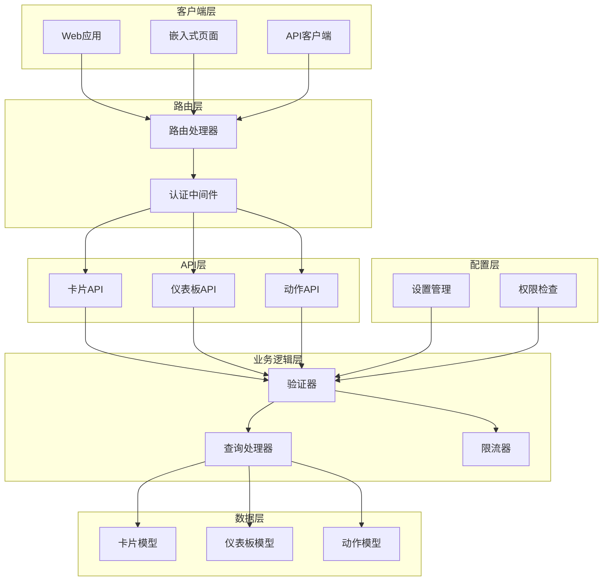
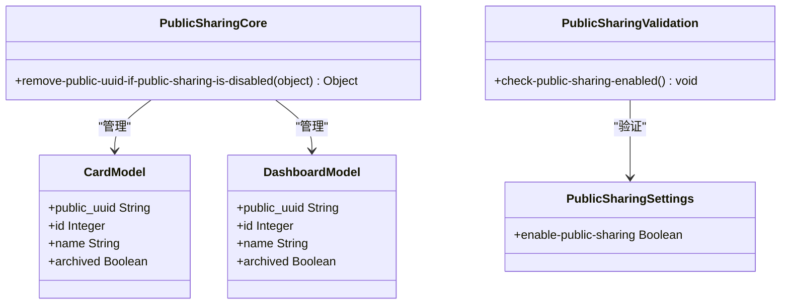
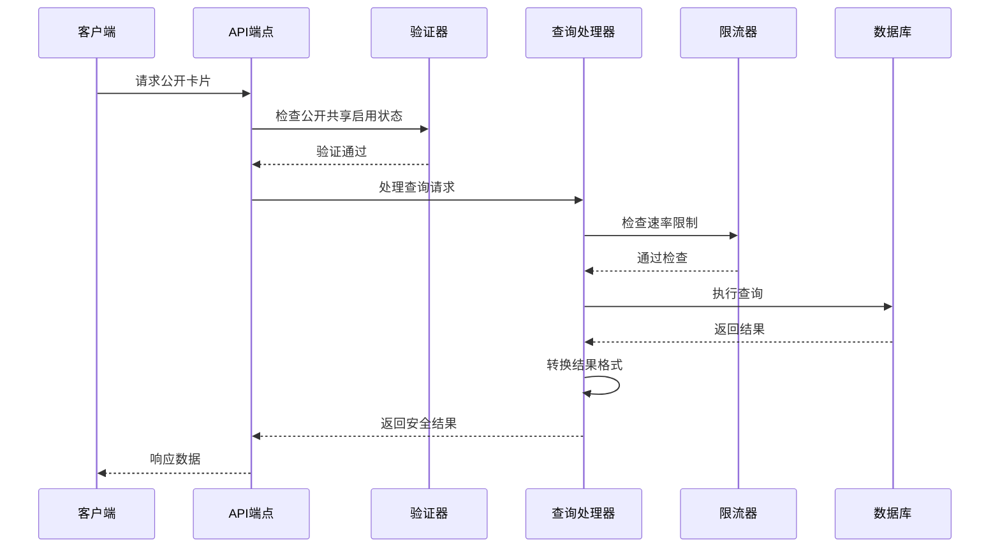
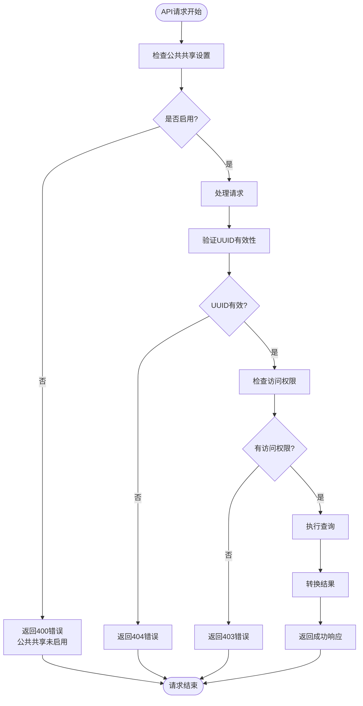
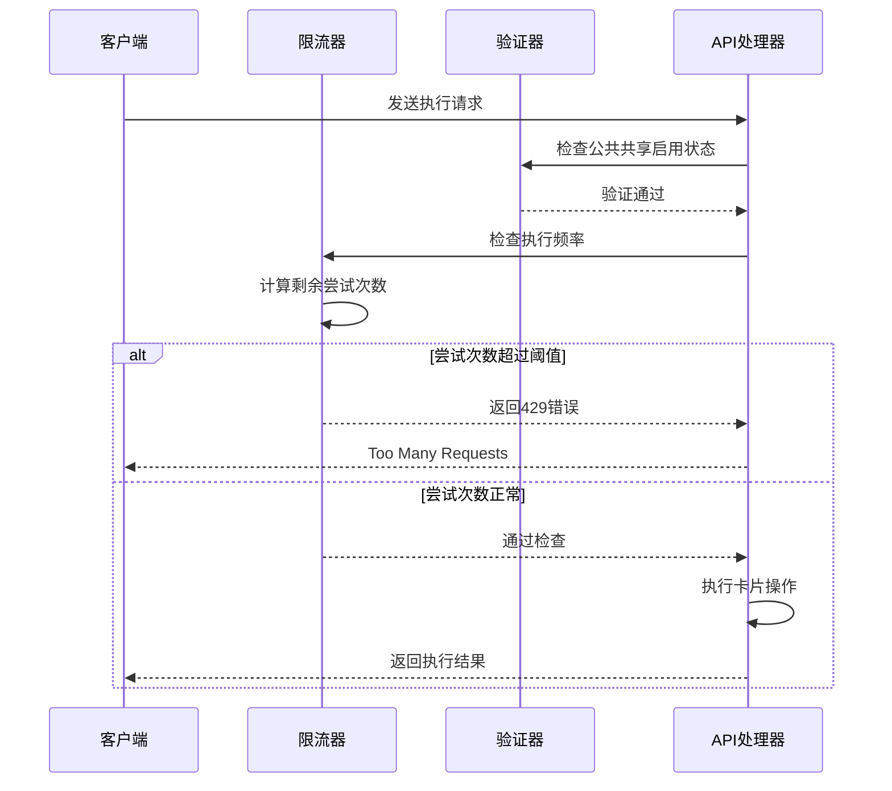

# 公开共享API

<cite>
**本文档中引用的文件**
- [public_sharing_rest/api.clj](file://src/metabase/public_sharing_rest/api.clj)
- [public_sharing/core.clj](file://src/metabase/public_sharing/core.clj)
- [public_sharing/validation.clj](file://src/metabase/public_sharing/validation.clj)
- [public_sharing/settings.clj](file://src/metabase/public_sharing/settings.clj)
- [api_routes/routes.clj](file://src/metabase/api_routes/routes.clj)
- [query_processor/middleware/permissions.clj](file://src/metabase/query_processor/middleware/permissions.clj)
</cite>

## 目录
1. [简介](#简介)
2. [系统架构](#系统架构)
3. [核心组件](#核心组件)
4. [API端点详解](#api端点详解)
5. [安全验证机制](#安全验证机制)
6. [访问限制与限流](#访问限制与限流)
7. [配置管理](#配置管理)
8. [使用示例](#使用示例)
9. [故障排除](#故障排除)
10. [最佳实践](#最佳实践)

## 简介

Metabase的公开共享API提供了创建和管理可公开访问的卡片（Card）和仪表板（Dashboard）的功能。通过这个API，管理员可以为问题和仪表板生成公开链接，并嵌入到外部网站中。该系统包含完整的安全验证机制、访问控制和性能优化功能。

## 系统架构

公开共享API采用分层架构设计，确保安全性、可扩展性和易维护性：



**图表来源**
- [public_sharing_rest/api.clj](file://src/metabase/public_sharing_rest/api.clj#L1-L50)
- [api_routes/routes.clj](file://src/metabase/api_routes/routes.clj#L148-L168)

## 核心组件

### 1. 公共UUID管理

每个可公开访问的对象都具有唯一的`public_uuid`标识符，用于在不暴露内部ID的情况下进行访问控制。



**图表来源**
- [public_sharing/core.clj](file://src/metabase/public_sharing/core.clj#L1-L13)
- [public_sharing/validation.clj](file://src/metabase/public_sharing/validation.clj#L1-L12)

### 2. 查询处理管道

公开共享API使用专门的查询处理管道来确保安全性和性能：



**图表来源**
- [public_sharing_rest/api.clj](file://src/metabase/public_sharing_rest/api.clj#L169-L200)
- [query_processor/middleware/permissions.clj](file://src/metabase/query_processor/middleware/permissions.clj#L160-L184)

**节来源**
- [public_sharing_rest/api.clj](file://src/metabase/public_sharing_rest/api.clj#L1-L637)
- [public_sharing/core.clj](file://src/metabase/public_sharing/core.clj#L1-L13)
- [public_sharing/validation.clj](file://src/metabase/public_sharing/validation.clj#L1-L12)

## API端点详解

### 卡片相关端点

#### 获取公开卡片信息

**端点**: `GET /api/public/card/:uuid`

**描述**: 获取指定UUID的公开卡片信息，无需身份验证。

**参数**:
- `uuid` (路径参数): 卡片的公开UUID

**响应**:
- 成功: 包含卡片基本信息的JSON对象
- 错误: 404 Not Found（卡片不存在或未公开）

#### 获取卡片查询结果

**端点**: `GET /api/public/card/:uuid/query`

**描述**: 获取卡片的查询结果，支持参数传递。

**参数**:
- `uuid` (路径参数): 卡片的公开UUID
- `parameters` (查询参数): 卡片参数的JSON字符串

#### 导出卡片数据

**端点**: `GET /api/public/card/:uuid/query/:export-format`

**描述**: 以指定格式导出卡片数据。

**参数**:
- `uuid` (路径参数): 卡片的公开UUID
- `export-format` (路径参数): 导出格式（csv, json, xlsx）
- `parameters` (查询参数): 查询参数
- `format_rows` (查询参数): 是否格式化行数据
- `pivot_results` (查询参数): 是否显示透视结果

### 仪表板相关端点

#### 获取公开仪表板

**端点**: `GET /api/public/dashboard/:uuid`

**描述**: 获取指定UUID的公开仪表板。

**参数**:
- `uuid` (路径参数): 仪表板的公开UUID

#### 获取仪表板中的卡片结果

**端点**: `GET /api/public/dashboard/:uuid/dashcard/:dashcard-id/card/:card-id`

**描述**: 获取仪表板中特定卡片的结果。

**参数**:
- `uuid` (路径参数): 仪表板的公开UUID
- `dashcard-id` (路径参数): 仪表板卡片ID
- `card-id` (路径参数): 卡片ID
- `parameters` (查询参数): 卡片参数

#### 执行仪表板动作

**端点**: `POST /api/public/dashboard/:uuid/dashcard/:dashcard-id/execute`

**描述**: 在仪表板上下文中执行关联的动作。

**参数**:
- `uuid` (路径参数): 仪表板的公开UUID
- `dashcard-id` (路径参数): 仪表板卡片ID
- `parameters` (请求体): 动作参数

### 动作相关端点

#### 获取公开动作

**端点**: `GET /api/public/action/:uuid`

**描述**: 获取指定UUID的公开动作。

**参数**:
- `uuid` (路径参数): 动作的公开UUID

#### 执行动作

**端点**: `POST /api/public/action/:uuid/execute`

**描述**: 执行指定的动作。

**参数**:
- `uuid` (路径参数): 动作的公开UUID
- `parameters` (请求体): 动作参数

### 参数值相关端点

#### 获取卡片参数值

**端点**: `GET /api/public/card/:uuid/params/:param-key/values`

**描述**: 获取卡片参数的所有可用值。

**参数**:
- `uuid` (路径参数): 卡片的公开UUID
- `param-key` (路径参数): 参数键名

#### 搜索卡片参数值

**端点**: `GET /api/public/card/:uuid/params/:param-key/search/:query`

**描述**: 搜索符合查询条件的卡片参数值。

**参数**:
- `uuid` (路径参数): 卡片的公开UUID
- `param-key` (路径参数): 参数键名
- `query` (路径参数): 搜索查询

#### 获取参数值映射

**端点**: `GET /api/public/card/:uuid/params/:param-key/remapping`

**描述**: 获取参数值的映射关系。

**参数**:
- `uuid` (路径参数): 卡片的公开UUID
- `param-key` (路径参数): 参数键名
- `value` (查询参数): 原始值

### 地图瓦片相关端点

#### 获取地图瓦片

**端点**: `GET /api/public/tiles/card/:uuid/:zoom/:x/:y`

**描述**: 获取地图可视化卡片的瓦片图像。

**参数**:
- `uuid` (路径参数): 卡片的公开UUID
- `zoom` (路径参数): 缩放级别
- `x` (路径参数): X坐标
- `y` (路径参数): Y坐标
- `parameters` (查询参数): 查询参数
- `latField` (查询参数): 纬度字段
- `lonField` (查询参数): 经度字段

#### 获取仪表板地图瓦片

**端点**: `GET /api/public/tiles/dashboard/:uuid/dashcard/:dashcard-id/card/:card-id/:zoom/:x/:y`

**描述**: 获取仪表板中地图卡片的瓦片图像。

**参数**:
- `uuid` (路径参数): 仪表板的公开UUID
- `dashcard-id` (路径参数): 仪表板卡片ID
- `card-id` (路径参数): 卡片ID
- `zoom` (路径参数): 缩放级别
- `x` (路径参数): X坐标
- `y` (路径参数): Y坐标
- `parameters` (查询参数): 查询参数
- `latField` (查询参数): 纬度字段
- `lonField` (查询参数): 经度字段

### oEmbed端点

#### 获取嵌入代码

**端点**: `GET /api/public/oembed`

**描述**: 获取oEmbed格式的嵌入代码和元数据。

**参数**:
- `url` (查询参数): 嵌入内容的URL
- `maxheight` (查询参数): 最大高度（默认800）
- `maxwidth` (查询参数): 最大宽度（默认1024）

**节来源**
- [public_sharing_rest/api.clj](file://src/metabase/public_sharing_rest/api.clj#L100-L637)

## 安全验证机制

### 公共共享启用检查

系统首先验证公共共享功能是否已启用：



**图表来源**
- [public_sharing/validation.clj](file://src/metabase/public_sharing/validation.clj#L8-L11)
- [public_sharing_rest/api.clj](file://src/metabase/public_sharing_rest/api.clj#L100-L110)

### 权限验证流程

公开共享API使用特殊的权限验证机制，绕过常规用户权限检查：

1. **管理员权限模拟**: 使用`request/as-admin`绑定模拟管理员权限
2. **参数值查询**: 对于参数值查询，设置`*param-values-query*`标志
3. **卡片过滤**: 移除敏感字段，只保留公开可见的数据
4. **模板标签处理**: 合并参数和模板标签，确保一致性

### 数据脱敏机制

系统自动移除以下敏感信息：

- 用户特定的权限信息
- 内部数据库连接详情
- 敏感的查询元数据
- 访问控制列表

**节来源**
- [public_sharing_rest/api.clj](file://src/metabase/public_sharing_rest/api.clj#L60-L85)
- [query_processor/middleware/permissions.clj](file://src/metabase/query_processor/middleware/permissions.clj#L160-L184)

## 访问限制与限流

### 仪表板卡片执行限流

系统对仪表板卡片的执行操作实施严格的限流保护：



**图表来源**
- [public_sharing_rest/api.clj](file://src/metabase/public_sharing_rest/api.clj#L520-L540)

### 动作执行限流

动作执行受到更严格的限流保护：

- **阈值**: 每1000毫秒最多10次执行
- **时间窗口**: 1000毫秒
- **延迟指数**: 1
- **尝试TTL**: 1000毫秒

### 限流配置表

| 组件 | 阈值 | 时间窗口 | 延迟指数 | TTL |
|------|------|----------|----------|-----|
| 仪表板卡片执行 | 5000次 | 10000毫秒 | 1 | 10000毫秒 |
| 动作执行 | 10次 | 1000毫秒 | 1 | 1000毫秒 |

**节来源**
- [public_sharing_rest/api.clj](file://src/metabase/public_sharing_rest/api.clj#L520-L540)
- [public_sharing_rest/api.clj](file://src/metabase/public_sharing_rest/api.clj#L580-L600)

## 配置管理

### 公共共享设置

公共共享功能通过系统设置进行管理：

```clojure
(defsetting enable-public-sharing
  "启用管理员为问题和仪表板创建公开可查看链接（及可嵌入iframe）的功能？"
  :type       :boolean
  :default    true
  :visibility :authenticated
  :audit      :getter)
```

### 设置项说明

| 设置项 | 类型 | 默认值 | 描述 |
|--------|------|--------|------|
| `enable-public-sharing` | 布尔值 | true | 控制公共共享功能的全局开关 |

### 集成配置

公共共享API通过路由系统集成到主应用程序中：

```clojure
"/public" (+public-exceptions 'metabase.public-sharing-rest.api)
```

**节来源**
- [public_sharing/settings.clj](file://src/metabase/public_sharing/settings.clj#L1-L12)
- [api_routes/routes.clj](file://src/metabase/api_routes/routes.clj#L167-L168)

## 使用示例

### 创建公开卡片链接

```bash
# 获取公开卡片信息
curl -X GET "https://your-metabase.com/api/public/card/abc123-def456-ghi789" \
  -H "Content-Type: application/json"

# 获取卡片查询结果
curl -X GET "https://your-metabase.com/api/public/card/abc123-def456-ghi789/query?parameters=%7B%7D" \
  -H "Content-Type: application/json"

# 导出CSV数据
curl -X GET "https://your-metabase.com/api/public/card/abc123-def456-ghi789/query/csv?parameters=%7B%7D" \
  -H "Content-Type: application/json" \
  --output "export.csv"
```

### 嵌入仪表板

```bash
# 获取公开仪表板
curl -X GET "https://your-metabase.com/api/public/dashboard/xyz789-uvw123-pqr456" \
  -H "Content-Type: application/json"

# 获取仪表板中的卡片结果
curl -X GET "https://your-metabase.com/api/public/dashboard/xyz789-uvw123-pqr456/dashcard/1/card/2" \
  -H "Content-Type: application/json"
```

### 执行动作

```bash
# 执行公开动作
curl -X POST "https://your-metabase.com/api/public/action/abc123-def456-ghi789/execute" \
  -H "Content-Type: application/json" \
  -d '{"parameters": {"input_field": "value"}}'
```

### 获取参数值

```bash
# 获取参数所有值
curl -X GET "https://your-metabase.com/api/public/card/abc123-def456-ghi789/params/status/values" \
  -H "Content-Type: application/json"

# 搜索参数值
curl -X GET "https://your-metabase.com/api/public/card/abc123-def456-ghi789/params/status/search/active" \
  -H "Content-Type: application/json"
```

### 嵌入代码生成

```bash
# 获取oEmbed嵌入代码
curl -X GET "https://your-metabase.com/api/public/oembed?url=https://your-metabase.com/public/dashboard/123&maxwidth=800&maxheight=600" \
  -H "Content-Type: application/json"
```

## 故障排除

### 常见错误及解决方案

#### 1. 公共共享未启用

**错误**: `400 Public sharing is not enabled.`

**原因**: 公共共享功能被禁用

**解决方案**: 
- 检查系统设置：`enable-public-sharing`
- 启用公共共享功能
- 重新加载配置

#### 2. 卡片未公开

**错误**: `404 Not Found`

**原因**: 
- 卡片未设置为公开
- 公开UUID无效
- 卡片已被归档

**解决方案**:
- 确认卡片已设置为公开
- 检查公开UUID是否正确
- 验证卡片状态

#### 3. 访问被拒绝

**错误**: `403 Forbidden`

**原因**: 
- 权限不足
- IP地址被阻止
- 认证失败

**解决方案**:
- 检查用户权限
- 验证IP白名单设置
- 重新认证

#### 4. 请求过于频繁

**错误**: `429 Too Many Requests`

**原因**: 超过限流阈值

**解决方案**:
- 减少请求频率
- 实施重试机制
- 使用缓存策略

### 调试技巧

1. **启用调试日志**: 在开发环境中启用详细日志记录
2. **检查网络请求**: 使用浏览器开发者工具监控API请求
3. **验证UUID格式**: 确保UUID符合标准格式
4. **测试权限**: 使用管理员账户测试基本功能

**节来源**
- [public_sharing/validation.clj](file://src/metabase/public_sharing/validation.clj#L8-L11)

## 最佳实践

### 安全建议

1. **最小权限原则**: 只授予必要的访问权限
2. **定期审计**: 定期检查公开资源的访问情况
3. **监控异常**: 监控异常的访问模式
4. **备份策略**: 定期备份公开配置

### 性能优化

1. **合理使用缓存**: 利用适当的缓存策略减少重复查询
2. **限制数据量**: 对大数据集实施分页或采样
3. **优化查询**: 确保查询语句经过优化
4. **负载均衡**: 在高并发场景下使用负载均衡

### 开发建议

1. **错误处理**: 实施健壮的错误处理机制
2. **重试策略**: 实施指数退避重试策略
3. **超时设置**: 设置合理的请求超时时间
4. **版本兼容**: 考虑API版本兼容性

### 监控指标

推荐监控以下关键指标：
- API请求成功率
- 平均响应时间
- 错误率分布
- 限流触发频率
- 公开资源访问量

通过遵循这些最佳实践，可以确保公开共享API的安全、稳定和高效运行，为用户提供优质的公开访问体验。