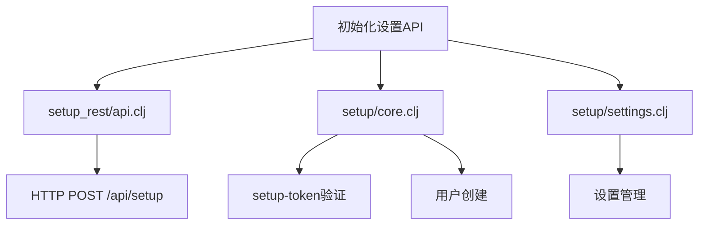
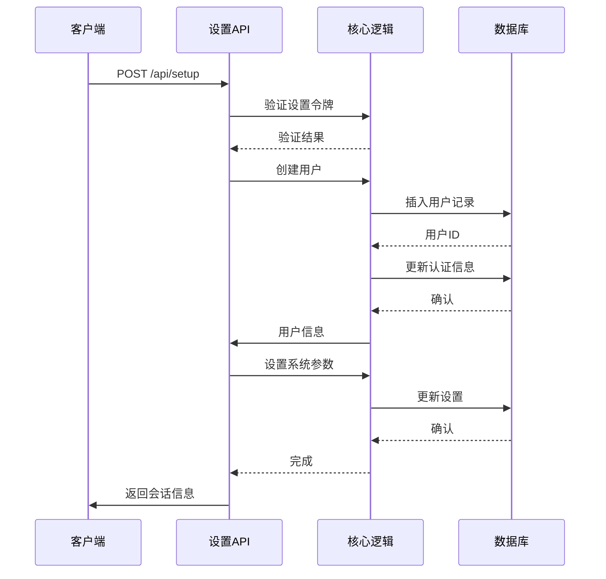
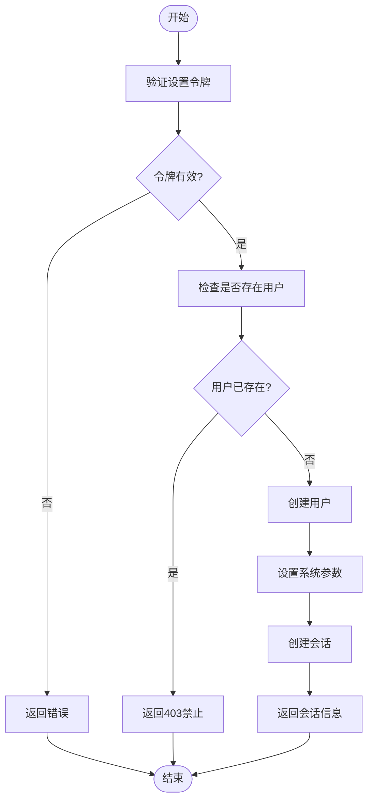
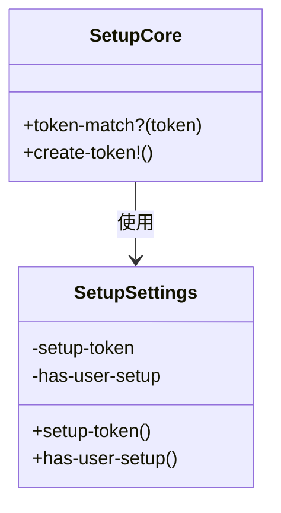
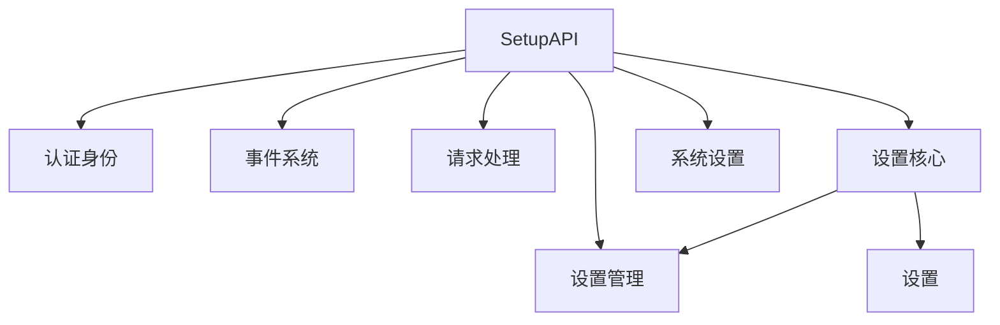

# 初始化设置API

<cite>
**本文档中引用的文件**  
- [api.clj](file://src/metabase/setup_rest/api.clj)
- [core.clj](file://src/metabase/setup/core.clj)
- [settings.clj](file://src/metabase/setup/settings.clj)
- [core.clj](file://src/metabase/core/core.clj)
- [init.clj](file://src/metabase/setup/init.clj)
</cite>

## 目录
1. [简介](#简介)
2. [项目结构](#项目结构)
3. [核心组件](#核心组件)
4. [架构概述](#架构概述)
5. [详细组件分析](#详细组件分析)
6. [依赖分析](#依赖分析)
7. [性能考虑](#性能考虑)
8. [故障排除指南](#故障排除指南)
9. [结论](#结论)

## 简介
本文档详细介绍了Metabase系统中初始化设置API的功能和实现。该API用于在首次安装Metabase实例时进行环境配置、管理员账户创建和基本设置流程。文档涵盖了`setup_rest/api.clj`中的所有端点，解释了与`setup/core.clj`的交互逻辑，以及在自动化部署中的应用。同时提供了安全配置的最佳实践。

## 项目结构
Metabase的初始化设置功能主要分布在`src/metabase/setup`和`src/metabase/setup_rest`目录中。`setup`模块包含核心设置逻辑，而`setup_rest`模块提供REST API端点。这种分离的设计使得核心逻辑可以被不同类型的接口复用。

**图表来源**  
- [api.clj](file://src/metabase/setup_rest/api.clj)
- [core.clj](file://src/metabase/setup/core.clj)
- [settings.clj](file://src/metabase/setup/settings.clj)

**章节来源**  
- [api.clj](file://src/metabase/setup_rest/api.clj)
- [core.clj](file://src/metabase/setup/core.clj)

## 核心组件
初始化设置系统的核心组件包括设置令牌管理、用户创建和系统配置。`setup/core.clj`文件提供了`token-match?`函数用于验证设置令牌，以及`create-token!`函数用于生成新的设置令牌。`setup_rest/api.clj`文件实现了POST `/api/setup`端点，该端点负责创建第一个管理员用户并完成初始系统配置。

**章节来源**  
- [api.clj](file://src/metabase/setup_rest/api.clj#L1-L106)
- [core.clj](file://src/metabase/setup/core.clj#L1-L27)

## 架构概述
初始化设置API的架构遵循典型的RESTful设计模式，通过HTTP POST请求接收设置数据。系统首先验证提供的设置令牌，然后在数据库事务中创建管理员用户并配置系统设置。整个流程确保了数据的一致性和安全性。

**图表来源**  
- [api.clj](file://src/metabase/setup_rest/api.clj#L50-L106)
- [core.clj](file://src/metabase/setup/core.clj#L10-L27)

## 详细组件分析

### 设置API分析
设置API组件负责处理初始化设置请求。它验证设置令牌，创建第一个管理员用户，并配置基本系统设置。该组件确保只有在没有现有用户的情况下才能执行设置操作，防止多次初始化。

**图表来源**  
- [api.clj](file://src/metabase/setup_rest/api.clj#L30-L106)

**章节来源**  
- [api.clj](file://src/metabase/setup_rest/api.clj#L1-L106)

### 核心逻辑分析
核心逻辑组件包含设置令牌管理和用户状态检查功能。`has-user-setup`设置用于跟踪系统是否已经完成初始化，而`setup-token`设置则提供了一次性的安全令牌，确保只有授权方可以执行初始化操作。

**图表来源**  
- [core.clj](file://src/metabase/setup/core.clj#L1-L27)
- [settings.clj](file://src/metabase/setup/settings.clj#L1-L48)

**章节来源**  
- [core.clj](file://src/metabase/setup/core.clj#L1-L27)
- [settings.clj](file://src/metabase/setup/settings.clj#L1-L48)

## 依赖分析
初始化设置系统依赖于多个核心模块，包括用户管理、认证系统、设置管理和数据库访问层。这些依赖关系确保了设置流程的完整性和可靠性。

**图表来源**  
- [api.clj](file://src/metabase/setup_rest/api.clj#L1-L10)
- [core.clj](file://src/metabase/setup/core.clj#L1-L5)

**章节来源**  
- [api.clj](file://src/metabase/setup_rest/api.clj#L1-L106)
- [core.clj](file://src/metabase/setup/core.clj#L1-L27)

## 性能考虑
初始化设置API的设计考虑了性能和可靠性。所有数据库操作都在单个事务中执行，确保了数据一致性。设置令牌的验证是轻量级操作，不会对性能造成显著影响。系统还实现了适当的错误处理和回滚机制，防止部分完成的设置操作导致系统处于不一致状态。

## 故障排除指南
在使用初始化设置API时，可能会遇到以下常见问题：

1. **设置令牌不匹配**：确保使用的设置令牌是系统生成的最新令牌。
2. **用户已存在**：如果系统已经完成初始化，不能再使用此API创建用户。
3. **数据库连接问题**：确保数据库服务正常运行且连接配置正确。
4. **权限问题**：确保执行设置操作的用户具有必要的权限。

**章节来源**  
- [api.clj](file://src/metabase/setup_rest/api.clj#L30-L106)
- [core.clj](file://src/metabase/setup/core.clj#L10-L27)

## 结论
Metabase的初始化设置API提供了一个安全、可靠的机制来完成系统的首次配置。通过使用一次性设置令牌和严格的验证逻辑，系统确保了只有授权用户才能执行初始化操作。该API的设计考虑了数据一致性、安全性和易用性，为Metabase的部署和配置提供了坚实的基础。