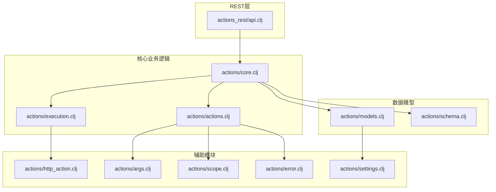
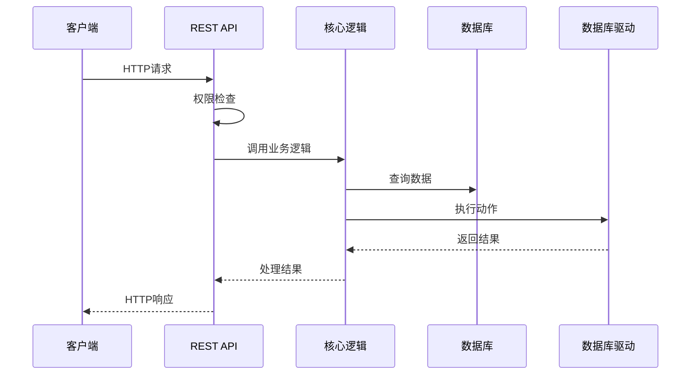
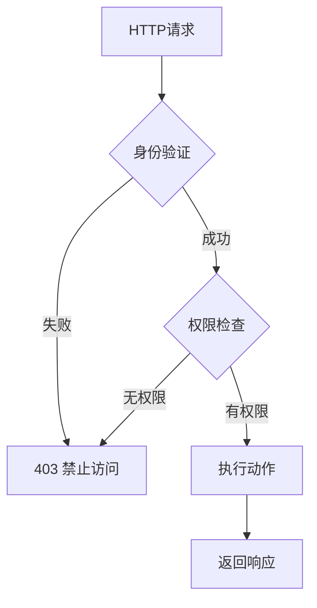
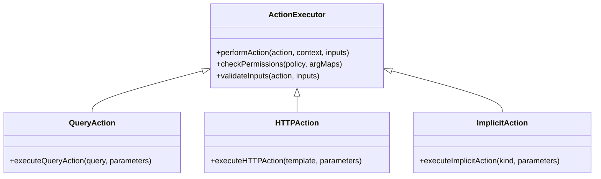
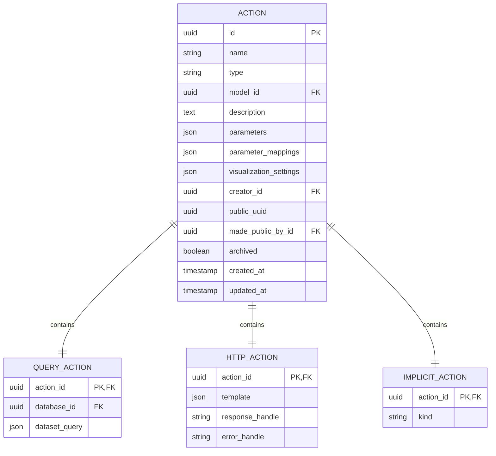
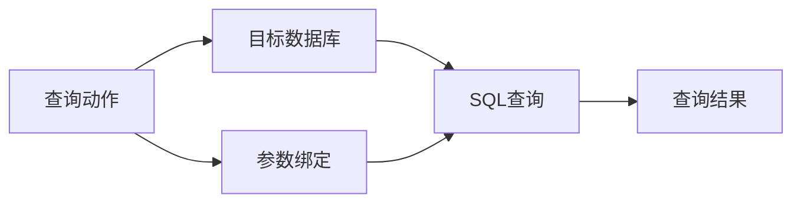
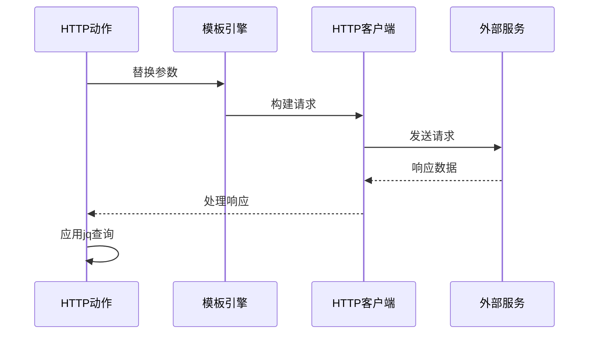
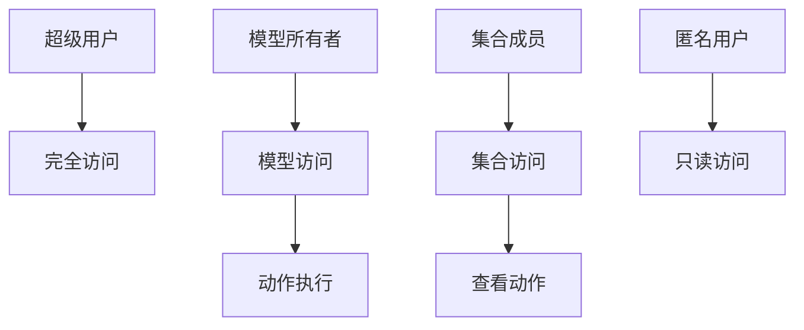
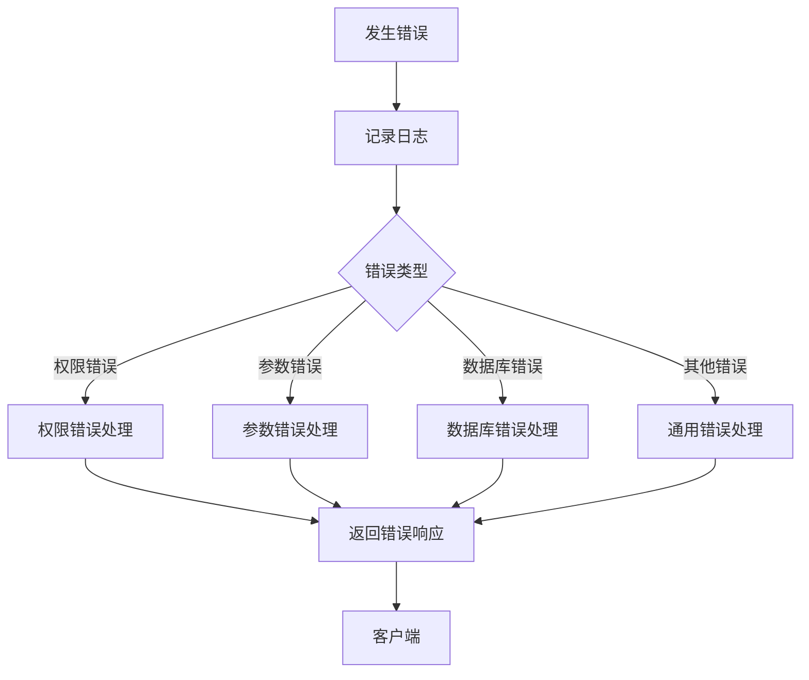

# 动作API

<cite>
**本文档中引用的文件**
- [actions_rest/api.clj](file://src/metabase/actions_rest/api.clj)
- [actions/core.clj](file://src/metabase/actions/core.clj)
- [actions/models.clj](file://src/metabase/actions/models.clj)
- [actions/schema.clj](file://src/metabase/actions/schema.clj)
- [actions/actions.clj](file://src/metabase/actions/actions.clj)
- [actions/execution.clj](file://src/metabase/actions/execution.clj)
- [actions/error.clj](file://src/metabase/actions/error.clj)
- [actions/http_action.clj](file://src/metabase/actions/http_action.clj)
- [actions/args.clj](file://src/metabase/actions/args.clj)
- [actions/scope.clj](file://src/metabase/actions/scope.clj)
- [actions/settings.clj](file://src/metabase/actions/settings.clj)
- [actions/init.clj](file://src/metabase/actions/init.clj)
- [api_routes/routes.clj](file://src/metabase/api_routes/routes.clj)
</cite>

## 目录
1. [简介](#简介)
2. [项目结构](#项目结构)
3. [核心组件](#核心组件)
4. [架构概览](#架构概览)
5. [详细组件分析](#详细组件分析)
6. [REST端点详解](#rest端点详解)
7. [动作类型](#动作类型)
8. [权限控制](#权限控制)
9. [错误处理机制](#错误处理机制)
10. [使用示例](#使用示例)
11. [故障排除指南](#故障排除指南)
12. [结论](#结论)

## 简介

Metabase的动作API提供了一套完整的REST接口，用于创建、管理和执行自定义动作。这些动作可以是查询操作、HTTP调用或数据修改操作，为用户提供了强大的自动化功能。

动作API的核心特性包括：
- 支持多种动作类型（查询、HTTP、隐式）
- 完整的权限控制系统
- 参数化执行机制
- 错误处理和日志记录
- 公共分享功能

## 项目结构

动作API的文件组织结构清晰，主要分为以下几个部分：



**图表来源**
- [actions_rest/api.clj](file://src/metabase/actions_rest/api.clj#L1-L181)
- [actions/core.clj](file://src/metabase/actions/core.clj#L1-L66)

**章节来源**
- [actions_rest/api.clj](file://src/metabase/actions_rest/api.clj#L1-L181)
- [actions/core.clj](file://src/metabase/actions/core.clj#L1-L66)

## 核心组件

动作API由以下核心组件构成：

### REST API层
负责处理HTTP请求和响应，提供标准化的REST接口。

### 核心业务逻辑层
包含动作执行的主要逻辑，包括权限检查、参数验证和执行流程。

### 数据模型层
定义动作的数据结构和数据库操作。

### 辅助模块
提供特定功能支持，如HTTP动作执行、参数处理等。

**章节来源**
- [actions_rest/api.clj](file://src/metabase/actions_rest/api.clj#L1-L30)
- [actions/core.clj](file://src/metabase/actions/core.clj#L1-L30)

## 架构概览

动作API采用分层架构设计，确保了良好的可维护性和扩展性：



**图表来源**
- [actions_rest/api.clj](file://src/metabase/actions_rest/api.clj#L30-L181)
- [actions/actions.clj](file://src/metabase/actions/actions.clj#L150-L250)

## 详细组件分析

### REST API组件

REST API组件负责处理所有外部HTTP请求，提供了完整的CRUD操作接口。

#### 主要功能
- 动作列表查询
- 单个动作获取
- 动作创建和更新
- 动作删除
- 动作执行
- 公共链接管理

#### 权限控制
每个端点都实现了细粒度的权限控制：



**图表来源**
- [actions_rest/api.clj](file://src/metabase/actions_rest/api.clj#L30-L181)

**章节来源**
- [actions_rest/api.clj](file://src/metabase/actions_rest/api.clj#L30-L181)

### 核心业务逻辑组件

核心业务逻辑组件包含了动作执行的全部逻辑，包括：

#### 动作执行流程
1. 参数验证和规范化
2. 权限检查
3. 数据库连接验证
4. 动作类型判断
5. 具体执行逻辑
6. 结果处理和返回

#### 多态执行机制
系统支持多种动作类型的多态执行：



**图表来源**
- [actions/actions.clj](file://src/metabase/actions/actions.clj#L50-L150)
- [actions/execution.clj](file://src/metabase/actions/execution.clj#L50-L150)

**章节来源**
- [actions/actions.clj](file://src/metabase/actions/actions.clj#L50-L200)
- [actions/execution.clj](file://src/metabase/actions/execution.clj#L50-L200)

### 数据模型组件

数据模型组件定义了动作的完整数据结构和数据库操作：

#### 核心数据结构
- **Action**: 基础动作实体
- **QueryAction**: 查询动作子类
- **HTTPAction**: HTTP动作子类  
- **ImplicitAction**: 隐式动作子类

#### 数据库操作
提供了完整的CRUD操作和高级查询功能：



**图表来源**
- [actions/models.clj](file://src/metabase/actions/models.clj#L20-L80)
- [actions/schema.clj](file://src/metabase/actions/schema.clj#L50-L100)

**章节来源**
- [actions/models.clj](file://src/metabase/actions/models.clj#L20-L150)
- [actions/schema.clj](file://src/metabase/actions/schema.clj#L50-L117)

## REST端点详解

### 动作列表查询

**端点**: `GET /api/action/`
**描述**: 获取可用的动作列表

**请求参数**:
- `model-id`: 可选，限制到特定模型的动作

**响应格式**:
```json
[
  {
    "id": 1,
    "name": "更新客户信息",
    "type": "query",
    "model_id": 123,
    "parameters": [...],
    "creator_id": 456,
    "created_at": "2024-01-01T00:00:00Z",
    "updated_at": "2024-01-01T00:00:00Z"
  }
]
```

### 单个动作获取

**端点**: `GET /api/action/:action-id`
**描述**: 获取指定动作的详细信息

**路径参数**:
- `action-id`: 动作ID

### 动作创建

**端点**: `POST /api/action/`
**描述**: 创建新的动作

**请求体**:
```json
{
  "name": "新动作",
  "type": "query",
  "model_id": 123,
  "parameters": [],
  "database_id": 456,
  "dataset_query": {...}
}
```

### 动作更新

**端点**: `PUT /api/action/:id`
**描述**: 更新现有动作

**路径参数**:
- `id`: 动作ID

**请求体**: 类似于创建动作的请求体

### 动作删除

**端点**: `DELETE /api/action/:action-id`
**描述**: 删除指定动作

### 动作执行

**端点**: `POST /api/action/:id/execute`
**描述**: 执行动作

**路径参数**:
- `id`: 动作ID

**请求体**:
```json
{
  "parameters": {
    "param1": "value1",
    "param2": "value2"
  }
}
```

### 公共链接管理

**端点**: `POST /api/action/:id/public_link`
**描述**: 生成公共访问链接

**端点**: `DELETE /api/action/:id/public_link`
**描述**: 删除公共访问链接

**章节来源**
- [actions_rest/api.clj](file://src/metabase/actions_rest/api.clj#L30-L181)

## 动作类型

### 查询动作 (Query Action)

查询动作允许执行预定义的数据库查询：



**图表来源**
- [actions/execution.clj](file://src/metabase/actions/execution.clj#L20-L80)

### HTTP动作 (HTTP Action)

HTTP动作支持调用外部Web服务：



**图表来源**
- [actions/http_action.clj](file://src/metabase/actions/http_action.clj#L100-L165)

### 隐式动作 (Implicit Action)

隐式动作提供直接的数据表操作：

| 动作类型 | 描述 | 必需参数 |
|---------|------|---------|
| `:row/create` | 创建新行 | 表字段值映射 |
| `:row/update` | 更新现有行 | 主键+字段值 |
| `:row/delete` | 删除行 | 主键值 |
| `:bulk/create` | 批量创建 | 行数据数组 |
| `:bulk/update` | 批量更新 | 主键+字段值映射 |
| `:bulk/delete` | 批量删除 | 主键值数组 |

**章节来源**
- [actions/execution.clj](file://src/metabase/actions/execution.clj#L100-L200)
- [actions/http_action.clj](file://src/metabase/actions/http_action.clj#L100-L165)

## 权限控制

### 权限层次结构

动作API实现了多层次的权限控制：



**图表来源**
- [actions_rest/api.clj](file://src/metabase/actions_rest/api.clj#L30-L100)

### 权限检查流程

1. **身份验证**: 验证用户身份
2. **模型权限**: 检查对关联模型的访问权限
3. **动作权限**: 验证动作执行权限
4. **数据库权限**: 确认数据库连接权限

**章节来源**
- [actions_rest/api.clj](file://src/metabase/actions_rest/api.clj#L30-L100)

## 错误处理机制

### 错误类型分类

动作API定义了多种错误类型：

| 错误类型 | 描述 | HTTP状态码 |
|---------|------|-----------|
| `:missing-required-permissions` | 缺少必要权限 | 403 |
| `:invalid-parameter` | 参数无效 | 400 |
| `:unknown-action` | 未知动作 | 404 |
| `:database-not-supported` | 数据库不支持 | 400 |
| `:action-not-enabled` | 动作未启用 | 400 |

### 错误处理流程



**图表来源**
- [actions/error.clj](file://src/metabase/actions/error.clj#L1-L26)

**章节来源**
- [actions/error.clj](file://src/metabase/actions/error.clj#L1-L26)

## 使用示例

### 创建查询动作示例

```bash
curl -X POST "https://your-metabase.com/api/action/" \
  -H "Authorization: Bearer YOUR_TOKEN" \
  -H "Content-Type: application/json" \
  -d '{
    "name": "更新订单状态",
    "type": "query",
    "model_id": 123,
    "database_id": 456,
    "dataset_query": {
      "type": "native",
      "native": {
        "query": "UPDATE orders SET status = ? WHERE order_id = ?",
        "parameters": [
          {"type": "string", "value": "shipped"},
          {"type": "number", "value": 1001}
        ]
      },
      "database": 456
    }
  }'
```

### 执行HTTP动作示例

```bash
curl -X POST "https://your-metabase.com/api/action/123/execute" \
  -H "Authorization: Bearer YOUR_TOKEN" \
  -H "Content-Type: application/json" \
  -d '{
    "parameters": {
      "customer_id": "CUST123",
      "order_total": 250.00
    }
  }'
```

### 创建隐式动作示例

```bash
curl -X POST "https://your-metabase.com/api/action/" \
  -H "Authorization: Bearer YOUR_TOKEN" \
  -H "Content-Type: application/json" \
  -d '{
    "name": "创建新客户",
    "type": "implicit",
    "model_id": 123,
    "kind": "row/create",
    "parameters": [
      {
        "id": "name",
        "display-name": "客户姓名",
        "type": "string",
        "required": true
      },
      {
        "id": "email",
        "display-name": "电子邮件",
        "type": "string",
        "required": true
      }
    ]
  }'
```

## 故障排除指南

### 常见问题及解决方案

#### 1. 动作执行失败
**症状**: 动作执行返回错误
**可能原因**:
- 数据库连接问题
- 权限不足
- 参数格式错误

**解决步骤**:
1. 检查数据库连接状态
2. 验证用户权限
3. 确认参数格式正确

#### 2. HTTP动作超时
**症状**: HTTP动作执行超时
**可能原因**:
- 外部服务响应慢
- 网络连接问题

**解决步骤**:
1. 检查网络连接
2. 增加超时时间设置
3. 验证外部服务状态

#### 3. 隐式动作参数错误
**症状**: 隐式动作参数验证失败
**可能原因**:
- 必需参数缺失
- 参数类型不匹配

**解决步骤**:
1. 检查必需参数是否提供
2. 验证参数类型
3. 查看动作定义中的参数规范

### 调试技巧

1. **启用详细日志**: 在配置中启用调试日志
2. **检查权限**: 使用权限检查工具验证访问权限
3. **测试参数**: 单独测试参数替换和验证
4. **监控执行**: 监控动作执行过程中的中间状态

**章节来源**
- [actions/execution.clj](file://src/metabase/actions/execution.clj#L50-L150)
- [actions/actions.clj](file://src/metabase/actions/actions.clj#L200-L300)

## 结论

Metabase的动作API提供了一个强大而灵活的自动化平台，支持多种动作类型和复杂的业务逻辑。通过其完善的权限控制、错误处理和扩展机制，开发者可以构建出满足各种需求的自动化解决方案。

### 主要优势

1. **多样性**: 支持查询、HTTP、隐式等多种动作类型
2. **安全性**: 完善的权限控制和审计机制
3. **可扩展性**: 模块化设计便于功能扩展
4. **易用性**: 标准化的REST接口和丰富的示例

### 最佳实践

1. **权限最小化**: 仅授予必要的最小权限
2. **参数验证**: 在客户端进行充分的参数验证
3. **错误处理**: 实现健壮的错误处理机制
4. **监控审计**: 启用详细的日志和审计功能

通过遵循这些指导原则和最佳实践，可以充分发挥动作API的强大功能，构建出稳定可靠的自动化解决方案。