# 嵌入式BI API详细文档

<cite>
**本文档中引用的文件**
- [embedding_rest/api.clj](file://src/metabase/embedding_rest/api.clj)
- [embedding_rest/api/embed.clj](file://src/metabase/embedding_rest/api/embed.clj)
- [embedding_rest/api/preview_embed.clj](file://src/metabase/embedding_rest/api/preview_embed.clj)
- [embedding_rest/api/common.clj](file://src/metabase/embedding_rest/api/common.clj)
- [embedding/jwt.clj](file://src/metabase/embedding/jwt.clj)
- [embedding/validation.clj](file://src/metabase/embedding/validation.clj)
- [embedding/settings.clj](file://src/metabase/embedding/settings.clj)
- [embedding/util.clj](file://src/metabase/embedding/util.clj)
- [embedding/init.clj](file://src/metabase/embedding/init.clj)
- [api_routes/routes.clj](file://src/metabase/api_routes/routes.clj)
- [api/macros.clj](file://src/metabase/api/macros.clj)
</cite>

## 目录
1. [简介](#简介)
2. [系统架构概览](#系统架构概览)
3. [核心组件分析](#核心组件分析)
4. [JWT签名与验证机制](#jwt签名与验证机制)
5. [嵌入端点详解](#嵌入端点详解)
6. [预览嵌入端点](#预览嵌入端点)
7. [安全策略与权限控制](#安全策略与权限控制)
8. [配置管理](#配置管理)
9. [第三方应用集成示例](#第三方应用集成示例)
10. [故障排除指南](#故障排除指南)
11. [总结](#总结)

## 简介

Metabase嵌入式BI API是一个强大的功能，允许开发者将Metabase仪表板和卡片嵌入到第三方应用程序中。该系统通过JSON Web Tokens (JWT) 实现安全的身份验证和授权，确保只有经过授权的应用程序才能访问特定的仪表板和卡片内容。

嵌入式API提供了两种主要模式：
- **生产环境嵌入**：用于实际部署的应用程序
- **预览嵌入**：仅限管理员使用的开发和测试功能

## 系统架构概览

嵌入式BI API采用模块化架构设计，主要包含以下核心组件：

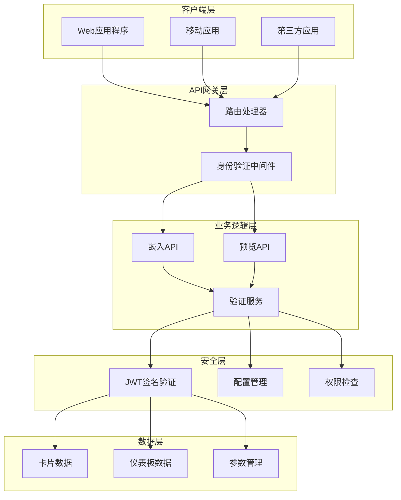

**图表来源**
- [embedding_rest/api.clj](file://src/metabase/embedding_rest/api.clj#L1-L17)
- [api_routes/routes.clj](file://src/metabase/api_routes/routes.clj#L148-L168)

**章节来源**
- [embedding_rest/api.clj](file://src/metabase/embedding_rest/api.clj#L1-L17)
- [embedding_rest/api/embed.clj](file://src/metabase/embedding_rest/api/embed.clj#L1-L50)

## 核心组件分析

### 路由系统

嵌入式API的路由系统通过命名空间处理器实现模块化管理：

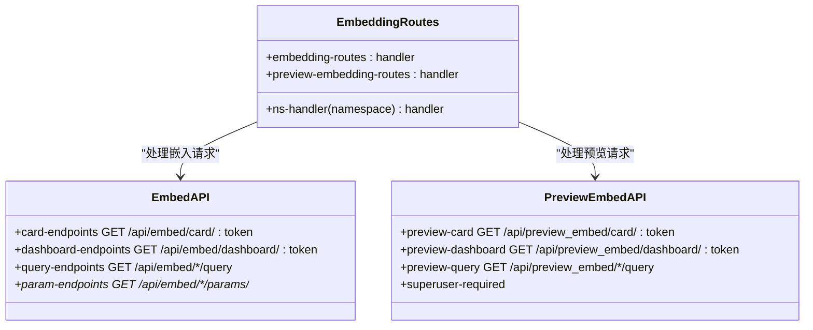

**图表来源**
- [embedding_rest/api.clj](file://src/metabase/embedding_rest/api.clj#L10-L17)
- [embedding_rest/api/embed.clj](file://src/metabase/embedding_rest/api/embed.clj#L50-L100)

### 通用API处理模块

通用API处理模块提供了跨端点共享的功能：

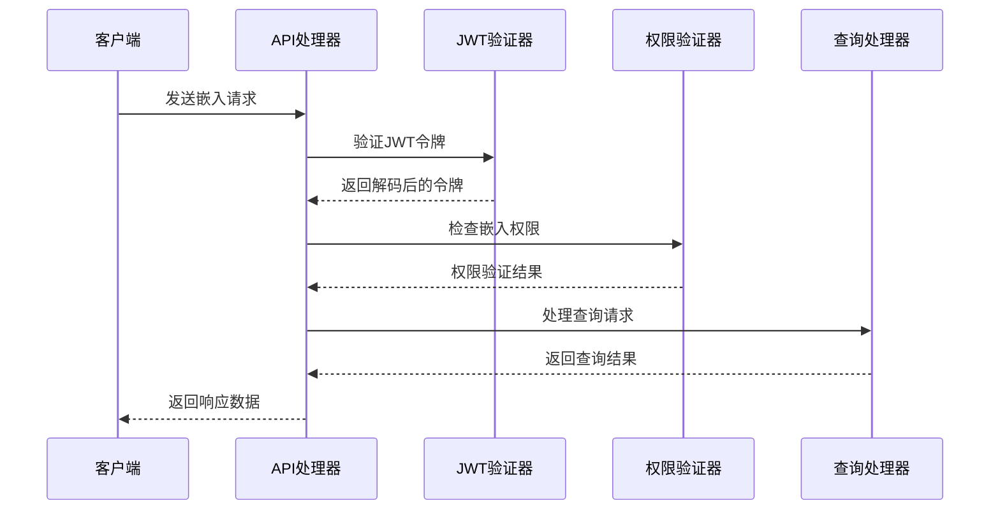

**图表来源**
- [embedding_rest/api/common.clj](file://src/metabase/embedding_rest/api/common.clj#L1-L50)
- [embedding/jwt.clj](file://src/metabase/embedding/jwt.clj#L30-L49)

**章节来源**
- [embedding_rest/api/embed.clj](file://src/metabase/embedding_rest/api/embed.clj#L1-L100)
- [embedding_rest/api/common.clj](file://src/metabase/embedding_rest/api/common.clj#L1-L100)

## JWT签名与验证机制

### JWT签名流程

JWT签名是嵌入式API安全性的核心组件：

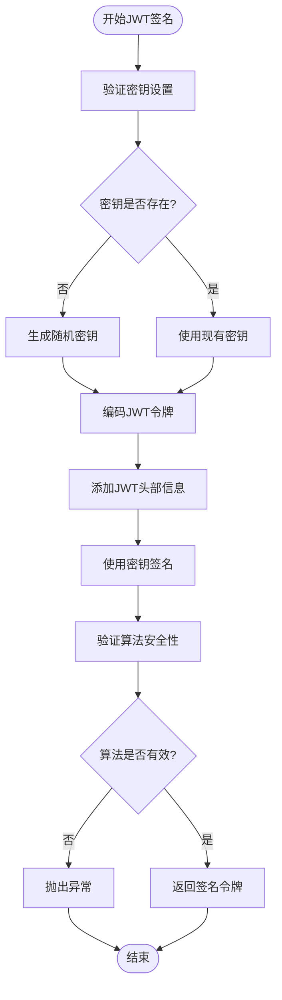

**图表来源**
- [embedding/jwt.clj](file://src/metabase/embedding/jwt.clj#L15-L30)
- [embedding/settings.clj](file://src/metabase/embedding/settings.clj#L15-L30)

### JWT验证机制

JWT验证过程包括多个安全检查步骤：

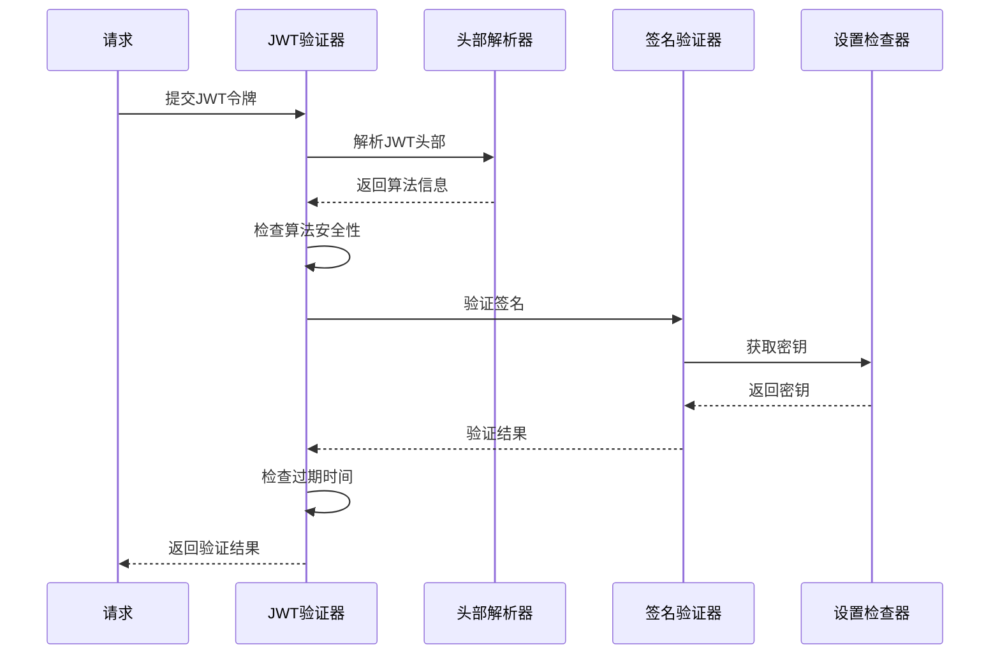

**图表来源**
- [embedding/jwt.clj](file://src/metabase/embedding/jwt.clj#L30-L49)

### 安全策略

JWT安全策略包含以下关键要素：

| 安全特性 | 实现方式 | 目的 |
|---------|---------|------|
| 算法验证 | 检查`alg`字段不为`none` | 防止无签名攻击 |
| 密钥验证 | 使用`embedding-secret-key` | 确保只有授权方能生成令牌 |
| 过期检查 | 支持60秒时钟偏差容差 | 处理客户端与服务器时间差异 |
| 参数验证 | 检查令牌必需字段 | 确保令牌完整性 |

**章节来源**
- [embedding/jwt.clj](file://src/metabase/embedding/jwt.clj#L1-L51)
- [embedding/validation.clj](file://src/metabase/embedding/validation.clj#L1-L12)

## 嵌入端点详解

### 卡片嵌入端点

卡片嵌入提供了多种访问方式：

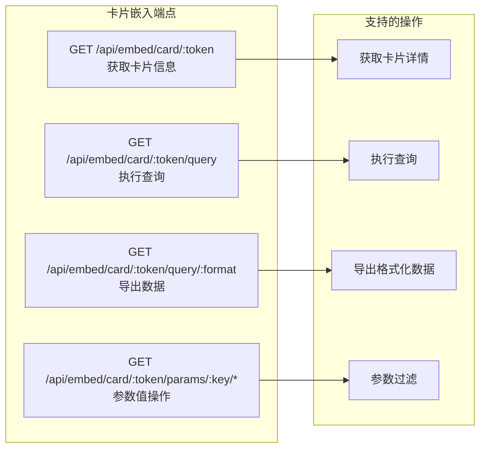

**图表来源**
- [embedding_rest/api/embed.clj](file://src/metabase/embedding_rest/api/embed.clj#L60-L120)

### 仪表板嵌入端点

仪表板嵌入提供了更复杂的交互功能：

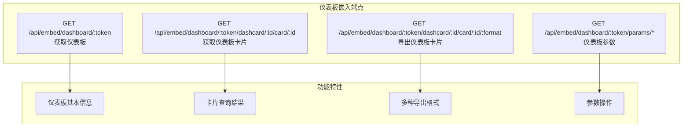

**图表来源**
- [embedding_rest/api/embed.clj](file://src/metabase/embedding_rest/api/embed.clj#L150-L250)

### 参数处理机制

参数处理是嵌入式API的重要功能：

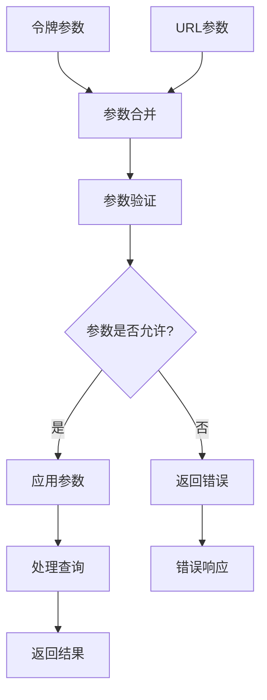

**图表来源**
- [embedding_rest/api/common.clj](file://src/metabase/embedding_rest/api/common.clj#L100-L200)

**章节来源**
- [embedding_rest/api/embed.clj](file://src/metabase/embedding_rest/api/embed.clj#L50-L367)
- [embedding_rest/api/common.clj](file://src/metabase/embedding_rest/api/common.clj#L300-L591)

## 预览嵌入端点

### 预览功能概述

预览嵌入端点专为管理员设计，提供安全的开发和测试环境：

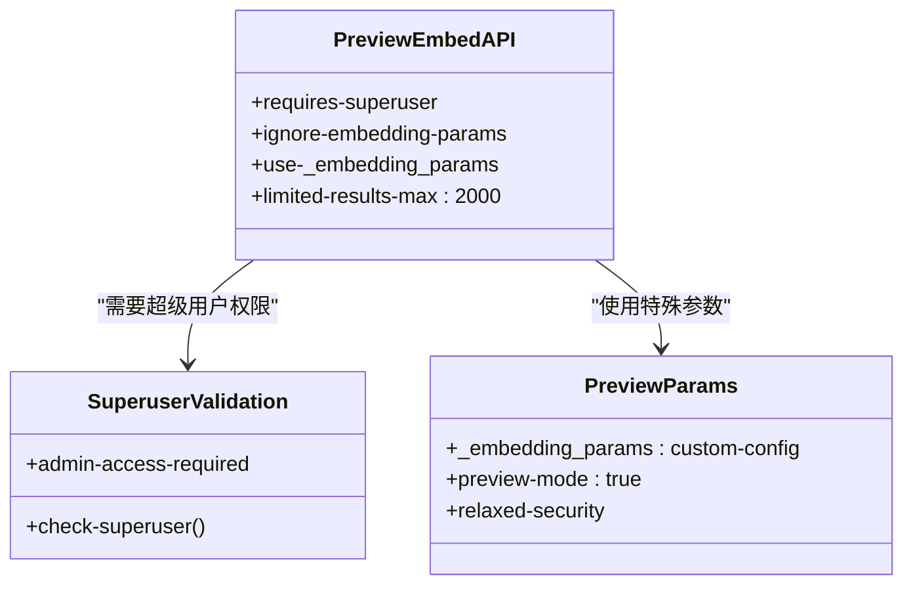

**图表来源**
- [embedding_rest/api/preview_embed.clj](file://src/metabase/embedding_rest/api/preview_embed.clj#L20-L30)

### 预览与生产环境差异

| 功能特性 | 生产环境 | 预览环境 |
|---------|---------|---------|
| 权限要求 | JWT令牌验证 | 超级用户权限 |
| 参数白名单 | 严格遵循配置 | 忽略白名单限制 |
| 结果大小限制 | 无限制 | 最大2000条记录 |
| 嵌入状态检查 | 检查启用状态 | 忽略启用状态 |
| 访问日志 | 记录访问事件 | 不记录访问事件 |

**章节来源**
- [embedding_rest/api/preview_embed.clj](file://src/metabase/embedding_rest/api/preview_embed.clj#L1-L204)

## 安全策略与权限控制

### 权限验证层次

嵌入式API实现了多层权限验证：

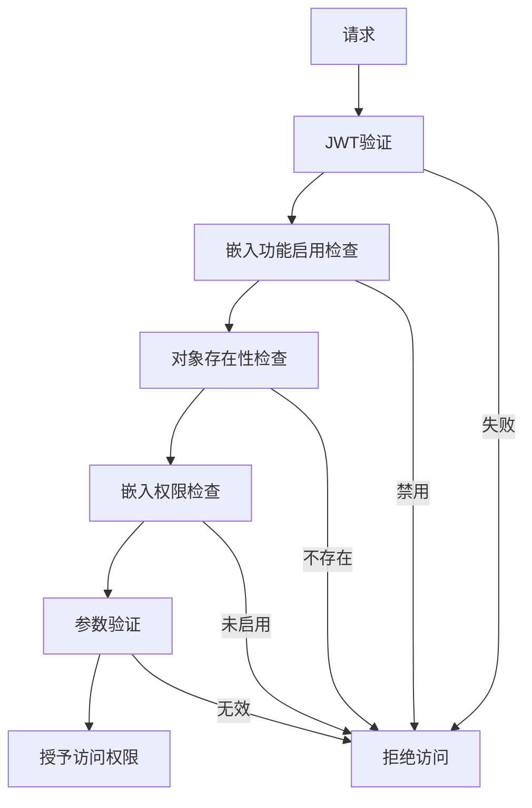

**图表来源**
- [embedding_rest/api/common.clj](file://src/metabase/embedding_rest/api/common.clj#L80-L120)
- [embedding/validation.clj](file://src/metabase/embedding/validation.clj#L1-L12)

### 参数安全控制

参数安全控制确保敏感数据不会被恶意访问：

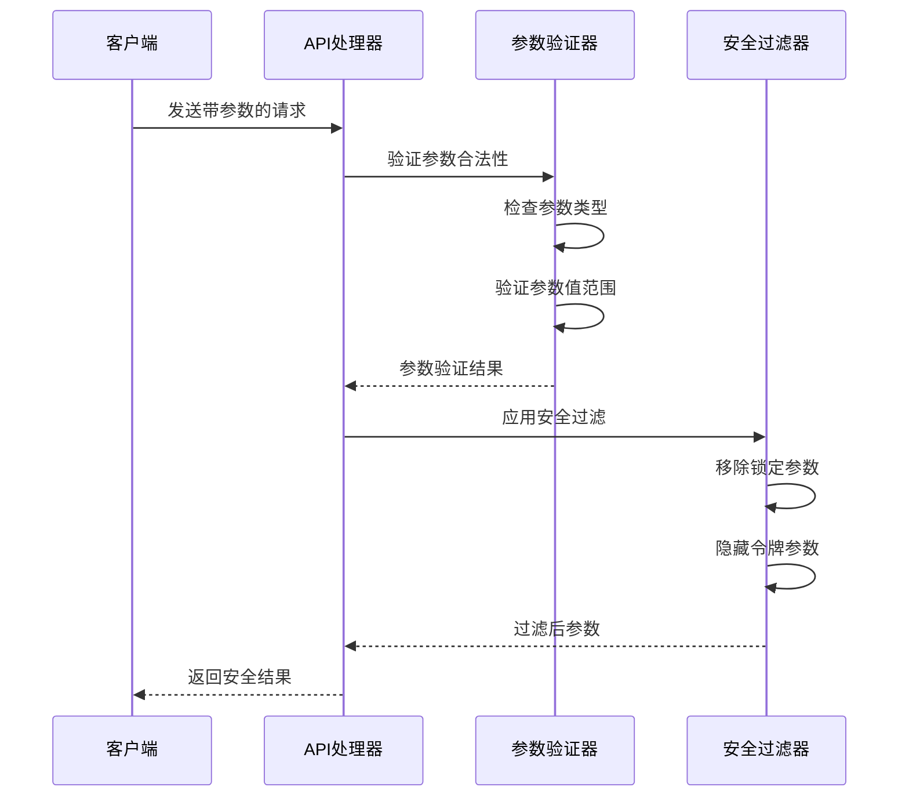

**图表来源**
- [embedding_rest/api/common.clj](file://src/metabase/embedding_rest/api/common.clj#L200-L300)

**章节来源**
- [embedding_rest/api/common.clj](file://src/metabase/embedding_rest/api/common.clj#L80-L200)
- [embedding/validation.clj](file://src/metabase/embedding/validation.clj#L1-L12)

## 配置管理

### 嵌入功能配置

嵌入功能通过多个配置选项进行精细控制：

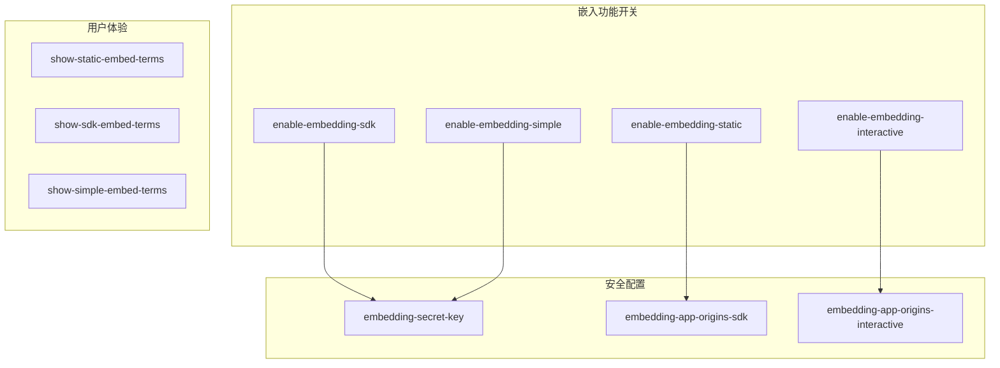

**图表来源**
- [embedding/settings.clj](file://src/metabase/embedding/settings.clj#L100-L200)

### 配置验证机制

配置验证确保系统的安全性和稳定性：

| 配置项 | 验证规则 | 默认值 | 影响范围 |
|-------|---------|--------|---------|
| embedding-secret-key | 64字符十六进制字符串 | 自动生成 | 所有嵌入功能 |
| enable-embedding-sdk | 布尔值 | false | SDK嵌入 |
| embedding-app-origins-sdk | CORS源列表 | "" | 跨域访问 |
| show-static-embed-terms | 布尔值 | true | 用户界面 |

**章节来源**
- [embedding/settings.clj](file://src/metabase/embedding/settings.clj#L1-L315)

## 第三方应用集成示例

### 基本JWT令牌生成

以下是生成JWT令牌的基本流程：

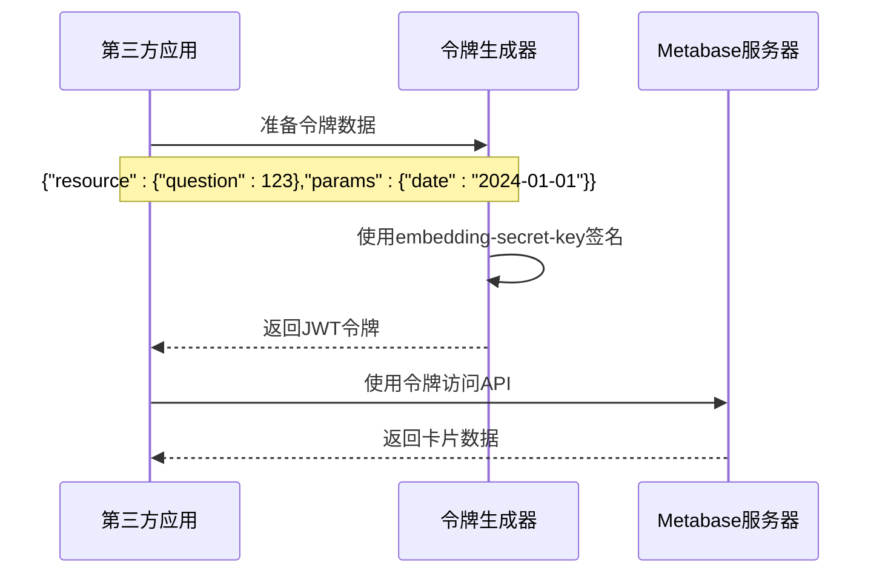

### JavaScript集成示例

```javascript
// 生成JWT令牌的示例代码
const generateEmbedToken = (cardId, params = {}) => {
    const payload = {
        resource: { question: cardId },
        params: params,
        exp: Math.floor(Date.now() / 1000) + 3600 // 1小时有效期
    };
    
    // 使用base64编码的密钥进行签名
    const token = jwt.sign(payload, secretKey, { algorithm: 'HS256' });
    return token;
};

// 使用令牌访问嵌入API
const fetchEmbeddedCard = async (cardId, params) => {
    const token = generateEmbedToken(cardId, params);
    const response = await fetch(`/api/embed/card/${token}`);
    return response.json();
};
```

### React集成示例

```jsx
import React, { useEffect, useState } from 'react';
import { MetabaseEmbed } from '@metabase/embed-sdk';

const EmbeddedDashboard = ({ dashboardId }) => {
    const [token, setToken] = useState(null);
    
    useEffect(() => {
        // 从后端获取JWT令牌
        fetch('/api/generate-embed-token', {
            method: 'POST',
            body: JSON.stringify({ dashboardId })
        })
        .then(response => response.json())
        .then(data => setToken(data.token));
    }, [dashboardId]);
    
    if (!token) return <div>Loading...</div>;
    
    return (
        <MetabaseEmbed
            token={token}
            baseUrl="https://your-metabase-instance.com"
            type="dashboard"
            id={dashboardId}
        />
    );
};
```

### Python集成示例

```python
import jwt
import requests
from datetime import datetime, timedelta

class MetabaseEmbedClient:
    def __init__(self, base_url, secret_key):
        self.base_url = base_url
        self.secret_key = secret_key
        
    def generate_token(self, resource_type, resource_id, params=None):
        """生成嵌入令牌"""
        payload = {
            'resource': {resource_type: resource_id},
            'params': params or {},
            'exp': datetime.utcnow() + timedelta(hours=1)
        }
        return jwt.encode(payload, self.secret_key, algorithm='HS256')
    
    def get_embedded_card(self, card_id, params=None):
        """获取嵌入的卡片数据"""
        token = self.generate_token('question', card_id, params)
        url = f"{self.base_url}/api/embed/card/{token}"
        
        response = requests.get(url)
        response.raise_for_status()
        return response.json()
    
    def get_embedded_dashboard(self, dashboard_id, params=None):
        """获取嵌入的仪表板"""
        token = self.generate_token('dashboard', dashboard_id, params)
        url = f"{self.base_url}/api/embed/dashboard/{token}"
        
        response = requests.get(url)
        response.raise_for_status()
        return response.json()
```

## 故障排除指南

### 常见问题及解决方案

| 问题症状 | 可能原因 | 解决方案 |
|---------|---------|---------|
| 400错误：JWT is missing `alg` | 令牌缺少算法信息 | 检查JWT生成过程，确保指定算法 |
| 400错误：JWT `alg` cannot be `none` | 使用了不安全的算法 | 使用HS256等安全算法 |
| 400错误：The embedding secret key has not been set | 密钥未配置 | 设置`embedding-secret-key` |
| 400错误：Embedding is not enabled | 嵌入功能未启用 | 启用相应的嵌入功能 |
| 400错误：Token is missing value for keypath | 令牌结构不正确 | 检查令牌格式和必需字段 |

### 调试技巧

1. **JWT令牌验证**：使用在线JWT解码工具检查令牌结构
2. **参数验证**：检查参数名称是否匹配白名单配置
3. **权限检查**：确认对象的嵌入权限设置
4. **时间同步**：确保客户端和服务器时间同步

### 性能优化建议

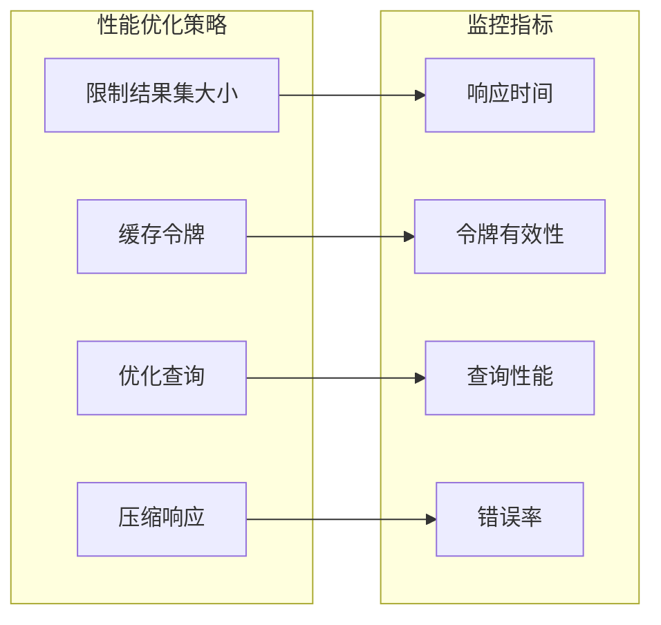

**章节来源**
- [embedding/jwt.clj](file://src/metabase/embedding/jwt.clj#L15-L30)
- [embedding_rest/api/common.clj](file://src/metabase/embedding_rest/api/common.clj#L400-L500)

## 总结

Metabase嵌入式BI API提供了一个强大而灵活的解决方案，用于将数据分析功能集成到第三方应用程序中。通过JWT签名验证、多层权限控制和灵活的配置选项，该系统确保了安全性、可扩展性和易用性。

### 主要优势

1. **安全性**：基于JWT的强身份验证机制
2. **灵活性**：支持多种嵌入模式和配置选项
3. **易用性**：清晰的API设计和丰富的文档
4. **可扩展性**：模块化架构支持功能扩展

### 最佳实践建议

1. **密钥管理**：定期轮换`embedding-secret-key`
2. **权限控制**：根据最小权限原则配置参数白名单
3. **监控告警**：建立API使用情况的监控机制
4. **版本兼容**：保持与Metabase版本的兼容性

通过遵循本文档的指导和最佳实践，开发者可以成功地将Metabase嵌入功能集成到自己的应用程序中，为用户提供强大的数据分析能力。