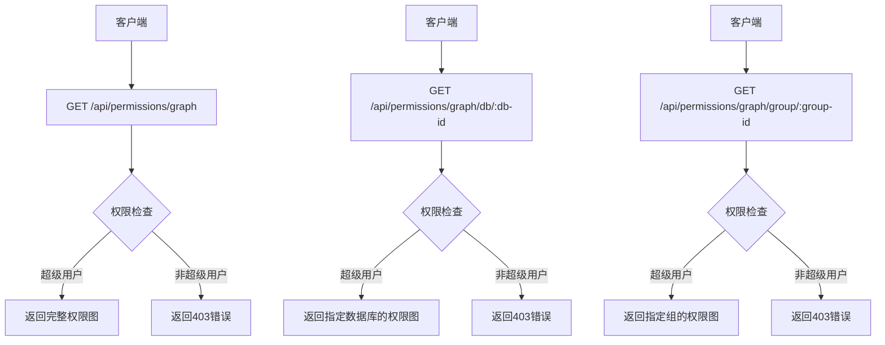
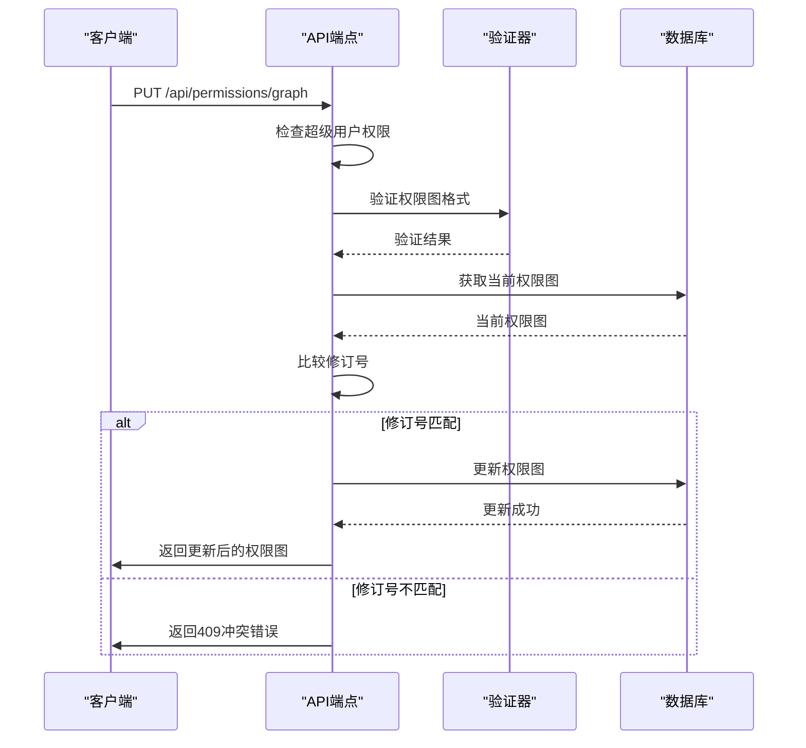
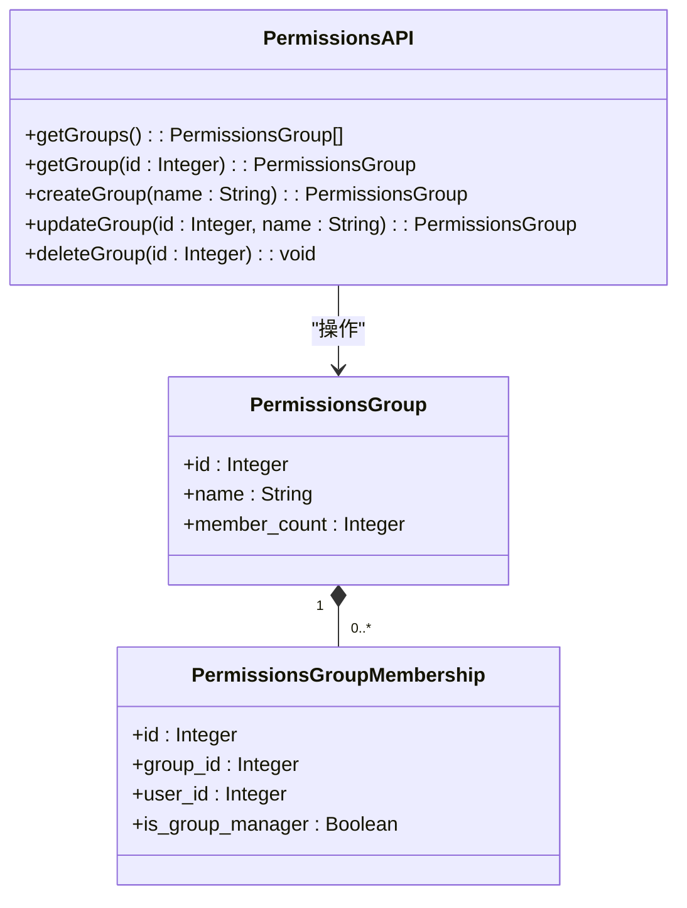
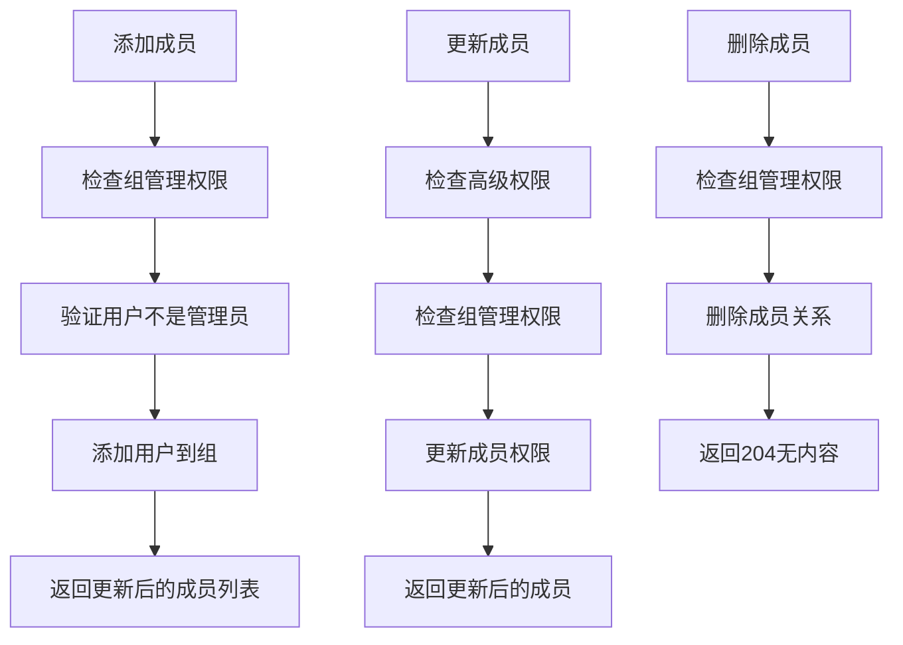
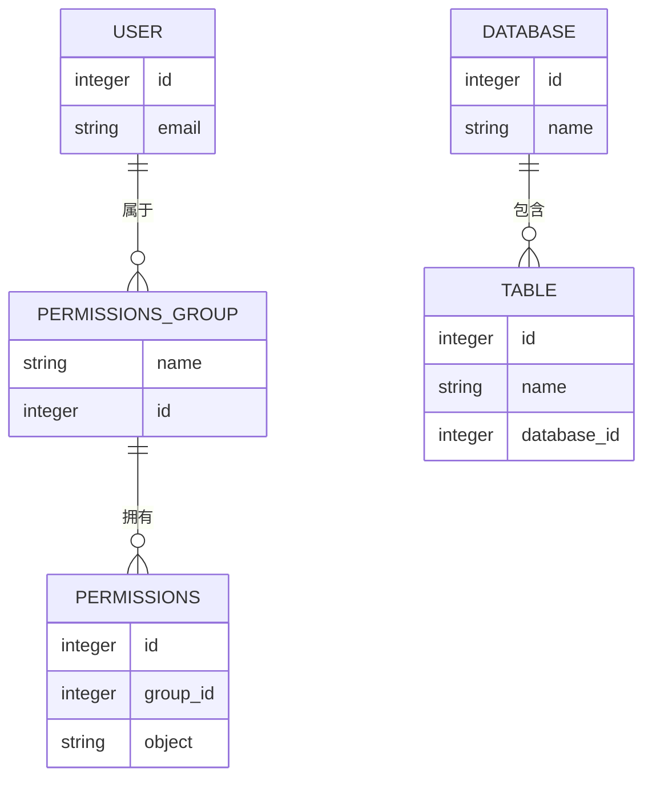
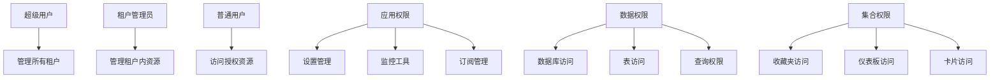
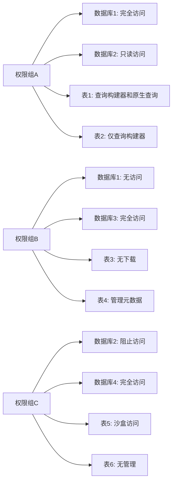
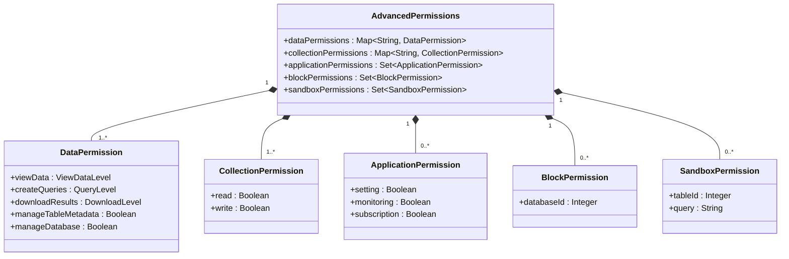
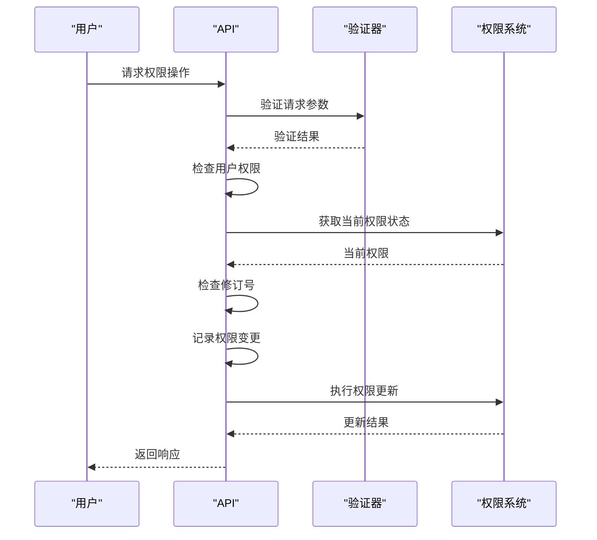
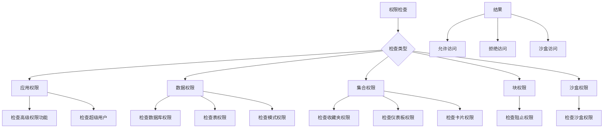

# 权限API

<cite>
**本文档中引用的文件**  
- [api.clj](file://src/metabase/permissions_rest/api.clj)
- [core.clj](file://src/metabase/permissions/core.clj)
- [schema.clj](file://src/metabase/permissions/schema.clj)
- [data_permissions.clj](file://src/metabase/permissions/models/data_permissions.clj)
- [permissions.clj](file://src/metabase/permissions/models/permissions.clj)
- [util.clj](file://src/metabase/permissions/util.clj)
- [validation.clj](file://src/metabase/permissions/validation.clj)
- [graph.clj](file://src/metabase/permissions_rest/data_permissions/graph.clj)
</cite>

## 目录
1. [简介](#简介)
2. [权限图API端点](#权限图api端点)
3. [权限组管理](#权限组管理)
4. [权限继承与多租户应用](#权限继承与多租户应用)
5. [复杂权限配置示例](#复杂权限配置示例)
6. [权限验证与检查](#权限验证与检查)

## 简介
Metabase权限管理系统提供了一套全面的API，用于管理用户对数据、集合和应用程序功能的访问权限。本系统基于权限路径（permissions paths）的概念，通过前缀匹配机制实现高效的权限检查。权限系统支持两种主要类型的权限：数据权限（data permissions）和集合权限（collection permissions）。超级用户自动拥有根权限（root permissions），可以访问所有资源。权限组（Permissions Groups）类似于其他系统中的"角色"，用户可以属于一个或多个权限组。该系统还支持企业版特有的功能，如数据沙盒（data sandboxing）和连接模拟（connection impersonation）。

**Section sources**
- [core.clj](file://src/metabase/permissions/core.clj#L1-L50)
- [permissions.clj](file://src/metabase/permissions/models/permissions.clj#L1-L100)

## 权限图API端点
权限图API提供了读取和更新系统中所有权限的接口。权限图以结构化格式表示所有权限组的权限分配情况，便于批量操作和版本控制。

### 读取权限图
权限图API提供了多个端点来获取权限图的不同视图：

**Diagram sources**
- [api.clj](file://src/metabase/permissions_rest/api.clj#L15-L45)

**Section sources**
- [api.clj](file://src/metabase/permissions_rest/api.clj#L15-L45)

### 更新权限图
PUT端点允许批量更新权限图，支持权限变更的版本控制和冲突检测：

**Diagram sources**
- [api.clj](file://src/metabase/permissions_rest/api.clj#L47-L117)

**Section sources**
- [api.clj](file://src/metabase/permissions_rest/api.clj#L47-L117)

## 权限组管理
权限组管理API提供了对权限组及其成员的完整CRUD操作，支持权限组的创建、更新、删除以及成员管理。

### 权限组CRUD操作
权限组的创建、读取、更新和删除操作遵循严格的权限控制：

**Diagram sources**
- [api.clj](file://src/metabase/permissions_rest/api.clj#L119-L178)

**Section sources**
- [api.clj](file://src/metabase/permissions_rest/api.clj#L119-L178)

### 组成员管理
组成员管理API提供了对组成员的增删改查操作，支持批量操作和权限级别管理：

**Diagram sources**
- [api.clj](file://src/metabase/permissions_rest/api.clj#L179-L277)

**Section sources**
- [api.clj](file://src/metabase/permissions_rest/api.clj#L179-L277)

## 权限继承与多租户应用
权限系统实现了复杂的权限继承机制，支持多租户环境下的权限管理。

### 权限继承机制
权限继承遵循前缀匹配原则，确保权限检查的高效性：

**Diagram sources**
- [permissions.clj](file://src/metabase/permissions/models/permissions.clj#L101-L200)

**Section sources**
- [permissions.clj](file://src/metabase/permissions/models/permissions.clj#L101-L200)

### 多租户环境应用
在多租户环境中，权限系统通过租户组和应用权限实现隔离：

**Diagram sources**
- [core.clj](file://src/metabase/permissions/core.clj#L51-L100)

**Section sources**
- [core.clj](file://src/metabase/permissions/core.clj#L51-L100)

## 复杂权限配置示例
以下示例展示了如何配置复杂的权限场景，包括数据权限、集合权限和应用权限的组合。

### 数据权限配置
数据权限配置示例展示了如何为不同用户组设置不同的数据访问级别：

**Diagram sources**
- [data_permissions.clj](file://src/metabase/permissions/models/data_permissions.clj#L1-L100)

**Section sources**
- [data_permissions.clj](file://src/metabase/permissions/models/data_permissions.clj#L1-L100)

### 高级权限配置
高级权限配置示例展示了如何结合多种权限类型实现复杂的访问控制：

**Diagram sources**
- [schema.clj](file://src/metabase/permissions/schema.clj#L1-L34)

**Section sources**
- [schema.clj](file://src/metabase/permissions/schema.clj#L1-L34)

## 权限验证与检查
权限系统提供了完善的验证和检查机制，确保权限操作的安全性和一致性。

### 权限验证流程
权限验证流程确保所有权限操作都符合系统规则：

**Diagram sources**
- [util.clj](file://src/metabase/permissions/util.clj#L1-L50)

**Section sources**
- [util.clj](file://src/metabase/permissions/util.clj#L1-L50)

### 权限检查规则
权限检查规则定义了不同场景下的权限验证逻辑：

**Diagram sources**
- [validation.clj](file://src/metabase/permissions/validation.clj#L1-L55)

**Section sources**
- [validation.clj](file://src/metabase/permissions/validation.clj#L1-L55)