# 用户API

<cite>
**本文档中引用的文件**
- [users_rest/api.clj](file://src/metabase/users_rest/api.clj)
- [users/models/user.clj](file://src/metabase/users/models/user.clj)
- [users/schema.clj](file://src/metabase/users/schema.clj)
- [sso/core.clj](file://src/metabase/sso/core.clj)
- [permissions/core.clj](file://src/metabase/permissions/core.clj)
- [api/common.clj](file://src/metabase/api/common.clj)
</cite>

## 目录
1. [简介](#简介)
2. [项目结构](#项目结构)
3. [核心组件](#核心组件)
4. [架构概览](#架构概览)
5. [详细端点分析](#详细端点分析)
6. [数据模型关系](#数据模型关系)
7. [认证系统集成](#认证系统集成)
8. [批量操作](#批量操作)
9. [错误处理](#错误处理)
10. [性能考虑](#性能考虑)
11. [故障排除指南](#故障排除指南)
12. [结论](#结论)

## 简介

Metabase的用户管理API提供了全面的用户生命周期管理功能，包括用户创建、信息更新、权限分配、状态管理和与单点登录(SSO)系统的集成。该API采用RESTful设计原则，支持细粒度的权限控制和安全的用户操作。

## 项目结构

用户API相关的文件组织结构如下：


**图表来源**
- [users_rest/api.clj](file://src/metabase/users_rest/api.clj#L1-L50)
- [users/models/user.clj](file://src/metabase/users/models/user.clj#L1-L50)
- [sso/core.clj](file://src/metabase/sso/core.clj#L1-L28)

**章节来源**
- [users_rest/api.clj](file://src/metabase/users_rest/api.clj#L1-L50)
- [users/models/user.clj](file://src/metabase/users/models/user.clj#L1-L50)

## 核心组件

### 用户管理端点控制器

用户API的核心实现位于`users_rest/api.clj`文件中，提供了以下主要功能：

- **用户查询和检索**：支持分页、过滤和权限控制的用户列表查询
- **用户创建和邀请**：通过邀请机制创建新用户账户
- **用户信息更新**：支持个人信息和权限配置的更新
- **用户状态管理**：激活、停用和密码重置功能
- **权限组管理**：用户在权限组中的成员关系管理

### 数据模型层

用户数据模型定义了用户实体的结构和行为：

- **用户属性**：邮箱、姓名、语言设置等基本信息
- **认证信息**：密码哈希、SSO源标识等认证相关字段
- **权限信息**：超级用户标志、权限组成员身份等
- **状态信息**：活跃状态、创建时间、最后登录时间等

**章节来源**
- [users_rest/api.clj](file://src/metabase/users_rest/api.clj#L30-L80)
- [users/models/user.clj](file://src/metabase/users/models/user.clj#L100-L200)

## 架构概览

用户API采用分层架构设计，确保安全性和可维护性：


**图表来源**
- [users_rest/api.clj](file://src/metabase/users_rest/api.clj#L30-L50)
- [api/common.clj](file://src/metabase/api/common.clj#L100-L150)

## 详细端点分析

### 获取当前用户信息

**端点**: `GET /api/user/current`

**功能**: 获取当前认证用户的详细信息

**权限要求**: 已认证用户

**响应格式**:
```json
{
  "id": 1,
  "email": "user@example.com",
  "first_name": "张",
  "last_name": "三",
  "is_superuser": false,
  "is_installer": true,
  "has_invited_second_user": false,
  "has_question_and_dashboard": true,
  "first_login": "2024-01-01T10:00:00Z",
  "custom_homepage": null,
  "sso_source": null,
  "attributes": {},
  "personal_collection_id": 101
}
```

**数据流图**:


**图表来源**
- [users_rest/api.clj](file://src/metabase/users_rest/api.clj#L343-L374)

**章节来源**
- [users_rest/api.clj](file://src/metabase/users_rest/api.clj#L343-L374)

### 获取用户列表

**端点**: `GET /api/user`

**功能**: 获取用户列表，支持多种过滤和排序选项

**查询参数**:
- `status`: 用户状态过滤 (active/deactivated/all)
- `query`: 搜索关键字（姓名或邮箱）
- `group_id`: 按权限组过滤
- `include_deactivated`: 是否包含已停用用户（已弃用，建议使用status参数）
- `limit`: 分页限制
- `offset`: 分页偏移

**权限要求**: 超级用户或组管理员

**响应格式**:
```json
{
  "data": [
    {
      "id": 1,
      "email": "admin@example.com",
      "first_name": "管理员",
      "last_name": "系统",
      "is_active": true,
      "is_superuser": true,
      "sso_source": null,
      "login_attributes": {},
      "jwt_attributes": {}
    }
  ],
  "total": 10,
  "limit": 100,
  "offset": 0
}
```

**章节来源**
- [users_rest/api.clj](file://src/metabase/users_rest/api.clj#L171-L248)

### 创建新用户

**端点**: `POST /api/user`

**功能**: 创建新用户并发送邀请邮件

**请求体**:
```json
{
  "first_name": "李",
  "last_name": "四",
  "email": "li.si@example.com",
  "user_group_memberships": [
    {
      "id": 1,
      "is_group_manager": false
    }
  ],
  "login_attributes": {
    "department": "技术部"
  },
  "source": "admin"
}
```

**权限要求**: 超级用户

**处理流程**:


**图表来源**
- [users_rest/api.clj](file://src/metabase/users_rest/api.clj#L375-L418)

**章节来源**
- [users_rest/api.clj](file://src/metabase/users_rest/api.clj#L375-L418)

### 更新用户信息

**端点**: `PUT /api/user/:id`

**功能**: 更新现有用户信息

**权限要求**: 用户本人或超级用户

**更新规则**:
- 超级用户可以修改所有用户信息
- 普通用户只能修改自己的信息
- SSO用户不能修改姓名
- Google/LDAP用户不能修改邮箱

**章节来源**
- [users_rest/api.clj](file://src/metabase/users_rest/api.clj#L420-L503)

### 密码重置

**端点**: `PUT /api/user/:id/password`

**功能**: 重置用户密码

**请求体**:
```json
{
  "password": "newSecurePassword123!",
  "old_password": "currentPassword123"
}
```

**权限要求**: 用户本人或超级用户

**安全特性**:
- 超级用户无需提供旧密码
- 普通用户必须提供正确的旧密码
- 密码自动加密存储
- 重置后自动创建新的会话

**章节来源**
- [users_rest/api.clj](file://src/metabase/users_rest/api.clj#L529-L571)

### 停用用户

**端点**: `DELETE /api/user/:id`

**功能**: 停用用户账户

**权限要求**: 超级用户

**注意事项**:
- 不删除用户记录，仅标记为非活跃状态
- 清理用户的订阅通知
- 记录用户停用事件

**章节来源**
- [users_rest/api.clj](file://src/metabase/users_rest/api.clj#L573-L591)

## 数据模型关系

用户API与多个数据模型紧密关联：

```mermaid
erDiagram
USER {
int id PK
string email UK
string first_name
string last_name
boolean is_active
boolean is_superuser
string sso_source
json login_attributes
json jwt_attributes
datetime date_joined
datetime last_login
string password
string password_salt
}
PERMISSIONS_GROUP_MEMBERSHIP {
int id PK
int user_id FK
int group_id FK
boolean is_group_manager
}
AUTH_IDENTITY {
int id PK
int user_id FK
string provider
json credentials
json metadata
}
COLLECTION {
int id PK
int owner_id FK
string name
boolean archived
}
USER ||--o{ PERMISSIONS_GROUP_MEMBERSHIP : "belongs to"
USER ||--o{ AUTH_IDENTITY : "has"
USER ||--o{ COLLECTION : "owns"
```



**图表来源**
- [users/models/user.clj](file://src/metabase/users/models/user.clj#L100-L150)
- [permissions/core.clj](file://src/metabase/permissions/core.clj#L1-L50)

**章节来源**
- [users/models/user.clj](file://src/metabase/users/models/user.clj#L100-L200)

## 认证系统集成

### SSO集成架构

Metabase支持多种SSO提供商的集成：


**图表来源**
- [sso/core.clj](file://src/metabase/sso/core.clj#L1-L28)

### SSO用户处理

SSO用户具有特殊的行为特征：

- **自动激活**: SSO用户创建时自动激活
- **权限同步**: 自动同步SSO提供的权限信息
- **属性继承**: 继承SSO提供的用户属性
- **不可编辑**: SSO用户的基本信息不可编辑

**章节来源**
- [sso/core.clj](file://src/metabase/sso/core.clj#L1-L28)
- [users_rest/api.clj](file://src/metabase/users_rest/api.clj#L280-L320)

## 批量操作

### 权限组批量管理

虽然核心API主要针对单个用户操作，但权限系统支持批量用户管理：


**图表来源**
- [permissions/models/permissions_group_membership.clj](file://src/metabase/permissions/models/permissions_group_membership.clj#L107-L150)

### 批量用户导入

系统支持通过API批量创建用户：

- **批量创建**: 一次性创建多个用户
- **权限批量分配**: 自动分配到指定权限组
- **邀请批量发送**: 统一发送邀请邮件

**章节来源**
- [permissions/models/permissions_group_membership.clj](file://src/metabase/permissions/models/permissions_group_membership.clj#L107-L187)

## 错误处理

### API错误响应格式

所有API端点都遵循统一的错误处理模式：

```json
{
  "status": 400,
  "message": "无效的字段: email",
  "errors": {
    "email": "邮箱地址格式不正确"
  }
}
```

### 常见错误类型

| 错误代码 | 错误类型 | 描述 |
|---------|---------|------|
| 400 | 参数验证失败 | 请求参数不符合要求 |
| 403 | 权限不足 | 当前用户没有执行操作的权限 |
| 404 | 资源不存在 | 请求的用户或资源不存在 |
| 500 | 内部服务器错误 | 系统内部错误 |

### 错误处理流程


**图表来源**
- [api/common.clj](file://src/metabase/api/common.clj#L188-L218)

**章节来源**
- [api/common.clj](file://src/metabase/api/common.clj#L188-L218)

## 性能考虑

### 查询优化

- **分页支持**: 所有列表查询都支持分页，避免大量数据传输
- **权限过滤**: 自动应用权限过滤，减少不必要的数据查询
- **批量加载**: 使用批量加载技术减少数据库查询次数

### 缓存策略

- **用户信息缓存**: 缓存常用的用户信息以提高响应速度
- **权限缓存**: 缓存用户权限信息避免重复计算
- **会话缓存**: 缓存活跃会话信息

### 并发控制

- **事务管理**: 关键操作使用数据库事务保证一致性
- **锁机制**: 在批量操作中使用适当的锁机制防止竞争条件

## 故障排除指南

### 常见问题及解决方案

#### 用户创建失败

**问题**: 创建用户时返回400错误
**可能原因**:
- 邮箱地址已被占用
- 权限不足（非超级用户尝试创建用户）
- SSO设置未正确配置

**解决方案**:
1. 检查邮箱是否唯一
2. 确认当前用户具有超级用户权限
3. 验证SSO配置

#### 权限组分配失败

**问题**: 无法将用户添加到权限组
**可能原因**:
- 用户已经是该组成员
- 权限组不存在
- 当前用户无管理权限

**解决方案**:
1. 检查用户当前的组成员身份
2. 验证目标权限组存在
3. 确认当前用户具有组管理权限

#### SSO用户同步问题

**问题**: SSO用户信息不同步
**可能原因**:
- SSO服务连接失败
- 用户属性映射配置错误
- 权限同步机制异常

**解决方案**:
1. 检查SSO服务连接状态
2. 验证属性映射配置
3. 重新触发用户同步

**章节来源**
- [users_rest/api.clj](file://src/metabase/users_rest/api.clj#L30-L80)
- [permissions/core.clj](file://src/metabase/permissions/core.clj#L1-L50)

## 结论

Metabase的用户管理API提供了完整而安全的用户生命周期管理功能。通过RESTful设计、细粒度权限控制和与SSO系统的深度集成，该API能够满足企业级应用的各种用户管理需求。

### 主要优势

1. **安全性**: 多层次的权限验证和数据保护
2. **灵活性**: 支持多种认证方式和自定义属性
3. **可扩展性**: 模块化设计便于功能扩展
4. **易用性**: 清晰的API设计和详细的错误信息

### 最佳实践建议

1. **权限最小化**: 只授予用户必要的最小权限
2. **定期审计**: 定期检查用户权限和活动日志
3. **监控告警**: 设置用户操作的监控和告警机制
4. **备份恢复**: 建立完善的用户数据备份和恢复机制

通过合理使用这些API功能，可以构建安全、高效的企业数据分析平台用户管理体系。