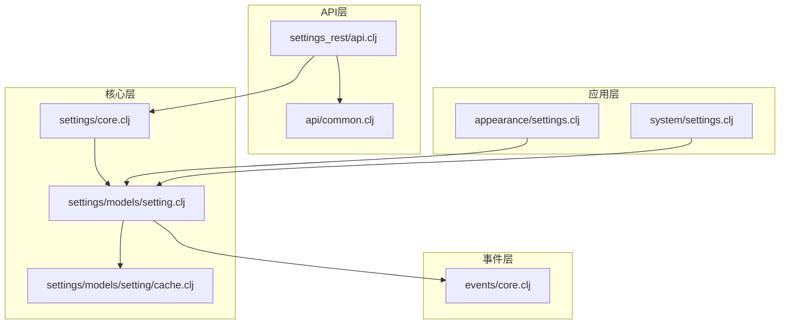
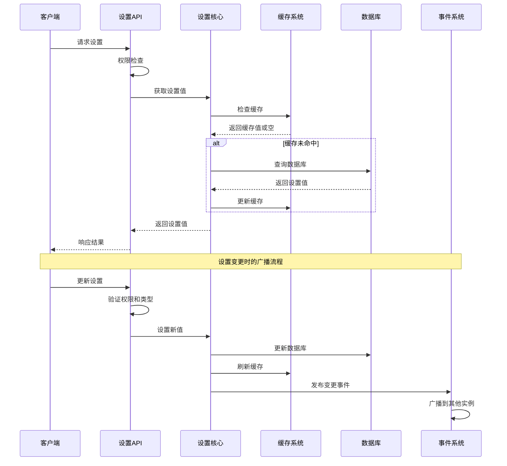
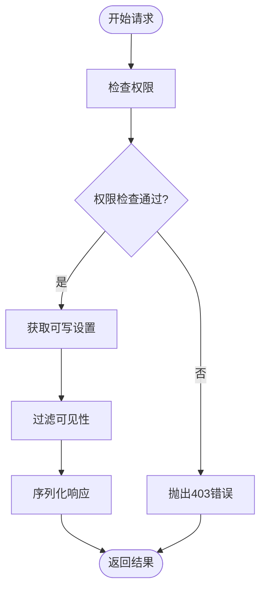
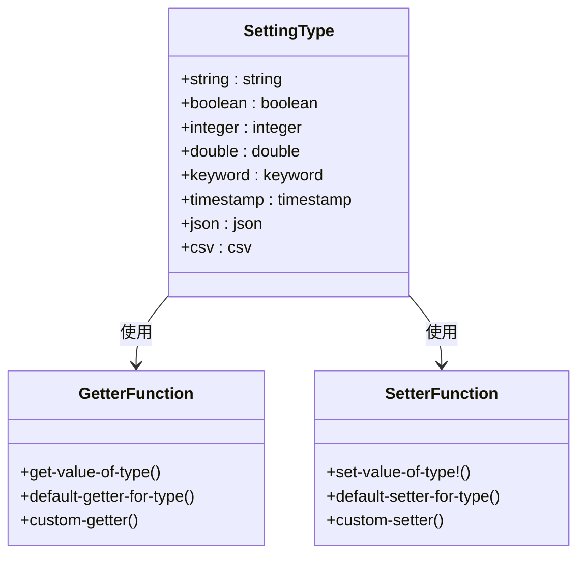
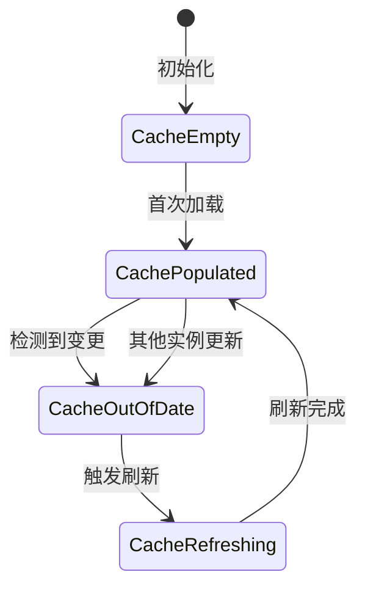
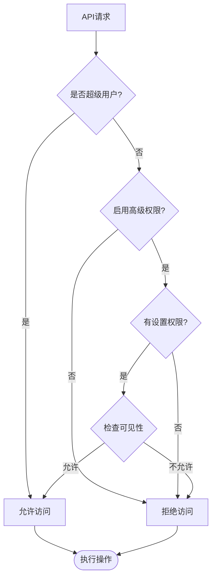
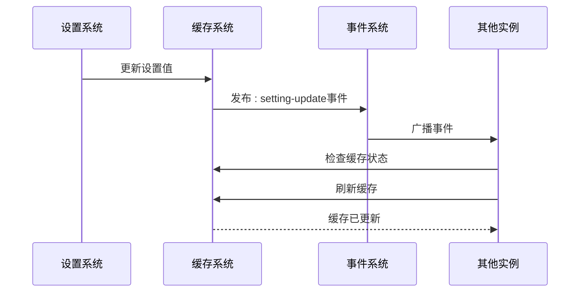
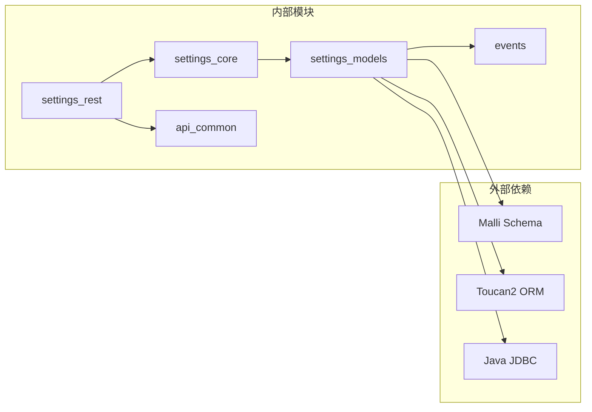

# 系统设置API

<cite>
**本文档中引用的文件**
- [settings_rest/api.clj](file://src/metabase/settings_rest/api.clj)
- [settings/models/setting.clj](file://src/metabase/settings/models/setting.clj)
- [settings/core.clj](file://src/metabase/settings/core.clj)
- [settings/models/setting/cache.clj](file://src/metabase/settings/models/setting/cache.clj)
- [api/common.clj](file://src/metabase/api/common.clj)
- [events/core.clj](file://src/metabase/events/core.clj)
- [appearance/settings.clj](file://src/metabase/appearance/settings.clj)
- [system/settings.clj](file://src/metabase/system/settings.clj)
</cite>

## 目录
1. [简介](#简介)
2. [项目结构](#项目结构)
3. [核心组件](#核心组件)
4. [架构概览](#架构概览)
5. [详细组件分析](#详细组件分析)
6. [依赖关系分析](#依赖关系分析)
7. [性能考虑](#性能考虑)
8. [故障排除指南](#故障排除指南)
9. [结论](#结论)

## 简介

系统设置API是Metabase中用于管理和配置全局系统设置的核心组件。它提供了RESTful接口来读取、更新和管理所有系统级别的配置选项。该API支持多种数据类型、权限控制、缓存机制和广播通知，确保设置变更能够及时传播到整个系统。

## 项目结构

系统设置API的代码分布在多个模块中，形成了一个层次化的架构：

**图表来源**
- [settings_rest/api.clj](file://src/metabase/settings_rest/api.clj#L1-L64)
- [settings/core.clj](file://src/metabase/settings/core.clj#L1-L173)
- [settings/models/setting.clj](file://src/metabase/settings/models/setting.clj#L1-L1696)

**章节来源**
- [settings_rest/api.clj](file://src/metabase/settings_rest/api.clj#L1-L64)
- [settings/core.clj](file://src/metabase/settings/core.clj#L1-L173)

## 核心组件

### 设置API控制器

设置API控制器位于`settings_rest/api.clj`中，提供了四个主要的REST端点：

1. **获取所有设置** - `GET /api/setting/`
2. **批量更新设置** - `PUT /api/setting/`
3. **获取单个设置** - `GET /api/setting/:key`
4. **更新单个设置** - `PUT /api/setting/:key`

### 设置模型

设置模型定义了设置的基本结构和行为，包括：
- 设置类型验证
- 权限控制
- 缓存管理
- 加密支持
- 审计日志

### 缓存系统

设置缓存系统提供了高性能的设置值访问，支持分布式环境下的缓存同步。

**章节来源**
- [settings_rest/api.clj](file://src/metabase/settings_rest/api.clj#L1-L64)
- [settings/models/setting.clj](file://src/metabase/settings/models/setting.clj#L1-L799)

## 架构概览

系统设置API采用分层架构设计，确保了良好的可扩展性和维护性：

**图表来源**
- [settings_rest/api.clj](file://src/metabase/settings_rest/api.clj#L15-L64)
- [settings/models/setting.clj](file://src/metabase/settings/models/setting.clj#L800-L900)
- [settings/models/setting/cache.clj](file://src/metabase/settings/models/setting/cache.clj#L100-L167)

## 详细组件分析

### 设置API端点分析

#### 1. 获取所有设置

**图表来源**
- [settings_rest/api.clj](file://src/metabase/settings_rest/api.clj#L35-L38)

#### 2. 批量更新设置

该端点支持同时更新多个设置项，具有以下特性：
- 类型验证和转换
- 权限控制（仅管理员或设置管理器）
- 事务性操作（全部成功或全部失败）
- 设置变更广播

#### 3. 单个设置操作

支持获取和更新单个设置，包括：
- 键名格式化（kebab-case）
- 敏感设置值的保护
- 环境变量优先级处理

**章节来源**
- [settings_rest/api.clj](file://src/metabase/settings_rest/api.clj#L40-L64)

### 设置模型深度分析

#### 设置定义结构

每个设置都由以下属性定义：

| 属性 | 类型 | 描述 | 默认值 |
|------|------|------|--------|
| name | keyword | 设置名称 | 必需 |
| type | keyword | 数据类型 | :string |
| visibility | keyword | 可见性级别 | :admin |
| default | any | 默认值 | nil |
| sensitive? | boolean | 是否敏感 | false |
| encryption | enum | 加密策略 | :no |
| cache? | boolean | 是否缓存 | true |
| audit | enum | 审计级别 | :no-value |

#### 设置类型系统

**图表来源**
- [settings/models/setting.clj](file://src/metabase/settings/models/setting.clj#L240-L291)
- [settings/models/setting.clj](file://src/metabase/settings/models/setting.clj#L600-L800)

**章节来源**
- [settings/models/setting.clj](file://src/metabase/settings/models/setting.clj#L240-L400)

### 缓存机制分析

#### 分布式缓存同步

设置缓存系统实现了分布式环境下的缓存一致性：

**图表来源**
- [settings/models/setting/cache.clj](file://src/metabase/settings/models/setting/cache.clj#L80-L120)

#### 缓存失效策略

缓存系统使用时间戳机制检测缓存失效：
- `settings-last-updated`字段记录最后更新时间
- 定期检查本地缓存与数据库的时间差
- 支持手动刷新和自动检测

**章节来源**
- [settings/models/setting/cache.clj](file://src/metabase/settings/models/setting/cache.clj#L1-L167)

### 权限控制系统

#### 可见性级别

| 级别 | 描述 | 访问权限 |
|------|------|----------|
| :public | 公开可见 | 所有用户 |
| :authenticated | 已认证用户 | 登录用户 |
| :settings-manager | 设置管理器 | 管理员和设置管理器 |
| :admin | 管理员专用 | 仅管理员 |
| :internal | 内部设置 | 无访问权限 |

#### 权限检查流程

**图表来源**
- [settings/models/setting.clj](file://src/metabase/settings/models/setting.clj#L450-L500)

**章节来源**
- [settings/models/setting.clj](file://src/metabase/settings/models/setting.clj#L450-L550)

### 设置变更广播机制

#### 事件发布流程

当设置发生变更时，系统会发布相应的事件：

**图表来源**
- [settings/models/setting.clj](file://src/metabase/settings/models/setting.clj#L850-L900)

#### 审计日志记录

设置变更会被记录到审计日志中，支持不同的审计级别：
- `:never` - 不记录
- `:no-value` - 记录键名，不记录值
- `:raw-value` - 记录原始值
- `:getter` - 记录经过getter处理后的值

**章节来源**
- [settings/models/setting.clj](file://src/metabase/settings/models/setting.clj#L850-L950)

## 依赖关系分析

### 模块间依赖关系

**图表来源**
- [settings_rest/api.clj](file://src/metabase/settings_rest/api.clj#L1-L10)
- [settings/models/setting.clj](file://src/metabase/settings/models/setting.clj#L1-L30)

### 关键依赖说明

1. **Malli Schema** - 用于参数验证和类型转换
2. **Toucan2 ORM** - 数据库操作抽象层
3. **事件系统** - 设置变更的通知机制
4. **API通用模块** - 路由和权限处理

**章节来源**
- [settings_rest/api.clj](file://src/metabase/settings_rest/api.clj#L1-L15)
- [settings/models/setting.clj](file://src/metabase/settings/models/setting.clj#L1-L30)

## 性能考虑

### 缓存优化策略

1. **内存缓存** - 设置值存储在内存中，访问延迟约60微秒
2. **分布式同步** - 使用时间戳检测缓存一致性
3. **TTL机制** - 定期检查缓存有效性
4. **锁机制** - 防止并发刷新导致的重复工作

### 查询优化

- 使用索引优化数据库查询
- 支持批量操作减少数据库往返
- 智能缓存预热策略

### 并发控制

- 使用重入锁防止缓存刷新冲突
- 原子操作保证设置更新的一致性
- 读写分离优化并发性能

## 故障排除指南

### 常见问题及解决方案

#### 1. 设置权限错误

**问题**：非管理员用户尝试修改设置
**解决方案**：检查用户权限配置，确保用户具有适当的设置权限

#### 2. 缓存不一致

**问题**：设置变更后其他实例未立即生效
**解决方案**：等待缓存自动刷新或手动触发缓存刷新

#### 3. 类型验证失败

**问题**：设置值类型不匹配
**解决方案**：检查设置定义的类型约束，确保提供正确的值类型

#### 4. 环境变量冲突

**问题**：环境变量设置覆盖了数据库设置
**解决方案**：检查环境变量命名规范，确认设置的`can-read-from-env?`属性

**章节来源**
- [settings/models/setting.clj](file://src/metabase/settings/models/setting.clj#L900-L1000)

### 调试工具

1. **设置注册表** - 查看所有已注册的设置
2. **缓存状态监控** - 监控缓存命中率和一致性
3. **审计日志** - 追踪设置变更历史
4. **权限检查工具** - 验证用户访问权限

## 结论

系统设置API为Metabase提供了强大而灵活的配置管理能力。通过分层架构设计、完善的权限控制、高效的缓存机制和可靠的广播通知，它确保了系统的可配置性和可维护性。

### 主要优势

1. **类型安全** - 强类型的设置定义和验证
2. **权限控制** - 细粒度的访问控制和可见性管理
3. **高性能** - 内存缓存和智能刷新策略
4. **可扩展性** - 支持自定义设置类型和行为
5. **可靠性** - 分布式环境下的缓存一致性和事件通知

### 最佳实践建议

1. 合理选择设置的可见性和权限级别
2. 为敏感设置启用加密和适当的审计级别
3. 使用合适的缓存策略平衡性能和一致性
4. 在生产环境中监控设置变更和缓存状态
5. 定期备份和导出设置配置以确保可恢复性

该API的设计充分体现了现代Web应用对配置管理的需求，为Metabase的稳定运行和灵活配置提供了坚实的基础。