# 集合API详细文档

<cite>
**本文档中引用的文件**
- [collections_rest/api.clj](file://src/metabase/collections_rest/api.clj)
- [collections/core.clj](file://src/metabase/collections/core.clj)
- [collections/models/collection.clj](file://src/metabase/collections/models/collection.clj)
- [collections/models/collection/root.clj](file://src/metabase/collections/models/collection/root.clj)
- [permissions/core.clj](file://src/metabase/permissions/core.clj)
</cite>

## 目录
1. [简介](#简介)
2. [项目结构](#项目结构)
3. [核心组件](#核心组件)
4. [架构概览](#架构概览)
5. [详细端点分析](#详细端点分析)
6. [权限验证机制](#权限验证机制)
7. [嵌套集合处理](#嵌套集合处理)
8. [UI使用模式](#ui使用模式)
9. [性能考虑](#性能考虑)
10. [故障排除指南](#故障排除指南)
11. [结论](#结论)

## 简介

Metabase的集合API提供了完整的REST接口来管理仪表板、卡片和其他分析对象的组织结构。该API支持创建、读取、更新和删除集合（文件夹），以及处理复杂的嵌套层次结构和权限控制。

集合系统是Metabase权限模型的核心组成部分，用于组织和控制对分析内容的访问。每个集合都可以包含其他集合、仪表板、卡片、脉冲等不同类型的对象。

## 项目结构

集合API的实现分布在以下关键模块中：

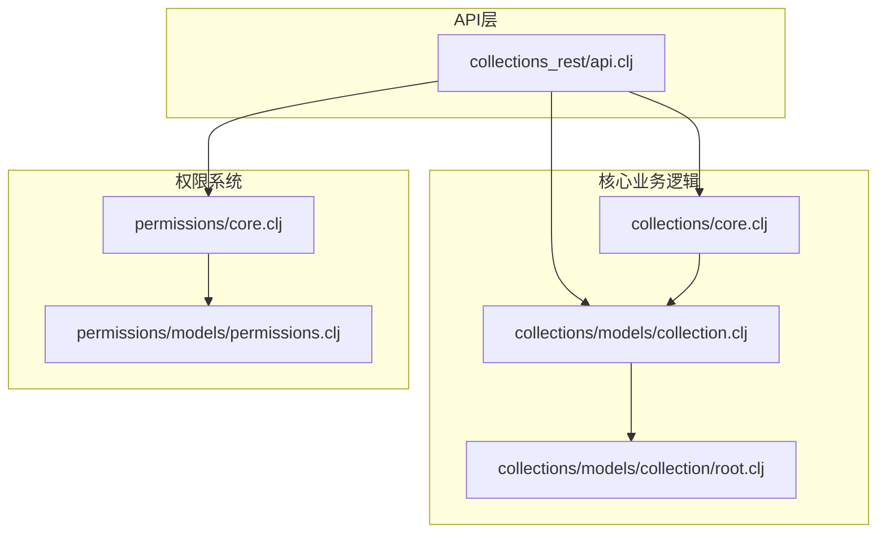

**图表来源**
- [collections_rest/api.clj](file://src/metabase/collections_rest/api.clj#L1-L50)
- [collections/core.clj](file://src/metabase/collections/core.clj#L1-L19)

**章节来源**
- [collections_rest/api.clj](file://src/metabase/collections_rest/api.clj#L1-L50)
- [collections/models/collection.clj](file://src/metabase/collections/models/collection.clj#L1-L50)

## 核心组件

### 集合模型架构

集合系统采用层次化的存储结构，使用位置路径（location paths）来表示嵌套关系：

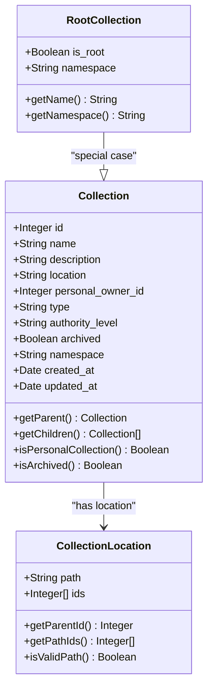

**图表来源**
- [collections/models/collection.clj](file://src/metabase/collections/models/collection.clj#L100-L200)
- [collections/models/collection/root.clj](file://src/metabase/collections/models/collection/root.clj#L1-L76)

### 个人集合系统

个人集合为每个用户自动创建专属的集合空间：

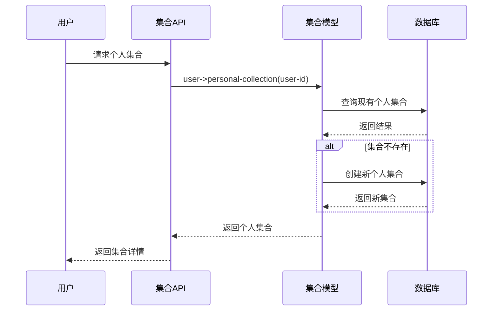

**图表来源**
- [collections/models/collection.clj](file://src/metabase/collections/models/collection.clj#L465-L486)

**章节来源**
- [collections/models/collection.clj](file://src/metabase/collections/models/collection.clj#L465-L486)
- [collections/models/collection/root.clj](file://src/metabase/collections/models/collection/root.clj#L40-L76)

## 架构概览

集合API采用分层架构设计，确保了良好的可扩展性和维护性：

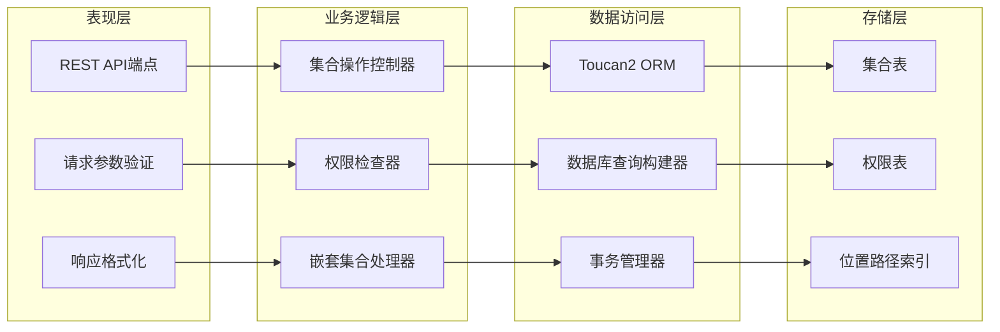

**图表来源**
- [collections_rest/api.clj](file://src/metabase/collections_rest/api.clj#L1-L50)

## 详细端点分析

### 获取集合列表

#### 端点：`GET /api/collection`

**功能描述**：获取当前用户有读取权限的所有集合列表。

**请求参数**：
- `archived` (可选)：是否包含已归档的集合
- `exclude-other-user-collections` (可选)：是否排除其他用户的集合
- `namespace` (可选)：指定命名空间
- `personal-only` (可选)：仅返回个人集合

**响应结构**：
```json
{
  "data": [
    {
      "id": "string",
      "name": "string",
      "description": "string",
      "location": "string",
      "personal_owner_id": "integer",
      "type": "string",
      "authority_level": "string",
      "archived": "boolean",
      "namespace": "string",
      "can_write": "boolean",
      "is_personal": "boolean",
      "can_delete": "boolean",
      "is_remote_synced": "boolean"
    }
  ],
  "total": "integer"
}
```

**权限验证**：基于用户权限集进行过滤，确保只返回用户有权访问的集合。

**章节来源**
- [collections_rest/api.clj](file://src/metabase/collections_rest/api.clj#L100-L150)

### 获取集合树结构

#### 端点：`GET /api/collection/tree`

**功能描述**：以树形结构返回集合层次，包含子节点信息。

**请求参数**：
- `exclude-archived` (可选)：是否排除已归档的集合
- `exclude-other-user-collections` (可选)：是否排除其他用户的集合
- `namespace` (可选)：指定命名空间
- `shallow` (可选)：是否只返回浅层结构
- `collection-id` (可选)：指定父集合ID

**响应结构**：
```json
[
  {
    "name": "string",
    "location": "string",
    "children": "boolean",
    "here": ["card", "dashboard"],
    "below": ["card", "dashboard", "collection"]
  }
]
```

**特殊处理**：
- 支持深度递归查询和浅层查询两种模式
- 自动计算每个节点的类型统计（here/below）
- 处理个人集合的本地化显示

**章节来源**
- [collections_rest/api.clj](file://src/metabase/collections_rest/api.clj#L152-L200)

### 获取单个集合详情

#### 端点：`GET /api/collection/:id`

**功能描述**：获取指定集合的详细信息，包括位置、权限等元数据。

**路径参数**：
- `id`：集合ID或NanoID

**响应包含属性**：
- 基础集合信息
- 有效位置路径
- 父级集合信息
- 权限状态（can_write, can_restore, can_delete）
- 是否为个人集合
- 远程同步状态

**章节来源**
- [collections_rest/api.clj](file://src/metabase/collections_rest/api.clj#L1377-L1397)

### 创建新集合

#### 端点：`POST /api/collection`

**功能描述**：创建新的集合，支持指定父集合和命名空间。

**请求体参数**：
```json
{
  "name": "string",
  "description": "string",
  "parent_id": "integer",
  "namespace": "string",
  "type": "string",
  "authority_level": "string"
}
```

**创建流程**：
1. 验证父集合权限
2. 检查命名空间兼容性
3. 计算位置路径
4. 创建集合记录
5. 发布事件通知

**权限要求**：需要对父集合具有写权限

**章节来源**
- [collections_rest/api.clj](file://src/metabase/collections_rest/api.clj#L1100-L1150)

### 更新集合

#### 端点：`PUT /api/collection/:id`

**功能描述**：更新现有集合的属性，支持移动、归档等操作。

**支持的操作**：
- 修改名称和描述
- 移动到新的父集合
- 归档或取消归档
- 更改类型和权限级别

**特殊处理**：
- 移动操作会触发权限边界检查
- 归档操作会递归处理所有子项
- 类型变更会级联应用到子集合

**章节来源**
- [collections_rest/api.clj](file://src/metabase/collections_rest/api.clj#L1399-L1450)

### 删除集合

#### 端点：`DELETE /api/collection/:id`

**功能描述**：永久删除集合，必须先归档。

**删除条件**：
- 集合必须已归档
- 不允许删除个人集合
- 不允许删除命名空间集合

**清理过程**：
1. 将直接归档的子集合移出
2. 安全删除集合记录
3. 清理相关权限

**章节来源**
- [collections_rest/api.clj](file://src/metabase/collections_rest/api.clj#L1452-L1497)

### 获取集合内容

#### 端点：`GET /api/collection/:id/items`

**功能描述**：获取集合中的具体对象（卡片、仪表板等）。

**请求参数**：
- `models`：指定要包含的对象类型
- `archived`：是否包含已归档的对象
- `pinned_state`：固定状态过滤
- `sort_column`：排序字段
- `sort_direction`：排序方向

**支持的对象类型**：
- `card`：保存的问题
- `dashboard`：仪表板
- `dataset`：模型
- `metric`：指标
- `pulse`：脉冲
- `snippet`：代码片段
- `document`：文档
- `timeline`：时间线

**章节来源**
- [collections_rest/api.clj](file://src/metabase/collections_rest/api.clj#L1499-L1550)

## 权限验证机制

### 权限系统架构

集合权限系统采用双重模型，根据集合是否属于个人集合而采用不同的权限处理方式：

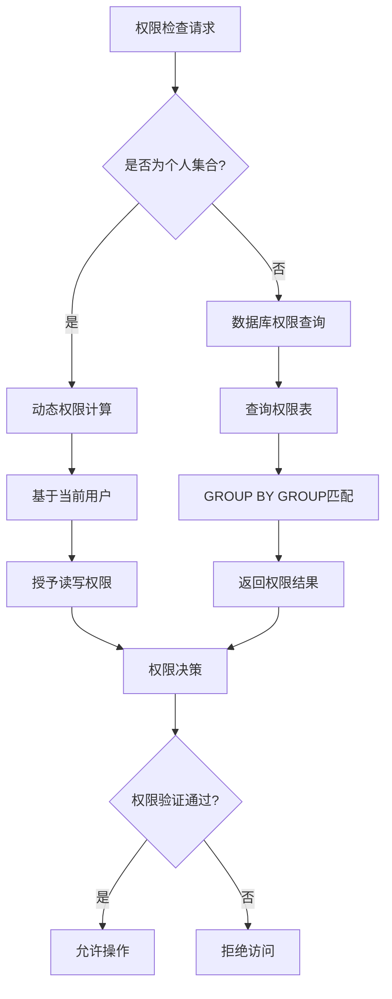

**图表来源**
- [collections/models/collection.clj](file://src/metabase/collections/models/collection.clj#L1550-L1567)

### 可见性配置

权限系统使用可见性配置来控制哪些集合对用户可见：

| 配置项 | 描述 | 默认值 |
|--------|------|--------|
| `include-archived-items` | 包含归档项目的方式 | `exclude` |
| `include-trash-collection?` | 是否包含回收站 | `false` |
| `permission-level` | 权限级别要求 | `read` |
| `effective-child-of` | 有效的子集合限制 | `nil` |
| `archive-operation-id` | 归档操作ID过滤 | `nil` |

**章节来源**
- [collections/models/collection.clj](file://src/metabase/collections/models/collection.clj#L600-L700)

### 个人集合权限

个人集合具有特殊的权限处理逻辑：

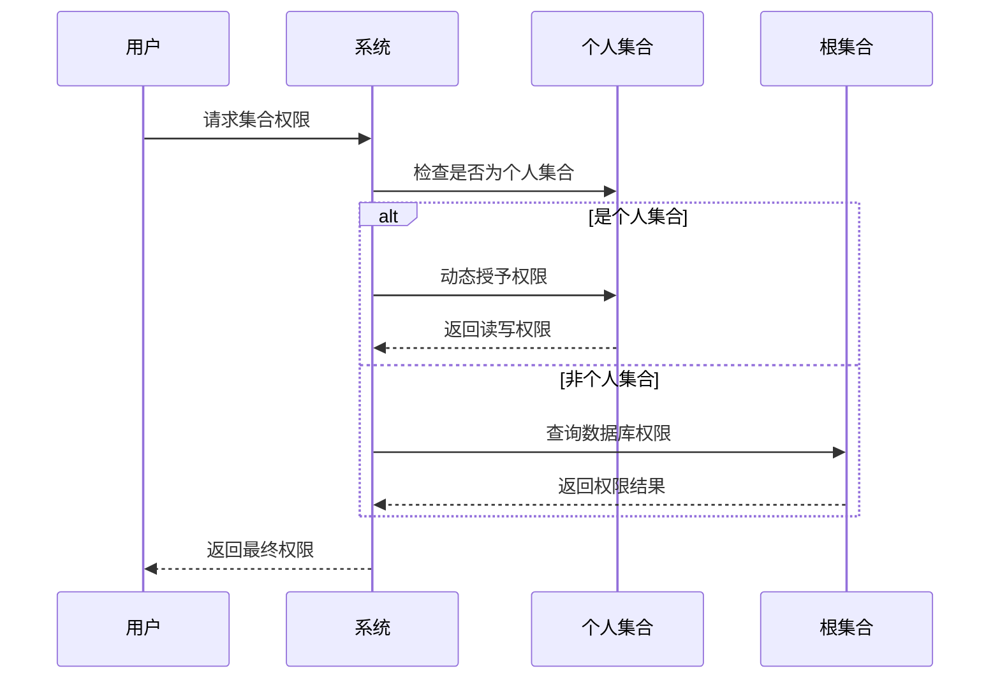

**图表来源**
- [collections/models/collection.clj](file://src/metabase/collections/models/collection.clj#L465-L486)

**章节来源**
- [collections/models/collection.clj](file://src/metabase/collections/models/collection.clj#L1550-L1567)

## 嵌套集合处理

### 位置路径系统

集合使用层次化的路径系统来表示嵌套关系：

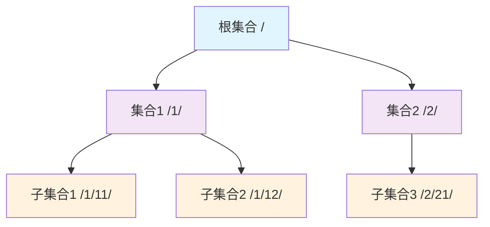

**图表来源**
- [collections/models/collection.clj](file://src/metabase/collections/models/collection.clj#L200-L300)

### 路径验证规则

位置路径必须遵循严格的格式规范：

| 规则 | 描述 | 示例 |
|------|------|------|
| 格式 | 必须以斜杠开头和结尾 | `/1/2/3/` |
| ID唯一性 | 路径中的ID必须唯一 | `/1/2/` ✓，`/1/1/` ✗ |
| 存在性 | 所有引用的集合必须存在 | 已存在的ID集合 |
| 层级限制 | 不允许循环引用 | `/1/2/1/` ✗ |

**章节来源**
- [collections/models/collection.clj](file://src/metabase/collections/models/collection.clj#L276-L300)

### 集合移动和归档

集合的移动和归档操作涉及复杂的权限边界检查：

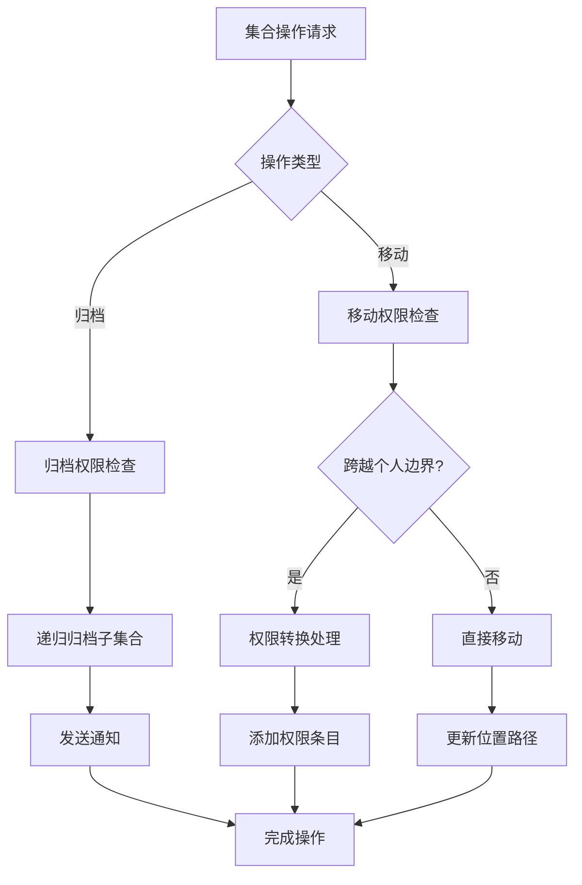

**图表来源**
- [collections_rest/api.clj](file://src/metabase/collections_rest/api.clj#L1200-L1300)

**章节来源**
- [collections_rest/api.clj](file://src/metabase/collections_rest/api.clj#L1200-L1350)

## UI使用模式

### 根集合视图

根集合提供了一个统一的入口点，展示用户可以访问的所有顶级内容：

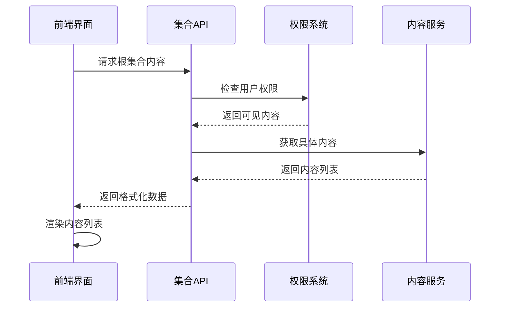

**图表来源**
- [collections_rest/api.clj](file://src/metabase/collections_rest/api.clj#L1000-L1100)

### 集合树导航

集合树结构支持高效的层级浏览：

| 特性 | 实现方式 | 性能优化 |
|------|----------|----------|
| 懒加载 | 按需加载子节点 | 延迟查询 |
| 缓存 | 位置路径缓存 | 内存缓存 |
| 排序 | 多维度排序 | 数据库索引 |
| 过滤 | 权限过滤 | 权限预计算 |

**章节来源**
- [collections_rest/api.clj](file://src/metabase/collections_rest/api.clj#L150-L200)

### 对象类型处理

不同类型的对象在集合中以统一的格式呈现：

```mermaid
classDiagram
class CollectionItem {
+String model
+String name
+String description
+Integer id
+Date last_edit_timestamp
+Object last_edit_user
+Boolean archived
+String collection_position
}
class CardItem {
+String display
+String collection_preview
+Integer database_id
+Object dataset_query
+String query_type
}
class DashboardItem {
+Integer dashboard_id
+Integer last_used_at
+Object moderation_status
}
class CollectionItem <|-- CardItem
class CollectionItem <|-- DashboardItem
```

**图表来源**
- [collections_rest/api.clj](file://src/metabase/collections_rest/api.clj#L300-L400)

**章节来源**
- [collections_rest/api.clj](file://src/metabase/collections_rest/api.clj#L300-L500)

## 性能考虑

### 查询优化策略

集合API采用了多种查询优化技术：

| 优化技术 | 应用场景 | 效果 |
|----------|----------|------|
| CTE（公用表表达式） | 可见性查询 | 减少重复计算 |
| 分页查询 | 大量数据集 | 控制内存使用 |
| 缓存机制 | 权限检查 | 减少数据库查询 |
| 批量操作 | 权限批量更新 | 提高并发性能 |

### 内存管理

系统实现了智能的内存管理策略：

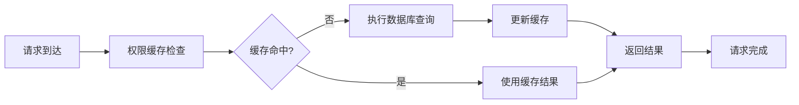

**图表来源**
- [collections/models/collection.clj](file://src/metabase/collections/models/collection.clj#L600-L650)

### 并发控制

集合操作支持并发安全的事务处理：

- **乐观锁**：使用版本号防止并发冲突
- **死锁检测**：自动检测和重试死锁情况
- **批量操作**：减少事务开销

**章节来源**
- [collections/models/collection.clj](file://src/metabase/collections/models/collection.clj#L600-L700)

## 故障排除指南

### 常见错误及解决方案

| 错误类型 | 症状 | 解决方案 |
|----------|------|----------|
| 权限不足 | 403 Forbidden | 检查用户权限设置 |
| 路径无效 | 400 Bad Request | 验证位置路径格式 |
| 集合不存在 | 404 Not Found | 确认集合ID正确性 |
| 移动失败 | 400 Bad Request | 检查目标权限和约束 |

### 调试工具

集合API提供了多种调试和监控工具：

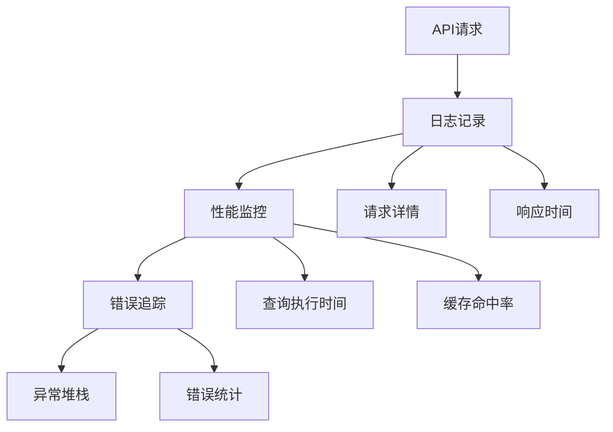

**章节来源**
- [collections_rest/api.clj](file://src/metabase/collections_rest/api.clj#L1-L50)

### 最佳实践建议

1. **权限设计**：合理规划集合层次和权限边界
2. **性能优化**：使用适当的分页和缓存策略
3. **错误处理**：实现健壮的错误恢复机制
4. **监控告警**：建立完善的监控和告警体系

## 结论

Metabase的集合API提供了一个功能完整、性能优异的集合管理系统。通过分层架构设计、智能权限验证和高效的查询优化，它能够满足复杂的企业级数据分析需求。

主要优势包括：
- **灵活的层次结构**：支持任意深度的嵌套集合
- **强大的权限控制**：区分个人集合和普通集合的不同权限模型
- **高性能查询**：优化的数据库查询和智能缓存机制
- **丰富的功能**：完整的CRUD操作和高级特性如归档、移动等

未来的改进方向可能包括：
- 更细粒度的权限控制
- 更高效的批量操作
- 更完善的审计和追踪功能
- 更好的移动端支持