# 业务逻辑层架构文档

<cite>
**本文档中引用的文件**
- [query_processor.clj](file://src/metabase/query_processor.clj)
- [driver.clj](file://src/metabase/driver.clj)
- [permissions/core.clj](file://src/metabase/permissions/core.clj)
- [sync/core.clj](file://src/metabase/sync/core.clj)
- [query_processor/middleware/cache.clj](file://src/metabase/query_processor/middleware/cache.clj)
- [query_processor/middleware/permissions.clj](file://src/metabase/query_processor/middleware/permissions.clj)
- [query_processor/compile.clj](file://src/metabase/query_processor/compile.clj)
- [query_processor/execute.clj](file://src/metabase/query_processor/execute.clj)
- [driver/sql/query_processor.clj](file://src/metabase/driver/sql/query_processor.clj)
- [driver/sql_jdbc/execute.clj](file://src/metabase/driver/sql_jdbc/execute.clj)
- [driver/sql_jdbc/connection.clj](file://src/metabase/driver/sql_jdbc/connection.clj)
- [permissions/models/data_permissions.clj](file://src/metabase/permissions/models/data_permissions.clj)
- [sync/sync_metadata.clj](file://src/metabase/sync/sync_metadata.clj)
- [sync/task/sync_databases.clj](file://src/metabase/sync/task/sync_databases.clj)
- [queries/card.clj](file://src/metabase/queries/card.clj)
</cite>

## 目录
1. [引言](#引言)
2. [系统架构概览](#系统架构概览)
3. [查询处理器核心](#查询处理器核心)
4. [权限控制系统](#权限控制系统)
5. [驱动程序抽象层](#驱动程序抽象层)
6. [元数据同步机制](#元数据同步机制)
7. [业务流程详解](#业务流程详解)
8. [组件间交互关系](#组件间交互关系)
9. [性能优化策略](#性能优化策略)
10. [总结](#总结)

## 引言

Metabase的业务逻辑层是整个系统的核心，负责处理用户查询、权限验证、数据访问和系统维护等关键功能。该层采用模块化设计，通过清晰的职责分离和可扩展的架构模式，实现了高度灵活的数据分析平台。

本文档深入解析了Metabase业务逻辑层的四大核心模块：查询处理器（Query Processor）、权限控制系统（Permissions）、驱动程序抽象层（Driver）和元数据同步系统（Sync），揭示了它们如何协同工作以支持复杂的业务需求。

## 系统架构概览

Metabase业务逻辑层采用分层架构设计，从上到下包含以下主要层次：

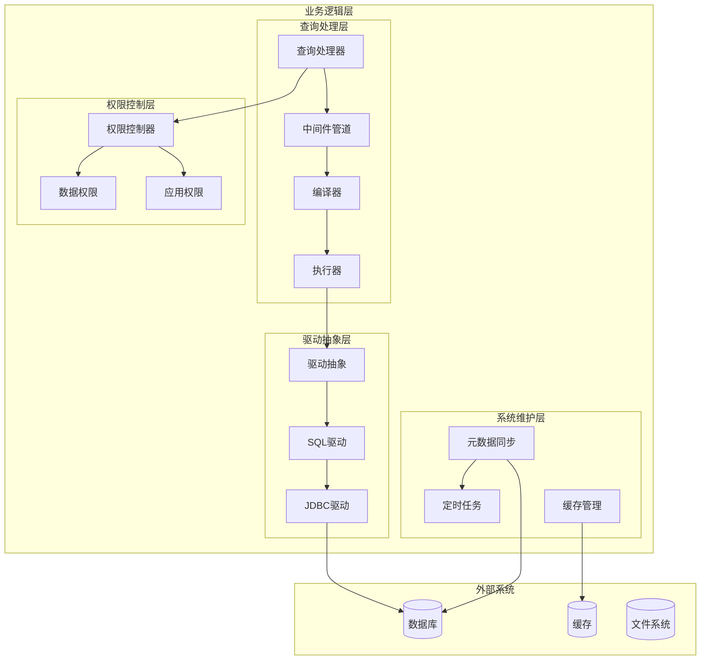

**图表来源**
- [query_processor.clj](file://src/metabase/query_processor.clj#L1-L117)
- [driver.clj](file://src/metabase/driver.clj#L1-L799)
- [permissions/core.clj](file://src/metabase/permissions/core.clj#L1-L127)
- [sync/core.clj](file://src/metabase/sync/core.clj#L1-L37)

## 查询处理器核心

查询处理器（Query Processor）是Metabase的核心组件，负责将用户提交的MBQL查询转换为可执行的原生SQL语句，并执行查询结果的后处理。

### 查询处理流水线

查询处理器采用管道模式，通过多个中间件对查询进行预处理、编译、执行和后处理：

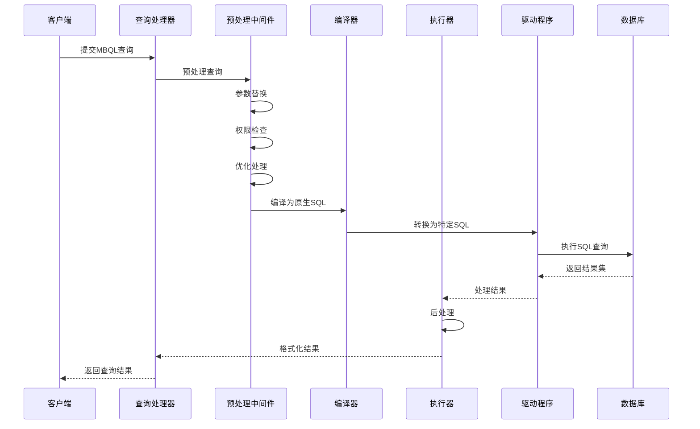

**图表来源**
- [query_processor.clj](file://src/metabase/query_processor.clj#L24-L52)
- [query_processor/execute.clj](file://src/metabase/query_processor/execute.clj#L1-L98)

### 中间件管道架构

查询处理器使用环绕中间件模式，形成一个强大的处理管道：

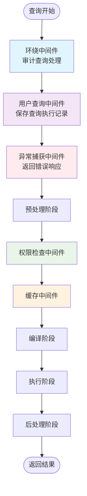

**图表来源**
- [query_processor.clj](file://src/metabase/query_processor.clj#L24-L52)
- [query_processor/execute.clj](file://src/metabase/query_processor/execute.clj#L30-L63)

### 查询编译过程

查询编译是将MBQL转换为特定数据库原生SQL的关键步骤：

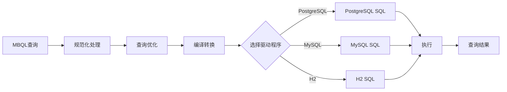

**图表来源**
- [query_processor/compile.clj](file://src/metabase/query_processor/compile.clj#L1-L97)
- [driver/sql/query_processor.clj](file://src/metabase/driver/sql/query_processor.clj#L1-L199)

**章节来源**
- [query_processor.clj](file://src/metabase/query_processor.clj#L1-L117)
- [query_processor/compile.clj](file://src/metabase/query_processor/compile.clj#L1-L97)
- [query_processor/execute.clj](file://src/metabase/query_processor/execute.clj#L1-L98)

## 权限控制系统

权限控制系统提供了细粒度的访问控制机制，确保用户只能访问被授权的数据和功能。

### 权限模型架构

权限系统采用分层权限模型，包含应用级权限和数据级权限：

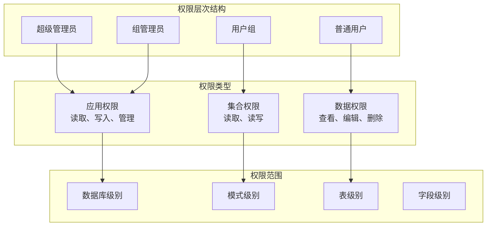

**图表来源**
- [permissions/core.clj](file://src/metabase/permissions/core.clj#L1-L127)
- [permissions/models/data_permissions.clj](file://src/metabase/permissions/models/data_permissions.clj#L1-L199)

### 数据权限控制

数据权限系统实现了基于行和列的细粒度访问控制：

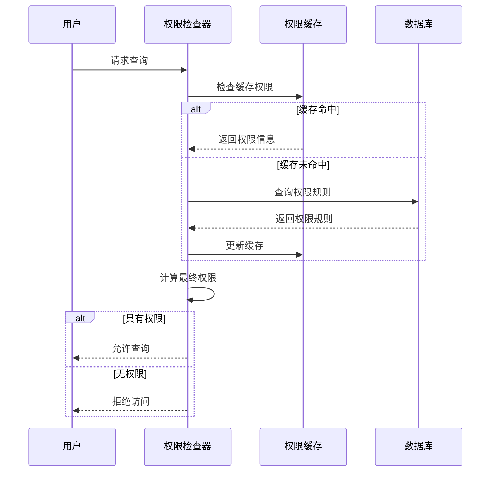

**图表来源**
- [permissions/models/data_permissions.clj](file://src/metabase/permissions/models/data_permissions.clj#L1-L199)
- [query_processor/middleware/permissions.clj](file://src/metabase/query_processor/middleware/permissions.clj#L1-L199)

### 权限验证流程

权限验证在查询执行前进行，确保用户具有适当的访问权限：

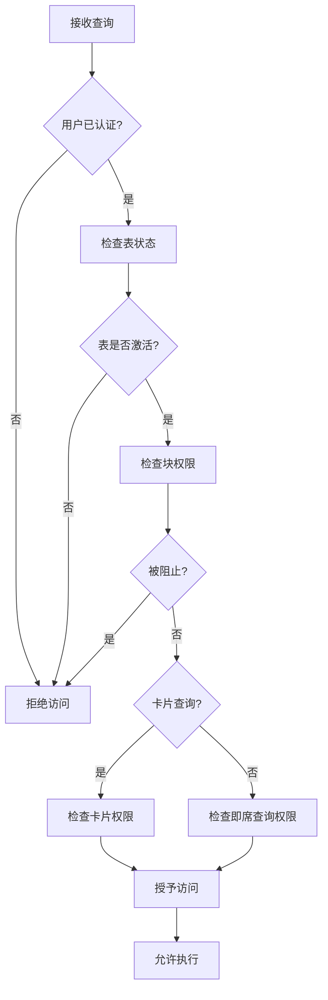

**图表来源**
- [query_processor/middleware/permissions.clj](file://src/metabase/query_processor/middleware/permissions.clj#L46-L73)

**章节来源**
- [permissions/core.clj](file://src/metabase/permissions/core.clj#L1-L127)
- [permissions/models/data_permissions.clj](file://src/metabase/permissions/models/data_permissions.clj#L1-L199)
- [query_processor/middleware/permissions.clj](file://src/metabase/query_processor/middleware/permissions.clj#L1-L199)

## 驱动程序抽象层

驱动程序抽象层提供了统一的数据库访问接口，支持多种数据库类型的无缝集成。

### 驱动程序架构

驱动程序采用多态设计，通过继承层次结构实现不同数据库的支持：

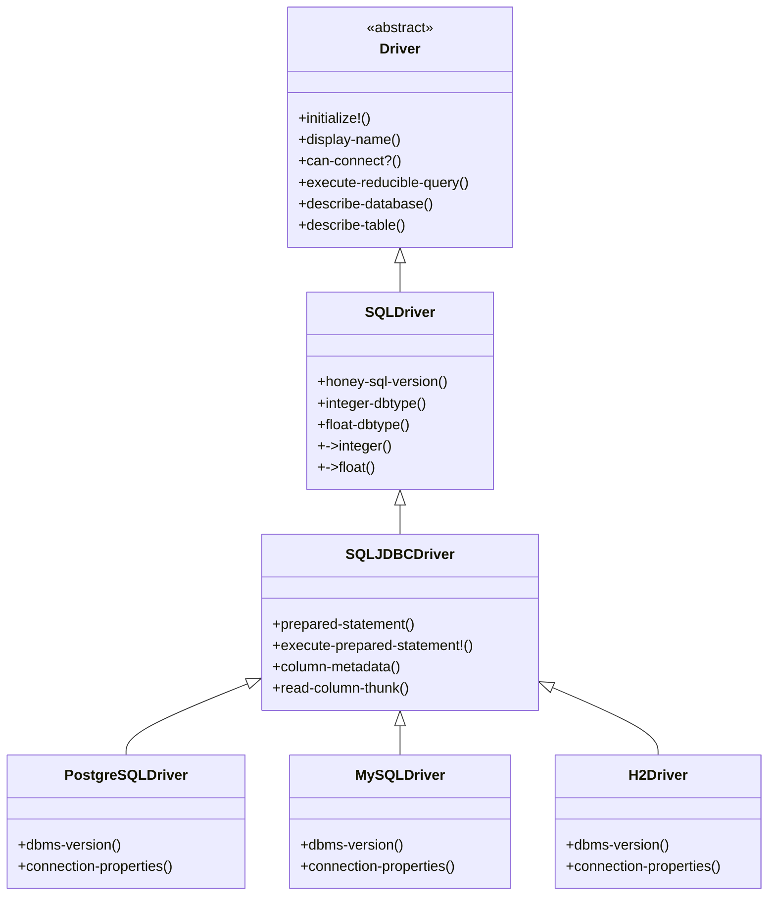

**图表来源**
- [driver.clj](file://src/metabase/driver.clj#L1-L799)
- [driver/sql/query_processor.clj](file://src/metabase/driver/sql/query_processor.clj#L1-L199)

### 连接管理

驱动程序提供了完整的连接生命周期管理：

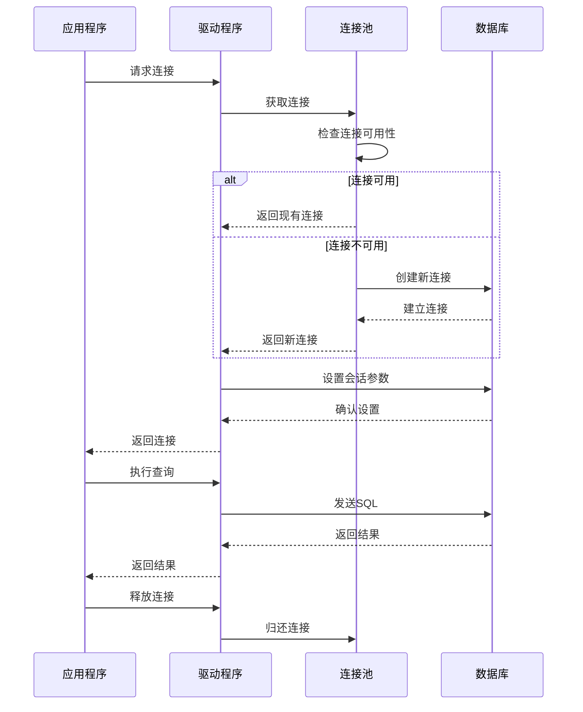

**图表来源**
- [driver/sql_jdbc/connection.clj](file://src/metabase/driver/sql_jdbc/connection.clj#L1-L33)
- [driver/sql_jdbc/execute.clj](file://src/metabase/driver/sql_jdbc/execute.clj#L1-L199)

### 查询执行流程

驱动程序负责将编译后的SQL转换为数据库特定的执行格式：

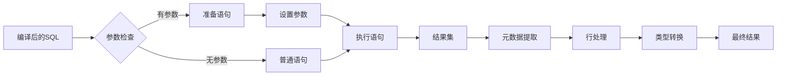

**图表来源**
- [driver/sql_jdbc/execute.clj](file://src/metabase/driver/sql_jdbc/execute.clj#L1-L199)

**章节来源**
- [driver.clj](file://src/metabase/driver.clj#L1-L799)
- [driver/sql/query_processor.clj](file://src/metabase/driver/sql/query_processor.clj#L1-L199)
- [driver/sql_jdbc/execute.clj](file://src/metabase/driver/sql_jdbc/execute.clj#L1-L199)

## 元数据同步机制

元数据同步系统负责定期更新和维护数据库的结构信息，确保Metabase能够准确反映底层数据的变化。

### 同步任务架构

同步系统采用分阶段的任务调度模式：

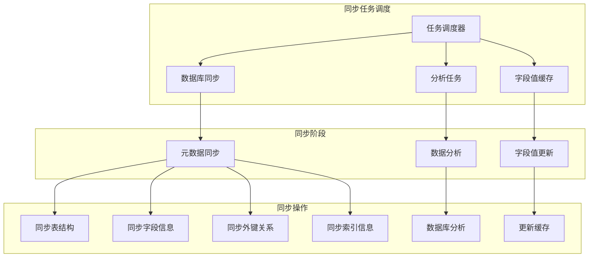

**图表来源**
- [sync/core.clj](file://src/metabase/sync/core.clj#L1-L37)
- [sync/sync_metadata.clj](file://src/metabase/sync/sync_metadata.clj#L1-L79)
- [sync/task/sync_databases.clj](file://src/metabase/sync/task/sync_databases.clj#L1-L370)

### 元数据同步流程

元数据同步按照严格的顺序执行，确保数据一致性：

```mermaid
sequenceDiagram
participant Scheduler as 调度器
participant Sync as 同步服务
participant Fetch as 元数据获取
participant DB as 数据库
subgraph "同步步骤"
Step1[版本检测]
Step2[时区同步]
Step3[表同步]
Step4[字段同步]
Step5[外键同步]
Step6[索引同步]
Step7[元数据表同步]
end
Scheduler->>Sync : 启动同步任务
Sync->>Fetch : 获取数据库元数据
Fetch->>DB : 查询数据库结构
DB-->>Fetch : 返回元数据
Fetch-->>Sync : 元数据就绪
Sync->>Step1 : 版本检测
Step1->>Step2 : 时区同步
Step2->>Step3 : 表同步
Step3->>Step4 : 字段同步
Step4->>Step5 : 外键同步
Step5->>Step6 : 索引同步
Step6->>Step7 : 元数据表同步
Step7-->>Sync : 同步完成
Sync-->>Scheduler : 报告结果
```

**图表来源**
- [sync/sync_metadata.clj](file://src/metabase/sync/sync_metadata.clj#L52-L71)
- [sync/task/sync_databases.clj](file://src/metabase/sync/task/sync_databases.clj#L58-L82)

### 定时同步策略

系统采用智能的定时同步策略，平衡性能和数据准确性：

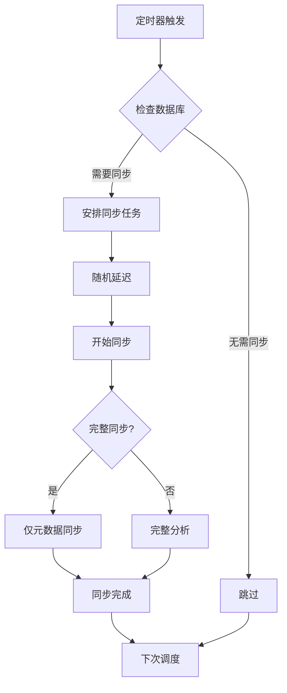

**图表来源**
- [sync/task/sync_databases.clj](file://src/metabase/sync/task/sync_databases.clj#L338-L370)

**章节来源**
- [sync/core.clj](file://src/metabase/sync/core.clj#L1-L37)
- [sync/sync_metadata.clj](file://src/metabase/sync/sync_metadata.clj#L1-L79)
- [sync/task/sync_databases.clj](file://src/metabase/sync/task/sync_databases.clj#L1-L370)

## 业务流程详解

### 卡片创建流程

卡片是Metabase中的核心概念，代表一个预定义的查询和可视化配置：

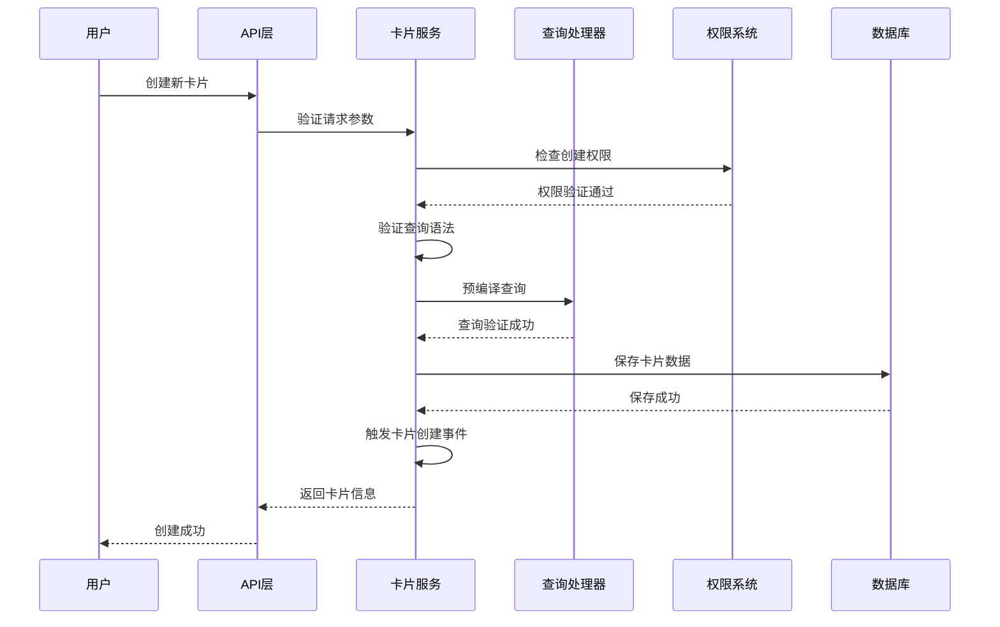

**图表来源**
- [queries/card.clj](file://src/metabase/queries/card.clj#L1-L73)

### 查询执行流程

查询执行是业务逻辑层最复杂的流程之一，涉及多个组件的协调：

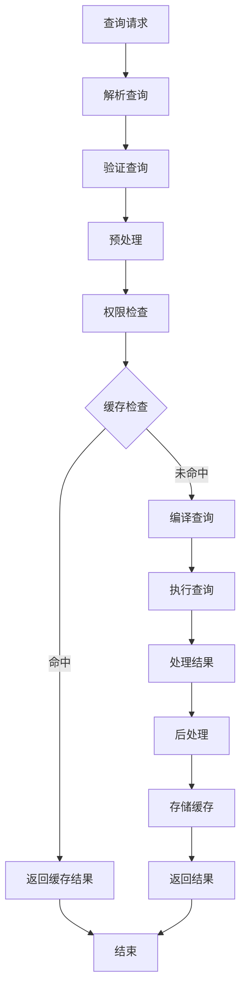

### 仪表板刷新流程

仪表板刷新涉及多个卡片的并发执行和结果聚合：

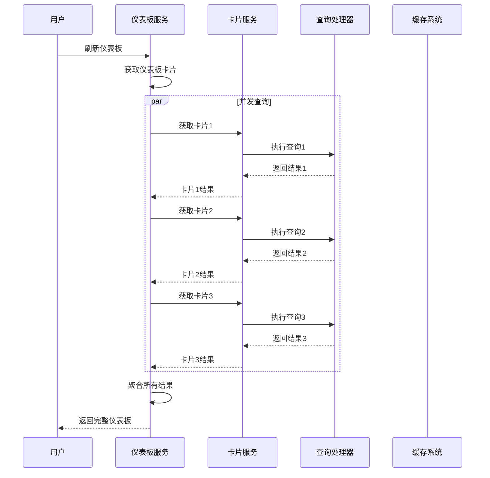

**章节来源**
- [queries/card.clj](file://src/metabase/queries/card.clj#L1-L73)

## 组件间交互关系

### 查询处理链路

查询处理涉及多个组件的紧密协作：

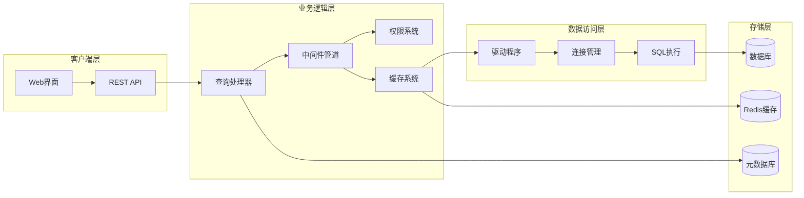

### 权限验证链路

权限验证贯穿整个查询处理流程：

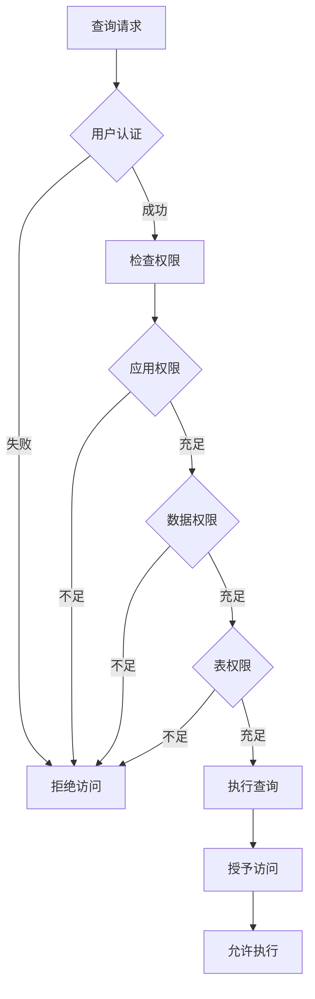

### 缓存策略

缓存系统在查询处理中发挥重要作用：

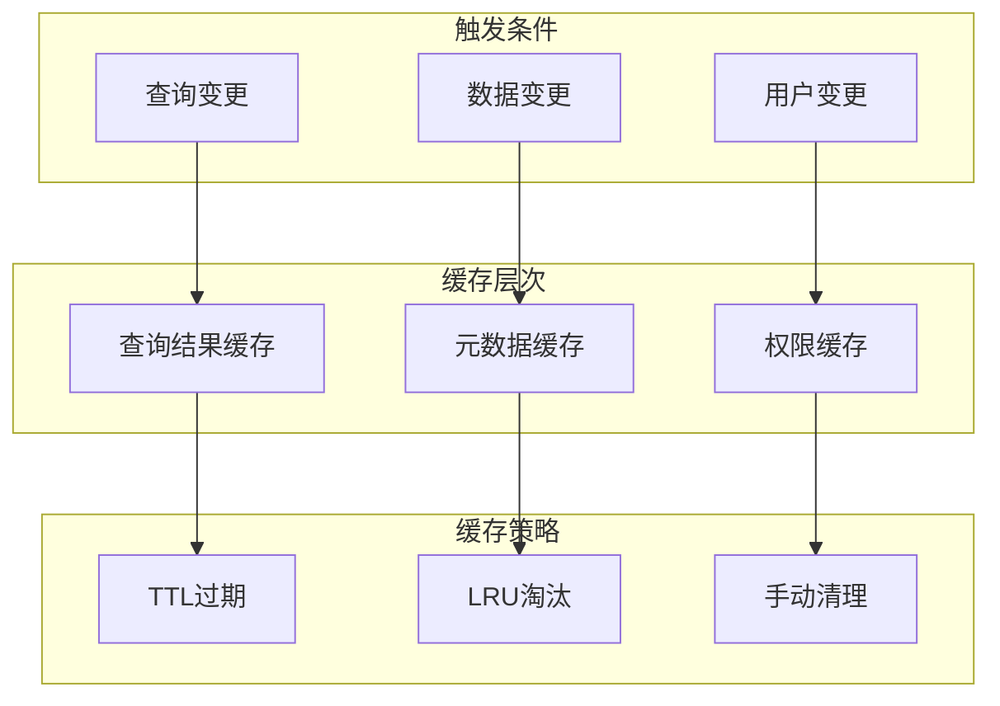

**章节来源**
- [query_processor.clj](file://src/metabase/query_processor.clj#L24-L52)
- [query_processor/middleware/cache.clj](file://src/metabase/query_processor/middleware/cache.clj#L1-L245)

## 性能优化策略

### 查询优化

查询处理器采用多种优化策略提升性能：

1. **查询缓存**：避免重复执行相同查询
2. **参数内联**：减少参数序列化开销
3. **连接池管理**：优化数据库连接利用率
4. **批量操作**：减少网络往返次数

### 权限优化

权限系统采用缓存和预计算策略：

1. **权限缓存**：缓存用户权限信息
2. **权限预加载**：预先加载常用权限
3. **权限合并**：合并相似权限规则
4. **权限失效**：及时清理过期缓存

### 同步优化

元数据同步采用增量更新策略：

1. **差异检测**：只同步变化的部分
2. **并发处理**：并行处理多个表
3. **智能调度**：根据数据变化频率调整同步频率
4. **资源限制**：控制同步资源使用

## 总结

Metabase的业务逻辑层展现了优秀的软件架构设计，通过模块化、可扩展的设计模式，实现了复杂数据分析平台的核心功能。四大核心模块——查询处理器、权限控制系统、驱动程序抽象层和元数据同步系统——各司其职，相互协作，形成了一个高效、安全、可维护的业务逻辑框架。

该架构的主要优势包括：

1. **高度模块化**：每个模块职责明确，便于维护和扩展
2. **强类型安全**：使用Malli schema确保数据完整性
3. **性能优化**：多层次缓存和优化策略
4. **安全性**：细粒度权限控制和审计日志
5. **可扩展性**：插件化设计支持新数据库类型

这种设计不仅满足了当前的功能需求，也为未来的功能扩展和性能优化奠定了坚实的基础。