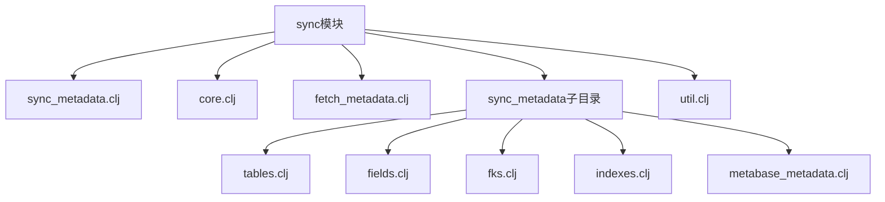
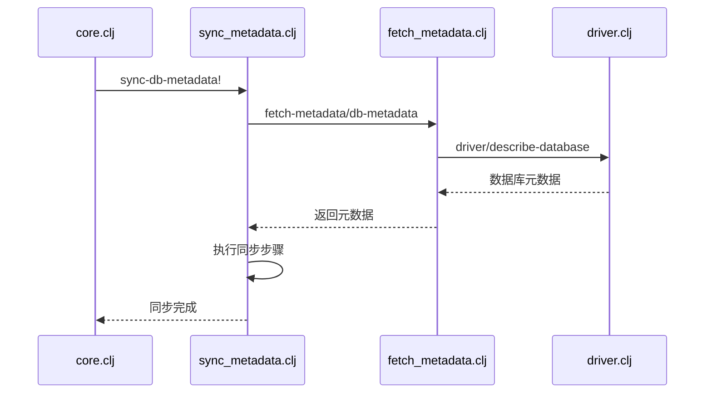
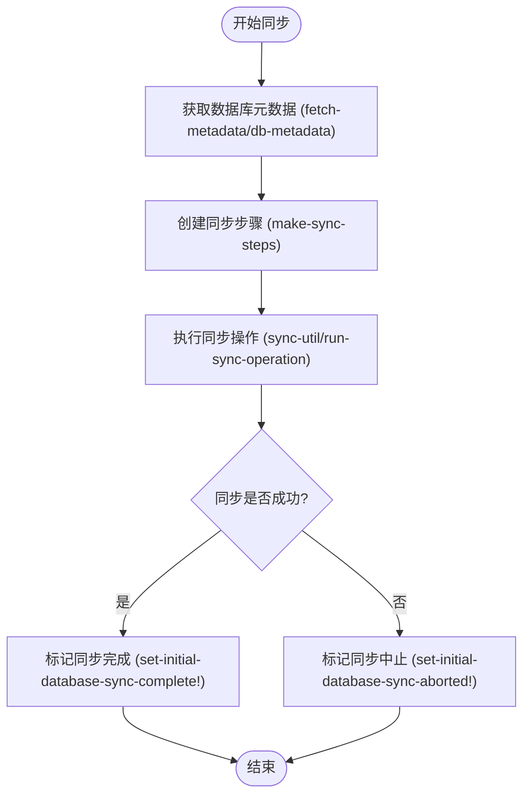
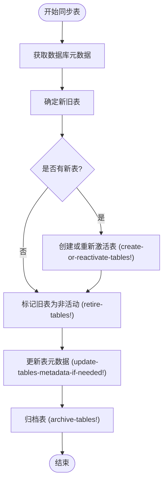
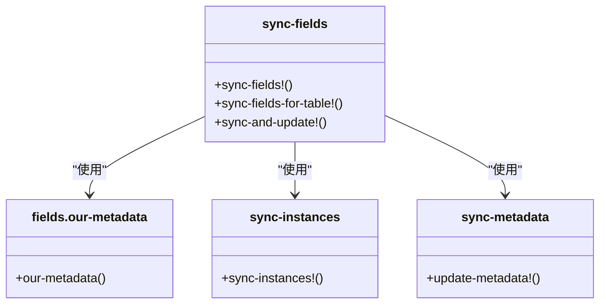
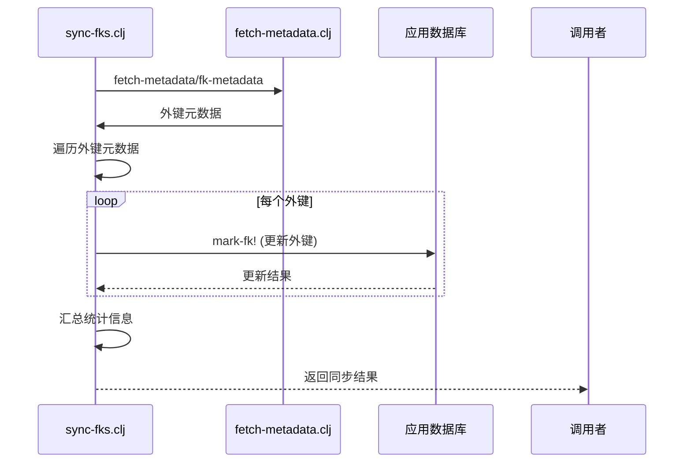
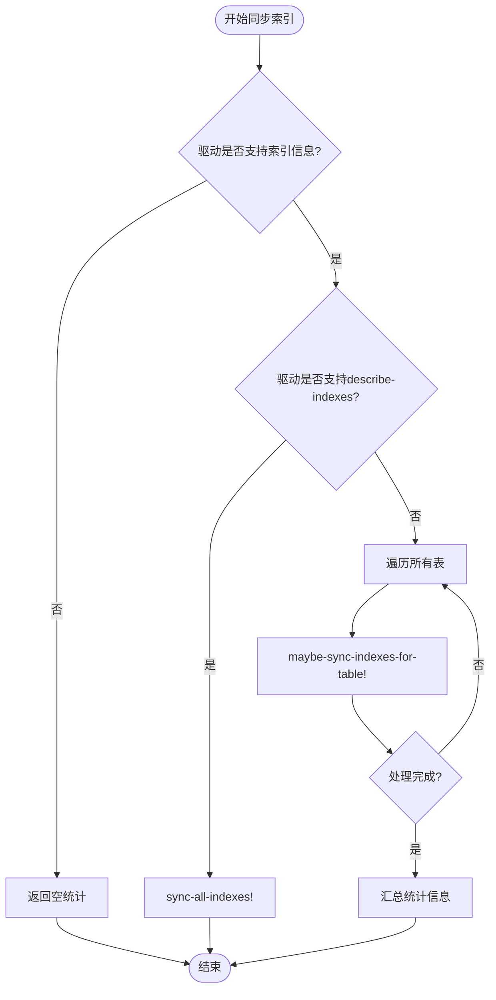
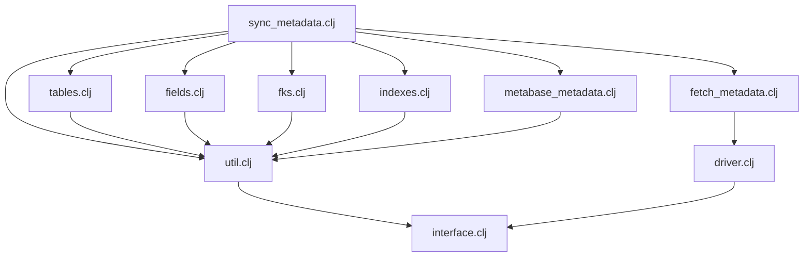

# 元数据同步

<cite>
**本文档引用的文件**  
- [sync_metadata.clj](file://src/metabase/sync/sync_metadata.clj)
- [core.clj](file://src/metabase/sync/core.clj)
- [fetch_metadata.clj](file://src/metabase/sync/fetch_metadata.clj)
- [tables.clj](file://src/metabase/sync/sync_metadata/tables.clj)
- [fields.clj](file://src/metabase/sync/sync_metadata/fields.clj)
- [fks.clj](file://src/metabase/sync/sync_metadata/fks.clj)
- [indexes.clj](file://src/metabase/sync/sync_metadata/indexes.clj)
- [util.clj](file://src/metabase/sync/util.clj)
- [driver.clj](file://src/metabase/driver.clj)
</cite>

## 目录
1. [引言](#引言)
2. [项目结构](#项目结构)
3. [核心组件](#核心组件)
4. [架构概述](#架构概述)
5. [详细组件分析](#详细组件分析)
6. [依赖分析](#依赖分析)
7. [性能考虑](#性能考虑)
8. [故障排除指南](#故障排除指南)
9. [结论](#结论)

## 引言
元数据同步机制是Metabase系统中的关键功能，负责将外部数据库的结构信息同步到Metabase应用数据库中。该机制通过遍历数据库、表、字段等元数据，确保Metabase中的元数据模型与外部数据源保持一致。本文档详细描述了`sync_metadata.clj`文件如何实现这一同步过程，重点分析了`sync-database!`和`sync-tables!`等核心函数的工作流程。

## 项目结构
元数据同步功能主要位于`src/metabase/sync`目录下，其核心组件包括：

**Diagram sources**  
- [sync_metadata.clj](file://src/metabase/sync/sync_metadata.clj)
- [core.clj](file://src/metabase/sync/core.clj)

**Section sources**
- [sync_metadata.clj](file://src/metabase/sync/sync_metadata.clj)
- [core.clj](file://src/metabase/sync/core.clj)

## 核心组件
元数据同步机制的核心组件包括`sync_metadata.clj`、`fetch_metadata.clj`和`util.clj`等文件。这些组件协同工作，实现了从外部数据库获取元数据并将其持久化到应用数据库的完整流程。

**Section sources**
- [sync_metadata.clj](file://src/metabase/sync/sync_metadata.clj)
- [fetch_metadata.clj](file://src/metabase/sync/fetch_metadata.clj)
- [util.clj](file://src/metabase/sync/util.clj)

## 架构概述
元数据同步的整体架构遵循分层设计原则，从驱动接口到同步核心，再到具体实现，形成了清晰的调用链路。

**Diagram sources**  
- [sync_metadata.clj](file://src/metabase/sync/sync_metadata.clj)
- [fetch_metadata.clj](file://src/metabase/sync/fetch_metadata.clj)
- [driver.clj](file://src/metabase/driver.clj)

## 详细组件分析

### sync-db-metadata! 函数分析
`sync-db-metadata!`函数是元数据同步的入口点，负责协调整个同步过程。该函数通过`make-sync-steps`创建一系列同步步骤，然后按顺序执行。

**Diagram sources**  
- [sync_metadata.clj](file://src/metabase/sync/sync_metadata.clj#L60-L78)

**Section sources**
- [sync_metadata.clj](file://src/metabase/sync/sync_metadata.clj#L60-L78)

### sync-tables-and-database! 函数分析
`sync-tables-and-database!`函数负责同步数据库中的表结构信息。该函数通过比较外部数据库和Metabase应用数据库中的表信息，执行创建、更新或删除操作。

**Diagram sources**  
- [tables.clj](file://src/metabase/sync/sync_metadata/tables.clj#L354-L408)

**Section sources**
- [tables.clj](file://src/metabase/sync/sync_metadata/tables.clj#L354-L408)

### 字段同步分析
字段同步机制通过`sync-fields!`函数实现，该函数负责同步表中的字段信息。同步过程包括获取字段元数据、同步字段实例和更新字段元数据三个主要步骤。

**Diagram sources**  
- [fields.clj](file://src/metabase/sync/sync_metadata/fields.clj#L100-L147)

**Section sources**
- [fields.clj](file://src/metabase/sync/sync_metadata/fields.clj#L100-L147)

### 外键同步分析
外键同步机制通过`sync-fks!`函数实现，该函数负责同步表之间的外键关系。同步过程通过SQL查询更新字段的外键目标字段ID。

**Diagram sources**  
- [fks.clj](file://src/metabase/sync/sync_metadata/fks.clj#L100-L149)

**Section sources**
- [fks.clj](file://src/metabase/sync/sync_metadata/fks.clj#L100-L149)

### 索引同步分析
索引同步机制通过`maybe-sync-indexes!`函数实现，该函数负责同步表的索引信息。同步过程比较现有索引和新获取的索引，执行添加或移除操作。

**Diagram sources**  
- [indexes.clj](file://src/metabase/sync/sync_metadata/indexes.clj#L50-L119)

**Section sources**
- [indexes.clj](file://src/metabase/sync/sync_metadata/indexes.clj#L50-L119)

## 依赖分析
元数据同步机制依赖于多个组件和接口，形成了复杂的依赖关系网络。

**Diagram sources**  
- [sync_metadata.clj](file://src/metabase/sync/sync_metadata.clj)
- [fetch_metadata.clj](file://src/metabase/sync/fetch_metadata.clj)
- [util.clj](file://src/metabase/sync/util.clj)

**Section sources**
- [sync_metadata.clj](file://src/metabase/sync/sync_metadata.clj)
- [fetch_metadata.clj](file://src/metabase/sync/fetch_metadata.clj)
- [util.clj](file://src/metabase/sync/util.clj)

## 性能考虑
元数据同步机制在设计时考虑了性能优化，采用了多种策略来提高同步效率：

1. **批量处理**：在更新表和字段时使用批量操作，减少数据库交互次数
2. **可还原集合**：使用`eduction`和`transduce`进行惰性求值，避免创建中间集合
3. **分区更新**：对于大量数据的更新操作，采用分批处理策略
4. **缓存优化**：通过`sync-util/with-duplicate-ops-prevented`防止重复同步操作

这些优化策略确保了即使在处理大型数据库时，同步操作也能保持良好的性能表现。

## 故障排除指南
在元数据同步过程中可能遇到各种问题，以下是一些常见问题及其解决方案：

**Section sources**
- [sync_metadata.clj](file://src/metabase/sync/sync_metadata.clj)
- [util.clj](file://src/metabase/sync/util.clj)

### 同步操作被阻止
当同步操作被阻止时，可能是由于以下原因：

1. **重复操作**：系统通过`operation->db-ids`原子变量防止重复同步
2. **连接问题**：网络连接异常或数据库不可用
3. **权限不足**：当前用户没有足够的权限执行同步操作

解决方案包括检查网络连接、验证数据库权限和等待当前同步操作完成。

### 字段类型映射错误
字段类型映射错误可能导致数据展示异常。这通常是由于驱动程序的`database-type->base-type`实现不正确导致的。

解决方案是检查驱动程序的类型映射实现，确保外部数据库类型正确映射到Metabase的基础类型。

### 外键同步失败
外键同步失败可能是由于目标字段不存在或权限不足。系统通过`mark-fk!`函数执行外键更新，如果更新失败会记录错误日志。

解决方案包括验证外键关系的正确性、检查字段是否存在以及确认用户权限。

## 结论
元数据同步机制是Metabase系统的核心功能之一，它通过一系列精心设计的组件和流程，实现了外部数据库与Metabase应用数据库之间的元数据同步。该机制具有以下特点：

1. **模块化设计**：将同步过程分解为多个独立的模块，便于维护和扩展
2. **错误处理完善**：通过`with-error-handling`宏提供统一的错误处理机制
3. **性能优化**：采用批量处理、惰性求值等技术优化同步性能
4. **可扩展性强**：通过驱动接口支持多种数据库类型

通过深入理解这一机制，开发者可以更好地维护和扩展Metabase的元数据同步功能，确保系统能够高效、准确地反映外部数据源的结构变化。