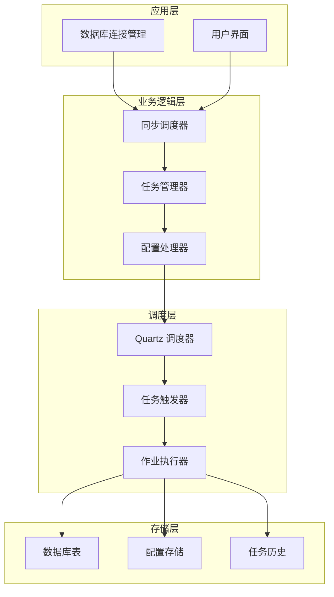
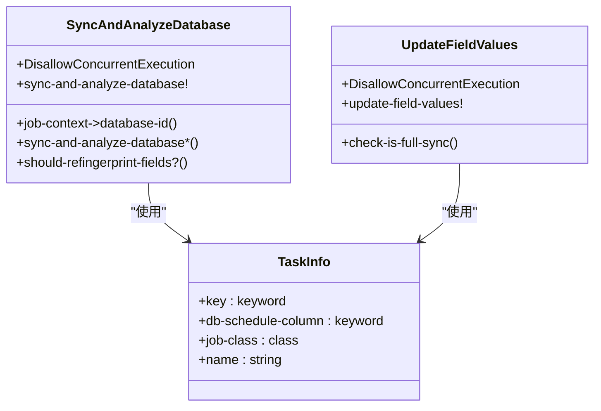
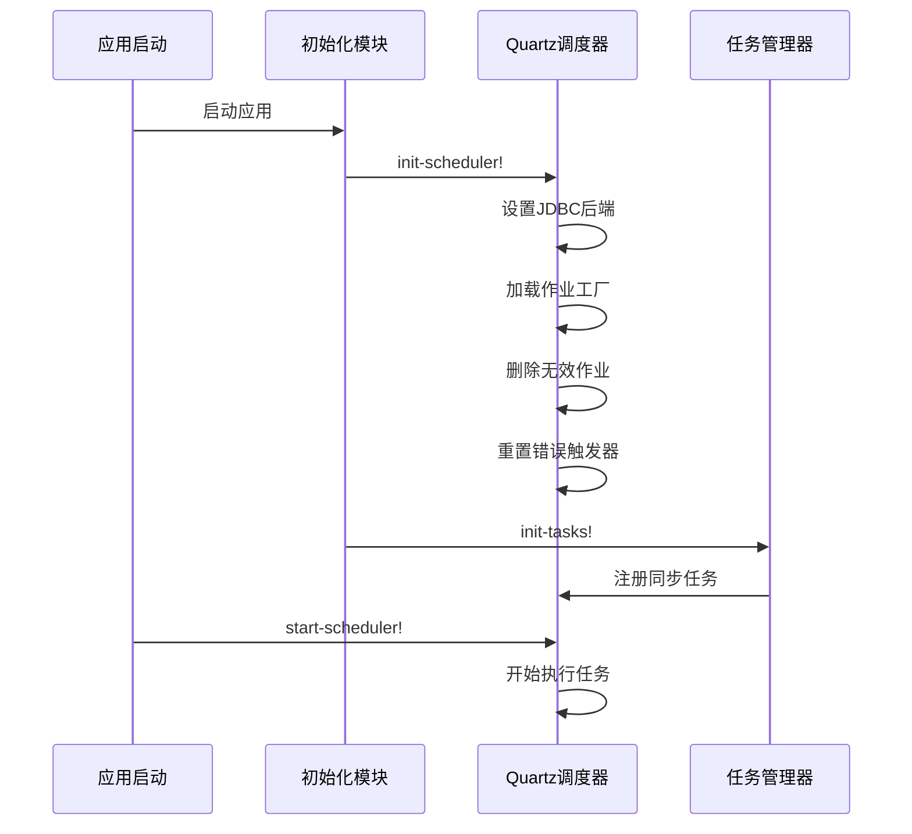
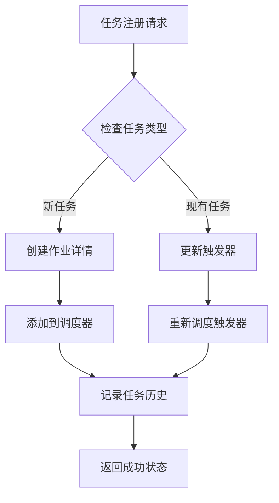
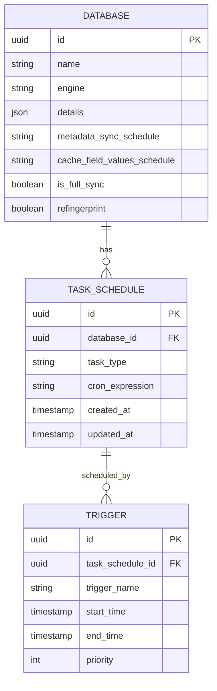
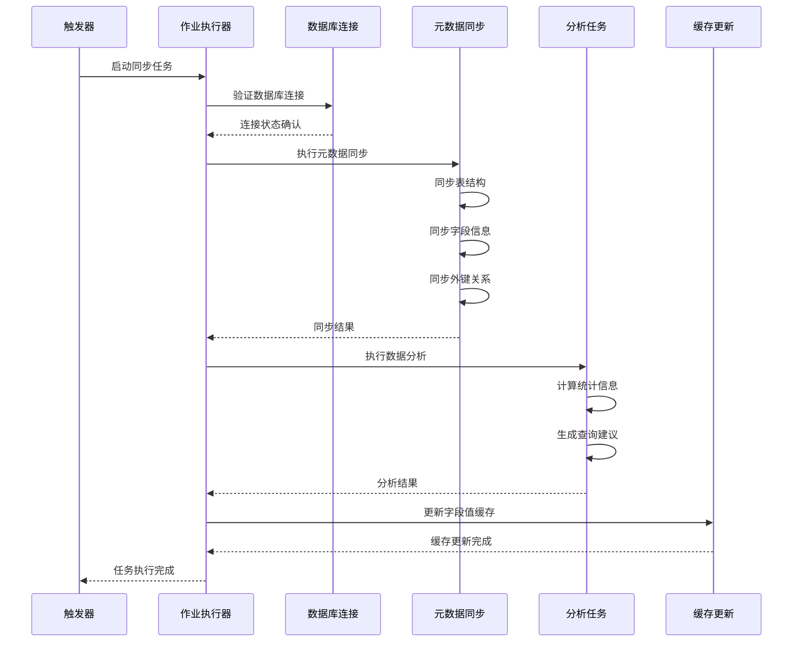
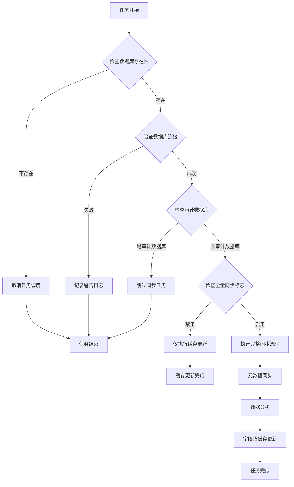
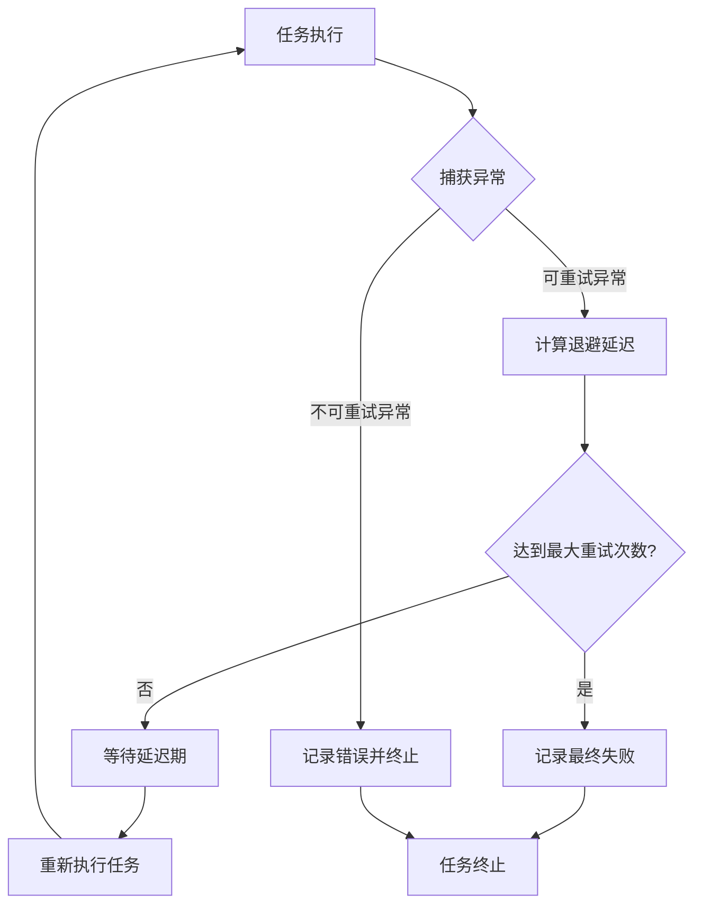
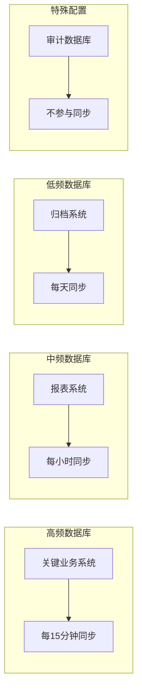

# 同步任务调度

<cite>
**本文档中引用的文件**
- [sync_databases.clj](file://src/metabase/sync/task/sync_databases.clj)
- [schedules.clj](file://src/metabase/sync/schedules.clj)
- [core.clj](file://src/metabase/task/core.clj)
- [impl.clj](file://src/metabase/task/impl.clj)
- [sync_metadata.clj](file://src/metabase/sync/sync_metadata.clj)
- [cron.clj](file://src/metabase/util/cron.clj)
- [init.clj](file://src/metabase/sync/init.clj)
- [settings.clj](file://src/metabase/sync/settings.clj)
</cite>

## 目录
1. [简介](#简介)
2. [系统架构概览](#系统架构概览)
3. [sync-databases-task 核心组件](#sync-databases-task-核心组件)
4. [Quartz 调度器集成](#quartz-调度器集成)
5. [任务调度配置](#任务调度配置)
6. [任务执行流程](#任务执行流程)
7. [错误处理与重试策略](#错误处理与重试策略)
8. [性能优化与最佳实践](#性能优化与最佳实践)
9. [故障排除指南](#故障排除指南)
10. [总结](#总结)

## 简介

Metabase 的同步任务调度机制是一个基于 Quartz 调度器的复杂系统，专门用于定期同步数据库元数据、分析数据和缓存字段值。该系统通过 `task/sync_databases.clj` 文件实现，提供了灵活的任务调度、条件执行和错误恢复功能。

核心特性包括：
- 基于 Quartz 的分布式任务调度
- 支持多种同步频率配置
- 数据库特定的个性化调度策略
- 审计数据库的特殊处理
- 智能错误重试机制
- 实时任务状态监控

## 系统架构概览

同步任务调度系统采用分层架构设计，主要包含以下组件：

**图表来源**
- [sync_databases.clj](file://src/metabase/sync/task/sync_databases.clj#L1-L50)
- [impl.clj](file://src/metabase/task/impl.clj#L1-L50)

**章节来源**
- [sync_databases.clj](file://src/metabase/sync/task/sync_databases.clj#L1-L30)
- [impl.clj](file://src/metabase/task/impl.clj#L1-L100)

## sync-databases-task 核心组件

### 任务类型定义

系统定义了两种核心同步任务类型：

**图表来源**
- [sync_databases.clj](file://src/metabase/sync/task/sync_databases.clj#L102-L128)
- [sync_databases.clj](file://src/metabase/sync/task/sync_databases.clj#L130-L150)

### 默认调度间隔配置

系统为不同类型的任务设置了不同的默认调度间隔：

| 任务类型 | 默认调度频率 | Cron 表达式 | 说明 |
|---------|-------------|-------------|------|
| 元数据同步 | 随机每小时 | `0 0 * * * ? *` 或 `0 50 * * * ? *` | 避免时间戳冲突的随机分钟 |
| 字段值缓存 | 随机每天 | `0 0 0 * * ? *` 或 `0 50 0 * * ? *` | 避免系统负载高峰 |

**章节来源**
- [schedules.clj](file://src/metabase/sync/schedules.clj#L55-L75)
- [sync_databases.clj](file://src/metabase/sync/task/sync_databases.clj#L239-L266)

## Quartz 调度器集成

### 调度器初始化

Quartz 调度器通过 `task.impl` 模块进行管理，支持动态启动和停止：

**图表来源**
- [impl.clj](file://src/metabase/task/impl.clj#L100-L150)
- [sync_databases.clj](file://src/metabase/sync/task/sync_databases.clj#L365-L372)

### 任务注册机制

任务通过 `task.core` 模块进行统一管理，支持动态添加和删除：

**图表来源**
- [impl.clj](file://src/metabase/task/impl.clj#L200-L250)
- [core.clj](file://src/metabase/task/core.clj#L1-L31)

**章节来源**
- [impl.clj](file://src/metabase/task/impl.clj#L100-L200)
- [core.clj](file://src/metabase/task/core.clj#L1-L31)

## 任务调度配置

### 数据库特定配置

每个数据库实例都可以配置个性化的同步频率：

**图表来源**
- [schedules.clj](file://src/metabase/sync/schedules.clj#L10-L30)
- [sync_databases.clj](file://src/metabase/sync/task/sync_databases.clj#L180-L210)

### 配置优先级规则

系统遵循以下配置优先级：

1. **用户手动设置**：用户在界面上自定义的调度配置
2. **Metabase 默认**：系统提供的智能默认配置
3. **审计数据库例外**：审计数据库不参与同步任务

**章节来源**
- [schedules.clj](file://src/metabase/sync/schedules.clj#L40-L75)
- [sync_databases.clj](file://src/metabase/sync/task/sync_databases.clj#L312-L340)

## 任务执行流程

### 同步任务执行顺序

**图表来源**
- [sync_databases.clj](file://src/metabase/sync/task/sync_databases.clj#L60-L100)
- [sync_metadata.clj](file://src/metabase/sync/sync_metadata.clj#L50-L79)

### 条件执行判断

系统实现了智能的条件判断机制：

**图表来源**
- [sync_databases.clj](file://src/metabase/sync/task/sync_databases.clj#L60-L100)
- [sync_databases.clj](file://src/metabase/sync/task/sync_databases.clj#L102-L128)

**章节来源**
- [sync_databases.clj](file://src/metabase/sync/task/sync_databases.clj#L60-L130)
- [sync_metadata.clj](file://src/metabase/sync/sync_metadata.clj#L50-L79)

## 错误处理与重试策略

### 错误分类与处理

系统对不同类型的错误实施差异化处理策略：

| 错误类型 | 处理策略 | 重试机制 | 说明 |
|---------|---------|---------|------|
| 连接超时 | 警告记录 | 不重试 | 网络问题临时解决 |
| 权限不足 | 警告记录 | 不重试 | 需要管理员干预 |
| 数据库不存在 | 取消调度 | 自动清理 | 数据库已删除 |
| 语法错误 | 警告记录 | 不重试 | SQL 语句需要修正 |

### 智能重试机制

**图表来源**
- [sync_databases.clj](file://src/metabase/sync/task/sync_databases.clj#L58-L82)
- [impl.clj](file://src/metabase/task/impl.clj#L350-L378)

**章节来源**
- [sync_databases.clj](file://src/metabase/sync/task/sync_databases.clj#L58-L100)
- [impl.clj](file://src/metabase/task/impl.clj#L350-L378)

## 性能优化与最佳实践

### 负载均衡策略

系统采用多种策略来平衡数据新鲜度和系统负载：

1. **随机化调度时间**：避免所有数据库同时执行同步任务
2. **并发控制**：使用 `DisallowConcurrentExecution` 注解防止重复执行
3. **智能重试**：指数退避算法减少系统压力
4. **审计数据库隔离**：自动跳过审计数据库的同步任务

### 配置调优建议

**图表来源**
- [schedules.clj](file://src/metabase/sync/schedules.clj#L55-L75)
- [sync_databases.clj](file://src/metabase/sync/task/sync_databases.clj#L312-L340)

### 监控指标

关键监控指标包括：

- **任务执行时间**：监控同步操作的耗时
- **成功率**：跟踪任务的成功率趋势
- **队列长度**：观察待执行任务的数量
- **资源使用率**：监控 CPU 和内存使用情况

**章节来源**
- [schedules.clj](file://src/metabase/sync/schedules.clj#L40-L75)
- [sync_databases.clj](file://src/metabase/sync/task/sync_databases.clj#L312-L372)

## 故障排除指南

### 常见问题诊断

1. **任务未执行**
   - 检查调度器是否启动
   - 验证数据库连接配置
   - 确认任务调度配置

2. **同步失败**
   - 查看错误日志
   - 验证数据库权限
   - 检查网络连接

3. **性能问题**
   - 监控系统资源使用
   - 调整同步频率
   - 优化数据库查询

### 调试工具

系统提供了丰富的调试功能：

- **任务历史查看**：通过 `task-history` 模块查看执行记录
- **实时状态监控**：访问 Quartz 调度器状态
- **详细日志记录**：启用 DEBUG 级别日志

**章节来源**
- [impl.clj](file://src/metabase/task/impl.clj#L300-L350)
- [sync_databases.clj](file://src/metabase/sync/task/sync_databases.clj#L214-L241)

## 总结

Metabase 的同步任务调度机制是一个高度成熟的企业级解决方案，具有以下核心优势：

1. **可靠性**：基于 Quartz 的稳定调度框架，支持分布式部署
2. **灵活性**：支持多种调度策略和个性化配置
3. **可扩展性**：模块化设计便于功能扩展
4. **可观测性**：完善的监控和日志系统
5. **容错性**：智能的错误处理和重试机制

通过合理配置和监控，该系统能够有效平衡数据同步的及时性和系统性能，为用户提供高质量的数据服务体验。对于运维人员而言，理解这些机制有助于更好地维护和优化系统性能。