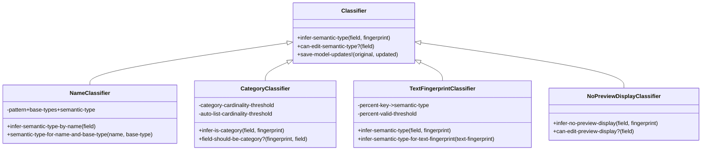

# 同步后数据分析流程详细文档

<cite>
**本文档中引用的文件**
- [analyze.clj](file://src/metabase/sync/analyze.clj)
- [core.clj](file://src/metabase/sync/core.clj)
- [classify.clj](file://src/metabase/sync/analyze/classify.clj)
- [fingerprint.clj](file://src/metabase/sync/analyze/fingerprint.clj)
- [util.clj](file://src/metabase/sync/util.clj)
- [sync.clj](file://src/metabase/sync/sync.clj)
- [analyzers/core.clj](file://src/metabase/analyze/classifiers/core.clj)
- [fingerprinters.clj](file://src/metabase/analyze/fingerprint/fingerprinters.clj)
- [category.clj](file://src/metabase/analyze/classifiers/category.clj)
- [text_fingerprint.clj](file://src/metabase/analyze/classifiers/text_fingerprint.clj)
- [name.clj](file://src/metabase/analyze/classifiers/name.clj)
</cite>

## 目录
1. [简介](#简介)
2. [系统架构概览](#系统架构概览)
3. [核心组件分析](#核心组件分析)
4. [分析流程详解](#分析流程详解)
5. [分类器系统](#分类器系统)
6. [特征提取器系统](#特征提取器系统)
7. [数据存储与利用](#数据存储与利用)
8. [执行顺序与衔接](#执行顺序与衔接)
9. [实际应用示例](#实际应用示例)
10. [性能考虑](#性能考虑)
11. [故障排除指南](#故障排除指南)
12. [总结](#总结)

## 简介

Metabase的同步后数据分析流程是一个复杂而精密的系统，负责在数据库元数据同步完成后对新同步的数据进行深度分析。该系统通过`analyze.clj`模块实现，主要功能包括自动推断字段的语义类型、生成数据指纹、识别有趣的数据模式，并为Metabase的智能功能（如自动可视化推荐）提供支持。

分析流程的核心在于`analyze-table!`函数，它协调分类器（classifier）和特征提取器（fingerprinter）的工作，确保每个字段都能获得准确的语义标签和数据指纹。

## 系统架构概览


**图表来源**
- [analyze.clj](file://src/metabase/sync/analyze.clj#L70-L80)
- [fingerprinters.clj](file://src/metabase/analyze/fingerprint/fingerprinters.clj#L1-L50)
- [core.clj](file://src/metabase/analyze/classifiers/core.clj#L25-L45)

## 核心组件分析

### analyze-table! 函数

`analyze-table!`是分析流程的核心入口点，负责协调整个分析过程：


**图表来源**
- [analyze.clj](file://src/metabase/sync/analyze.clj#L70-L80)
- [classify.clj](file://src/metabase/sync/analyze/classify.clj#L80-L120)

### 分析状态管理

分析系统采用版本控制机制来管理字段的分析状态：

| 字段属性 | 描述 | 用途 |
|---------|------|------|
| `fingerprint_version` | 当前特征提取版本号 | 确定是否需要重新提取特征 |
| `last_analyzed` | 最后分析时间戳 | 标记分析完成状态 |
| `semantic_type` | 语义类型标签 | 存储分类结果 |
| `preview_display` | 预览显示标志 | 控制前端显示行为 |

**节来源**
- [analyze.clj](file://src/metabase/sync/analyze.clj#L15-L45)
- [fingerprint.clj](file://src/metabase/sync/analyze/fingerprint.clj#L20-L35)

## 分析流程详解

### 特征提取阶段

特征提取是分析的第一步，通过`fingerprint-table!`函数实现：


**图表来源**
- [fingerprint.clj](file://src/metabase/sync/analyze/fingerprint.clj#L80-L120)
- [fingerprinters.clj](file://src/metabase/analyze/fingerprint/fingerprinters.clj#L150-L200)

### 分类处理阶段

分类处理通过多个专门的分类器对特征进行语义分析：


**图表来源**
- [classify.clj](file://src/metabase/sync/analyze/classify.clj#L80-L120)
- [core.clj](file://src/metabase/analyze/classifiers/core.clj#L35-L55)

**节来源**
- [classify.clj](file://src/metabase/sync/analyze/classify.clj#L80-L120)
- [core.clj](file://src/metabase/analyze/classifiers/core.clj#L35-L55)

## 分类器系统

### 分类器架构

分类器系统采用插件化设计，支持多种类型的语义分析：



**图表来源**
- [name.clj](file://src/metabase/analyze/classifiers/name.clj#L150-L195)
- [category.clj](file://src/metabase/analyze/classifiers/category.clj#L40-L52)
- [text_fingerprint.clj](file://src/metabase/analyze/classifiers/text_fingerprint.clj#L50-L70)

### 名称分类器

名称分类器基于字段名称和基础类型进行语义推断：

| 模式匹配 | 基础类型 | 语义类型 | 说明 |
|---------|---------|---------|------|
| `^id$` | 任意 | `:type/PK` | 主键标识符 |
| `^lat$` | 浮点数 | `:type/Latitude` | 纬度坐标 |
| `^lon$` | 浮点数 | `:type/Longitude` | 经度坐标 |
| `^city$` | 文本 | `:type/City` | 城市名称 |
| `^country` | 文本 | `:type/Country` | 国家名称 |
| `^first(?:_?)name$` | 文本 | `:type/Name` | 姓名 |
| `^email$` | 文本 | `:type/Email` | 电子邮件地址 |

**节来源**
- [name.clj](file://src/metabase/analyze/classifiers/name.clj#L25-L120)

### 类别分类器

类别分类器根据字段的唯一值数量决定是否将其标记为类别类型：


**图表来源**
- [category.clj](file://src/metabase/analyze/classifiers/category.clj#L35-L52)

**节来源**
- [category.clj](file://src/metabase/analyze/classifiers/category.clj#L35-L52)

### 文本指纹分类器

文本指纹分类器分析文本字段的内容特征来推断语义类型：

| 特征类型 | 阈值 | 语义类型 | 描述 |
|---------|------|---------|------|
| JSON序列化 | 95% | `:type/SerializedJSON` | JSON格式数据 |
| URL链接 | 95% | `:type/URL` | 网页链接 |
| 电子邮件 | 95% | `:type/Email` | 邮箱地址 |
| 州名 | 70% | `:type/State` | 美国州名 |

**节来源**
- [text_fingerprint.clj](file://src/metabase/analyze/classifiers/text_fingerprint.clj#L15-L35)

## 特征提取器系统

### 特征提取器架构

特征提取器系统针对不同数据类型提供专门的分析方法：


**图表来源**
- [fingerprinters.clj](file://src/metabase/analyze/fingerprint/fingerprinters.clj#L150-L200)
- [fingerprinters.clj](file://src/metabase/analyze/fingerprint/fingerprinters.clj#L250-L300)

### 数值特征提取

数值特征提取器计算统计指标和分布特征：


**图表来源**
- [fingerprinters.clj](file://src/metabase/analyze/fingerprint/fingerprinters.clj#L250-L280)

### 文本特征提取

文本特征提取器分析文本内容的结构和模式：


**图表来源**
- [fingerprinters.clj](file://src/metabase/analyze/fingerprint/fingerprinters.clj#L280-L307)

**节来源**
- [fingerprinters.clj](file://src/metabase/analyze/fingerprint/fingerprinters.clj#L250-L307)

## 数据存储与利用

### 特征指纹存储

分析结果以特征指纹的形式存储在数据库中：

| 存储位置 | 数据结构 | 用途 |
|---------|---------|------|
| `metabase_field.fingerprint` | JSON对象 | 存储字段特征信息 |
| `metabase_field.semantic_type` | 关键字 | 存储推断的语义类型 |
| `metabase_field.preview_display` | 布尔值 | 控制前端显示 |
| `metabase_field.has_field_values` | 枚举 | 标记是否缓存值 |

### 利用方式

分析结果支持多种Metabase智能功能：


**节来源**
- [analyze.clj](file://src/metabase/sync/analyze.clj#L50-L70)

## 执行顺序与衔接

### 同步流程中的分析阶段

分析阶段在完整同步流程中的位置：


**图表来源**
- [sync.clj](file://src/metabase/sync/sync.clj#L40-L60)
- [core.clj](file://src/metabase/sync/core.clj#L15-L35)

### 分析阶段与同步阶段的衔接

分析阶段与同步阶段通过以下机制实现无缝衔接：

| 衔接点 | 处理方式 | 确保机制 |
|-------|---------|---------|
| 元数据完成 | 自动触发分析 | 异步事件监听 |
| 字段新增 | 增量分析 | 状态跟踪 |
| 类型变更 | 重新分析 | 版本控制 |
| 数据更新 | 延迟分析 | 时间戳检查 |

**节来源**
- [sync.clj](file://src/metabase/sync/sync.clj#L40-L60)
- [util.clj](file://src/metabase/sync/util.clj#L50-L100)

## 实际应用示例

### 示例1：电商订单数据

假设我们有一个电商订单表，包含以下字段：

| 字段名 | 基础类型 | 分析结果 | 语义类型 |
|-------|---------|---------|---------|
| `order_id` | Integer | 主键标识 | `:type/PK` |
| `customer_name` | Text | 姓名模式 | `:type/Name` |
| `order_date` | DateTime | 日期字段 | `:type/CreationDate` |
| `total_amount` | Float | 数值字段 | `:type/Number` |
| `shipping_address` | Text | 地址特征 | `:type/Address` |
| `status` | Text | 状态枚举 | `:type/Category` |

### 示例2：用户信息表

用户信息表的分析过程：

```mermaid
flowchart TD
A[用户表扫描] --> B[分析用户名字段]
B --> C{名称匹配?}
C --> |是| D[设置为:type/Name]
C --> |否| E[检查其他字段]
D --> F[分析邮箱字段]
F --> G{包含@符号?}
G --> |是| H[设置为:type/Email]
G --> |否| I[检查电话号码]
H --> J[分析注册日期]
J --> K{时间范围合理?}
K --> |是| L[设置为:type/CreationDate]
K --> |否| M[保持原始类型]
L --> N[分析地区字段]
N --> O{唯一值较少?}
O --> |是| P[设置为:type/Category]
O --> |否| Q[完成分析]
P --> Q
M --> Q
Q --> R[生成分析报告]
```

**图表来源**
- [name.clj](file://src/metabase/analyze/classifiers/name.clj#L150-L195)
- [category.clj](file://src/metabase/analyze/classifiers/category.clj#L40-L52)

## 性能考虑

### 查询优化策略

分析系统采用多种策略优化性能：

| 优化策略 | 实现方式 | 效果 |
|---------|---------|------|
| 批量处理 | 分批查询字段 | 减少数据库连接开销 |
| 增量分析 | 只处理新字段 | 提高效率 |
| 版本控制 | 特征版本追踪 | 避免重复计算 |
| 错误恢复 | 异常处理机制 | 保证稳定性 |

### 内存管理

系统通过以下方式管理内存使用：


**节来源**
- [fingerprint.clj](file://src/metabase/sync/analyze/fingerprint.clj#L50-L70)
- [util.clj](file://src/metabase/sync/util.clj#L150-L200)

## 故障排除指南

### 常见问题及解决方案

| 问题类型 | 症状 | 可能原因 | 解决方案 |
|---------|------|---------|---------|
| 分析超时 | 进度条卡住 | 数据量过大 | 调整批次大小 |
| 分类错误 | 类型推断不准确 | 模式匹配冲突 | 更新分类规则 |
| 特征提取失败 | 部分字段无特征 | 数据类型异常 | 添加类型转换 |
| 存储错误 | 结果未保存 | 数据库连接问题 | 检查连接配置 |

### 调试工具

系统提供多种调试工具帮助诊断问题：


**节来源**
- [util.clj](file://src/metabase/sync/util.clj#L100-L150)

## 总结

Metabase的同步后数据分析流程是一个高度集成且智能化的系统，通过特征提取和分类器的协同工作，能够自动识别数据的语义特征并为后续的智能分析奠定基础。

### 关键特性

1. **模块化设计**：清晰分离特征提取和分类处理两个阶段
2. **可扩展性**：支持添加新的分类器和特征提取器
3. **容错能力**：完善的错误处理和恢复机制
4. **性能优化**：批量处理和增量分析策略
5. **版本控制**：特征版本管理确保一致性

### 技术优势

- **自动化程度高**：减少人工干预，提高准确性
- **适应性强**：支持多种数据类型和业务场景
- **实时响应**：快速处理新同步的数据
- **智能推荐**：为用户提供数据洞察和可视化建议

这个分析系统不仅提升了Metabase的数据处理能力，也为构建更智能的数据分析平台提供了坚实的技术基础。