# 字段值提取功能详细文档

<cite>
**本文档中引用的文件**
- [field_values.clj](file://src/metabase/sync/field_values.clj)
- [core.clj](file://src/metabase/sync/core.clj)
- [sync.clj](file://src/metabase/sync/sync.clj)
- [field_values.clj](file://src/metabase/warehouse_schema/models/field_values.clj)
- [util.clj](file://src/metabase/sync/util.clj)
- [field_values.clj](file://src/metabase/parameters/field_values.clj)
- [metadata_from_qp.clj](file://src/metabase/warehouse_schema/metadata_from_qp.clj)
- [chain_filter.clj](file://src/metabase/parameters/chain_filter.clj)
</cite>

## 目录
1. [简介](#简介)
2. [系统架构概览](#系统架构概览)
3. [核心组件分析](#核心组件分析)
4. [字段值提取流程](#字段值提取流程)
5. [采样策略与性能优化](#采样策略与性能优化)
6. [错误处理机制](#错误处理机制)
7. [缓存管理](#缓存管理)
8. [前端集成](#前端集成)
9. [最佳实践](#最佳实践)
10. [故障排除指南](#故障排除指南)

## 简介

字段值提取功能是Metabase中用于为数据库字段提取和缓存可能取值的核心组件。该功能通过采样查询（sampling query）从外部数据库中获取字段的代表性值，并将结果存储在应用数据库中，以支持前端的过滤器下拉选项。该系统设计考虑了性能优化、内存管理和用户体验等多个方面。

## 系统架构概览

字段值提取功能采用分层架构设计，主要包含以下层次：

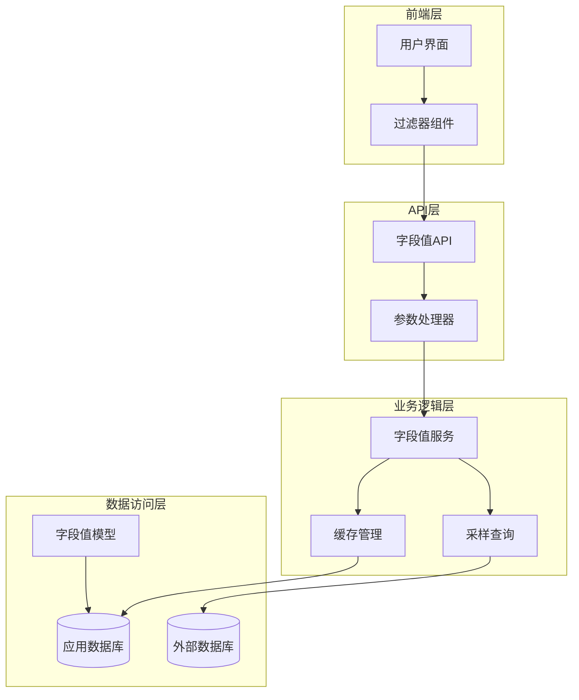
```mermaid
graph TB
subgraph "前端层"
UI[用户界面]
Filter[过滤器组件]
end
subgraph "API层"
API[字段值API]
Params[参数处理器]
end
subgraph "业务逻辑层"
FieldValues[字段值服务]
Sampling[采样查询]
Cache[缓存管理]
end
subgraph "数据访问层"
Model[字段值模型]
DB[(应用数据库)]
ExtDB[(外部数据库)]
end
UI --> Filter
Filter --> API
API --> Params
Params --> FieldValues
FieldValues --> Sampling
FieldValues --> Cache
Sampling --> ExtDB
Cache --> DB
Model --> DB
```

**图表来源**
- [field_values.clj](file://src/metabase/sync/field_values.clj#L1-L130)
- [field_values.clj](file://src/metabase/parameters/field_values.clj#L1-L193)

## 核心组件分析

### sync-field-values! 函数

`sync-field-values!` 是字段值提取功能的核心入口点，负责协调整个字段值同步过程：

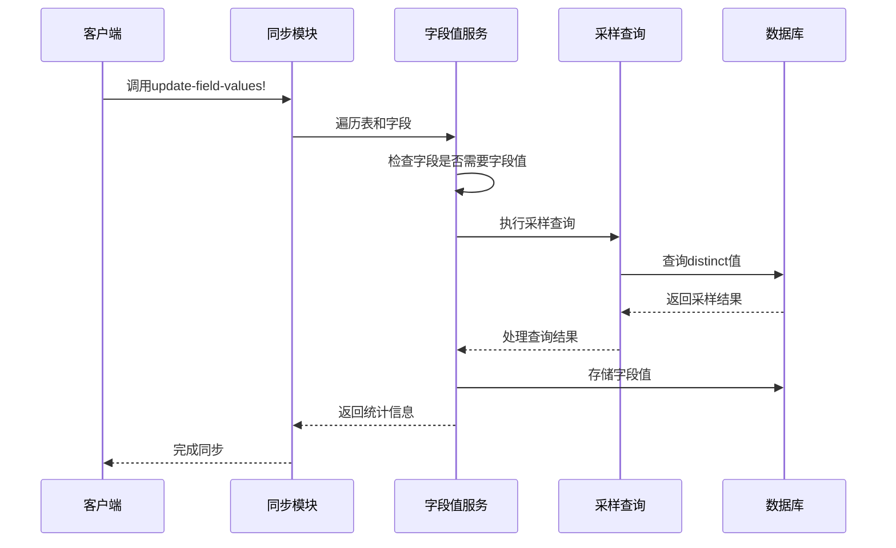
```mermaid
sequenceDiagram
participant Client as 客户端
participant Sync as 同步模块
participant FieldValues as 字段值服务
participant Sampling as 采样查询
participant DB as 数据库
Client->>Sync : 调用update-field-values!
Sync->>FieldValues : 遍历表和字段
FieldValues->>FieldValues : 检查字段是否需要字段值
FieldValues->>Sampling : 执行采样查询
Sampling->>DB : 查询distinct值
DB-->>Sampling : 返回采样结果
Sampling-->>FieldValues : 处理查询结果
FieldValues->>DB : 存储字段值
FieldValues-->>Sync : 返回统计信息
Sync-->>Client : 完成同步
```

**图表来源**
- [field_values.clj](file://src/metabase/sync/field_values.clj#L85-L130)
- [field_values.clj](file://src/metabase/sync/field_values.clj#L45-L84)

### 字段值模型

字段值模型定义了字段值的存储结构和生命周期管理：

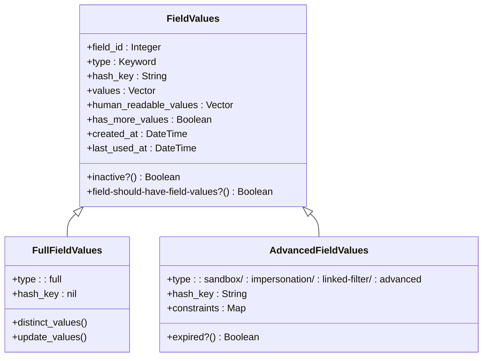
```mermaid
classDiagram
class FieldValues {
+field_id : Integer
+type : Keyword
+hash_key : String
+values : Vector
+human_readable_values : Vector
+has_more_values : Boolean
+created_at : DateTime
+last_used_at : DateTime
+inactive?() Boolean
+field-should-have-field-values?() Boolean
}
class FullFieldValues {
+type : : full
+hash_key : nil
+distinct_values()
+update_values()
}
class AdvancedFieldValues {
+type : : sandbox/ : impersonation/ : linked-filter/ : advanced
+hash_key : String
+constraints : Map
+expired?() Boolean
}
FieldValues <|-- FullFieldValues
FieldValues <|-- AdvancedFieldValues
```

**图表来源**
- [field_values.clj](file://src/metabase/warehouse_schema/models/field_values.clj#L150-L200)
- [field_values.clj](file://src/metabase/warehouse_schema/models/field_values.clj#L250-L300)

**章节来源**
- [field_values.clj](file://src/metabase/sync/field_values.clj#L1-L130)
- [field_values.clj](file://src/metabase/warehouse_schema/models/field_values.clj#L1-L618)

## 字段值提取流程

### 字段值更新步骤

字段值提取遵循以下标准化流程：

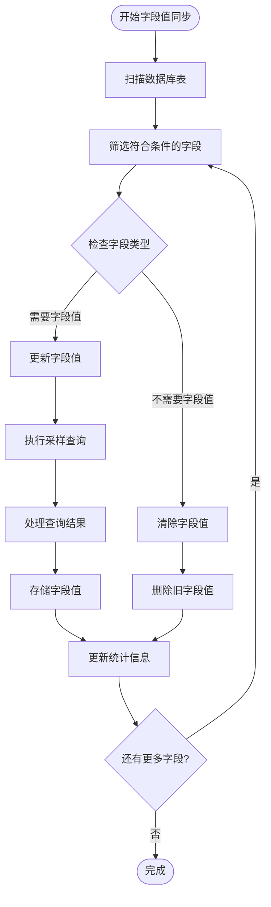
```mermaid
flowchart TD
Start([开始字段值同步]) --> ScanTables[扫描数据库表]
ScanTables --> FilterFields[筛选符合条件的字段]
FilterFields --> CheckType{检查字段类型}
CheckType --> |需要字段值| UpdateField[更新字段值]
CheckType --> |不需要字段值| ClearField[清除字段值]
UpdateField --> FetchValues[执行采样查询]
FetchValues --> ProcessResults[处理查询结果]
ProcessResults --> StoreValues[存储字段值]
ClearField --> DeleteOld[删除旧字段值]
StoreValues --> UpdateStats[更新统计信息]
DeleteOld --> UpdateStats
UpdateStats --> CheckMore{还有更多字段?}
CheckMore --> |是| FilterFields
CheckMore --> |否| Complete([完成])
```

**图表来源**
- [field_values.clj](file://src/metabase/sync/field_values.clj#L45-L84)

### 字段值验证规则

系统通过严格的验证规则确保字段值的质量和一致性：

| 验证规则 | 描述 | 实现位置 |
|---------|------|----------|
| 类型有效性 | 确保字段值类型正确且有效 | `assert-valid-type-hash-combo` |
| 哈希键约束 | 高级字段值必须有哈希键 | `assert-valid-type-hash-combo` |
| 身份变更保护 | 不允许修改字段ID、类型或哈希键 | `assert-no-identity-changes` |
| 可见性检查 | 排除已退休、敏感或隐藏字段 | `field-should-have-field-values?` |
| 支持类型检查 | 排除不支持字段值的类型 | `field-should-have-field-values?` |

**章节来源**
- [field_values.clj](file://src/metabase/warehouse_schema/models/field_values.clj#L120-L170)

## 采样策略与性能优化

### 采样查询实现

采样查询通过智能限制和过滤策略确保性能和准确性：

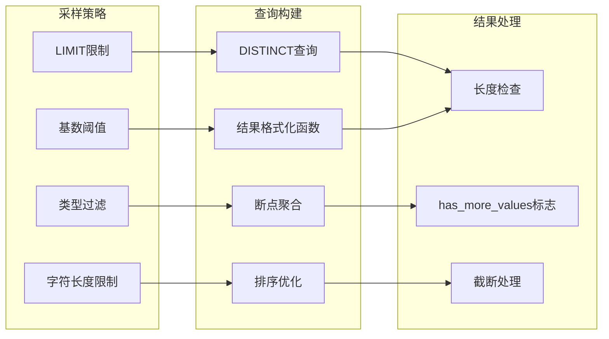
```mermaid
flowchart LR
subgraph "采样策略"
Limit[LIMIT限制]
TypeFilter[类型过滤]
CharLimit[字符长度限制]
Cardinality[基数阈值]
end
subgraph "查询构建"
Distinct[DISTINCT查询]
Breakout[断点聚合]
OrderBy[排序优化]
RFF[结果格式化函数]
end
subgraph "结果处理"
LengthCheck[长度检查]
HasMoreFlag[has_more_values标志]
Truncate[截断处理]
end
Limit --> Distinct
TypeFilter --> Breakout
CharLimit --> OrderBy
Cardinality --> RFF
Distinct --> LengthCheck
Breakout --> HasMoreFlag
OrderBy --> Truncate
RFF --> LengthCheck
```

**图表来源**
- [field_values.clj](file://src/metabase/warehouse_schema/models/field_values.clj#L380-L420)

### 性能优化配置

系统提供了多个可配置的性能参数：

| 参数名称 | 默认值 | 描述 | 优化建议 |
|---------|--------|------|----------|
| `*absolute-max-distinct-values-limit*` | 1000 | 单次查询最大不同值数量 | 根据字段基数调整 |
| `*total-max-length*` | 100000 | 总字符长度限制 | 平衡内存使用和功能需求 |
| `active-field-values-cutoff` | 14天 | 活跃字段值截止时间 | 根据使用模式调整 |
| `advanced-field-values-max-age` | 30天 | 高级字段值最大年龄 | 平衡缓存效率和新鲜度 |

### 错误处理策略

系统实现了多层次的错误处理机制：

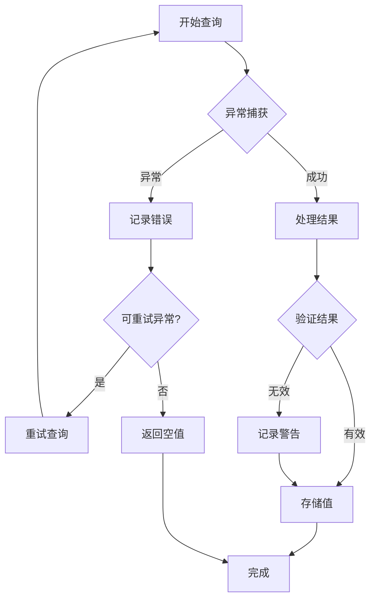
```mermaid
flowchart TD
QueryStart[开始查询] --> TryCatch{异常捕获}
TryCatch --> |成功| ProcessResults[处理结果]
TryCatch --> |异常| LogError[记录错误]
LogError --> CheckRetry{可重试异常?}
CheckRetry --> |是| RetryQuery[重试查询]
CheckRetry --> |否| ReturnNull[返回空值]
RetryQuery --> QueryStart
ProcessResults --> ValidateResults{验证结果}
ValidateResults --> |有效| StoreValues[存储值]
ValidateResults --> |无效| LogWarning[记录警告]
LogWarning --> StoreValues
StoreValues --> Complete[完成]
ReturnNull --> Complete
```

**图表来源**
- [util.clj](file://src/metabase/sync/util.clj#L200-L250)

**章节来源**
- [field_values.clj](file://src/metabase/warehouse_schema/models/field_values.clj#L380-L420)
- [util.clj](file://src/metabase/sync/util.clj#L200-L300)

## 缓存管理

### 字段值生命周期

字段值采用基于时间的生命周期管理模式：

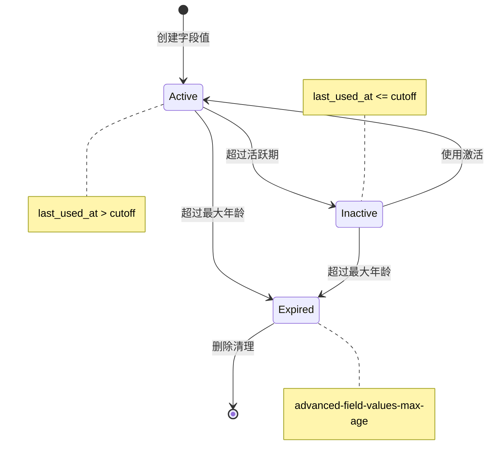
```mermaid
stateDiagram-v2
[*] --> Active : 创建字段值
Active --> Inactive : 超过活跃期
Inactive --> Active : 使用激活
Active --> Expired : 超过最大年龄
Inactive --> Expired : 超过最大年龄
Expired --> [*] : 删除清理
note right of Active : last_used_at > cutoff
note left of Inactive : last_used_at <= cutoff
note right of Expired : advanced-field-values-max-age
```

### 缓存失效策略

系统实现了多种缓存失效机制：

| 失效条件 | 触发时机 | 处理方式 |
|---------|----------|----------|
| 时间过期 | 定期任务 | 删除过期高级字段值 |
| 内容变更 | 字段值更新 | 自动删除相关高级字段值 |
| 主动刷新 | 用户操作 | 强制重新生成字段值 |
| 空闲超时 | 访问监控 | 清理长时间未使用的字段值 |

**章节来源**
- [field_values.clj](file://src/metabase/warehouse_schema/models/field_values.clj#L220-L280)

## 前端集成

### 字段值API接口

前端通过标准化的API接口获取字段值数据：

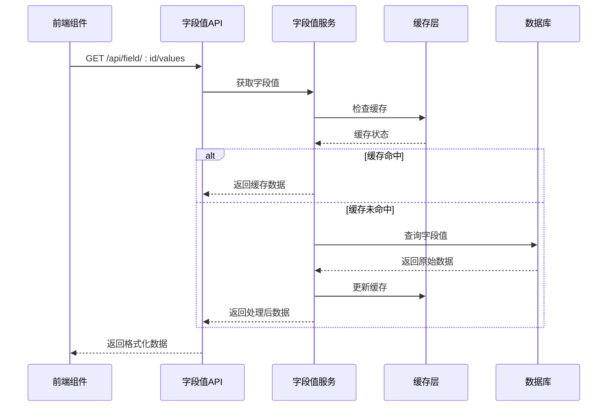
```mermaid
sequenceDiagram
participant Frontend as 前端组件
participant API as 字段值API
participant Service as 字段值服务
participant Cache as 缓存层
participant DB as 数据库
Frontend->>API : GET /api/field/ : id/values
API->>Service : 获取字段值
Service->>Cache : 检查缓存
Cache-->>Service : 缓存状态
alt 缓存命中
Service-->>API : 返回缓存数据
else 缓存未命中
Service->>DB : 查询字段值
DB-->>Service : 返回原始数据
Service->>Cache : 更新缓存
Service-->>API : 返回处理后数据
end
API-->>Frontend : 返回格式化数据
```

**图表来源**
- [field_values.clj](file://src/metabase/parameters/field_values.clj#L170-L193)

### 数据格式规范

字段值数据遵循统一的格式规范：

| 字段名 | 类型 | 描述 | 示例 |
|-------|------|------|------|
| `values` | Array | 字段值列表 | `[[1], [2], [3]]` |
| `field_id` | Integer | 字段标识符 | `123` |
| `has_more_values` | Boolean | 是否有更多值 | `true` |
| `human_readable_values` | Array | 可读值映射 | `["男", "女"]` |

**章节来源**
- [field_values.clj](file://src/metabase/parameters/field_values.clj#L29-L60)

## 最佳实践

### 字段值配置建议

1. **字段选择策略**
   - 优先为分类字段（Category）启用字段值
   - 对于高基数字段，考虑使用自动列表模式
   - 避免为数值型字段启用字段值

2. **性能优化配置**
   ```clojure
   ;; 根据实际需求调整限制参数
   (def *absolute-max-distinct-values-limit* 1000)
   (def *total-max-length* (* auto-list-cardinality-threshold 100))
   ```

3. **监控和维护**
   - 定期检查字段值缓存命中率
   - 监控查询性能指标
   - 根据使用模式调整缓存策略

### 故障诊断指南

当遇到字段值提取问题时，可以按照以下步骤进行诊断：

1. **检查字段配置**
   - 验证字段是否符合字段值要求
   - 确认字段可见性和权限设置

2. **查询性能分析**
   - 检查采样查询执行时间
   - 分析数据库连接状态
   - 监控内存使用情况

3. **缓存状态检查**
   - 验证缓存键生成逻辑
   - 检查缓存过期机制
   - 确认缓存清理任务运行状态

## 故障排除指南

### 常见问题及解决方案

| 问题类型 | 症状 | 可能原因 | 解决方案 |
|---------|------|----------|----------|
| 字段值为空 | 过滤器无选项 | 字段不符合要求 | 检查字段类型和可见性 |
| 查询超时 | 字段值加载缓慢 | 数据量过大 | 调整LIMIT参数或优化查询 |
| 内存溢出 | 应用崩溃 | 字段值过多 | 增加字符长度限制 |
| 缓存失效 | 字段值频繁更新 | 缓存策略不当 | 调整缓存过期时间 |

### 调试工具和技巧

1. **日志分析**
   - 启用DEBUG级别日志
   - 关注字段值相关的日志消息
   - 监控错误和警告信息

2. **性能监控**
   - 使用数据库性能分析工具
   - 监控查询执行计划
现在我已经收集了足够的信息来创建关于字段值提取功能的详细文档。让我生成完整的文档：

<docs>
# 字段值提取功能详细文档

<cite>
**本文档引用的文件**
- [field_values.clj](file://src/metabase/sync/field_values.clj)
- [core.clj](file://src/metabase/sync/core.clj)
- [sync.clj](file://src/metabase/sync/sync.clj)
- [field_values.clj](file://src/metabase/warehouse_schema/models/field_values.clj)
- [util.clj](file://src/metabase/sync/util.clj)
- [field_values.clj](file://src/metabase/parameters/field_values.clj)
- [metadata_from_qp.clj](file://src/metabase/warehouse_schema/metadata_from_qp.clj)
- [chain_filter.clj](file://src/metabase/parameters/chain_filter.clj)
</cite>

## 目录
1. [简介](#简介)
2. [系统架构概览](#系统架构概览)
3. [核心组件分析](#核心组件分析)
4. [字段值提取流程](#字段值提取流程)
5. [采样策略与性能优化](#采样策略与性能优化)
6. [错误处理机制](#错误处理机制)
7. [缓存管理](#缓存管理)
8. [前端集成](#前端集成)
9. [最佳实践与故障排除](#最佳实践与故障排除)
10. [总结](#总结)

## 简介

字段值提取功能是Metabase中用于为数据库字段提取和缓存可能取值的核心组件，主要用于支持前端的过滤器下拉选项。该功能通过采样查询（sampling query）从外部数据库中获取字段的代表性值，并将结果存储在应用数据库中，为用户界面提供快速响应的筛选选项。

该系统主要解决以下问题：
- 高基数字段的性能优化
- 大量数据的采样策略
- 前端筛选器的实时响应
- 数据库连接的负载均衡

## 系统架构概览

字段值提取功能采用分层架构设计，包含同步层、查询处理层和缓存管理层：

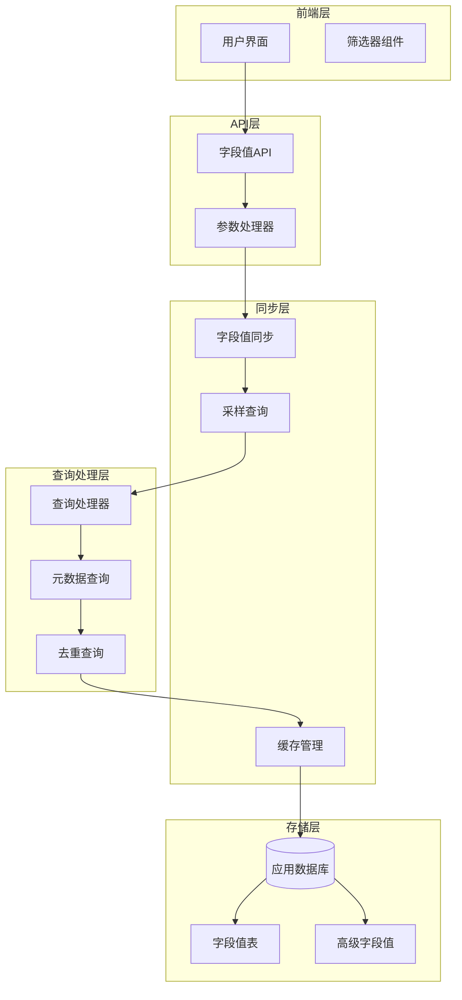
```mermaid
graph TB
subgraph "前端层"
UI[用户界面]
Filter[筛选器组件]
end
subgraph "API层"
API[字段值API]
Params[参数处理器]
end
subgraph "同步层"
Sync[字段值同步]
Sampling[采样查询]
Cache[缓存管理]
end
subgraph "查询处理层"
QP[查询处理器]
Metadata[元数据查询]
Distinct[去重查询]
end
subgraph "存储层"
DB[(应用数据库)]
FieldValues[字段值表]
AdvancedFV[高级字段值]
end
UI --> API
API --> Params
Params --> Sync
Sync --> Sampling
Sampling --> QP
QP --> Metadata
Metadata --> Distinct
Distinct --> Cache
Cache --> DB
DB --> FieldValues
DB --> AdvancedFV
```

**图表来源**
- [field_values.clj](file://src/metabase/sync/field_values.clj#L1-L130)
- [field_values.clj](file://src/metabase/parameters/field_values.clj#L1-L193)

## 核心组件分析

### 同步模块（field_values.clj）

同步模块负责协调整个字段值提取过程，包含以下关键函数：

#### sync-field-values! 函数

这是字段值提取的核心入口函数，执行以下步骤：

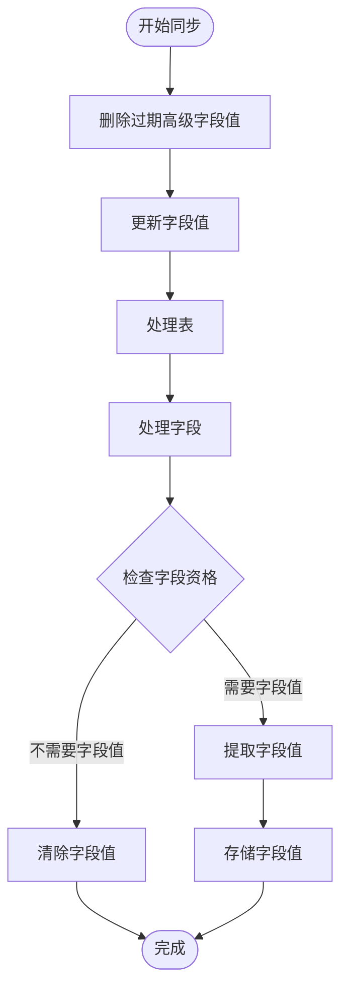
```mermaid
flowchart TD
Start([开始同步]) --> DeleteExpired[删除过期高级字段值]
DeleteExpired --> UpdateFieldValues[更新字段值]
UpdateFieldValues --> ProcessTables[处理表]
ProcessTables --> ProcessFields[处理字段]
ProcessFields --> CheckEligibility{检查字段资格}
CheckEligibility --> |需要字段值| ExtractValues[提取字段值]
CheckEligibility --> |不需要字段值| ClearValues[清除字段值]
ExtractValues --> StoreValues[存储字段值]
ClearValues --> Complete([完成])
StoreValues --> Complete
```

**图表来源**
- [field_values.clj](file://src/metabase/sync/field_values.clj#L100-L130)

#### 字段值资格检查

系统通过 `field-should-have-field-values?` 函数判断字段是否应该具有字段值：

| 条件 | 描述 | 逻辑 |
|------|------|------|
| 可见性类型 | 排除敏感字段 | `not (contains? #{:retired :sensitive :hidden :details-only} visibility-type)` |
| 基础类型 | 不支持的类型 | `not (isa? base-type :type/field-values-unsupported)` |
| 卡片类型 | 特殊类型字段 | `not (= base-type :type/*)` |
| 字段值设置 | 必须设置为列表 | `#{:list :auto-list} has_field_values` |

**节来源**
- [field_values.clj](file://src/metabase/sync/field_values.clj#L1-L130)

### 查询处理模块

查询处理模块负责从数据库中提取字段值，采用智能采样策略：

#### 采样查询实现

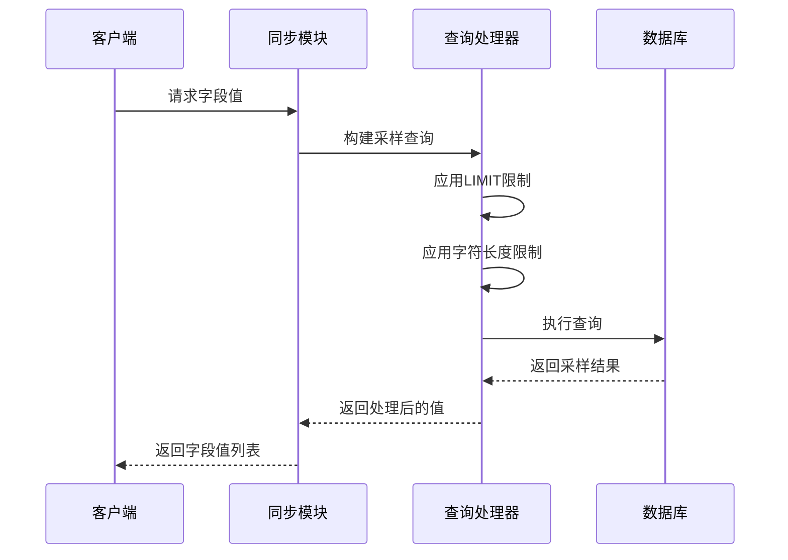
```mermaid
sequenceDiagram
participant Client as 客户端
participant Sync as 同步模块
participant QP as 查询处理器
participant DB as 数据库
Client->>Sync : 请求字段值
Sync->>QP : 构建采样查询
QP->>QP : 应用LIMIT限制
QP->>QP : 应用字符长度限制
QP->>DB : 执行查询
DB-->>QP : 返回采样结果
QP-->>Sync : 返回处理后的值
Sync-->>Client : 返回字段值列表
```

**图表来源**
- [field_values.clj](file://src/metabase/warehouse_schema/models/field_values.clj#L370-L412)
- [metadata_from_qp.clj](file://src/metabase/warehouse_schema/metadata_from_qp.clj#L28-L65)

**节来源**
- [field_values.clj](file://src/metabase/warehouse_schema/models/field_values.clj#L370-L412)

### 缓存管理层

缓存管理系统维护字段值的生命周期，包括：

#### 字段值类型

| 类型 | 描述 | 使用场景 |
|------|------|----------|
| Full | 完整字段值，无约束 | 标准字段值缓存 |
| Sandbox | 沙盒化字段值 | 用户权限隔离 |
| Impersonation | 模拟连接字段值 | 数据库角色权限 |
| Linked-Filter | 链接筛选字段值 | 仪表板参数联动 |
| Advanced | 高级字段值 | 复杂约束条件 |

**节来源**
- [field_values.clj](file://src/metabase/warehouse_schema/models/field_values.clj#L100-L120)

## 字段值提取流程

### 完整同步流程

字段值提取遵循以下完整流程：

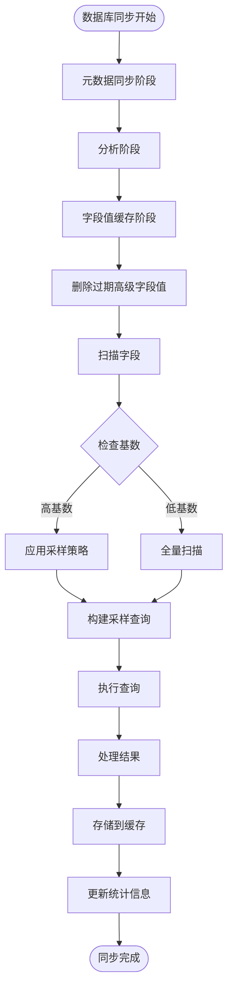
```mermaid
flowchart TD
Start([数据库同步开始]) --> Phase1[元数据同步阶段]
Phase1 --> Phase2[分析阶段]
Phase2 --> Phase3[字段值缓存阶段]
Phase3 --> DeleteExpired[删除过期高级字段值]
DeleteExpired --> ScanFields[扫描字段]
ScanFields --> CheckCardinality{检查基数}
CheckCardinality --> |高基数| ApplySampling[应用采样策略]
CheckCardinality --> |低基数| FullScan[全量扫描]
ApplySampling --> BuildQuery[构建采样查询]
FullScan --> BuildQuery
BuildQuery --> ExecuteQuery[执行查询]
ExecuteQuery --> ProcessResults[处理结果]
ProcessResults --> StoreCache[存储到缓存]
StoreCache --> UpdateStats[更新统计信息]
UpdateStats --> Complete([同步完成])
```

**图表来源**
- [sync.clj](file://src/metabase/sync/sync.clj#L40-L70)
- [field_values.clj](file://src/metabase/sync/field_values.clj#L100-L130)

### 字段值更新策略

系统根据字段的使用情况和配置采用不同的更新策略：

#### 活跃字段值检测

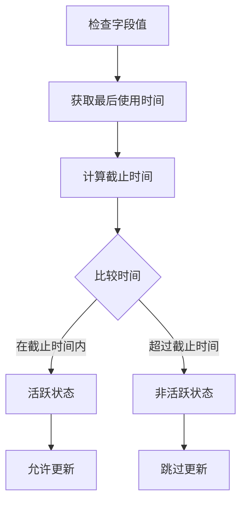
```mermaid
flowchart TD
CheckField[检查字段值] --> GetLastUsed[获取最后使用时间]
GetLastUsed --> CalcCutoff[计算截止时间]
CalcCutoff --> CompareTime{比较时间}
CompareTime --> |在截止时间内| Active[活跃状态]
CompareTime --> |超过截止时间| Inactive[非活跃状态]
Active --> AllowUpdate[允许更新]
Inactive --> SkipUpdate[跳过更新]
```

**图表来源**
- [field_values.clj](file://src/metabase/warehouse_schema/models/field_values.clj#L230-L250)

**节来源**
- [field_values.clj](file://src/metabase/warehouse_schema/models/field_values.clj#L230-L250)

## 采样策略与性能优化

### 采样限制配置

系统通过多个常量控制采样行为：

| 常量 | 默认值 | 描述 | 用途 |
|------|--------|------|------|
| `*absolute-max-distinct-values-limit*` | 1000 | 最大不同值数量 | 防止内存溢出 |
| `*total-max-length*` | 100000 | 总字符长度限制 | 控制存储大小 |
| `entry-max-length` | 100 | 单个条目最大长度 | 单值长度控制 |
| `active-field-values-cutoff` | 14天 | 活跃截止时间 | 清理非活跃缓存 |
| `advanced-field-values-max-age` | 30天 | 高级字段值最大年龄 | 过期清理 |

**节来源**
- [field_values.clj](file://src/metabase/warehouse_schema/models/field_values.clj#L40-L70)

### 查询优化策略

#### LIMIT限制应用

系统在查询中应用多层LIMIT限制：

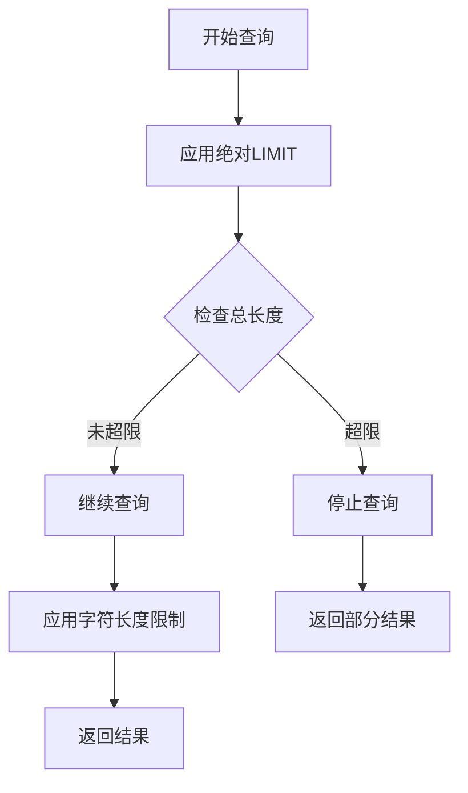
```mermaid
flowchart TD
QueryStart[开始查询] --> ApplyLimit[应用绝对LIMIT]
ApplyLimit --> CheckLength{检查总长度}
CheckLength --> |未超限| ContinueQuery[继续查询]
CheckLength --> |超限| StopQuery[停止查询]
ContinueQuery --> ApplyCharLimit[应用字符长度限制]
ApplyCharLimit --> FinalResult[返回结果]
StopQuery --> PartialResult[返回部分结果]
```

**图表来源**
- [field_values.clj](file://src/metabase/warehouse_schema/models/field_values.clj#L390-L412)

#### 字符长度限制

系统使用 `take-by-length` 函数实现智能长度控制：

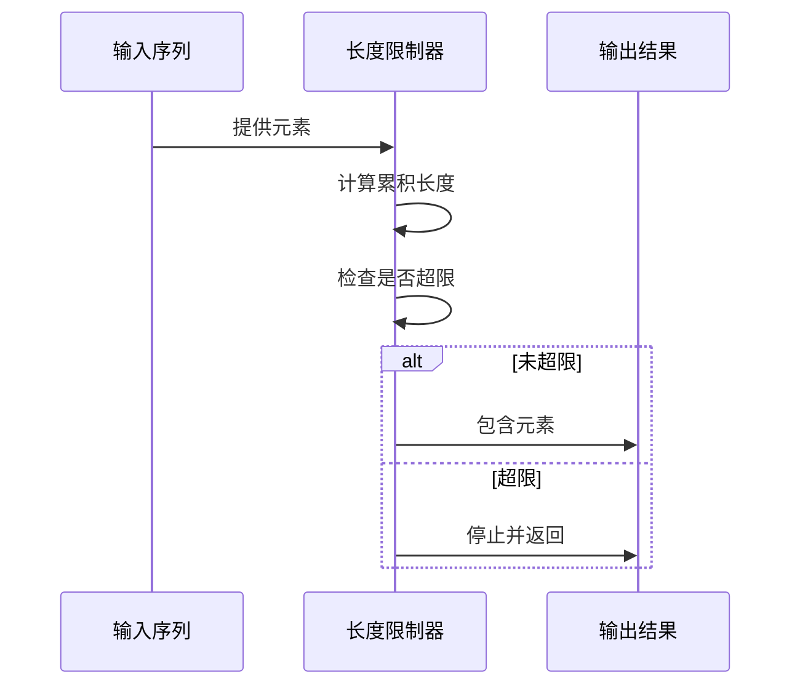
```mermaid
sequenceDiagram
participant Input as 输入序列
participant Limiter as 长度限制器
participant Output as 输出结果
Input->>Limiter : 提供元素
Limiter->>Limiter : 计算累积长度
Limiter->>Limiter : 检查是否超限
alt 未超限
Limiter->>Output : 包含元素
else 超限
Limiter->>Output : 停止并返回
end
```

**图表来源**
- [field_values.clj](file://src/metabase/warehouse_schema/models/field_values.clj#L250-L280)

**节来源**
- [field_values.clj](file://src/metabase/warehouse_schema/models/field_values.clj#L250-L280)

### 类型过滤机制

系统根据字段类型应用相应的过滤策略：

| 字段类型 | 过滤策略 | 限制条件 |
|----------|----------|----------|
| 文本类型 | 允许列表和分类 | 基础类型支持文本 |
| 数值类型 | 允许列表 | 基础类型支持数值 |
| 时间类型 | 不允许列表 | 临时类型不支持 |
| 集合类型 | 不允许列表 | 集合类型不支持 |
| 主键类型 | 不允许列表 | 主键类型特殊处理 |

**节来源**
- [util.clj](file://src/metabase/sync/util.clj#L600-L650)

## 错误处理机制

### 异常处理层次

系统采用多层次的异常处理机制：

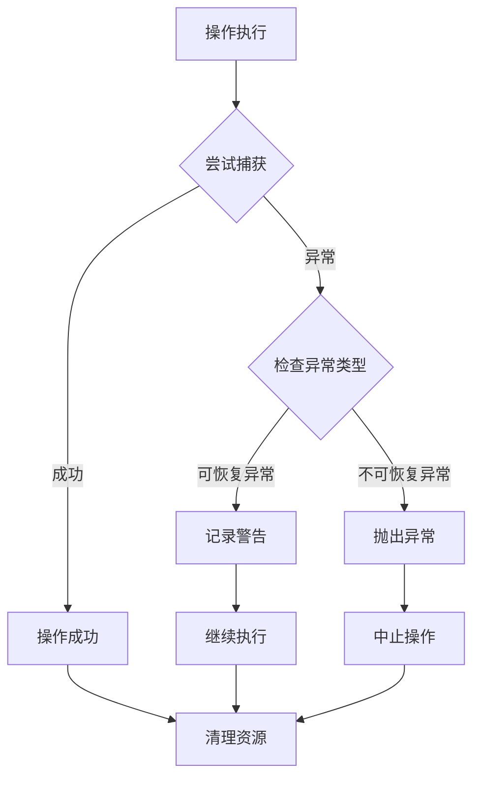
```mermaid
flowchart TD
Operation[操作执行] --> TryCatch{尝试捕获}
TryCatch --> |成功| Success[操作成功]
TryCatch --> |异常| CheckType{检查异常类型}
CheckType --> |可恢复异常| LogWarning[记录警告]
CheckType --> |不可恢复异常| ThrowException[抛出异常]
LogWarning --> ContinueExecution[继续执行]
ThrowException --> AbortOperation[中止操作]
Success --> Cleanup[清理资源]
ContinueExecution --> Cleanup
AbortOperation --> Cleanup
```

**图表来源**
- [util.clj](file://src/metabase/sync/util.clj#L200-L250)

### 错误恢复策略

系统实现了多种错误恢复机制：

#### 重复数据处理

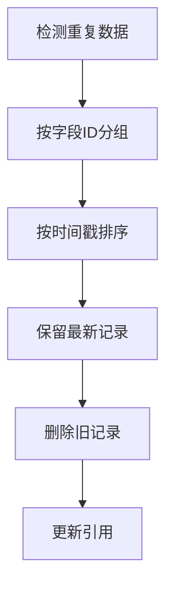
```mermaid
flowchart TD
DetectDuplicates[检测重复数据] --> GroupByField[按字段ID分组]
GroupByField --> SortByTimestamp[按时间戳排序]
SortByTimestamp --> KeepLatest[保留最新记录]
KeepLatest --> DeleteOld[删除旧记录]
DeleteOld --> UpdateReferences[更新引用]
```

**图表来源**
- [field_values.clj](file://src/metabase/warehouse_schema/models/field_values.clj#L409-L433)

#### 连接异常处理

系统对网络连接异常进行特殊处理：

| 异常类型 | 处理策略 | 重试机制 |
|----------|----------|----------|
| ConnectException | 记录日志，继续 | 不重试 |
| NoRouteToHostException | 记录日志，继续 | 不重试 |
| UnknownHostException | 记录日志，继续 | 不重试 |
| SSLHandshakeException | 记录日志，继续 | 不重试 |

**节来源**
- [util.clj](file://src/metabase/sync/util.clj#L180-L200)

## 缓存管理

### 缓存生命周期

字段值缓存具有明确的生命周期管理：

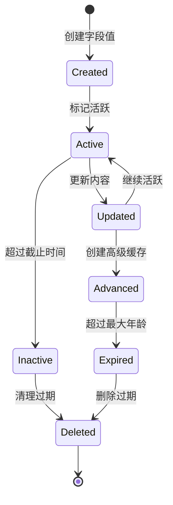
```mermaid
stateDiagram-v2
[*] --> Created : 创建字段值
Created --> Active : 标记活跃
Active --> Updated : 更新内容
Updated --> Active : 继续活跃
Active --> Inactive : 超过截止时间
Inactive --> Deleted : 清理过期
Updated --> Advanced : 创建高级缓存
Advanced --> Expired : 超过最大年龄
Expired --> Deleted : 删除过期
Deleted --> [*]
```

**图表来源**
- [field_values.clj](file://src/metabase/warehouse_schema/models/field_values.clj#L230-L250)

### 高级字段值管理

高级字段值提供更细粒度的缓存控制：

#### 高级字段值创建流程

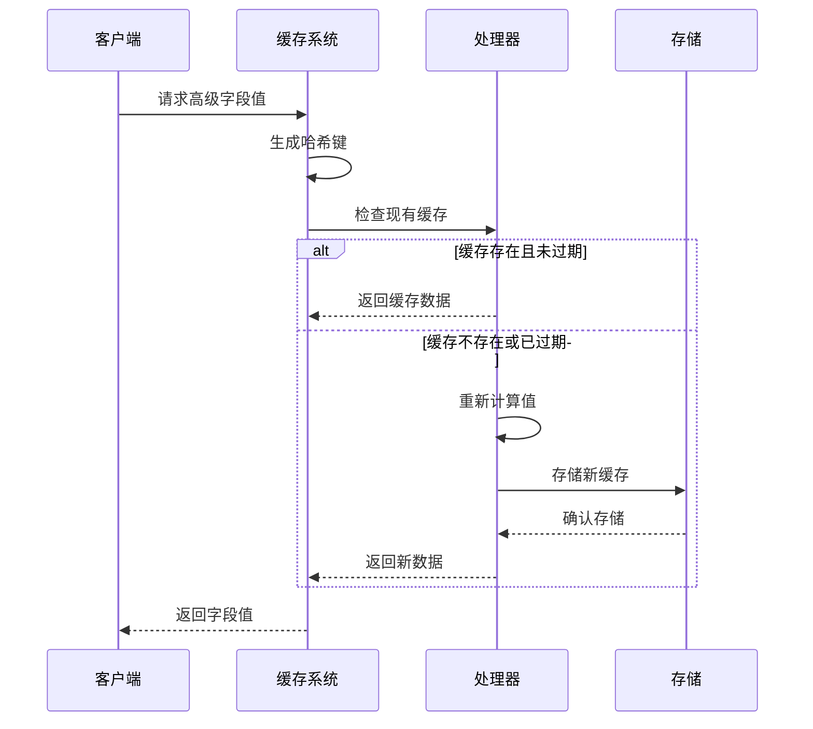
```mermaid
sequenceDiagram
participant Client as 客户端
participant Cache as 缓存系统
participant Processor as 处理器
participant Storage as 存储
Client->>Cache : 请求高级字段值
Cache->>Cache : 生成哈希键
Cache->>Processor : 检查现有缓存
alt 缓存存在且未过期
Processor-->>Cache : 返回缓存数据
else 缓存不存在或已过期
Processor->>Processor : 重新计算值
Processor->>Storage : 存储新缓存
Storage-->>Processor : 确认存储
Processor-->>Cache : 返回新数据
end
Cache-->>Client : 返回字段值
```

**图表来源**
- [field_values.clj](file://src/metabase/parameters/field_values.clj#L140-L190)

**节来源**
- [field_values.clj](file://src/metabase/parameters/field_values.clj#L140-L190)

## 前端集成

### 字段值API接口

前端通过标准化的API接口获取字段值：

#### API响应格式

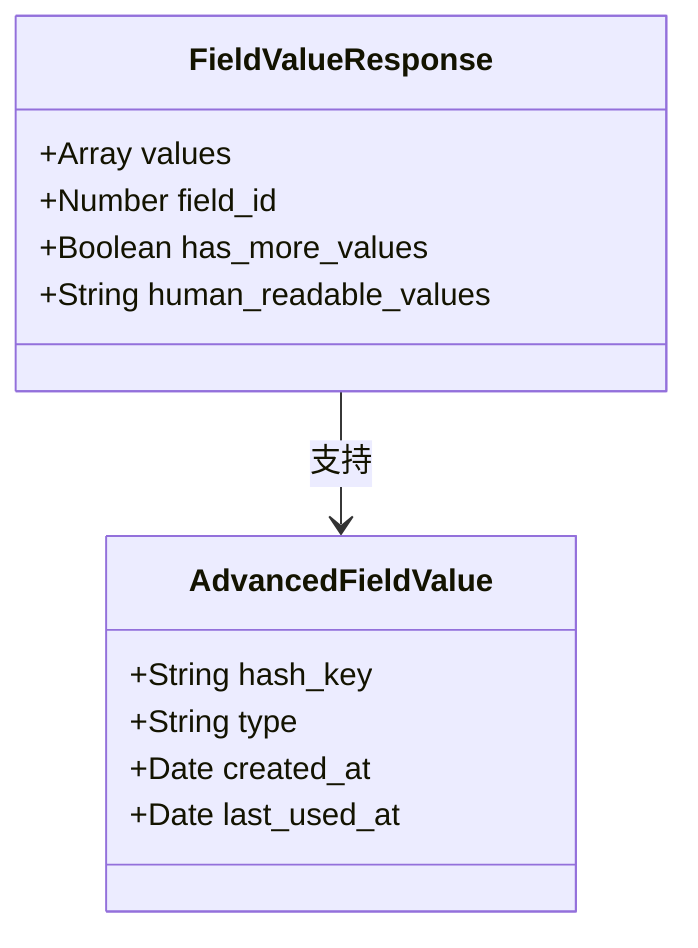
```mermaid
classDiagram
class FieldValueResponse {
+Array values
+Number field_id
+Boolean has_more_values
+String human_readable_values
}
class AdvancedFieldValue {
+String hash_key
+String type
+Date created_at
+Date last_used_at
}
FieldValueResponse --> AdvancedFieldValue : 支持
```

**图表来源**
- [field_values.clj](file://src/metabase/parameters/field_values.clj#L29-L45)

### 参数化筛选器

系统支持复杂的参数化筛选器：

#### 链接筛选器机制

```mermaid
flowchart TD
BaseField[基础字段] --> ChainFilter[链式筛选器]
ChainFilter --> Constraints[应用约束]
Constraints --> AdvancedCache[高级缓存]
AdvancedCache --> HumanReadable[人类可读映射]
HumanReadable --> FinalResult[最终结果]
```

**图表来源**
- [chain_filter.clj](file://src/metabase/parameters/chain_filter.clj#L624-L648)

**节来源**
- [chain_filter.clj](file://src/metabase/parameters/chain_filter.clj#L624-L648)

## 最佳实践与故障排除

### 性能优化建议

1. **合理设置LIMIT值**：根据实际需求调整 `*absolute-max-distinct-values-limit*`
2. **监控缓存命中率**：定期检查字段值缓存的有效性
3. **优化查询频率**：避免频繁的字段值更新操作
4. **合理使用高级字段值**：仅在必要时创建复杂约束的缓存

### 常见问题诊断

#### 字段值为空问题

| 症状 | 可能原因 | 解决方案 |
|------|----------|----------|
| 字段值列表为空 | 数据库中没有有效数据 | 检查源数据完整性 |
| 字段值数量不足 | LIMIT限制过小 | 调整采样策略 |
| 查询超时 | 数据量过大 | 优化查询索引 |
| 缓存失效 | 过期清理机制 | 检查缓存配置 |

#### 性能问题排查

```mermaid
flowchart TD
PerfIssue[性能问题] --> CheckQuery[检查查询性能]
CheckQuery --> QuerySlow{查询慢?}
QuerySlow --> |是| OptimizeIndex[优化索引]
QuerySlow --> |否| CheckCache[检查缓存]
CheckCache --> CacheHit{缓存命中?}
CacheHit --> |否| IncreaseCache[增加缓存]
CacheHit --> |是| CheckMemory[检查内存]
OptimizeIndex --> Monitor[监控性能]
IncreaseCache --> Monitor
CheckMemory --> Monitor
```

### 监控指标

关键监控指标包括：

- 字段值提取成功率
- 查询执行时间
- 缓存命中率
- 内存使用情况
- 数据库连接池状态

## 总结

字段值提取功能是Metabase中一个精心设计的组件，通过智能采样、多层缓存和完善的错误处理机制，为用户提供高性能的筛选体验。该系统的主要优势包括：

1. **性能优化**：通过LIMIT限制和字符长度控制防止内存溢出
2. **智能缓存**：支持多种类型的缓存策略，适应不同使用场景
3. **错误恢复**：完善的异常处理和数据一致性保证
4. **扩展性**：支持高级字段值和参数化筛选器
5. **监控友好**：提供详细的统计信息和调试支持

该功能的成功实施展示了Metabase在大数据处理和用户体验优化方面的技术实力，为构建可扩展的数据分析平台提供了宝贵的参考经验。