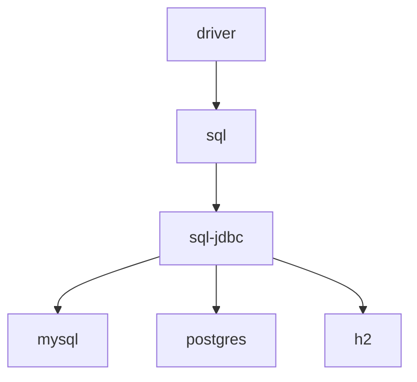
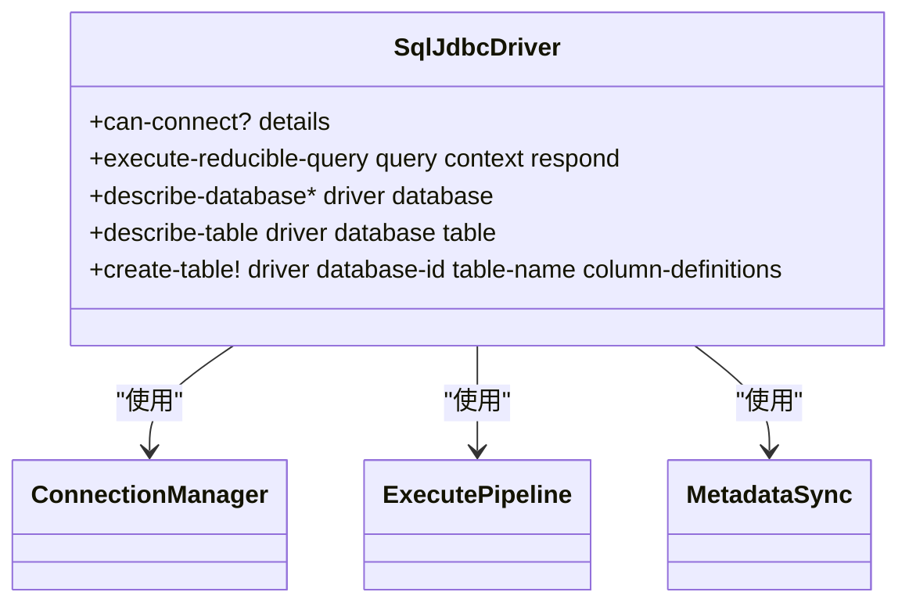
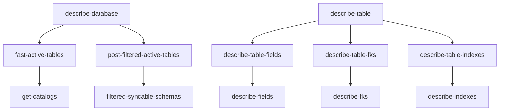
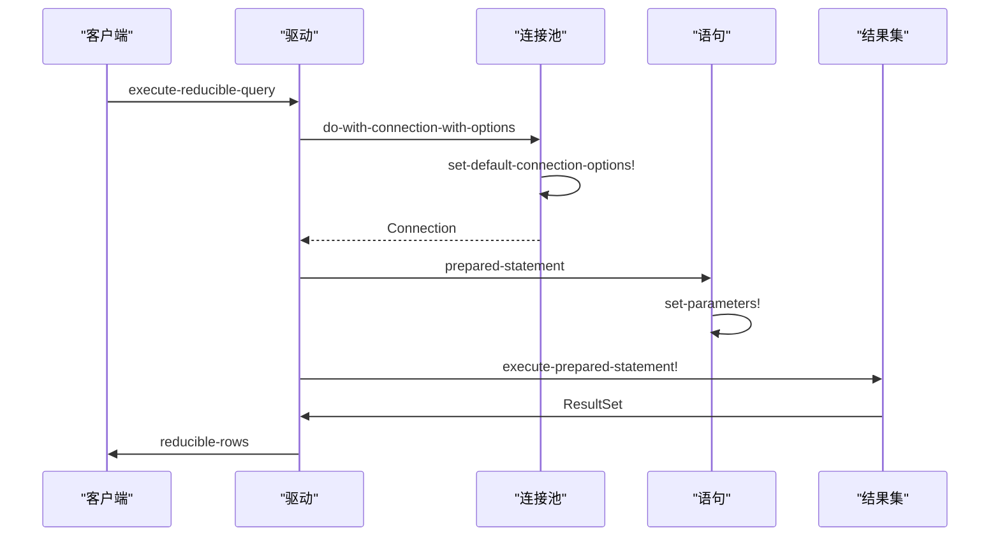
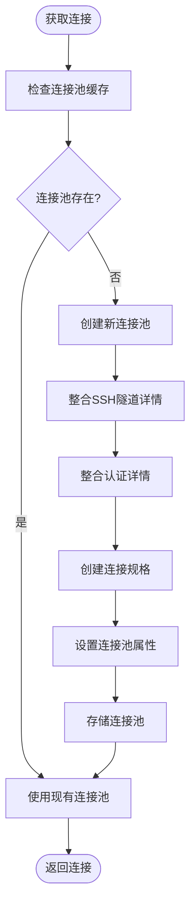
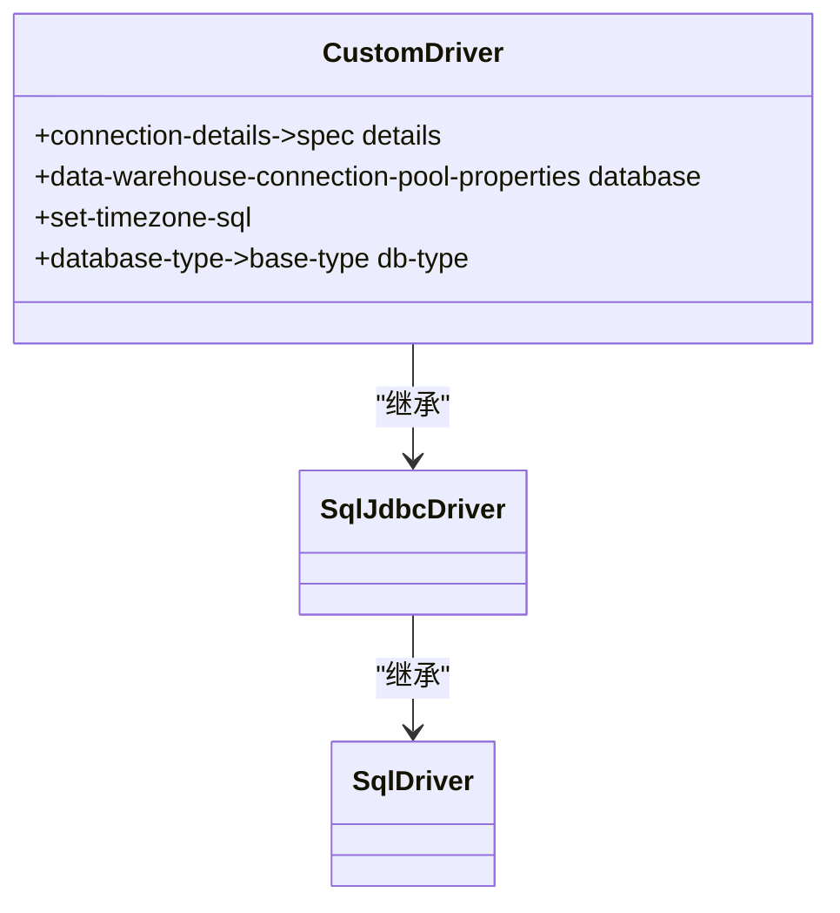

# SQL与JDBC通用实现

<cite>
**本文档引用的文件**  
- [sql.clj](file://src/metabase/driver/sql.clj)
- [sql_jdbc.clj](file://src/metabase/driver/sql_jdbc.clj)
- [connection.clj](file://src/metabase/driver/sql_jdbc/connection.clj)
- [execute.clj](file://src/metabase/driver/sql_jdbc/execute.clj)
- [sync.clj](file://src/metabase/driver/sql_jdbc/sync.clj)
- [metadata.clj](file://src/metabase/driver/sql_jdbc/metadata.clj)
- [quoting.clj](file://src/metabase/driver/sql_jdbc/quoting.clj)
- [sync/describe_database.clj](file://src/metabase/driver/sql_jdbc/sync/describe_database.clj)
- [sync/describe_table.clj](file://src/metabase/driver/sql_jdbc/sync/describe_table.clj)
- [sync/interface.clj](file://src/metabase/driver/sql_jdbc/sync/interface.clj)
- [connection/ssh_tunnel.clj](file://src/metabase/driver/sql_jdbc/connection/ssh_tunnel.clj)
</cite>

## 目录
1. [简介](#简介)
2. [核心架构与继承关系](#核心架构与继承关系)
3. [SQL通用层实现](#sql通用层实现)
4. [JDBC通用层实现](#jdbc通用层实现)
5. [元数据同步流程](#元数据同步流程)
6. [查询执行管道](#查询执行管道)
7. [连接池与SSH隧道](#连接池与ssh隧道)
8. [扩展与集成](#扩展与集成)

## 简介
本文档详细阐述了Metabase中SQL与JDBC通用层的实现机制。`sql.clj`和`sql_jdbc.clj`文件为所有关系型数据库提供了基础实现，通过分层架构实现了功能的抽象与复用。文档重点分析了元数据同步、查询执行、连接管理等核心组件，揭示了系统如何统一处理不同数据库的差异性，为上层应用提供一致的接口。

## 核心架构与继承关系
Metabase的数据库驱动采用分层继承架构，`sql.clj`作为所有SQL数据库的抽象基类，`sql_jdbc.clj`在此基础上扩展了JDBC特有功能，形成完整的通用实现层。

**Diagram sources**
- [sql.clj](file://src/metabase/driver/sql.clj#L1-L10)
- [sql_jdbc.clj](file://src/metabase/driver/sql_jdbc.clj#L1-L10)

**Section sources**
- [sql.clj](file://src/metabase/driver/sql.clj#L1-L327)
- [sql_jdbc.clj](file://src/metabase/driver/sql_jdbc.clj#L1-L334)

## SQL通用层实现
`sql.clj`文件定义了所有SQL数据库共享的核心功能，包括参数化查询、表达式处理和权限验证等。

### 核心功能
- **参数化查询支持**：通过`substitute-native-parameters`方法实现原生参数替换
- **表达式处理**：提供数学表达式、正则表达式等高级功能支持
- **权限验证**：实现`native-query-deps`用于验证原生查询的依赖关系

**Section sources**
- [sql.clj](file://src/metabase/driver/sql.clj#L1-L327)

## JDBC通用层实现
`sql_jdbc.clj`作为JDBC驱动的抽象基类，整合了连接、执行、同步等模块，为具体数据库驱动提供统一接口。

### 核心组件
- **连接管理**：通过`db->pooled-connection-spec`获取连接池
- **查询执行**：提供`query`方法执行HoneySQL查询
- **元数据操作**：实现`describe-database`、`describe-table`等元数据方法

**Diagram sources**
- [sql_jdbc.clj](file://src/metabase/driver/sql_jdbc.clj#L1-L334)
- [connection.clj](file://src/metabase/driver/sql_jdbc/connection.clj#L1-L10)
- [execute.clj](file://src/metabase/driver/sql_jdbc/execute.clj#L1-L10)
- [sync.clj](file://src/metabase/driver/sql_jdbc/sync.clj#L1-L10)

**Section sources**
- [sql_jdbc.clj](file://src/metabase/driver/sql_jdbc.clj#L1-L334)

## 元数据同步流程
元数据同步是数据库连接的核心功能，`sql_jdbc/sync.clj`及其相关文件实现了跨数据库的元数据描述机制。

### 同步架构

**Diagram sources**
- [sync.clj](file://src/metabase/driver/sql_jdbc/sync.clj#L1-L55)
- [sync/describe_database.clj](file://src/metabase/driver/sql_jdbc/sync/describe_database.clj#L1-L10)
- [sync/describe_table.clj](file://src/metabase/driver/sql_jdbc/sync/describe_table.clj#L1-L10)

### describe-database实现
`describe-database`方法通过JDBC DatabaseMetaData接口获取数据库元数据，处理不同数据库的差异：

1. **快速表发现**：`fast-active-tables`通过数据库特定查询快速获取活动表
2. **后过滤**：`post-filtered-active-tables`对结果进行过滤和验证
3. **模式过滤**：`filtered-syncable-schemas`根据包含/排除模式筛选可同步模式

**Section sources**
- [sync/describe_database.clj](file://src/metabase/driver/sql_jdbc/sync/describe_database.clj#L1-L100)

### describe-table实现
`describe-table`方法详细描述表结构，包括字段、外键和索引信息：

1. **字段描述**：`describe-table-fields`获取字段元数据
2. **外键描述**：`describe-table-fks`获取外键关系
3. **索引描述**：`describe-table-indexes`获取索引信息
4. **主键添加**：`add-table-pks`识别并标记主键字段

**Section sources**
- [sync/describe_table.clj](file://src/metabase/driver/sql_jdbc/sync/describe_table.clj#L1-L100)

## 查询执行管道
`sql_jdbc/execute.clj`实现了完整的查询执行管道，从连接获取到结果处理的全过程。

### 执行流程

**Diagram sources**
- [execute.clj](file://src/metabase/driver/sql_jdbc/execute.clj#L1-L100)

### 核心组件
- **连接管理**：`do-with-connection-with-options`处理连接获取和选项设置
- **参数处理**：`set-parameter`方法处理不同类型参数的设置
- **结果处理**：`read-column-thunk`生成列读取函数，`reducible-rows`生成可约化行集合

**Section sources**
- [execute.clj](file://src/metabase/driver/sql_jdbc/execute.clj#L1-L970)

## 连接池与SSH隧道
`connection.clj`实现了连接池管理和SSH隧道支持，确保数据库连接的可靠性和安全性。

### 连接池架构

**Diagram sources**
- [connection.clj](file://src/metabase/driver/sql_jdbc/connection.clj#L1-L100)

### 核心功能
- **连接池管理**：`db->pooled-connection-spec`方法管理连接池的创建、缓存和失效
- **SSH隧道支持**：通过`incorporate-ssh-tunnel-details`方法整合SSH隧道配置
- **连接验证**：`can-connect?`方法验证数据库连接可用性

**Section sources**
- [connection.clj](file://src/metabase/driver/sql_jdbc/connection.clj#L1-L383)
- [connection/ssh_tunnel.clj](file://src/metabase/driver/sql_jdbc/connection/ssh_tunnel.clj#L1-L161)

## 扩展与集成
通用层提供了丰富的扩展点，支持自定义功能的集成。

### 扩展示例

**Diagram sources**
- [sql_jdbc.clj](file://src/metabase/driver/sql_jdbc.clj#L1-L334)
- [sql.clj](file://src/metabase/driver/sql.clj#L1-L327)

### 扩展方法
- **连接规格**：实现`connection-details->spec`定制连接字符串
- **连接池属性**：重写`data-warehouse-connection-pool-properties`调整连接池配置
- **时区支持**：实现`set-timezone-sql`支持会话时区设置
- **类型映射**：重写`database-type->base-type`处理数据库特定类型

**Section sources**
- [sql_jdbc.clj](file://src/metabase/driver/sql_jdbc.clj#L1-L334)
- [connection.clj](file://src/metabase/driver/sql_jdbc/connection.clj#L1-L383)
- [sync/interface.clj](file://src/metabase/driver/sql_jdbc/sync/interface.clj#L1-L100)