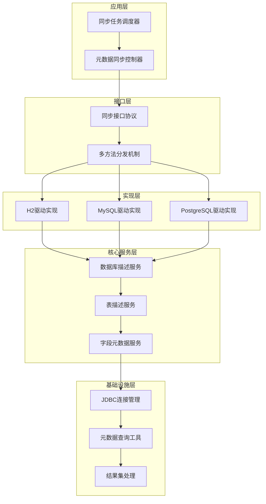
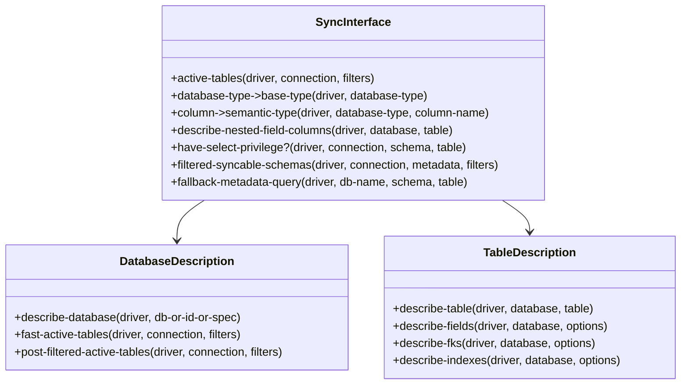
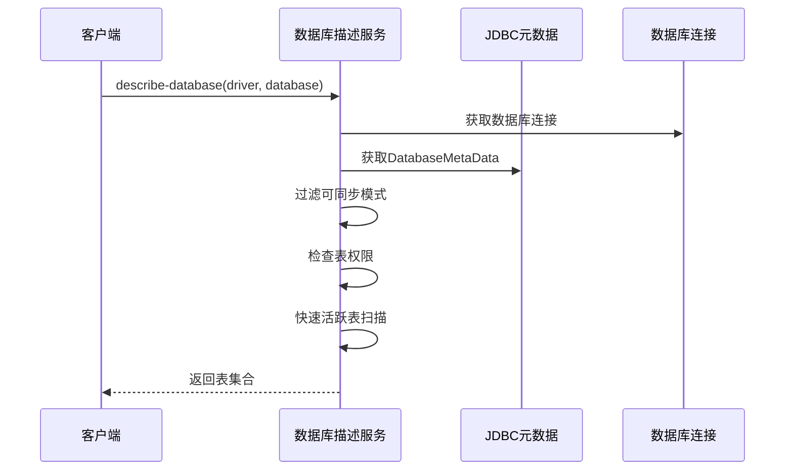
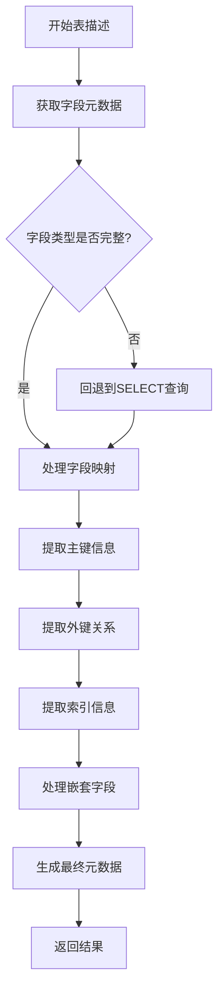
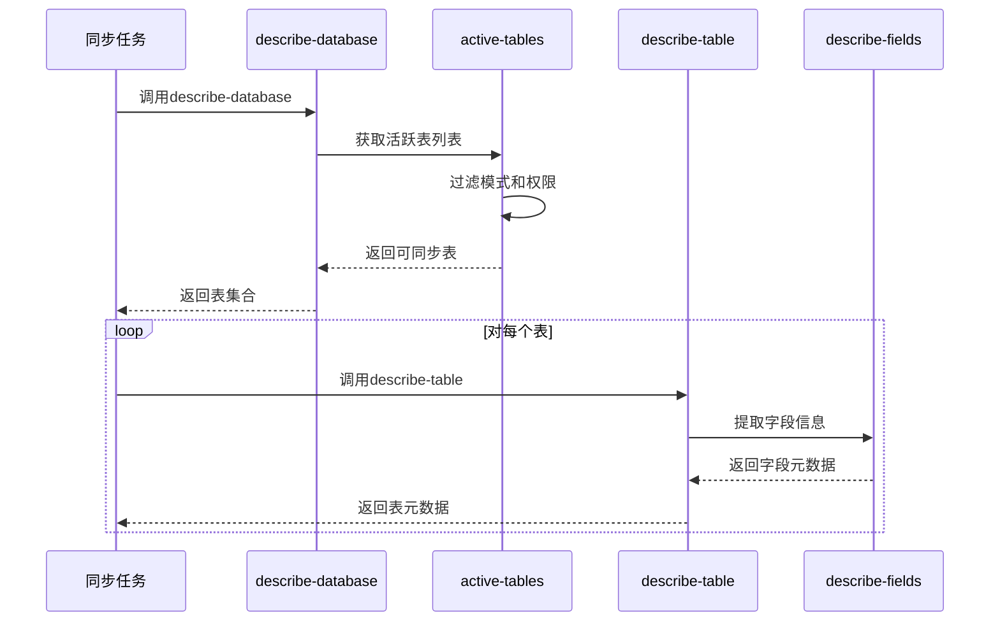
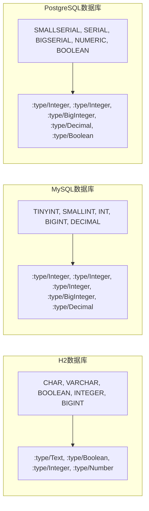
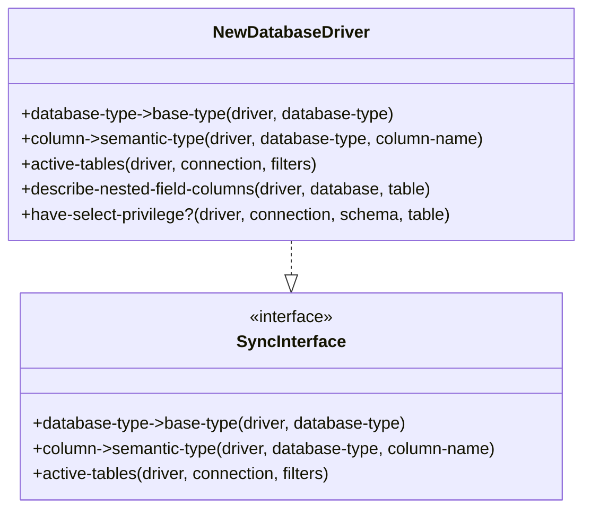

# 元数据同步机制

<cite>
**本文档引用的文件**
- [sync.clj](file://src/metabase/driver/sql_jdbc/sync.clj)
- [interface.clj](file://src/metabase/driver/sql_jdbc/sync/interface.clj)
- [common.clj](file://src/metabase/driver/sql_jdbc/sync/common.clj)
- [describe_database.clj](file://src/metabase/driver/sql_jdbc/sync/describe_database.clj)
- [describe_table.clj](file://src/metabase/driver/sql_jdbc/sync/describe_table.clj)
- [dbms-version.clj](file://src/metabase/driver/sql_jdbc/sync/dbms-version.clj)
- [sync_metadata.clj](file://src/metabase/sync/sync_metadata.clj)
- [driver.clj](file://src/metabase/driver.clj)
</cite>

## 目录
1. [简介](#简介)
2. [系统架构概览](#系统架构概览)
3. [核心组件分析](#核心组件分析)
4. [同步流程详解](#同步流程详解)
5. [数据库方言处理](#数据库方言处理)
6. [扩展机制](#扩展机制)
7. [性能优化策略](#性能优化策略)
8. [故障排除指南](#故障排除指南)
9. [总结](#总结)

## 简介

Metabase的SQL JDBC元数据同步机制是一个高度模块化和可扩展的系统，专门设计用于从各种关系型数据库中提取和同步表结构、字段类型、主键、外键等元数据信息。该系统通过统一的接口协议支持多种数据库驱动，包括H2、MySQL、PostgreSQL等主流数据库。

核心功能包括：
- 自动发现数据库中的表和视图
- 提取字段类型和约束信息
- 同步主键和外键关系
- 处理数据库特定的方言差异
- 支持增量同步和全量同步

## 系统架构概览

元数据同步系统采用分层架构设计，主要包含以下层次：

**图表来源**
- [sync.clj](file://src/metabase/driver/sql_jdbc/sync.clj#L1-L55)
- [interface.clj](file://src/metabase/driver/sql_jdbc/sync/interface.clj#L1-L176)

## 核心组件分析

### 1. 同步接口协议

`interface.clj`定义了所有SQL JDBC驱动必须实现的核心协议，这些协议构成了整个同步系统的基石：

**图表来源**
- [interface.clj](file://src/metabase/driver/sql_jdbc/sync/interface.clj#L10-L175)
- [describe_database.clj](file://src/metabase/driver/sql_jdbc/sync/describe_database.clj#L280-L291)

**节来源**
- [interface.clj](file://src/metabase/driver/sql_jdbc/sync/interface.clj#L1-L176)

### 2. 通用辅助函数

`common.clj`提供了同步过程中使用的通用工具函数，主要包括：

- **PreparedStatement优化**：自动设置`TYPE_FORWARD_ONLY`、`CONCUR_READ_ONLY`等优化选项
- **可缩减结果集处理**：将JDBC ResultSet转换为Clojure可缩减序列
- **连接管理**：确保数据库连接的正确打开和关闭

**节来源**
- [common.clj](file://src/metabase/driver/sql_jdbc/sync/common.clj#L1-L45)

### 3. 数据库描述服务

`describe_database.clj`负责从数据库级别获取元数据信息：

**图表来源**
- [describe_database.clj](file://src/metabase/driver/sql_jdbc/sync/describe_database.clj#L280-L291)

**节来源**
- [describe_database.clj](file://src/metabase/driver/sql_jdbc/sync/describe_database.clj#L1-L291)

### 4. 表描述服务

`describe_table.clj`专注于单个表的详细元数据提取：

**图表来源**
- [describe_table.clj](file://src/metabase/driver/sql_jdbc/sync/describe_table.clj#L150-L200)

**节来源**
- [describe_table.clj](file://src/metabase/driver/sql_jdbc/sync/describe_table.clj#L1-L772)

## 同步流程详解

### 1. 协调`describe-database`和`describe-table`调用

同步系统通过以下流程协调两个核心方法的调用：

**图表来源**
- [sync.clj](file://src/metabase/driver/sql_jdbc/sync.clj#L1-L55)
- [describe_database.clj](file://src/metabase/driver/sql_jdbc/sync/describe_database.clj#L280-L291)

### 2. 描述数据库流程

`describe-database`方法的执行流程如下：

1. **连接建立**：使用`do-with-connection-with-options`建立数据库连接
2. **模式过滤**：应用包含和排除模式过滤器
3. **权限检查**：验证用户对表的SELECT权限
4. **表扫描**：根据数据库特性选择快速或后过滤扫描策略
5. **结果聚合**：构建完整的表元数据集合

**节来源**
- [describe_database.clj](file://src/metabase/driver/sql_jdbc/sync/describe_database.clj#L280-L291)

### 3. 描述表流程

`describe-table`方法的详细执行步骤：

1. **字段元数据提取**：从JDBC DatabaseMetaData获取字段信息
2. **类型映射**：将数据库类型映射到Metabase基础类型
3. **主键识别**：查找并标记主键字段
4. **外键关联**：提取外键关系信息
5. **索引分析**：识别表上的索引结构
6. **嵌套字段处理**：处理JSON等复杂数据类型的子字段

**节来源**
- [describe_table.clj](file://src/metabase/driver/sql_jdbc/sync/describe_table.clj#L300-L350)

## 数据库方言处理

### 1. 类型映射策略

不同数据库的类型映射通过`database-type->base-type`多方法实现：

**图表来源**
- [h2.clj](file://src/metabase/driver/h2.clj#L455-L642)
- [mysql.clj](file://src/metabase/driver/mysql.clj#L524-L554)

### 2. 方言差异处理

系统通过以下机制处理数据库间的方言差异：

- **模式名称转义**：自动处理特殊字符和保留字
- **权限检查适配**：针对不同数据库的权限系统进行适配
- **元数据查询优化**：根据数据库特性优化查询策略
- **错误处理策略**：统一处理数据库特定的异常情况

**节来源**
- [describe_database.clj](file://src/metabase/driver/sql_jdbc/sync/describe_database.clj#L100-L150)

## 扩展机制

### 1. 实现新数据库驱动

要支持新的数据库，需要实现以下接口：

**图表来源**
- [interface.clj](file://src/metabase/driver/sql_jdbc/sync/interface.clj#L10-L175)

### 2. 自定义元数据同步逻辑

可以通过重写以下方法来自定义同步行为：

- **`excluded-schemas`**：定义要排除的模式
- **`filtered-syncable-schemas`**：自定义可同步模式过滤逻辑
- **`fallback-metadata-query`**：提供备用元数据查询方法
- **`current-user-table-privileges`**：自定义权限检查逻辑

**节来源**
- [interface.clj](file://src/metabase/driver/sql_jdbc/sync/interface.clj#L20-L100)

## 性能优化策略

### 1. 连接池优化

系统通过以下方式优化数据库连接性能：

- **连接复用**：使用连接池减少连接开销
- **超时控制**：设置合理的查询超时时间
- **资源管理**：确保ResultSet和Statement的及时关闭

### 2. 查询优化

- **批量查询**：合并多个小查询为批量操作
- **索引利用**：合理使用数据库索引来加速元数据查询
- **缓存策略**：缓存频繁访问的元数据信息

### 3. 并发处理

- **异步执行**：支持并发的元数据查询
- **流式处理**：使用可缩减序列避免内存溢出
- **分页加载**：对大量数据进行分页处理

**节来源**
- [common.clj](file://src/metabase/driver/sql_jdbc/sync/common.clj#L10-L45)

## 故障排除指南

### 常见问题及解决方案

1. **权限不足错误**
   - 检查数据库用户的SELECT权限
   - 验证模式过滤配置
   - 确认排除模式设置正确

2. **连接超时问题**
   - 调整查询超时设置
   - 优化数据库连接参数
   - 检查网络连接稳定性

3. **类型映射错误**
   - 检查数据库类型映射配置
   - 验证自定义类型处理器
   - 确认数据库驱动版本兼容性

4. **性能问题**
   - 分析查询执行计划
   - 优化元数据查询策略
   - 考虑增加硬件资源

### 调试技巧

- 启用详细日志记录
- 使用性能监控工具
- 分析慢查询日志
- 测试不同配置组合

**节来源**
- [describe_database.clj](file://src/metabase/driver/sql_jdbc/sync/describe_database.clj#L120-L180)

## 总结

Metabase的SQL JDBC元数据同步机制是一个设计精良、高度可扩展的系统。它通过统一的接口协议支持多种数据库，通过智能的查询优化策略保证性能，通过灵活的扩展机制适应不同的业务需求。

关键优势包括：

1. **统一抽象**：通过多方法机制提供统一的接口
2. **性能优化**：多层次的查询优化和连接管理
3. **错误处理**：健壮的异常处理和恢复机制
4. **可扩展性**：清晰的扩展点和插件机制
5. **跨数据库兼容**：良好的数据库方言处理能力

该系统为Metabase提供了强大的元数据同步能力，是其能够支持多种数据库的重要技术基础。通过深入理解其设计原理和实现细节，开发者可以更好地维护和扩展这一关键功能。