# 查询执行管道

<cite>
**本文档中引用的文件**
- [execute.clj](file://src/metabase/driver/sql_jdbc/execute.clj)
- [diagnostic.clj](file://src/metabase/driver/sql_jdbc/execute/diagnostic.clj)
- [normalize.clj](file://src/metabase/driver/sql/normalize.clj)
- [connection.clj](file://src/metabase/driver/sql_jdbc/connection.clj)
- [old-impl.clj](file://src/metabase/driver/sql_jdbc/execute/old-impl.clj)
- [legacy-impl.clj](file://src/metabase/driver/sql_jdbc/execute/legacy-impl.clj)
- [normalize_query.clj](file://src/metabase/query_processor/middleware/normalize_query.clj)
- [compile.clj](file://src/metabase/query_processor/compile.clj)
- [catch_exceptions.clj](file://src/metabase/query_processor/middleware/catch_exceptions.clj)
</cite>

## 目录
1. [简介](#简介)
2. [项目结构概览](#项目结构概览)
3. [核心组件分析](#核心组件分析)
4. [架构概览](#架构概览)
5. [详细组件分析](#详细组件分析)
6. [依赖关系分析](#依赖关系分析)
7. [性能优化建议](#性能优化建议)
8. [故障排除指南](#故障排除指南)
9. [结论](#结论)

## 简介

Metabase的SQL JDBC查询执行管道是一个复杂而精密的系统，负责将MBQL（Metabase Query Language）查询转换为可执行的SQL语句，并通过JDBC驱动程序执行这些查询。该管道涵盖了从查询编译、参数替换、连接管理到结果集转换的完整生命周期。

本文档深入分析了`execute.clj`中的查询生命周期，包括MBQL到SQL的编译过程、参数替换机制、连接获取策略、SQL执行流程以及结果集转换。同时探讨了诊断监控、兼容性处理、性能优化和错误恢复等关键特性。

## 项目结构概览

SQL JDBC查询执行管道的核心文件位于以下目录结构中：

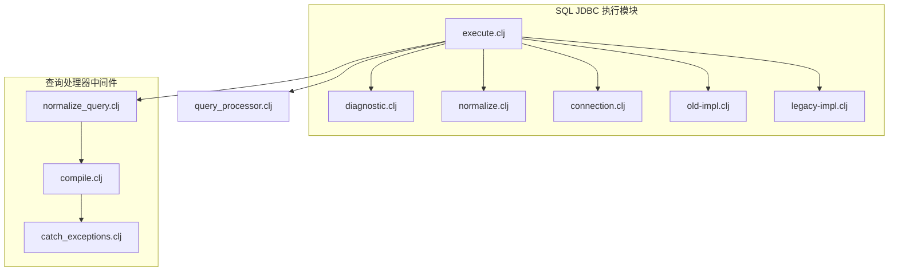

**图表来源**
- [execute.clj](file://src/metabase/driver/sql_jdbc/execute.clj#L1-L50)
- [diagnostic.clj](file://src/metabase/driver/sql_jdbc/execute/diagnostic.clj#L1-L20)

**章节来源**
- [execute.clj](file://src/metabase/driver/sql_jdbc/execute.clj#L1-L100)

## 核心组件分析

### 查询生命周期管理

查询执行管道的核心是`execute-reducible-query`函数，它定义了完整的查询执行生命周期：

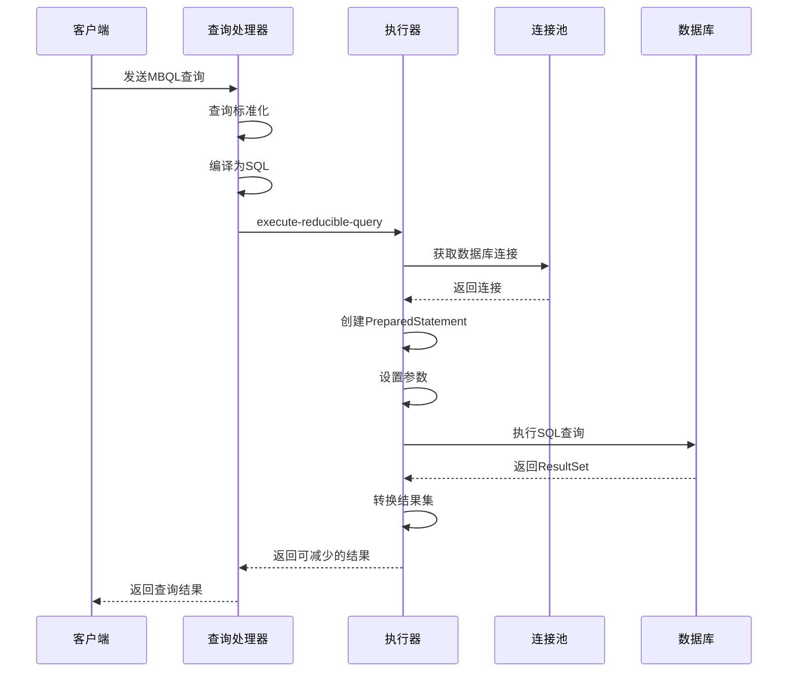

**图表来源**
- [execute.clj](file://src/metabase/driver/sql_jdbc/execute.clj#L750-L850)

### 参数替换机制

参数替换是查询执行的关键环节，通过`set-parameters!`函数实现：

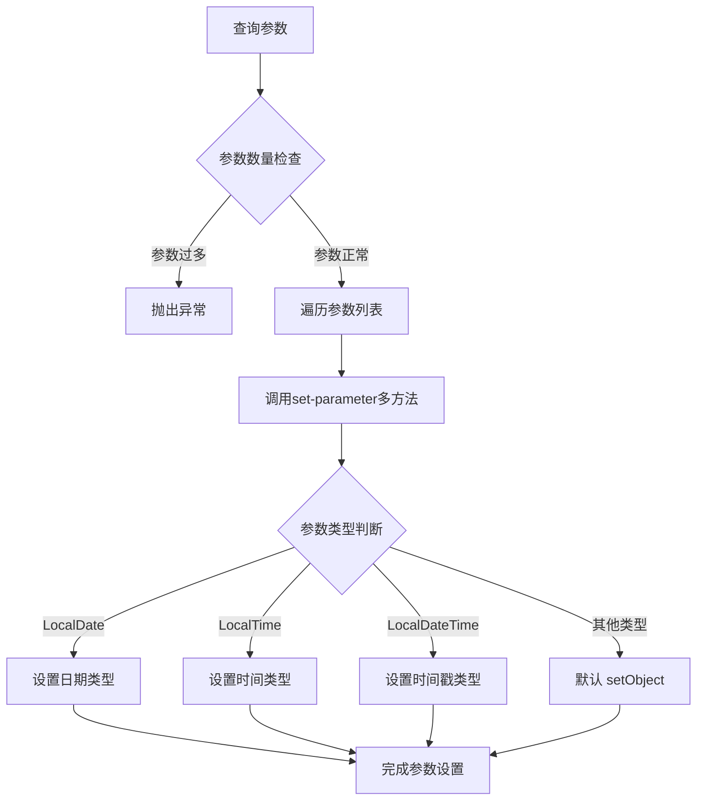

**图表来源**
- [execute.clj](file://src/metabase/driver/sql_jdbc/execute.clj#L500-L550)

**章节来源**
- [execute.clj](file://src/metabase/driver/sql_jdbc/execute.clj#L450-L600)

## 架构概览

SQL JDBC查询执行管道采用分层架构设计，确保了良好的可扩展性和维护性：

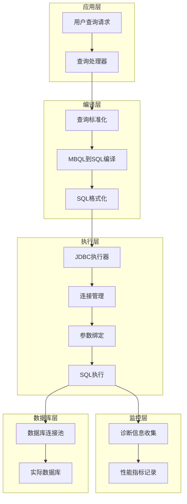

**图表来源**
- [execute.clj](file://src/metabase/driver/sql_jdbc/execute.clj#L1-L100)
- [connection.clj](file://src/metabase/driver/sql_jdbc/connection.clj#L1-L50)

## 详细组件分析

### SQL编译与规范化

#### MBQL到SQL编译过程

查询编译是将抽象的MBQL查询转换为特定数据库的原生SQL语句的过程：

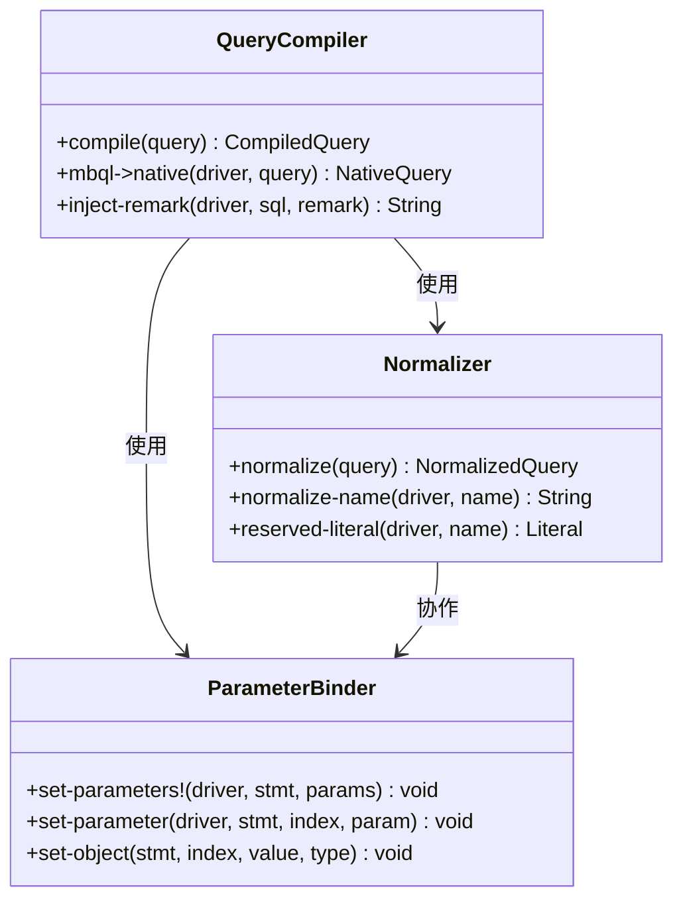

**图表来源**
- [compile.clj](file://src/metabase/query_processor/compile.clj#L30-L80)
- [normalize.clj](file://src/metabase/driver/sql/normalize.clj#L1-L50)

#### 名称规范化机制

名称规范化确保数据库对象名称符合目标数据库的命名规则：

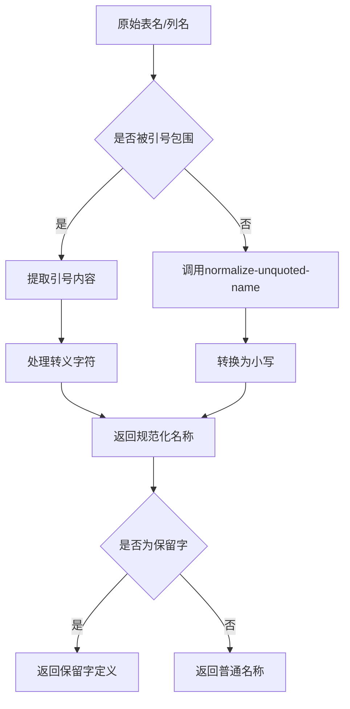

**图表来源**
- [normalize.clj](file://src/metabase/driver/sql/normalize.clj#L20-L40)

**章节来源**
- [normalize.clj](file://src/metabase/driver/sql/normalize.clj#L1-L53)

### 连接管理与池化

#### 连接池配置与管理

连接池是查询执行管道的重要基础设施，提供了高效的连接复用机制：

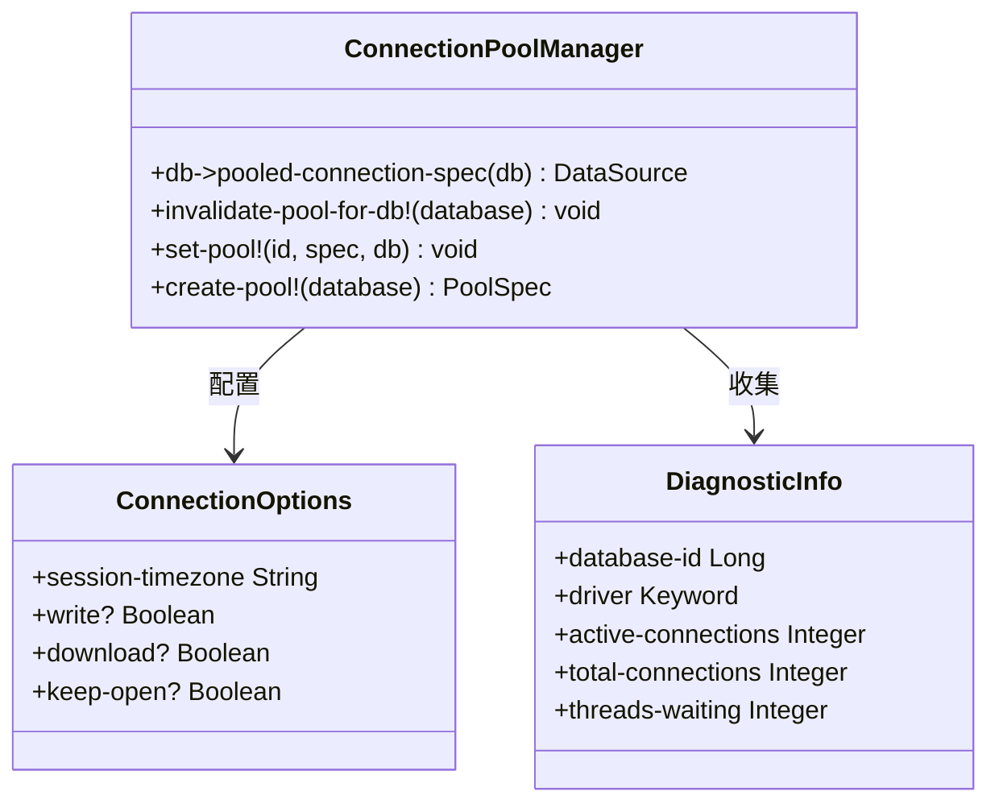

**图表来源**
- [connection.clj](file://src/metabase/driver/sql_jdbc/connection.clj#L200-L300)
- [diagnostic.clj](file://src/metabase/driver/sql_jdbc/execute/diagnostic.clj#L30-L50)

#### 连接获取策略

连接获取采用了多种优化策略以提高性能和可靠性：

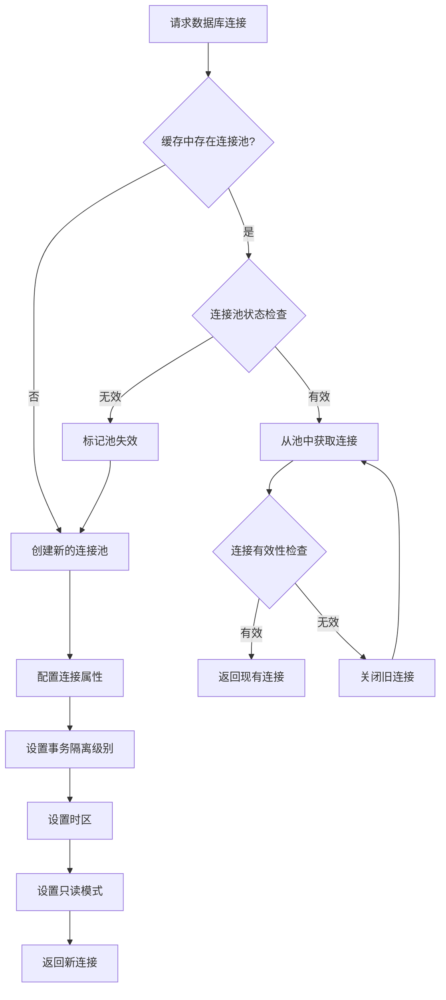

**图表来源**
- [connection.clj](file://src/metabase/driver/sql_jdbc/connection.clj#L300-L380)

**章节来源**
- [connection.clj](file://src/metabase/driver/sql_jdbc/connection.clj#L1-L383)

### 诊断监控系统

#### 执行指标收集

诊断模块提供了全面的查询执行监控能力：

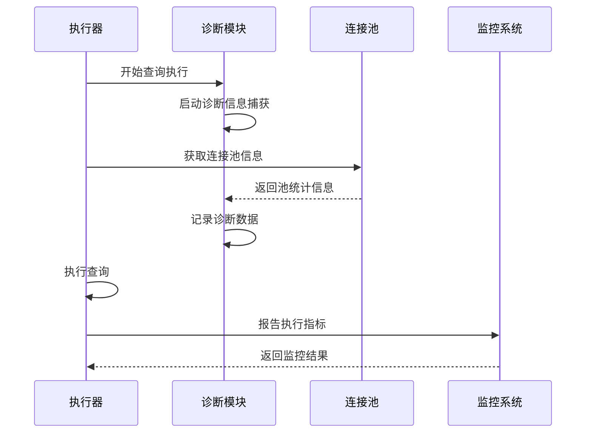

**图表来源**
- [diagnostic.clj](file://src/metabase/driver/sql_jdbc/execute/diagnostic.clj#L30-L50)

#### 性能指标定义

诊断模块收集的关键性能指标包括：

| 指标名称 | 描述 | 数据类型 | 用途 |
|---------|------|----------|------|
| `::database-id` | 数据库标识符 | Long | 区分不同数据库实例 |
| `::driver` | 数据库驱动类型 | Keyword | 分析驱动性能特征 |
| `::active-connections` | 活跃连接数 | Integer | 监控连接使用情况 |
| `::total-connections` | 总连接数 | Integer | 评估连接池大小 |
| `::threads-waiting` | 等待线程数 | Integer | 检测连接池瓶颈 |

**章节来源**
- [diagnostic.clj](file://src/metabase/driver/sql_jdbc/execute/diagnostic.clj#L1-L50)

### 兼容性处理机制

#### 传统实现兼容性

为了保持向后兼容性，系统提供了多个传统实现版本：

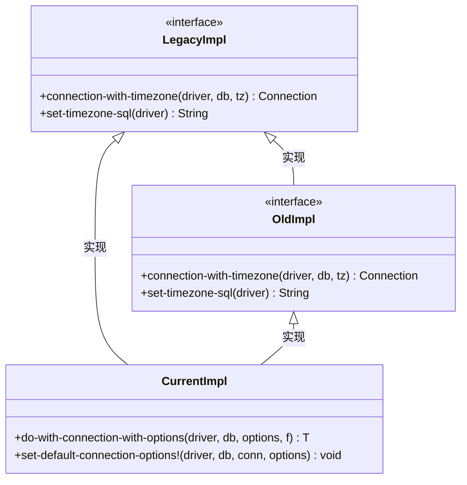

**图表来源**
- [execute.clj](file://src/metabase/driver/sql_jdbc/execute.clj#L880-L900)

**章节来源**
- [execute.clj](file://src/metabase/driver/sql_jdbc/execute.clj#L870-L970)

### 结果集转换

#### 类型安全的结果转换

结果集转换确保了数据库类型到Java类型的正确映射：

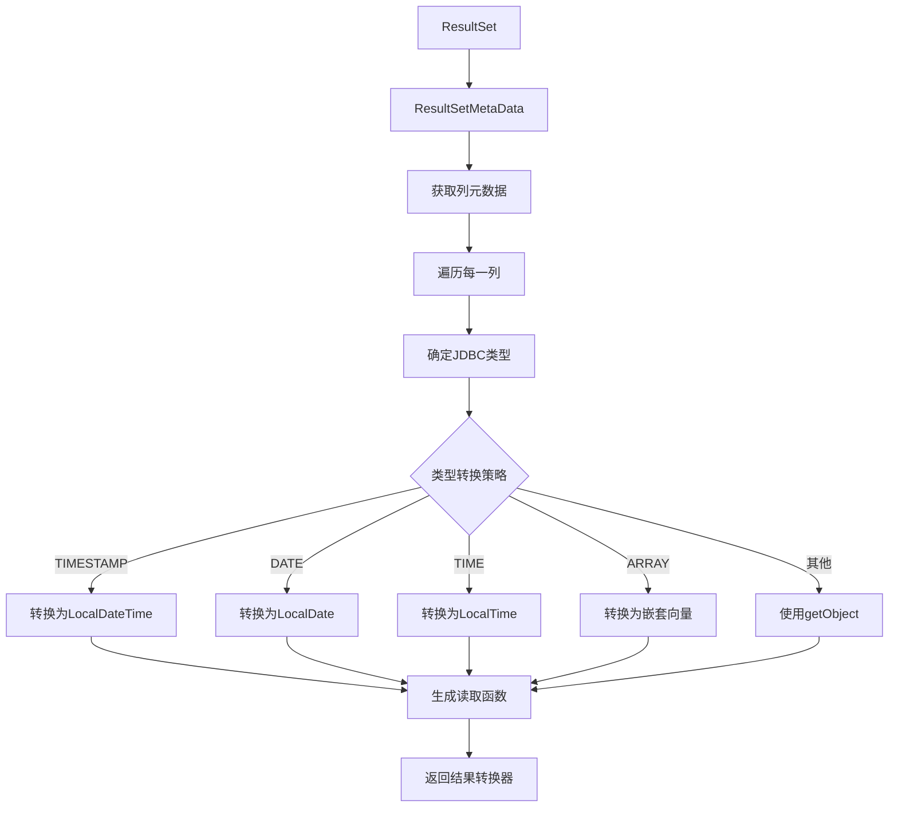

**图表来源**
- [execute.clj](file://src/metabase/driver/sql_jdbc/execute.clj#L650-L750)

**章节来源**
- [execute.clj](file://src/metabase/driver/sql_jdbc/execute.clj#L600-L800)

## 依赖关系分析

查询执行管道的依赖关系体现了模块化设计的优势：

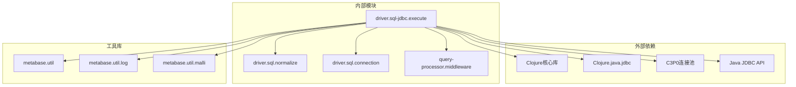

**图表来源**
- [execute.clj](file://src/metabase/driver/sql_jdbc/execute.clj#L1-L30)

**章节来源**
- [execute.clj](file://src/metabase/driver/sql_jdbc/execute.clj#L1-L50)

## 性能优化建议

### 连接复用策略

1. **连接池配置优化**
   - 根据并发查询量调整最大连接数
   - 启用连接有效性检测
   - 配置合适的空闲连接超时时间

2. **连接生命周期管理**
   - 使用`keep-open?`选项避免频繁连接创建
   - 实施连接健康检查机制
   - 及时释放不再使用的连接

### 批处理优化

1. **批量查询执行**
   - 将多个小查询合并为批量操作
   - 使用`execute-raw-queries!`方法处理批量更新
   - 实施事务级别的批量提交

2. **结果集处理优化**
   - 使用可减少的流式处理
   - 实施结果集分页机制
   - 配置合适的fetch size

### 错误重试策略

1. **连接恢复机制**
   - 实施自动连接重试
   - 提供连接上下文本地化选项
   - 实现优雅的连接降级

2. **查询重试逻辑**
   - 基于错误类型的智能重试
   - 实施指数退避算法
   - 设置合理的重试上限

## 故障排除指南

### 常见问题诊断

#### 连接池问题

1. **连接泄漏检测**
   - 监控活跃连接数量
   - 检查未关闭的连接
   - 分析连接获取超时

2. **连接池耗尽**
   - 调整最大连接数配置
   - 优化查询执行时间
   - 实施连接超时控制

#### 查询执行问题

1. **参数绑定错误**
   - 验证参数类型匹配
   - 检查参数数量一致性
   - 确认参数值范围

2. **SQL语法错误**
   - 启用SQL预览功能
   - 检查特殊字符转义
   - 验证数据库兼容性

**章节来源**
- [catch_exceptions.clj](file://src/metabase/query_processor/middleware/catch_exceptions.clj#L60-L150)

### 监控与调试

#### 执行监控

1. **启用诊断信息收集**
   ```clojure
   (sql-jdbc.execute.diagnostic/capturing-diagnostic-info [diag-info-fn]
     ;; 执行查询
     (diag-info-fn))
   ```

2. **性能指标跟踪**
   - 监控查询执行时间
   - 跟踪连接池使用率
   - 分析错误发生频率

#### 日志配置

1. **调试级别设置**
   - 启用详细的SQL日志
   - 配置连接池监控日志
   - 设置异常堆栈跟踪

2. **生产环境监控**
   - 实施结构化日志记录
   - 配置性能指标导出
   - 建立告警机制

## 结论

Metabase的SQL JDBC查询执行管道是一个高度优化的系统，通过精心设计的架构实现了高性能、高可靠性的数据库查询执行。该管道的主要优势包括：

1. **模块化设计**：清晰的职责分离使得系统易于维护和扩展
2. **性能优化**：连接池、批处理和流式处理等技术确保了出色的性能表现
3. **兼容性保证**：多层次的兼容性处理确保了系统的稳定运行
4. **监控能力**：全面的诊断和监控功能支持了运维和故障排除

通过深入理解这个查询执行管道的工作原理，开发者可以更好地优化查询性能，解决常见问题，并在需要时进行定制化扩展。随着数据库技术和查询需求的不断发展，这个管道将继续演进以满足更高的性能和可用性要求。