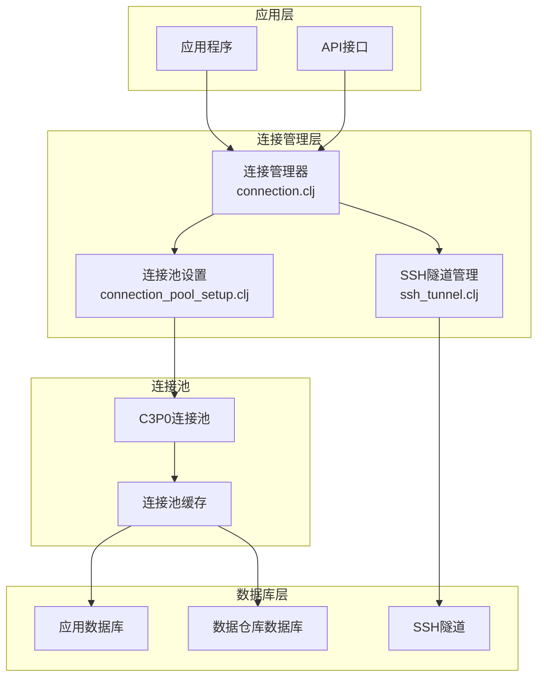
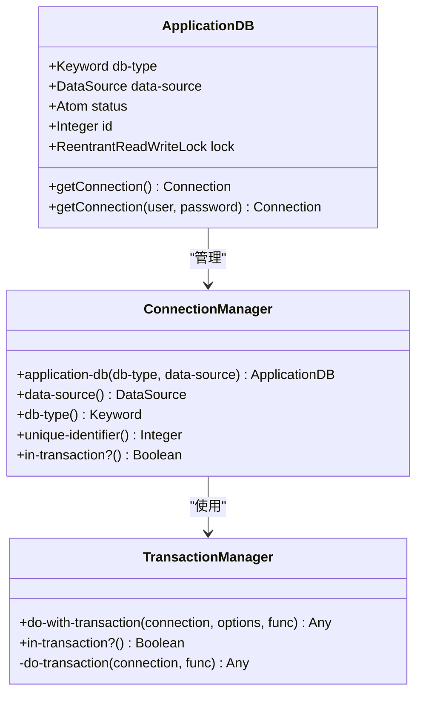
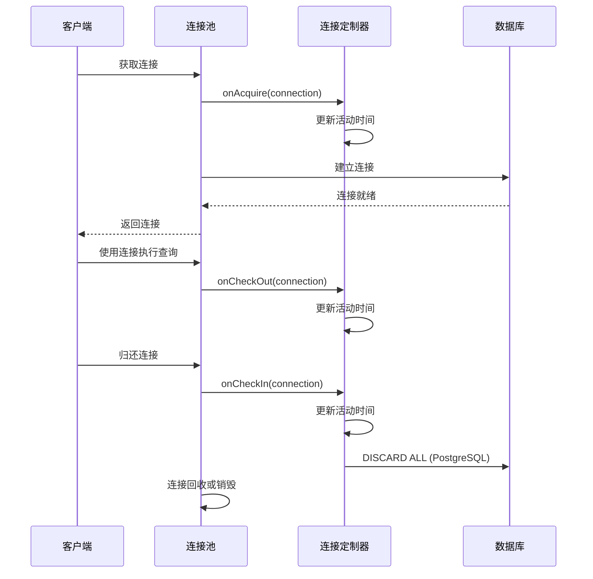
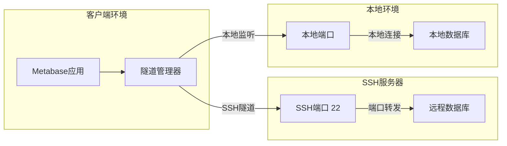
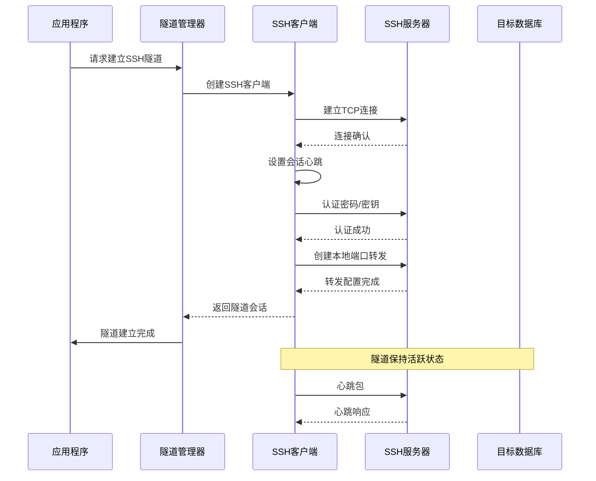
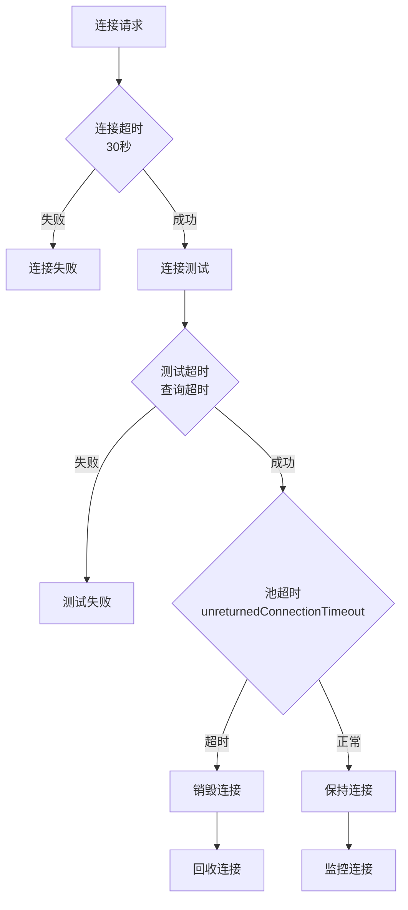
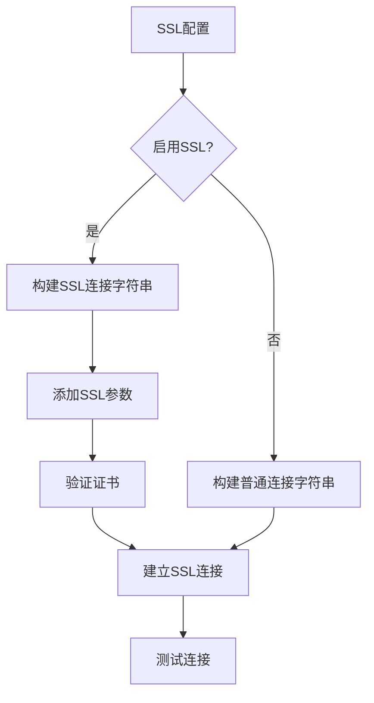
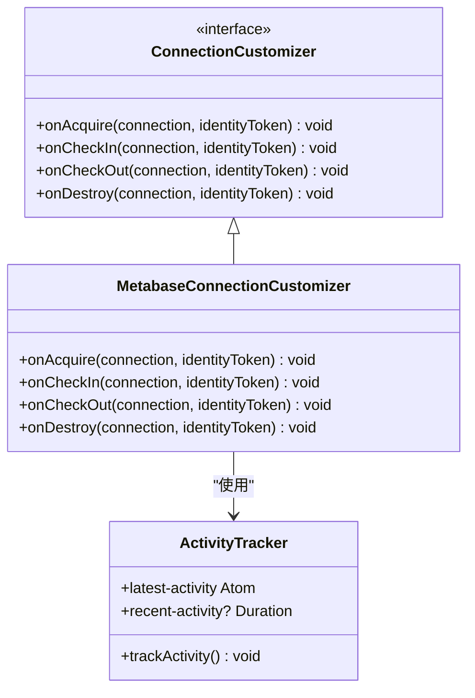
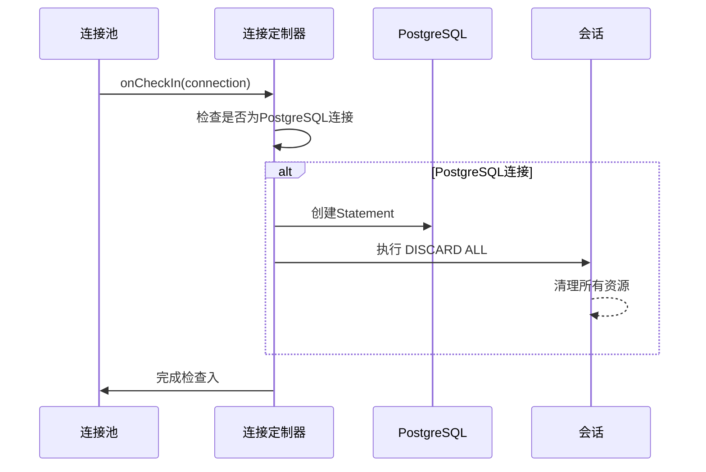
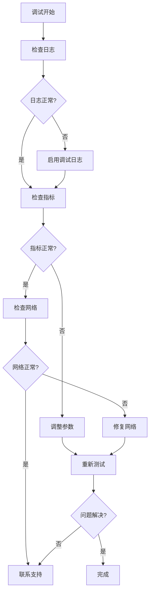

# 连接管理与SSH隧道

<cite>
**本文档中引用的文件**
- [connection.clj](file://src/metabase/app_db/connection.clj)
- [connection_pool_setup.clj](file://src/metabase/app_db/connection_pool_setup.clj)
- [ssh_tunnel.clj](file://src/metabase/driver/sql_jdbc/connection/ssh_tunnel.clj)
- [connection.clj](file://src/metabase/driver/sql_jdbc/connection.clj)
- [settings.clj](file://src/metabase/driver/settings.clj)
- [common.clj](file://src/metabase/driver/common.clj)
- [data_source.clj](file://src/metabase/app_db/data_source.clj)
- [util.clj](file://src/metabase/driver/util.clj)
</cite>

## 目录
1. [简介](#简介)
2. [系统架构概览](#系统架构概览)
3. [应用数据库连接管理](#应用数据库连接管理)
4. [连接池配置与优化](#连接池配置与优化)
5. [SSH隧道建立机制](#ssh隧道建立机制)
6. [连接超时与回收策略](#连接超时与回收策略)
7. [SSL与时区配置](#ssl与时区配置)
8. [自定义连接工厂](#自定义连接工厂)
9. [故障排除指南](#故障排除指南)
10. [最佳实践](#最佳实践)

## 简介

Metabase的连接管理系统是一个高度模块化的架构，负责处理应用程序数据库和数据仓库数据库的连接。该系统通过`connection.clj`模块实现了基于`connection-with-options`的数据库连接建立，并与`app_db/connection_pool_setup.clj`深度集成，提供强大的连接池管理功能。同时，SSH隧道支持为复杂网络环境提供了安全的连接解决方案。

## 系统架构概览

**图表来源**
- [connection.clj](file://src/metabase/app_db/connection.clj#L1-L50)
- [connection_pool_setup.clj](file://src/metabase/app_db/connection_pool_setup.clj#L1-L50)
- [ssh_tunnel.clj](file://src/metabase/driver/sql_jdbc/connection/ssh_tunnel.clj#L1-L50)

## 应用数据库连接管理

### 核心连接组件

应用数据库连接通过`ApplicationDB`记录类型进行管理，该类型封装了数据库类型、数据源和连接锁等关键信息。

**图表来源**
- [connection.clj](file://src/metabase/app_db/connection.clj#L25-L60)

### 连接池集成

连接池设置通过`connection-pool-data-source`函数实现，该函数根据数据库类型和未池化的数据源创建C3P0连接池。

**章节来源**
- [connection.clj](file://src/metabase/app_db/connection.clj#L65-L85)
- [connection_pool_setup.clj](file://src/metabase/app_db/connection_pool_setup.clj#L130-L152)

## 连接池配置与优化

### 默认连接池属性

Metabase为应用数据库和数据仓库数据库分别设置了不同的连接池配置策略：

| 配置项 | 应用数据库 | 数据仓库数据库 | 说明 |
|--------|------------|----------------|------|
| `maxPoolSize` | 15 | 动态配置 | 最大连接数限制 |
| `minPoolSize` | 无限制 | 0 | 最小连接数 |
| `initialPoolSize` | 无限制 | 0 | 初始连接数 |
| `maxIdleTime` | 无限制 | 3小时 | 空闲连接最大存活时间 |
| `maxIdleTimeExcessConnections` | 10分钟 | 5分钟 | 超额空闲连接回收时间 |
| `maxConnectionAge` | 1小时 | 无限制 | 连接绝对年龄限制 |
| `testConnectionOnCheckout` | 否 | 是 | 检出时测试连接有效性 |

### 连接生命周期管理

**图表来源**
- [connection_pool_setup.clj](file://src/metabase/app_db/connection_pool_setup.clj#L32-L50)

**章节来源**
- [connection_pool_setup.clj](file://src/metabase/app_db/connection_pool_setup.clj#L85-L130)

## SSH隧道建立机制

### SSH隧道架构

SSH隧道为跨网络的安全数据库访问提供了强大支持，通过Apache MINA SSHD库实现。

**图表来源**
- [ssh_tunnel.clj](file://src/metabase/driver/sql_jdbc/connection/ssh_tunnel.clj#L56-L90)

### 隧道建立流程

SSH隧道的建立过程包含身份验证、端口转发配置和心跳维护等关键步骤：

**图表来源**
- [ssh_tunnel.clj](file://src/metabase/driver/sql_jdbc/connection/ssh_tunnel.clj#L56-L90)

### 身份验证机制

SSH隧道支持多种身份验证方式：

| 认证方式 | 配置参数 | 安全级别 | 使用场景 |
|----------|----------|----------|----------|
| 密码认证 | `tunnel-pass` | 中等 | 开发环境、临时访问 |
| 私钥认证 | `tunnel-private-key` | 高 | 生产环境、自动化 |
| 密钥密码 | `tunnel-private-key-passphrase` | 高 | 加密私钥保护 |

**章节来源**
- [ssh_tunnel.clj](file://src/metabase/driver/sql_jdbc/connection/ssh_tunnel.clj#L40-L55)

## 连接超时与回收策略

### 超时配置层次

Metabase建立了多层级的超时控制机制：

**图表来源**
- [ssh_tunnel.clj](file://src/metabase/driver/sql_jdbc/connection/ssh_tunnel.clj#L35-L40)
- [settings.clj](file://src/metabase/driver/settings.clj#L70-L85)

### 回收策略配置

| 策略类型 | 配置参数 | 默认值 | 说明 |
|----------|----------|--------|------|
| 连接测试间隔 | `idleConnectionTestPeriod` | 60秒 | 空闲连接定期测试 |
| 超额连接回收 | `maxIdleTimeExcessConnections` | 10分钟 | 超过最小值的连接回收 |
| 连接绝对年龄 | `maxConnectionAge` | 1小时 | 连接最大存活时间 |
| 未返回连接超时 | `unreturnedConnectionTimeout` | 查询超时 | 连接归还超时时间 |

**章节来源**
- [connection_pool_setup.clj](file://src/metabase/app_db/connection_pool_setup.clj#L85-L130)
- [connection.clj](file://src/metabase/driver/sql_jdbc/connection.clj#L96-L141)

## SSL与时区配置

### SSL配置支持

Metabase通过JDBC连接字符串支持SSL加密连接：

**图表来源**
- [common.clj](file://src/metabase/driver/common.clj#L61-L65)

### 时区处理机制

时区配置确保查询结果的一致性：

| 时区类型 | 配置位置 | 处理方式 | 优先级 |
|----------|----------|----------|--------|
| 报告时区 | `report-timezone` | 查询前设置 | 最高 |
| 数据库时区 | 数据库连接 | 自动检测 | 中等 |
| 系统时区 | 服务器环境 | 默认 fallback | 最低 |

**章节来源**
- [settings.clj](file://src/metabase/driver/settings.clj#L25-L50)

## 自定义连接工厂

### 连接定制器实现

Metabase通过`MetabaseConnectionCustomizer`实现连接生命周期管理：

**图表来源**
- [connection_pool_setup.clj](file://src/metabase/app_db/connection_pool_setup.clj#L50-L65)

### PostgreSQL特殊处理

对于PostgreSQL连接，系统自动执行`DISCARD ALL`命令清理会话资源：

**图表来源**
- [connection_pool_setup.clj](file://src/metabase/app_db/connection_pool_setup.clj#L38-L45)

**章节来源**
- [connection_pool_setup.clj](file://src/metabase/app_db/connection_pool_setup.clj#L63-L86)

## 故障排除指南

### 常见连接问题

| 问题类型 | 症状 | 可能原因 | 解决方案 |
|----------|------|----------|----------|
| SSH隧道连接失败 | "ssh tunnel looks closed" | 隧道断开、认证失败 | 检查SSH服务器状态、验证凭据 |
| 连接池耗尽 | "all connections in use" | 连接泄漏、池大小不足 | 增加池大小、检查连接归还 |
| SSL握手失败 | SSL证书错误 | 证书过期、不匹配 | 更新证书、检查SSL配置 |
| 时区不一致 | 时间戳错误 | 时区设置冲突 | 统一时区配置 |

### 调试工具

**章节来源**
- [connection.clj](file://src/metabase/driver/sql_jdbc/connection.clj#L245-L273)

## 最佳实践

### 生产环境配置建议

1. **连接池优化**
   - 根据并发需求调整`maxPoolSize`
   - 启用连接测试以确保连接质量
   - 配置适当的超时参数

2. **SSH隧道安全**
   - 使用密钥认证而非密码
   - 定期轮换SSH密钥
   - 限制隧道访问权限

3. **监控与维护**
   - 监控连接池使用率
   - 设置连接泄漏检测
   - 定期清理无用连接

### 性能调优指南

| 参数 | 推荐值 | 调优方向 | 注意事项 |
|------|--------|----------|----------|
| `maxPoolSize` | 并发数 × 1.5 | 根据负载调整 | 避免过大导致资源浪费 |
| `maxIdleTime` | 3小时 | 平衡内存和性能 | 云数据库可适当延长 |
| `testConnectionOnCheckout` | true | 提高连接可靠性 | 增加少量延迟 |
| `unreturnedConnectionTimeout` | 查询超时 | 防止连接泄漏 | 与查询超时同步 |

### 网络环境适配

对于不同网络环境的推荐配置：

- **内网环境**: 启用SSL，增加池大小
- **跨云环境**: 使用SSH隧道，调整超时时间
- **移动网络**: 减少连接池大小，增加重试次数
- **高延迟网络**: 增加连接超时，启用连接预热

通过遵循这些最佳实践，可以确保Metabase在各种复杂网络环境中稳定高效地运行，为用户提供可靠的数据库连接服务。