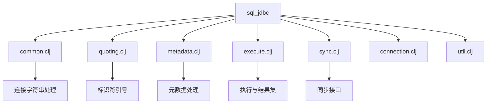
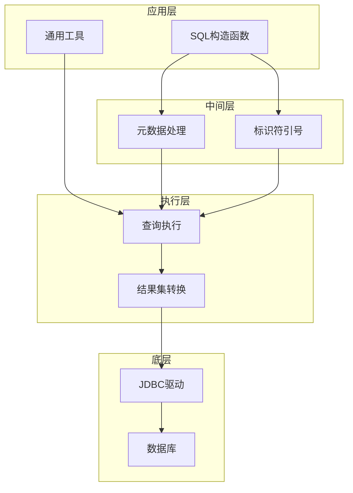
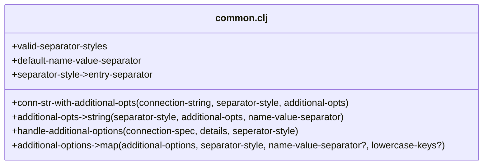
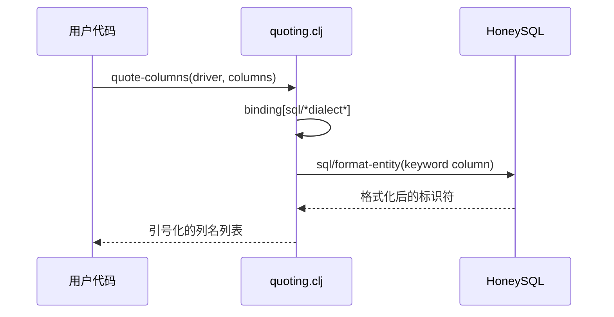
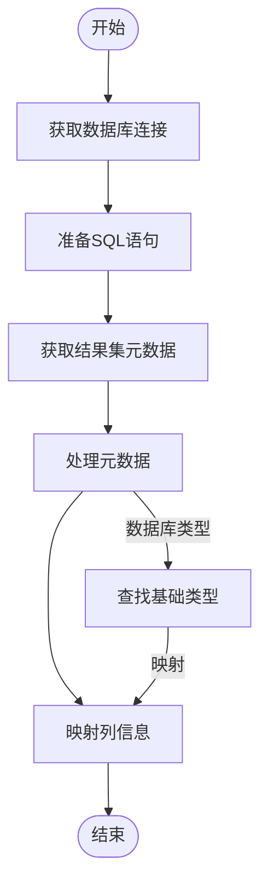
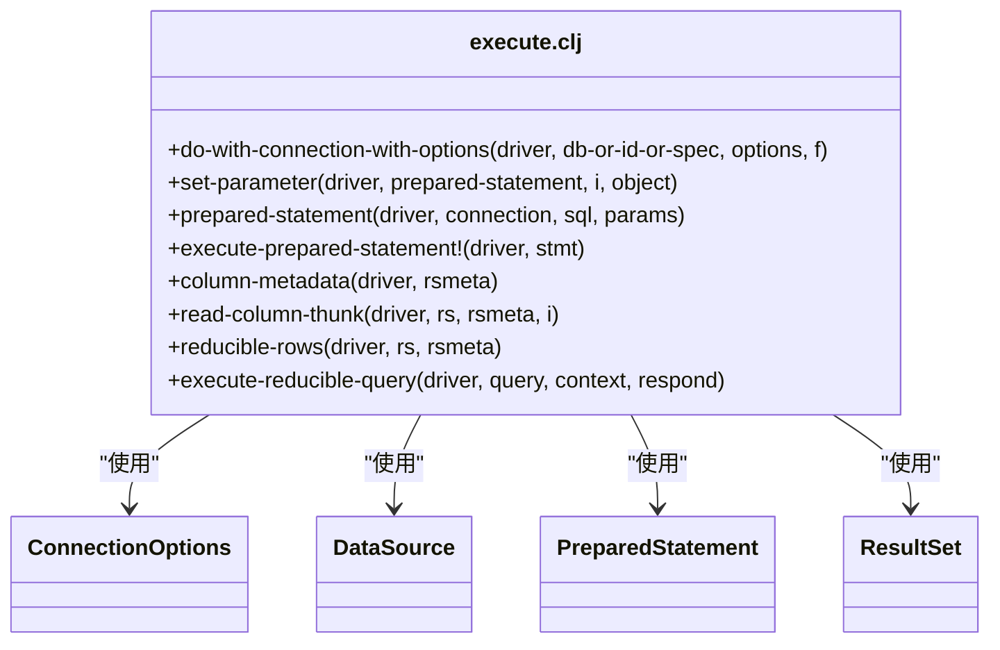
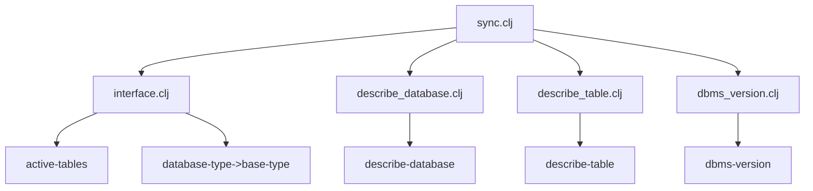
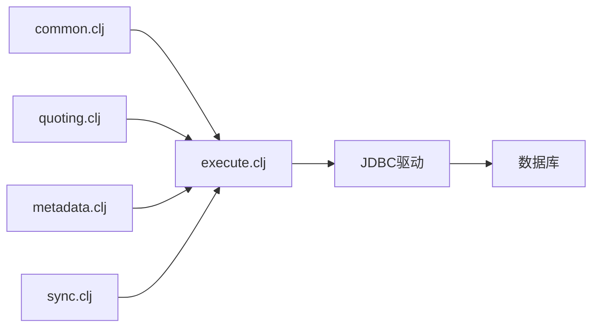

# 通用SQL功能与方言处理

<cite>
**本文档引用的文件**  
- [common.clj](file://src/metabase/driver/sql_jdbc/common.clj)
- [quoting.clj](file://src/metabase/driver/sql_jdbc/quoting.clj)
- [metadata.clj](file://src/metabase/driver/sql_jdbc/metadata.clj)
- [execute.clj](file://src/metabase/driver/sql_jdbc/execute.clj)
- [sync.clj](file://src/metabase/driver/sql_jdbc/sync.clj)
- [interface.clj](file://src/metabase/driver/sql_jdbc/sync/interface.clj)
- [sql.clj](file://src/metabase/driver/sql.clj)
</cite>

## 目录
1. [简介](#简介)
2. [项目结构](#项目结构)
3. [核心组件](#核心组件)
4. [架构概述](#架构概述)
5. [详细组件分析](#详细组件分析)
6. [依赖分析](#依赖分析)
7. [性能考虑](#性能考虑)
8. [故障排除指南](#故障排除指南)
9. [结论](#结论)

## 简介
本文档全面阐述Metabase中SQL JDBC通用功能的实现，重点分析`common.clj`、`quoting.clj`、`metadata.clj`和`sql.clj`等核心文件。文档详细解释了跨数据库基础功能的实现机制，包括结果集到Clojure数据结构的转换、基于数据库方言的标识符引号生成、JDBC元数据的封装处理，以及通用SQL构造函数的设计。同时，文档还提供了处理特定数据库方言差异的最佳实践和扩展方法。

## 项目结构
Metabase的SQL JDBC功能主要集中在`src/metabase/driver/sql_jdbc/`目录下，该目录包含多个专门处理不同方面的文件。这种模块化设计使得代码结构清晰，职责分明。

**图表来源**  
- [common.clj](file://src/metabase/driver/sql_jdbc/common.clj)
- [quoting.clj](file://src/metabase/driver/sql_jdbc/quoting.clj)
- [metadata.clj](file://src/metabase/driver/sql_jdbc/metadata.clj)
- [execute.clj](file://src/metabase/driver/sql_jdbc/execute.clj)
- [sync.clj](file://src/metabase/driver/sql_jdbc/sync.clj)

**本节来源**  
- [src/metabase/driver/sql_jdbc/](file://src/metabase/driver/sql_jdbc/)

## 核心组件
Metabase的SQL JDBC实现围绕几个核心组件构建，这些组件共同提供了跨数据库的通用功能。`common.clj`负责连接字符串的处理和附加选项的管理，`quoting.clj`处理不同数据库方言的标识符引号，`metadata.clj`封装了JDBC元数据的获取和处理，而`execute.clj`则负责SQL查询的执行和结果集的转换。

**本节来源**  
- [common.clj](file://src/metabase/driver/sql_jdbc/common.clj#L1-L88)
- [quoting.clj](file://src/metabase/driver/sql_jdbc/quoting.clj#L1-L27)
- [metadata.clj](file://src/metabase/driver/sql_jdbc/metadata.clj#L1-L41)
- [execute.clj](file://src/metabase/driver/sql_jdbc/execute.clj#L1-L799)

## 架构概述
Metabase的SQL JDBC架构采用分层设计，各组件之间通过清晰的接口进行交互。底层是JDBC驱动，提供与数据库的直接连接。在其之上是`execute.clj`提供的执行层，负责查询的准备、执行和结果集处理。中间层包括`metadata.clj`和`quoting.clj`，分别处理元数据和SQL语法的方言差异。最上层是`common.clj`和`sql.clj`，提供通用的工具函数和SQL构造能力。

**图表来源**  
- [common.clj](file://src/metabase/driver/sql_jdbc/common.clj)
- [quoting.clj](file://src/metabase/driver/sql_jdbc/quoting.clj)
- [metadata.clj](file://src/metabase/driver/sql_jdbc/metadata.clj)
- [execute.clj](file://src/metabase/driver/sql_jdbc/execute.clj)

## 详细组件分析

### common.clj分析
`common.clj`文件提供了处理数据库连接字符串和附加选项的通用功能。它定义了`conn-str-with-additional-opts`函数，用于将附加选项添加到连接字符串中，支持URL、分号和逗号三种分隔符风格。`additional-opts->string`函数将选项映射转换为字符串格式，而`handle-additional-options`函数则负责将这些选项应用到连接规范中。

**图表来源**  
- [common.clj](file://src/metabase/driver/sql_jdbc/common.clj#L1-L88)

**本节来源**  
- [common.clj](file://src/metabase/driver/sql_jdbc/common.clj#L1-L88)

### quoting.clj分析
`quoting.clj`文件负责处理不同数据库方言的标识符引号问题。它通过`with-quoting`宏绑定HoneySQL的方言设置，确保生成的SQL语句符合目标数据库的语法要求。`quote-table`和`quote-identifier`函数用于保护表名和标识符，防止它们被解释为函数调用。`quote-columns`函数则用于在构建HoneySQL查询时引号化列名。

**图表来源**  
- [quoting.clj](file://src/metabase/driver/sql_jdbc/quoting.clj#L1-L27)

**本节来源**  
- [quoting.clj](file://src/metabase/driver/sql_jdbc/quoting.clj#L1-L27)

### metadata.clj分析
`metadata.clj`文件实现了JDBC驱动的元数据查询功能。`query-result-metadata`多方法提供了获取查询结果元数据的默认实现，它通过准备语句并获取结果集元数据来工作，而无需实际执行查询。该方法利用`sql-jdbc.execute/do-with-connection-with-options`获取数据库连接，并使用`mapv`函数将元数据转换为Clojure数据结构。

**图表来源**  
- [metadata.clj](file://src/metabase/driver/sql_jdbc/metadata.clj#L1-L41)

**本节来源**  
- [metadata.clj](file://src/metabase/driver/sql_jdbc/metadata.clj#L1-L41)

### execute.clj分析
`execute.clj`是SQL JDBC实现的核心，负责查询的执行和结果集的处理。它定义了`do-with-connection-with-options`多方法，用于获取和配置数据库连接。`prepared-statement`和`statement`多方法分别用于创建预处理语句和普通语句。`read-column-thunk`多方法是结果集到Clojure数据结构转换的关键，它为每一列生成一个读取函数。

**图表来源**  
- [execute.clj](file://src/metabase/driver/sql_jdbc/execute.clj#L1-L799)

**本节来源**  
- [execute.clj](file://src/metabase/driver/sql_jdbc/execute.clj#L1-L799)

### sync.clj分析
`sync.clj`文件整合了SQL JDBC驱动的同步相关功能。它通过`p/import-vars`从多个命名空间导入变量，实现了代码的模块化和复用。该文件主要作为接口聚合点，将`sync.interface`、`describe-database`、`describe-table`和`dbms-version`等模块的功能统一暴露给外部使用。

**图表来源**  
- [sync.clj](file://src/metabase/driver/sql_jdbc/sync.clj#L1-L54)

**本节来源**  
- [sync.clj](file://src/metabase/driver/sql_jdbc/sync.clj#L1-L54)

## 依赖分析
Metabase的SQL JDBC组件之间存在清晰的依赖关系。`execute.clj`是核心依赖，被`metadata.clj`、`sync.clj`等多个文件引用。`quoting.clj`依赖于HoneySQL库来实现引号功能。`common.clj`作为基础工具，被其他组件广泛使用。这种依赖结构确保了代码的模块化和可维护性。

**图表来源**  
- [common.clj](file://src/metabase/driver/sql_jdbc/common.clj)
- [quoting.clj](file://src/metabase/driver/sql_jdbc/quoting.clj)
- [metadata.clj](file://src/metabase/driver/sql_jdbc/metadata.clj)
- [execute.clj](file://src/metabase/driver/sql_jdbc/execute.clj)
- [sync.clj](file://src/metabase/driver/sql_jdbc/sync.clj)

**本节来源**  
- [common.clj](file://src/metabase/driver/sql_jdbc/common.clj)
- [quoting.clj](file://src/metabase/driver/sql_jdbc/quoting.clj)
- [metadata.clj](file://src/metabase/driver/sql_jdbc/metadata.clj)
- [execute.clj](file://src/metabase/driver/sql_jdbc/execute.clj)
- [sync.clj](file://src/metabase/driver/sql_jdbc/sync.clj)

## 性能考虑
在处理SQL JDBC功能时，性能是一个关键考虑因素。`execute.clj`中的`do-with-connection-with-options`方法通过设置连接选项（如只读模式、自动提交和结果集保持性）来优化查询性能。`prepared-statement`方法设置了`ResultSet/TYPE_FORWARD_ONLY`和`ResultSet/CONCUR_READ_ONLY`，以提高结果集读取性能。此外，使用`reducible-rows`可以实现惰性求值，避免一次性加载大量数据到内存中。

## 故障排除指南
当遇到SQL JDBC相关问题时，可以从以下几个方面进行排查：检查连接字符串格式是否正确，验证数据库方言设置是否匹配，确认元数据查询是否返回预期结果，以及检查结果集转换是否正确处理了数据类型。日志记录功能可以帮助诊断连接和执行过程中的问题。

**本节来源**  
- [execute.clj](file://src/metabase/driver/sql_jdbc/execute.clj#L1-L799)
- [metadata.clj](file://src/metabase/driver/sql_jdbc/metadata.clj#L1-L41)

## 结论
Metabase的SQL JDBC通用功能通过模块化设计和清晰的接口定义，实现了跨数据库的兼容性和可扩展性。`common.clj`、`quoting.clj`、`metadata.clj`和`execute.clj`等核心组件各司其职，共同构建了一个强大而灵活的数据库访问层。通过理解这些组件的工作原理和相互关系，开发者可以更好地利用Metabase的SQL功能，并为新的数据库驱动提供支持。