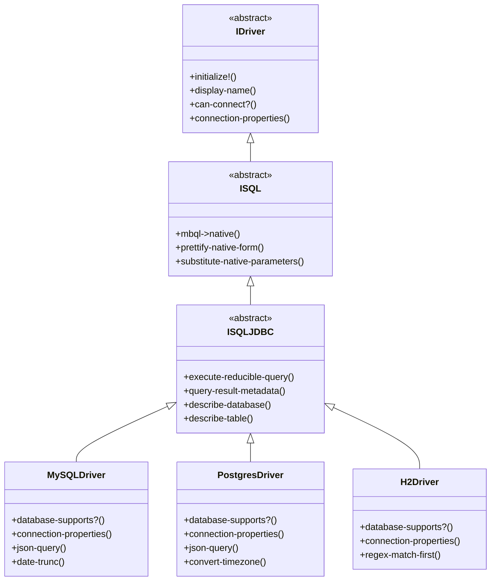
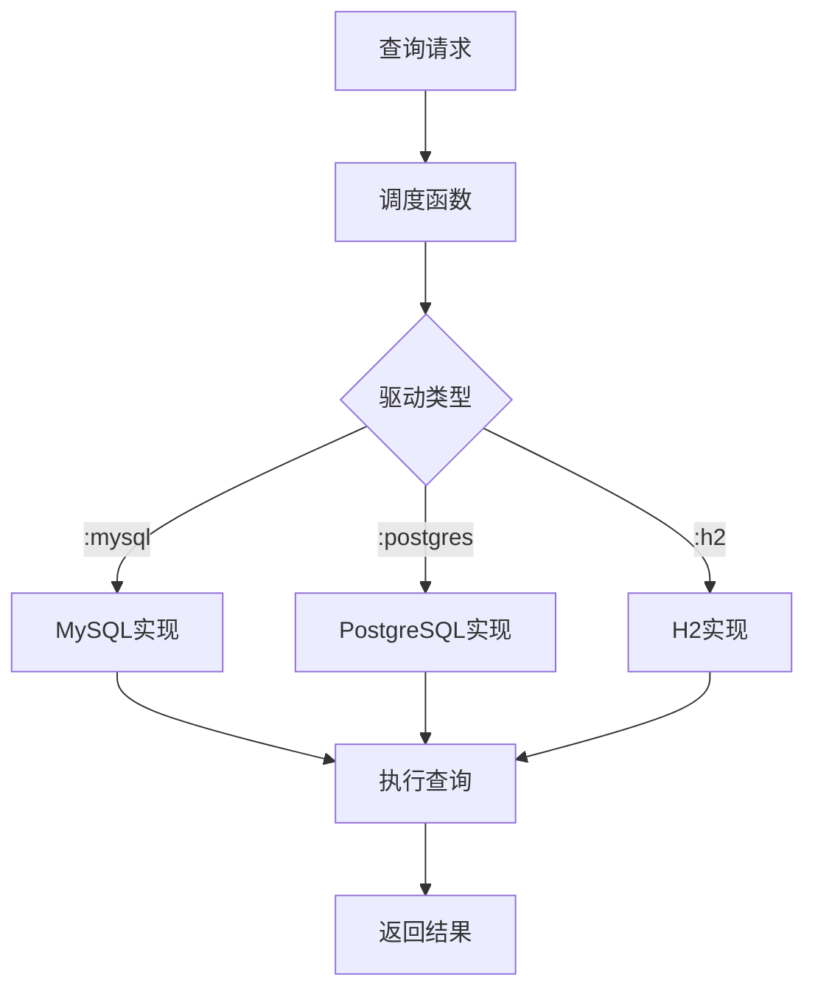
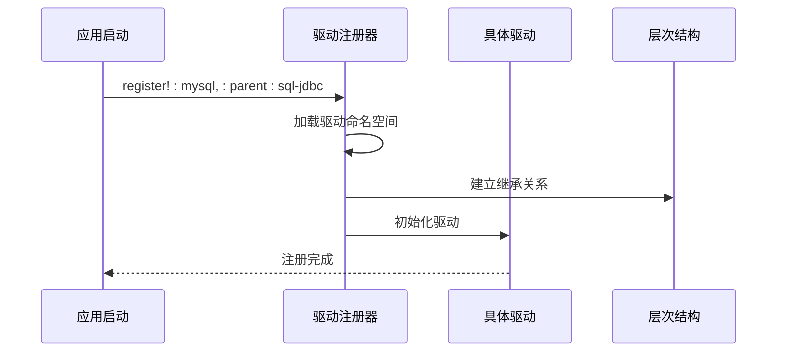
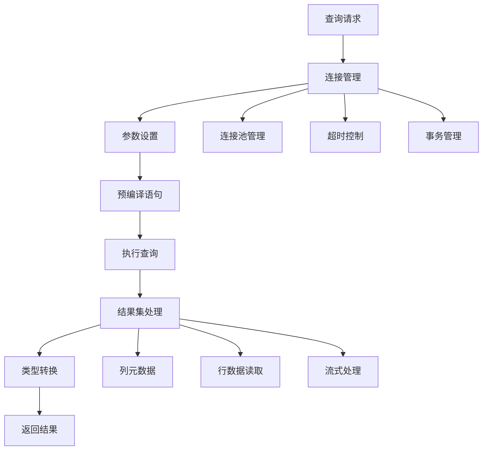
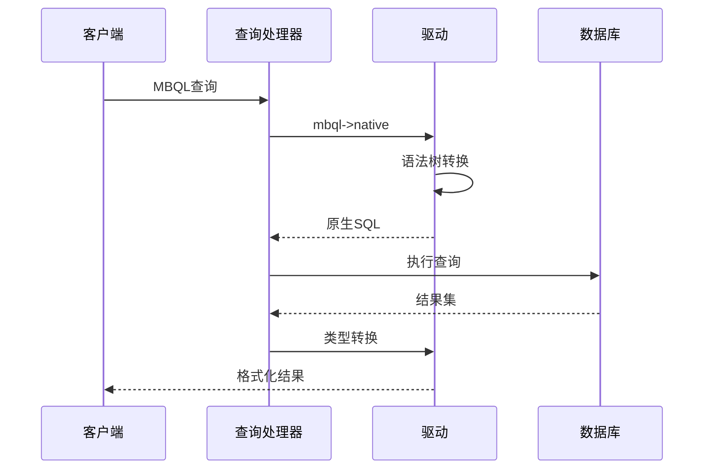
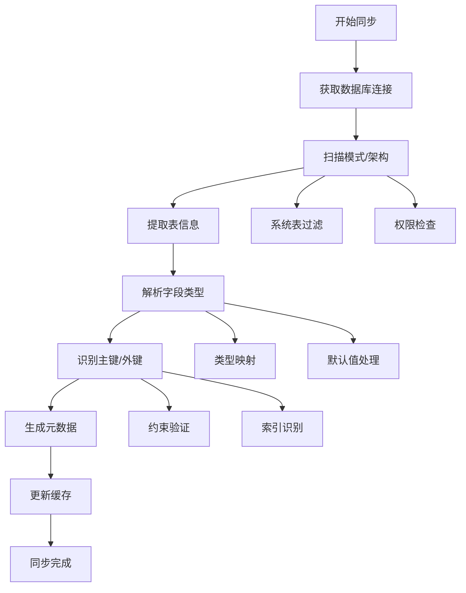
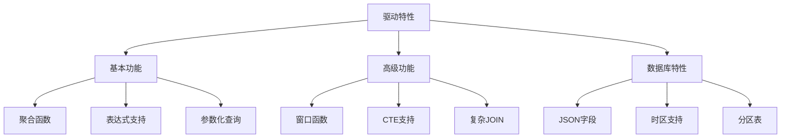
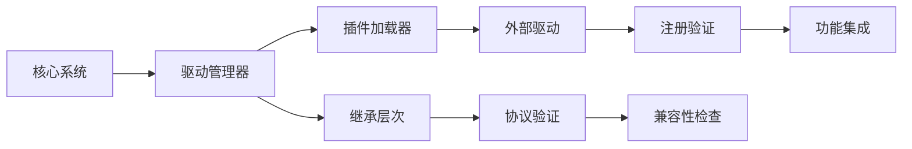

# 数据库驱动架构文档

<cite>
**本文档引用的文件**
- [driver.clj](file://src/metabase/driver.clj)
- [sql_jdbc.clj](file://src/metabase/driver/sql_jdbc.clj)
- [init.clj](file://src/metabase/driver/init.clj)
- [mysql.clj](file://src/metabase/driver/mysql.clj)
- [postgres.clj](file://src/metabase/driver/postgres.clj)
- [h2.clj](file://src/metabase/driver/h2.clj)
- [sql.clj](file://src/metabase/driver/sql.clj)
- [sql_jdbc/sync.clj](file://src/metabase/driver/sql_jdbc/sync.clj)
- [sql_jdbc/execute.clj](file://src/metabase/driver/sql_jdbc/execute.clj)
- [sql/query_processor.clj](file://src/metabase/driver/sql/query_processor.clj)
- [impl.clj](file://src/metabase/driver/impl.clj)
</cite>

## 目录
1. [概述](#概述)
2. [核心架构设计](#核心架构设计)
3. [驱动注册与发现机制](#驱动注册与发现机制)
4. [核心协议体系](#核心协议体系)
5. [SQL JDBC通用实现](#sql-jdbc通用实现)
6. [具体驱动实现](#具体驱动实现)
7. [查询处理与元数据同步](#查询处理与元数据同步)
8. [驱动扩展机制](#驱动扩展机制)
9. [总结](#总结)

## 概述

Metabase采用了一套高度模块化和可扩展的数据库驱动架构，通过协议和多态设计支持多种数据库系统。该架构的核心特点包括：

- **协议驱动的设计**：基于Clojure的多方法（multimethod）系统
- **层次化的继承结构**：抽象驱动到具体驱动的清晰分层
- **插件化的扩展机制**：支持动态加载和注册新驱动
- **统一的接口规范**：所有驱动遵循相同的功能契约

## 核心架构设计

### 驱动层次结构

Metabase的驱动架构采用分层设计，从抽象基类到具体实现形成完整的继承链：

**图表来源**
- [driver.clj](file://src/metabase/driver.clj#L1-L50)
- [sql.clj](file://src/metabase/driver/sql.clj#L1-L30)
- [sql_jdbc.clj](file://src/metabase/driver/sql_jdbc.clj#L1-L30)

### 多态调度机制

驱动系统使用Clojure的多方法系统实现动态分派，每个驱动方法都有专门的调度函数：

**图表来源**
- [driver.clj](file://src/metabase/driver.clj#L120-L150)

**章节来源**
- [driver.clj](file://src/metabase/driver.clj#L63-L150)
- [impl.clj](file://src/metabase/driver/impl.clj#L112-L194)

## 驱动注册与发现机制

### 注册流程

Metabase使用集中式的驱动注册机制，通过`register!`函数管理驱动的生命周期：

**图表来源**
- [impl.clj](file://src/metabase/driver/impl.clj#L112-L169)

### 驱动发现机制

驱动发现通过以下步骤实现：

1. **命名空间加载**：按需加载驱动相关命名空间
2. **层次检查**：验证驱动在继承层次中的位置
3. **可用性验证**：检查驱动是否可直接使用

**章节来源**
- [impl.clj](file://src/metabase/driver/impl.clj#L89-L169)
- [init.clj](file://src/metabase/driver/init.clj#L1-L17)

## 核心协议体系

### IDriver协议

`IDriver`是所有驱动的基础协议，定义了驱动的基本行为：

| 方法名 | 功能描述 | 调度方式 |
|--------|----------|----------|
| `initialize!` | 驱动初始化 | 单次调用 |
| `display-name` | 显示名称 | 未初始化调度 |
| `can-connect?` | 连接测试 | 已初始化调度 |
| `connection-properties` | 连接属性 | 未初始化调度 |

### ISQL协议

`ISQL`协议扩展了基础驱动功能，专注于SQL相关操作：

| 方法名 | 功能描述 | 支持特性 |
|--------|----------|----------|
| `mbql->native` | MBQL转换为原生查询 | 所有SQL驱动 |
| `prettify-native-form` | 格式化原生查询 | 所有SQL驱动 |
| `substitute-native-parameters` | 参数替换 | 原生参数驱动 |

### ISQLJDBC协议

`ISQLJDBC`协议为JDBC兼容数据库提供通用实现：

| 方法名 | 功能描述 | 实现位置 |
|--------|----------|----------|
| `execute-reducible-query` | 可缩减查询执行 | sql_jdbc/execute.clj |
| `query-result-metadata` | 查询结果元数据 | sql_jdbc/metadata.clj |
| `describe-database` | 数据库元数据描述 | sql_jdbc/sync.clj |

**章节来源**
- [driver.clj](file://src/metabase/driver.clj#L184-L400)
- [sql.clj](file://src/metabase/driver/sql.clj#L30-L80)
- [sql_jdbc.clj](file://src/metabase/driver/sql_jdbc.clj#L50-L150)

## SQL JDBC通用实现

### 查询执行框架

`sql_jdbc`模块提供了JDBC兼容数据库的通用查询执行框架：

**图表来源**
- [sql_jdbc/execute.clj](file://src/metabase/driver/sql_jdbc/execute.clj#L50-L150)

### 元数据同步机制

元数据同步通过以下组件协同工作：

| 组件 | 职责 | 实现文件 |
|------|------|----------|
| `describe-database` | 描述整个数据库结构 | sql_jdbc/sync.clj |
| `describe-table` | 描述单个表结构 | sql_jdbc/sync.clj |
| `describe-fields` | 描述字段信息 | sql_jdbc/sync.clj |
| `describe-fks` | 描述外键关系 | sql_jdbc/sync.clj |

**章节来源**
- [sql_jdbc.clj](file://src/metabase/driver/sql_jdbc.clj#L50-L200)
- [sql_jdbc/execute.clj](file://src/metabase/driver/sql_jdbc/execute.clj#L1-L200)
- [sql_jdbc/sync.clj](file://src/metabase/driver/sql_jdbc/sync.clj#L1-L55)

## 具体驱动实现

### MySQL驱动特性

MySQL驱动实现了丰富的功能集合：

| 特性类别 | 支持状态 | 实现细节 |
|----------|----------|----------|
| 基础功能 | ✅ 完全支持 | LIKE语句大小写敏感 |
| 时间处理 | ✅ 完全支持 | 时区转换、时间差计算 |
| JSON处理 | ✅ 部分支持 | JSON路径查询 |
| 窗口函数 | ❌ 不支持 | 需要查询重写 |
| 分区表 | ✅ 支持 | 自动过滤系统表 |

### PostgreSQL驱动特性

PostgreSQL驱动提供最完整的企业级功能：

| 特性类别 | 支持状态 | 实现细节 |
|----------|----------|----------|
| 基础功能 | ✅ 完全支持 | 所有标准SQL特性 |
| 枚举类型 | ✅ 支持 | 自动检测枚举定义 |
| JSON处理 | ✅ 完全支持 | 复杂JSON路径查询 |
| 时区处理 | ✅ 优秀支持 | 内置时区转换函数 |
| 复制支持 | ✅ 支持 | 数据库复制监控 |

### H2驱动特性

H2驱动主要用于开发和测试场景：

| 特性类别 | 支持状态 | 实现细节 |
|----------|----------|----------|
| 文件存储 | ✅ 支持 | 本地文件系统 |
| 内存模式 | ✅ 支持 | 运行时内存存储 |
| 安全限制 | ⚠️ 有限制 | 默认用户SA禁止执行 |
| 正则表达式 | ✅ 支持 | H2原生正则函数 |
| UUID类型 | ✅ 支持 | 原生UUID支持 |

**章节来源**
- [mysql.clj](file://src/metabase/driver/mysql.clj#L50-L150)
- [postgres.clj](file://src/metabase/driver/postgres.clj#L50-L150)
- [h2.clj](file://src/metabase/driver/h2.clj#L50-L150)

## 查询处理与元数据同步

### 查询处理器架构

查询处理器负责将MBQL转换为特定数据库的原生SQL：

**图表来源**
- [sql/query_processor.clj](file://src/metabase/driver/sql/query_processor.clj#L50-L150)

### 元数据同步流程

元数据同步确保Metabase能够正确理解和访问数据库结构：

**图表来源**
- [sql_jdbc/sync.clj](file://src/metabase/driver/sql_jdbc/sync.clj#L1-L55)

**章节来源**
- [sql/query_processor.clj](file://src/metabase/driver/sql/query_processor.clj#L1-L150)

## 驱动扩展机制

### 特性标志系统

Metabase使用特性标志系统精确控制驱动功能：

### 扩展点设计

驱动系统提供了多个扩展点供开发者定制：

| 扩展点 | 接口 | 用途 |
|--------|------|------|
| 连接参数 | `connection-properties` | 自定义连接选项 |
| 查询转换 | `mbql->native` | 特定语法适配 |
| 类型映射 | `database-type->base-type` | 数据类型转换 |
| 功能支持 | `database-supports?` | 特性声明 |

### 插件化架构

通过插件化架构，Metabase支持外部驱动的动态加载：

**章节来源**
- [driver.clj](file://src/metabase/driver.clj#L600-L800)

## 总结

Metabase的数据库驱动架构展现了优秀的软件设计原则：

### 设计优势

1. **高度模块化**：每个驱动都是独立的模块，便于维护和扩展
2. **协议驱动**：通过多方法系统实现灵活的多态行为
3. **层次化设计**：从抽象基类到具体实现的清晰分层
4. **插件化支持**：支持动态加载和第三方驱动扩展
5. **类型安全**：使用Malli进行输入输出验证

### 技术创新

- **延迟初始化**：按需加载驱动，提高启动性能
- **连接池管理**：统一的连接管理和资源回收
- **元数据缓存**：智能的元数据缓存策略
- **错误处理**：完善的异常处理和恢复机制

### 扩展性考虑

该架构为未来的数据库支持预留了充足的空间：
- 新数据库可以通过继承现有驱动快速实现
- 特殊功能可以通过特性标志灵活控制
- 查询优化可以通过驱动级别的定制实现

这种设计使得Metabase能够在保持代码简洁的同时，支持广泛的数据库生态系统，为用户提供一致的使用体验。