# 核心协议与驱动管理

<cite>
**本文档引用的文件**
- [driver.clj](file://src/metabase/driver.clj)
- [driver/init.clj](file://src/metabase/driver/init.clj)
- [driver/impl.clj](file://src/metabase/driver/impl.clj)
- [driver/sql.clj](file://src/metabase/driver/sql.clj)
- [driver/mysql.clj](file://src/metabase/driver/mysql.clj)
- [driver/postgres.clj](file://src/metabase/driver/postgres.clj)
- [plugins/lazy_loaded_driver.clj](file://src/metabase/plugins/lazy_loaded_driver.clj)
</cite>

## 目录
1. [简介](#简介)
2. [项目结构概览](#项目结构概览)
3. [核心协议架构](#核心协议架构)
4. [驱动注册机制](#驱动注册机制)
5. [驱动发现与生命周期](#驱动发现与生命周期)
6. [协议调用流程](#协议调用流程)
7. [具体驱动实现示例](#具体驱动实现示例)
8. [自定义驱动开发指南](#自定义驱动开发指南)
9. [总结](#总结)

## 简介

Metabase采用基于Clojure协议的多态设计模式，构建了一个灵活且可扩展的数据库驱动系统。该系统通过定义核心协议接口，支持多种数据库类型的统一访问，同时保持良好的抽象层次和继承关系。

核心设计理念：
- **协议优先**：使用Clojure的多方法（multimethod）实现多态行为
- **层次化继承**：通过驱动层次结构实现功能复用
- **延迟初始化**：按需加载驱动实现，优化启动性能
- **插件化架构**：支持第三方驱动插件的动态加载

## 项目结构概览

Metabase驱动系统的文件组织遵循清晰的模块化原则：

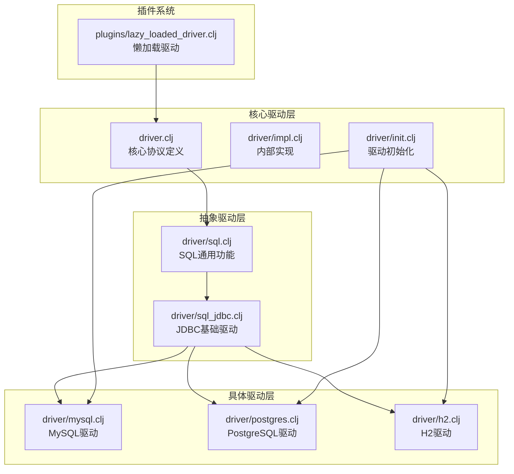

**图表来源**
- [driver.clj](file://src/metabase/driver.clj#L1-L50)
- [driver/impl.clj](file://src/metabase/driver/impl.clj#L1-L30)
- [driver/sql.clj](file://src/metabase/driver/sql.clj#L1-L30)

**章节来源**
- [driver.clj](file://src/metabase/driver.clj#L1-L100)
- [driver/init.clj](file://src/metabase/driver/init.clj#L1-L17)

## 核心协议架构

### IDriver（驱动元信息）

`IDriver`协议是所有数据库驱动的基础接口，定义了驱动的基本元信息和配置能力。

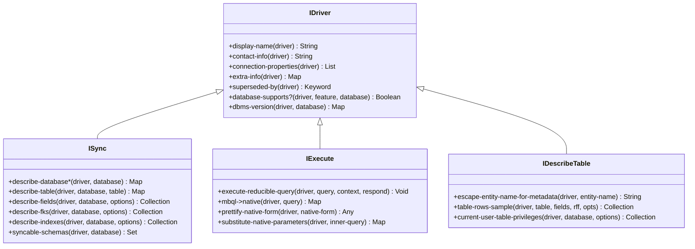

**图表来源**
- [driver.clj](file://src/metabase/driver.clj#L200-L400)
- [driver.clj](file://src/metabase/driver.clj#L400-L600)

#### 核心方法签名

| 协议方法 | 方法签名 | 设计意图 |
|---------|---------|---------|
| `display-name` | `(display-name driver)` | 提供用户友好的驱动名称显示 |
| `connection-properties` | `(connection-properties driver)` | 定义连接参数配置界面 |
| `database-supports?` | `(database-supports? driver feature database)` | 动态检测数据库特性支持 |
| `mbql->native` | `(mbql->native driver query)` | 将MBQL查询转换为原生查询 |

### ISync（元数据同步）

`ISync`协议负责数据库元数据的发现和同步操作。

#### 同步方法详解

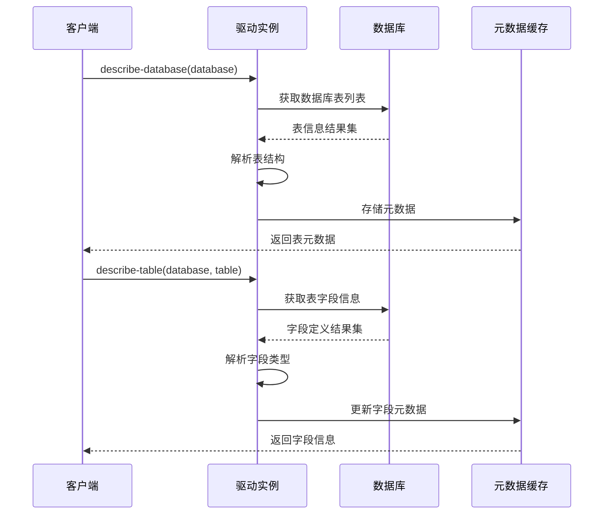

**图表来源**
- [driver.clj](file://src/metabase/driver.clj#L280-L350)

### IExecute（查询执行）

`IExecute`协议处理查询的编译、执行和结果处理。

#### 查询执行流程

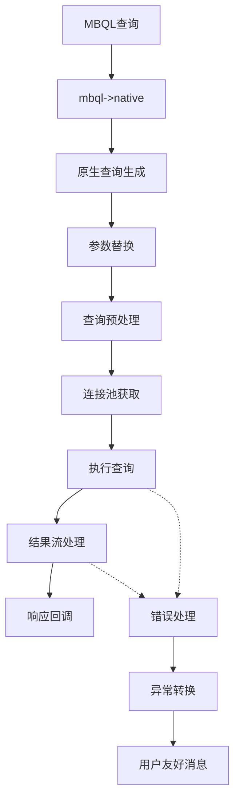

**图表来源**
- [driver.clj](file://src/metabase/driver.clj#L900-L1000)

### IDescribeTable（表结构描述）

`IDescribeTable`协议提供表级别的详细信息描述功能。

**章节来源**
- [driver.clj](file://src/metabase/driver.clj#L200-L800)

## 驱动注册机制

### register-driver! 函数

驱动注册是整个系统的核心入口点，通过`register!`函数建立驱动的层次结构。

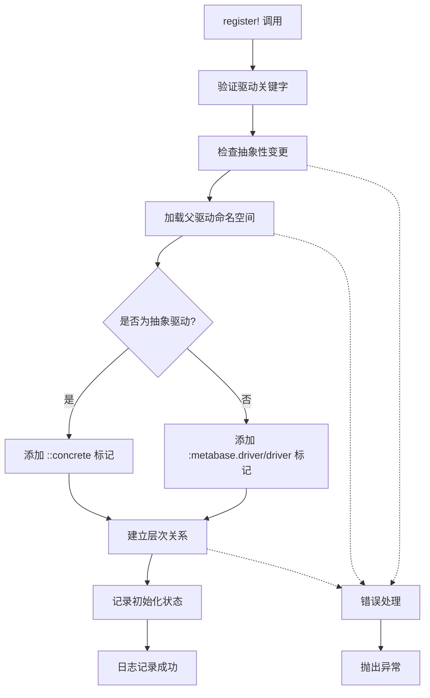

**图表来源**
- [driver/impl.clj](file://src/metabase/driver/impl.clj#L141-L180)

### 层次结构管理

驱动系统使用Clojure的`make-hierarchy`创建继承层次：

| 层次节点 | 描述 | 示例 |
|---------|------|------|
| `:metabase.driver/driver` | 所有驱动的根节点 | - |
| `::concrete` | 具体驱动标记 | `:postgres`, `:mysql` |
| 具体驱动 | 实际的数据库驱动 | `:sql-jdbc`, `:sql` |

**章节来源**
- [driver/impl.clj](file://src/metabase/driver/impl.clj#L20-L30)
- [driver/impl.clj](file://src/metabase/driver/impl.clj#L141-L194)

## 驱动发现与生命周期

### available-drivers 发现机制

系统通过`available?`函数判断驱动是否可用：

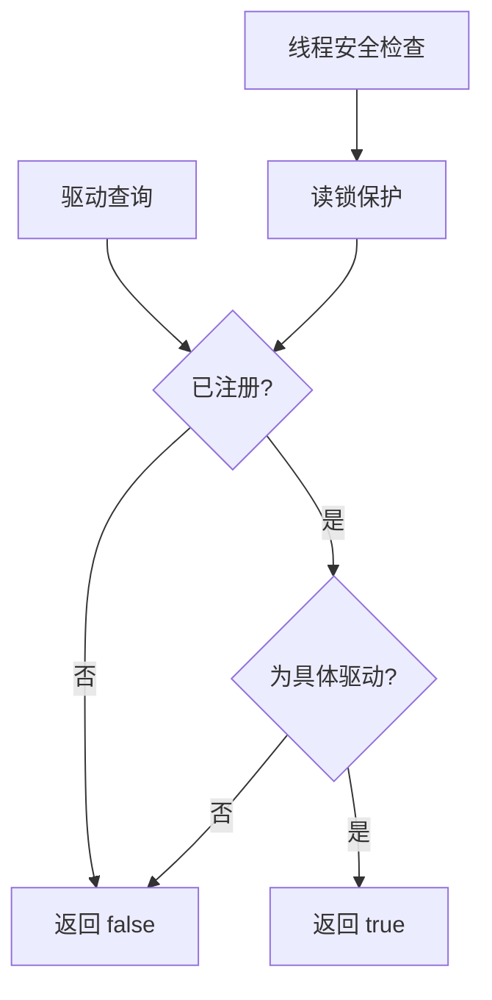

**图表来源**
- [driver.clj](file://src/metabase/driver.clj#L80-L90)

### 命名空间自动加载

驱动系统实现了智能的命名空间加载机制：

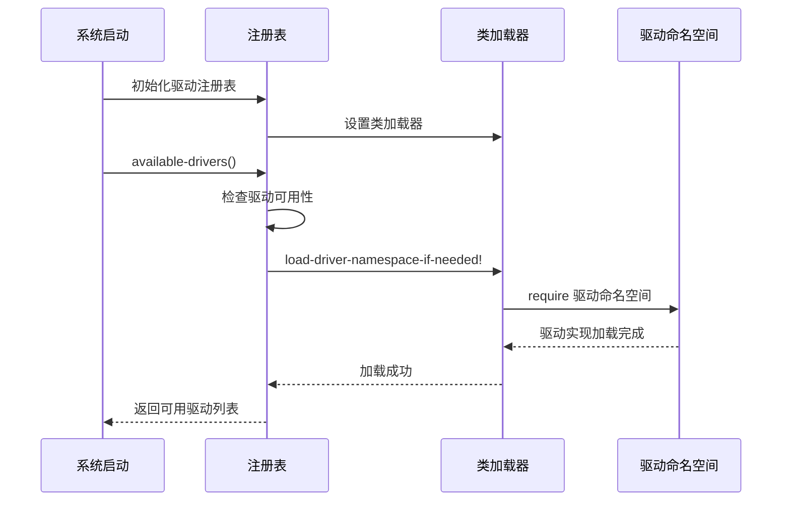

**图表来源**
- [driver/impl.clj](file://src/metabase/driver/impl.clj#L89-L113)

### 生命周期管理

驱动的完整生命周期包括以下阶段：

1. **注册阶段**：通过`register!`建立层次关系
2. **发现阶段**：通过`available?`检查可用性
3. **加载阶段**：按需加载驱动命名空间
4. **初始化阶段**：首次使用时执行初始化
5. **运行阶段**：提供查询服务

**章节来源**
- [driver/impl.clj](file://src/metabase/driver/impl.clj#L194-L236)

## 协议调用流程

### 多方法分发机制

Clojure的多方法提供了强大的分发机制：

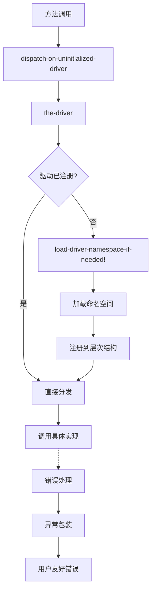

**图表来源**
- [driver.clj](file://src/metabase/driver.clj#L120-L180)

### 初始化触发机制

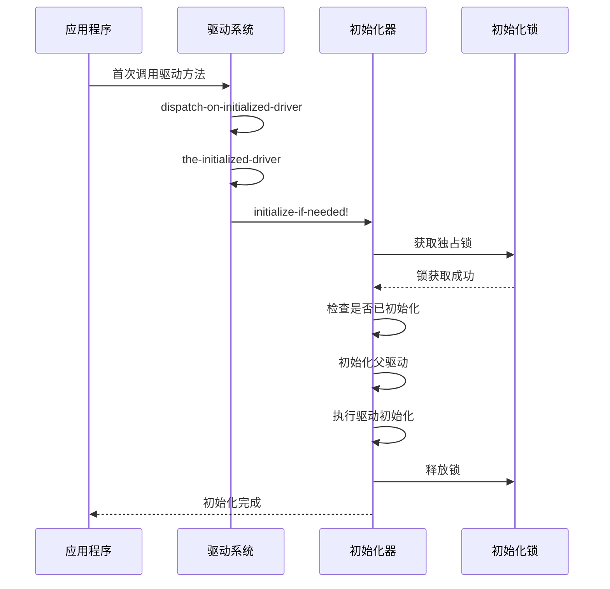

**图表来源**
- [driver/impl.clj](file://src/metabase/driver/impl.clj#L200-L236)

**章节来源**
- [driver.clj](file://src/metabase/driver.clj#L120-L200)
- [driver/impl.clj](file://src/metabase/driver/impl.clj#L200-L236)

## 具体驱动实现示例

### MySQL驱动实现

MySQL驱动展示了典型的驱动实现模式：

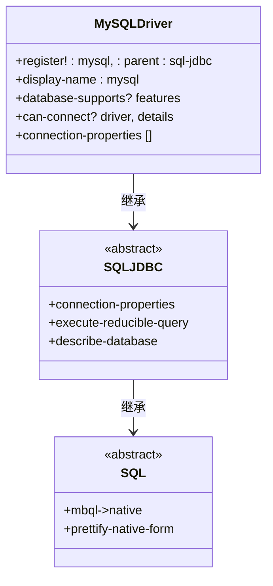

**图表来源**
- [driver/mysql.clj](file://src/metabase/driver/mysql.clj#L40-L80)

### PostgreSQL驱动特性

PostgreSQL驱动展示了更丰富的功能实现：

| 特性类别 | 支持的功能 | 实现细节 |
|---------|-----------|---------|
| 连接管理 | SSL支持、角色切换 | 完整的连接属性配置 |
| 查询处理 | JSON字段处理、窗口函数 | 高级SQL特性支持 |
| 元数据同步 | 架构过滤、权限检查 | 详细的表结构信息 |
| 数据上传 | 自动主键、类型转换 | 完整的数据导入功能 |

**章节来源**
- [driver/mysql.clj](file://src/metabase/driver/mysql.clj#L1-L100)
- [driver/postgres.clj](file://src/metabase/driver/postgres.clj#L1-L100)

## 自定义驱动开发指南

### 基础驱动模板

开发自定义驱动需要遵循以下步骤：

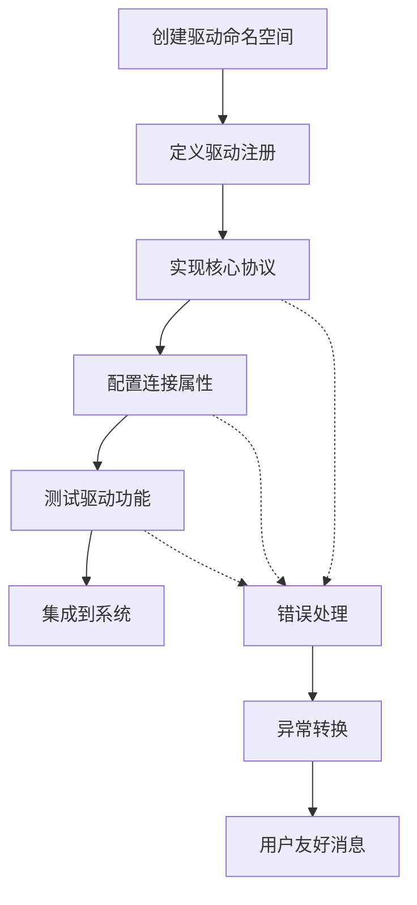

### 关键实现要点

1. **驱动注册**：使用`driver/register!`建立层次关系
2. **协议实现**：至少实现核心协议方法
3. **特性声明**：通过`database-supports?`声明功能支持
4. **连接配置**：定义`connection-properties`规范
5. **错误处理**：实现`humanize-connection-error-message`

### 最佳实践

- **继承层次**：合理选择父驱动，避免过度继承
- **性能优化**：实现延迟加载和连接池管理
- **错误处理**：提供清晰的错误信息和恢复建议
- **测试覆盖**：确保核心功能的充分测试

**章节来源**
- [driver/sql.clj](file://src/metabase/driver/sql.clj#L1-L100)
- [plugins/lazy_loaded_driver.clj](file://src/metabase/plugins/lazy_loaded_driver.clj#L55-L93)

## 总结

Metabase的数据库驱动系统展现了Clojure语言在构建复杂软件架构方面的强大能力。通过协议驱动的设计模式，系统实现了：

### 核心优势

1. **高度抽象**：通过协议定义清晰的行为契约
2. **灵活继承**：支持多层次的功能复用
3. **按需加载**：优化资源使用和启动性能
4. **插件友好**：便于第三方扩展和定制

### 设计亮点

- **多方法分发**：提供比传统面向对象继承更灵活的多态机制
- **层次化注册**：通过Clojure的`make-hierarchy`实现驱动继承关系
- **延迟初始化**：按需加载驱动实现，提升系统响应速度
- **插件化支持**：通过懒加载驱动支持第三方扩展

### 扩展方向

该架构为未来的功能扩展提供了良好的基础：
- 新数据库类型的支持
- 查询优化器的插件化
- 自定义数据源的集成
- 分布式查询处理

这种基于协议的设计不仅保证了系统的稳定性和可维护性，也为持续的功能演进奠定了坚实的基础。