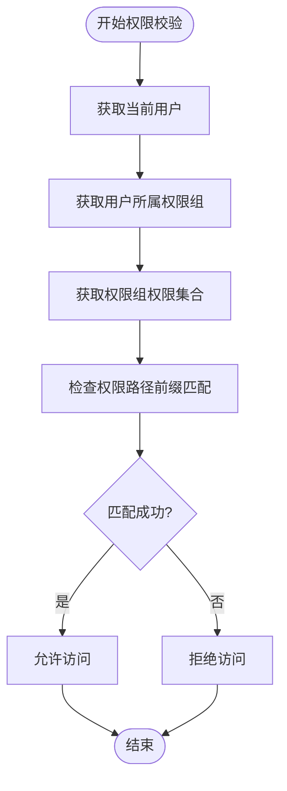

# 应用权限与权限组

<cite>
**本文档中引用的文件**  
- [permissions_group.clj](file://src/metabase/permissions/models/permissions_group.clj)
- [permissions_group_membership.clj](file://src/metabase/permissions/models/permissions_group_membership.clj)
- [user.clj](file://src/metabase/permissions/user.clj)
- [core.clj](file://src/metabase/permissions/core.clj)
- [path.clj](file://src/metabase/permissions/path.clj)
- [permissions.clj](file://src/metabase/permissions/models/permissions.clj)
- [validation.clj](file://src/metabase/permissions/validation.clj)
- [session.clj](file://src/metabase/server/middleware/session.clj)
- [user.clj](file://src/metabase/users/models/user.clj)
</cite>

## 目录
1. [引言](#引言)
2. [权限组管理机制](#权限组管理机制)
3. [用户-组关系模型](#用户-组关系模型)
4. [应用权限校验机制](#应用权限校验机制)
5. [权限路径与系统保护](#权限路径与系统保护)
6. [用户权限加载流程](#用户权限加载流程)
7. [权限继承与冲突解决](#权限继承与冲突解决)
8. [最佳实践与API使用](#最佳实践与api使用)

## 引言

Metabase系统采用基于权限组的权限管理模型，通过将用户分配到不同的权限组来实现细粒度的权限控制。该系统核心由三个主要组件构成：权限组（Permissions Group）、用户-组关系（User-Group Membership）和权限校验（Permission Validation）。权限组作为权限分配的基本单位，用户通过加入一个或多个权限组来获得相应的系统权限。这种设计实现了灵活的权限管理，支持复杂的组织架构需求。

系统中的权限控制基于路径（path）前缀匹配机制，通过在权限路径上设置前缀来实现权限的继承和覆盖。这种设计不仅提高了权限查询的效率，还简化了权限管理的复杂性。权限系统与用户认证、会话管理等核心功能紧密集成，确保了系统安全性的整体性。

**Section sources**
- [permissions_group.clj](file://src/metabase/permissions/models/permissions_group.clj#L1-L20)
- [permissions.clj](file://src/metabase/permissions/models/permissions.clj#L1-L50)

## 权限组管理机制

权限组是Metabase权限系统的核心管理单元，用于组织和分配权限。系统预定义了两个"魔法"权限组：`all-users`（所有用户）和`admin`（管理员）。`all-users`组包含系统中的所有用户，无法手动添加或删除成员，但可以为其分配权限。`admin`组包含所有超级用户，同样无法直接修改其成员，但可以配置其权限。

权限组的创建和管理遵循严格的验证规则。在创建新权限组时，系统会检查组名是否已存在，防止重复命名。对于权限组的修改操作，系统会验证操作者是否有权管理该组，特别是对于`admin`组的修改需要超级用户权限。权限组的删除操作受到严格限制，`all-users`和`admin`这两个魔法组无法被删除。


**Diagram sources**
- [permissions_group.clj](file://src/metabase/permissions/models/permissions_group.clj#L1-L213)
- [permissions_group_membership.clj](file://src/metabase/permissions/models/permissions_group_membership.clj#L1-L224)

**Section sources**
- [permissions_group.clj](file://src/metabase/permissions/models/permissions_group.clj#L1-L213)

## 用户-组关系模型

用户与权限组之间的关系通过多对多关联表`permissions_group_membership`实现。这种设计允许一个用户属于多个权限组，同时一个权限组也可以包含多个用户，从而实现了灵活的权限分配策略。系统通过`add-users-to-groups!`和`remove-user-from-groups!`等函数来管理用户与权限组的关联关系。

在添加用户到权限组时，系统会执行一系列验证检查。首先检查目标权限组是否为`all-users`组，该组的成员管理受到特殊限制。对于管理员组的成员变更，系统会确保不会删除最后一个管理员用户，以防止系统失去管理权限。此外，系统还支持组管理员（Group Manager）角色，允许非超级用户管理特定权限组的成员。


**Diagram sources**
- [permissions_group_membership.clj](file://src/metabase/permissions/models/permissions_group_membership.clj#L1-L224)
- [core.clj](file://src/metabase/permissions/core.clj#L1-L126)

**Section sources**
- [permissions_group_membership.clj](file://src/metabase/permissions/models/permissions_group_membership.clj#L1-L224)

## 应用权限校验机制

应用权限校验是Metabase安全体系的关键组成部分，通过`current-user-has-application-permission?`函数实现。该函数检查当前用户是否具有特定类型的应用权限，如系统设置、监控、订阅等功能的访问权限。权限校验基于用户所属权限组的权限集合，通过路径前缀匹配算法确定用户是否具有执行特定操作的权限。

权限校验过程首先获取当前用户的权限集合，然后检查该集合中是否存在与目标权限路径匹配的前缀。系统采用高效的字符串前缀匹配算法，通过`str/starts-with?`函数实现权限路径的匹配检查。对于企业版功能，权限校验还会考虑高级权限特性是否启用，确保只有授权用户才能访问特定功能。



**Diagram sources**
- [user.clj](file://src/metabase/permissions/user.clj#L1-L25)
- [permissions.clj](file://src/metabase/permissions/models/permissions.clj#L1-L503)

**Section sources**
- [user.clj](file://src/metabase/permissions/user.clj#L1-L25)
- [permissions.clj](file://src/metabase/permissions/models/permissions.clj#L180-L200)

## 权限路径与系统保护

权限路径是Metabase权限系统的核心概念，采用分层的路径结构来表示不同的权限级别。系统定义了多种应用权限路径，如`/app/`用于应用程序级别的权限控制。这些路径通过前缀匹配机制实现权限的继承和覆盖，例如`/app/settings/`路径的权限会继承自`/app/`路径的权限。

敏感功能如系统设置、管理后台等通过特定的权限路径进行保护。例如，系统设置功能受`/application/setting/`路径保护，只有具有该路径权限的用户才能访问。这种设计实现了细粒度的权限控制，允许管理员为不同用户组分配不同的功能访问权限。权限路径的设计遵循RESTful原则，通过清晰的层次结构表示权限的范围和级别。

```mermaid
graph TB
subgraph "权限路径层次"
A[/] --> B[/app/]
B --> C[/app/settings/]
B --> D[/app/monitoring/]
B --> E[/app/subscription/]
A --> F[/db/]
F --> G[/db/1/]
G --> H[/db/1/schema/]
H --> I[/db/1/schema/PUBLIC/]
end
```

**Diagram sources**
- [path.clj](file://src/metabase/permissions/path.clj#L1-L48)
- [core.clj](file://src/metabase/permissions/core.clj#L1-L126)

**Section sources**
- [path.clj](file://src/metabase/permissions/path.clj#L1-L48)

## 用户权限加载流程

用户登录后的权限信息加载流程是一个关键的安全机制。当用户成功认证后，系统通过`bind-current-user`中间件将用户的权限信息绑定到当前会话中。这个过程包括获取用户所属的所有权限组，然后收集这些权限组的所有权限路径，最终形成一个完整的权限集合。

权限加载采用缓存策略以提高性能。系统将用户的权限集合缓存到`*current-user-permissions-set*`动态变量中，避免在每次请求时重复查询数据库。缓存机制在用户会话期间保持权限信息的有效性，同时在权限变更时及时更新缓存。对于非当前用户的权限查询，系统会直接从数据库获取最新信息，确保权限检查的准确性。


**Diagram sources**
- [session.clj](file://src/metabase/server/middleware/session.clj#L1-L300)
- [user.clj](file://src/metabase/users/models/user.clj#L1-L527)

**Section sources**
- [session.clj](file://src/metabase/server/middleware/session.clj#L237-L258)
- [user.clj](file://src/metabase/users/models/user.clj#L1-L527)

## 权限继承与冲突解决

权限继承机制是Metabase权限系统的重要特性，通过路径前缀匹配实现权限的自动继承。当用户需要执行某个操作时，系统会检查其权限集合中是否存在与操作所需权限路径匹配的前缀。这种设计简化了权限管理，管理员只需在高层级路径上设置权限，下级路径会自动继承这些权限。

在多权限组场景下，可能会出现权限冲突。系统采用"最宽松优先"原则解决冲突，即用户在任一权限组中获得的最宽松权限将生效。例如，如果用户在组A中被授予读权限，在组B中被授予读写权限，则用户最终具有读写权限。这种策略确保了用户能够获得其应有的最高权限级别，同时避免了因权限限制导致的功能不可用问题。

**Section sources**
- [permissions.clj](file://src/metabase/permissions/models/permissions.clj#L18-L39)
- [data_permissions.clj](file://src/metabase/permissions/models/data_permissions.clj#L1-L203)

## 最佳实践与API使用

权限组配置的最佳实践包括合理规划权限组结构、遵循最小权限原则和定期审查权限分配。建议根据组织架构和职能划分创建权限组，避免创建过于宽泛的权限组。对于敏感功能，应采用分层权限控制，确保只有必要的用户才能访问。

批量用户权限管理可以通过API实现。使用`add-users-to-groups!`函数可以一次性将多个用户添加到指定权限组，提高管理效率。API调用需要适当的权限验证，通常需要超级用户或组管理员权限。在执行批量操作时，建议先进行权限检查，确保操作者具有执行该操作的权限。

权限继承冲突的解决策略主要包括明确权限优先级、避免权限重叠和使用权限审计工具。当出现权限冲突时，应根据业务需求明确权限的优先级规则。定期使用权限审计功能检查权限分配情况，及时发现和解决潜在的权限冲突问题。

**Section sources**
- [core.clj](file://src/metabase/permissions/core.clj#L1-L126)
- [validation.clj](file://src/metabase/permissions/validation.clj#L1-L54)
- [permissions_rest/api.clj](file://src/metabase/permissions_rest/api.clj#L1-L300)