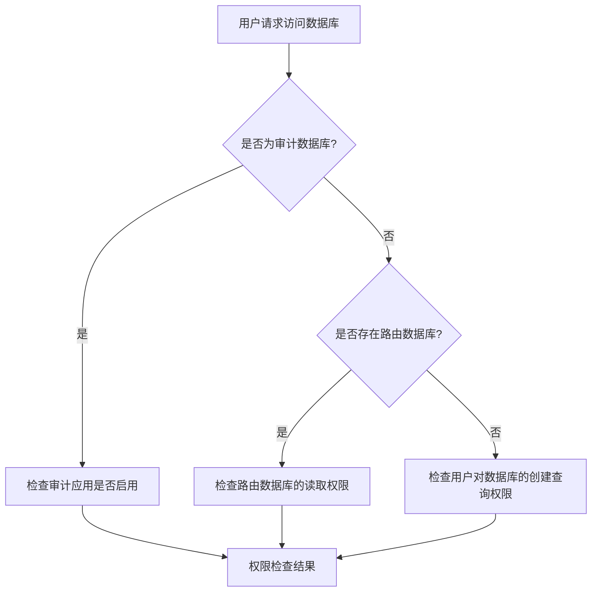

# 数据权限控制

<cite>
**本文档引用的文件**
- [data_permissions.clj](file://src/metabase/permissions/models/data_permissions.clj)
- [core.clj](file://src/metabase/permissions/core.clj)
- [path.clj](file://src/metabase/permissions/path.clj)
- [database.clj](file://src/metabase/warehouses/models/database.clj)
- [schema.clj](file://src/metabase/permissions/schema.clj)
- [util.clj](file://src/metabase/permissions/util.clj)
</cite>

## 目录
1. [引言](#引言)
2. [权限层级结构与路径系统](#权限层级结构与路径系统)
3. [核心权限检查流程](#核心权限检查流程)
4. [数据库连接与查询执行的权限校验](#数据库连接与查询执行的权限校验)
5. [权限配置用例与调试方法](#权限配置用例与调试方法)

## 引言
本文档全面解析Metabase的数据权限控制系统，重点阐述其在数据库、数据表和字段级别上的访问控制实现机制。文档深入分析了权限的层级结构、路径匹配规则以及用户在连接数据库和执行查询时的权限校验流程。通过结合核心代码文件，详细说明了权限配置的典型用例、与驱动层的交互细节，以及因权限不足导致查询失败的调试方法。

## 权限层级结构与路径系统

Metabase的数据权限系统基于一个精细的层级结构和路径匹配机制来实现细粒度的访问控制。权限类型在`permissions/schema.clj`中定义，主要分为数据库级别和表级别权限。

数据库级别的权限（`:model/Database`）包括：
- `:perms/manage-database`：管理数据库的权限，值为 `:yes` 或 `:no`。

表级别的权限（`:model/Table`）包括：
- `:perms/view-data`：查看数据权限，值按从最宽松到最严格排序为 `[:unrestricted :legacy-no-self-service :blocked]`。
- `:perms/create-queries`：创建查询权限，值为 `[:query-builder-and-native :query-builder :no]`。
- `:perms/download-results`：下载结果权限，值为 `[:one-million-rows :ten-thousand-rows :no]`。
- `:perms/manage-table-metadata`：管理表元数据权限，值为 `[:yes :no]`。

权限的检查通过路径（path）系统进行。路径是一个以斜杠（`/`）分隔的字符串，用于表示对特定资源的访问权限。`permissions/path.clj` 文件定义了路径的构造逻辑。例如，`collection-read-path` 函数用于生成对集合（Collection）的读取权限路径，其格式为 `/collection/{collection-id}/read/`。

路径的匹配和验证在 `permissions/util.clj` 中实现。该文件定义了正则表达式（如 `path-regex-v1` 和 `path-regex-v2`）来验证路径格式的有效性，并通过 `classify-path` 函数将路径分类为不同的种类（如 `:data`, `:collection`, `:admin` 等）。`valid-path?` 函数用于检查一个路径是否是系统已知的有效路径。

**Section sources**
- [schema.clj](file://src/metabase/permissions/schema.clj#L1-L34)
- [path.clj](file://src/metabase/permissions/path.clj#L1-L49)
- [util.clj](file://src/metabase/permissions/util.clj#L1-L359)

## 核心权限检查流程

核心的权限检查流程由 `permissions/core.clj` 和 `permissions/models/data_permissions.clj` 两个文件共同实现。`core.clj` 作为权限模块的API入口，通过 `p/import-vars` 宏将 `data_permissions.clj` 中的函数导入，提供统一的访问接口。

权限检查的核心逻辑在 `data_permissions.clj` 中。当需要检查用户权限时，系统会执行以下步骤：

1.  **权限获取**：首先，系统会根据用户ID、权限类型和数据库ID，从 `:model/DataPermissions` 表中查询该用户在所有所属用户组中的相关权限记录。查询结果会被缓存到动态变量 `*permissions-for-user*` 中，以提高性能。
2.  **权限合并**：用户可能属于多个用户组，每个组可能授予不同的权限值。系统通过 `coalesce` 多态函数将这些权限值合并为一个最终的有效权限值。默认策略是取最宽松的权限（例如，如果一个组允许，另一个组不允许，则最终结果为允许）。对于 `:perms/view-data` 类型，有特殊处理：`blocked`（阻止）权限会覆盖 `legacy-no-self-service`，但不会覆盖 `unrestricted`（无限制）。
3.  **权限判断**：使用 `at-least-as-permissive?` 函数来判断用户的有效权限值是否至少与请求的权限值一样宽松。该函数通过比较权限值在预定义列表中的索引来实现。

例如，`user-has-permission-for-database?` 函数用于检查用户是否对某个数据库拥有指定权限。它会调用 `database-permission-for-user` 获取用户的最宽松权限值，然后与请求的权限值进行比较。

**Section sources**
- [core.clj](file://src/metabase/permissions/core.clj#L1-L127)
- [data_permissions.clj](file://src/metabase/permissions/models/data_permissions.clj#L1-L799)

## 数据库连接与查询执行的权限校验

当用户尝试连接数据库或执行查询时，Metabase会在多个环节进行权限校验。`warehouses/models/database.clj` 文件中的 `mi/can-read?` 和 `mi/can-write?` 方法是数据库访问权限校验的关键入口。

**Diagram sources**
- [database.clj](file://src/metabase/warehouses/models/database.clj#L1-L615)

对于不同的数据库类型（如H2、MySQL、PostgreSQL），权限适配策略主要体现在驱动层的错误处理上。当用户因权限不足而执行操作失败时，驱动会解析数据库返回的原始错误信息，并将其转换为用户友好的提示。

例如，在 `driver/mysql/actions.clj` 中，`maybe-parse-sql-error` 方法的实现会检查错误信息中是否包含 "INSERT command denied" 或 "Access denied for user" 等关键字。如果匹配成功，则返回一个结构化的错误响应，明确告知用户“您没有权限在此表中添加数据”或“您没有权限访问此数据库”。

同样，在 `driver/postgres/actions.clj` 中，通过正则表达式匹配 "permission denied for" 来识别权限错误，并返回相应的错误消息。

这种机制确保了无论底层数据库是哪种类型，用户都能收到清晰、一致的权限错误提示，而不会暴露原始的、可能令人困惑的数据库错误信息。

**Section sources**
- [database.clj](file://src/metabase/warehouses/models/database.clj#L1-L615)
- [mysql/actions.clj](file://src/metabase/driver/mysql/actions.clj#L1-L235)
- [postgres/actions.clj](file://src/metabase/driver/postgres/actions.clj#L1-L142)

## 权限配置用例与调试方法

### 权限配置典型用例
1.  **授予数据库访问权限**：使用 `set-database-permission!` 函数，为指定用户组设置对数据库的 `:perms/view-data` 和 `:perms/create-queries` 权限。例如，可以将 `:unrestricted` 权限授予“所有用户”组，使其可以查看和查询该数据库。
2.  **限制表级访问**：使用 `set-table-permission!` 函数，为特定表设置更精细的权限。例如，可以将敏感表的 `:perms/view-data` 权限设置为 `:blocked`，以阻止特定用户组访问。
3.  **管理查询执行**：通过设置 `:perms/create-queries` 权限，可以控制用户是只能使用查询构建器，还是可以执行原生SQL查询。

### 与驱动层的交互细节
权限系统与驱动层的交互主要发生在查询执行阶段。当用户提交一个查询时，权限检查中间件会首先验证用户是否有权访问查询所涉及的数据库和表。如果权限检查通过，查询请求才会被传递给相应的驱动（如 `driver/sql-jdbc/connection.clj` 中的 `db->pooled-connection-spec`）去建立连接并执行。驱动本身不直接处理权限逻辑，而是依赖上层系统完成权限校验。

### 因权限不足导致查询失败的调试方法
1.  **检查用户组权限**：首先，确认用户所属的用户组是否被正确授予了所需的数据库和表级权限。
2.  **使用调试工具**：利用 `permissions-for-user` 函数可以获取一个用户所有权限的完整图谱，这对于调试复杂的权限问题非常有帮助。
3.  **查看日志**：系统日志会记录权限检查的过程和结果。通过查看日志，可以追踪到是哪个权限检查环节失败。
4.  **模拟用户身份**：作为管理员，可以尝试以该用户的身份登录，亲自体验权限限制，以更直观地定位问题。

**Section sources**
- [data_permissions.clj](file://src/metabase/permissions/models/data_permissions.clj#L1-L799)
- [connection.clj](file://src/metabase/driver/sql-jdbc/connection.clj#L1-L383)