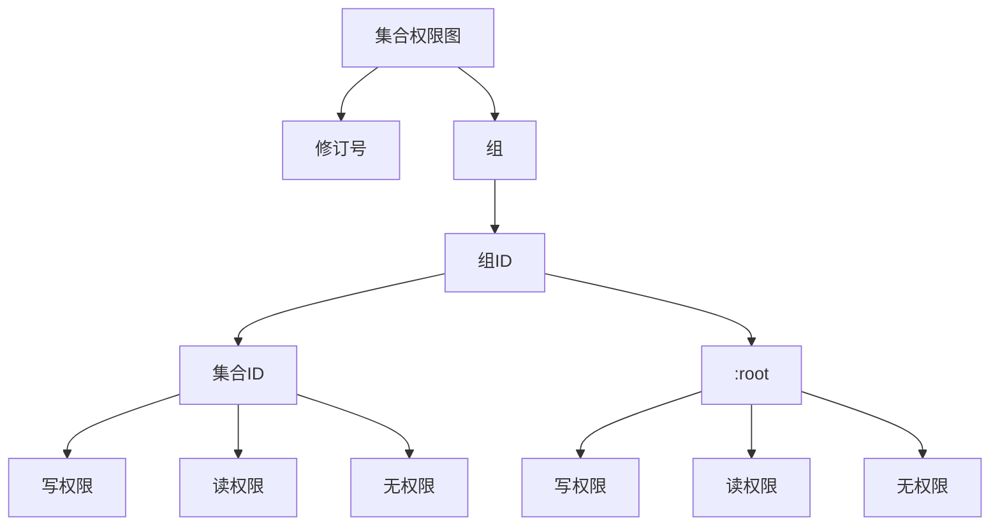
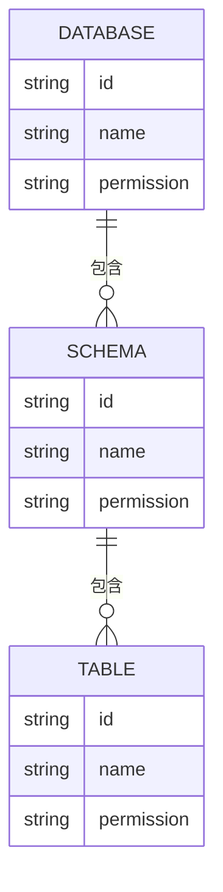
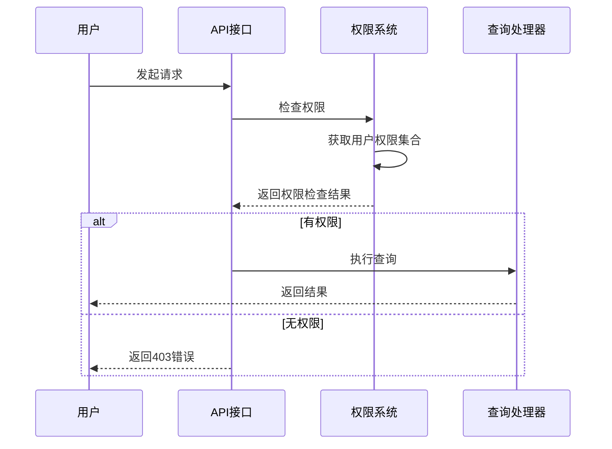
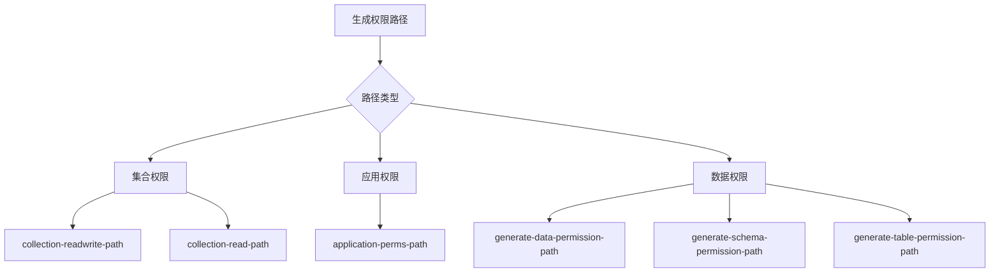
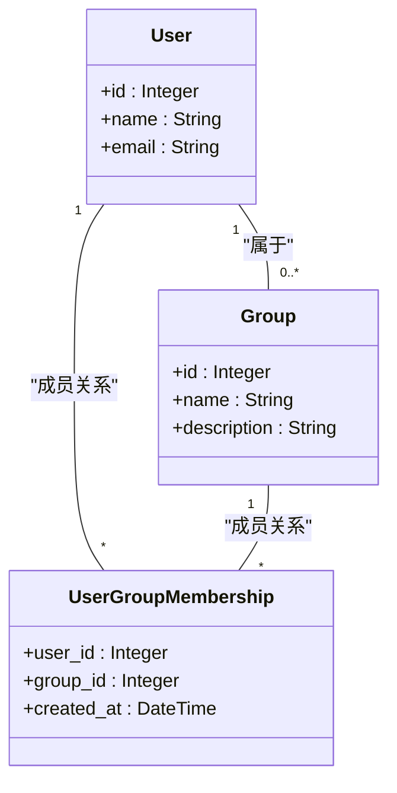
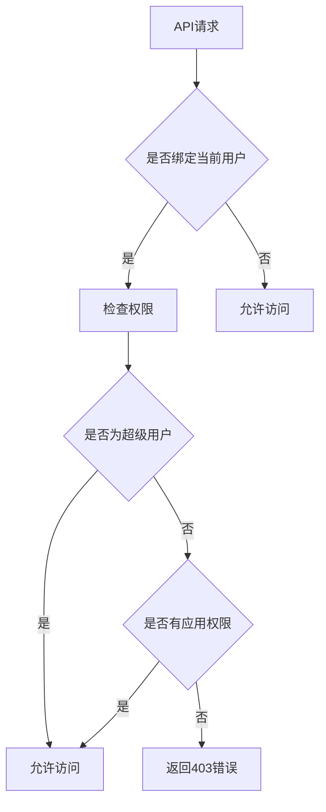
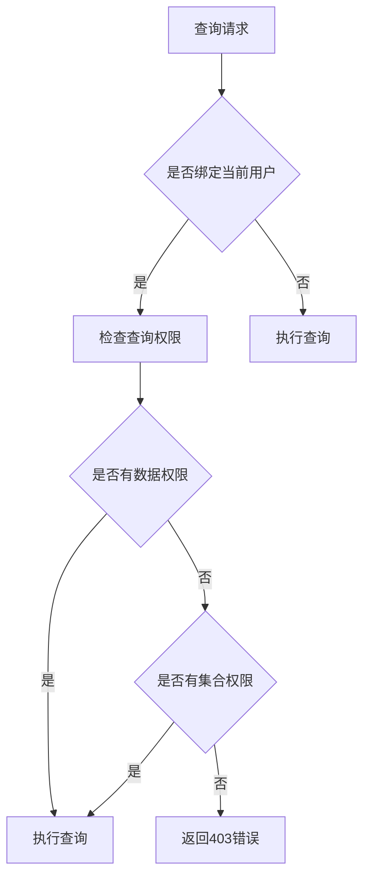
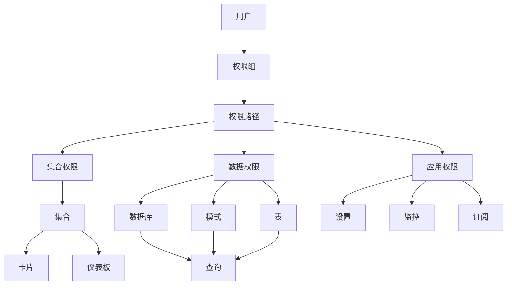

# 权限系统

<cite>
**本文档中引用的文件**  
- [core.clj](file://src/metabase/permissions/core.clj)
- [path.clj](file://src/metabase/permissions/path.clj)
- [user.clj](file://src/metabase/permissions/user.clj)
- [util.clj](file://src/metabase/permissions/util.clj)
- [validation.clj](file://src/metabase/permissions/validation.clj)
- [permissions.clj](file://src/metabase/permissions/models/permissions.clj)
- [collection/graph.clj](file://src/metabase/permissions/models/collection/graph.clj)
- [collections/models/collection.clj](file://src/metabase/collections/models/collection.clj)
- [data_permissions.clj](file://src/metabase/permissions/models/data_permissions.clj)
- [query_processor/middleware/permissions.clj](file://src/metabase/query_processor/middleware/permissions.clj)
</cite>

## 目录
1. [引言](#引言)
2. [权限路径系统](#权限路径系统)
3. [集合权限管理](#集合权限管理)
4. [数据访问权限](#数据访问权限)
5. [用户权限校验流程](#用户权限校验流程)
6. [权限路径生成规则](#权限路径生成规则)
7. [用户与权限组关联模型](#用户与权限组关联模型)
8. [API调用前的权限检查](#api调用前的权限检查)
9. [查询执行前的权限检查](#查询执行前的权限检查)
10. [权限系统架构图](#权限系统架构图)

## 引言

Metabase的权限系统实现了细粒度的访问控制机制，通过权限路径（Path）系统、集合（Collection）权限管理和数据访问权限三个核心组件来保障系统的安全性。该系统基于用户所属的权限组来授予相应的访问权限，支持对数据库、表、字段等不同层级的数据访问控制，以及对集合的读写权限管理。本文档将全面阐述Metabase权限系统的实现细节，包括权限路径的生成规则、集合权限的管理方式、数据访问权限的实现机制，以及用户权限校验的完整流程。

## 权限路径系统

权限路径系统是Metabase权限管理的核心，通过路径字符串来表示不同的权限需求。权限路径采用斜杠分隔的格式，每个斜杠代表权限路径的不同部分，且每个权限路径必须以斜杠开始和结束。系统使用前缀匹配机制来判断用户是否具有执行某项操作的权限，即如果用户的权限路径是所需权限路径的前缀，则认为用户具有相应的权限。

```mermaid
flowchart TD
A[权限路径] --> B{路径格式}
B --> C[/collection/:id/]
B --> D[/collection/:id/read/]
B --> E[/db/:id/]
B --> F[/db/:id/native/]
B --> G[/db/:id/schema/]
B --> H[/db/:id/schema/:name/]
B --> I[/db/:id/schema/:name/table/:id/]
B --> J[/db/:id/schema/:name/table/:id/read/]
B --> K[/db/:id/schema/:name/table/:id/query/]
B --> L[/db/:id/schema/:name/table/:id/query/segmented/]
B --> M[/block/db/:id/]
B --> N[/]
```

**Diagram sources**
- [util.clj](file://src/metabase/permissions/util.clj#L150-L250)

**Section sources**
- [util.clj](file://src/metabase/permissions/util.clj#L150-L250)
- [path.clj](file://src/metabase/permissions/path.clj#L1-L50)

## 集合权限管理

集合权限管理通过`collection/graph.clj`文件中的图结构来管理集合的读写权限。集合权限适用于单个集合及其内部的非集合项，许多对象如卡片（Saved Questions）和仪表板的权限都继承自其所在的集合。系统通过稀疏图结构来表示当前各组和集合的权限状态，仅包含具有显式权限（读或写）的组和集合条目。



**Diagram sources**
- [collection/graph.clj](file://src/metabase/permissions/models/collection/graph.clj#L50-L100)

**Section sources**
- [collection/graph.clj](file://src/metabase/permissions/models/collection/graph.clj#L50-L100)
- [collections/models/collection.clj](file://src/metabase/collections/models/collection.clj#L500-L600)

## 数据访问权限

数据访问权限通过`data_permissions.clj`文件实现，基于数据库、表、字段的层级结构进行权限控制。系统支持对数据库的完全访问权限、原生查询权限，以及对特定模式和表的访问权限。对于表级别的权限，系统区分了完全权限、读取信息权限和MBQL查询权限。



**Diagram sources**
- [data_permissions.clj](file://src/metabase/permissions/models/data_permissions.clj#L1-L50)

**Section sources**
- [data_permissions.clj](file://src/metabase/permissions/models/data_permissions.clj#L1-L50)
- [permissions.clj](file://src/metabase/permissions/models/permissions.clj#L200-L250)

## 用户权限校验流程

用户权限校验流程在API调用和查询执行前进行，确保用户具有执行相应操作的权限。系统通过`user-permissions-set`函数获取用户的所有权限路径集合，然后在执行操作前检查所需权限路径是否在用户的权限集合中。



**Diagram sources**
- [user.clj](file://src/metabase/permissions/user.clj#L1-L25)
- [query_processor/middleware/permissions.clj](file://src/metabase/query_processor/middleware/permissions.clj#L1-L50)

**Section sources**
- [user.clj](file://src/metabase/permissions/user.clj#L1-L25)
- [query_processor/middleware/permissions.clj](file://src/metabase/query_processor/middleware/permissions.clj#L1-L50)

## 权限路径生成规则

权限路径的生成遵循严格的规则，通过`path`模块中的函数来实现。系统提供了`collection-readwrite-path`和`collection-read-path`等函数来生成集合的读写权限路径，使用`application-perms-path`函数生成应用权限路径。



**Diagram sources**
- [path.clj](file://src/metabase/permissions/path.clj#L1-L50)

**Section sources**
- [path.clj](file://src/metabase/permissions/path.clj#L1-L50)
- [util.clj](file://src/metabase/permissions/util.clj#L300-L350)

## 用户与权限组关联模型

用户与权限组的关联模型通过`user.clj`文件实现，每个用户可以属于一个或多个权限组。系统中有两个特殊的权限组：所有用户组（all-users），每个用户都是该组的成员且无法被移除；管理员组（admin），每个超级用户都是该组的成员。



**Diagram sources**
- [user.clj](file://src/metabase/permissions/user.clj#L1-L25)

**Section sources**
- [user.clj](file://src/metabase/permissions/user.clj#L1-L25)
- [permissions.clj](file://src/metabase/permissions/models/permissions.clj#L100-L150)

## API调用前的权限检查

在API调用前，系统通过中间件进行权限检查，确保当前用户具有执行该API操作的权限。检查过程包括验证用户是否为超级用户、是否具有特定的应用权限等。



**Diagram sources**
- [validation.clj](file://src/metabase/permissions/validation.clj#L1-L30)

**Section sources**
- [validation.clj](file://src/metabase/permissions/validation.clj#L1-L30)
- [core.clj](file://src/metabase/permissions/core.clj#L50-L100)

## 查询执行前的权限检查

在查询执行前，系统通过查询处理器中间件进行权限检查，确保用户具有执行该查询的权限。检查过程包括验证用户是否具有数据权限、集合权限等。



**Diagram sources**
- [query_processor/middleware/permissions.clj](file://src/metabase/query_processor/middleware/permissions.clj#L1-L50)

**Section sources**
- [query_processor/middleware/permissions.clj](file://src/metabase/query_processor/middleware/permissions.clj#L1-L50)
- [core.clj](file://src/metabase/permissions/core.clj#L100-L150)

## 权限系统架构图



**Diagram sources**
- [core.clj](file://src/metabase/permissions/core.clj#L1-L50)
- [permissions.clj](file://src/metabase/permissions/models/permissions.clj#L1-L50)

**Section sources**
- [core.clj](file://src/metabase/permissions/core.clj#L1-L50)
- [permissions.clj](file://src/metabase/permissions/models/permissions.clj#L1-L50)