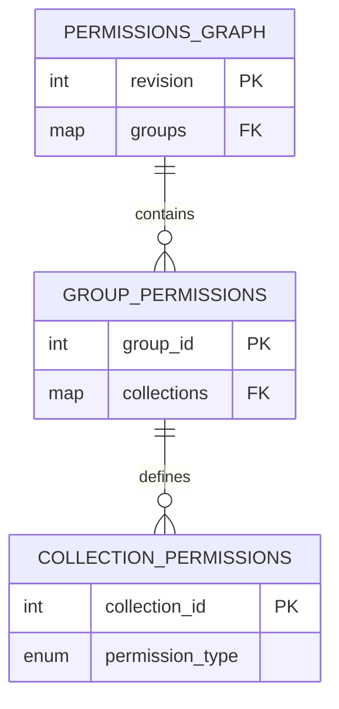
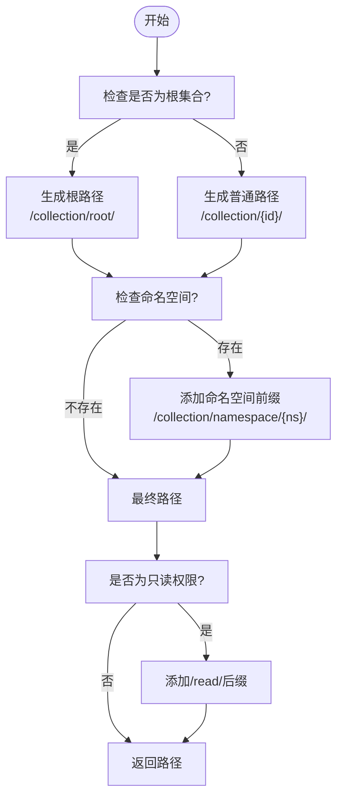
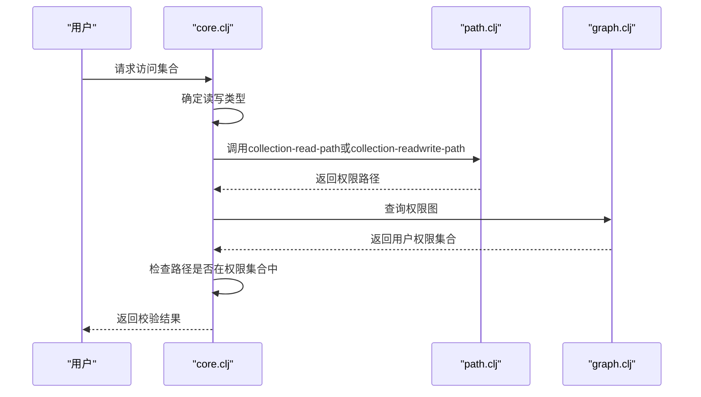
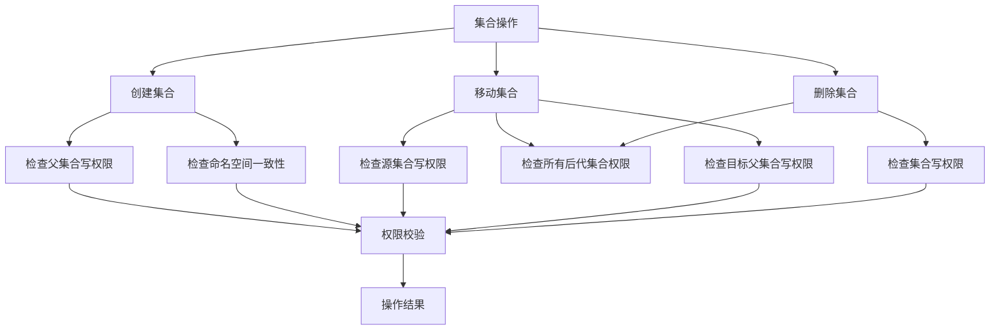
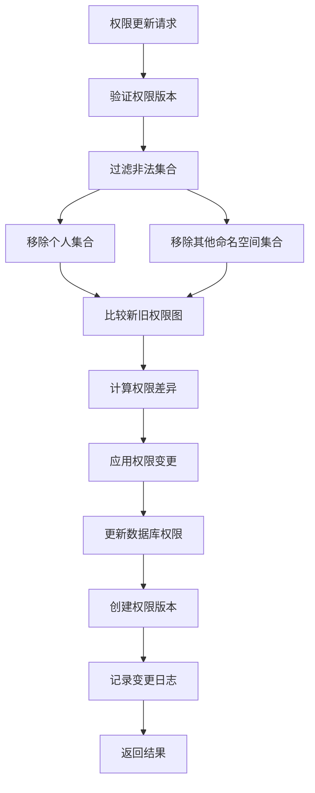

# 集合权限管理

<cite>
**本文档引用的文件**  
- [graph.clj](file://src/metabase/permissions/models/collection/graph.clj)
- [core.clj](file://src/metabase/permissions/core.clj)
- [path.clj](file://src/metabase/permissions/path.clj)
- [collection.clj](file://src/metabase/collections/models/collection.clj)
</cite>

## 目录
1. [简介](#简介)
2. [权限图数据结构](#权限图数据结构)
3. [权限路径生成规则](#权限路径生成规则)
4. [权限继承与校验流程](#权限继承与校验流程)
5. [集合操作权限校验](#集合操作权限校验)
6. [权限变更与图重构](#权限变更与图重构)
7. [常见配置场景](#常见配置场景)
8. [故障排查](#故障排查)
9. [结论](#结论)

## 简介
Metabase中的集合权限管理系统基于树形结构的权限图（Permission Graph）实现，通过`/collection/:id/`路径模式管理集合的读写权限。该系统支持权限继承机制，允许管理员为用户组分配集合的读写权限，并通过权限路径匹配实现细粒度访问控制。核心组件包括权限图管理、路径生成和权限校验三个部分，分别由`graph.clj`、`path.clj`和`core.clj`文件实现。

**Section sources**
- [graph.clj](file://src/metabase/permissions/models/collection/graph.clj#L1-L50)
- [path.clj](file://src/metabase/permissions/path.clj#L1-L10)

## 权限图数据结构
权限图采用稀疏树形结构存储，只包含具有显式权限的集合和用户组。其核心数据结构定义如下：



权限图包含两个主要字段：`revision`表示当前权限版本号，`groups`存储用户组到集合权限的映射。每个用户组的权限映射中，集合ID作为键，权限类型（`:write`、`:read`或`:none`）作为值。根集合使用`:root`作为特殊键。权限图不包含个人集合、已归档集合和垃圾箱集合。

**Diagram sources**
- [graph.clj](file://src/metabase/permissions/models/collection/graph.clj#L30-L50)

**Section sources**
- [graph.clj](file://src/metabase/permissions/models/collection/graph.clj#L20-L100)

## 权限路径生成规则
权限路径是权限系统的核心标识符，用于匹配用户对特定集合的访问权限。路径生成规则由`path.clj`文件中的函数实现：



`collection-readwrite-path`函数生成读写权限路径，格式为`/collection/{id}/`；`collection-read-path`函数在读写路径基础上添加`read/`后缀，形成只读权限路径。根集合的路径为`/collection/root/`，命名空间集合的路径包含`namespace/{ns}/`前缀。

**Diagram sources**
- [path.clj](file://src/metabase/permissions/path.clj#L20-L40)

**Section sources**
- [path.clj](file://src/metabase/permissions/path.clj#L15-L50)

## 权限继承与校验流程
权限继承模型允许子集合继承父集合的权限，但可以设置更严格的权限。权限校验流程通过`perms-objects-set-for-parent-collection`函数实现：



当用户访问某个集合时，系统首先根据操作类型（读或写）调用相应的路径生成函数，然后在权限图中查找该路径对应的权限。超级用户自动拥有所有权限，普通用户的权限通过用户组成员关系和权限继承规则确定。

**Diagram sources**
- [core.clj](file://src/metabase/permissions/core.clj#L100-L120)
- [path.clj](file://src/metabase/permissions/path.clj#L15-L40)

**Section sources**
- [core.clj](file://src/metabase/permissions/core.clj#L80-L130)
- [path.clj](file://src/metabase/permissions/path.clj#L15-L50)

## 集合操作权限校验
创建、移动和删除集合时需要进行严格的权限校验。这些校验逻辑在`collection.clj`文件中实现：



创建集合时需要对父集合有写权限；移动集合时需要对源集合、所有后代集合和目标父集合都有写权限；删除集合时需要对集合本身及其所有后代集合有写权限。系统还会检查命名空间一致性，确保集合不会跨命名空间移动。

**Diagram sources**
- [collection.clj](file://src/metabase/collections/models/collection.clj#L1200-L1300)

**Section sources**
- [collection.clj](file://src/metabase/collections/models/collection.clj#L1200-L1300)

## 权限变更与图重构
权限变更通过`update-graph!`函数实现，该函数处理权限图的更新和重构：



权限更新过程首先验证当前权限版本号以防止并发修改，然后过滤掉个人集合和其他命名空间的集合。系统计算新旧权限图的差异，只应用实际的变更。每次权限变更都会创建新的权限版本记录，用于审计和一致性检查。

**Diagram sources**
- [graph.clj](file://src/metabase/permissions/models/collection/graph.clj#L200-L300)

**Section sources**
- [graph.clj](file://src/metabase/permissions/models/collection/graph.clj#L200-L300)

## 常见配置场景
### 场景一：部门数据隔离
为不同部门创建独立的集合树，每个部门的用户组只对本部门集合有读写权限：

```clojure
; 为销售部门分配权限
(update-graph! nil {sales-group-id {sales-collection-id :write}} false)

; 为市场部门分配权限
(update-graph! nil {marketing-group-id {marketing-collection-id :write}} false)
```

### 场景二：只读共享
创建共享集合供多个用户组只读访问：

```clojure
; 为多个用户组分配只读权限
(update-graph! nil 
  {group1-id {shared-collection-id :read}
   group2-id {shared-collection-id :read}
   group3-id {shared-collection-id :read}} 
  false)
```

### 场景三：层级权限管理
建立层级集合结构，子集合继承父集合权限：

```clojure
; 创建层级结构：公司 > 部门 > 团队
(location-path company-collection department-collection team-collection)

; 为部门主管分配部门集合写权限
(update-graph! nil {manager-group-id {department-collection-id :write}} false)

; 为团队成员分配团队集合读权限
(update-graph! nil {team-group-id {team-collection-id :read}} false)
```

**Section sources**
- [graph.clj](file://src/metabase/permissions/models/collection/graph.clj#L150-L200)
- [collection.clj](file://src/metabase/collections/models/collection.clj#L500-L600)

## 故障排查
### 问题一：无法访问集合
**症状**：用户无法访问已授权的集合  
**排查步骤**：
1. 检查用户是否属于正确的用户组
2. 验证权限路径是否正确生成
3. 确认权限图中存在对应的权限记录
4. 检查集合是否被归档或删除

### 问题二：权限变更未生效
**症状**：更新权限后仍保持旧权限  
**排查步骤**：
1. 检查权限版本号是否递增
2. 验证权限变更是否成功写入数据库
3. 确认缓存是否已清除
4. 检查是否有并发的权限更新操作

### 问题三：移动集合失败
**症状**：移动集合时提示权限不足  
**排查步骤**：
1. 确认对源集合有写权限
2. 检查对所有后代集合有写权限
3. 验证对目标父集合有写权限
4. 确保不违反命名空间限制

**Section sources**
- [graph.clj](file://src/metabase/permissions/models/collection/graph.clj#L250-L300)
- [collection.clj](file://src/metabase/collections/models/collection.clj#L1250-L1300)

## 结论
Metabase的集合权限管理系统通过树形权限图实现了灵活而安全的访问控制。系统采用稀疏存储优化性能，通过路径匹配实现精确的权限校验，并支持复杂的权限继承规则。权限变更的版本控制机制确保了系统的可靠性和可审计性。理解权限图结构、路径生成规则和校验流程对于正确配置和维护系统权限至关重要。