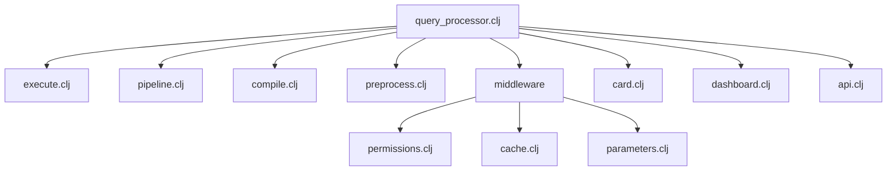
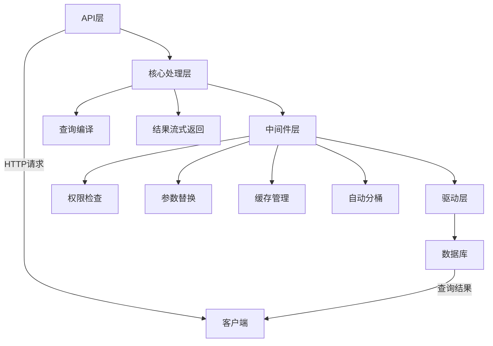
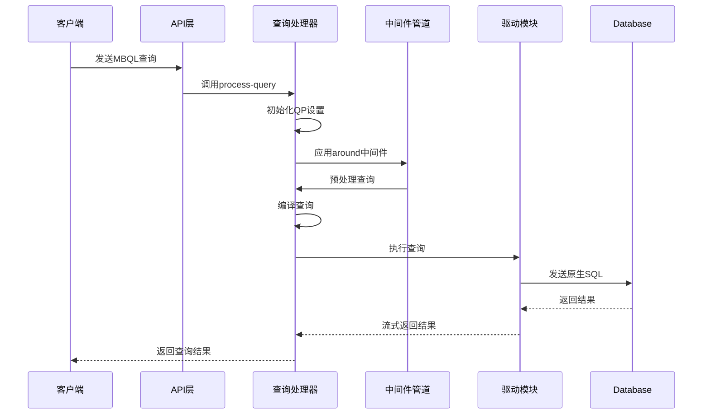
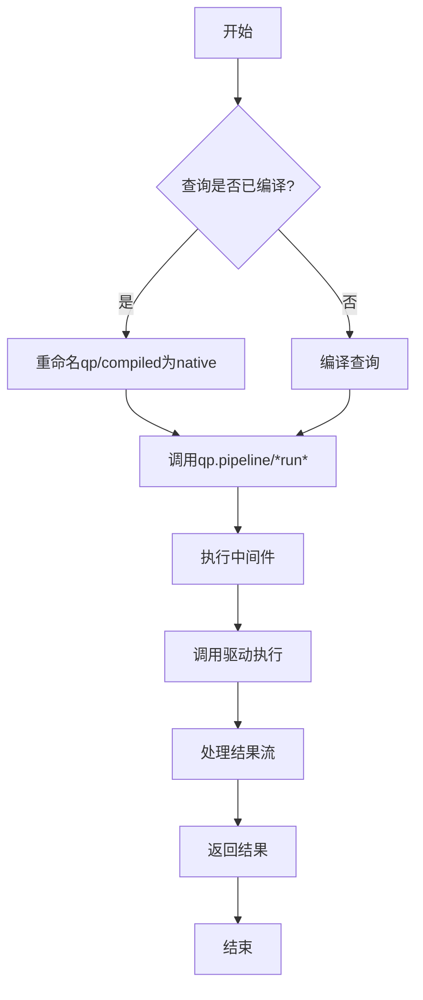
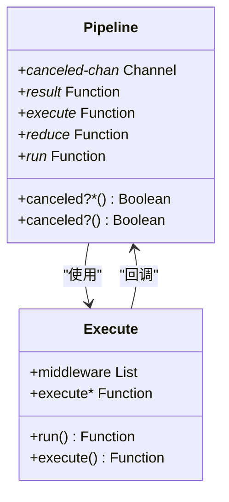
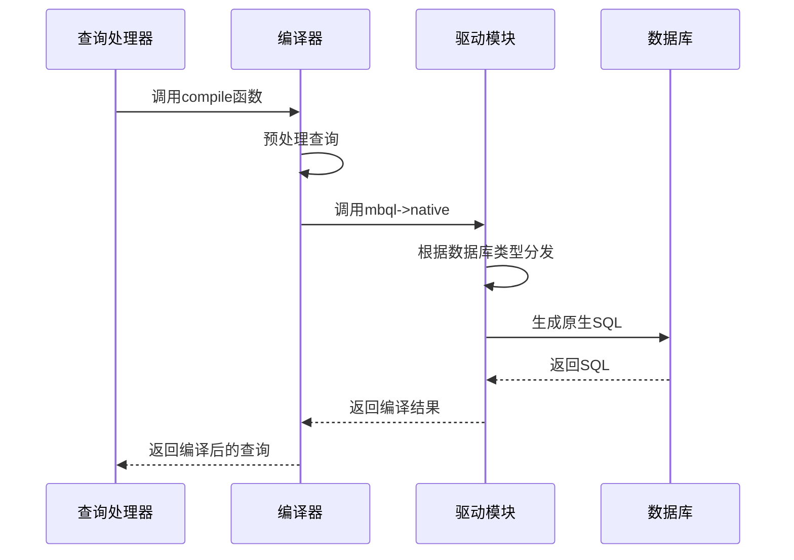
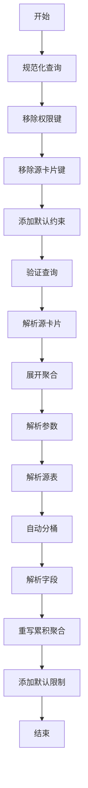
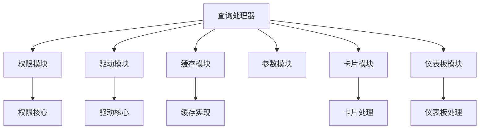

# 查询处理器

<cite>
**本文档引用的文件**   
- [query_processor.clj](file://src/metabase/query_processor.clj)
- [execute.clj](file://src/metabase/query_processor/execute.clj)
- [pipeline.clj](file://src/metabase/query_processor/pipeline.clj)
- [compile.clj](file://src/metabase/query_processor/compile.clj)
- [preprocess.clj](file://src/metabase/query_processor/preprocess.clj)
- [middleware\permissions.clj](file://src/metabase/query_processor/middleware/permissions.clj)
- [middleware\cache.clj](file://src/metabase/query_processor/middleware/cache.clj)
- [middleware\parameters.clj](file://src/metabase/query_processor/middleware/parameters.clj)
- [card.clj](file://src/metabase/query_processor/card.clj)
- [dashboard.clj](file://src/metabase/query_processor/dashboard.clj)
- [api.clj](file://src/metabase/query_processor/api.clj)
- [driver.clj](file://src/metabase/driver.clj)
- [core.clj](file://src/metabase/permissions/core.clj)
</cite>

## 目录
1. [简介](#简介)
2. [项目结构](#项目结构)
3. [核心组件](#核心组件)
4. [架构概述](#架构概述)
5. [详细组件分析](#详细组件分析)
6. [依赖分析](#依赖分析)
7. [性能考虑](#性能考虑)
8. [故障排除指南](#故障排除指南)
9. [结论](#结论)

## 简介
查询处理器是Metabase的核心引擎，负责处理所有查询请求。它接收MBQL查询，通过中间件管道进行预处理，调用驱动模块编译为原生SQL并执行。查询处理器协调了从查询接收、权限检查、参数替换、缓存管理到结果返回的完整生命周期。本文档深入解析查询处理器的架构和工作流程，重点关注其与权限和驱动模块的集成方式。

## 项目结构
查询处理器位于`src/metabase/query_processor`目录下，采用模块化设计，各组件职责分明。核心功能分布在多个文件中，通过中间件模式实现功能扩展和流程控制。

**图源**
- [query_processor.clj](file://src/metabase/query_processor.clj)
- [execute.clj](file://src/metabase/query_processor/execute.clj)
- [pipeline.clj](file://src/metabase/query_processor/pipeline.clj)
- [compile.clj](file://src/metabase/query_processor/compile.clj)
- [preprocess.clj](file://src/metabase/query_processor/preprocess.clj)
- [middleware\permissions.clj](file://src/metabase/query_processor/middleware/permissions.clj)
- [middleware\cache.clj](file://src/metabase/query_processor/middleware/cache.clj)
- [middleware\parameters.clj](file://src/metabase/query_processor/middleware/parameters.clj)
- [card.clj](file://src/metabase/query_processor/card.clj)
- [dashboard.clj](file://src/metabase/query_processor/dashboard.clj)
- [api.clj](file://src/metabase/query_processor/api.clj)

**章节源**
- [query_processor.clj](file://src/metabase/query_processor.clj)
- [execute.clj](file://src/metabase/query_processor/execute.clj)
- [pipeline.clj](file://src/metabase/query_processor/pipeline.clj)
- [compile.clj](file://src/metabase/query_processor/compile.clj)
- [preprocess.clj](file://src/metabase/query_processor/preprocess.clj)
- [middleware](file://src/metabase/query_processor/middleware)

## 核心组件

查询处理器的核心组件包括主入口点、执行引擎、管道协调器、编译器、预处理器以及各种中间件。这些组件协同工作，完成从查询接收至结果返回的完整流程。

**章节源**
- [query_processor.clj](file://src/metabase/query_processor.clj)
- [execute.clj](file://src/metabase/query_processor/execute.clj)
- [pipeline.clj](file://src/metabase/query_processor/pipeline.clj)
- [compile.clj](file://src/metabase/query_processor/compile.clj)
- [preprocess.clj](file://src/metabase/query_processor/preprocess.clj)

## 架构概述

查询处理器采用分层架构，从上至下分为API层、核心处理层、中间件层和驱动层。API层接收外部请求，核心处理层协调查询生命周期，中间件层提供可扩展的功能管道，驱动层负责与具体数据库交互。

**图源**
- [query_processor.clj](file://src/metabase/query_processor.clj)
- [api.clj](file://src/metabase/query_processor/api.clj)
- [execute.clj](file://src/metabase/query_processor/execute.clj)
- [pipeline.clj](file://src/metabase/query_processor/pipeline.clj)
- [compile.clj](file://src/metabase/query_processor/compile.clj)
- [preprocess.clj](file://src/metabase/query_processor/preprocess.clj)

## 详细组件分析

### 主入口点分析
查询处理器的主入口点位于`query_processor.clj`文件中，提供了`process-query`、`userland-query`和`userland-query-with-default-constraints`等核心函数。这些函数构成了查询处理的起点，负责初始化查询上下文并启动处理流程。

**图源**
- [query_processor.clj](file://src/metabase/query_processor.clj)
- [api.clj](file://src/metabase/query_processor/api.clj)

**章节源**
- [query_processor.clj](file://src/metabase/query_processor.clj)
- [api.clj](file://src/metabase/query_processor/api.clj)

### 执行引擎分析
执行引擎是查询处理器的核心，负责管理查询的执行生命周期。它通过`execute`函数协调编译后的查询执行，并处理结果的流式返回。

**图源**
- [execute.clj](file://src/metabase/query_processor/execute.clj)
- [pipeline.clj](file://src/metabase/query_processor/pipeline.clj)

**章节源**
- [execute.clj](file://src/metabase/query_processor/execute.clj)
- [pipeline.clj](file://src/metabase/query_processor/pipeline.clj)

### 管道协调器分析
管道协调器负责协调各个中间件的执行顺序，确保查询处理流程的正确性和可扩展性。它通过动态绑定机制实现中间件的灵活组合。

**图源**
- [pipeline.clj](file://src/metabase/query_processor/pipeline.clj)
- [execute.clj](file://src/metabase/query_processor/execute.clj)

**章节源**
- [pipeline.clj](file://src/metabase/query_processor/pipeline.clj)
- [execute.clj](file://src/metabase/query_processor/execute.clj)

### 编译器分析
编译器负责将MBQL查询转换为特定数据库的原生查询语言。它通过驱动模块的多方法机制实现对不同数据库的支持。

**图源**
- [compile.clj](file://src/metabase/query_processor/compile.clj)
- [driver.clj](file://src/metabase/driver.clj)

**章节源**
- [compile.clj](file://src/metabase/query_processor/compile.clj)
- [driver.clj](file://src/metabase/driver.clj)

### 预处理器分析
预处理器负责在查询执行前进行各种预处理操作，包括规范化、权限检查、参数替换等。它通过中间件管道模式实现功能的可扩展性。

**图源**
- [preprocess.clj](file://src/metabase/query_processor/preprocess.clj)

**章节源**
- [preprocess.clj](file://src/metabase/query_processor/preprocess.clj)

## 依赖分析

查询处理器依赖于多个核心模块，包括权限模块、驱动模块和缓存模块。这些依赖关系通过Clojure的命名空间引用和多方法机制实现。

**图源**
- [query_processor.clj](file://src/metabase/query_processor.clj)
- [core.clj](file://src/metabase/permissions/core.clj)
- [driver.clj](file://src/metabase/driver.clj)
- [card.clj](file://src/metabase/query_processor/card.clj)
- [dashboard.clj](file://src/metabase/query_processor/dashboard.clj)

**章节源**
- [query_processor.clj](file://src/metabase/query_processor.clj)
- [core.clj](file://src/metabase/permissions/core.clj)
- [driver.clj](file://src/metabase/driver.clj)
- [card.clj](file://src/metabase/query_processor/card.clj)
- [dashboard.clj](file://src/metabase/query_processor/dashboard.clj)

## 性能考虑

查询处理器在设计时充分考虑了性能因素，采用了流式处理、缓存机制和异步执行等技术来优化查询性能。特别是通过`*canceled-chan*`机制实现了查询取消功能，避免了不必要的资源消耗。

## 故障排除指南

当查询处理器出现问题时，可以从以下几个方面进行排查：检查权限配置、验证驱动连接、查看缓存状态、分析中间件执行顺序。日志信息是诊断问题的重要依据，特别是查询处理各阶段的调试输出。

**章节源**
- [query_processor.clj](file://src/metabase/query_processor.clj)
- [execute.clj](file://src/metabase/query_processor/execute.clj)
- [pipeline.clj](file://src/metabase/query_processor/pipeline.clj)

## 结论

查询处理器作为Metabase的核心引擎，通过模块化设计和中间件管道模式实现了高度的可扩展性和灵活性。它不仅能够处理复杂的MBQL查询，还能通过与权限和驱动模块的紧密集成，提供安全、高效的查询服务。理解查询处理器的架构和工作原理，对于开发和维护Metabase应用具有重要意义。