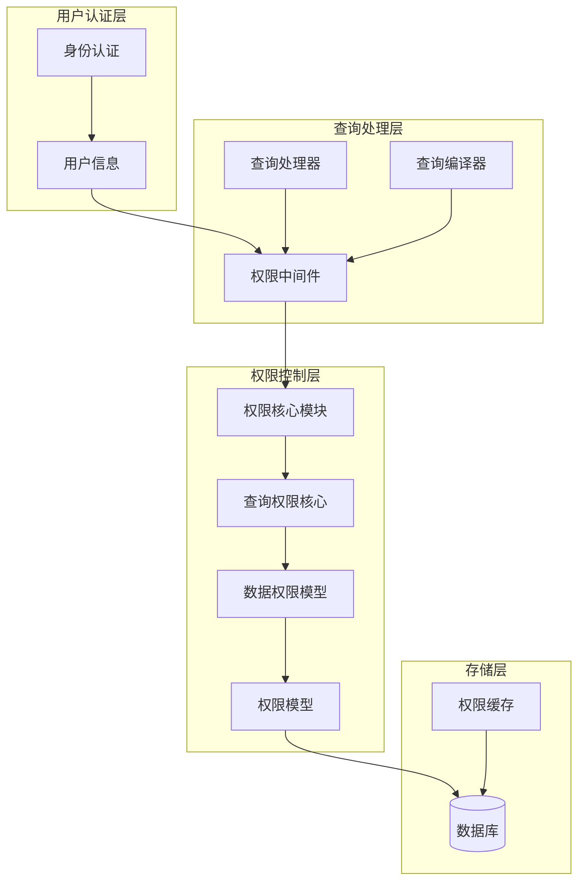
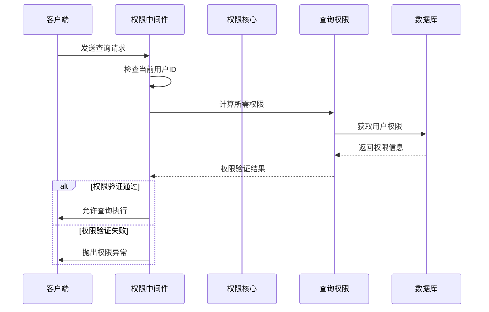
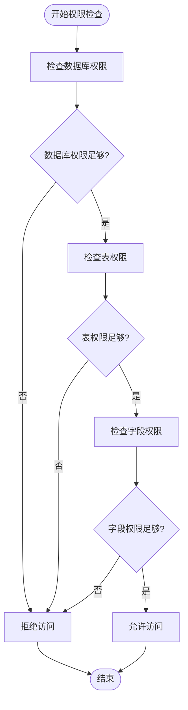
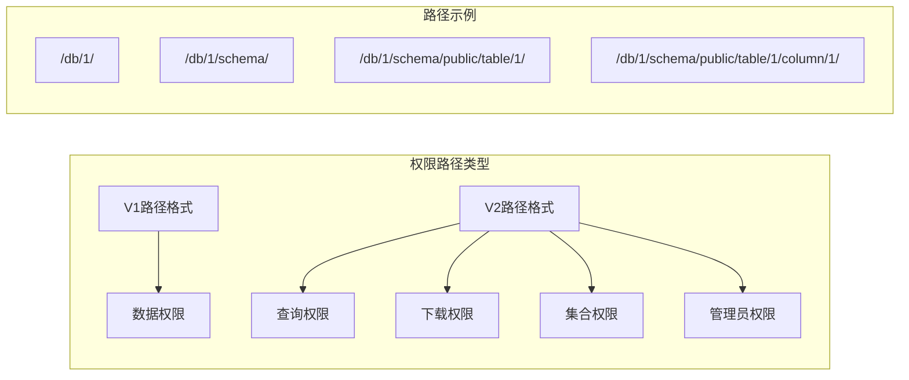
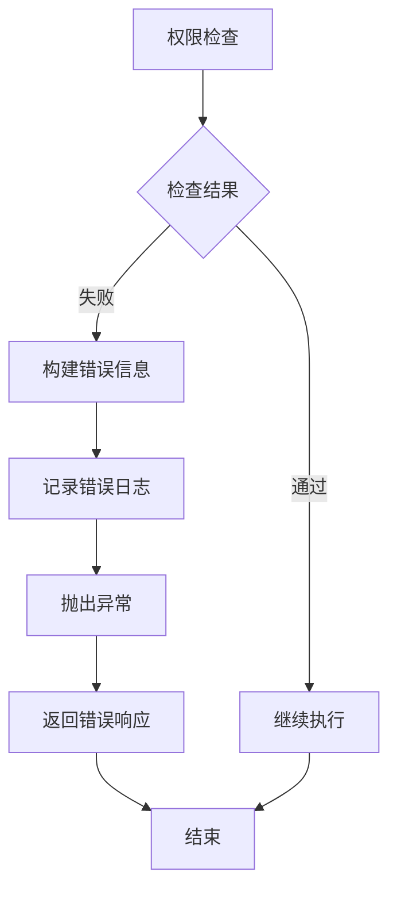
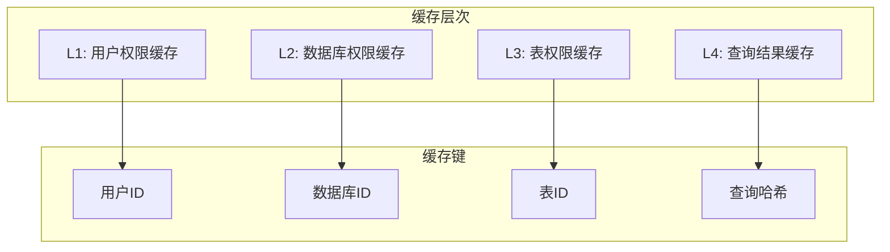
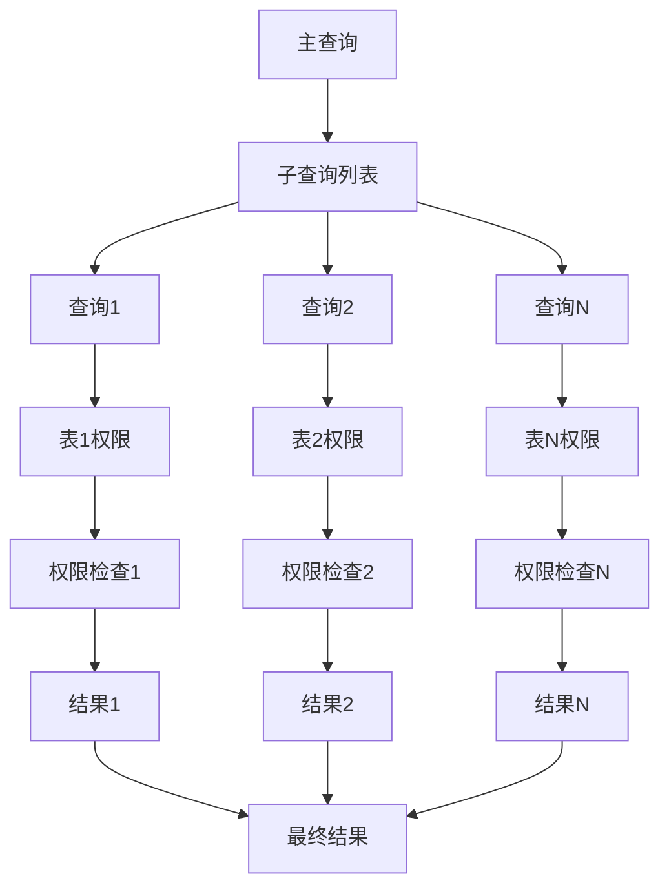

# 查询权限控制

<cite>
**本文档中引用的文件**
- [permissions.clj](file://src/metabase/permissions/core.clj)
- [query_permissions/core.clj](file://src/metabase/query_permissions/core.clj)
- [query_permissions/impl.clj](file://src/metabase/query_permissions/impl.clj)
- [permissions/path.clj](file://src/metabase/permissions/path.clj)
- [permissions/util.clj](file://src/metabase/permissions/util.clj)
- [query_processor/middleware/permissions.clj](file://src/metabase/query_processor/middleware/permissions.clj)
- [permissions/models/data_permissions.clj](file://src/metabase/permissions/models/data_permissions.clj)
- [permissions/schema.clj](file://src/metabase/permissions/schema.clj)
- [query_processor/schema.clj](file://src/metabase/query_processor/schema.clj)
</cite>

## 目录
1. [简介](#简介)
2. [系统架构概览](#系统架构概览)
3. [权限中间件核心](#权限中间件核心)
4. [权限检查粒度](#权限检查粒度)
5. [权限路径匹配算法](#权限路径匹配算法)
6. [权限拒绝错误处理](#权限拒绝错误处理)
7. [性能优化与缓存机制](#性能优化与缓存机制)
8. [复杂查询中的权限继承](#复杂查询中的权限继承)
9. [配置与管理](#配置与管理)
10. [故障排除指南](#故障排除指南)

## 简介

Metabase的查询权限控制系统是一个多层次的安全框架，确保用户只能访问其被授权的数据资源。该系统通过`permissions`中间件在查询执行前进行严格的权限验证，支持数据库级、表级和字段级的细粒度权限控制。

权限控制系统的核心目标：
- 防止未授权的数据访问
- 支持复杂的权限继承关系
- 提供高性能的权限检查
- 维护审计和合规性要求

## 系统架构概览



**图表来源**
- [query_processor/middleware/permissions.clj](file://src/metabase/query_processor/middleware/permissions.clj#L1-L30)
- [permissions/core.clj](file://src/metabase/permissions/core.clj#L1-L30)

**章节来源**
- [query_processor/middleware/permissions.clj](file://src/metabase/query_processor/middleware/permissions.clj#L1-L202)
- [permissions/core.clj](file://src/metabase/permissions/core.clj#L1-L127)

## 权限中间件核心

### 中间件架构

权限中间件是查询权限控制的核心组件，位于查询处理管道的关键位置。它负责在查询执行前进行权限验证，并根据结果决定是否允许查询继续执行。



**图表来源**
- [query_processor/middleware/permissions.clj](file://src/metabase/query_processor/middleware/permissions.clj#L80-L150)
- [query_permissions/impl.clj](file://src/metabase/query_permissions/impl.clj#L400-L454)

### 核心函数流程

权限中间件的主要工作流程包括以下几个关键步骤：

1. **用户身份验证**：确认当前用户的身份和权限集合
2. **查询权限计算**：分析查询所需的权限类型和范围
3. **权限验证**：检查用户是否具有必要的权限
4. **错误处理**：处理权限不足的情况

**章节来源**
- [query_processor/middleware/permissions.clj](file://src/metabase/query_processor/middleware/permissions.clj#L80-L180)
- [query_permissions/impl.clj](file://src/metabase/query_permissions/impl.clj#L400-L454)

## 权限检查粒度

### 数据库级权限

数据库级权限控制整个数据库的访问，是最粗粒度的权限级别。

| 权限类型 | 描述 | 可用值 |
|---------|------|--------|
| `view-data` | 查看数据库中的数据 | `:unrestricted`, `:legacy-no-self-service`, `:blocked` |
| `create-queries` | 创建和运行查询 | `:query-builder-and-native`, `:query-builder`, `:no` |
| `manage-database` | 管理数据库设置 | `:yes`, `:no` |

### 表级权限

表级权限提供更细粒度的控制，可以针对特定表设置不同的访问权限。

| 权限类型 | 描述 | 可用值 |
|---------|------|--------|
| `view-data` | 查看表中的数据 | `:unrestricted`, `:legacy-no-self-service`, `:blocked` |
| `create-queries` | 在表上创建查询 | `:query-builder-and-native`, `:query-builder`, `:no` |
| `download-results` | 下载查询结果 | `:one-million-rows`, `:ten-thousand-rows`, `:no` |
| `manage-table-metadata` | 管理表元数据 | `:yes`, `:no` |

### 字段级权限

字段级权限允许对表中的特定字段进行访问控制，这是最细粒度的权限控制级别。



**图表来源**
- [query_permissions/impl.clj](file://src/metabase/query_permissions/impl.clj#L350-L400)
- [permissions/schema.clj](file://src/metabase/permissions/schema.clj#L10-L34)

**章节来源**
- [permissions/schema.clj](file://src/metabase/permissions/schema.clj#L10-L34)
- [query_permissions/impl.clj](file://src/metabase/query_permissions/impl.clj#L350-L454)

## 权限路径匹配算法

### 路径分类系统

Metabase使用层次化的权限路径系统来精确匹配和验证权限。路径系统支持多种类型的权限，包括数据访问、查询执行、下载等。



**图表来源**
- [permissions/util.clj](file://src/metabase/permissions/util.clj#L80-L150)
- [permissions/path.clj](file://src/metabase/permissions/path.clj#L1-L49)

### 匹配算法实现

权限路径匹配采用前缀匹配算法，确保用户具有足够的权限级别：

1. **路径解析**：将权限路径分解为组件
2. **权限比较**：比较用户权限和所需权限的层级关系
3. **继承检查**：验证权限是否可以从父级继承
4. **最终决策**：确定是否授予访问权限

**章节来源**
- [permissions/util.clj](file://src/metabase/permissions/util.clj#L80-L200)
- [permissions/path.clj](file://src/metabase/permissions/path.clj#L1-L49)

## 权限拒绝错误处理

### 异常类型定义

当权限检查失败时，系统会抛出结构化的异常信息，帮助用户理解权限问题的根源。

| 异常类型 | 错误码 | 描述 |
|---------|--------|------|
| `missing-required-permissions` | 403 | 缺少必需的权限 |
| `invalid-query` | 400 | 查询格式无效 |
| `card-not-found` | 404 | 卡片不存在 |
| `inactive-table` | 400 | 表处于非活动状态 |

### 错误处理流程



**图表来源**
- [query_permissions/impl.clj](file://src/metabase/query_permissions/impl.clj#L30-L50)
- [query_processor/middleware/permissions.clj](file://src/metabase/query_processor/middleware/permissions.clj#L30-L50)

### 错误信息结构

权限异常包含详细的上下文信息，便于诊断和解决权限问题：

```clojure
{
  :type                 :missing-required-permissions
  :required-permissions required-perms
  :actual-permissions   actual-perms
  :permissions-error?   true
  :card-id              card-id
  :query                query
}
```

**章节来源**
- [query_permissions/impl.clj](file://src/metabase/query_permissions/impl.clj#L30-L50)
- [query_processor/middleware/permissions.clj](file://src/metabase/query_processor/middleware/permissions.clj#L30-L50)

## 性能优化与缓存机制

### 缓存策略

为了提高权限检查的性能，系统实现了多层缓存机制：

1. **用户权限缓存**：缓存用户的完整权限集合
2. **数据库权限缓存**：缓存特定数据库的权限信息
3. **表权限缓存**：缓存表级别的权限设置
4. **查询结果缓存**：缓存权限检查的结果



**图表来源**
- [permissions/models/data_permissions.clj](file://src/metabase/permissions/models/data_permissions.clj#L130-L180)

### 性能监控指标

系统监控以下关键性能指标：

| 指标名称 | 描述 | 目标值 |
|---------|------|--------|
| 权限检查时间 | 单次权限检查的平均耗时 | < 10ms |
| 缓存命中率 | 权限缓存的命中比例 | > 90% |
| 内存使用量 | 权限缓存占用的内存 | < 1GB |
| 并发处理能力 | 同时处理的权限检查请求数 | > 1000 QPS |

**章节来源**
- [permissions/models/data_permissions.clj](file://src/metabase/permissions/models/data_permissions.clj#L130-L200)

## 复杂查询中的权限继承

### 嵌套查询权限处理

对于包含子查询、联接查询和聚合查询的复杂SQL语句，权限系统需要递归地检查每个组件的权限需求。



**图表来源**
- [query_permissions/impl.clj](file://src/metabase/query_permissions/impl.clj#L100-L200)

### 权限继承规则

1. **向上继承**：子查询的权限需求向上继承到主查询
2. **向下传播**：主查询的权限限制向下应用到所有子查询
3. **并集合并**：多个子查询的权限需求取并集
4. **交集限制**：权限验证采用交集原则

**章节来源**
- [query_permissions/impl.clj](file://src/metabase/query_permissions/impl.clj#L100-L250)

## 配置与管理

### 权限配置选项

系统提供了丰富的权限配置选项，支持灵活的权限策略定制：

| 配置项 | 类型 | 默认值 | 描述 |
|-------|------|--------|------|
| `permissions.cache.enabled` | Boolean | true | 是否启用权限缓存 |
| `permissions.cache.size` | Integer | 10000 | 缓存条目数量限制 |
| `permissions.cache.ttl` | Long | 3600 | 缓存生存时间（秒） |
| `permissions.strict.mode` | Boolean | false | 是否启用严格模式 |
| `permissions.inherit.enabled` | Boolean | true | 是否启用权限继承 |

### 权限策略管理


**图表来源**
- [permissions/models/data_permissions.clj](file://src/metabase/permissions/models/data_permissions.clj#L500-L600)

**章节来源**
- [permissions/models/data_permissions.clj](file://src/metabase/permissions/models/data_permissions.clj#L500-L700)

## 故障排除指南

### 常见权限问题

1. **权限不足错误**
   - 检查用户所属的权限组
   - 验证数据库和表的权限设置
   - 确认权限继承链是否正确

2. **缓存一致性问题**
   - 清除权限缓存
   - 检查权限更新的及时性
   - 验证缓存配置参数

3. **性能问题**
   - 分析权限检查时间
   - 监控缓存命中率
   - 优化权限查询语句

### 调试工具

系统提供了多种调试工具来帮助诊断权限问题：

- **权限检查日志**：记录详细的权限验证过程
- **性能分析器**：监控权限检查的性能指标
- **权限可视化工具**：图形化展示权限关系

**章节来源**
- [query_processor/middleware/permissions.clj](file://src/metabase/query_processor/middleware/permissions.clj#L180-L202)
- [permissions/models/data_permissions.clj](file://src/metabase/permissions/models/data_permissions.clj#L800-L971)

## 结论

Metabase的查询权限控制系统通过多层次的安全机制，确保了数据访问的安全性和合规性。该系统具有以下特点：

- **细粒度控制**：支持数据库、表、字段级别的权限控制
- **高性能设计**：通过多层缓存和优化算法保证查询效率
- **灵活配置**：提供丰富的配置选项满足不同场景需求
- **完善监控**：内置监控和调试工具便于运维管理

通过合理配置和使用这些权限控制功能，组织可以建立健壮的数据安全防护体系，同时保持良好的用户体验。