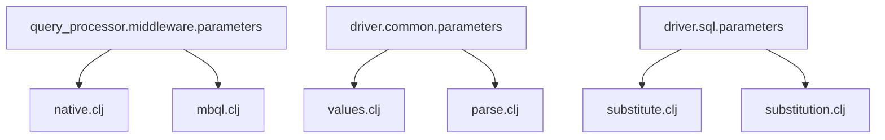
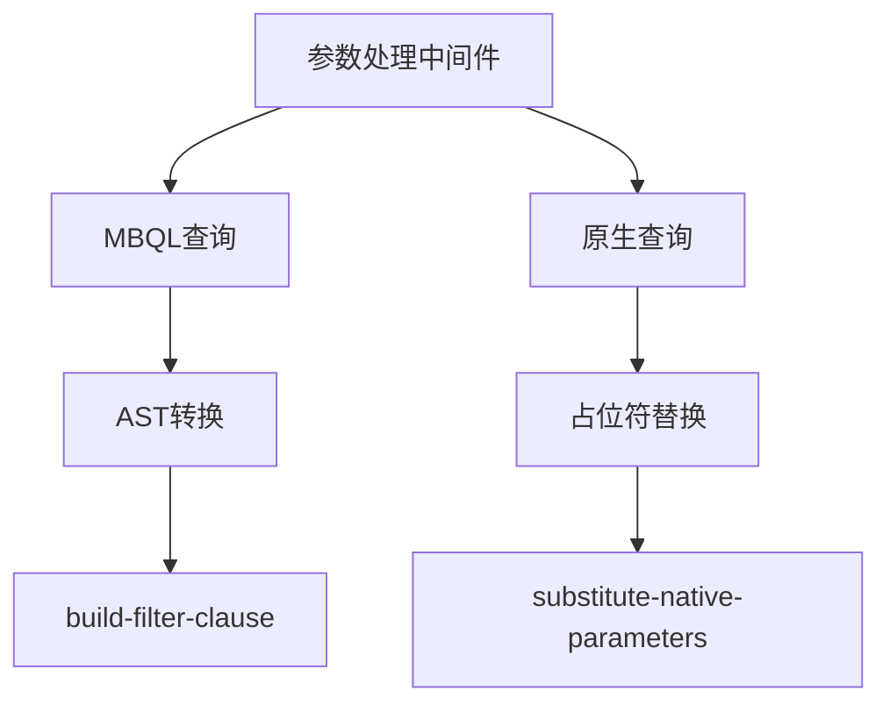
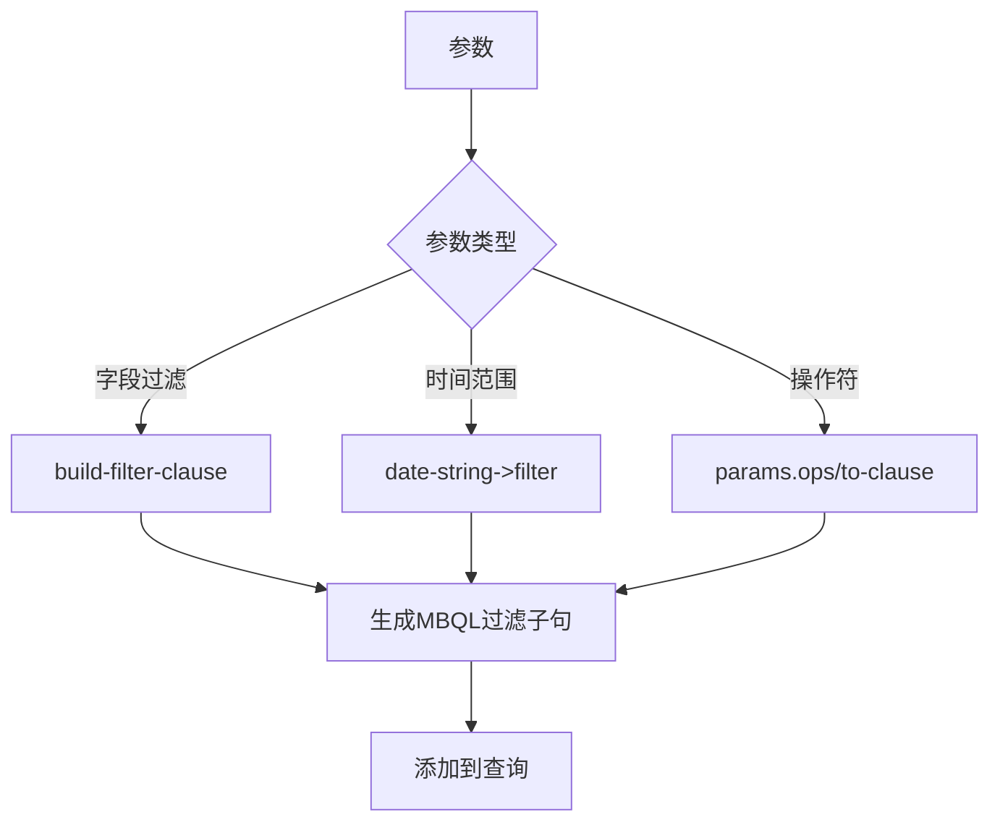
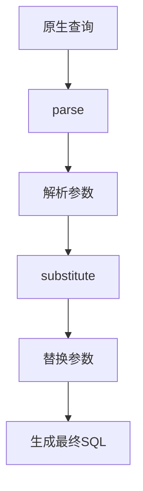
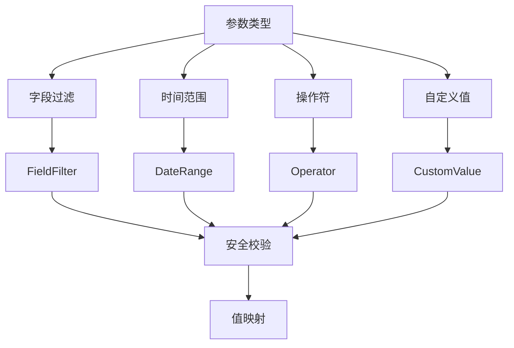
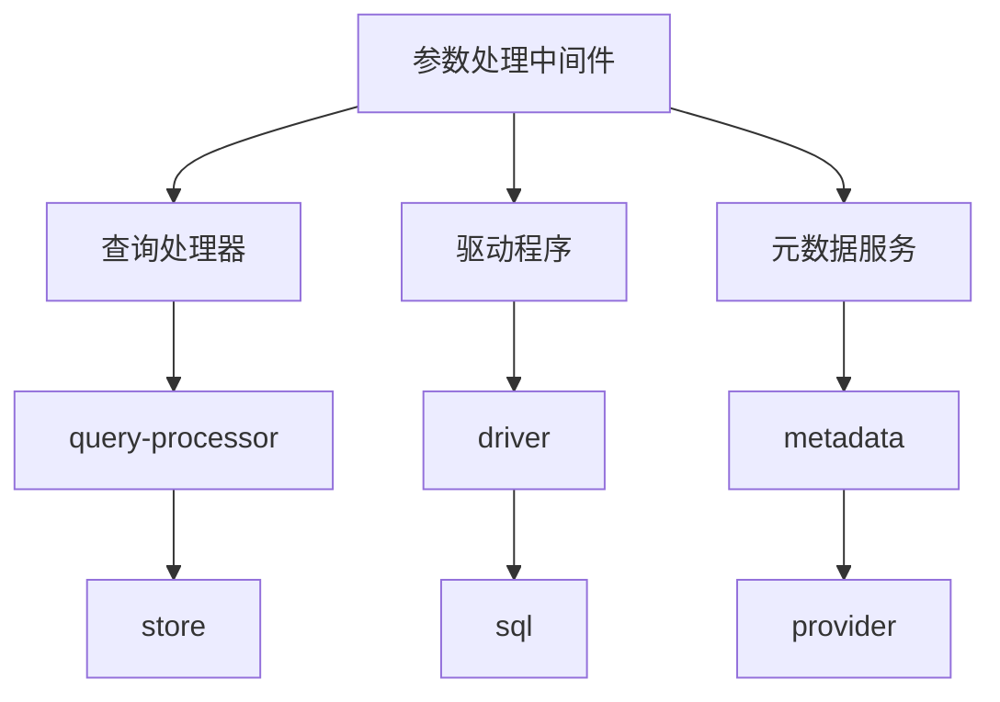

# 参数处理中间件

<cite>
**本文档引用的文件**
- [native.clj](file://src/metabase/query_processor/middleware/parameters/native.clj)
- [mbql.clj](file://src/metabase/query_processor/middleware/parameters/mbql.clj)
- [values.clj](file://src/metabase/driver/common/parameters/values.clj)
- [parse.clj](file://src/metabase/driver/common/parameters/parse.clj)
- [substitute.clj](file://src/metabase/driver/sql/parameters/substitute.clj)
- [substitution.clj](file://src/metabase/driver/sql/parameters/substitution.clj)
- [dates.clj](file://src/metabase/query_processor/parameters/dates.clj)
- [params.clj](file://src/metabase/parameters/params.clj)
</cite>

## 目录
1. [简介](#简介)
2. [项目结构](#项目结构)
3. [核心组件](#核心组件)
4. [架构概述](#架构概述)
5. [详细组件分析](#详细组件分析)
6. [依赖分析](#依赖分析)
7. [性能考虑](#性能考虑)
8. [故障排除指南](#故障排除指南)
9. [结论](#结论)

## 简介
本文档详细说明了Metabase中参数处理中间件的工作机制，重点阐述了`parameters`中间件如何解析并替换MBQL和原生查询中的动态参数。文档涵盖了参数类型识别逻辑、安全校验机制、值映射过程、默认值处理、多级嵌套参数解析、沙箱环境下的参数限制以及常见注入攻击的防御措施。

## 项目结构
参数处理中间件主要分布在`src/metabase/query_processor/middleware/parameters`目录下，涉及MBQL和原生查询的参数处理。相关功能也分布在`src/metabase/driver/common/parameters`和`src/metabase/driver/sql/parameters`目录中，处理参数的解析、值提取和替换。

**Diagram sources**
- [native.clj](file://src/metabase/query_processor/middleware/parameters/native.clj)
- [mbql.clj](file://src/metabase/query_processor/middleware/parameters/mbql.clj)
- [values.clj](file://src/metabase/driver/common/parameters/values.clj)
- [parse.clj](file://src/metabase/driver/common/parameters/parse.clj)
- [substitute.clj](file://src/metabase/driver/sql/parameters/substitute.clj)
- [substitution.clj](file://src/metabase/driver/sql/parameters/substitution.clj)

**Section sources**
- [native.clj](file://src/metabase/query_processor/middleware/parameters/native.clj)
- [mbql.clj](file://src/metabase/query_processor/middleware/parameters/mbql.clj)
- [values.clj](file://src/metabase/driver/common/parameters/values.clj)
- [parse.clj](file://src/metabase/driver/common/parameters/parse.clj)
- [substitute.clj](file://src/metabase/driver/sql/parameters/substitute.clj)
- [substitution.clj](file://src/metabase/driver/sql/parameters/substitution.clj)

## 核心组件
参数处理中间件的核心组件包括参数解析、值提取和替换三个主要步骤。对于MBQL查询，中间件通过AST转换来处理参数；对于原生查询，则通过占位符替换来实现。

**Section sources**
- [native.clj](file://src/metabase/query_processor/middleware/parameters/native.clj)
- [mbql.clj](file://src/metabase/query_processor/middleware/parameters/mbql.clj)
- [values.clj](file://src/metabase/driver/common/parameters/values.clj)

## 架构概述
参数处理中间件的架构分为MBQL和原生查询两个主要分支。MBQL查询通过AST转换来处理参数，而原生查询则通过字符串解析和占位符替换来实现。

**Diagram sources**
- [mbql.clj](file://src/metabase/query_processor/middleware/parameters/mbql.clj)
- [native.clj](file://src/metabase/query_processor/middleware/parameters/native.clj)

## 详细组件分析

### MBQL参数处理分析
MBQL参数处理通过AST转换来实现，将参数转换为相应的MBQL过滤子句。

**Diagram sources**
- [mbql.clj](file://src/metabase/query_processor/middleware/parameters/mbql.clj)
- [dates.clj](file://src/metabase/query_processor/parameters/dates.clj)

**Section sources**
- [mbql.clj](file://src/metabase/query_processor/middleware/parameters/mbql.clj)
- [dates.clj](file://src/metabase/query_processor/parameters/dates.clj)

### 原生查询参数处理分析
原生查询参数处理通过字符串解析和占位符替换来实现，将参数值插入到SQL查询中。

**Diagram sources**
- [native.clj](file://src/metabase/query_processor/middleware/parameters/native.clj)
- [parse.clj](file://src/metabase/driver/common/parameters/parse.clj)
- [substitute.clj](file://src/metabase/driver/sql/parameters/substitute.clj)

**Section sources**
- [native.clj](file://src/metabase/query_processor/middleware/parameters/native.clj)
- [parse.clj](file://src/metabase/driver/common/parameters/parse.clj)
- [substitute.clj](file://src/metabase/driver/sql/parameters/substitute.clj)

### 参数类型识别与安全校验
参数处理中间件支持多种参数类型，包括字段过滤、时间范围、操作符等，并通过严格的安全校验机制防止注入攻击。

**Diagram sources**
- [values.clj](file://src/metabase/driver/common/parameters/values.clj)
- [substitution.clj](file://src/metabase/driver/sql/parameters/substitution.clj)

**Section sources**
- [values.clj](file://src/metabase/driver/common/parameters/values.clj)
- [substitution.clj](file://src/metabase/driver/sql/parameters/substitution.clj)

## 依赖分析
参数处理中间件依赖于多个核心组件，包括查询处理器、驱动程序和元数据服务。

**Diagram sources**
- [native.clj](file://src/metabase/query_processor/middleware/parameters/native.clj)
- [mbql.clj](file://src/metabase/query_processor/middleware/parameters/mbql.clj)
- [values.clj](file://src/metabase/driver/common/parameters/values.clj)

## 性能考虑
参数处理中间件在设计时考虑了性能优化，通过缓存和预处理来提高查询执行效率。

## 故障排除指南
当参数处理出现问题时，可以检查参数定义、值映射和安全校验等环节。

**Section sources**
- [params.clj](file://src/metabase/parameters/params.clj)
- [values.clj](file://src/metabase/driver/common/parameters/values.clj)

## 结论
参数处理中间件是Metabase中实现动态查询的关键组件，通过灵活的参数类型支持和严格的安全校验机制，为用户提供强大的查询能力。